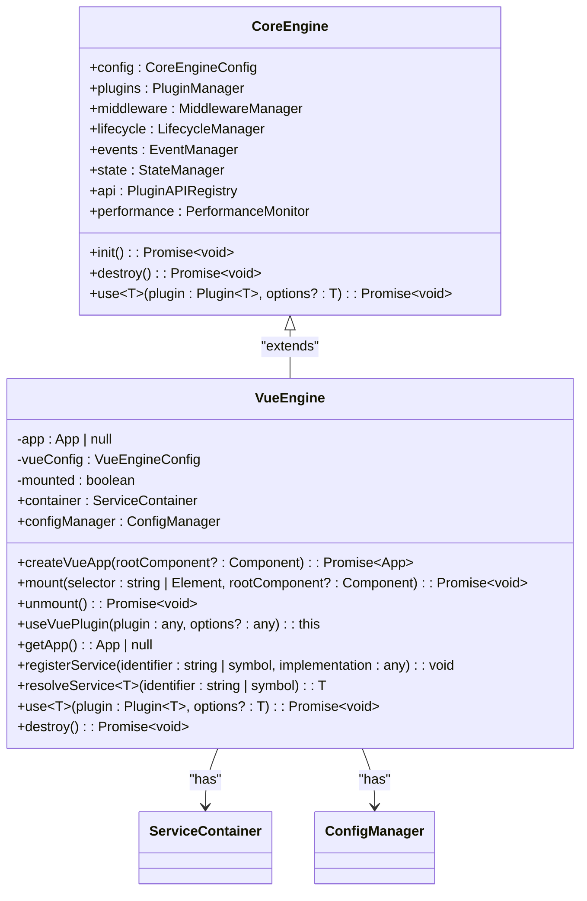
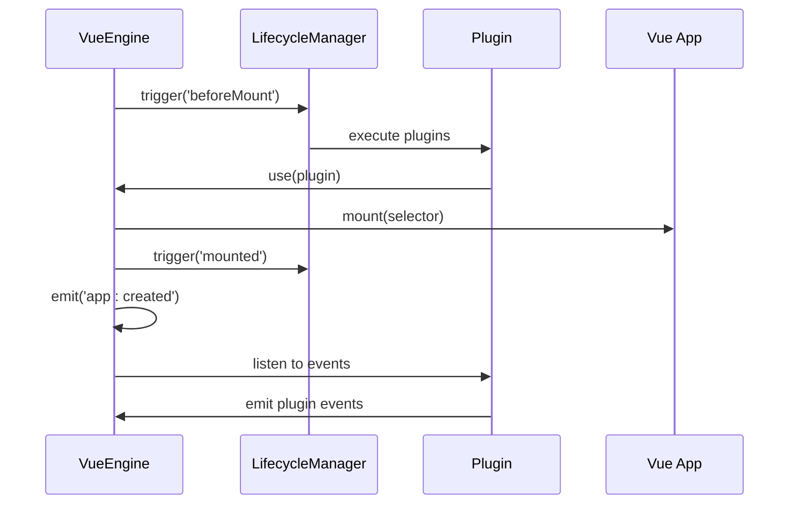
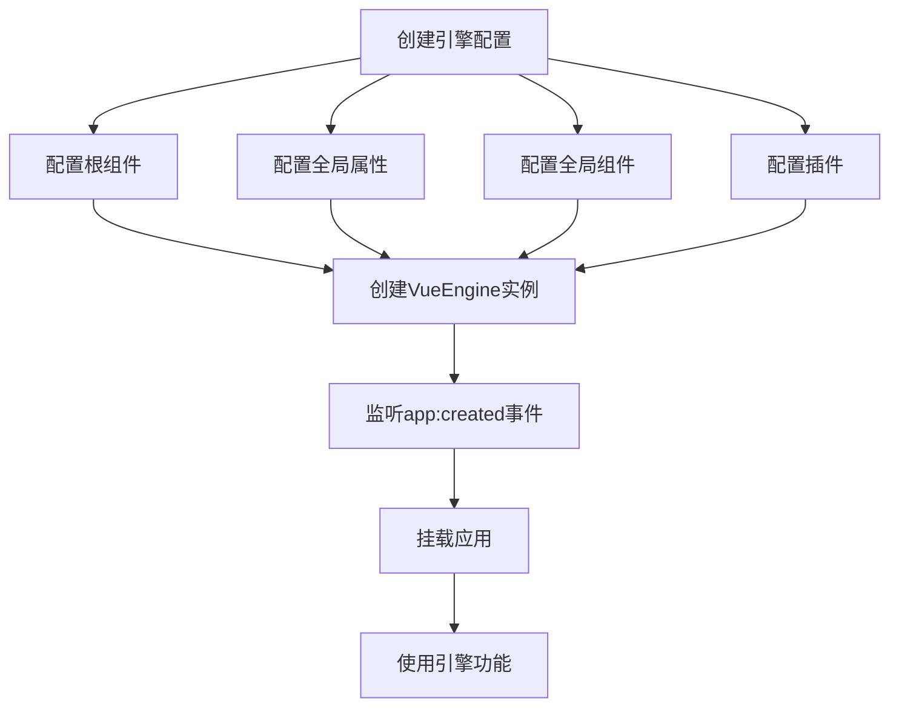

# Vue引擎API

<cite>
**本文档引用文件**  
- [vue-engine.ts](file://packages\vue3\src\engine\vue-engine.ts)
- [core-engine.ts](file://packages\core\src\engine\core-engine.ts)
- [use-engine.ts](file://packages\vue3\src\composables\use-engine.ts)
- [service-container.ts](file://packages\core\src\container\service-container.ts)
- [main.ts](file://packages\vue3\example\src\main.ts)
- [router-plugin.ts](file://packages\vue3\src\plugins\router-plugin.ts)
- [i18n-plugin.ts](file://packages\vue3\src\plugins\i18n-plugin.ts)
</cite>

## 目录
1. [简介](#简介)
2. [VueEngine类概述](#vueengine类概述)
3. [核心方法详解](#核心方法详解)
   - [createVueApp](#createvueapp)
   - [mount](#mount)
   - [unmount](#unmount)
   - [useVuePlugin](#usevueplugin)
   - [getApp](#getapp)
   - [registerService](#registerservice)
   - [resolveService](#resolveservice)
4. [依赖注入与provide/inject机制](#依赖注入与provideinject机制)
5. [事件系统与生命周期集成](#事件系统与生命周期集成)
6. [配置系统与全局设置](#配置系统与全局设置)
7. [代码示例](#代码示例)

## 简介
VueEngine是LDesign引擎框架中专为Vue3设计的核心引擎实现，它继承自核心引擎并扩展了Vue3特定的功能。该引擎提供了完整的应用生命周期管理、依赖注入、插件系统和配置管理功能，为构建现代化的Vue3应用提供了坚实的基础。

**本文档引用文件**  
- [vue-engine.ts](file://packages\vue3\src\engine\vue-engine.ts)

## VueEngine类概述
VueEngine类是Vue3应用的核心引擎实现，它继承自CoreEngine并提供了Vue3框架特有的功能扩展。该类通过继承机制整合了核心引擎的所有功能，同时添加了Vue3应用创建、挂载和管理的特定方法。



**Diagram sources**  
- [vue-engine.ts](file://packages\vue3\src\engine\vue-engine.ts#L74-L363)
- [core-engine.ts](file://packages\core\src\engine\core-engine.ts#L75-L363)

**Section sources**  
- [vue-engine.ts](file://packages\vue3\src\engine\vue-engine.ts#L74-L363)

## 核心方法详解

### createVueApp
创建Vue应用实例的方法，负责初始化Vue应用并注入引擎依赖。

**方法签名**
```typescript
async createVueApp(rootComponent?: Component): Promise<App>
```

**参数说明**
- `rootComponent`: 可选的根组件。如果未提供，则使用配置中的根组件。参数优先级：方法参数 > 配置参数。

**返回值**
- 返回Promise<App>，解析为创建的Vue应用实例。

**异常处理**
- 当未提供根组件且配置中也没有根组件时，抛出"Root component is required"错误。

**执行流程**
1. 确定根组件（优先使用参数，其次使用配置）
2. 创建Vue应用实例
3. 配置全局属性、组件和指令
4. 通过provide注入引擎实例、服务容器和配置管理器
5. 发射app:created事件
6. 返回Vue应用实例

**Section sources**  
- [vue-engine.ts](file://packages\vue3\src\engine\vue-engine.ts#L129-L183)

### mount
挂载应用到DOM元素的方法，集成生命周期管理。

**方法签名**
```typescript
async mount(selector: string | Element, rootComponent?: Component): Promise<void>
```

**参数说明**
- `selector`: 挂载目标选择器或DOM元素，支持CSS选择器字符串或Element对象。
- `rootComponent`: 可选的根组件，用于动态指定根组件。

**执行流程**
1. 检查是否已挂载，避免重复挂载
2. 初始化引擎（触发beforeInit、init、afterInit生命周期）
3. 创建Vue应用（如果尚未创建）
4. 触发beforeMount生命周期（插件在此阶段安装）
5. 调用Vue应用的mount方法
6. 标记为已挂载状态
7. 触发mounted生命周期

**异常处理**
- 如果应用已挂载，会发出警告但不抛出异常。

**Section sources**  
- [vue-engine.ts](file://packages\vue3\src\engine\vue-engine.ts#L192-L221)

### unmount
卸载应用并清理资源的方法。

**方法签名**
```typescript
async unmount(): Promise<void>
```

**执行流程**
1. 检查是否已挂载
2. 触发beforeUnmount生命周期
3. 调用Vue应用的unmount方法
4. 标记为未挂载状态
5. 触发unmounted生命周期
6. 销毁引擎（清理所有资源）

**资源清理**
- 清理Vue应用实例
- 清理服务容器
- 调用父类的destroy方法进行完整清理

**Section sources**  
- [vue-engine.ts](file://packages\vue3\src\engine\vue-engine.ts#L226-L247)

### useVuePlugin
使用原生Vue插件的方法。

**方法签名**
```typescript
useVuePlugin(plugin: any, options?: any): this
```

**参数说明**
- `plugin`: Vue插件对象，可以是函数或包含install方法的对象。
- `options`: 插件选项，传递给插件的配置参数。

**返回值**
- 返回this，支持链式调用。

**异常处理**
- 如果Vue应用尚未创建，抛出"Vue app not created. Call createVueApp() first."错误。

**执行流程**
1. 检查Vue应用是否存在
2. 调用Vue应用的use方法安装插件
3. 返回当前实例

**Section sources**  
- [vue-engine.ts](file://packages\vue3\src\engine\vue-engine.ts#L255-L262)

### getApp
获取Vue应用实例的方法。

**方法签名**
```typescript
getApp(): App | null
```

**返回值**
- 返回Vue应用实例，如果应用尚未创建则返回null。

**使用场景**
- 在需要直接访问Vue应用实例的场景下使用
- 用于调试和高级操作

**Section sources**  
- [vue-engine.ts](file://packages\vue3\src\engine\vue-engine.ts#L269-L271)

### registerService
注册服务到依赖注入容器的方法。

**方法签名**
```typescript
registerService(identifier: string | symbol, implementation: any): void
```

**参数说明**
- `identifier`: 服务标识符，可以是字符串或Symbol。
- `implementation`: 服务实现，可以是构造函数、工厂函数或实例。

**执行流程**
- 调用服务容器的singleton方法注册为单例服务
- 服务将在整个应用生命周期内保持单一实例

**Section sources**  
- [vue-engine.ts](file://packages\vue3\src\engine\vue-engine.ts#L279-L281)

### resolveService
从依赖注入容器解析服务的方法。

**方法签名**
```typescript
resolveService<T = any>(identifier: string | symbol): T
```

**参数说明**
- `identifier`: 服务标识符，与注册时使用的标识符匹配。

**返回值**
- 返回指定类型的服务实例。

**泛型支持**
- 支持TypeScript泛型，提供类型安全的依赖注入。

**Section sources**  
- [vue-engine.ts](file://packages\vue3\src\engine\vue-engine.ts#L289-L291)

## 依赖注入与provide/inject机制
VueEngine通过多种机制向组件树提供引擎实例和核心服务，确保组件能够方便地访问这些核心功能。

```mermaid
flowchart TD
A[VueEngine实例] --> B["provide(ENGINE_KEY, this)"]
A --> C["provide(CONTAINER_KEY, container)"]
A --> D["provide(CONFIG_KEY, configManager)"]
A --> E["provide('engine', this)"]
A --> F["provide('container', container)"]
A --> G["provide('config', configManager)"]
A --> H["app.config.globalProperties.$engine = this"]
A --> I["app.config.globalProperties.$container = container"]
A --> J["app.config.globalProperties.$config = configManager"]
B --> K[组件使用inject(ENGINE_KEY)]
C --> L[组件使用inject(CONTAINER_KEY)]
D --> M[组件使用inject(CONFIG_KEY)]
E --> N[组件使用inject('engine')]
F --> O[组件使用inject('container')]
G --> P[组件使用inject('config')]
H --> Q[组件使用this.$engine]
I --> R[组件使用this.$container]
J --> S[组件使用this.$config]
```

**Diagram sources**  
- [vue-engine.ts](file://packages\vue3\src\engine\vue-engine.ts#L161-L174)
- [use-engine.ts](file://packages\vue3\src\composables\use-engine.ts#L16-L26)

**Section sources**  
- [vue-engine.ts](file://packages\vue3\src\engine\vue-engine.ts#L161-L174)
- [use-engine.ts](file://packages\vue3\src\composables\use-engine.ts#L16-L26)

### 提供机制
VueEngine使用以下三种方式提供核心服务：

1. **Symbol键provide**：使用Symbol作为键进行provide，确保类型安全和避免命名冲突。
2. **字符串键provide**：同时提供字符串键，保持向后兼容性。
3. **全局属性**：设置app.config.globalProperties，使服务在所有组件中可通过this访问。

### 兼容性策略
为了确保向后兼容，VueEngine同时支持新旧两种访问方式：
- 新方式：使用Symbol键和useEngine等组合式API
- 旧方式：使用字符串键和全局属性$engine

这种双重机制确保了平滑的迁移路径，允许开发者逐步采用新的最佳实践。

## 事件系统与生命周期集成
VueEngine通过事件系统和生命周期管理器实现了组件间的松耦合通信和应用生命周期的精细控制。



**Diagram sources**  
- [vue-engine.ts](file://packages\vue3\src\engine\vue-engine.ts#L177-L216)
- [core-engine.ts](file://packages\core\src\engine\core-engine.ts#L181-L190)

**Section sources**  
- [vue-engine.ts](file://packages\vue3\src\engine\vue-engine.ts#L177-L216)

### 生命周期钩子
VueEngine集成了以下生命周期钩子：

- **beforeMount**: 在应用挂载前触发，插件系统在此阶段安装
- **mounted**: 在应用挂载后触发
- **beforeUnmount**: 在应用卸载前触发
- **unmounted**: 在应用卸载后触发

### 事件系统
VueEngine提供了以下关键事件：

- **app:created**: Vue应用创建后发射，供插件使用
- **\***: 通配符事件，可用于监听所有事件

插件可以通过监听这些事件来执行特定逻辑，实现松耦合的扩展机制。

## 配置系统与全局设置
VueEngine通过配置系统支持全局组件、指令和属性的设置，为应用提供统一的配置管理。

**VueEngineConfig接口**
```typescript
interface VueEngineConfig extends CoreEngineConfig {
  app?: {
    rootComponent?: Component
    mountOptions?: Record<string, any>
    globalProperties?: Record<string, any>
    globalComponents?: Record<string, Component>
    globalDirectives?: Record<string, any>
  }
  plugins?: Plugin[]
}
```

**Section sources**  
- [vue-engine.ts](file://packages\vue3\src\engine\vue-engine.ts#L25-L41)

### 配置优先级
配置系统遵循以下优先级规则：

1. 方法参数优先级最高
2. 配置对象次之
3. 默认值最低

例如在createVueApp方法中，rootComponent参数优先于配置中的rootComponent。

### 全局设置
VueEngine支持以下全局设置：

- **全局属性**: 通过globalProperties配置，可在所有组件中访问
- **全局组件**: 通过globalComponents注册，无需局部导入即可使用
- **全局指令**: 通过globalDirectives注册，可在模板中直接使用

这些设置在createVueApp方法中被应用到Vue应用实例上。

## 代码示例
以下是使用VueEngine的完整代码示例，展示了如何配置和使用引擎的各种功能。



**Diagram sources**  
- [main.ts](file://packages\vue3\example\src\main.ts#L63-L130)
- [vue-engine.ts](file://packages\vue3\src\engine\vue-engine.ts#L381-L383)

**Section sources**  
- [main.ts](file://packages\vue3\example\src\main.ts#L63-L130)

### 基本用法
```typescript
// 创建VueEngine实例
const engine = new VueEngine({
  name: 'My App',
  debug: true,
  app: {
    rootComponent: App,
    globalProperties: {
      $api: apiService
    },
    globalComponents: {
      'my-button': MyButton
    }
  },
  plugins: [loggerPlugin, themePlugin]
})

// 监听app:created事件
engine.events.on('app:created', ({ app }) => {
  console.log('Vue应用已创建', app)
})

// 挂载应用
await engine.mount('#app')
```

### 依赖注入使用
```typescript
// 注册服务
engine.registerService('userService', new UserService())

// 解析服务
const userService = engine.resolveService<UserService>('userService')

// 在组件中使用
const engine = useEngine()
const userService = useService('userService')
```

### 插件集成
```typescript
// 使用Vue原生插件
engine.useVuePlugin(VueRouter)
engine.useVuePlugin(Vuex)

// 使用自定义插件
await engine.use({
  name: 'custom',
  install: (context) => {
    // 插件逻辑
  }
})
```