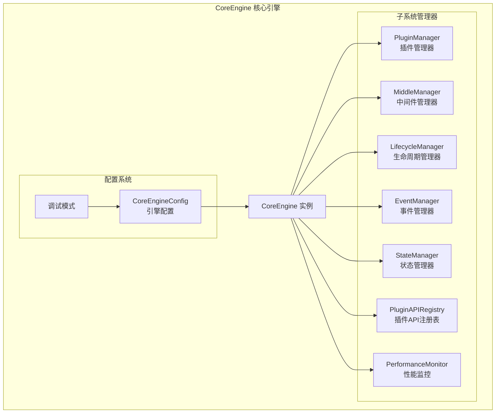
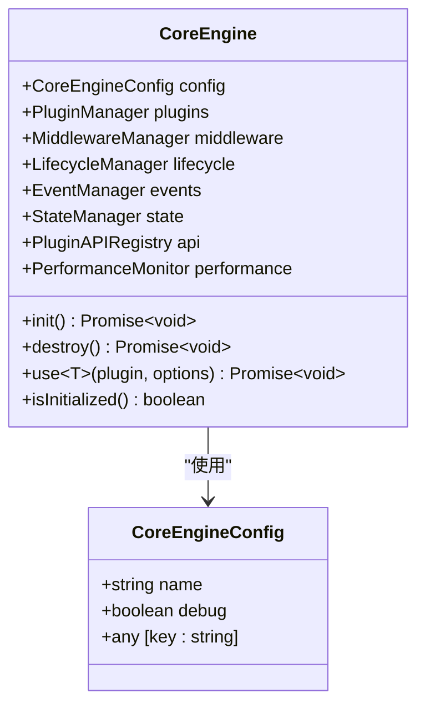
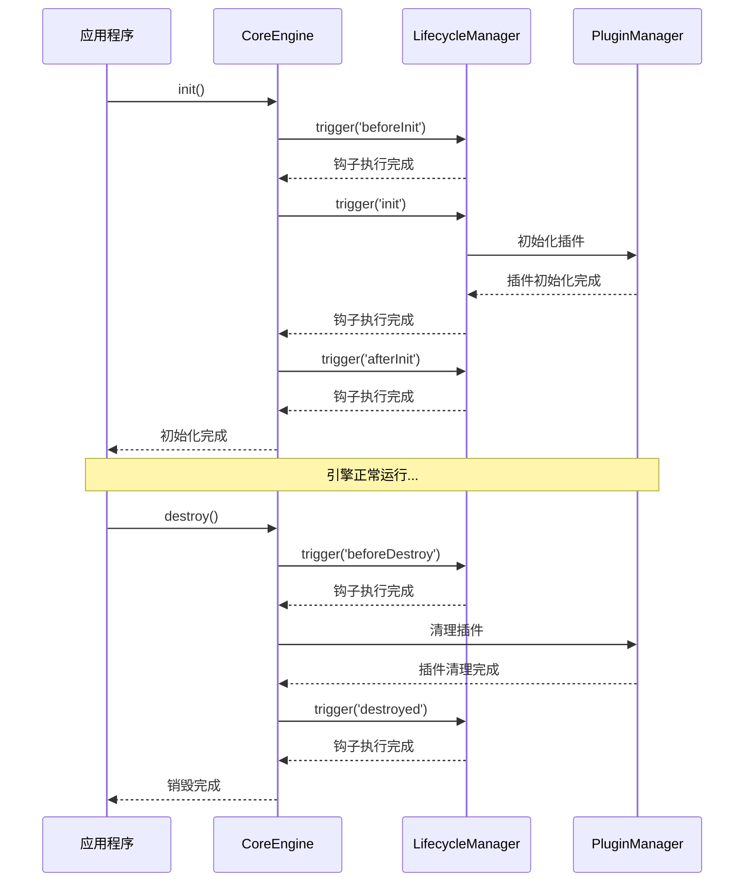
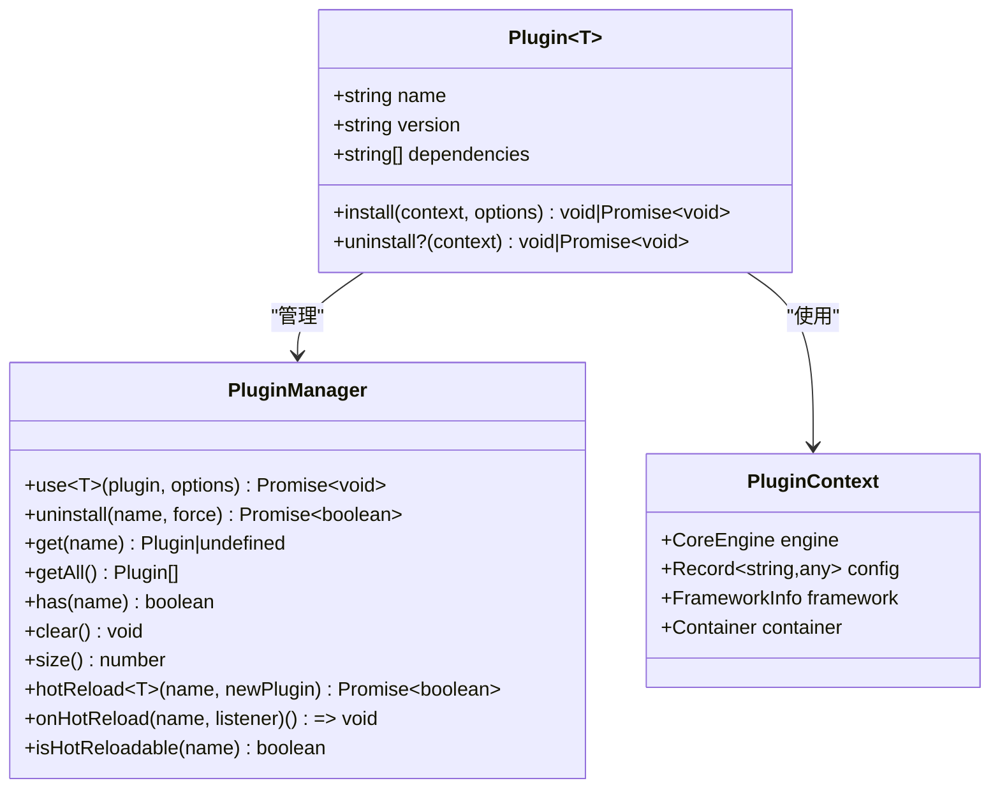
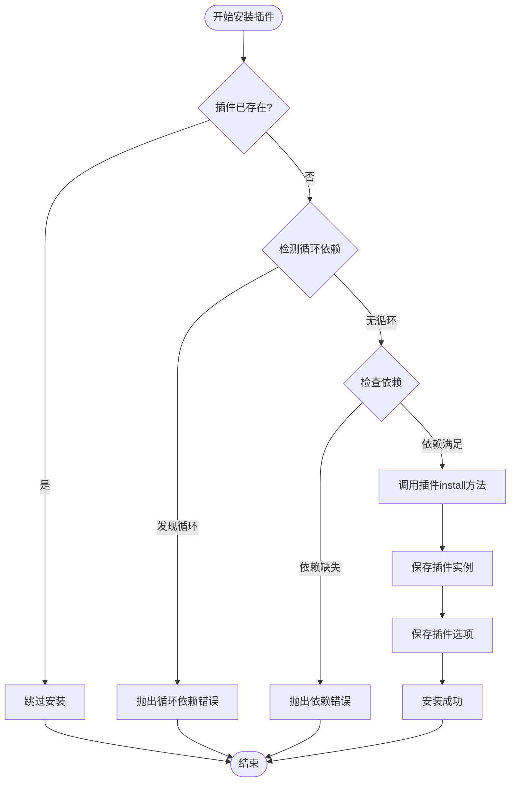
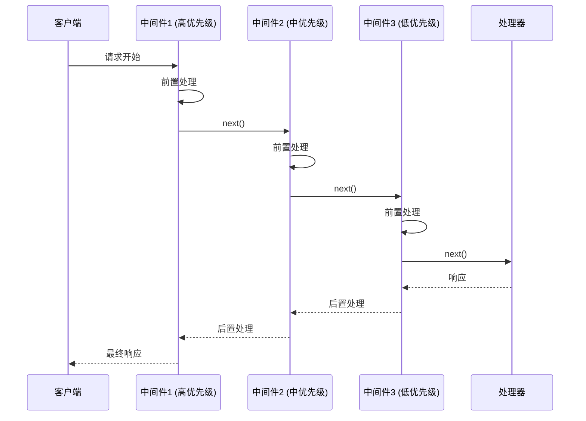
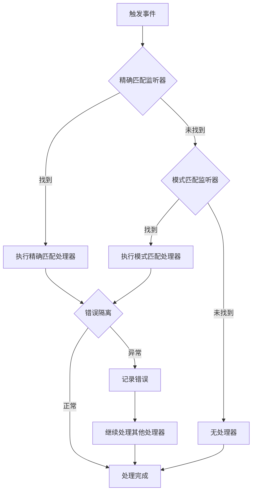
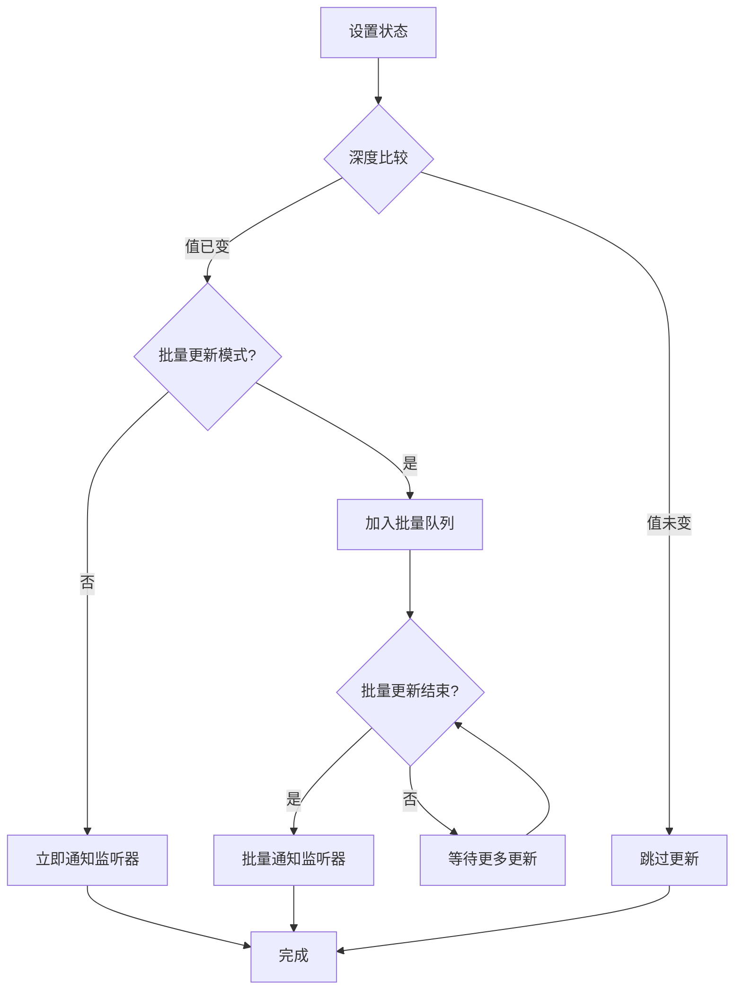

# 核心引擎API参考文档

<cite>
**本文档中引用的文件**
- [core-engine.ts](file://packages/core/src/engine/core-engine.ts)
- [index.ts](file://packages/core/src/engine/index.ts)
- [engine.ts](file://packages/core/src/types/engine.ts)
- [plugin.ts](file://packages/core/src/types/plugin.ts)
- [plugin-manager.ts](file://packages/core/src/plugin/plugin-manager.ts)
- [lifecycle-manager.ts](file://packages/core/src/lifecycle/lifecycle-manager.ts)
- [event-manager.ts](file://packages/core/src/event/event-manager.ts)
- [state-manager.ts](file://packages/core/src/state/state-manager.ts)
- [middleware-manager.ts](file://packages/core/src/middleware/middleware-manager.ts)
- [types.ts](file://packages/core/src/config/types.ts)
- [core-engine.test.ts](file://packages/core/src/__tests__/core-engine.test.ts)
</cite>

## 目录
1. [简介](#简介)
2. [核心架构](#核心架构)
3. [CoreEngine接口详解](#coreengine接口详解)
4. [生命周期管理](#生命周期管理)
5. [插件系统](#插件系统)
6. [中间件系统](#中间件系统)
7. [事件系统](#事件系统)
8. [状态管理](#状态管理)
9. [性能监控](#性能监控)
10. [配置系统](#配置系统)
11. [API方法详细说明](#api方法详细说明)
12. [错误处理与故障排除](#错误处理与故障排除)
13. [最佳实践](#最佳实践)

## 简介

CoreEngine是LDesign框架的核心引擎，提供了一个统一的应用程序运行时环境。它整合了插件、中间件、生命周期、事件和状态管理等多个子系统，为应用程序提供了强大的扩展性和灵活性。

### 主要特性

- **模块化架构**：清晰分离的子系统，便于维护和扩展
- **异步生命周期**：完整的初始化和销毁流程管理
- **插件生态系统**：支持插件依赖管理和版本控制
- **中间件管道**：基于洋葱模型的请求处理管道
- **事件驱动**：高性能的发布-订阅事件系统
- **状态管理**：响应式的全局状态管理
- **性能监控**：内置的性能指标收集和分析

## 核心架构



**图表来源**
- [core-engine.ts](file://packages/core/src/engine/core-engine.ts#L75-L139)
- [engine.ts](file://packages/core/src/types/engine.ts#L28-L53)

**章节来源**
- [core-engine.ts](file://packages/core/src/engine/core-engine.ts#L29-L74)
- [engine.ts](file://packages/core/src/types/engine.ts#L1-L53)

## CoreEngine接口详解

CoreEngine接口定义了引擎的核心功能，包含了所有子系统的访问入口。

### 核心属性

| 属性名 | 类型 | 描述 |
|--------|------|------|
| `config` | `CoreEngineConfig` | 引擎配置对象，包含name和debug等配置项 |
| `plugins` | `PluginManager` | 插件管理系统，负责插件的安装、卸载和依赖管理 |
| `middleware` | `MiddlewareManager` | 中间件管理系统，实现洋葱模型的请求处理管道 |
| `lifecycle` | `LifecycleManager` | 生命周期管理系统，提供应用生命周期钩子 |
| `events` | `EventManager` | 事件系统，实现发布-订阅模式的消息传递 |
| `state` | `StateManager` | 状态管理系统，提供全局状态的响应式管理 |
| `api` | `PluginAPIRegistry` | 插件API注册表，支持插件间的类型安全通信 |
| `performance` | `PerformanceMonitor` | 性能监控系统，收集和分析性能指标 |

### 配置系统



**图表来源**
- [engine.ts](file://packages/core/src/types/engine.ts#L16-L22)
- [engine.ts](file://packages/core/src/types/engine.ts#L28-L53)

**章节来源**
- [engine.ts](file://packages/core/src/types/engine.ts#L16-L53)
- [core-engine.ts](file://packages/core/src/engine/core-engine.ts#L75-L139)

## 生命周期管理

CoreEngine提供了完整的生命周期管理功能，支持异步钩子处理和错误隔离。

### 生命周期钩子类型

| 钩子名称 | 触发时机 | 用途 |
|----------|----------|------|
| `beforeInit` | 初始化前 | 执行初始化前的准备工作 |
| `init` | 初始化时 | 执行核心初始化逻辑 |
| `afterInit` | 初始化后 | 执行初始化后的收尾工作 |
| `beforeDestroy` | 销毁前 | 执行销毁前的清理工作 |
| `destroyed` | 销毁后 | 执行销毁后的最终清理 |

### 生命周期流程图



**图表来源**
- [core-engine.ts](file://packages/core/src/engine/core-engine.ts#L166-L269)
- [lifecycle-manager.ts](file://packages/core/src/lifecycle/lifecycle-manager.ts#L16-L65)

**章节来源**
- [lifecycle-manager.ts](file://packages/core/src/lifecycle/lifecycle-manager.ts#L16-L355)
- [core-engine.ts](file://packages/core/src/engine/core-engine.ts#L141-L269)

## 插件系统

插件系统是CoreEngine的核心扩展机制，支持插件依赖管理、版本控制和生命周期管理。

### 插件接口定义



**图表来源**
- [plugin.ts](file://packages/core/src/types/plugin.ts#L40-L51)
- [plugin-manager.ts](file://packages/core/src/plugin/plugin-manager.ts#L42-L77)
- [plugin.ts](file://packages/core/src/types/plugin.ts#L22-L35)

### 插件安装流程



**图表来源**
- [plugin-manager.ts](file://packages/core/src/plugin/plugin-manager.ts#L92-L143)

### 插件API注册表

插件API注册表提供了类型安全的插件间通信机制：

| 功能 | 描述 | 使用场景 |
|------|------|----------|
| 类型安全 | 基于TypeScript的类型检查 | 防止API调用错误 |
| 命名空间隔离 | 使用命名空间避免冲突 | 多插件协作 |
| 动态注册 | 运行时动态注册API | 插件热重载 |
| 版本兼容 | 支持API版本管理 | 插件升级 |

**章节来源**
- [plugin-manager.ts](file://packages/core/src/plugin/plugin-manager.ts#L1-L530)
- [plugin.ts](file://packages/core/src/types/plugin.ts#L1-L344)

## 中间件系统

中间件系统实现了基于洋葱模型的请求处理管道，支持优先级排序和错误处理。

### 中间件执行模型



**图表来源**
- [middleware-manager.ts](file://packages/core/src/middleware/middleware-manager.ts#L196-L258)

### 中间件优先级

| 优先级范围 | 用途 | 示例 |
|------------|------|------|
| 1000+ | 系统级中间件 | 身份验证、日志记录 |
| 100-999 | 应用级中间件 | 数据验证、权限检查 |
| 10-99 | 功能级中间件 | 缓存、限流 |
| 1-9 | 用户级中间件 | 调试、性能监控 |

**章节来源**
- [middleware-manager.ts](file://packages/core/src/middleware/middleware-manager.ts#L1-L343)

## 事件系统

事件系统基于发布-订阅模式，提供高性能的消息传递机制。

### 事件处理流程



**图表来源**
- [event-manager.ts](file://packages/core/src/event/event-manager.ts#L100-L132)

### 通配符事件支持

| 模式 | 匹配范围 | 示例 |
|------|----------|------|
| `user:*` | 所有以`user:`开头的事件 | `user:login`, `user:logout` |
| `*` | 任意单层事件 | `app:start`, `app:stop` |
| `**` | 任意层级事件 | `**`, `user:**` |

**章节来源**
- [event-manager.ts](file://packages/core/src/event/event-manager.ts#L1-L494)

## 状态管理

状态管理系统提供响应式的全局状态管理，支持批量更新和内存优化。

### 状态变更流程



**图表来源**
- [state-manager.ts](file://packages/core/src/state/state-manager.ts#L72-L90)

### 性能优化特性

| 优化技术 | 描述 | 效果 |
|----------|------|------|
| 深度比较 | 避免不必要的监听器调用 | 减少CPU开销 |
| 批量更新 | 合并多个状态变更 | 减少监听器触发次数 |
| 内存清理 | 自动清理无用的监听器 | 防止内存泄漏 |
| 引用相等检查 | 基本类型的快速比较 | 提升性能 |

**章节来源**
- [state-manager.ts](file://packages/core/src/state/state-manager.ts#L1-L419)

## 性能监控

性能监控系统提供实时的性能指标收集和分析功能。

### 监控指标

| 指标类别 | 具体指标 | 用途 |
|----------|----------|------|
| 生命周期 | 钩子执行时间 | 性能瓶颈识别 |
| 插件系统 | 插件安装/卸载耗时 | 插件性能分析 |
| 中间件 | 中间件链执行时间 | 请求处理优化 |
| 事件系统 | 事件触发频率 | 事件系统监控 |
| 状态管理 | 状态变更次数 | 状态使用分析 |

**章节来源**
- [core-engine.ts](file://packages/core/src/engine/core-engine.ts#L130-L138)

## 配置系统

配置系统提供了灵活的配置管理功能，支持多种配置源和环境变量。

### 配置源优先级

| 优先级 | 配置源 | 示例 |
|--------|--------|------|
| 100 | 程序员指定配置 | `{ debug: true }` |
| 90 | 环境变量 | `ENGINE_DEBUG=true` |
| 80 | 配置文件 | `app.config.ts` |
| 70 | 默认配置 | `{ name: 'LDesign Engine' }` |

**章节来源**
- [types.ts](file://packages/core/src/config/types.ts#L1-L187)

## API方法详细说明

### 核心引擎创建

#### `createCoreEngine(config?: CoreEngineConfig): CoreEngine`

创建CoreEngine实例的工厂函数。

**参数说明**
- `config` (可选): 引擎配置对象
  - `name`: 应用名称，默认为`'LDesign Engine'`
  - `debug`: 调试模式开关，默认为`false`
  - `[key: string]`: 自定义配置项

**返回值**: CoreEngine实例

**使用示例**
```typescript
import { createCoreEngine } from '@ldesign/engine-core'

// 基础创建
const engine = createCoreEngine()

// 带配置的创建
const engineWithConfig = createCoreEngine({
  name: 'My Application',
  debug: true
})
```

**章节来源**
- [core-engine.ts](file://packages/core/src/engine/core-engine.ts#L360-L364)

### 初始化方法

#### `init(): Promise<void>`

初始化引擎及其所有子系统。

**异步执行流程**
1. 检查是否已初始化，避免重复初始化
2. 触发`beforeInit`生命周期钩子
3. 触发`init`生命周期钩子
4. 标记引擎为已初始化状态
5. 触发`afterInit`生命周期钩子

**错误处理策略**
- 初始化过程中的任何错误都会被捕获并重新抛出
- 不会中断其他子系统的初始化
- 调试模式下会输出详细的错误信息

**使用示例**
```typescript
await engine.init()

// 监听初始化钩子
engine.lifecycle.on('beforeInit', () => {
  console.log('准备初始化...')
})

engine.lifecycle.on('init', async () => {
  // 执行初始化逻辑
  await loadConfiguration()
})

engine.lifecycle.on('afterInit', () => {
  console.log('初始化完成')
})
```

**章节来源**
- [core-engine.ts](file://packages/core/src/engine/core-engine.ts#L166-L200)

### 销毁方法

#### `destroy(): Promise<void>`

销毁引擎并清理所有资源。

**异步执行流程**
1. 检查引擎是否已初始化
2. 触发`beforeDestroy`生命周期钩子
3. 清理所有管理器（按逆序）
4. 标记引擎为未初始化状态
5. 触发`destroyed`生命周期钩子
6. 清理生命周期管理器

**内存优化策略**
- 彻底清理所有监听器和回调函数
- 清空所有状态和配置
- 断开所有事件连接
- 释放所有插件引用

**使用示例**
```typescript
await engine.destroy()

// 监听销毁钩子
engine.lifecycle.on('beforeDestroy', () => {
  console.log('开始清理资源...')
})

engine.lifecycle.on('destroyed', () => {
  console.log('引擎已完全销毁')
})
```

**章节来源**
- [core-engine.ts](file://packages/core/src/engine/core-engine.ts#L225-L269)

### 插件注册方法

#### `use<T = any>(plugin: Plugin<T>, options?: T): Promise<void>`

注册插件的快捷方法，等价于`engine.plugins.use()`。

**参数说明**
- `plugin`: 要注册的插件对象
  - `name`: 插件名称（必需）
  - `version`: 插件版本（可选）
  - `dependencies`: 插件依赖数组（可选）
  - `install`: 安装函数（必需）
  - `uninstall`: 卸载函数（可选）
- `options`: 传递给插件的配置选项

**返回值**: Promise<void>，表示异步安装过程

**使用示例**
```typescript
// 基础插件注册
await engine.use({
  name: 'logger',
  version: '1.0.0',
  install(ctx) {
    ctx.engine.events.on('*', (event, data) => {
      console.log(`事件触发: ${event}`, data)
    })
  }
})

// 带选项的插件注册
await engine.use({
  name: 'database',
  install(ctx, options) {
    connectToDatabase(options.connectionString)
  }
}, {
  connectionString: 'mongodb://localhost:27017/myapp'
})
```

**章节来源**
- [core-engine.ts](file://packages/core/src/engine/core-engine.ts#L292-L294)

### 初始化状态检查

#### `isInitialized(): boolean`

检查引擎是否已成功初始化。

**返回值**: boolean，表示引擎的初始化状态

**使用示例**
```typescript
if (engine.isInitialized()) {
  console.log('引擎已就绪')
} else {
  console.log('引擎尚未初始化')
}
```

**章节来源**
- [core-engine.ts](file://packages/core/src/engine/core-engine.ts#L298-L309)

## 错误处理与故障排除

### 常见初始化失败场景

#### 1. 插件依赖冲突

**问题描述**: 插件依赖的其他插件未安装或版本不兼容

**排查步骤**
```typescript
// 检查插件依赖关系
try {
  await engine.use(plugin)
} catch (error) {
  if (error.message.includes('requires the following dependencies')) {
    console.log('缺失依赖:', error.message)
    // 解决方案：先安装依赖插件
    await engine.use(dependencyPlugin)
    await engine.use(plugin)
  }
}
```

**解决方案**
- 确保所有依赖插件都已正确安装
- 检查插件版本兼容性
- 使用`engine.plugins.getDependencyTree()`查看依赖关系

#### 2. 配置缺失或无效

**问题描述**: 引擎配置不完整或格式错误

**排查步骤**
```typescript
// 检查配置有效性
console.log('当前配置:', engine.config)
console.log('调试模式:', engine.config.debug)

// 验证关键配置项
if (!engine.config.name) {
  console.error('应用名称不能为空')
}
```

**解决方案**
- 提供完整的配置对象
- 使用默认配置作为后备
- 在调试模式下启用详细日志

#### 3. 内存泄漏问题

**问题描述**: 引擎销毁后仍有监听器或定时器未清理

**排查步骤**
```typescript
// 检查内存使用情况
console.log('插件数量:', engine.plugins.size())
console.log('中间件数量:', engine.middleware.size())
console.log('事件监听器:', engine.events.listenerCount('all'))
console.log('状态键数量:', engine.state.keys().length)
```

**解决方案**
- 确保正确调用`destroy()`方法
- 在插件中正确清理资源
- 使用一次性监听器避免手动清理

### 调试技巧

#### 启用调试模式

```typescript
const engine = createCoreEngine({
  name: 'Debug App',
  debug: true  // 启用详细日志
})
```

#### 监控引擎状态

```typescript
// 监控插件安装状态
engine.lifecycle.on('init', () => {
  console.log('已安装插件:', engine.plugins.getAll().map(p => p.name))
})

// 监控中间件执行
engine.middleware.use({
  name: 'monitor',
  execute: async (ctx, next) => {
    const start = Date.now()
    await next()
    const duration = Date.now() - start
    console.log(`中间件执行时间: ${duration}ms`)
  }
})
```

## 最佳实践

### 1. 引擎生命周期管理

```typescript
class MyApp {
  private engine: CoreEngine
  
  async start() {
    this.engine = createCoreEngine({
      name: 'MyApp',
      debug: process.env.NODE_ENV === 'development'
    })
    
    try {
      await this.engine.init()
      await this.setupPlugins()
      await this.startApplication()
    } catch (error) {
      console.error('应用启动失败:', error)
      await this.cleanup()
      throw error
    }
  }
  
  async stop() {
    await this.cleanup()
  }
  
  private async cleanup() {
    if (this.engine) {
      await this.engine.destroy()
    }
  }
}
```

### 2. 插件开发规范

```typescript
export function createMyPlugin(): Plugin<{
  apiKey: string
  timeout?: number
}> {
  return {
    name: 'my-plugin',
    version: '1.0.0',
    dependencies: ['logger'],
    
    async install(context, options) {
      // 验证配置
      if (!options.apiKey) {
        throw new Error('apiKey is required')
      }
      
      // 注册插件API
      context.engine.api.register('myPlugin', {
        callApi: async (endpoint: string) => {
          // API调用逻辑
        }
      })
      
      // 监听生命周期钩子
      context.engine.lifecycle.on('beforeDestroy', () => {
        // 清理资源
      })
    },
    
    uninstall(context) {
      // 清理插件资源
    }
  }
}
```

### 3. 错误处理模式

```typescript
// 安全的插件安装
async function safeInstallPlugin(engine: CoreEngine, plugin: Plugin) {
  try {
    await engine.use(plugin)
    console.log(`插件 ${plugin.name} 安装成功`)
  } catch (error) {
    console.error(`插件 ${plugin.name} 安装失败:`, error)
    // 可选：回滚操作
  }
}

// 中间件错误处理
engine.middleware.use({
  name: 'error-handler',
  execute: async (ctx, next) => {
    try {
      await next()
    } catch (error) {
      console.error('中间件执行错误:', error)
      ctx.error = error
      // 可选：发送错误报告
    }
  }
})
```

### 4. 性能优化建议

```typescript
// 批量状态更新
engine.state.batch(() => {
  engine.state.set('user', user)
  engine.state.set('settings', settings)
  engine.state.set('preferences', preferences)
})

// 中间件优先级优化
engine.middleware.use({
  name: 'fast-auth',
  priority: 1000, // 高优先级，快速失败
  execute: async (ctx, next) => {
    if (!isValidToken(ctx.token)) {
      ctx.cancelled = true
      return
    }
    await next()
  }
})

// 事件监听器优化
const unsubscribe = engine.events.on('data-update', debounce((data) => {
  // 处理数据更新
}, 100))

// 清理监听器
unsubscribe()
```

通过遵循这些最佳实践，您可以构建稳定、高效且易于维护的LDesign应用程序。