# Vue3引擎实现

<cite>
**本文档引用的文件**
- [vue-engine.ts](file://packages/vue3/src/engine/vue-engine.ts)
- [core-engine.ts](file://packages/core/src/engine/core-engine.ts)
- [use-engine.ts](file://packages/vue3/src/composables/use-engine.ts)
- [index.ts](file://packages/vue3/src/index.ts)
- [router-plugin.ts](file://packages/vue3/src/plugins/router-plugin.ts)
- [i18n-plugin.ts](file://packages/vue3/src/plugins/i18n-plugin.ts)
- [main.ts](file://packages/vue3/example/src/main.ts)
- [lifecycle-manager.ts](file://packages/core/src/lifecycle/lifecycle-manager.ts)
- [event-manager.ts](file://packages/core/src/event/event-manager.ts)
</cite>

## 目录
1. [简介](#简介)
2. [项目结构](#项目结构)
3. [VueEngine类架构](#vueengine类架构)
4. [核心组件分析](#核心组件分析)
5. [初始化流程](#初始化流程)
6. [生命周期钩子桥接机制](#生命周期钩子桥接机制)
7. [依赖注入容器集成](#依赖注入容器集成)
8. [配置管理系统](#配置管理系统)
9. [useEngine组合式API](#useengine组合式api)
10. [插件系统集成](#插件系统集成)
11. [性能监控封装](#性能监控封装)
12. [挂载与销毁过程](#挂载与销毁过程)
13. [错误处理与调试](#错误处理与调试)
14. [最佳实践](#最佳实践)

## 简介

VueEngine是基于Vue3框架的高级应用引擎实现，它继承自CoreEngine并扩展了Vue3特定的功能。该引擎提供了完整的Vue3应用生命周期管理、依赖注入、插件系统集成、路由支持等功能，同时保持了与核心引擎的兼容性和扩展性。

VueEngine的设计理念是提供一个统一的、可扩展的应用平台，让开发者能够轻松地构建复杂的Vue3应用程序，同时享受现代前端开发的最佳实践。

## 项目结构

VueEngine项目采用模块化架构，主要分为以下几个部分：

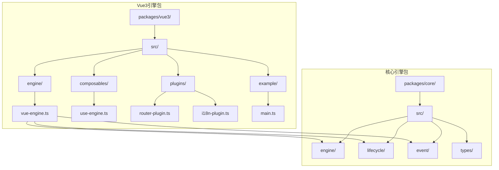
```mermaid
graph TB
subgraph "Vue3引擎包"
A[packages/vue3/] --> B[src/]
B --> C[engine/]
B --> D[composables/]
B --> E[plugins/]
B --> F[example/]
C --> G[vue-engine.ts]
D --> H[use-engine.ts]
E --> I[router-plugin.ts]
E --> J[i18n-plugin.ts]
F --> K[main.ts]
end
subgraph "核心引擎包"
L[packages/core/] --> M[src/]
M --> N[engine/]
M --> O[lifecycle/]
M --> P[event/]
M --> Q[types/]
end
G --> N
G --> O
G --> P
```

**图表来源**
- [vue-engine.ts](file://packages/vue3/src/engine/vue-engine.ts#L1-L50)
- [core-engine.ts](file://packages/core/src/engine/core-engine.ts#L1-L50)

**章节来源**
- [vue-engine.ts](file://packages/vue3/src/engine/vue-engine.ts#L1-L393)
- [index.ts](file://packages/vue3/src/index.ts#L1-L19)

## VueEngine类架构

VueEngine类继承自CoreEngine，扩展了Vue3特定的功能和适配器。其架构设计遵循单一职责原则，每个组件都有明确的职责分工。

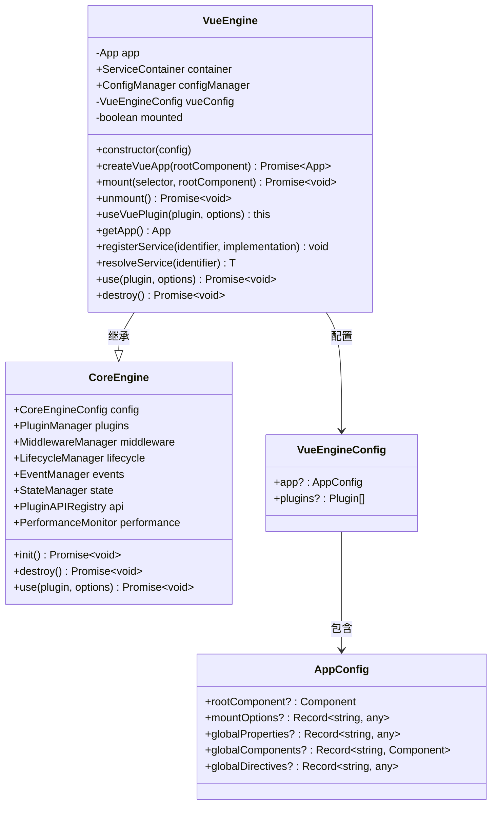
```mermaid
classDiagram
class CoreEngine {
+CoreEngineConfig config
+PluginManager plugins
+MiddlewareManager middleware
+LifecycleManager lifecycle
+EventManager events
+StateManager state
+PluginAPIRegistry api
+PerformanceMonitor performance
+init() Promise~void~
+destroy() Promise~void~
+use(plugin, options) Promise~void~
}
class VueEngine {
-App app
+ServiceContainer container
+ConfigManager configManager
-VueEngineConfig vueConfig
-boolean mounted
+constructor(config)
+createVueApp(rootComponent) Promise~App~
+mount(selector, rootComponent) Promise~void~
+unmount() Promise~void~
+useVuePlugin(plugin, options) this
+getApp() App
+registerService(identifier, implementation) void
+resolveService(identifier) T
+use(plugin, options) Promise~void~
+destroy() Promise~void~
}
class VueEngineConfig {
+app? : AppConfig
+plugins? : Plugin[]
}
class AppConfig {
+rootComponent? : Component
+mountOptions? : Record~string, any~
+globalProperties? : Record~string, any~
+globalComponents? : Record~string, Component~
+globalDirectives? : Record~string, any~
}
VueEngine --|> CoreEngine : 继承
VueEngine --> VueEngineConfig : 配置
VueEngineConfig --> AppConfig : 包含
```

**图表来源**
- [vue-engine.ts](file://packages/vue3/src/engine/vue-engine.ts#L74-L121)
- [core-engine.ts](file://packages/core/src/engine/core-engine.ts#L75-L98)

**章节来源**
- [vue-engine.ts](file://packages/vue3/src/engine/vue-engine.ts#L74-L121)
- [core-engine.ts](file://packages/core/src/engine/core-engine.ts#L75-L98)

## 核心组件分析

### Vue应用实例管理

VueEngine的核心特性之一是Vue应用实例的创建和管理。引擎在初始化时会创建Vue应用实例，并提供完整的配置选项。

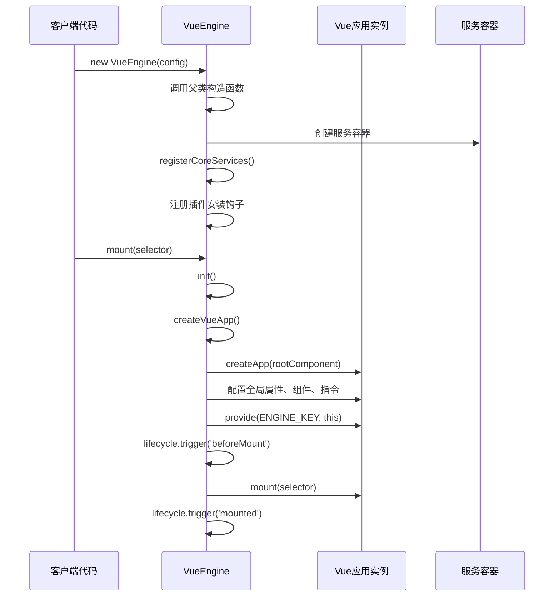
```mermaid
sequenceDiagram
participant Client as 客户端代码
participant VueEngine as VueEngine
participant VueApp as Vue应用实例
participant Container as 服务容器
Client->>VueEngine : new VueEngine(config)
VueEngine->>VueEngine : 调用父类构造函数
VueEngine->>Container : 创建服务容器
VueEngine->>VueEngine : registerCoreServices()
VueEngine->>VueEngine : 注册插件安装钩子
Client->>VueEngine : mount(selector)
VueEngine->>VueEngine : init()
VueEngine->>VueEngine : createVueApp()
VueEngine->>VueApp : createApp(rootComponent)
VueEngine->>VueApp : 配置全局属性、组件、指令
VueEngine->>VueApp : provide(ENGINE_KEY, this)
VueEngine->>VueEngine : lifecycle.trigger('beforeMount')
VueEngine->>VueApp : mount(selector)
VueEngine->>VueEngine : lifecycle.trigger('mounted')
```

**图表来源**
- [vue-engine.ts](file://packages/vue3/src/engine/vue-engine.ts#L129-L183)
- [vue-engine.ts](file://packages/vue3/src/engine/vue-engine.ts#L192-L216)

### 服务容器集成

VueEngine集成了强大的依赖注入容器，支持服务的注册、解析和生命周期管理。

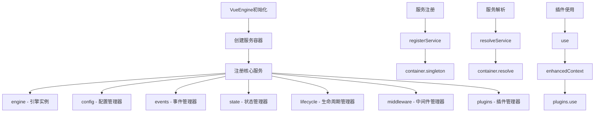
```mermaid
flowchart TD
A[VueEngine初始化] --> B[创建服务容器]
B --> C[注册核心服务]
C --> D[engine - 引擎实例]
C --> E[config - 配置管理器]
C --> F[events - 事件管理器]
C --> G[state - 状态管理器]
C --> H[lifecycle - 生命周期管理器]
C --> I[middleware - 中间件管理器]
C --> J[plugins - 插件管理器]
K[服务注册] --> L[registerService]
L --> M[container.singleton]
N[服务解析] --> O[resolveService]
O --> P[container.resolve]
Q[插件使用] --> R[use]
R --> S[enhancedContext]
S --> T[plugins.use]
```

**图表来源**
- [vue-engine.ts](file://packages/vue3/src/engine/vue-engine.ts#L298-L318)
- [vue-engine.ts](file://packages/vue3/src/engine/vue-engine.ts#L279-L290)

**章节来源**
- [vue-engine.ts](file://packages/vue3/src/engine/vue-engine.ts#L298-L318)
- [vue-engine.ts](file://packages/vue3/src/engine/vue-engine.ts#L279-L290)

## 初始化流程

VueEngine的初始化流程是一个精心设计的过程，确保所有组件都能正确初始化并建立正确的依赖关系。

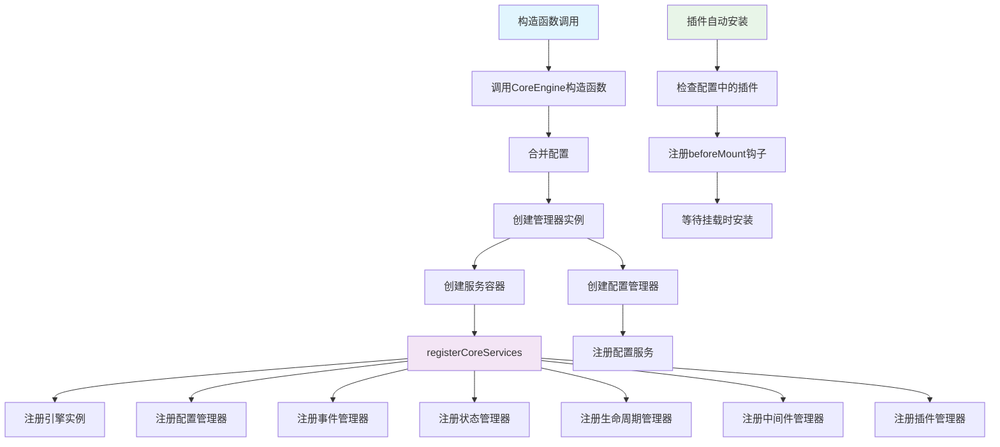
```mermaid
flowchart TD
A[构造函数调用] --> B[调用CoreEngine构造函数]
B --> C[合并配置]
C --> D[创建管理器实例]
D --> E[创建服务容器]
D --> F[创建配置管理器]
E --> G[registerCoreServices]
F --> H[注册配置服务]
G --> I[注册引擎实例]
G --> J[注册配置管理器]
G --> K[注册事件管理器]
G --> L[注册状态管理器]
G --> M[注册生命周期管理器]
G --> N[注册中间件管理器]
G --> O[注册插件管理器]
P[插件自动安装] --> Q[检查配置中的插件]
Q --> R[注册beforeMount钩子]
R --> S[等待挂载时安装]
style A fill:#e1f5fe
style G fill:#f3e5f5
style P fill:#e8f5e8
```

**图表来源**
- [vue-engine.ts](file://packages/vue3/src/engine/vue-engine.ts#L95-L120)
- [core-engine.ts](file://packages/core/src/engine/core-engine.ts#L110-L138)

### Vue应用创建过程

VueEngine的Vue应用创建过程包含了多个关键步骤，确保应用实例的完整性和功能性。

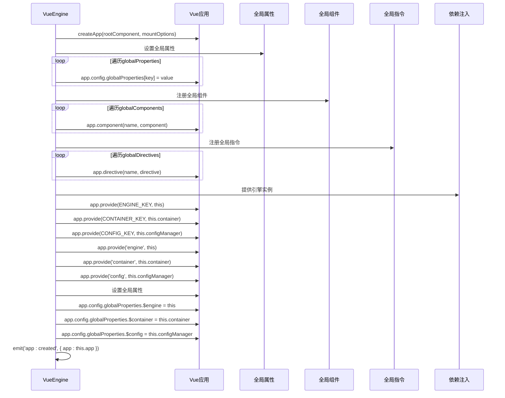
```mermaid
sequenceDiagram
participant VE as VueEngine
participant VA as Vue应用
participant GP as 全局属性
participant GC as 全局组件
participant GD as 全局指令
participant DI as 依赖注入
VE->>VA : createApp(rootComponent, mountOptions)
VE->>GP : 设置全局属性
loop 遍历globalProperties
VE->>VA : app.config.globalProperties[key] = value
end
VE->>GC : 注册全局组件
loop 遍历globalComponents
VE->>VA : app.component(name, component)
end
VE->>GD : 注册全局指令
loop 遍历globalDirectives
VE->>VA : app.directive(name, directive)
end
VE->>DI : 提供引擎实例
VE->>VA : app.provide(ENGINE_KEY, this)
VE->>VA : app.provide(CONTAINER_KEY, this.container)
VE->>VA : app.provide(CONFIG_KEY, this.configManager)
VE->>VA : app.provide('engine', this)
VE->>VA : app.provide('container', this.container)
VE->>VA : app.provide('config', this.configManager)
VE->>VA : 设置全局属性
VE->>VA : app.config.globalProperties.$engine = this
VE->>VA : app.config.globalProperties.$container = this.container
VE->>VA : app.config.globalProperties.$config = this.configManager
VE->>VE : emit('app : created', { app : this.app })
```

**图表来源**
- [vue-engine.ts](file://packages/vue3/src/engine/vue-engine.ts#L129-L183)

**章节来源**
- [vue-engine.ts](file://packages/vue3/src/engine/vue-engine.ts#L95-L120)
- [vue-engine.ts](file://packages/vue3/src/engine/vue-engine.ts#L129-L183)

## 生命周期钩子桥接机制

VueEngine实现了Vue3生命周期钩子与核心引擎生命周期系统的桥接，确保两个系统能够无缝协作。

### 生命周期钩子映射

```mermaid
graph LR
subgraph "Vue3生命周期"
A[onBeforeMount] --> B[beforeMount]
C[onMounted] --> D[mounted]
E[onBeforeUnmount] --> F[beforeUnmount]
G[onUnmounted] --> H[unmounted]
end
subgraph "核心引擎生命周期"
B --> I[trigger('beforeMount')]
D --> J[trigger('mounted')]
F --> K[trigger('beforeUnmount')]
H --> L[trigger('unmounted')]
end
subgraph "插件系统"
I --> M[插件安装]
J --> N[插件激活]
K --> O[插件清理]
L --> P[插件销毁]
end
```

**图表来源**
- [vue-engine.ts](file://packages/vue3/src/engine/vue-engine.ts#L115-L118)
- [lifecycle-manager.ts](file://packages/core/src/lifecycle/lifecycle-manager.ts#L173-L209)

### 生命周期触发流程

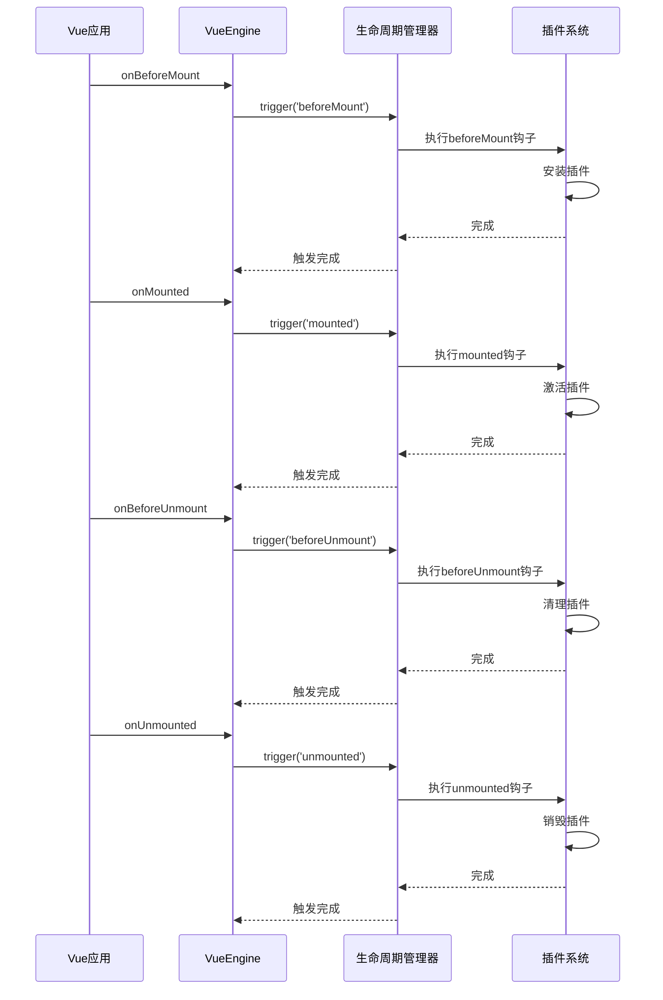
```mermaid
sequenceDiagram
participant Vue as Vue应用
participant VE as VueEngine
participant LM as 生命周期管理器
participant PS as 插件系统
Vue->>VE : onBeforeMount
VE->>LM : trigger('beforeMount')
LM->>PS : 执行beforeMount钩子
PS->>PS : 安装插件
PS-->>LM : 完成
LM-->>VE : 触发完成
Vue->>VE : onMounted
VE->>LM : trigger('mounted')
LM->>PS : 执行mounted钩子
PS->>PS : 激活插件
PS-->>LM : 完成
LM-->>VE : 触发完成
Vue->>VE : onBeforeUnmount
VE->>LM : trigger('beforeUnmount')
LM->>PS : 执行beforeUnmount钩子
PS->>PS : 清理插件
PS-->>LM : 完成
LM-->>VE : 触发完成
Vue->>VE : onUnmounted
VE->>LM : trigger('unmounted')
LM->>PS : 执行unmounted钩子
PS->>PS : 销毁插件
PS-->>LM : 完成
LM-->>VE : 触发完成
```

**图表来源**
- [vue-engine.ts](file://packages/vue3/src/engine/vue-engine.ts#L208-L216)
- [vue-engine.ts](file://packages/vue3/src/engine/vue-engine.ts#L231-L239)

**章节来源**
- [vue-engine.ts](file://packages/vue3/src/engine/vue-engine.ts#L115-L118)
- [vue-engine.ts](file://packages/vue3/src/engine/vue-engine.ts#L208-L216)
- [vue-engine.ts](file://packages/vue3/src/engine/vue-engine.ts#L231-L239)

## 依赖注入容器集成

VueEngine提供了强大的依赖注入功能，支持服务的注册、解析和生命周期管理。

### 服务注册与解析

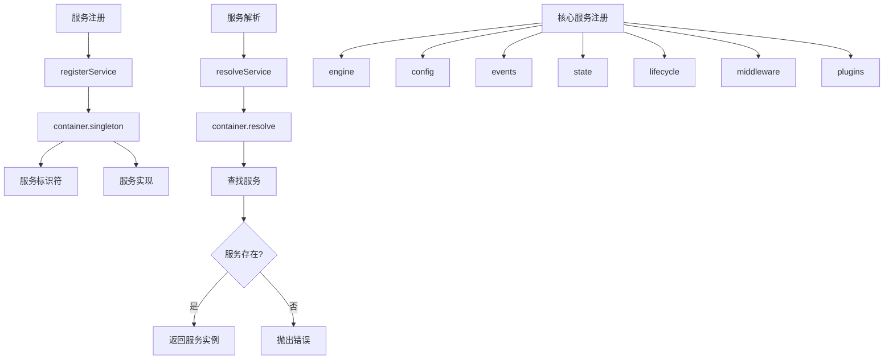
```mermaid
flowchart TD
A[服务注册] --> B[registerService]
B --> C[container.singleton]
C --> D[服务标识符]
C --> E[服务实现]
F[服务解析] --> G[resolveService]
G --> H[container.resolve]
H --> I[查找服务]
I --> J{服务存在?}
J --> |是| K[返回服务实例]
J --> |否| L[抛出错误]
M[核心服务注册] --> N[engine]
M --> O[config]
M --> P[events]
M --> Q[state]
M --> R[lifecycle]
M --> S[middleware]
M --> T[plugins]
```

**图表来源**
- [vue-engine.ts](file://packages/vue3/src/engine/vue-engine.ts#L279-L290)
- [vue-engine.ts](file://packages/vue3/src/engine/vue-engine.ts#L298-L318)

### 依赖注入键系统

VueEngine使用Symbol作为依赖注入键，确保键的唯一性和安全性：

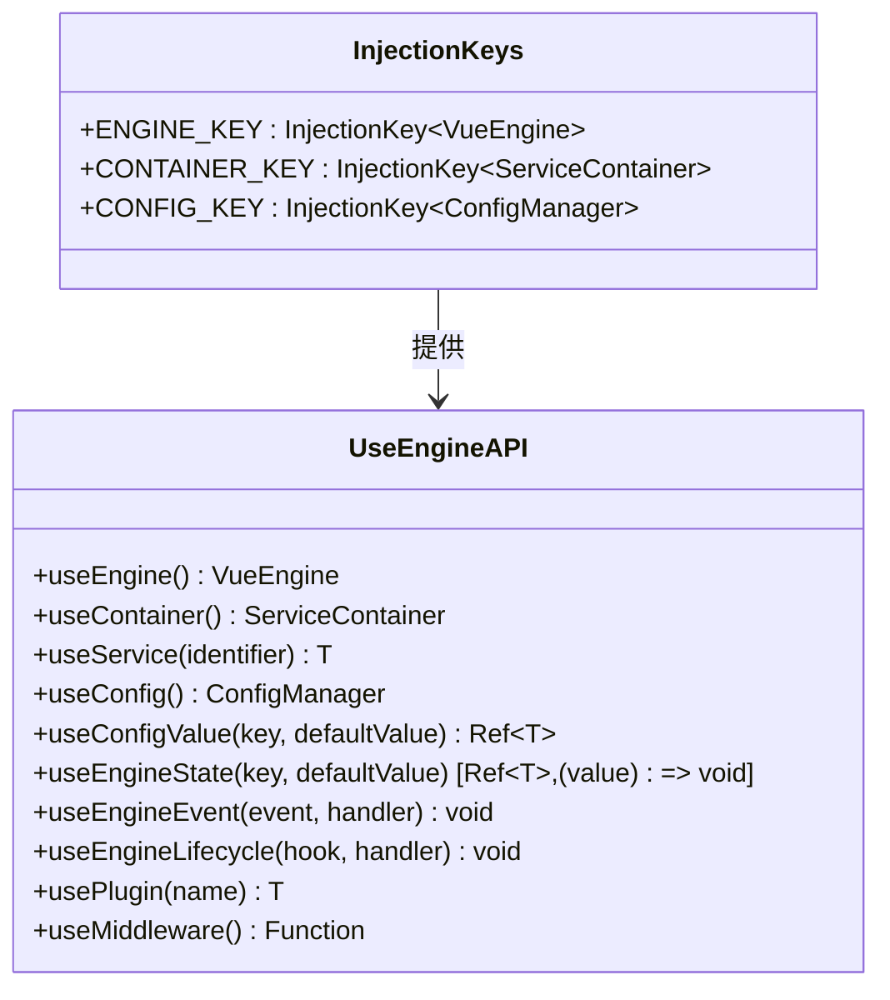
```mermaid
classDiagram
class InjectionKeys {
+ENGINE_KEY : InjectionKey~VueEngine~
+CONTAINER_KEY : InjectionKey~ServiceContainer~
+CONFIG_KEY : InjectionKey~ConfigManager~
}
class UseEngineAPI {
+useEngine() VueEngine
+useContainer() ServiceContainer
+useService(identifier) T
+useConfig() ConfigManager
+useConfigValue(key, defaultValue) Ref~T~
+useEngineState(key, defaultValue) [Ref~T~, (value) => void]
+useEngineEvent(event, handler) void
+useEngineLifecycle(hook, handler) void
+usePlugin(name) T
+useMiddleware() Function
}
InjectionKeys --> UseEngineAPI : 提供
```

**图表来源**
- [use-engine.ts](file://packages/vue3/src/composables/use-engine.ts#L16-L26)
- [use-engine.ts](file://packages/vue3/src/composables/use-engine.ts#L45-L352)

**章节来源**
- [vue-engine.ts](file://packages/vue3/src/engine/vue-engine.ts#L279-L290)
- [vue-engine.ts](file://packages/vue3/src/engine/vue-engine.ts#L298-L318)
- [use-engine.ts](file://packages/vue3/src/composables/use-engine.ts#L16-L26)

## 配置管理系统

VueEngine集成了灵活的配置管理系统，支持环境特定配置、动态配置更新和配置验证。

### 配置管理器架构

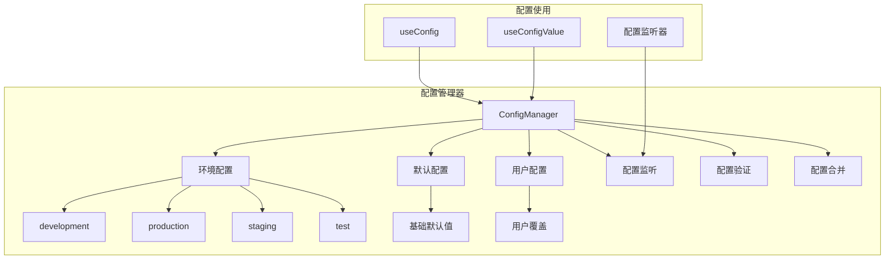
```mermaid
graph TB
subgraph "配置管理器"
A[ConfigManager] --> B[环境配置]
A --> C[默认配置]
A --> D[用户配置]
B --> E[development]
B --> F[production]
B --> G[staging]
B --> H[test]
C --> I[基础默认值]
D --> J[用户覆盖]
A --> K[配置监听]
A --> L[配置验证]
A --> M[配置合并]
end
subgraph "配置使用"
N[useConfig] --> A
O[useConfigValue] --> A
P[配置监听器] --> K
end
```

**图表来源**
- [vue-engine.ts](file://packages/vue3/src/engine/vue-engine.ts#L105-L108)
- [use-engine.ts](file://packages/vue3/src/composables/use-engine.ts#L156-L171)

**章节来源**
- [vue-engine.ts](file://packages/vue3/src/engine/vue-engine.ts#L105-L108)
- [use-engine.ts](file://packages/vue3/src/composables/use-engine.ts#L156-L171)

## useEngine组合式API

useEngine组合式API提供了在Vue组件中访问引擎功能的便捷方式，支持响应式配置、状态管理和事件监听。

### 组合式API设计

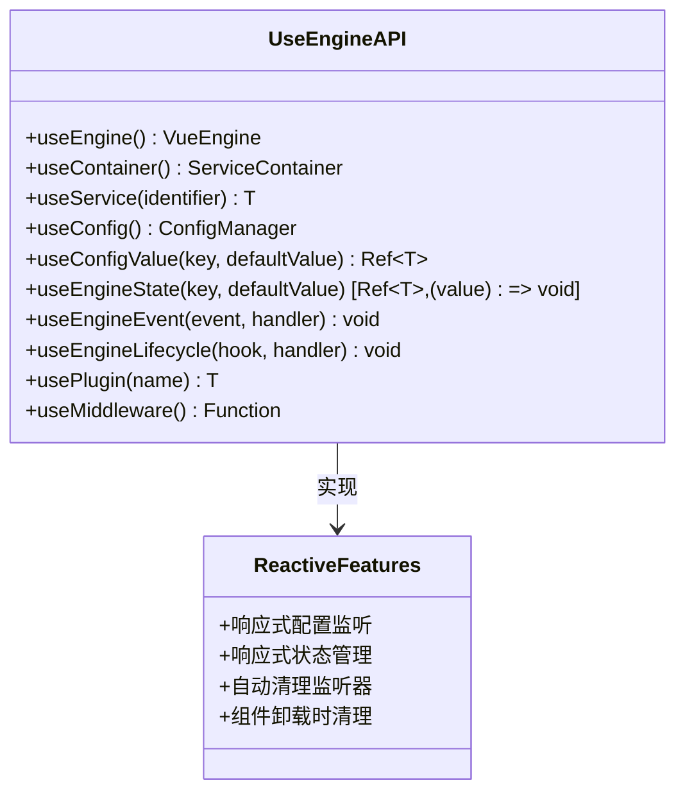
```mermaid
classDiagram
class UseEngineAPI {
+useEngine() VueEngine
+useContainer() ServiceContainer
+useService(identifier) T
+useConfig() ConfigManager
+useConfigValue(key, defaultValue) Ref~T~
+useEngineState(key, defaultValue) [Ref~T~, (value) => void]
+useEngineEvent(event, handler) void
+useEngineLifecycle(hook, handler) void
+usePlugin(name) T
+useMiddleware() Function
}
class ReactiveFeatures {
+响应式配置监听
+响应式状态管理
+自动清理监听器
+组件卸载时清理
}
UseEngineAPI --> ReactiveFeatures : 实现
```

**图表来源**
- [use-engine.ts](file://packages/vue3/src/composables/use-engine.ts#L45-L352)

### 响应式状态管理

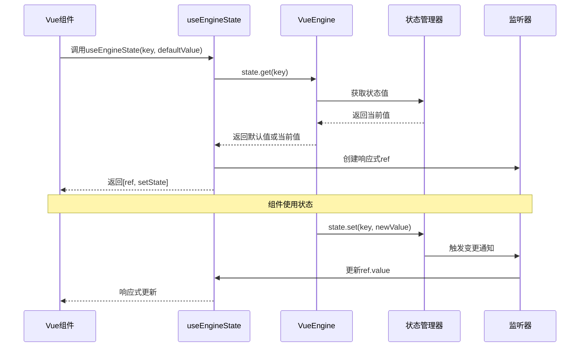
```mermaid
sequenceDiagram
participant Component as Vue组件
participant UseEngineState as useEngineState
participant Engine as VueEngine
participant StateManager as 状态管理器
participant Watcher as 监听器
Component->>UseEngineState : 调用useEngineState(key, defaultValue)
UseEngineState->>Engine : state.get(key)
Engine->>StateManager : 获取状态值
StateManager-->>Engine : 返回当前值
Engine-->>UseEngineState : 返回默认值或当前值
UseEngineState->>Watcher : 创建响应式ref
UseEngineState-->>Component : 返回[ref, setState]
Note over Component,Watcher : 组件使用状态
Engine->>StateManager : state.set(key, newValue)
StateManager->>Watcher : 触发变更通知
Watcher->>UseEngineState : 更新ref.value
UseEngineState-->>Component : 响应式更新
```

**图表来源**
- [use-engine.ts](file://packages/vue3/src/composables/use-engine.ts#L194-L216)

### 事件监听器管理

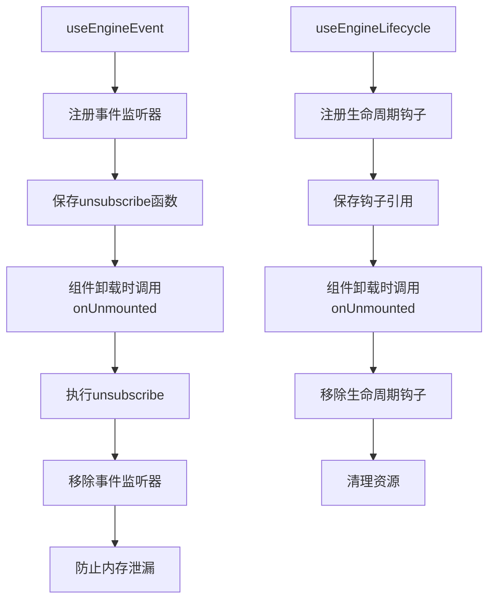
```mermaid
flowchart TD
A[useEngineEvent] --> B[注册事件监听器]
B --> C[保存unsubscribe函数]
C --> D[组件卸载时调用onUnmounted]
D --> E[执行unsubscribe]
E --> F[移除事件监听器]
F --> G[防止内存泄漏]
H[useEngineLifecycle] --> I[注册生命周期钩子]
I --> J[保存钩子引用]
J --> K[组件卸载时调用onUnmounted]
K --> L[移除生命周期钩子]
L --> M[清理资源]
```

**图表来源**
- [use-engine.ts](file://packages/vue3/src/composables/use-engine.ts#L239-L251)
- [use-engine.ts](file://packages/vue3/src/composables/use-engine.ts#L278-L290)

**章节来源**
- [use-engine.ts](file://packages/vue3/src/composables/use-engine.ts#L45-L352)
- [use-engine.ts](file://packages/vue3/src/composables/use-engine.ts#L194-L216)
- [use-engine.ts](file://packages/vue3/src/composables/use-engine.ts#L239-L251)

## 插件系统集成

VueEngine提供了强大的插件系统，支持Vue3插件和引擎插件的统一管理。

### 插件类型与接口

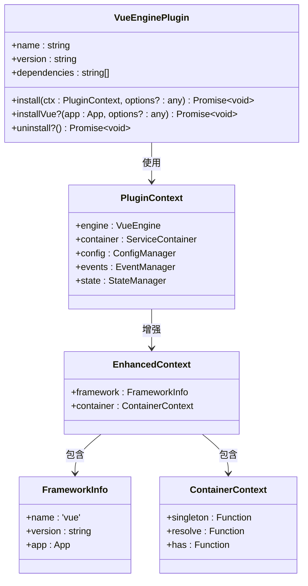
```mermaid
classDiagram
class VueEnginePlugin {
+name : string
+version : string
+dependencies : string[]
+install(ctx : PluginContext, options? : any) Promise~void~
+installVue?(app : App, options? : any) Promise~void~
+uninstall?() Promise~void~
}
class PluginContext {
+engine : VueEngine
+container : ServiceContainer
+config : ConfigManager
+events : EventManager
+state : StateManager
}
class EnhancedContext {
+framework : FrameworkInfo
+container : ContainerContext
}
class FrameworkInfo {
+name : 'vue'
+version : string
+app : App
}
class ContainerContext {
+singleton : Function
+resolve : Function
+has : Function
}
VueEnginePlugin --> PluginContext : 使用
PluginContext --> EnhancedContext : 增强
EnhancedContext --> FrameworkInfo : 包含
EnhancedContext --> ContainerContext : 包含
```

**图表来源**
- [vue-engine.ts](file://packages/vue3/src/engine/vue-engine.ts#L389-L393)
- [vue-engine.ts](file://packages/vue3/src/engine/vue-engine.ts#L326-L342)

### 插件安装流程

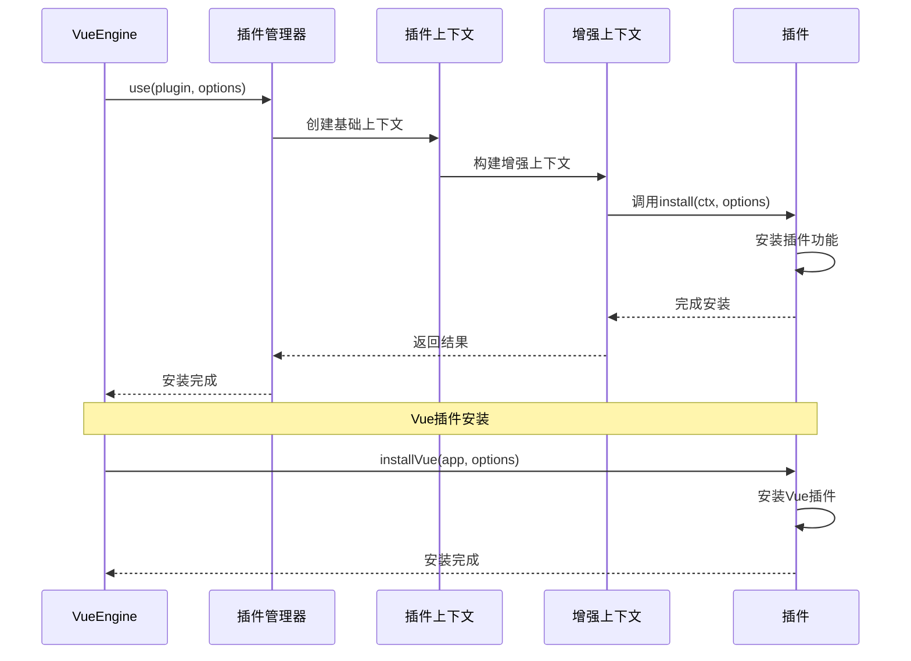
```mermaid
sequenceDiagram
participant VE as VueEngine
participant PM as 插件管理器
participant PC as 插件上下文
participant EP as 增强上下文
participant Plugin as 插件
VE->>PM : use(plugin, options)
PM->>PC : 创建基础上下文
PC->>EP : 构建增强上下文
EP->>Plugin : 调用install(ctx, options)
Plugin->>Plugin : 安装插件功能
Plugin-->>EP : 完成安装
EP-->>PM : 返回结果
PM-->>VE : 安装完成
Note over VE,Plugin : Vue插件安装
VE->>Plugin : installVue(app, options)
Plugin->>Plugin : 安装Vue插件
Plugin-->>VE : 安装完成
```

**图表来源**
- [vue-engine.ts](file://packages/vue3/src/engine/vue-engine.ts#L324-L342)
- [vue-engine.ts](file://packages/vue3/src/engine/vue-engine.ts#L255-L261)

### 内置插件示例

VueEngine提供了几个内置插件来展示插件系统的强大功能：

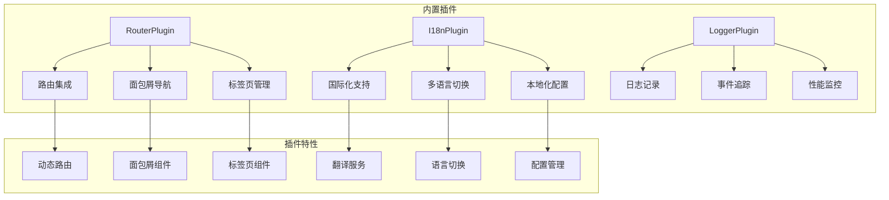
```mermaid
graph TB
subgraph "内置插件"
A[RouterPlugin] --> B[路由集成]
A --> C[面包屑导航]
A --> D[标签页管理]
E[I18nPlugin] --> F[国际化支持]
E --> G[多语言切换]
E --> H[本地化配置]
I[LoggerPlugin] --> J[日志记录]
I --> K[事件追踪]
I --> L[性能监控]
end
subgraph "插件特性"
B --> M[动态路由]
C --> N[面包屑组件]
D --> O[标签页组件]
F --> P[翻译服务]
G --> Q[语言切换]
H --> R[配置管理]
end
```

**图表来源**
- [router-plugin.ts](file://packages/vue3/src/plugins/router-plugin.ts#L60-L129)
- [i18n-plugin.ts](file://packages/vue3/src/plugins/i18n-plugin.ts#L38-L164)

**章节来源**
- [vue-engine.ts](file://packages/vue3/src/engine/vue-engine.ts#L324-L342)
- [vue-engine.ts](file://packages/vue3/src/engine/vue-engine.ts#L255-L261)
- [router-plugin.ts](file://packages/vue3/src/plugins/router-plugin.ts#L60-L129)
- [i18n-plugin.ts](file://packages/vue3/src/plugins/i18n-plugin.ts#L38-L164)

## 性能监控封装

VueEngine集成了性能监控功能，提供详细的性能指标收集和分析能力。

### 性能监控架构

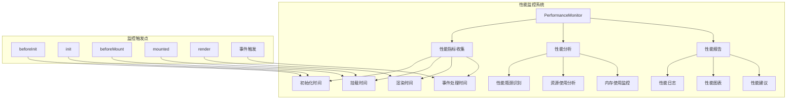
```mermaid
graph TB
subgraph "性能监控系统"
A[PerformanceMonitor] --> B[性能指标收集]
A --> C[性能分析]
A --> D[性能报告]
B --> E[初始化时间]
B --> F[挂载时间]
B --> G[渲染时间]
B --> H[事件处理时间]
C --> I[性能瓶颈识别]
C --> J[资源使用分析]
C --> K[内存使用监控]
D --> L[性能日志]
D --> M[性能图表]
D --> N[性能建议]
end
subgraph "监控触发点"
O[beforeInit] --> E
P[init] --> E
Q[beforeMount] --> F
R[mounted] --> F
S[render] --> G
T[事件触发] --> H
end
```

**图表来源**
- [core-engine.ts](file://packages/core/src/engine/core-engine.ts#L125-L128)

**章节来源**
- [core-engine.ts](file://packages/core/src/engine/core-engine.ts#L125-L128)

## 挂载与销毁过程

VueEngine提供了完整的应用挂载和销毁流程，确保资源的正确分配和释放。

### 应用挂载流程

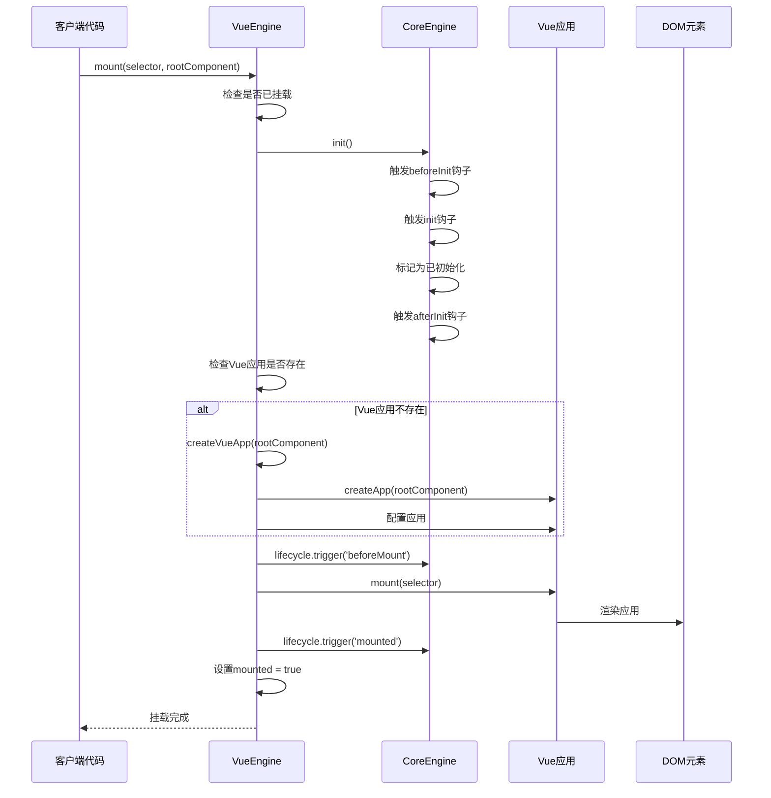
```mermaid
sequenceDiagram
participant Client as 客户端代码
participant VE as VueEngine
participant Core as CoreEngine
participant Vue as Vue应用
participant DOM as DOM元素
Client->>VE : mount(selector, rootComponent)
VE->>VE : 检查是否已挂载
VE->>Core : init()
Core->>Core : 触发beforeInit钩子
Core->>Core : 触发init钩子
Core->>Core : 标记为已初始化
Core->>Core : 触发afterInit钩子
VE->>VE : 检查Vue应用是否存在
alt Vue应用不存在
VE->>VE : createVueApp(rootComponent)
VE->>Vue : createApp(rootComponent)
VE->>Vue : 配置应用
end
VE->>Core : lifecycle.trigger('beforeMount')
VE->>Vue : mount(selector)
Vue->>DOM : 渲染应用
VE->>Core : lifecycle.trigger('mounted')
VE->>VE : 设置mounted = true
VE-->>Client : 挂载完成
```

**图表来源**
- [vue-engine.ts](file://packages/vue3/src/engine/vue-engine.ts#L192-L216)

### 应用销毁流程

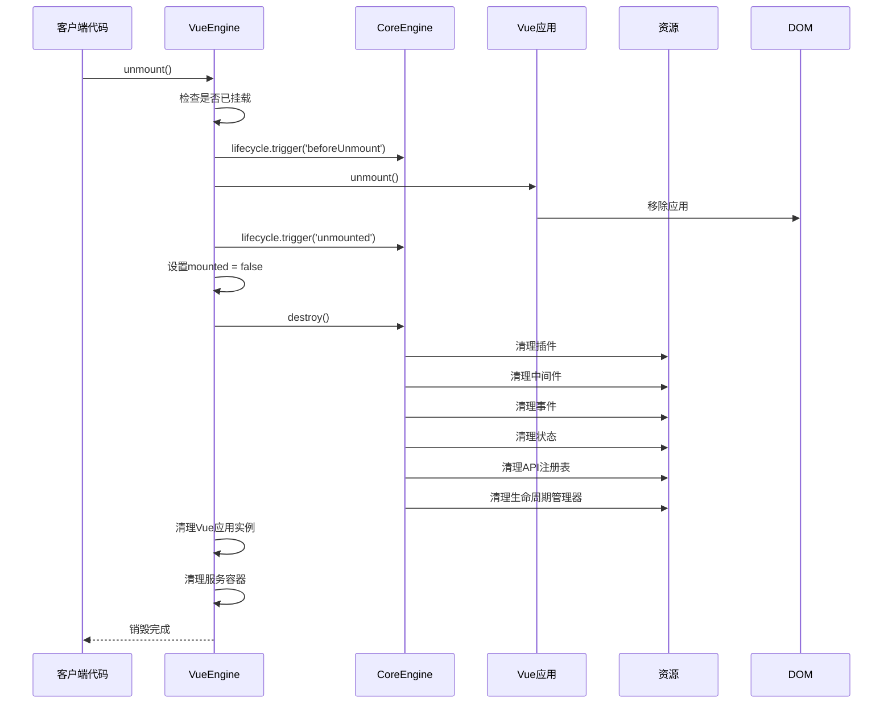
```mermaid
sequenceDiagram
participant Client as 客户端代码
participant VE as VueEngine
participant Core as CoreEngine
participant Vue as Vue应用
participant Resources as 资源
Client->>VE : unmount()
VE->>VE : 检查是否已挂载
VE->>Core : lifecycle.trigger('beforeUnmount')
VE->>Vue : unmount()
Vue->>DOM : 移除应用
VE->>Core : lifecycle.trigger('unmounted')
VE->>VE : 设置mounted = false
VE->>Core : destroy()
Core->>Resources : 清理插件
Core->>Resources : 清理中间件
Core->>Resources : 清理事件
Core->>Resources : 清理状态
Core->>Resources : 清理API注册表
Core->>Resources : 清理生命周期管理器
VE->>VE : 清理Vue应用实例
VE->>VE : 清理服务容器
VE-->>Client : 销毁完成
```

**图表来源**
- [vue-engine.ts](file://packages/vue3/src/engine/vue-engine.ts#L226-L247)
- [core-engine.ts](file://packages/core/src/engine/core-engine.ts#L225-L268)

### 错误处理机制

VueEngine实现了多层次的错误处理机制，确保应用的稳定性和可维护性。

```mermaid
flowchart TD
A[错误发生] --> B{错误类型}
B --> |初始化错误| C[init阶段错误]
B --> |挂载错误| D[mount阶段错误]
B --> |运行时错误| E[运行时错误]
B --> |插件错误| F[插件错误]
C --> G[记录错误日志]
D --> H[清理已分配资源]
E --> I[错误隔离]
F --> J[插件卸载]
G --> K[抛出异常]
H --> L[回滚操作]
I --> M[继续执行]
J --> N[跳过故障插件]
K --> O[应用崩溃]
L --> P[应用恢复]
M --> Q[应用继续运行]
N --> R[应用正常运行]
```

**图表来源**
- [core-engine.ts](file://packages/core/src/engine/core-engine.ts#L196-L198)
- [vue-engine.ts](file://packages/vue3/src/engine/vue-engine.ts#L244-L246)

**章节来源**
- [vue-engine.ts](file://packages/vue3/src/engine/vue-engine.ts#L192-L216)
- [vue-engine.ts](file://packages/vue3/src/engine/vue-engine.ts#L226-L247)
- [core-engine.ts](file://packages/core/src/engine/core-engine.ts#L196-L198)

## 错误处理与调试

VueEngine提供了完善的错误处理和调试功能，帮助开发者快速定位和解决问题。

### 调试信息输出

```mermaid
graph TB
subgraph "调试系统"
A[Debug模式] --> B[初始化日志]
A --> C[挂载日志]
A --> D[销毁日志]
A --> E[事件日志]
A --> F[错误日志]
B --> G["[Engine] Core engine created"]
C --> H["[VueEngine] Vue application created"]
C --> I["[VueEngine] Application mounted successfully"]
D --> J["[VueEngine] Application unmounted"]
E --> K["[Engine] Events: ..."]
F --> L["[Engine] Initialization failed"]
end
subgraph "调试工具"
M[console.log] --> N[控制台输出]
O[console.warn] --> P[警告信息]
Q[console.error] --> R[错误信息]
end
A --> M
A --> O
A --> Q
```

**图表来源**
- [vue-engine.ts](file://packages/vue3/src/engine/vue-engine.ts#L179-L181)
- [vue-engine.ts](file://packages/vue3/src/engine/vue-engine.ts#L218-L220)
- [vue-engine.ts](file://packages/vue3/src/engine/vue-engine.ts#L244-L246)

### 内存泄漏防护

VueEngine实现了多种机制来防止内存泄漏：

```mermaid
flowchart TD
A[内存泄漏防护] --> B[自动清理监听器]
A --> C[组件卸载时清理]
A --> D[插件生命周期管理]
A --> E[服务容器清理]
B --> F[事件监听器]
B --> G[生命周期钩子]
B --> H[配置监听器]
C --> I[onUnmounted钩子]
C --> J[自动取消订阅]
D --> K[插件安装]
D --> L[插件卸载]
D --> M[插件依赖管理]
E --> N[服务注册]
E --> O[服务解析]
E --> P[服务清理]
```

**图表来源**
- [use-engine.ts](file://packages/vue3/src/composables/use-engine.ts#L166-L168)
- [use-engine.ts](file://packages/vue3/src/composables/use-engine.ts#L212-L214)
- [use-engine.ts](file://packages/vue3/src/composables/use-engine.ts#L249-L251)

**章节来源**
- [vue-engine.ts](file://packages/vue3/src/engine/vue-engine.ts#L179-L181)
- [vue-engine.ts](file://packages/vue3/src/engine/vue-engine.ts#L218-L220)
- [vue-engine.ts](file://packages/vue3/src/engine/vue-engine.ts#L244-L246)
- [use-engine.ts](file://packages/vue3/src/composables/use-engine.ts#L166-L168)

## 最佳实践

基于VueEngine的设计和实现，以下是推荐的最佳实践：

### 1. 引擎初始化最佳实践

```typescript
// 推荐的引擎初始化方式
const engine = new VueEngine({
  name: 'My Application',
  debug: process.env.NODE_ENV === 'development',
  app: {
    rootComponent: App,
    globalProperties: {
      $api: apiService,
      $utils: utils
    },
    globalComponents: {
      BaseButton: BaseButton,
      BaseModal: BaseModal
    }
  },
  plugins: [
    createRouterPlugin(),
    createI18nPlugin({
      locale: 'zh-CN',
      messages: zhMessages
    })
  ]
})
```

### 2. 组件中使用引擎功能

```typescript
// 推荐的组合式API使用方式
<script setup>
import { useEngine, useEngineState, useEngineEvent } from '@ldesign/engine-vue3'

// 获取引擎实例
const engine = useEngine()

// 使用响应式状态
const [count, setCount] = useEngineState('count', 0)

// 监听引擎事件
useEngineEvent('user:login', (user) => {
  console.log('用户登录:', user)
})

// 使用插件
const router = usePlugin('router')
</script>
```

### 3. 插件开发最佳实践

```typescript
// 推荐的插件开发方式
export function createMyPlugin(options: MyPluginOptions = {}) {
  return {
    name: 'my-plugin',
    version: '1.0.0',
    dependencies: ['router'],
    
    async install(ctx, opts) {
      const engine = ctx.engine as VueEngine
      
      // 注册服务
      engine.registerService('myService', new MyService())
      
      // 监听生命周期
      ctx.engine.lifecycle.on('mounted', () => {
        // 插件激活逻辑
      })
    },
    
    installVue(app, options) {
      // Vue插件安装逻辑
      app.component('MyComponent', MyComponent)
    }
  }
}
```

### 4. 性能优化建议

```typescript
// 性能优化配置
const engine = new VueEngine({
  debug: false, // 生产环境关闭调试模式
  // 其他优化配置...
})

// 使用懒加载组件
const LazyComponent = defineAsyncComponent(() => import('./LazyComponent.vue'))

// 合理使用插件
const plugins = []
if (process.env.NODE_ENV === 'development') {
  plugins.push(createDevToolsPlugin())
}
```

### 5. 错误处理最佳实践

```typescript
// 推荐的错误处理方式
try {
  await engine.mount('#app')
} catch (error) {
  console.error('应用启动失败:', error)
  
  // 显示友好的错误信息
  document.getElementById('app').innerHTML = `
    <div class="error-message">
      <h2>应用启动失败</h2>
      <p>请尝试刷新页面或联系技术支持。</p>
    </div>
  `
}
```

VueEngine通过其精心设计的架构和丰富的功能，为Vue3应用开发提供了一个强大而灵活的平台。它不仅继承了CoreEngine的所有优势，还针对Vue3框架的特点进行了深度优化和扩展，使得开发者能够构建更加复杂和功能丰富的应用。