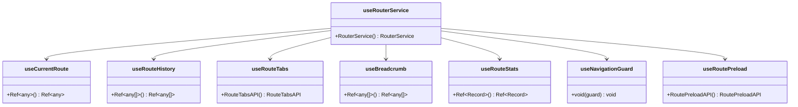

# 插件集成机制

<cite>
**本文档中引用的文件**
- [router-plugin.ts](file://packages/vue3/src/plugins/router-plugin.ts)
- [i18n-plugin.ts](file://packages/vue3/src/plugins/i18n-plugin.ts)
- [vue-engine.ts](file://packages/vue3/src/engine/vue-engine.ts)
- [define-plugin.ts](file://packages/core/src/plugin/define-plugin.ts)
- [plugin-manager.ts](file://packages/core/src/plugin/plugin-manager.ts)
- [plugin.ts](file://packages/core/src/types/plugin.ts)
- [plugin-api-registry.ts](file://packages/core/src/plugin/plugin-api-registry.ts)
- [use-router.ts](file://packages/vue3/src/composables/use-router.ts)
- [index.ts](file://packages/vue3/src/index.ts)
- [index.ts](file://packages/vue3/src/plugins/index.ts)
</cite>

## 目录
1. [概述](#概述)
2. [插件架构设计](#插件架构设计)
3. [VueEngine初始化与插件委托](#vueengine初始化与插件委托)
4. [router-plugin深度解析](#router-plugin深度解析)
5. [i18n-plugin深度解析](#i18n-plugin深度解析)
6. [插件API注册机制](#插件api注册机制)
7. [useRouter组合式函数](#userouter组合式函数)
8. [热重载支持机制](#热重载支持机制)
9. [插件生命周期管理](#插件生命周期管理)
10. [最佳实践与总结](#最佳实践与总结)

## 概述

Vue3适配器中的插件集成机制是一个高度模块化和可扩展的系统，通过定义清晰的插件接口和委托模式，实现了框架特定功能的无缝集成。该系统的核心特点包括：

- **委托模式**：插件通过definePlugin定义，将具体实现委托给专门的库（如@ldesign/router-vue）
- **动态导入**：插件在运行时动态导入依赖的第三方库，确保按需加载
- **上下文注入**：插件可以访问Vue实例上下文，实现深度集成
- **生命周期管理**：完整的插件安装、卸载和热重载支持
- **类型安全**：完整的TypeScript类型定义，提供编译时检查

## 插件架构设计

### 核心插件接口

插件系统基于统一的插件接口设计，所有插件都遵循相同的规范：


**图表来源**
- [plugin.ts](file://packages/core/src/types/plugin.ts#L40-L51)
- [vue-engine.ts](file://packages/vue3/src/engine/vue-engine.ts#L390-L393)

### 插件定义辅助函数

definePlugin函数提供了插件定义的标准化入口点：


**图表来源**
- [define-plugin.ts](file://packages/core/src/plugin/define-plugin.ts#L25-L27)

**章节来源**
- [define-plugin.ts](file://packages/core/src/plugin/define-plugin.ts#L1-L29)
- [plugin.ts](file://packages/core/src/types/plugin.ts#L40-L51)

## VueEngine初始化与插件委托

### VueEngine初始化流程

VueEngine作为插件系统的宿主，在初始化过程中负责插件的自动安装和管理：


**图表来源**
- [vue-engine.ts](file://packages/vue3/src/engine/vue-engine.ts#L113-L119)

### 插件上下文增强

VueEngine在使用插件时会构建增强的上下文，提供框架特定的功能：


**图表来源**
- [vue-engine.ts](file://packages/vue3/src/engine/vue-engine.ts#L326-L342)

**章节来源**
- [vue-engine.ts](file://packages/vue3/src/engine/vue-engine.ts#L113-L121)
- [vue-engine.ts](file://packages/vue3/src/engine/vue-engine.ts#L324-L343)

## router-plugin深度解析

### 插件结构与配置

router-plugin采用委托模式，将具体的路由功能委托给@ldesign/router-vue库：


**图表来源**
- [router-plugin.ts](file://packages/vue3/src/plugins/router-plugin.ts#L60-L129)

### 动态导入机制

router-plugin展示了插件系统中动态导入的最佳实践：


**图表来源**
- [router-plugin.ts](file://packages/vue3/src/plugins/router-plugin.ts#L66-L126)

### 配置合并策略

router-plugin实现了灵活的配置合并机制：

| 配置层级 | 优先级 | 用途 |
|---------|--------|------|
| 默认配置 | 最低 | 提供基本功能 |
| 插件配置 | 中等 | 插件特定设置 |
| 选项参数 | 最高 | 运行时覆盖 |

**章节来源**
- [router-plugin.ts](file://packages/vue3/src/plugins/router-plugin.ts#L1-L129)

## i18n-plugin深度解析

### 插件初始化流程

i18n-plugin展示了复杂插件的初始化模式，包括异步初始化和服务注册：


**图表来源**
- [i18n-plugin.ts](file://packages/vue3/src/plugins/i18n-plugin.ts#L44-L164)

### 服务注册与依赖注入

i18n-plugin实现了多层次的服务注册机制：


**图表来源**
- [i18n-plugin.ts](file://packages/vue3/src/plugins/i18n-plugin.ts#L86-L136)

### 异步初始化处理

i18n-plugin展示了如何优雅地处理异步初始化：


**图表来源**
- [i18n-plugin.ts](file://packages/vue3/src/plugins/i18n-plugin.ts#L142-L164)

**章节来源**
- [i18n-plugin.ts](file://packages/vue3/src/plugins/i18n-plugin.ts#L1-L164)

## 插件API注册机制

### API注册表架构

插件API注册机制提供了类型安全的插件间通信能力：


**图表来源**
- [plugin-api-registry.ts](file://packages/core/src/plugin/plugin-api-registry.ts#L14-L58)

### 类型安全的插件通信

插件API注册机制确保了插件间的类型安全通信：

```mermaid
sequenceDiagram
participant PluginA as 插件A
participant Registry as API注册表
participant PluginB as 插件B
PluginA->>Registry : register({
name : 'i18n',
version : '1.0.0',
getLocale() { return 'zh-CN' },
setLocale(locale) { /* 实现 */ }
})
PluginB->>Registry : get('i18n')
Registry-->>PluginB : 返回类型化的API
PluginB->>PluginB : 调用 getLocale()
PluginB->>PluginB : 调用 setLocale()
```

**图表来源**
- [plugin-api-registry.ts](file://packages/core/src/plugin/plugin-api-registry.ts#L160-L191)

**章节来源**
- [plugin-api-registry.ts](file://packages/core/src/plugin/plugin-api-registry.ts#L1-L191)

## useRouter组合式函数

### 组合式API设计

useRouter提供了响应式的路由访问能力：



**图表来源**
- [use-router.ts](file://packages/vue3/src/composables/use-router.ts#L32-L390)

### 状态管理集成

useRouter组合式函数与引擎状态管理系统深度集成：


**图表来源**
- [use-router.ts](file://packages/vue3/src/composables/use-router.ts#L56-L58)

**章节来源**
- [use-router.ts](file://packages/vue3/src/composables/use-router.ts#L1-L390)

## 热重载支持机制

### 热重载生命周期

插件系统提供了完整的热重载支持，允许在运行时更新插件而无需重启应用：


**图表来源**
- [plugin-manager.ts](file://packages/core/src/plugin/plugin-manager.ts#L388-L447)

### 热重载监听器机制

插件可以注册热重载监听器来处理状态同步：


**图表来源**
- [plugin-manager.ts](file://packages/core/src/plugin/plugin-manager.ts#L470-L484)

**章节来源**
- [plugin-manager.ts](file://packages/core/src/plugin/plugin-manager.ts#L388-L484)

## 插件生命周期管理

### 插件安装流程

插件管理器负责完整的插件生命周期管理：


**图表来源**
- [plugin-manager.ts](file://packages/core/src/plugin/plugin-manager.ts#L92-L143)

### 依赖管理机制

插件系统支持复杂的依赖关系管理：


**图表来源**
- [plugin-manager.ts](file://packages/core/src/plugin/plugin-manager.ts#L297-L335)

**章节来源**
- [plugin-manager.ts](file://packages/core/src/plugin/plugin-manager.ts#L92-L143)
- [plugin-manager.ts](file://packages/core/src/plugin/plugin-manager.ts#L297-L335)

## 最佳实践与总结

### 插件开发最佳实践

基于对Vue3适配器插件系统的深入分析，以下是插件开发的最佳实践：

1. **使用委托模式**：将具体实现委托给专门的库，保持插件的轻量化
2. **动态导入依赖**：使用async/await和动态import确保按需加载
3. **提供类型安全**：充分利用TypeScript类型系统确保API的类型安全
4. **优雅处理异步**：正确处理异步初始化和依赖注入
5. **实现热重载支持**：为插件提供卸载和重新安装的能力

### 架构优势总结

Vue3适配器的插件集成机制展现了以下架构优势：

- **模块化设计**：每个插件都是独立的模块，职责单一
- **松耦合架构**：插件之间通过标准接口通信，降低耦合度
- **类型安全保障**：完整的TypeScript类型定义确保开发时的类型安全
- **扩展性强**：新的插件可以轻松集成到现有系统中
- **维护性好**：清晰的职责分离和标准的接口规范

### 性能优化考虑

插件系统在性能方面采用了多种优化策略：

- **按需加载**：插件和依赖库都采用动态导入，减少初始加载时间
- **服务缓存**：通过服务容器缓存插件实例，避免重复创建
- **响应式更新**：利用Vue的响应式系统实现状态的自动更新
- **内存管理**：完善的插件卸载机制确保内存不会泄漏

这个插件集成机制为Vue3应用提供了一个强大而灵活的扩展平台，使得开发者可以轻松地添加各种功能模块，同时保持代码的整洁性和可维护性。