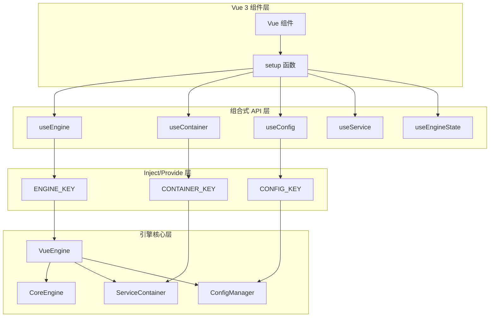
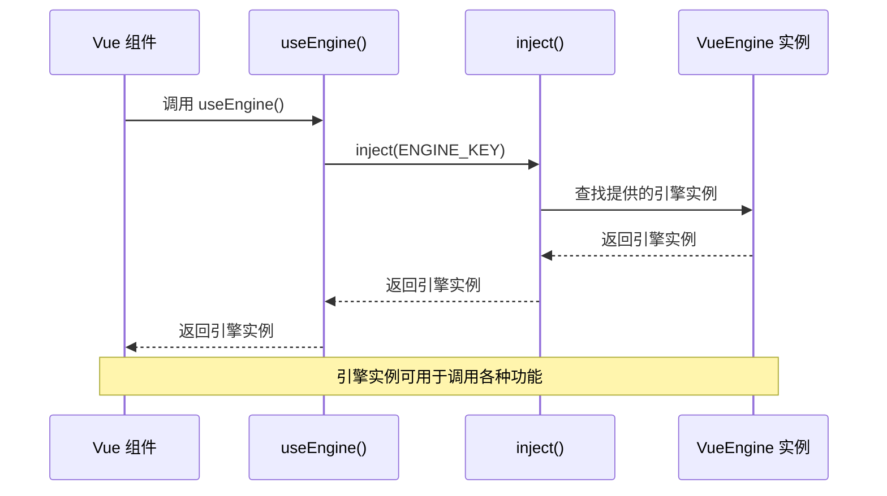
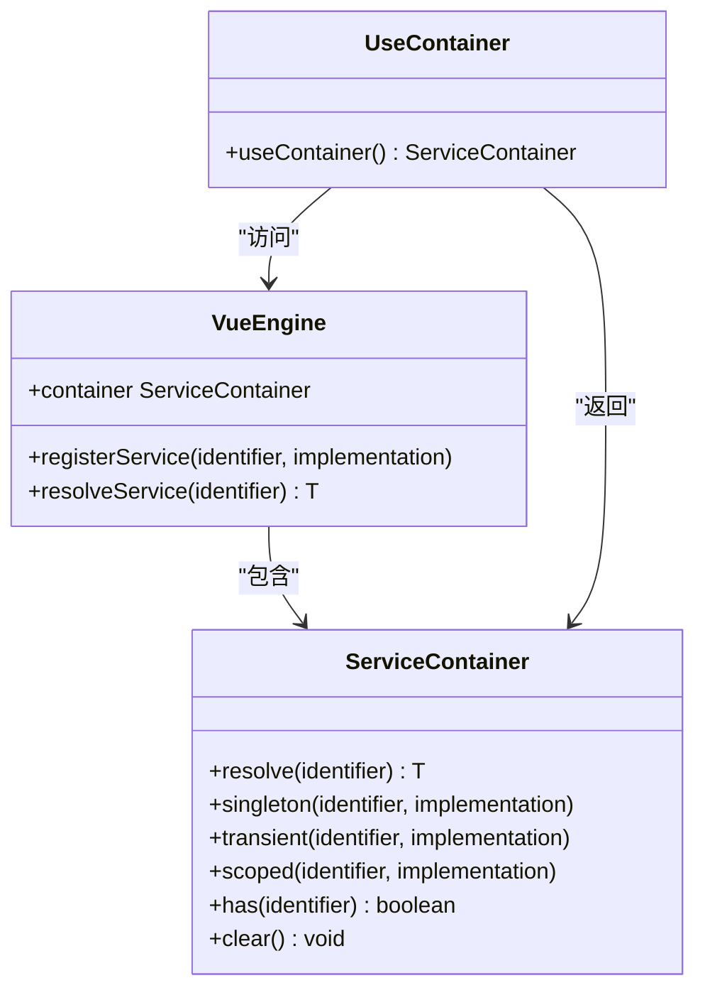
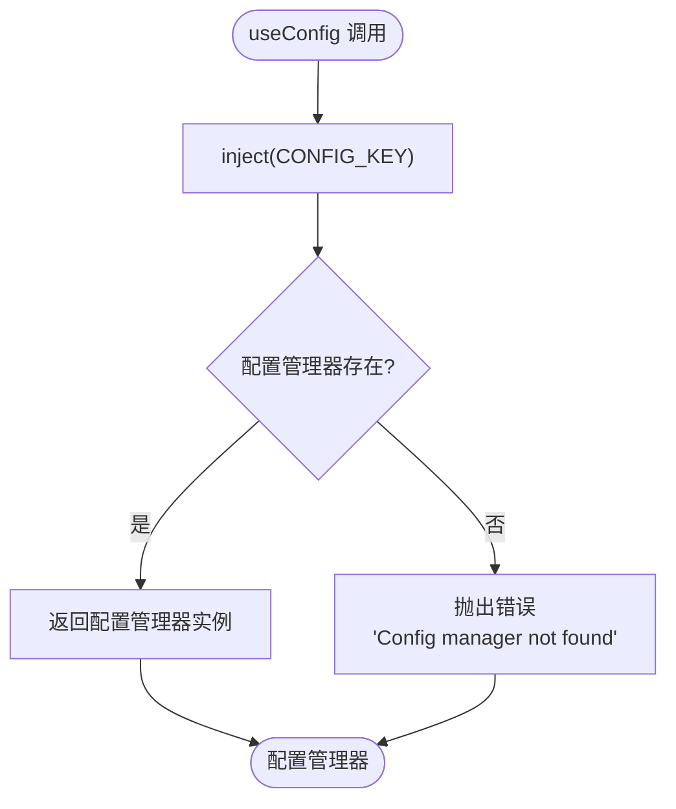
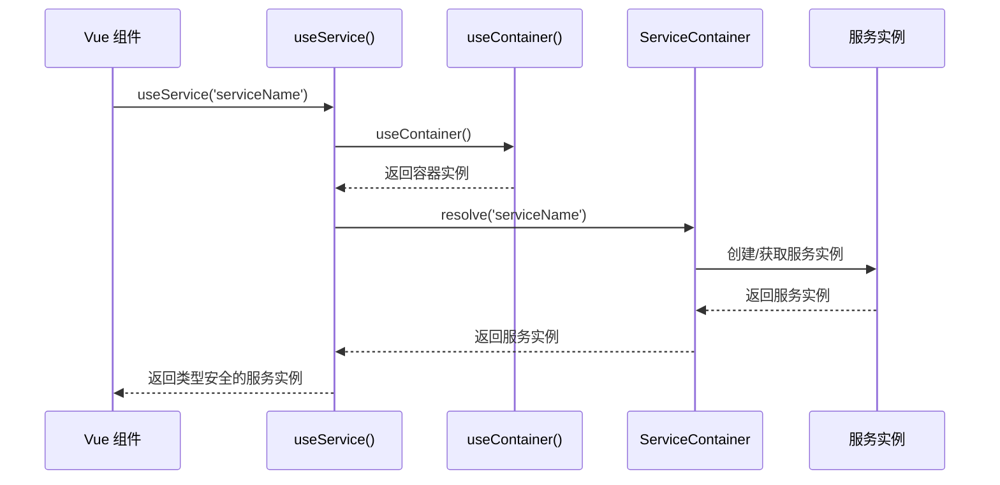
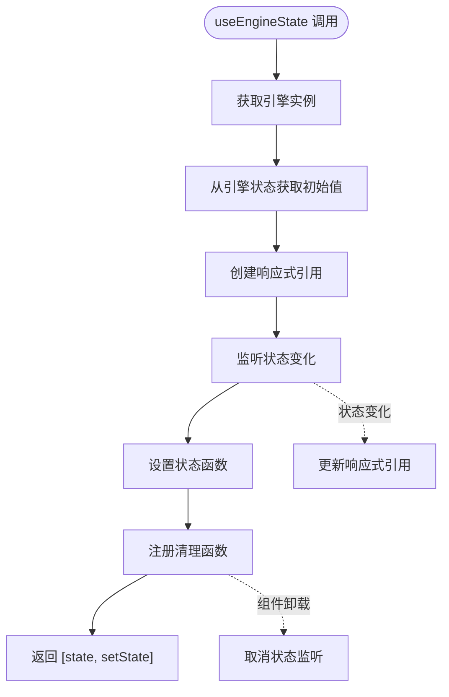
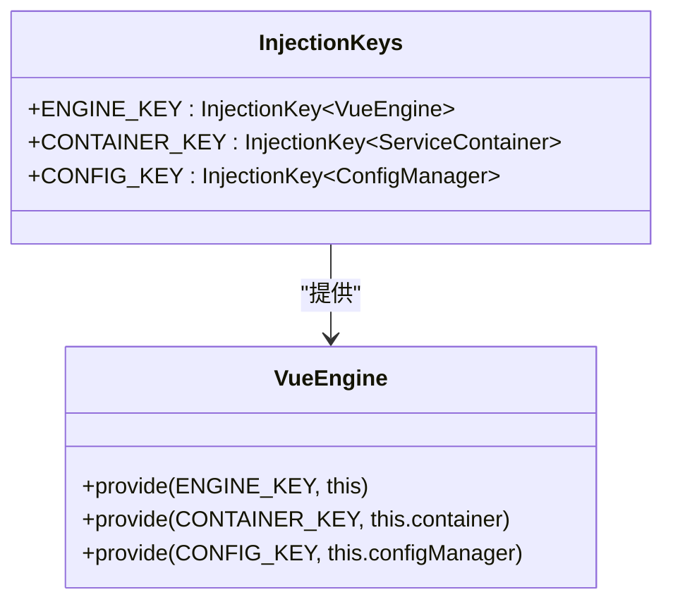
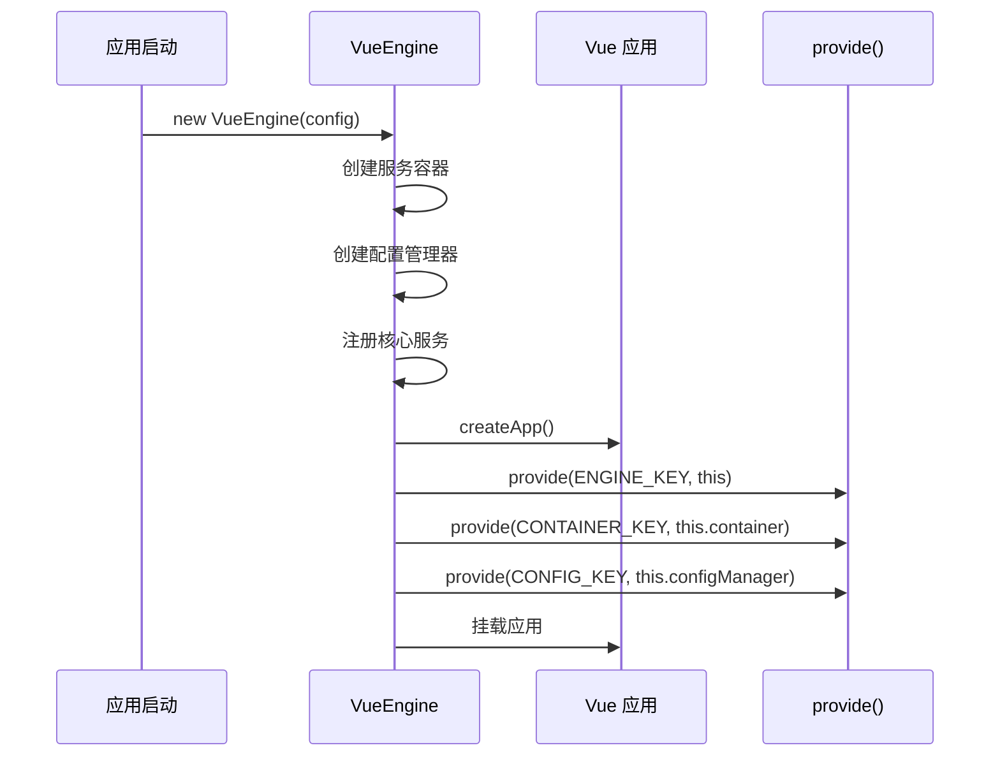

# 核心组合式API

<cite>
**本文档引用的文件**
- [use-engine.ts](file://packages/vue3/src/composables/use-engine.ts)
- [vue-engine.ts](file://packages/vue3/src/engine/vue-engine.ts)
- [core-engine.ts](file://packages/core/src/engine/core-engine.ts)
- [service-container.ts](file://packages/core/src/container/service-container.ts)
- [config-manager.ts](file://packages/core/src/config/config-manager.ts)
- [StateDemo.vue](file://packages/vue3/example/src/components/StateDemo.vue)
- [ConfigPanel.vue](file://packages/vue3/example/src/components/ConfigPanel.vue)
- [App.vue](file://packages/vue3/example/src/App.vue)
- [use-router.ts](file://packages/vue3/src/composables/use-router.ts)
- [index.ts](file://packages/vue3/src/composables/index.ts)
- [engine.ts](file://packages/core/src/types/engine.ts)
</cite>

## 目录
1. [简介](#简介)
2. [架构概览](#架构概览)
3. [核心API详解](#核心api详解)
4. [Vue 3 Inject/Provide 机制集成](#vue-3-injectprovide-机制集成)
5. [使用示例](#使用示例)
6. [最佳实践](#最佳实践)
7. [故障排除](#故障排除)
8. [总结](#总结)

## 简介

LDesign Engine 提供了一套强大的 Vue 3 组合式 API，用于在组件中访问引擎功能。这些 API 基于 Vue 3 的 inject/provide 机制，提供了类型安全的依赖注入、响应式状态管理、配置读取等功能。核心组合式 API 包括 `useEngine`、`useContainer`、`useConfig`、`useService` 和 `useEngineState`，它们共同构成了一个完整的引擎访问层。

## 架构概览



**图表来源**
- [use-engine.ts](file://packages/vue3/src/composables/use-engine.ts#L1-L352)
- [vue-engine.ts](file://packages/vue3/src/engine/vue-engine.ts#L1-L393)

## 核心API详解

### useEngine - 引擎实例访问

`useEngine` 是最基础的组合式 API，用于获取当前应用的引擎实例。



**图表来源**
- [use-engine.ts](file://packages/vue3/src/composables/use-engine.ts#L45-L53)

**主要功能：**
- 获取当前应用的引擎实例
- 提供类型安全的引擎访问
- 抛出明确的错误提示（当引擎未提供时）

**使用场景：**
- 调用引擎的事件系统
- 访问状态管理器
- 使用中间件系统
- 调用插件功能

**节来源**
- [use-engine.ts](file://packages/vue3/src/composables/use-engine.ts#L45-L53)

### useContainer - 服务容器访问

`useContainer` 提供对服务容器的访问，用于解析和管理依赖服务。



**图表来源**
- [use-engine.ts](file://packages/vue3/src/composables/use-engine.ts#L72-L80)
- [service-container.ts](file://packages/core/src/container/service-container.ts#L47-L200)

**主要功能：**
- 访问服务容器实例
- 支持多种生命周期管理（单例、瞬态、作用域）
- 提供类型安全的服务解析

**节来源**
- [use-engine.ts](file://packages/vue3/src/composables/use-engine.ts#L72-L80)

### useConfig - 配置管理访问

`useConfig` 提供对配置管理器的访问，支持环境感知的配置读取。



**图表来源**
- [use-engine.ts](file://packages/vue3/src/composables/use-engine.ts#L124-L132)

**主要功能：**
- 获取配置管理器实例
- 支持多环境配置
- 提供配置监听功能

**节来源**
- [use-engine.ts](file://packages/vue3/src/composables/use-engine.ts#L124-L132)

### useService - 类型安全的服务解析

`useService` 封装了服务解析逻辑，提供类型安全的依赖注入。



**图表来源**
- [use-engine.ts](file://packages/vue3/src/composables/use-engine.ts#L102-L105)

**主要功能：**
- 类型安全的服务解析
- 自动依赖注入
- 支持字符串和符号标识符

**节来源**
- [use-engine.ts](file://packages/vue3/src/composables/use-engine.ts#L102-L105)

### useEngineState - 响应式状态同步

`useEngineState` 基于 Vue 3 的响应式系统创建与引擎状态同步的数据。



**图表来源**
- [use-engine.ts](file://packages/vue3/src/composables/use-engine.ts#L194-L217)

**主要功能：**
- 创建响应式状态
- 自动同步引擎状态变化
- 自动清理状态监听器
- 支持默认值设置

**节来源**
- [use-engine.ts](file://packages/vue3/src/composables/use-engine.ts#L194-L217)

## Vue 3 Inject/Provide 机制集成

### 注入键定义

引擎使用 Symbol 类型的注入键来确保唯一性和类型安全：



**图表来源**
- [use-engine.ts](file://packages/vue3/src/composables/use-engine.ts#L16-L26)
- [vue-engine.ts](file://packages/vue3/src/engine/vue-engine.ts#L161-L169)

### 引擎初始化过程



**图表来源**
- [vue-engine.ts](file://packages/vue3/src/engine/vue-engine.ts#L161-L169)

**节来源**
- [vue-engine.ts](file://packages/vue3/src/engine/vue-engine.ts#L161-L169)

## 使用示例

### 基础使用示例

以下展示了在 `<script setup>` 语法中如何使用这些 API：

```typescript
// 基础引擎功能访问
import { useEngine, useContainer, useConfig, useService } from '@ldesign/engine-vue3'

// 获取引擎实例
const engine = useEngine()

// 访问服务容器
const container = useContainer()

// 获取配置管理器
const config = useConfig()

// 解析服务
const apiService = useService('api')
const logger = useService('logger')

// 使用引擎功能
engine.events.emit('app:ready')
engine.state.set('user', { name: 'John' })
```

### 响应式状态管理

```typescript
// 响应式状态同步
import { useEngineState } from '@ldesign/engine-vue3'

// 创建响应式状态
const [count, setCount] = useEngineState('counter', 0)
const [user, setUser] = useEngineState('currentUser', null)

// 在模板中使用
// <div>当前计数: {{ count }}</div>
// <div>当前用户: {{ user?.name }}</div>

// 更新状态
const increment = () => {
  setCount(count.value + 1)
}

const updateUser = (newUser) => {
  setUser(newUser)
}
```

### 配置管理示例

```typescript
// 配置值监听
import { useConfigValue } from '@ldesign/engine-vue3'

// 获取响应式配置值
const theme = useConfigValue('app.theme', 'light')
const apiUrl = useConfigValue('api.url', 'http://localhost:3000')

// 监听配置变化
watch(theme, (newTheme) => {
  document.body.className = newTheme
})

// 使用配置
const fetchUserData = async () => {
  const url = apiUrl.value + '/users'
  const response = await fetch(url)
  return response.json()
}
```

### 事件监听示例

```typescript
// 事件监听
import { useEngineEvent } from '@ldesign/engine-vue3'

// 监听引擎事件
useEngineEvent('user:login', (userData) => {
  console.log('用户登录:', userData)
})

useEngineEvent('app:error', (error) => {
  console.error('应用错误:', error)
})

// 组件卸载时自动清理
// 不需要手动清理，useEngineEvent 已经处理了 onUnmounted
```

**节来源**
- [StateDemo.vue](file://packages/vue3/example/src/components/StateDemo.vue#L63-L142)
- [ConfigPanel.vue](file://packages/vue3/example/src/components/ConfigPanel.vue#L131-L190)

## 最佳实践

### 1. 类型安全的使用

```typescript
// 使用泛型确保类型安全
interface ApiService {
  fetchData(): Promise<any>
  postData(data: any): Promise<any>
}

const api = useService<ApiService>('api')
const data = await api.fetchData()
```

### 2. 错误处理

```typescript
// 安全的服务解析
try {
  const service = useService('optionalService')
  // 使用服务
} catch (error) {
  // 处理服务未注册的情况
  console.warn('服务未注册:', error)
}
```

### 3. 性能优化

```typescript
// 避免在计算属性中频繁调用 useEngineState
const [state, setState] = useEngineState('expensiveState')

// 使用 computed 来缓存计算结果
const computedState = computed(() => {
  // 复杂的计算逻辑
  return state.value.map(item => processItem(item))
})
```

### 4. 内存泄漏防护

```typescript
// useEngineEvent 和 useEngineLifecycle 已经自动处理清理
// 但自定义的监听器需要手动清理
import { onUnmounted } from 'vue'

const unsubscribe = engine.events.on('custom:event', handler)
onUnmounted(() => {
  unsubscribe()
})
```

## 故障排除

### 常见问题及解决方案

#### 1. "Engine not found" 错误

**问题：** 调用 `useEngine()` 时抛出 "Engine not found" 错误。

**原因：** 应用未正确使用 `VueEngine` 创建和挂载。

**解决方案：**
```typescript
// 确保使用 VueEngine 创建应用
import { createVueEngine } from '@ldesign/engine-vue3'

const engine = createVueEngine({
  name: 'My App',
  app: {
    rootComponent: App
  }
})

await engine.mount('#app')
```

#### 2. 服务未注册错误

**问题：** 调用 `useService()` 时抛出服务未注册错误。

**原因：** 服务未在引擎中注册。

**解决方案：**
```typescript
// 在引擎配置中注册服务
const engine = createVueEngine({
  // 配置...
  plugins: [
    {
      name: 'my-service-plugin',
      install(ctx) {
        ctx.container.singleton('myService', MyService)
      }
    }
  ]
})
```

#### 3. 配置值不更新

**问题：** 使用 `useConfigValue()` 时配置变化不反映在组件中。

**原因：** 配置监听器未正确设置或配置管理器未正确初始化。

**解决方案：**
```typescript
// 确保配置管理器已正确初始化
const config = useConfig()
// 确保配置变化被正确触发
config.set('key', newValue)
```

### 调试技巧

#### 1. 检查引擎状态

```typescript
// 在开发环境中检查引擎状态
if (process.env.NODE_ENV === 'development') {
  const engine = useEngine()
  console.log('引擎状态:', engine.state.getAll())
  console.log('配置:', engine.config)
}
```

#### 2. 监控服务解析

```typescript
// 包装服务解析以进行调试
const debugService = (identifier: string) => {
  try {
    const service = useService(identifier)
    console.log(`服务 ${identifier} 已成功解析`)
    return service
  } catch (error) {
    console.error(`服务 ${identifier} 解析失败:`, error)
    throw error
  }
}
```

## 总结

LDesign Engine 的核心组合式 API 提供了一个强大而灵活的框架，用于在 Vue 3 应用中访问引擎功能。通过 `useEngine`、`useContainer`、`useConfig`、`useService` 和 `useEngineState`，开发者可以：

1. **类型安全地访问引擎功能** - 所有 API 都提供完整的 TypeScript 类型支持
2. **自动处理生命周期** - 自动清理事件监听器和状态监听器，防止内存泄漏
3. **响应式状态管理** - 与 Vue 3 的响应式系统无缝集成
4. **依赖注入支持** - 通过服务容器实现灵活的依赖管理
5. **配置管理** - 支持环境感知的配置读取和监听

这些 API 的设计遵循了 Vue 3 的组合式 API 模式，提供了简洁而强大的接口，使开发者能够轻松地在组件中使用引擎的各种功能，同时保持代码的可维护性和可测试性。