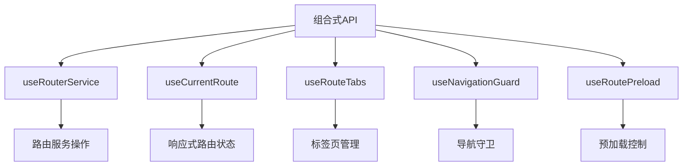
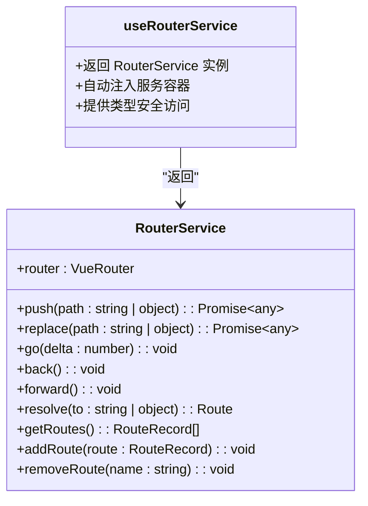
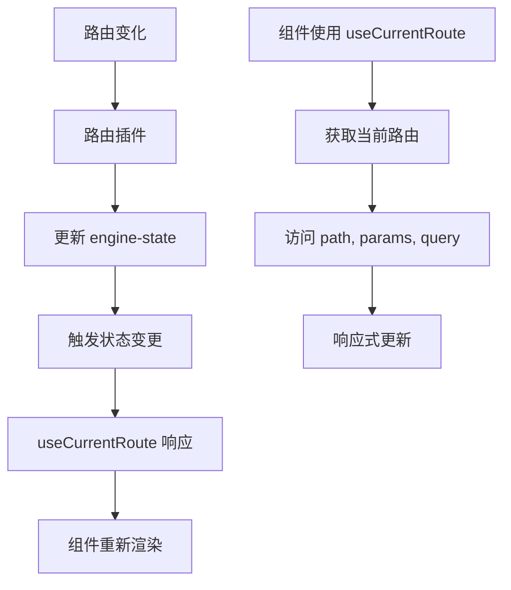
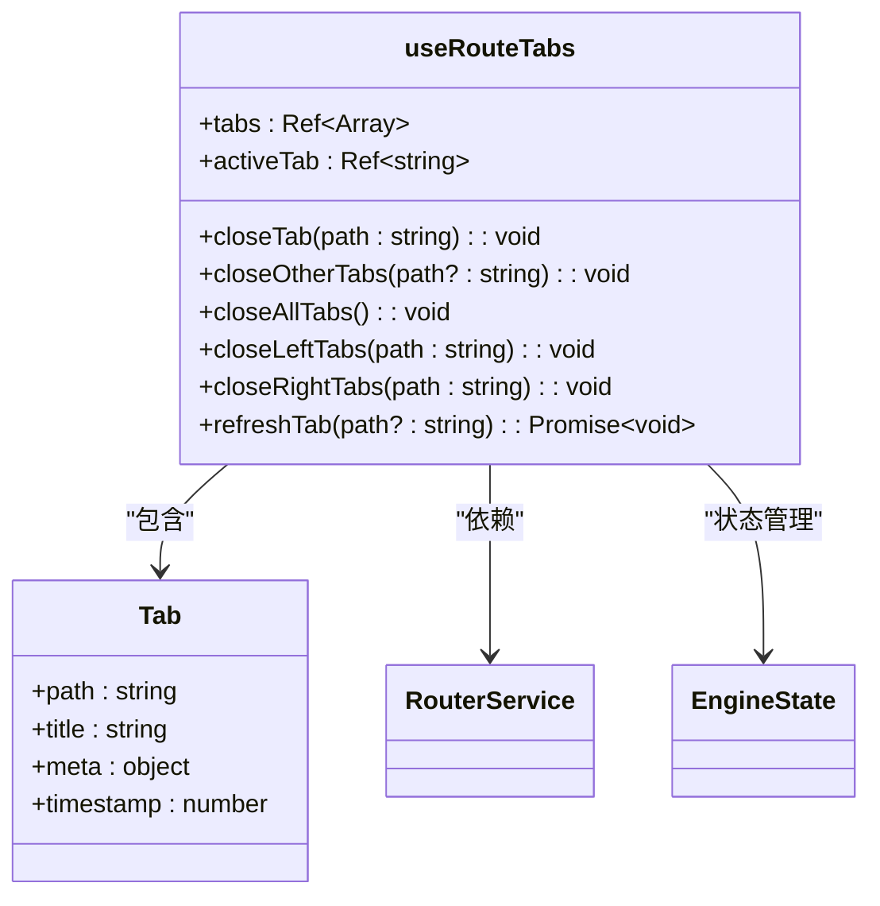
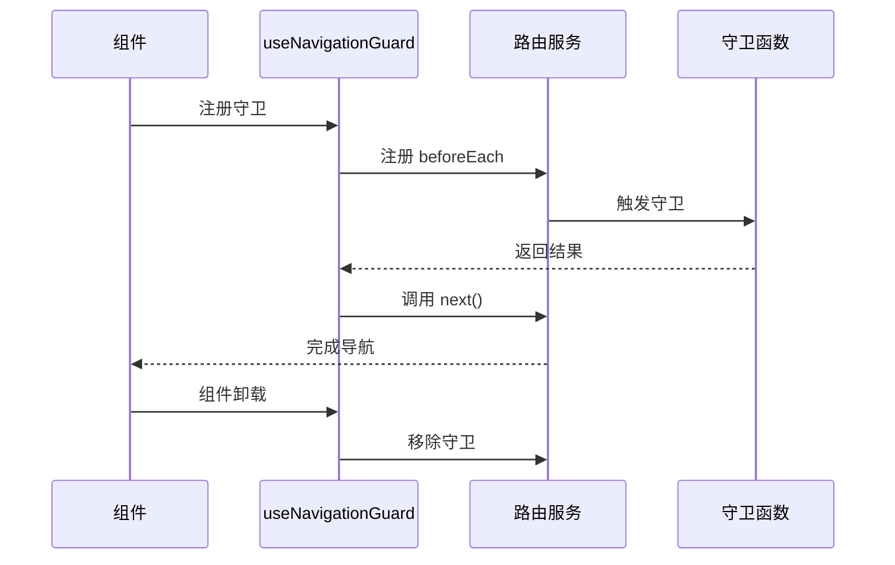
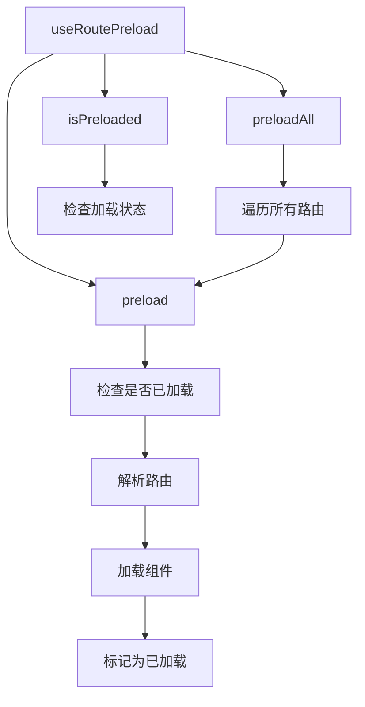
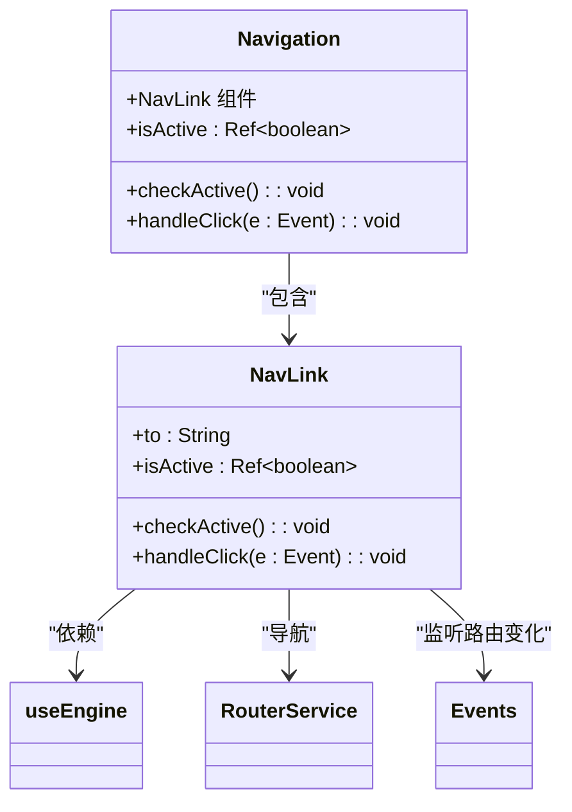
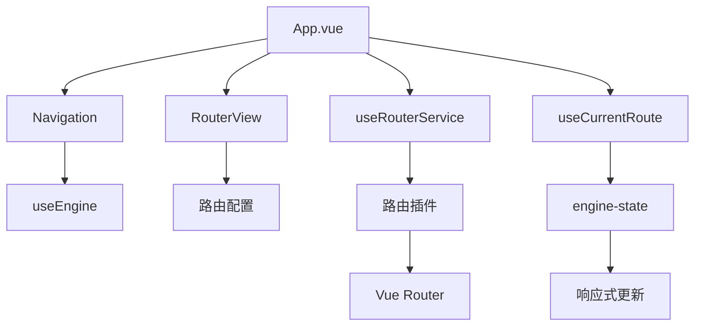
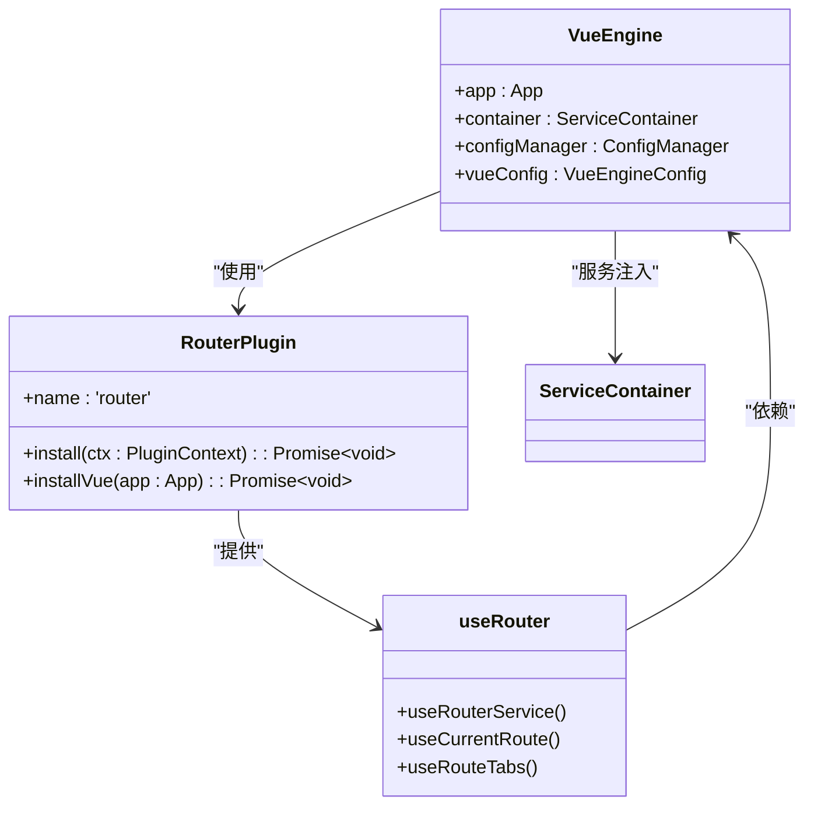

# 路由相关组合式API

<cite>
**本文档引用的文件**
- [use-router.ts](file://packages\vue3\src\composables\use-router.ts)
- [router-plugin.ts](file://packages\vue3\src\plugins\router-plugin.ts)
- [vue-engine.ts](file://packages\vue3\src\engine\vue-engine.ts)
- [Navigation.vue](file://packages\vue3\example\src\components\Navigation.vue)
- [App.vue](file://packages\vue3\example\src\App.vue)
- [Home.vue](file://packages\vue3\example\src\pages\Home.vue)
</cite>

## 目录
1. [简介](#简介)
2. [核心组合式API设计](#核心组合式api设计)
3. [useRouterService详解](#userouterservice详解)
4. [useCurrentRoute详解](#usecurrentroute详解)
5. [useRouteTabs详解](#useroutetabs详解)
6. [导航守卫与事件处理](#导航守卫与事件处理)
7. [路由预加载机制](#路由预加载机制)
8. [实际使用示例](#实际使用示例)
9. [架构集成分析](#架构集成分析)

## 简介
本文档全面介绍`useRouterService`、`useCurrentRoute`、`useRouteTabs`等路由相关组合式API的设计与使用。这些API为Vue3应用提供了完整的路由状态管理与导航控制能力，通过与Vue3适配器中的路由插件协同工作，实现了高效的路由管理解决方案。文档将详细说明这些API如何提供路由操作方法、响应式获取当前路由信息、管理多标签页逻辑，以及如何注册导航守卫和处理路由参数监听。

## 核心组合式API设计

### 组合式API架构


**图示来源**
- [use-router.ts](file://packages\vue3\src\composables\use-router.ts#L32-L388)

**本节来源**
- [use-router.ts](file://packages\vue3\src\composables\use-router.ts#L1-L390)

## useRouterService详解

### 功能概述
`useRouterService`是路由操作的核心API，提供对路由服务的访问，允许组件执行导航、路由解析等操作。

### API接口设计


**图示来源**
- [use-router.ts](file://packages\vue3\src\composables\use-router.ts#L32-L34)
- [router-plugin.ts](file://packages\vue3\src\plugins\router-plugin.ts#L17-L47)

### 使用示例
```typescript
import { useRouterService } from '@ldesign/engine-vue3'

const router = useRouterService()

// 导航到指定路由
router.push('/about')

// 替换当前路由
router.replace('/user/123')

// 带参数的导航
router.push({
  path: '/user',
  query: { id: '123' },
  params: { name: 'john' }
})
```

**本节来源**
- [use-router.ts](file://packages\vue3\src\composables\use-router.ts#L32-L34)

## useCurrentRoute详解

### 响应式路由状态
`useCurrentRoute`提供响应式的当前路由信息访问，当路由发生变化时，相关组件会自动更新。

### 数据流设计


**图示来源**
- [use-router.ts](file://packages\vue3\src\composables\use-router.ts#L55-L57)
- [vue-engine.ts](file://packages\vue3\src\engine\vue-engine.ts#L298-L319)

### 使用示例
```typescript
import { useCurrentRoute } from '@ldesign/engine-vue3'

const route = useCurrentRoute()

// 访问当前路由信息
console.log(route.value.path)
console.log(route.value.params)
console.log(route.value.query)
console.log(route.value.meta)

// 在模板中使用
// <div>当前路径: {{ route.value.path }}</div>
// <div>用户ID: {{ route.value.params.id }}</div>
```

**本节来源**
- [use-router.ts](file://packages\vue3\src\composables\use-router.ts#L55-L57)

## useRouteTabs详解

### 标签页管理架构


**图示来源**
- [use-router.ts](file://packages\vue3\src\composables\use-router.ts#L104-L208)

### 核心功能说明
`useRouteTabs`提供完整的多标签页管理功能：

1. **标签页状态管理**：通过`engine-state`管理标签页列表和激活状态
2. **标签页操作**：提供关闭、刷新、切换等操作方法
3. **固定标签支持**：通过`meta.affix`属性支持固定标签
4. **自动导航**：关闭标签时自动切换到合适的标签页

### 使用示例
```typescript
import { useRouteTabs } from '@ldesign/engine-vue3'

const {
  tabs,
  activeTab,
  closeTab,
  closeOtherTabs,
  closeAllTabs,
  closeLeftTabs,
  closeRightTabs,
  refreshTab
} = useRouteTabs()

// 渲染标签页
// <div v-for="tab in tabs.value" :key="tab.path">
//   <span>{{ tab.title }}</span>
//   <button @click="closeTab(tab.path)">×</button>
// </div>

// 关闭其他标签
closeOtherTabs()

// 刷新当前标签
refreshTab()
```

**本节来源**
- [use-router.ts](file://packages\vue3\src\composables\use-router.ts#L104-L208)

## 导航守卫与事件处理

### 导航守卫机制


**图示来源**
- [use-router.ts](file://packages\vue3\src\composables\use-router.ts#L283-L309)

### 自动清理机制
`useNavigationGuard`在组件卸载时自动移除导航守卫，防止内存泄漏：

1. **注册守卫**：调用`router.beforeEach`注册守卫
2. **返回清理函数**：`beforeEach`返回用于移除守卫的函数
3. **自动清理**：使用`onUnmounted`在组件卸载时调用清理函数

### 使用示例
```typescript
import { useNavigationGuard } from '@ldesign/engine-vue3'

useNavigationGuard((to, from) => {
  console.log('从', from.path, '导航到', to.path)

  // 权限检查
  if (to.meta.requiresAuth && !isLoggedIn.value) {
    return '/login'
  }
  
  // 允许导航
  return true
})
```

**本节来源**
- [use-router.ts](file://packages\vue3\src\composables\use-router.ts#L283-L309)

## 路由预加载机制

### 预加载架构


**图示来源**
- [use-router.ts](file://packages\vue3\src\composables\use-router.ts#L336-L388)

### 预加载策略
`useRoutePreload`提供智能的路由预加载功能：

1. **按需预加载**：`preload(path)`预加载指定路由
2. **批量预加载**：`preloadAll()`预加载所有路由
3. **状态检查**：`isPreloaded(path)`检查路由是否已预加载
4. **防重复加载**：使用`Set`避免重复预加载

### 使用示例
```typescript
import { useRoutePreload } from '@ldesign/engine-vue3'

const { preload, preloadAll, isPreloaded } = useRoutePreload()

// 鼠标悬停时预加载
const handleMouseEnter = () => {
  preload('/about')
}

// 组件挂载时预加载所有路由
onMounted(() => {
  preloadAll()
})

// 检查加载状态
if (!isPreloaded('/user')) {
  preload('/user')
}
```

**本节来源**
- [use-router.ts](file://packages\vue3\src\composables\use-router.ts#L336-L388)

## 实际使用示例

### 导航组件实现


**图示来源**
- [Navigation.vue](file://packages\vue3\example\src\components\Navigation.vue#L1-L120)

### 完整应用集成


**图示来源**
- [App.vue](file://packages\vue3\example\src\App.vue#L1-L129)
- [Home.vue](file://packages\vue3\example\src\pages\Home.vue#L1-L84)

## 架构集成分析

### 插件集成机制


**图示来源**
- [vue-engine.ts](file://packages\vue3\src\engine\vue-engine.ts#L74-L360)
- [router-plugin.ts](file://packages\vue3\src\plugins\router-plugin.ts#L60-L128)

### 状态管理集成
路由相关API通过`engine-state`实现状态管理，确保状态的响应式和一致性：

1. **集中状态管理**：所有路由状态存储在`engine-state`中
2. **响应式更新**：使用Vue的响应式系统
3. **跨组件共享**：状态在组件间共享
4. **自动同步**：路由变化自动更新状态

**本节来源**
- [vue-engine.ts](file://packages\vue3\src\engine\vue-engine.ts#L298-L319)
- [use-router.ts](file://packages\vue3\src\composables\use-router.ts#L56-L57)