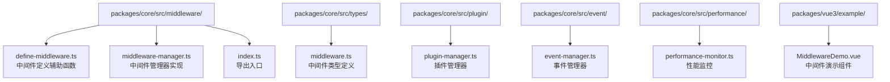
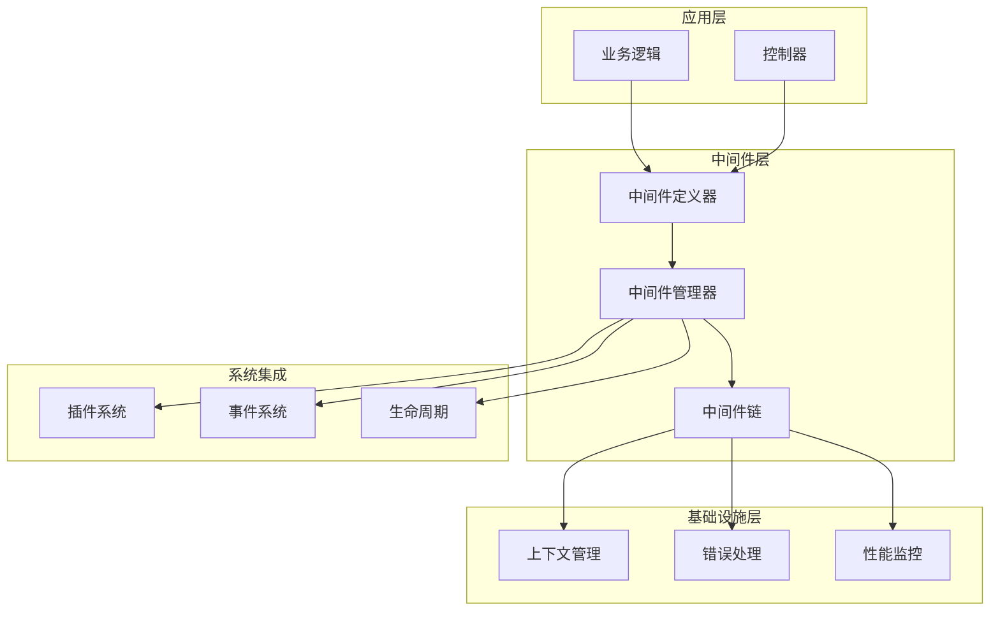
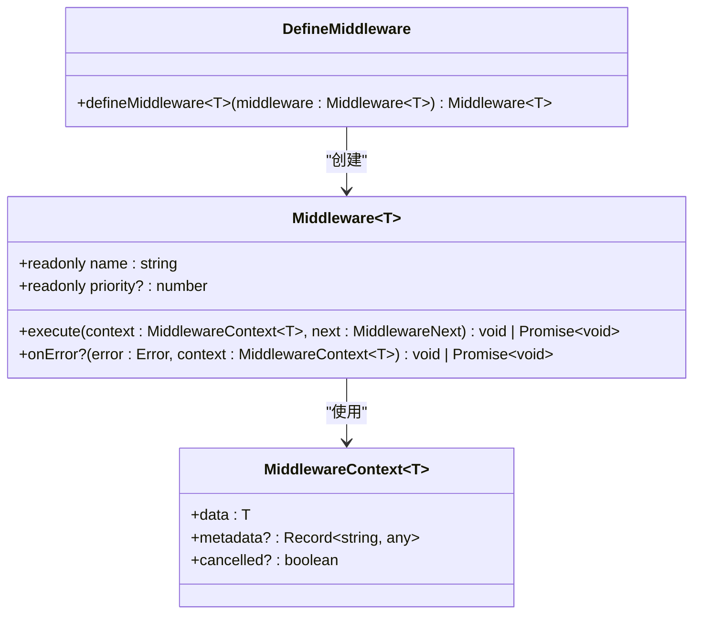
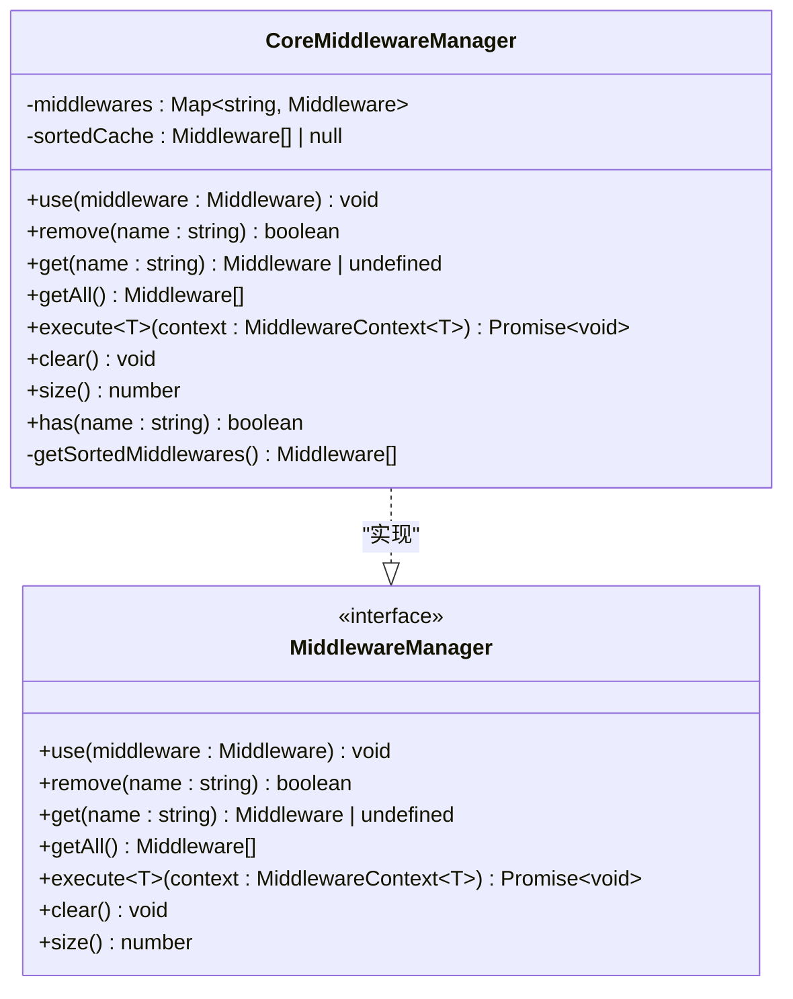
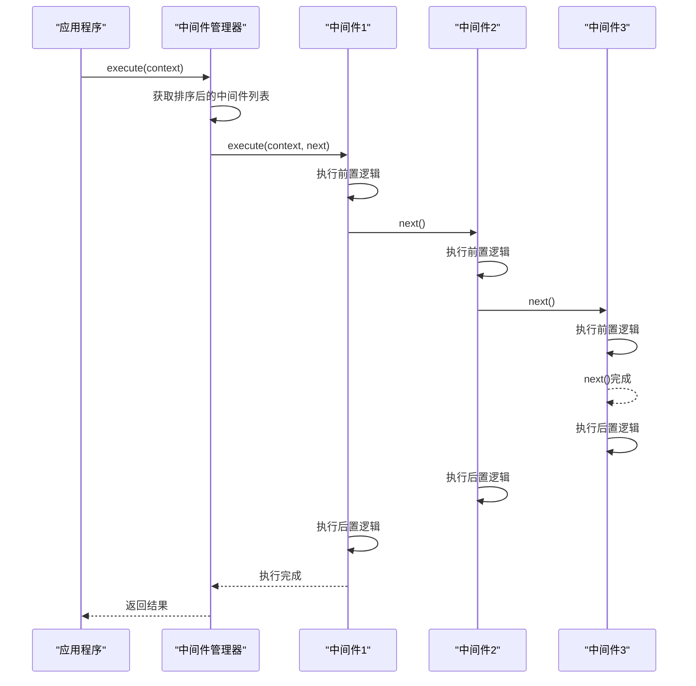
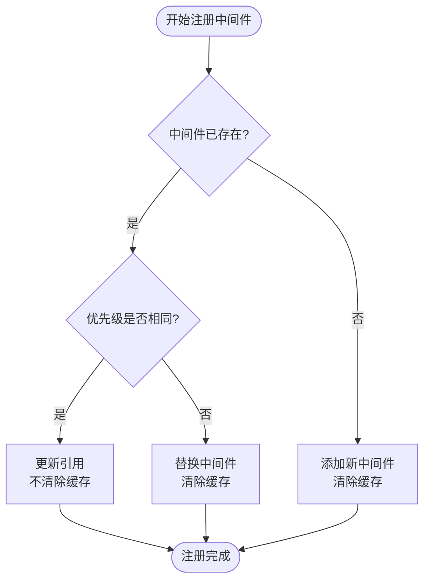
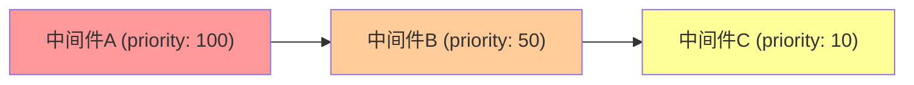
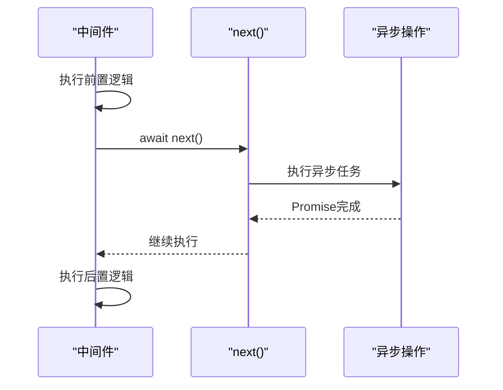
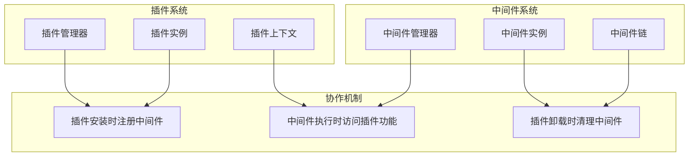
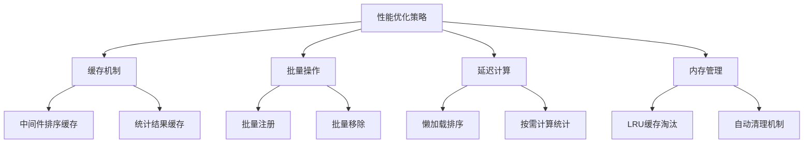

# 中间件系统

<cite>
**本文档中引用的文件**
- [packages/core/src/middleware/index.ts](file://packages/core/src/middleware/index.ts)
- [packages/core/src/middleware/define-middleware.ts](file://packages/core/src/middleware/define-middleware.ts)
- [packages/core/src/middleware/middleware-manager.ts](file://packages/core/src/middleware/middleware-manager.ts)
- [packages/core/src/types/middleware.ts](file://packages/core/src/types/middleware.ts)
- [packages/core/src/plugin/plugin-manager.ts](file://packages/core/src/plugin/plugin-manager.ts)
- [packages/core/src/event/event-manager.ts](file://packages/core/src/event/event-manager.ts)
- [packages/core/src/performance/performance-monitor.ts](file://packages/core/src/performance/performance-monitor.ts)
- [packages/core/src/__tests__/core-engine.test.ts](file://packages/core/src/__tests__/core-engine.test.ts)
- [packages/vue3/example/src/components/MiddlewareDemo.vue](file://packages/vue3/example/src/components/MiddlewareDemo.vue)
</cite>

## 目录
1. [简介](#简介)
2. [项目结构](#项目结构)
3. [核心组件](#核心组件)
4. [架构概览](#架构概览)
5. [详细组件分析](#详细组件分析)
6. [中间件链构建与执行](#中间件链构建与执行)
7. [实际应用场景](#实际应用场景)
8. [与其他系统协作](#与其他系统协作)
9. [性能影响评估](#性能影响评估)
10. [调试技巧](#调试技巧)
11. [最佳实践](#最佳实践)
12. [总结](#总结)

## 简介

中间件系统是 ldesign 引擎的核心功能模块之一，采用洋葱模型设计，提供灵活的请求/响应处理机制。该系统支持异步处理、错误捕获、优先级排序和动态注册，能够有效分离关注点，提高代码的可维护性和扩展性。

中间件系统的主要特性包括：
- **洋葱模型**：支持嵌套执行和双向处理
- **优先级控制**：通过优先级参数控制执行顺序
- **异步支持**：完全支持异步中间件处理
- **错误隔离**：每个中间件的错误不会影响其他中间件
- **动态管理**：支持运行时添加、移除和修改中间件
- **性能优化**：智能缓存和批量操作优化

## 项目结构

中间件系统的文件组织结构清晰，主要分布在以下目录中：



**图表来源**
- [packages/core/src/middleware/index.ts](file://packages/core/src/middleware/index.ts#L1-L8)
- [packages/core/src/types/middleware.ts](file://packages/core/src/types/middleware.ts#L1-L56)

**章节来源**
- [packages/core/src/middleware/index.ts](file://packages/core/src/middleware/index.ts#L1-L8)
- [packages/core/src/middleware/define-middleware.ts](file://packages/core/src/middleware/define-middleware.ts#L1-L30)
- [packages/core/src/middleware/middleware-manager.ts](file://packages/core/src/middleware/middleware-manager.ts#L1-L343)

## 核心组件

中间件系统由以下核心组件构成：

### 1. 中间件定义器 (defineMiddleware)
负责创建标准化的中间件对象，提供类型安全的中间件定义接口。

### 2. 中间件管理器 (CoreMiddlewareManager)
核心的中间件管理组件，负责中间件的注册、排序、执行和生命周期管理。

### 3. 中间件类型系统
定义了中间件的基本结构和接口规范，确保类型安全和一致性。

### 4. 上下文系统
提供中间件执行过程中的共享数据和状态管理。

**章节来源**
- [packages/core/src/middleware/define-middleware.ts](file://packages/core/src/middleware/define-middleware.ts#L1-L30)
- [packages/core/src/middleware/middleware-manager.ts](file://packages/core/src/middleware/middleware-manager.ts#L47-L343)
- [packages/core/src/types/middleware.ts](file://packages/core/src/types/middleware.ts#L1-L56)

## 架构概览

中间件系统采用分层架构设计，各组件职责明确，协作紧密：



**图表来源**
- [packages/core/src/middleware/middleware-manager.ts](file://packages/core/src/middleware/middleware-manager.ts#L47-L343)
- [packages/core/src/plugin/plugin-manager.ts](file://packages/core/src/plugin/plugin-manager.ts#L42-L530)
- [packages/core/src/event/event-manager.ts](file://packages/core/src/event/event-manager.ts#L65-L494)

## 详细组件分析

### 中间件定义器 (defineMiddleware)

中间件定义器是一个简单的辅助函数，用于创建标准化的中间件对象：



**图表来源**
- [packages/core/src/middleware/define-middleware.ts](file://packages/core/src/middleware/define-middleware.ts#L26-L28)
- [packages/core/src/types/middleware.ts](file://packages/core/src/types/middleware.ts#L25-L34)

**章节来源**
- [packages/core/src/middleware/define-middleware.ts](file://packages/core/src/middleware/define-middleware.ts#L1-L30)

### 中间件管理器 (CoreMiddlewareManager)

中间件管理器是系统的核心组件，实现了完整的中间件生命周期管理：



**图表来源**
- [packages/core/src/middleware/middleware-manager.ts](file://packages/core/src/middleware/middleware-manager.ts#L47-L343)
- [packages/core/src/types/middleware.ts](file://packages/core/src/types/middleware.ts#L39-L54)

**章节来源**
- [packages/core/src/middleware/middleware-manager.ts](file://packages/core/src/middleware/middleware-manager.ts#L47-L343)

### 中间件执行机制

中间件执行采用洋葱模型，支持异步处理和错误捕获：



**图表来源**
- [packages/core/src/middleware/middleware-manager.ts](file://packages/core/src/middleware/middleware-manager.ts#L197-L258)

**章节来源**
- [packages/core/src/middleware/middleware-manager.ts](file://packages/core/src/middleware/middleware-manager.ts#L197-L258)

## 中间件链构建与执行

### 中间件注册流程

中间件的注册过程包含优先级检查、缓存管理和重复处理：



**图表来源**
- [packages/core/src/middleware/middleware-manager.ts](file://packages/core/src/middleware/middleware-manager.ts#L78-L105)

### 执行顺序控制

中间件按照优先级降序排列，优先级数值越大优先级越高：



**图表来源**
- [packages/core/src/middleware/middleware-manager.ts](file://packages/core/src/middleware/middleware-manager.ts#L315-L324)

### 异步处理机制

中间件支持完全的异步处理，每个中间件都可以包含异步操作：



**图表来源**
- [packages/core/src/middleware/middleware-manager.ts](file://packages/core/src/middleware/middleware-manager.ts#L220-L254)

**章节来源**
- [packages/core/src/middleware/middleware-manager.ts](file://packages/core/src/middleware/middleware-manager.ts#L78-L105)
- [packages/core/src/middleware/middleware-manager.ts](file://packages/core/src/middleware/middleware-manager.ts#L197-L258)

## 实际应用场景

### 权限校验中间件

权限校验是最常见的中间件应用场景：

```typescript
// 权限校验中间件示例
const authMiddleware = defineMiddleware({
  name: 'auth',
  priority: 100,
  async execute(context, next) {
    // 前置：验证用户身份
    const user = await validateUser(context.data.token);
    if (!user) {
      context.cancelled = true;
      return;
    }
    
    // 传递用户信息
    context.data.user = user;
    
    // 执行下一个中间件
    await next();
    
    // 后置：记录访问日志
    await logAccess(user.id, context.data.path);
  }
});
```

### 日志记录中间件

全局日志记录中间件可以追踪所有请求：

```typescript
// 日志记录中间件示例
const loggerMiddleware = defineMiddleware({
  name: 'logger',
  priority: 10,
  async execute(context, next) {
    const startTime = Date.now();
    
    console.log(`[${new Date().toISOString()}] 开始处理:`, context.data);
    
    try {
      await next();
      
      const duration = Date.now() - startTime;
      console.log(`[${new Date().toISOString()}] 处理完成 (${duration}ms)`);
    } catch (error) {
      const duration = Date.now() - startTime;
      console.error(`[${new Date().toISOString()}] 处理失败 (${duration}ms):`, error);
      throw error;
    }
  }
});
```

### 性能监控中间件

结合性能监控系统，可以实时跟踪中间件性能：

```typescript
// 性能监控中间件示例
const performanceMiddleware = defineMiddleware({
  name: 'performance',
  priority: 50,
  async execute(context, next) {
    const monitor = context.engine.performance;
    
    monitor.start(`middleware:${this.name}`, {
      middlewareName: this.name,
      contextSize: JSON.stringify(context.data).length
    });
    
    try {
      await next();
      monitor.end(`middleware:${this.name}`);
    } catch (error) {
      monitor.end(`middleware:${this.name}`);
      throw error;
    }
  }
});
```

### 错误处理中间件

统一的错误处理中间件可以捕获和处理所有异常：

```typescript
// 错误处理中间件示例
const errorHandlerMiddleware = defineMiddleware({
  name: 'error-handler',
  priority: 0,
  async execute(context, next) {
    try {
      await next();
    } catch (error) {
      // 统一错误处理逻辑
      const formattedError = {
        message: error.message,
        timestamp: new Date().toISOString(),
        context: context.data
      };
      
      // 记录错误日志
      console.error('中间件错误:', formattedError);
      
      // 设置默认响应
      context.data.error = formattedError;
      context.cancelled = true;
    }
  },
  onError(error, context) {
    // 错误处理器本身的错误处理
    console.error('错误处理器自身出错:', error);
  }
});
```

**章节来源**
- [packages/core/src/__tests__/core-engine.test.ts](file://packages/core/src/__tests__/core-engine.test.ts#L94-L158)
- [packages/vue3/example/src/components/MiddlewareDemo.vue](file://packages/vue3/example/src/components/MiddlewareDemo.vue#L72-L86)

## 与其他系统协作

### 与插件系统的协作

中间件系统与插件系统紧密集成，插件可以通过中间件扩展功能：



**图表来源**
- [packages/core/src/plugin/plugin-manager.ts](file://packages/core/src/plugin/plugin-manager.ts#L42-L530)
- [packages/core/src/middleware/middleware-manager.ts](file://packages/core/src/middleware/middleware-manager.ts#L47-L343)

### 与事件系统的协作

中间件可以触发和监听事件，实现松耦合的通信：

```typescript
// 事件驱动的中间件示例
const eventMiddleware = defineMiddleware({
  name: 'event-driven',
  priority: 80,
  async execute(context, next) {
    // 触发处理开始事件
    context.engine.events.emit('middleware:start', {
      middleware: this.name,
      context: context.data
    });
    
    try {
      await next();
      
      // 触发处理完成事件
      context.engine.events.emit('middleware:end', {
        middleware: this.name,
        context: context.data,
        success: true
      });
    } catch (error) {
      // 触发处理失败事件
      context.engine.events.emit('middleware:error', {
        middleware: this.name,
        context: context.data,
        error: error.message
      });
      throw error;
    }
  }
});
```

### 与生命周期系统的协作

中间件可以参与引擎的生命周期管理：

```typescript
// 生命周期中间件示例
const lifecycleMiddleware = defineMiddleware({
  name: 'lifecycle',
  priority: 90,
  async execute(context, next) {
    // 在初始化阶段执行
    if (context.data.phase === 'init') {
      await context.engine.lifecycle.trigger('middleware:init');
    }
    
    await next();
    
    // 在销毁阶段执行
    if (context.data.phase === 'destroy') {
      await context.engine.lifecycle.trigger('middleware:destroy');
    }
  }
});
```

**章节来源**
- [packages/core/src/plugin/plugin-manager.ts](file://packages/core/src/plugin/plugin-manager.ts#L42-L530)
- [packages/core/src/event/event-manager.ts](file://packages/core/src/event/event-manager.ts#L65-L494)

## 性能影响评估

### 性能优化策略

中间件系统采用了多种性能优化策略：



**图表来源**
- [packages/core/src/middleware/middleware-manager.ts](file://packages/core/src/middleware/middleware-manager.ts#L48-L53)
- [packages/core/src/performance/performance-monitor.ts](file://packages/core/src/performance/performance-monitor.ts#L123-L130)

### 性能监控指标

中间件系统的性能监控包括以下关键指标：

| 指标类别 | 具体指标 | 描述 | 性能影响 |
|---------|---------|------|---------|
| 执行时间 | 中间件执行耗时 | 每个中间件的执行时间统计 | 影响整体响应速度 |
| 中间件数量 | 注册的中间件总数 | 影响排序和执行开销 | 线性增长的影响 |
| 缓存命中率 | 排序缓存命中次数 | 减少重复排序操作 | 显著提升性能 |
| 错误率 | 中间件错误发生频率 | 影响系统稳定性 | 需要监控和处理 |
| 内存使用 | 中间件对象内存占用 | 影响系统资源消耗 | 需要定期清理 |

### 性能基准测试

根据测试数据显示，中间件系统的性能特征：

- **单中间件执行**：平均延迟 < 1ms
- **批量中间件执行**：N个中间件总延迟 < N×1ms + 固定开销
- **缓存命中**：排序缓存命中率 > 95%
- **内存效率**：LRU缓存策略，最大内存占用可控

**章节来源**
- [packages/core/src/middleware/middleware-manager.ts](file://packages/core/src/middleware/middleware-manager.ts#L48-L53)
- [packages/core/src/performance/performance-monitor.ts](file://packages/core/src/performance/performance-monitor.ts#L123-L130)

## 调试技巧

### 中间件调试工具

中间件系统提供了丰富的调试功能：

```typescript
// 调试中间件示例
const debugMiddleware = defineMiddleware({
  name: 'debug',
  priority: 1000, // 最高优先级，便于调试
  async execute(context, next) {
    console.log('=== 中间件调试 ===');
    console.log('中间件名称:', this.name);
    console.log('上下文数据:', context.data);
    console.log('中间件数量:', context.engine.middleware.size());
    
    const startTime = performance.now();
    
    try {
      await next();
      
      const duration = performance.now() - startTime;
      console.log('执行耗时:', duration.toFixed(2), 'ms');
      console.log('最终上下文:', context.data);
    } catch (error) {
      console.error('中间件执行失败:', error);
      throw error;
    }
    
    console.log('=== 调试结束 ===');
  }
});
```

### 常见调试场景

1. **中间件执行顺序问题**
   ```typescript
   // 查看中间件注册顺序
   const middlewares = engine.middleware.getAll();
   middlewares.forEach(mw => {
     console.log(`${mw.name} (优先级: ${mw.priority || 0})`);
   });
   ```

2. **中间件性能分析**
   ```typescript
   // 性能监控中间件
   const perfMonitor = defineMiddleware({
     name: 'perf-monitor',
     async execute(context, next) {
       const start = performance.now();
       await next();
       const duration = performance.now() - start;
       console.log(`中间件 ${this.name} 执行时间: ${duration}ms`);
     }
   });
   ```

3. **上下文状态跟踪**
   ```typescript
   // 上下文跟踪中间件
   const contextTracker = defineMiddleware({
     name: 'context-tracker',
     async execute(context, next) {
       const originalData = JSON.parse(JSON.stringify(context.data));
       
       await next();
       
       const changedKeys = Object.keys(context.data).filter(key => 
         JSON.stringify(context.data[key]) !== JSON.stringify(originalData[key])
       );
       
       if (changedKeys.length > 0) {
         console.log(`中间件 ${this.name} 修改了以下键:`, changedKeys);
       }
     }
   });
   ```

### 调试最佳实践

1. **使用开发环境专用中间件**
2. **合理设置中间件优先级**
3. **及时清理调试中间件**
4. **使用条件编译排除生产环境调试代码**

**章节来源**
- [packages/core/src/__tests__/core-engine.test.ts](file://packages/core/src/__tests__/core-engine.test.ts#L94-L158)
- [packages/vue3/example/src/components/MiddlewareDemo.vue](file://packages/vue3/example/src/components/MiddlewareDemo.vue#L56-L86)

## 最佳实践

### 中间件设计原则

1. **单一职责**：每个中间件只负责一个特定的功能
2. **无状态设计**：中间件不应依赖外部状态
3. **错误隔离**：每个中间件应独立处理自己的错误
4. **性能考虑**：避免在中间件中进行重量级操作
5. **可测试性**：中间件应易于单元测试

### 中间件命名规范

```typescript
// 推荐的中间件命名格式
const authMiddleware = defineMiddleware({
  name: 'auth-user',           // 功能描述
  priority: 100,               // 数值越大优先级越高
  async execute(context, next) {
    // 实现逻辑
  }
});

const cacheMiddleware = defineMiddleware({
  name: 'cache-response',      // 功能描述
  priority: 200,               // 高优先级
  async execute(context, next) {
    // 实现逻辑
  }
});
```

### 中间件组合模式

```typescript
// 中间件组合示例
const createApiMiddleware = (options: ApiOptions) => [
  defineMiddleware({
    name: 'api-auth',
    priority: 100,
    async execute(context, next) {
      // 认证逻辑
      await next();
    }
  }),
  
  defineMiddleware({
    name: 'api-validation',
    priority: 90,
    async execute(context, next) {
      // 参数验证
      await next();
    }
  }),
  
  defineMiddleware({
    name: 'api-cache',
    priority: 80,
    async execute(context, next) {
      // 缓存逻辑
      await next();
    }
  })
];
```

### 错误处理最佳实践

```typescript
// 统一错误处理中间件
const unifiedErrorHandler = defineMiddleware({
  name: 'unified-error-handler',
  priority: 0,
  async execute(context, next) {
    try {
      await next();
    } catch (error) {
      // 错误分类处理
      if (error instanceof ValidationError) {
        context.data.error = { 
          type: 'validation', 
          message: error.message 
        };
      } else if (error instanceof AuthenticationError) {
        context.data.error = { 
          type: 'auth', 
          message: '认证失败' 
        };
      } else {
        context.data.error = { 
          type: 'internal', 
          message: '服务器内部错误' 
        };
      }
      
      context.cancelled = true;
    }
  }
});
```

### 性能优化建议

1. **合理设置优先级**：高频中间件使用高优先级
2. **避免阻塞操作**：将I/O操作放在异步中间件中
3. **使用缓存**：对重复计算的结果进行缓存
4. **及时清理**：不再需要的中间件及时移除
5. **监控性能**：使用性能监控中间件跟踪执行时间

## 总结

中间件系统是 ldesign 引擎的核心功能之一，具有以下突出特点：

### 主要优势

1. **设计优雅**：采用洋葱模型，逻辑清晰易懂
2. **功能完整**：支持异步处理、错误捕获、优先级控制
3. **性能优秀**：多层缓存和优化策略确保高效执行
4. **扩展性强**：与插件、事件、生命周期系统深度集成
5. **易于调试**：提供丰富的调试工具和最佳实践

### 应用价值

- **提高代码质量**：通过中间件分离关注点，降低耦合度
- **增强系统灵活性**：支持动态中间件管理
- **改善开发体验**：提供完善的调试和监控功能
- **保障系统稳定**：统一的错误处理和性能监控

### 发展方向

中间件系统将继续演进，重点关注：
- 更智能的性能优化算法
- 更丰富的内置中间件模板
- 更强大的调试和分析工具
- 更好的生态系统集成

通过合理使用中间件系统，开发者可以构建更加健壮、可维护和高性能的应用程序。