# 事件系统

<cite>
**本文档中引用的文件**
- [event-manager.ts](file://packages/core/src/event/event-manager.ts)
- [event.ts](file://packages/core/src/types/event.ts)
- [events.ts](file://packages/core/src/constants/events.ts)
- [index.ts](file://packages/core/src/event/index.ts)
- [core-engine.ts](file://packages/core/src/engine/core-engine.ts)
- [core-engine.test.ts](file://packages/core/src/__tests__/core-engine.test.ts)
- [EventDemo.vue](file://packages/vue3/example/src/components/EventDemo.vue)
- [i18n-plugin.ts](file://packages/vue3/src/plugins/i18n-plugin.ts)
- [router-plugin.ts](file://packages/vue3/src/plugins/router-plugin.ts)
</cite>

## 目录
1. [简介](#简介)
2. [项目结构](#项目结构)
3. [核心组件](#核心组件)
4. [架构概览](#架构概览)
5. [详细组件分析](#详细组件分析)
6. [通配符匹配机制](#通配符匹配机制)
7. [跨组件通信模式](#跨组件通信模式)
8. [性能优化策略](#性能优化策略)
9. [最佳实践指南](#最佳实践指南)
10. [故障排除指南](#故障排除指南)
11. [总结](#总结)

## 简介

基于发布-订阅模式的事件系统是 LDesign Engine 的核心组件之一，提供了高效、灵活的跨组件通信机制。该系统支持标准的事件发布（emit）、订阅（on）、一次性监听（once）和取消订阅（off）操作，同时还具备强大的通配符匹配功能，能够满足复杂的模块化应用需求。

事件系统的设计目标是实现松耦合的模块化架构，让不同的插件和组件能够通过事件进行通信，而无需直接依赖彼此。这种设计模式特别适合大型应用中的插件化架构，能够显著提高系统的可维护性和扩展性。

## 项目结构

事件系统的文件组织结构清晰明确，主要分布在以下目录中：

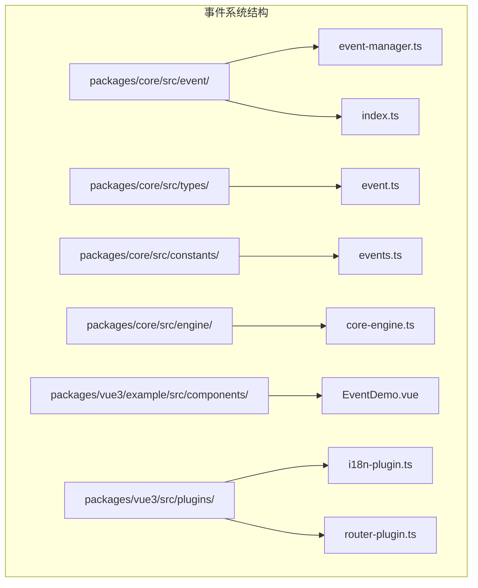

**图表来源**
- [event-manager.ts](file://packages/core/src/event/event-manager.ts#L1-L50)
- [event.ts](file://packages/core/src/types/event.ts#L1-L33)
- [events.ts](file://packages/core/src/constants/events.ts#L1-L220)

**章节来源**
- [event-manager.ts](file://packages/core/src/event/event-manager.ts#L1-L494)
- [index.ts](file://packages/core/src/event/index.ts#L1-L7)

## 核心组件

事件系统由以下几个核心组件构成：

### 事件管理器（CoreEventManager）
事件管理器是整个系统的核心，实现了完整的发布-订阅模式功能。它维护着事件处理器的存储结构，支持精确匹配和通配符匹配两种监听模式。

### 类型定义（Event Types）
定义了事件系统的基础类型，包括事件处理器、取消订阅函数和事件管理器接口，确保类型安全。

### 事件常量（Event Constants）
提供了标准化的事件命名规范和预定义的事件常量，便于在整个应用中保持一致性。

### 插件集成
事件系统与插件系统深度集成，允许插件通过事件与其他组件进行通信。

**章节来源**
- [event-manager.ts](file://packages/core/src/event/event-manager.ts#L65-L494)
- [event.ts](file://packages/core/src/types/event.ts#L1-L33)
- [events.ts](file://packages/core/src/constants/events.ts#L1-L220)

## 架构概览

事件系统采用分层架构设计，从底层的数据结构到上层的API接口，形成了完整的事件处理体系：

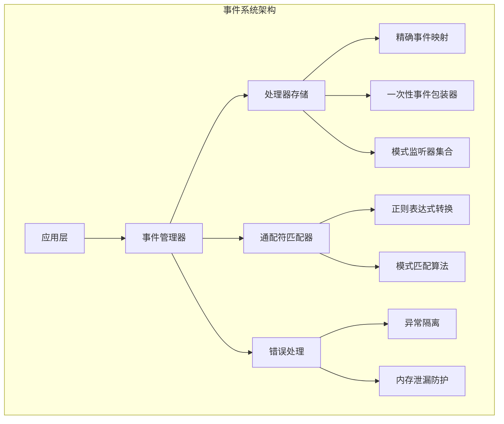

**图表来源**
- [event-manager.ts](file://packages/core/src/event/event-manager.ts#L65-L133)
- [event-manager.ts](file://packages/core/src/event/event-manager.ts#L401-L475)

**章节来源**
- [event-manager.ts](file://packages/core/src/event/event-manager.ts#L65-L133)
- [core-engine.ts](file://packages/core/src/engine/core-engine.ts#L75-L98)

## 详细组件分析

### 事件管理器实现

事件管理器采用了多种数据结构来优化不同场景下的性能：

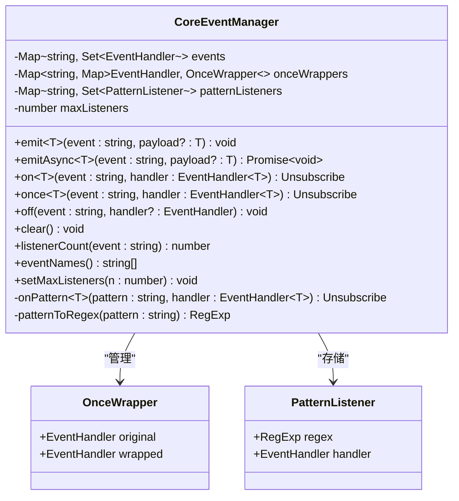

**图表来源**
- [event-manager.ts](file://packages/core/src/event/event-manager.ts#L16-L63)
- [event-manager.ts](file://packages/core/src/event/event-manager.ts#L65-L133)

#### 核心数据结构

事件管理器使用了三种主要的数据结构来存储不同类型的操作：

1. **事件处理器映射（events）**：使用 Map 存储精确事件名称到处理器集合的映射
2. **一次性事件包装器（onceWrappers）**：专门管理 once 监听器的包装关系
3. **模式监听器集合（patternListeners）**：存储通配符模式监听器

#### 发布操作（emit）

发布操作经过精心优化，确保在没有监听器时快速返回，并且单个处理器的错误不会影响其他处理器：

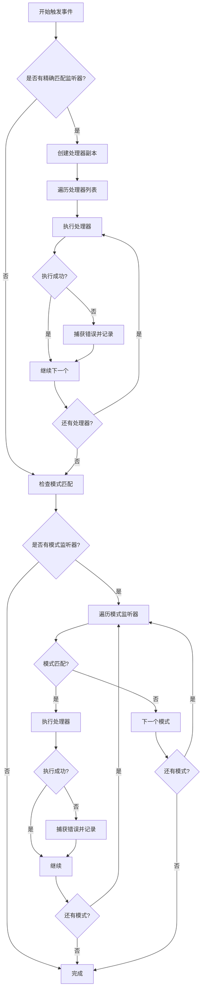

**图表来源**
- [event-manager.ts](file://packages/core/src/event/event-manager.ts#L100-L133)

#### 订阅操作（on）

订阅操作支持精确匹配和通配符匹配两种模式，根据事件名称自动选择合适的处理路径：

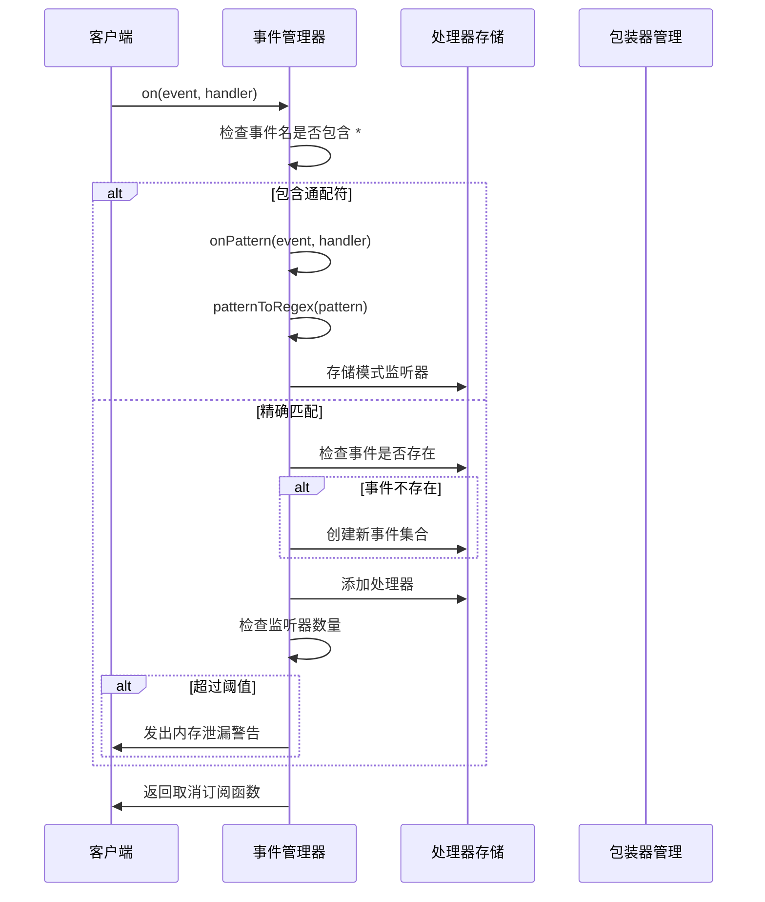

**图表来源**
- [event-manager.ts](file://packages/core/src/event/event-manager.ts#L203-L270)

**章节来源**
- [event-manager.ts](file://packages/core/src/event/event-manager.ts#L100-L133)
- [event-manager.ts](file://packages/core/src/event/event-manager.ts#L203-L270)

### 一次性监听器（once）

一次性监听器通过包装器模式实现，确保事件触发后自动移除监听器：

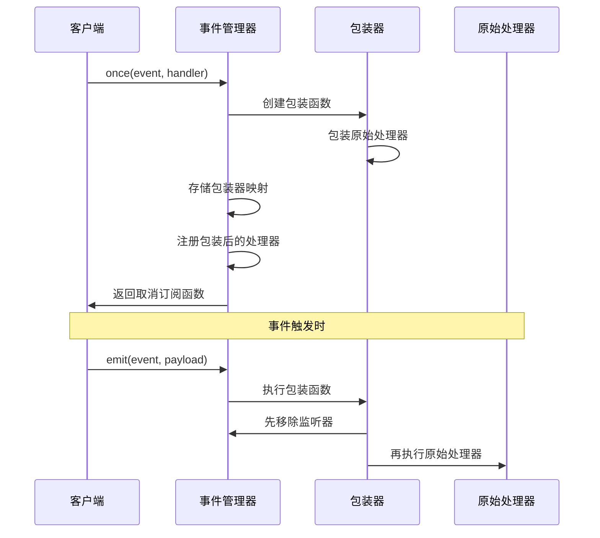

**图表来源**
- [event-manager.ts](file://packages/core/src/event/event-manager.ts#L247-L270)

**章节来源**
- [event-manager.ts](file://packages/core/src/event/event-manager.ts#L247-L270)

### 异步事件处理（emitAsync）

异步事件处理提供了并行执行所有处理器的能力，适用于需要等待所有处理器完成的场景：

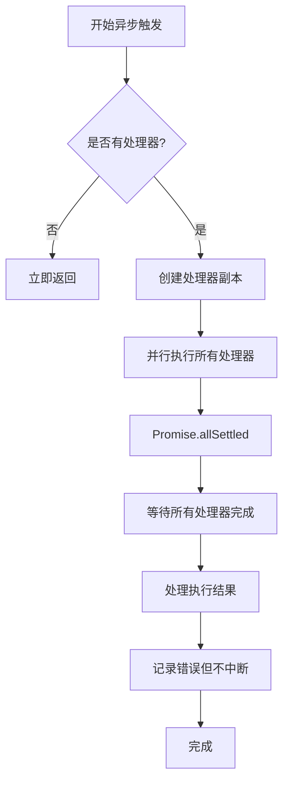

**图表来源**
- [event-manager.ts](file://packages/core/src/event/event-manager.ts#L150-L169)

**章节来源**
- [event-manager.ts](file://packages/core/src/event/event-manager.ts#L150-L169)

## 通配符匹配机制

事件系统支持强大的通配符匹配功能，允许监听特定模式的事件：

### 通配符语法

| 语法 | 含义 | 示例 |
|------|------|------|
| `*` | 匹配任意字符（不包括冒号） | `user:*` 匹配 `user:login`, `user:logout` |
| `**` | 匹配任意字符（包括冒号） | `**` 匹配所有事件，`user:**` 匹配 `user:profile:edit` |
| 字面量 | 匹配具体字符 | `app:ready` 只匹配精确事件名 |

### 正则表达式转换

通配符模式会被转换为高效的正则表达式：

```mermaid
flowchart LR
A[通配符模式] --> B[转义特殊字符]
B --> C[处理 **]
C --> D[处理 *]
D --> E[添加锚点]
E --> F[生成正则表达式]
subgraph "转换示例"
G[user:*] --> H[^user:[^:]*$]
I[*] --> J[^:]*$
K[user:**] --> L[^user:.*$]
end
```

**图表来源**
- [event-manager.ts](file://packages/core/src/event/event-manager.ts#L463-L475)

### 模式匹配算法

模式匹配采用高效的正则表达式匹配算法，确保在大量事件监听器的情况下仍能保持良好的性能：

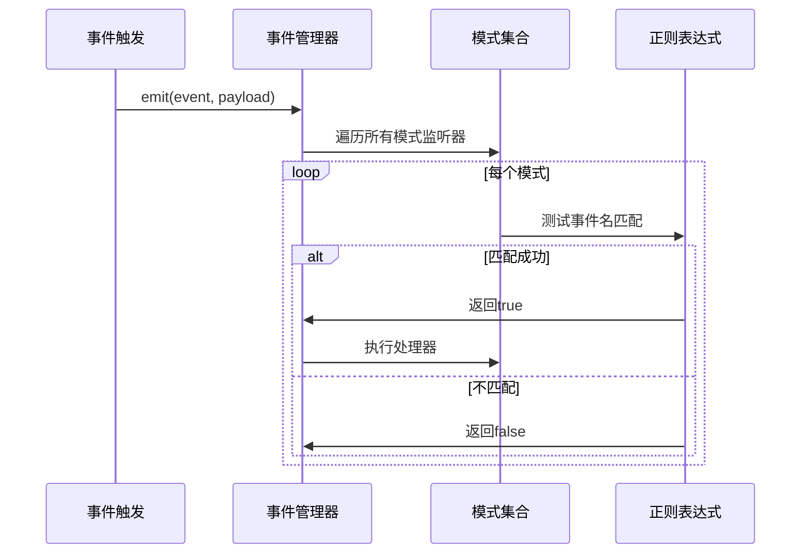

**图表来源**
- [event-manager.ts](file://packages/core/src/event/event-manager.ts#L120-L132)

**章节来源**
- [event-manager.ts](file://packages/core/src/event/event-manager.ts#L401-L475)

## 跨组件通信模式

事件系统在 LDesign Engine 中扮演着跨组件通信的核心角色，特别是在插件系统中发挥重要作用：

### 插件间通信

插件可以通过事件系统与其他插件进行通信，实现松耦合的架构：

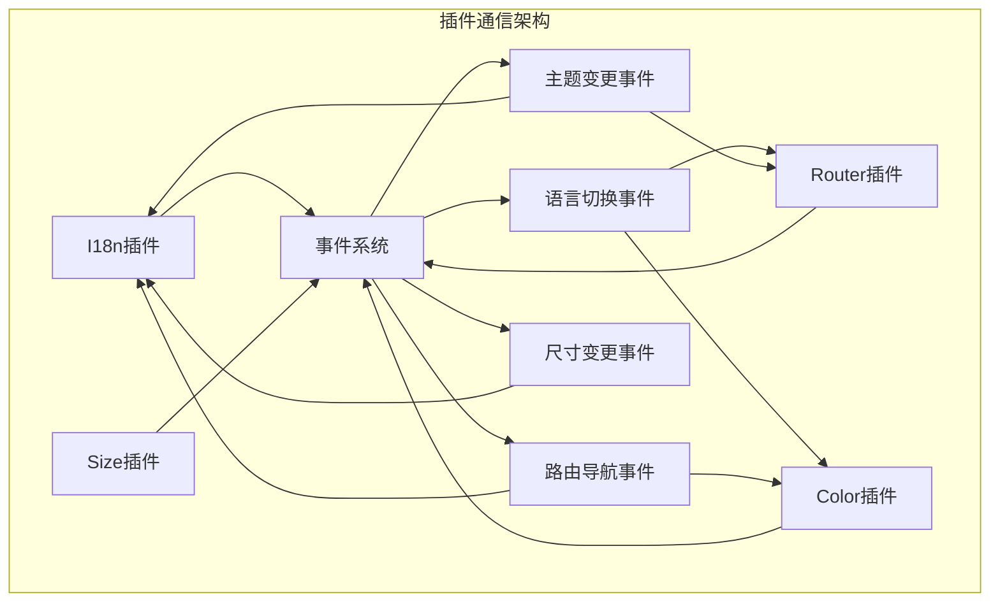

**图表来源**
- [i18n-plugin.ts](file://packages/vue3/src/plugins/i18n-plugin.ts#L151-L156)
- [router-plugin.ts](file://packages/vue3/src/plugins/router-plugin.ts#L66-L95)

### 生命周期事件

事件系统与生命周期管理紧密集成，提供完整的应用生命周期事件：

| 事件类别 | 事件名称 | 触发时机 | 数据格式 |
|----------|----------|----------|----------|
| 引擎核心 | `engine:core:init:start` | 引擎初始化开始 | `{}` |
| 引擎核心 | `engine:core:init:complete` | 引擎初始化完成 | `{}` |
| 引擎核心 | `engine:core:init:error` | 引擎初始化失败 | `{error: Error}` |
| 引擎核心 | `engine:core:destroy` | 引擎销毁 | `{}` |
| 引擎核心 | `engine:core:app:created` | 应用创建完成 | `{app: unknown}` |
| 引擎核心 | `engine:core:app:beforeMount` | 应用挂载前 | `{}` |
| 引擎核心 | `engine:core:app:mounted` | 应用挂载完成 | `{}` |
| 引擎核心 | `engine:core:app:unmounted` | 应用卸载 | `{}` |

### 事件命名规范

为了保持一致性，事件名称遵循统一的命名规范：
```
plugin:{pluginName}:{category}:{action}
```

例如：
- `plugin:i18n:lifecycle:installed` - I18n插件安装完成
- `plugin:router:navigation:start` - 路由导航开始
- `plugin:color:theme:changed` - 主题变更完成

**章节来源**
- [events.ts](file://packages/core/src/constants/events.ts#L42-L220)
- [i18n-plugin.ts](file://packages/vue3/src/plugins/i18n-plugin.ts#L151-L156)

## 性能优化策略

事件系统采用了多种性能优化策略，确保在高并发场景下仍能保持良好的性能：

### 内存管理优化

1. **处理器副本创建**：在遍历处理器集合时创建副本，避免在迭代过程中修改集合
2. **自动清理机制**：当事件没有监听器时自动清理空的事件映射
3. **包装器管理**：一次性监听器使用专门的包装器管理，防止内存泄漏

### 错误隔离机制

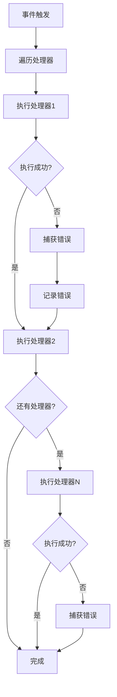

**图表来源**
- [event-manager.ts](file://packages/core/src/event/event-manager.ts#L109-L116)

### 性能监控

事件系统内置了性能监控功能，包括：

1. **监听器数量警告**：当某个事件的监听器数量超过阈值时发出警告
2. **内存泄漏检测**：通过监听器数量监控防止内存泄漏
3. **执行时间统计**：跟踪事件处理的执行时间

### 异步处理优化

异步事件处理采用并行执行策略，提高整体吞吐量：

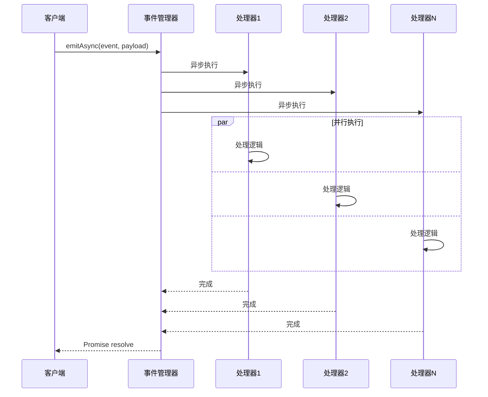

**图表来源**
- [event-manager.ts](file://packages/core/src/event/event-manager.ts#L150-L169)

**章节来源**
- [event-manager.ts](file://packages/core/src/event/event-manager.ts#L100-L169)
- [event-manager.ts](file://packages/core/src/event/event-manager.ts#L217-L223)

## 最佳实践指南

### 事件命名规范

1. **使用层次化命名**：遵循 `plugin:{pluginName}:{category}:{action}` 的命名模式
2. **语义化命名**：事件名称应清晰表达其含义和用途
3. **避免冲突**：确保事件名称在应用范围内唯一

### 内存管理最佳实践

1. **及时清理**：不再需要的监听器应及时取消订阅
2. **使用一次性监听器**：对于只需要触发一次的场景使用 `once` 方法
3. **避免内存泄漏**：定期检查监听器数量，避免过度积累

### 错误处理策略

1. **错误隔离**：每个事件处理器独立处理错误，不影响其他处理器
2. **日志记录**：重要的错误应该记录到控制台或日志系统
3. **优雅降级**：事件处理失败不应影响应用的正常运行

### 性能优化建议

1. **合理使用通配符**：通配符匹配虽然强大，但性能开销较大，应谨慎使用
2. **批量操作**：对于大量相似事件，考虑使用批量处理策略
3. **异步处理**：对于耗时操作，使用异步事件处理

### 调试技巧

1. **事件日志**：在开发环境中启用详细的事件日志
2. **监听器计数**：定期检查监听器数量，监控潜在的内存问题
3. **模式匹配验证**：测试通配符模式的匹配准确性

**章节来源**
- [events.ts](file://packages/core/src/constants/events.ts#L41-L41)
- [event-manager.ts](file://packages/core/src/event/event-manager.ts#L217-L223)

## 故障排除指南

### 常见问题及解决方案

#### 内存泄漏问题

**症状**：监听器数量持续增长，内存使用量不断增加

**原因**：忘记取消订阅或存在循环引用

**解决方案**：
1. 使用 `setMaxListeners()` 设置合理的监听器数量阈值
2. 确保在组件销毁时调用取消订阅函数
3. 使用 `listenerCount()` 检查监听器数量

#### 事件未触发

**症状**：事件监听器没有被调用

**原因**：
1. 事件名称拼写错误
2. 监听器被意外移除
3. 通配符模式不匹配

**解决方案**：
1. 检查事件名称的拼写
2. 使用 `eventNames()` 查看当前存在的事件
3. 验证通配符模式的匹配规则

#### 性能问题

**症状**：事件处理速度慢，影响应用响应

**原因**：
1. 处理器数量过多
2. 处理器执行时间过长
3. 频繁的事件触发

**解决方案**：
1. 优化处理器逻辑，减少不必要的计算
2. 使用异步处理分散负载
3. 考虑使用事件节流或防抖

### 调试工具

事件系统提供了丰富的调试和诊断功能：

| 方法 | 用途 | 返回值 |
|------|------|--------|
| `listenerCount(event)` | 获取指定事件的监听器数量 | number |
| `eventNames()` | 获取所有事件名称列表 | string[] |
| `setMaxListeners(n)` | 设置最大监听器数量阈值 | void |
| `clear()` | 清空所有事件监听器 | void |

**章节来源**
- [event-manager.ts](file://packages/core/src/event/event-manager.ts#L357-L399)

## 总结

LDesign Engine 的事件系统是一个功能完整、性能优异的发布-订阅模式实现。它不仅提供了标准的事件操作功能，还包含了通配符匹配、异步处理、内存管理和错误隔离等高级特性。

### 主要优势

1. **类型安全**：完整的 TypeScript 类型定义确保编译时类型检查
2. **性能优化**：多种优化策略确保在高并发场景下的良好性能
3. **易于使用**：简洁的 API 设计降低了学习成本
4. **功能丰富**：支持通配符、异步处理、一次性监听等多种高级功能
5. **内存安全**：内置的内存泄漏检测和自动清理机制

### 适用场景

- 插件间的解耦通信
- 应用级别的事件通知
- 组件间的状态同步
- 生命周期事件管理
- 跨模块的功能扩展

通过合理使用事件系统，开发者可以构建出高度模块化、可维护性强的应用架构，充分发挥插件化架构的优势。