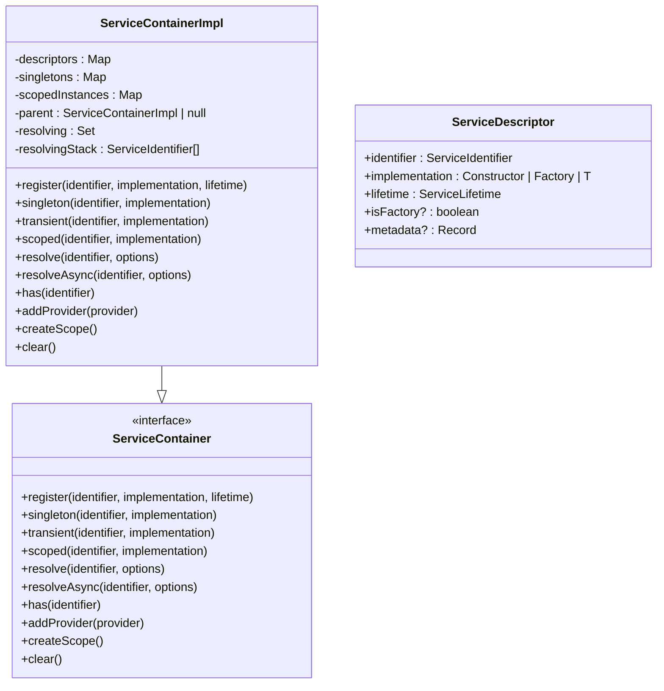
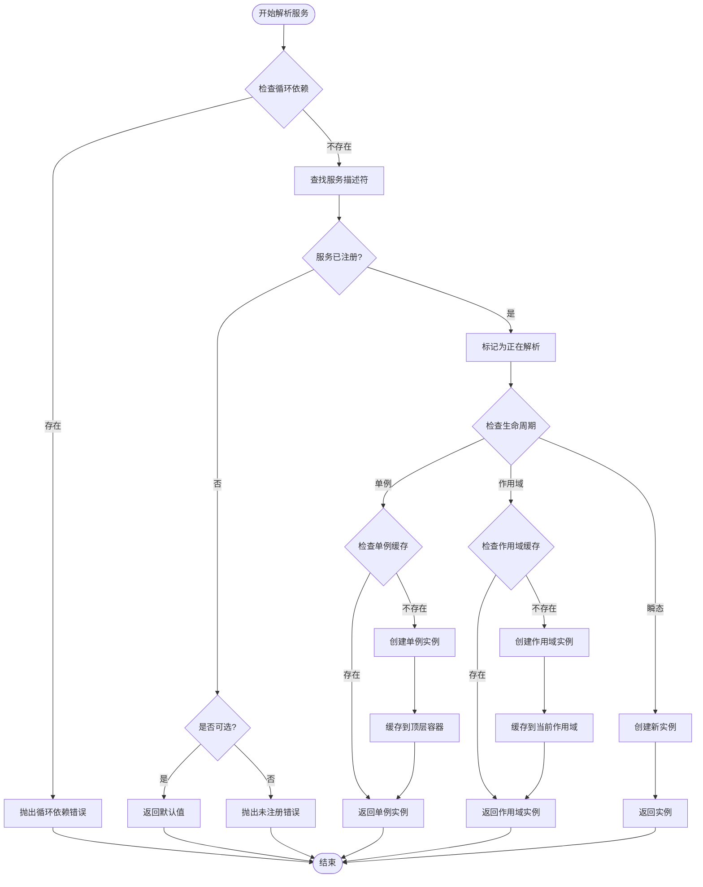
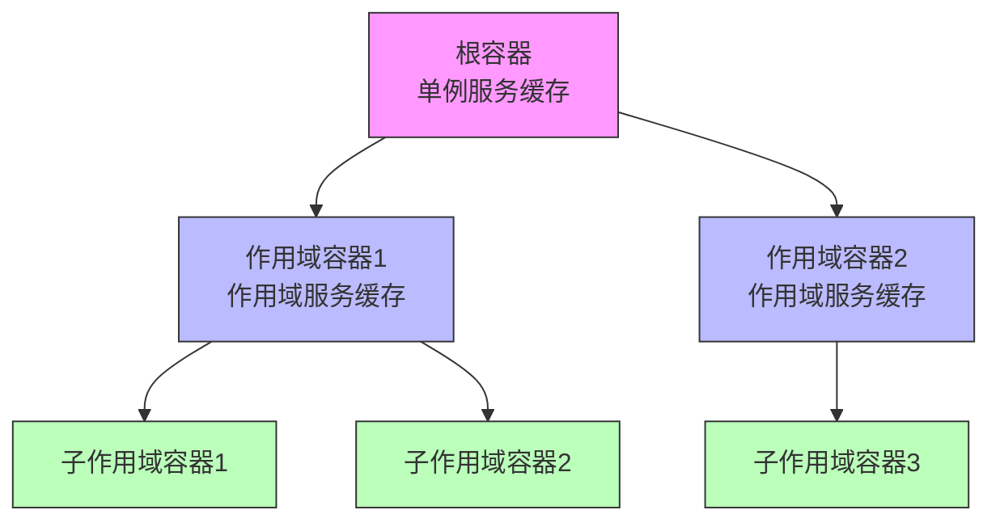
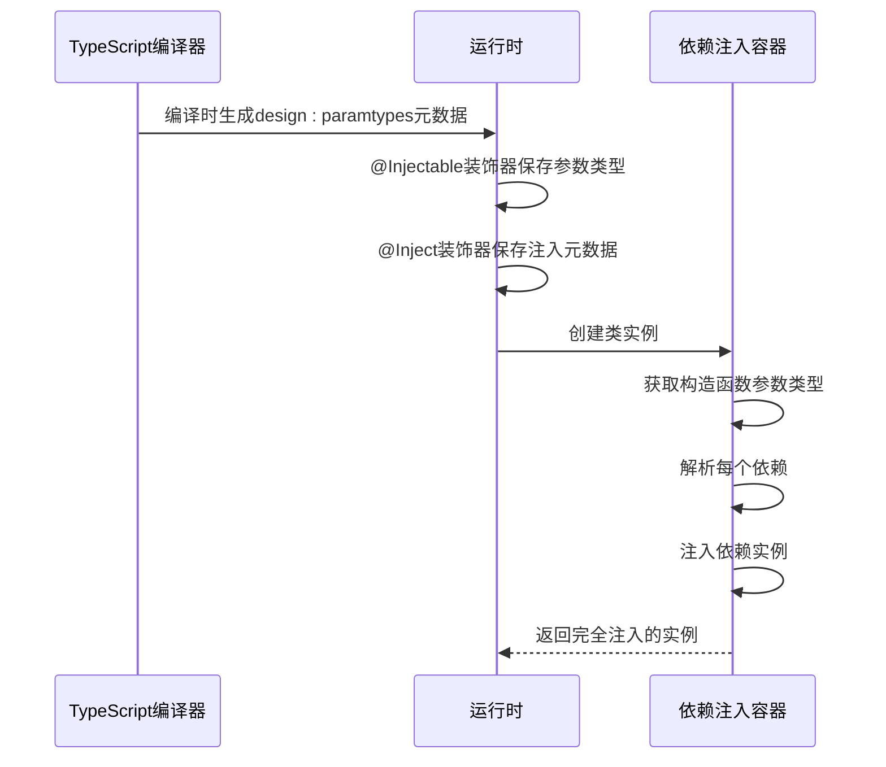
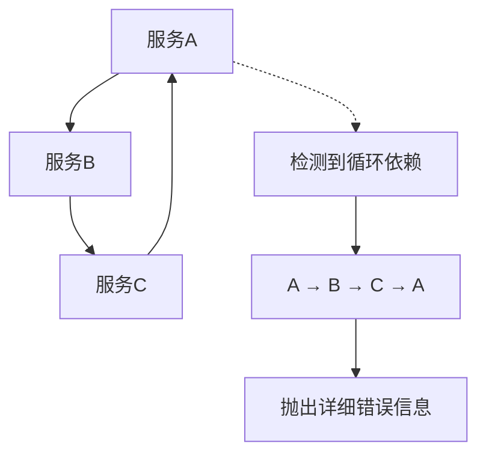
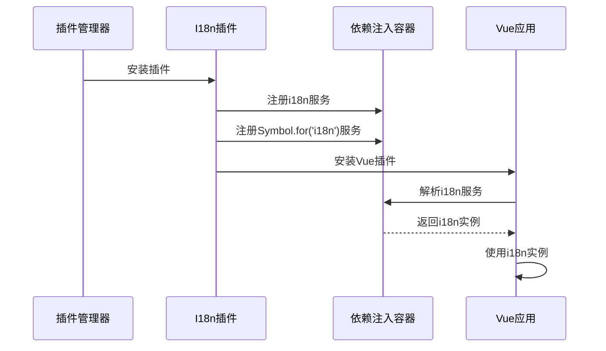

# 依赖注入

<cite>
**本文档引用的文件**   
- [service-container.ts](file://packages\core\src\container\service-container.ts)
- [decorators.ts](file://packages\core\src\container\decorators.ts)
- [types.ts](file://packages\core\src\container\types.ts)
- [i18n-plugin.ts](file://packages\vue3\src\plugins\i18n-plugin.ts)
- [vue-engine.ts](file://packages\vue3\src\engine\vue-engine.ts)
- [core-engine.ts](file://packages\core\src\engine\core-engine.ts)
</cite>

## 目录
1. [简介](#简介)
2. [容器核心结构](#容器核心结构)
3. [服务注册与解析](#服务注册与解析)
4. [作用域管理](#作用域管理)
5. [装饰器使用](#装饰器使用)
6. [循环依赖处理](#循环依赖处理)
7. [插件中的依赖注入](#插件中的依赖注入)
8. [最佳实践](#最佳实践)

## 简介
依赖注入容器是LDesign引擎的核心组件之一，它提供了一套完整的依赖管理和服务定位机制。容器通过统一的API管理服务的生命周期、解析依赖关系，并支持多种注册和解析方式。该容器设计遵循控制反转原则，使得组件之间能够实现松耦合，提高了代码的可测试性和可维护性。

**本节内容未分析具体源文件**

## 容器核心结构
依赖注入容器的核心实现位于`ServiceContainerImpl`类中，其内部维护了多个关键数据结构来管理服务的注册和解析。容器采用分层设计，支持父子容器的继承关系，从而实现了灵活的作用域管理。

**图示来源**
- [service-container.ts](file://packages\core\src\container\service-container.ts#L47-L530)
- [types.ts](file://packages\core\src\container\types.ts#L95-L179)

**本节来源**
- [service-container.ts](file://packages\core\src\container\service-container.ts#L47-L530)
- [types.ts](file://packages\core\src\container\types.ts#L95-L179)

## 服务注册与解析
容器提供了多种服务注册方式，包括单例、瞬态和作用域服务的注册。服务注册时，容器会创建一个`ServiceDescriptor`对象来存储服务的元信息，包括服务标识、实现方式和生命周期等。服务解析时，容器会根据生命周期策略返回相应的实例。

**图示来源**
- [service-container.ts](file://packages\core\src\container\service-container.ts#L143-L346)
- [types.ts](file://packages\core\src\container\types.ts#L63-L74)

**本节来源**
- [service-container.ts](file://packages\core\src\container\service-container.ts#L82-L346)
- [types.ts](file://packages\core\src\container\types.ts#L63-L74)

## 作用域管理
容器支持创建子容器来实现作用域隔离。每个子容器继承父容器的服务注册信息，但拥有独立的实例缓存。这种设计使得在特定上下文中可以覆盖或扩展服务行为，同时保持全局服务的一致性。

**图示来源**
- [service-container.ts](file://packages\core\src\container\service-container.ts#L58-L65)
- [service-container.ts](file://packages\core\src\container\service-container.ts#L259-L261)

**本节来源**
- [service-container.ts](file://packages\core\src\container\service-container.ts#L58-L65)
- [service-container.ts](file://packages\core\src\container\service-container.ts#L259-L261)

## 装饰器使用
容器提供了`@Injectable`、`@Inject`和`@Optional`等装饰器来简化依赖注入的使用。这些装饰器利用TypeScript的元数据反射机制，在运行时收集类的依赖信息，从而实现自动化的依赖解析。

**图示来源**
- [decorators.ts](file://packages\core\src\container\decorators.ts#L26-L156)
- [types.ts](file://packages\core\src\container\types.ts#L184-L205)

**本节来源**
- [decorators.ts](file://packages\core\src\container\decorators.ts#L26-L156)
- [types.ts](file://packages\core\src\container\types.ts#L184-L205)

## 循环依赖处理
容器通过维护一个解析栈来检测和处理循环依赖。当检测到循环依赖时，容器会生成详细的错误信息，包括完整的依赖路径，帮助开发者快速定位问题。

**图示来源**
- [service-container.ts](file://packages\core\src\container\service-container.ts#L60-L65)
- [service-container.ts](file://packages\core\src\container\service-container.ts#L147-L153)
- [service-container.ts](file://packages\core\src\container\service-container.ts#L513-L527)

**本节来源**
- [service-container.ts](file://packages\core\src\container\service-container.ts#L60-L65)
- [service-container.ts](file://packages\core\src\container\service-container.ts#L147-L153)
- [service-container.ts](file://packages\core\src\container\service-container.ts#L513-L527)

## 插件中的依赖注入
在插件系统中，依赖注入容器被广泛用于服务的注册和解析。插件可以通过容器注册自身提供的服务，也可以解析其他插件提供的服务，从而实现插件间的松耦合通信。

**图示来源**
- [i18n-plugin.ts](file://packages\vue3\src\plugins\i18n-plugin.ts#L91-L95)
- [vue-engine.ts](file://packages\vue3\src\engine\vue-engine.ts#L278-L280)

**本节来源**
- [i18n-plugin.ts](file://packages\vue3\src\plugins\i18n-plugin.ts#L91-L95)
- [vue-engine.ts](file://packages\vue3\src\engine\vue-engine.ts#L278-L280)

## 最佳实践
在使用依赖注入容器时，应遵循以下最佳实践以确保系统的可维护性和性能：

1. **服务命名规范**：使用有意义的字符串或Symbol作为服务标识，避免使用简单的数字或随机字符串。
2. **懒加载优化**：对于重量级服务，考虑使用工厂函数实现懒加载，避免在容器初始化时创建不必要的实例。
3. **测试中的模拟注入**：在单元测试中，可以通过注册模拟服务来替换真实服务，从而实现隔离测试。
4. **作用域合理使用**：避免过度使用作用域容器，只有在需要隔离服务实例时才创建新的作用域。
5. **循环依赖预防**：通过合理的架构设计避免循环依赖，必要时使用延迟解析或事件驱动的方式解耦。

**本节来源**
- [service-container.ts](file://packages\core\src\container\service-container.ts)
- [decorators.ts](file://packages\core\src\container\decorators.ts)
- [i18n-plugin.ts](file://packages\vue3\src\plugins\i18n-plugin.ts)