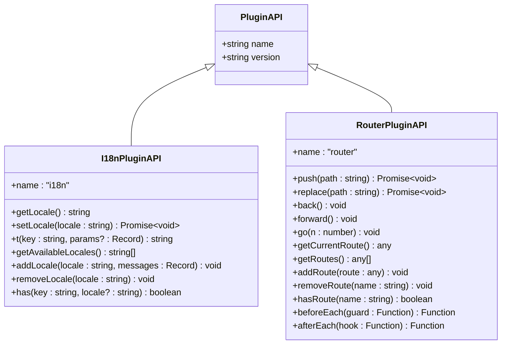
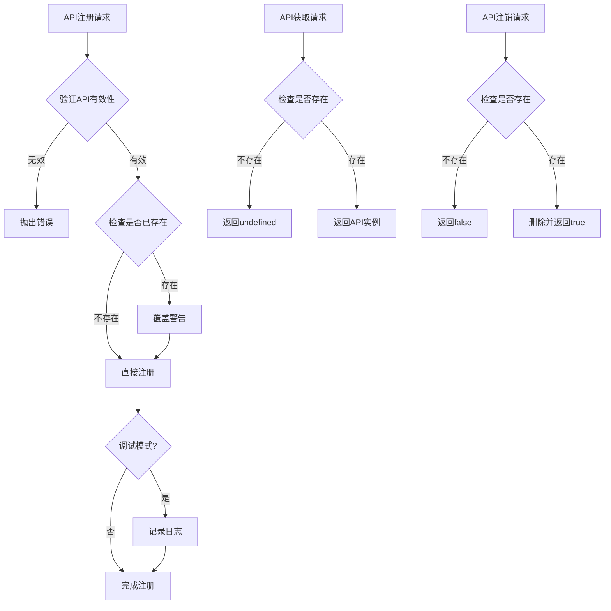
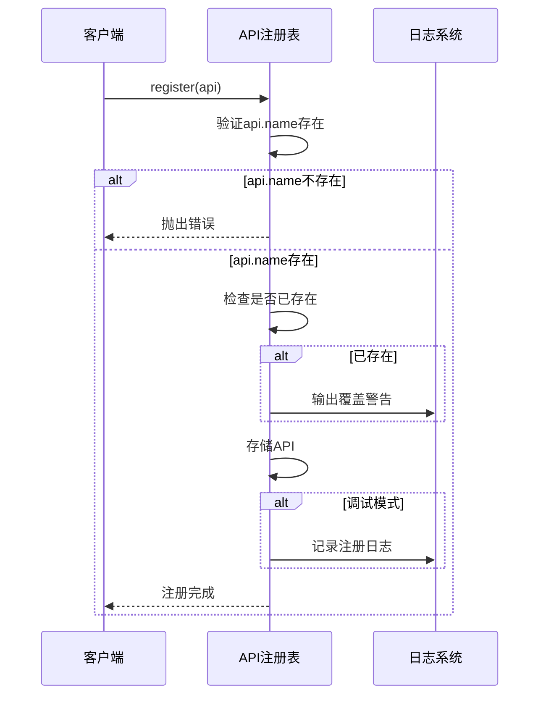
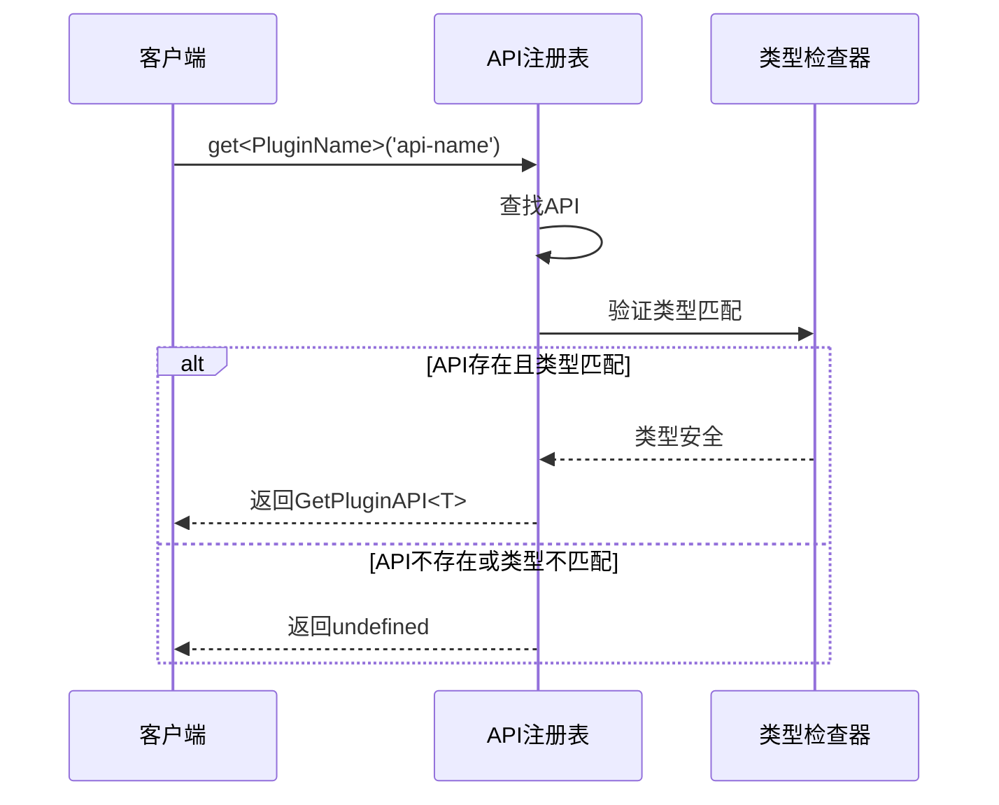
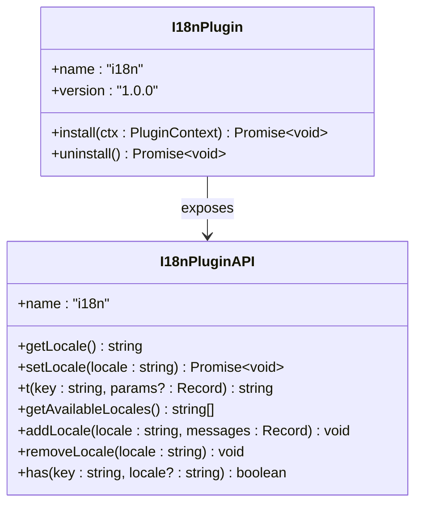
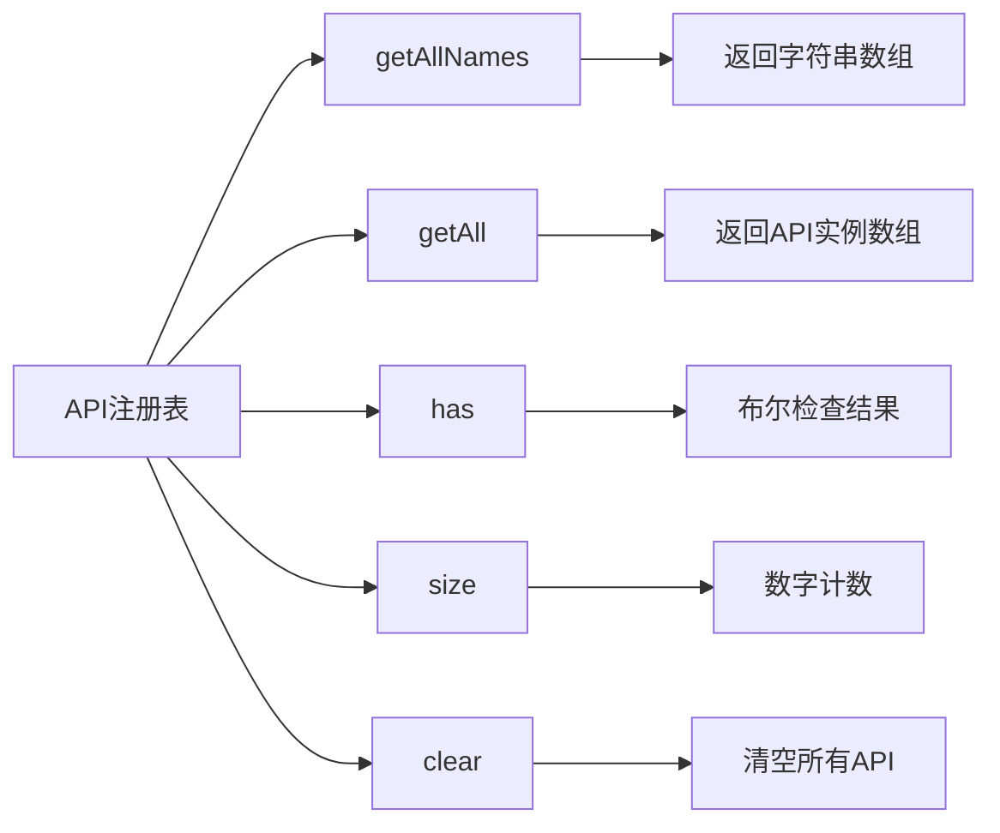

# 插件API注册与通信

<cite>
**本文档引用的文件**
- [plugin-api-registry.ts](file://packages/core/src/plugin/plugin-api-registry.ts)
- [plugin-api.ts](file://packages/core/src/types/plugin-api.ts)
- [core-engine.ts](file://packages/core/src/engine/core-engine.ts)
- [i18n-plugin.ts](file://packages/vue3/src/plugins/i18n-plugin.ts)
- [i18n-integration.ts](file://packages/vue3/examples/i18n-integration.ts)
- [core-engine.test.ts](file://packages/core/src/__tests__/core-engine.test.ts)
</cite>

## 目录
1. [简介](#简介)
2. [核心架构概述](#核心架构概述)
3. [PluginAPI接口设计](#pluginapi接口设计)
4. [插件API注册表实现](#插件api注册表实现)
5. [创建注册表实例](#创建注册表实例)
6. [插件API注册与获取](#插件api注册与获取)
7. [实际应用示例](#实际应用示例)
8. [高级功能与方法](#高级功能与方法)
9. [调试与开发支持](#调试与开发支持)
10. [最佳实践](#最佳实践)
11. [总结](#总结)

## 简介

插件API注册表（CorePluginAPIRegistry）是LDesign Engine中实现插件间类型安全通信的核心机制。它提供了一个统一的API注册、查询和调用平台，确保插件之间的交互既安全又高效。通过严格的类型约束和完善的生命周期管理，该系统为复杂的插件生态系统提供了坚实的基础。

## 核心架构概述

插件API注册表采用单例模式和工厂模式相结合的设计，通过`CorePluginAPIRegistry`类实现具体功能，并提供`createPluginAPIRegistry`工厂函数来创建实例。

```mermaid
classDiagram
class PluginAPIRegistry {
<<interface>>
+register(api : PluginAPI) void
+unregister(name : string) boolean
+get(name : string) PluginAPI | undefined
+has(name : string) boolean
+getAllNames() string[]
+getAll() PluginAPI[]
+clear() void
+size() number
}
class CorePluginAPIRegistry {
-apis : Map~string, PluginAPI~
-debug : boolean
+constructor(options : {debug? : boolean})
+register~T~(api : T) void
+unregister(name : string) boolean
+get~T~(name : T) GetPluginAPI~T~ | undefined
+has(name : string) boolean
+getAllNames() string[]
+getAll() PluginAPI[]
+clear() void
+size() number
}
class PluginAPI {
<<interface>>
+name : string
+version : string
}
class I18nPluginAPI {
+name : "i18n"
+getLocale() string
+setLocale(locale : string) Promise~void~
+t(key : string, params? : Record) string
+getAvailableLocales() string[]
+addLocale(locale : string, messages : Record) void
+removeLocale(locale : string) void
+has(key : string, locale? : string) boolean
}
PluginAPIRegistry <|-- CorePluginAPIRegistry
PluginAPI <|-- I18nPluginAPI
CorePluginAPIRegistry --> PluginAPI : manages
```

**图表来源**
- [plugin-api-registry.ts](file://packages/core/src/plugin/plugin-api-registry.ts#L14-L58)
- [plugin-api.ts](file://packages/core/src/types/plugin-api.ts#L12-L275)

**章节来源**
- [plugin-api-registry.ts](file://packages/core/src/plugin/plugin-api-registry.ts#L1-L191)
- [plugin-api.ts](file://packages/core/src/types/plugin-api.ts#L1-L275)

## PluginAPI接口设计

### 基础接口结构

PluginAPI接口定义了所有插件API必须遵循的基本规范：



**图表来源**
- [plugin-api.ts](file://packages/core/src/types/plugin-api.ts#L12-L275)

### 接口规范详解

每个PluginAPI实现都必须满足以下要求：

1. **name属性**：唯一标识插件的名称，通常与插件名称相同
2. **version属性**：API版本号，用于兼容性检查
3. **自定义方法**：根据插件功能提供特定的方法接口

**章节来源**
- [plugin-api.ts](file://packages/core/src/types/plugin-api.ts#L12-L275)

## 插件API注册表实现

### 核心功能方法

CorePluginAPIRegistry类提供了完整的API管理功能：



**图表来源**
- [plugin-api-registry.ts](file://packages/core/src/plugin/plugin-api-registry.ts#L81-L110)

### 方法详细说明

| 方法名 | 参数 | 返回值 | 功能描述 |
|--------|------|--------|----------|
| `register` | `api: PluginAPI` | `void` | 注册插件API，支持类型安全 |
| `unregister` | `name: string` | `boolean` | 注销指定名称的API |
| `get` | `name: PluginAPIName` | `GetPluginAPI<T> \| undefined` | 获取指定API，带类型提示 |
| `has` | `name: string` | `boolean` | 检查API是否已注册 |
| `getAllNames` | 无 | `string[]` | 获取所有已注册API名称 |
| `getAll` | 无 | `PluginAPI[]` | 获取所有已注册API实例 |
| `clear` | 无 | `void` | 清空所有API注册 |
| `size` | 无 | `number` | 获取注册表大小 |

**章节来源**
- [plugin-api-registry.ts](file://packages/core/src/plugin/plugin-api-registry.ts#L14-L58)

## 创建注册表实例

### 工厂函数使用

通过`createPluginAPIRegistry`工厂函数创建注册表实例：

```typescript
// 基础创建
const apiRegistry = createPluginAPIRegistry()

// 调试模式创建
const debugRegistry = createPluginAPIRegistry({ debug: true })
```

### 配置选项

| 选项 | 类型 | 默认值 | 描述 |
|------|------|--------|------|
| `debug` | `boolean` | `false` | 启用调试模式，输出详细日志 |

**章节来源**
- [plugin-api-registry.ts](file://packages/core/src/plugin/plugin-api-registry.ts#L187-L191)

## 插件API注册与获取

### 注册过程

API注册遵循严格的验证流程：



**图表来源**
- [plugin-api-registry.ts](file://packages/core/src/plugin/plugin-api-registry.ts#L81-L96)

### 获取过程

API获取提供完整的类型安全保障：



**图表来源**
- [plugin-api-registry.ts](file://packages/core/src/plugin/plugin-api-registry.ts#L115-L117)

**章节来源**
- [plugin-api-registry.ts](file://packages/core/src/plugin/plugin-api-registry.ts#L81-L117)

## 实际应用示例

### i18n插件API暴露

以i18n插件为例，展示如何暴露翻译相关方法：



**图表来源**
- [plugin-api.ts](file://packages/core/src/types/plugin-api.ts#L22-L67)
- [i18n-plugin.ts](file://packages/vue3/src/plugins/i18n-plugin.ts#L38-L164)

### 插件间通信示例

```typescript
// 注册i18n API
apiRegistry.register({
  name: 'i18n',
  version: '1.0.0',
  getLocale() { return 'zh-CN' },
  setLocale(locale) { /* 实现 */ },
  t(key, params) { /* 实现 */ },
  // ...其他方法
})

// 获取并使用i18n API
const i18nAPI = apiRegistry.get('i18n')
if (i18nAPI) {
  const locale = i18nAPI.getLocale() // 完整的类型提示
  const translatedText = i18nAPI.t('welcome.message')
}
```

**章节来源**
- [plugin-api.ts](file://packages/core/src/types/plugin-api.ts#L22-L67)
- [i18n-plugin.ts](file://packages/vue3/src/plugins/i18n-plugin.ts#L38-L164)
- [i18n-integration.ts](file://packages/vue3/examples/i18n-integration.ts#L1-L172)

## 高级功能与方法

### 状态管理功能

插件API注册表提供了丰富的状态管理方法：



**图表来源**
- [plugin-api-registry.ts](file://packages/core/src/plugin/plugin-api-registry.ts#L128-L149)

### 方法功能对比

| 方法 | 返回类型 | 使用场景 | 性能特点 |
|------|----------|----------|----------|
| `getAllNames()` | `string[]` | 获取所有插件名称列表 | O(n)时间复杂度 |
| `getAll()` | `PluginAPI[]` | 获取所有API实例 | O(n)时间复杂度 |
| `has(name)` | `boolean` | 快速检查存在性 | O(1)时间复杂度 |
| `size()` | `number` | 获取数量统计 | O(1)时间复杂度 |
| `clear()` | `void` | 批量清理 | O(n)时间复杂度 |

**章节来源**
- [plugin-api-registry.ts](file://packages/core/src/plugin/plugin-api-registry.ts#L128-L149)

## 调试与开发支持

### 调试模式功能

启用调试模式后，注册表会输出详细的日志信息：

```mermaid
flowchart TD
A[调试模式启用] --> B[注册API时]
B --> C[输出注册日志]
C --> D["[PluginAPIRegistry] API \"name\" v\"version\" registered"]
E[API已存在] --> F[输出警告日志]
F --> G["[PluginAPIRegistry] API \"name\" is already registered, overwriting..."]
H[注销API时] --> I[输出注销日志]
I --> J["[PluginAPIRegistry] API \"name\" unregistered"]
K[清空所有API] --> L[输出清理日志]
L --> M["[PluginAPIRegistry] All APIs cleared"]
```

**图表来源**
- [plugin-api-registry.ts](file://packages/core/src/plugin/plugin-api-registry.ts#L87-L96)
- [plugin-api-registry.ts](file://packages/core/src/plugin/plugin-api-registry.ts#L105-L107)
- [plugin-api-registry.ts](file://packages/core/src/plugin/plugin-api-registry.ts#L146-L148)

### 开发调试最佳实践

1. **开发环境启用调试**：在开发阶段始终启用调试模式
2. **日志分析**：定期检查日志输出，识别潜在问题
3. **API冲突检测**：利用覆盖警告及时发现API命名冲突
4. **生命周期跟踪**：通过日志跟踪API的完整生命周期

**章节来源**
- [plugin-api-registry.ts](file://packages/core/src/plugin/plugin-api-registry.ts#L67-L76)
- [plugin-api-registry.ts](file://packages/core/src/plugin/plugin-api-registry.ts#L87-L96)

## 最佳实践

### API设计原则

1. **命名规范**：使用清晰、一致的API名称
2. **版本控制**：严格遵循语义化版本控制
3. **向后兼容**：新版本应保持基本接口兼容
4. **类型安全**：充分利用TypeScript类型系统

### 使用建议

1. **延迟注册**：在插件安装时注册API
2. **错误处理**：妥善处理API获取失败的情况
3. **资源清理**：插件卸载时及时注销API
4. **文档维护**：保持API文档与实现同步

### 性能优化

1. **避免频繁查询**：缓存API引用
2. **批量操作**：使用`getAll`进行批量处理
3. **及时清理**：插件卸载时清理相关API

## 总结

插件API注册表是LDesign Engine中实现插件间类型安全通信的核心基础设施。通过严格的接口设计、完善的生命周期管理和强大的调试支持，它为构建可扩展、可维护的插件系统提供了坚实保障。

关键特性包括：
- **类型安全**：完整的TypeScript类型支持
- **生命周期管理**：完整的注册、获取、注销流程
- **调试友好**：详细的日志输出和错误提示
- **高性能**：基于Map的数据结构，O(1)查找效率
- **扩展性强**：支持多种插件API类型

通过合理使用插件API注册表，开发者可以构建出既安全又高效的插件生态系统，为应用程序提供灵活的功能扩展能力。