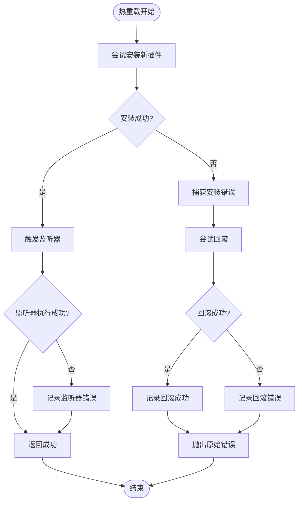

# 插件热重载机制

<cite>
**本文档中引用的文件**
- [plugin.ts](file://packages/engine/packages/core/src/types/plugin.ts)
- [plugin-manager.ts](file://packages/engine/packages/core/src/plugin/plugin-manager.ts)
- [define-plugin.ts](file://packages/engine/packages/core/src/plugin/define-plugin.ts)
- [i18n-plugin.ts](file://packages/engine/packages/vue3/src/plugins/i18n-plugin.ts)
- [router-plugin.ts](file://packages/engine/packages/vue3/src/plugins/router-plugin.ts)
- [app.config.development.ts](file://packages/engine/packages/vue3/example/.ldesign/app.config.development.ts)
- [launcher.config.development.ts](file://packages/engine/packages/vue3/example/.ldesign/launcher.config.development.ts)
- [core-engine.test.ts](file://packages/engine/packages/core/src/__tests__/core-engine.test.ts)
</cite>

## 目录
1. [概述](#概述)
2. [热重载核心概念](#热重载核心概念)
3. [插件热重载架构](#插件热重载架构)
4. [热重载执行流程](#热重载执行流程)
5. [isHotReloadable判断条件](#ishotreloadable判断条件)
6. [onHotReload监听器机制](#onhotreload-listener机制)
7. [错误处理与回滚策略](#错误处理与回滚策略)
8. [开发环境配置](#开发环境配置)
9. [最佳实践](#最佳实践)
10. [故障排除](#故障排除)

## 概述

插件热重载（Hot Reload）是LDesign Engine的核心功能之一，它允许开发者在运行时动态更新插件而无需重启整个应用程序。这一机制极大地提升了开发效率，特别是在插件开发和调试过程中。

热重载机制基于以下核心原则：
- **无停机更新**：插件可以在不停止应用的情况下进行更新
- **状态保持**：支持插件状态的持久化和恢复
- **错误隔离**：失败时能够回滚到之前的稳定状态
- **监听器支持**：提供钩子机制让插件能够响应重载事件

## 热重载核心概念

### 核心接口定义

热重载功能通过三个核心接口方法实现：


**图表来源**
- [plugin.ts](file://packages/engine/packages/core/src/types/plugin.ts#L71-L76)
- [plugin-manager.ts](file://packages/engine/packages/core/src/plugin/plugin-manager.ts#L388-L447)

### 支持热重载的插件特征

只有满足特定条件的插件才能支持热重载：

1. **必需实现uninstall方法**：插件必须提供清理资源的能力
2. **状态可恢复**：插件状态需要能够保存和恢复
3. **依赖管理**：需要正确处理插件间的依赖关系

**章节来源**
- [plugin-manager.ts](file://packages/engine/packages/core/src/plugin/plugin-manager.ts#L498-L506)

## 插件热重载架构

### 系统架构图


**图表来源**
- [plugin-manager.ts](file://packages/engine/packages/core/src/plugin/plugin-manager.ts#L469-L483)
- [plugin-manager.ts](file://packages/engine/packages/core/src/plugin/plugin-manager.ts#L55-L55)

### 数据结构设计

热重载系统使用以下关键数据结构：

| 组件 | 类型 | 用途 |
|------|------|------|
| `hotReloadListeners` | `Map<string, Set<Function>>` | 存储插件对应的热重载监听器 |
| `pluginOptions` | `Map<string, unknown>` | 保存插件配置选项用于回滚 |
| `plugins` | `Map<string, Plugin>` | 存储已安装的插件实例 |

**章节来源**
- [plugin-manager.ts](file://packages/engine/packages/core/src/plugin/plugin-manager.ts#L44-L56)

## 热重载执行流程

### 完整执行序列


**图表来源**
- [plugin-manager.ts](file://packages/engine/packages/core/src/plugin/plugin-manager.ts#L388-L447)

### 流程详解

#### 1. 插件存在性检查
系统首先验证目标插件是否已安装。如果不存在，则直接作为新插件安装。

#### 2. 状态保存
在卸载旧插件之前，系统会保存当前插件的配置选项，确保能够进行回滚操作。

#### 3. 旧插件卸载
调用插件的`uninstall`方法清理资源。这一步是热重载的关键，要求插件必须实现此方法。

#### 4. 新插件安装
使用保存的配置选项安装新的插件实例。

#### 5. 插件引用更新
更新内部插件映射表，使系统使用新的插件实例。

#### 6. 监听器触发
通知所有注册的热重载监听器，让它们有机会执行状态恢复逻辑。

**章节来源**
- [plugin-manager.ts](file://packages/engine/packages/core/src/plugin/plugin-manager.ts#L388-L447)

## isHotReloadable判断条件

### 实现原理

`isHotReloadable`方法是热重载功能的基础检查机制：


**图表来源**
- [plugin-manager.ts](file://packages/engine/packages/core/src/plugin/plugin-manager.ts#L498-L506)

### 关键约束

热重载功能的核心约束是插件必须实现`uninstall`方法：

- **必需方法**：`uninstall(context: PluginContext)`必须存在
- **清理责任**：插件负责清理所有分配的资源
- **幂等性**：`uninstall`方法应该是幂等的，可以多次调用

### 实际应用示例

以i18n插件为例，它实现了`uninstall`方法：

**章节来源**
- [i18n-plugin.ts](file://packages/engine/packages/vue3/src/plugins/i18n-plugin.ts#L159-L161)

## onHotReload监听器机制

### 监听器注册流程


**图表来源**
- [plugin-manager.ts](file://packages/engine/packages/core/src/plugin/plugin-manager.ts#L469-L483)

### 监听器特性

#### 1. 函数式设计
监听器采用函数式设计，支持同步和异步执行：

```typescript
// 同步监听器
onHotReload('plugin-name', () => {
  // 状态恢复逻辑
})

// 异步监听器
onHotReload('plugin-name', async () => {
  await restoreState()
})
```

#### 2. 自动清理机制
每次调用返回的取消函数，系统会自动清理监听器：

- **单个监听器移除**：当监听器集合为空时自动删除
- **内存泄漏防护**：防止监听器累积导致内存泄漏

#### 3. 错误隔离
监听器执行过程中的错误不会影响主流程：

- **错误捕获**：系统会捕获监听器中的异常
- **日志记录**：错误会被记录但不会中断热重载流程
- **继续执行**：即使某个监听器失败，其他监听器仍会执行

**章节来源**
- [plugin-manager.ts](file://packages/engine/packages/core/src/plugin/plugin-manager.ts#L469-L483)

## 错误处理与回滚策略

### 错误处理架构



**图表来源**
- [plugin-manager.ts](file://packages/engine/packages/core/src/plugin/plugin-manager.ts#L434-L447)

### 回滚策略详解

#### 1. 自动回滚机制
当热重载失败时，系统会自动尝试回滚到之前的插件版本：

- **立即回滚**：在安装失败后立即尝试回滚
- **状态恢复**：使用保存的插件选项重新安装旧插件
- **完整性检查**：确保回滚过程不会引入新的问题

#### 2. 错误分类处理

| 错误类型 | 处理策略 | 日志级别 |
|----------|----------|----------|
| 安装失败 | 尝试回滚 | ERROR |
| 回滚失败 | 记录严重错误 | ERROR |
| 监听器错误 | 记录警告 | WARN |
| 插件不存在 | 安装为新插件 | WARN |

#### 3. 日志记录策略

系统提供详细的日志记录帮助开发者诊断问题：

- **调试模式**：启用详细日志输出
- **错误追踪**：记录完整的错误堆栈
- **状态信息**：记录插件状态变化

**章节来源**
- [plugin-manager.ts](file://packages/engine/packages/core/src/plugin/plugin-manager.ts#L434-L447)

## 开发环境配置

### 启用热重载

在开发环境中，可以通过配置文件启用热重载功能：

```typescript
// app.config.development.ts
export default {
  dev: {
    enableHotReload: true,
    showConfigPanel: true,
    logLevel: 'debug'
  }
}
```

**章节来源**
- [app.config.development.ts](file://packages/engine/packages/vue3/example/.ldesign/app.config.development.ts#L34)

### 开发服务器配置

开发服务器的HMR（热模块替换）配置：

**章节来源**
- [launcher.config.development.ts](file://packages/engine/packages/vue3/example/.ldesign/launcher.config.development.ts#L28)

### 最佳实践配置

推荐的开发环境配置组合：

1. **调试模式**：启用详细日志记录
2. **热重载开关**：在开发阶段始终启用
3. **错误监控**：实时监控热重载状态
4. **状态持久化**：保存重要的开发状态

## 最佳实践

### 插件开发最佳实践

#### 1. 实现完整的uninstall方法
```typescript
async uninstall(context: PluginContext) {
  // 清理定时器
  if (this.timer) {
    clearInterval(this.timer)
  }
  
  // 清理事件监听器
  this.eventBus.removeAllListeners()
  
  // 清理DOM元素
  if (this.element) {
    this.element.remove()
  }
  
  // 清理服务注册
  if (context.container) {
    context.container.unregister('my-service')
  }
}
```

#### 2. 设计可恢复的状态
```typescript
interface MyPluginState {
  config: PluginConfig
  data: any
  subscriptions: Subscription[]
}

class MyPlugin implements Plugin<MyPluginState> {
  private state: MyPluginState
  
  async install(context: PluginContext, options: MyPluginState) {
    this.state = options
    // 初始化逻辑
  }
  
  async uninstall(context: PluginContext) {
    // 保存当前状态
    const currentState = this.getCurrentState()
    // 清理逻辑
    this.cleanup()
    return currentState
  }
}
```

#### 3. 实现热重载监听器
```typescript
// 在插件安装时注册监听器
async install(context: PluginContext, options: PluginOptions) {
  // 注册热重载监听器
  const unsubscribe = context.engine.plugins.onHotReload('my-plugin', async () => {
    // 恢复状态
    await this.restoreState()
    
    // 重新初始化
    await this.reinitialize()
  })
  
  // 保存取消函数以便清理
  this.cleanupHandlers.push(unsubscribe)
}
```

### 开发工作流最佳实践

#### 1. 分阶段开发
- **功能开发**：专注于新功能实现
- **热重载测试**：频繁测试热重载功能
- **状态恢复**：验证状态是否正确恢复

#### 2. 错误处理策略
- **渐进式更新**：逐步增加复杂度
- **快速反馈**：及时发现和修复问题
- **状态验证**：确保状态一致性

#### 3. 性能优化
- **增量更新**：只更新必要的部分
- **资源管理**：及时释放不再需要的资源
- **内存监控**：监控内存使用情况

## 故障排除

### 常见问题及解决方案

#### 1. 热重载失败

**症状**：插件无法热重载，控制台显示错误信息

**可能原因**：
- 插件未实现`uninstall`方法
- 插件依赖关系不正确
- 插件状态不一致

**解决方案**：
```typescript
// 检查插件是否支持热重载
if (engine.plugins.isHotReloadable('plugin-name')) {
  await engine.plugins.hotReload('plugin-name', newPlugin)
} else {
  console.warn('Plugin does not support hot reload')
}
```

#### 2. 监听器执行失败

**症状**：热重载成功，但某些功能异常

**可能原因**：
- 监听器中存在错误
- 状态恢复不完整

**解决方案**：
```typescript
// 添加错误边界
engine.plugins.onHotReload('plugin-name', async () => {
  try {
    await this.restoreState()
  } catch (error) {
    console.error('Failed to restore state:', error)
    // 尝试降级恢复
    await this.fallbackRestore()
  }
})
```

#### 3. 内存泄漏

**症状**：长时间运行后内存使用持续增长

**可能原因**：
- 监听器未正确清理
- 事件监听器未移除
- 定时器未清理

**解决方案**：
```typescript
// 确保正确清理资源
async uninstall(context: PluginContext) {
  // 清理所有监听器
  this.listeners.forEach(unsubscribe => unsubscribe())
  
  // 清理定时器
  this.timers.forEach(timer => clearTimeout(timer))
  
  // 清理事件监听器
  this.eventEmitter.removeAllListeners()
}
```

### 调试技巧

#### 1. 启用详细日志
```typescript
// 在开发环境中启用调试模式
const engine = createCoreEngine({
  name: 'Development Engine',
  debug: true
})
```

#### 2. 监控热重载状态
```typescript
// 监听热重载事件
engine.lifecycle.on('hotReload', (data) => {
  console.log('Hot reload triggered:', data)
})

// 监听错误事件
engine.lifecycle.on('hotReloadError', (error) => {
  console.error('Hot reload failed:', error)
})
```

#### 3. 状态验证工具
```typescript
// 验证插件状态
function validatePluginState(pluginName: string) {
  const plugin = engine.plugins.get(pluginName)
  const state = engine.state.getAll()
  
  console.log(`Plugin: ${pluginName}`)
  console.log('Installed plugins:', engine.plugins.getAll().map(p => p.name))
  console.log('Current state:', state)
}
```

通过遵循这些最佳实践和故障排除指南，开发者可以充分利用LDesign Engine的热重载功能，提高开发效率并确保系统的稳定性。