# 插件卸载

<cite>
**本文档中引用的文件**
- [plugin-manager.ts](file://packages/core/src/plugin/plugin-manager.ts)
- [plugin.ts](file://packages/core/src/types/plugin.ts)
- [router-plugin.ts](file://packages/vue3/src/plugins/router-plugin.ts)
- [i18n-plugin.ts](file://packages/vue3/src/plugins/i18n-plugin.ts)
- [core-engine.test.ts](file://packages/core/src/__tests__/core-engine.test.ts)
</cite>

## 目录
1. [概述](#概述)
2. [uninstall方法架构](#uninstall方法架构)
3. [依赖检查机制](#依赖检查机制)
4. [force参数详解](#force参数详解)
5. [getDependents方法分析](#getdependents方法分析)
6. [生命周期钩子调用](#生命周期钩子调用)
7. [异常处理机制](#异常处理机制)
8. [插件实例移除逻辑](#插件实例移除逻辑)
9. [实际应用场景](#实际应用场景)
10. [系统稳定性风险](#系统稳定性风险)
11. [最佳实践建议](#最佳实践建议)

## 概述

CorePluginManager类中的uninstall方法是插件管理系统的核心功能之一，负责安全地卸载已安装的插件。该方法不仅提供了基本的卸载功能，还包含了完善的依赖检查机制、强制卸载选项以及完整的生命周期管理。

### 核心特性

- **依赖安全检查**：防止因卸载插件而导致其他插件无法正常工作
- **强制卸载模式**：允许在特殊情况下绕过依赖检查
- **生命周期管理**：确保插件卸载过程中的资源清理
- **异常处理**：提供完整的错误处理和回滚机制
- **调试支持**：详细的日志输出便于问题诊断

## uninstall方法架构

uninstall方法采用三阶段卸载流程，确保操作的安全性和完整性：


**图表来源**
- [plugin-manager.ts](file://packages/core/src/plugin/plugin-manager.ts#L167-L207)

**章节来源**
- [plugin-manager.ts](file://packages/core/src/plugin/plugin-manager.ts#L167-L207)

## 依赖检查机制

依赖检查是uninstall方法的核心安全特性，通过getDependents方法实现对插件依赖关系的全面扫描。

### 检查流程

1. **插件存在性验证**：确认目标插件确实存在于插件管理器中
2. **强制模式判断**：根据force参数决定是否跳过依赖检查
3. **依赖关系扫描**：遍历所有已安装插件，查找依赖目标插件的插件
4. **依赖关系报告**：如果发现依赖关系且非强制模式，则抛出错误

### 依赖检查算法

```mermaid
sequenceDiagram
participant Client as "客户端代码"
participant Manager as "CorePluginManager"
participant Helper as "getDependents"
participant Plugins as "插件存储"
Client->>Manager : uninstall(name, force=false)
Manager->>Plugins : get(name)
Plugins-->>Manager : plugin 或 undefined
alt 插件不存在
Manager->>Manager : 记录警告日志
Manager-->>Client : 返回 false
else 插件存在且非强制模式
Manager->>Helper : getDependents(name)
Helper->>Plugins : 遍历所有插件
Plugins-->>Helper : 插件列表
Helper->>Helper : 检查依赖关系
Helper-->>Manager : 依赖插件列表
alt 存在依赖
Manager->>Manager : 抛出依赖错误
else 无依赖
Manager->>Manager : 继续卸载流程
end
end
```



**图表来源**
- [plugin-manager.ts](file://packages/core/src/plugin/plugin-manager.ts#L167-L207)
- [plugin-manager.ts](file://packages/core/src/plugin/plugin-manager.ts#L324-L334)

**章节来源**
- [plugin-manager.ts](file://packages/core/src/plugin/plugin-manager.ts#L167-L207)
- [plugin-manager.ts](file://packages/core/src/plugin/plugin-manager.ts#L324-L334)

## force参数详解

force参数是uninstall方法的关键控制选项，提供了灵活的卸载策略选择。

### 参数作用机制

| force值 | 行为描述 | 使用场景 |
|---------|----------|----------|
| false（默认） | 执行完整依赖检查，防止破坏性卸载 | 日常开发和生产环境 |
| true | 跳过依赖检查，直接卸载插件 | 开发调试、紧急情况、批量卸载 |

### 强制模式的风险评估


**章节来源**
- [plugin-manager.ts](file://packages/core/src/plugin/plugin-manager.ts#L167-L207)

## getDependents方法分析

getDependents方法是依赖检查机制的核心实现，负责扫描所有插件以发现依赖关系。

### 方法实现细节

该方法采用线性扫描算法，在O(n)时间复杂度内完成依赖关系检测：


**图表来源**
- [plugin-manager.ts](file://packages/core/src/plugin/plugin-manager.ts#L324-L334)
- [plugin.ts](file://packages/core/src/types/plugin.ts#L40-L51)

### 依赖关系识别算法

getDependents方法通过以下步骤识别依赖关系：

1. **初始化结果集**：创建空的依赖插件列表
2. **遍历插件存储**：迭代所有已安装的插件
3. **检查依赖属性**：验证插件的dependencies数组
4. **匹配依赖关系**：检查目标插件名是否在依赖列表中
5. **收集结果**：将符合条件的插件名称加入结果集

**章节来源**
- [plugin-manager.ts](file://packages/core/src/plugin/plugin-manager.ts#L324-L334)

## 生命周期钩子调用

插件卸载过程中的生命周期钩子确保了资源的正确清理和系统的稳定性。

### 卸载钩子调用时机


**图表来源**
- [plugin-manager.ts](file://packages/core/src/plugin/plugin-manager.ts#L190-L207)

### 卸载钩子的设计原则

1. **可选性**：uninstall方法是可选的，不是所有插件都需要实现
2. **幂等性**：多次调用卸载方法应该是安全的
3. **资源清理**：确保所有分配的资源都被正确释放
4. **异常隔离**：卸载过程中的异常不应影响其他插件

**章节来源**
- [plugin-manager.ts](file://packages/core/src/plugin/plugin-manager.ts#L190-L207)
- [plugin.ts](file://packages/core/src/types/plugin.ts#L49-L49)

## 异常处理机制

uninstall方法实现了完善的异常处理机制，确保系统在卸载失败时能够保持稳定。

### 异常处理策略


**图表来源**
- [plugin-manager.ts](file://packages/core/src/plugin/plugin-manager.ts#L190-L207)

### 异常类型与处理

| 异常类型 | 处理方式 | 影响范围 |
|----------|----------|----------|
| 依赖检查失败 | 抛出Error，阻止卸载 | 当前操作 |
| 插件卸载失败 | 记录错误，重新抛出异常 | 当前操作 |
| 插件不存在 | 返回false，记录警告 | 当前操作 |
| 系统级异常 | 记录错误，重新抛出异常 | 当前操作 |

**章节来源**
- [plugin-manager.ts](file://packages/core/src/plugin/plugin-manager.ts#L190-L207)

## 插件实例移除逻辑

插件实例的移除是卸载过程的最后一步，确保插件完全从系统中移除。

### 移除操作流程


**图表来源**
- [plugin-manager.ts](file://packages/core/src/plugin/plugin-manager.ts#L196-L198)

### 移除后的状态验证

移除操作完成后，系统会验证以下状态：

1. **插件不可访问**：通过plugins.get()方法确认插件已被移除
2. **内存释放**：确保插件实例被垃圾回收
3. **依赖更新**：相关插件的依赖列表得到更新
4. **状态同步**：插件管理器状态与实际插件集合同步

**章节来源**
- [plugin-manager.ts](file://packages/core/src/plugin/plugin-manager.ts#L196-L198)

## 实际应用场景

通过具体的插件示例，我们可以更好地理解uninstall方法在实际开发中的应用。

### 正常卸载场景

```typescript
// 示例：正常卸载i18n插件
await pluginManager.uninstall('i18n')

// 输出日志：
// Plugin "i18n" uninstalled successfully
```

### 强制卸载场景

```typescript
// 示例：强制卸载router插件（即使有依赖）
await pluginManager.uninstall('router', true)

// 输出日志：
// Plugin "router" uninstalled successfully
```

### 依赖检查失败场景

```typescript
// 示例：尝试卸载被依赖的插件
await pluginManager.uninstall('i18n')
// 抛出错误：
// Cannot uninstall plugin "i18n": It is required by: router. Use force=true to uninstall anyway.
```

**章节来源**
- [i18n-plugin.ts](file://packages/vue3/src/plugins/i18n-plugin.ts#L159-L162)
- [router-plugin.ts](file://packages/vue3/src/plugins/router-plugin.ts#L60-L129)

## 系统稳定性风险

强制卸载虽然提供了灵活性，但也带来了潜在的系统稳定性风险。

### 风险类型分析

```mermaid
mindmap
root((强制卸载风险))
功能异常
1. 插件间依赖断裂
2. 功能模块失效
3. 用户体验受损
数据安全
1. 状态数据丢失
2. 配置信息损坏
3. 用户数据泄露
系统稳定性
1. 内存泄漏
2. 资源竞争
3. 异常传播
开发维护
1. 调试困难
2. 问题定位复杂
3. 回滚成本高
```

### 风险缓解措施

| 风险类型 | 缓解措施 | 实现方式 |
|----------|----------|----------|
| 功能异常 | 依赖检查 | getDependents方法 |
| 数据安全 | 备份机制 | 热重载监听器 |
| 系统稳定性 | 异常隔离 | try-catch包装 |
| 开发维护 | 日志记录 | 调试模式支持 |

## 最佳实践建议

基于对uninstall方法的深入分析，以下是开发者在管理插件生命周期时的最佳实践建议。

### 卸载策略选择


### 开发阶段建议

1. **插件设计原则**
   - 实现完整的uninstall方法
   - 确保资源清理的幂等性
   - 提供清晰的错误信息

2. **依赖管理**
   - 明确声明插件依赖关系
   - 避免循环依赖
   - 使用semver版本约束

3. **测试策略**
   - 测试正常卸载流程
   - 验证强制卸载场景
   - 模拟卸载失败情况

### 生产环境建议

1. **监控与告警**
   - 监控插件卸载成功率
   - 设置依赖检查告警
   - 记录卸载操作日志

2. **回滚机制**
   - 实现热重载支持
   - 准备紧急回滚方案
   - 维护插件版本历史

3. **文档维护**
   - 记录插件依赖关系
   - 更新卸载指南
   - 维护故障排除手册

### 性能优化建议


通过遵循这些最佳实践，开发者可以安全、高效地管理插件生命周期，确保系统的稳定性和可维护性。