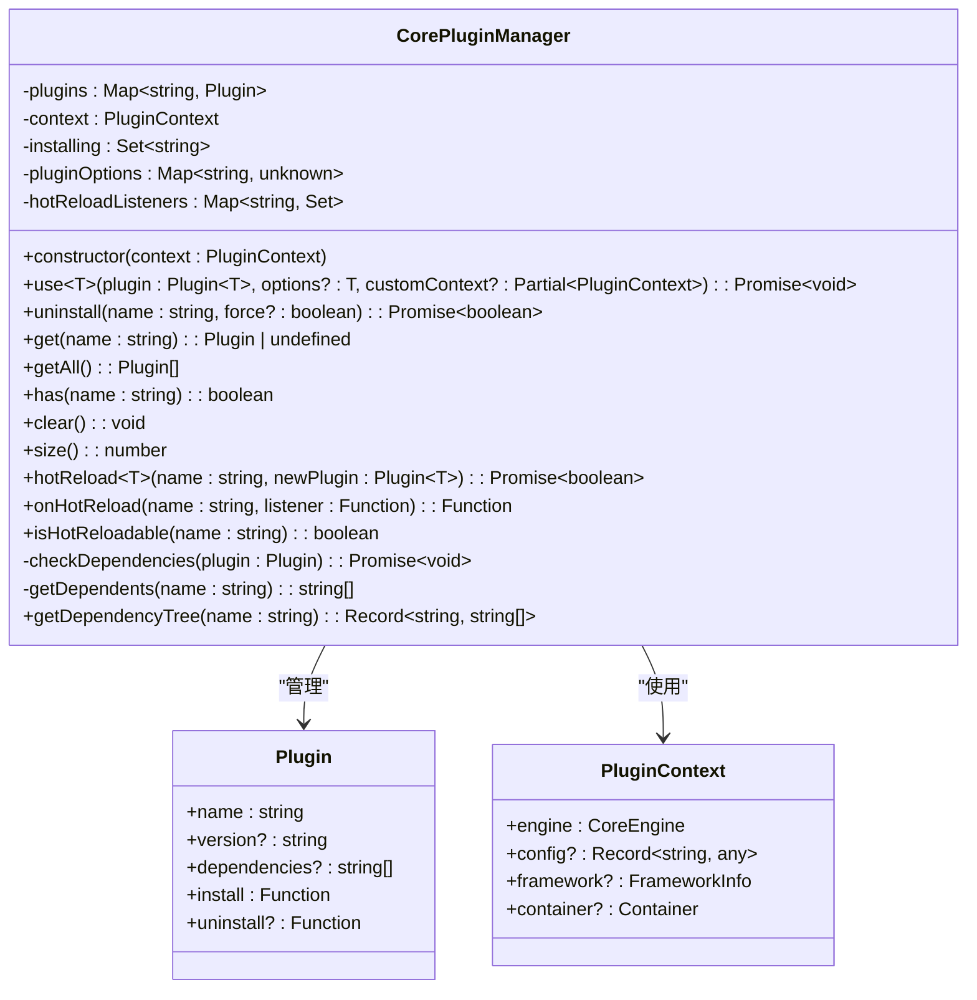
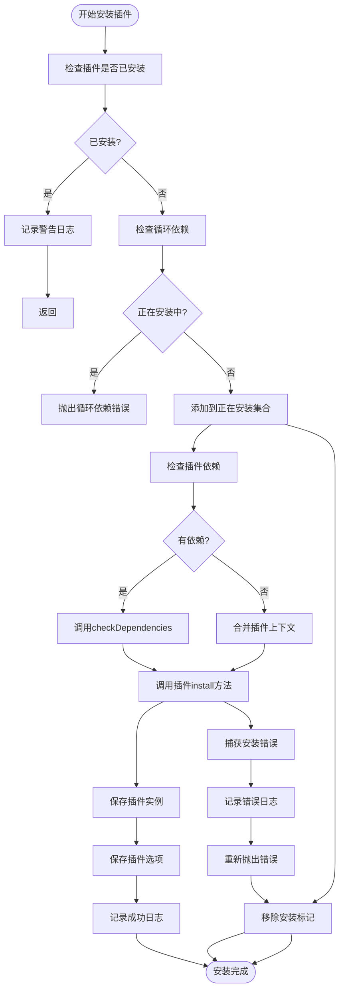
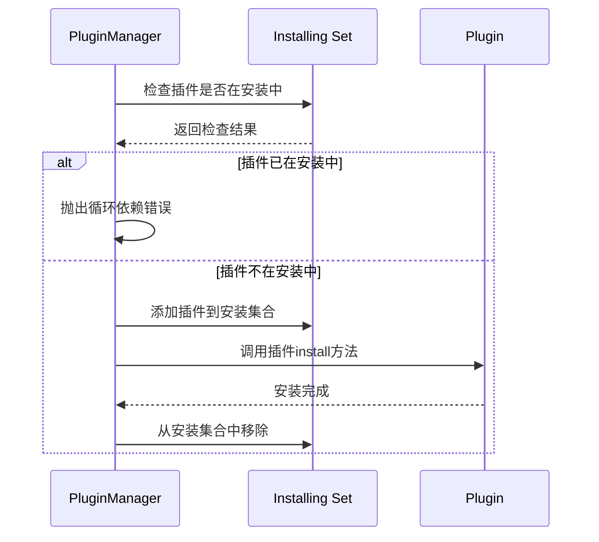
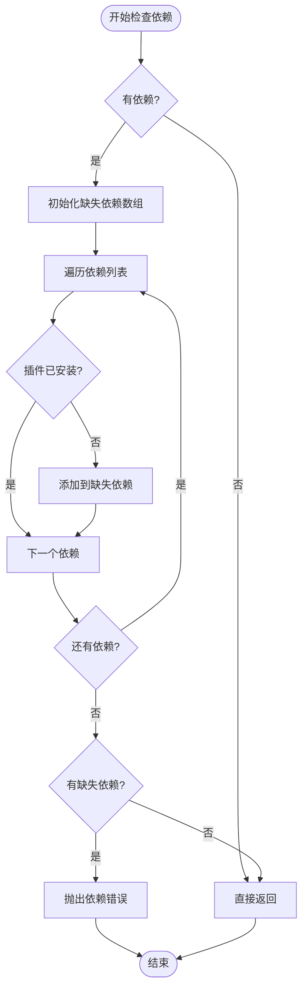
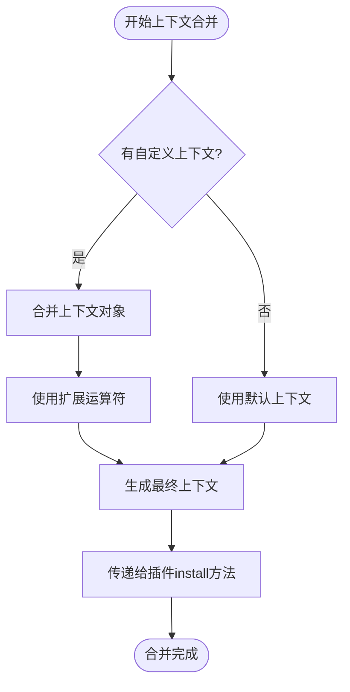
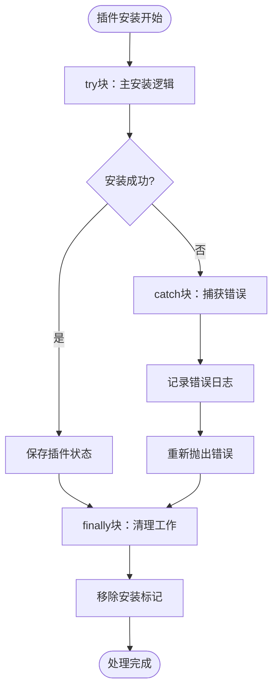
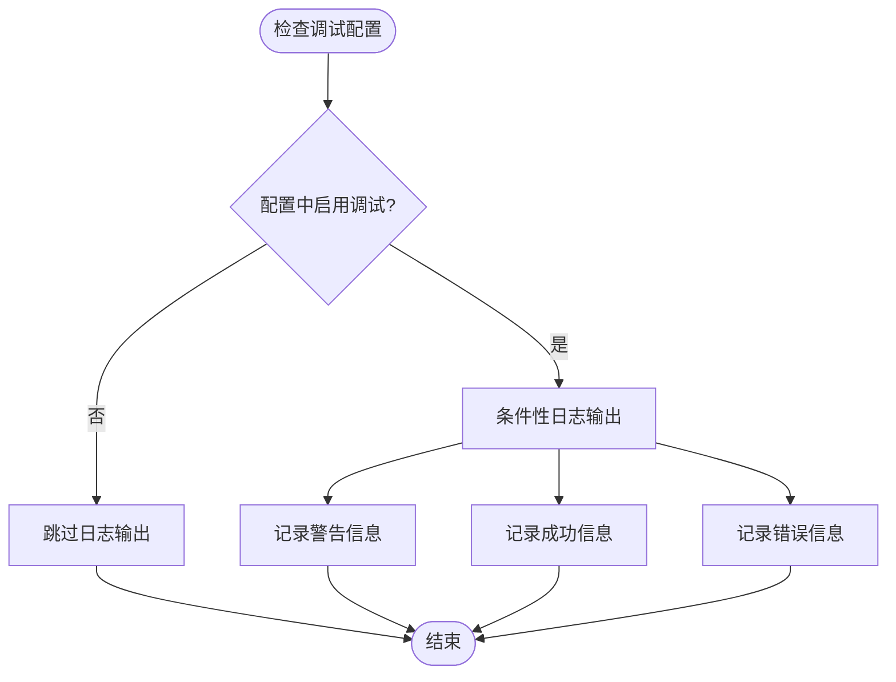

# 插件安装机制详解

<cite>
**本文档中引用的文件**
- [plugin-manager.ts](file://packages/core/src/plugin/plugin-manager.ts)
- [plugin.ts](file://packages/core/src/types/plugin.ts)
- [define-plugin.ts](file://packages/core/src/plugin/define-plugin.ts)
- [router-plugin.ts](file://packages/vue3/src/plugins/router-plugin.ts)
- [i18n-plugin.ts](file://packages/vue3/src/plugins/i18n-plugin.ts)
</cite>

## 目录
1. [概述](#概述)
2. [CorePluginManager类架构](#corepluginmanager类架构)
3. [use方法核心实现](#use方法核心实现)
4. [插件安装流程详解](#插件安装流程详解)
5. [循环依赖检测机制](#循环依赖检测机制)
6. [依赖验证系统](#依赖验证系统)
7. [上下文合并机制](#上下文合并机制)
8. [错误处理策略](#错误处理策略)
9. [调试信息输出](#调试信息输出)
10. [实际应用示例](#实际应用示例)
11. [最佳实践建议](#最佳实践建议)

## 概述

CorePluginManager是LDesign Engine插件系统的核心管理器，负责插件的注册、安装、卸载和生命周期管理。其中`use`方法是插件安装的主要入口，实现了完整的插件安装流程，包括依赖检查、循环依赖检测、上下文合并和错误处理等关键功能。

## CorePluginManager类架构

CorePluginManager类采用面向对象设计，包含以下核心属性：



**图表来源**
- [plugin-manager.ts](file://packages/core/src/plugin/plugin-manager.ts#L41-L507)
- [plugin.ts](file://packages/core/src/types/plugin.ts#L38-L51)

**章节来源**
- [plugin-manager.ts](file://packages/core/src/plugin/plugin-manager.ts#L41-L507)

## use方法核心实现

`use`方法是插件安装的核心入口，其实现遵循严格的安装流程：



**图表来源**
- [plugin-manager.ts](file://packages/core/src/plugin/plugin-manager.ts#L92-L143)

**章节来源**
- [plugin-manager.ts](file://packages/core/src/plugin/plugin-manager.ts#L92-L143)

## 插件安装流程详解

### 第一阶段：重复安装检查

插件系统首先检查目标插件是否已经安装，这是防止重复安装的重要机制：

```typescript
// 检查是否已安装
if (this.plugins.has(plugin.name)) {
  if (this.context.config?.debug) {
    console.warn(`Plugin "${plugin.name}" already installed, skipping...`)
  }
  return
}
```

这个检查确保同一个插件不会被多次安装，避免资源浪费和潜在的冲突。

### 第二阶段：循环依赖检测

循环依赖检测是插件系统的关键特性，通过`this.installing`集合实现：

```typescript
// 检测循环依赖
if (this.installing.has(plugin.name)) {
  throw new Error(
    `Circular dependency detected: Plugin "${plugin.name}" is already being installed`
  )
}
```

`this.installing`集合的作用：
- **实时监控**：跟踪当前正在安装的插件
- **快速检测**：O(1)时间复杂度的查找操作
- **预防死锁**：及时发现并阻止循环依赖

### 第三阶段：依赖验证

当插件声明了依赖关系时，系统会执行依赖验证：

```typescript
// 检查并安装依赖
if (plugin.dependencies && plugin.dependencies.length > 0) {
  await this.checkDependencies(plugin)
}
```

依赖验证的具体逻辑在`checkDependencies`方法中实现。

### 第四阶段：上下文合并

插件安装过程支持自定义上下文合并：

```typescript
// 合并上下文（如果提供了自定义上下文）
const finalContext = customContext
  ? { ...this.context, ...customContext }
  : this.context
```

这种机制允许插件在特定场景下覆盖默认上下文设置。

### 第五阶段：插件安装

最终调用插件的`install`方法：

```typescript
// 调用插件的 install 方法
await plugin.install(finalContext, options)
```

### 第六阶段：状态保存

安装成功后，系统会保存插件实例和配置选项：

```typescript
// 保存插件和选项
this.plugins.set(plugin.name, plugin)
if (options !== undefined) {
  this.pluginOptions.set(plugin.name, options)
}
```

**章节来源**
- [plugin-manager.ts](file://packages/core/src/plugin/plugin-manager.ts#L94-L143)

## 循环依赖检测机制

循环依赖检测是CorePluginManager的核心功能之一，通过`this.installing`集合实现高效的检测机制。

### 检测原理



**图表来源**
- [plugin-manager.ts](file://packages/core/src/plugin/plugin-manager.ts#L101-L142)

### 实现细节

循环依赖检测的关键实现：

1. **集合管理**：使用`Set<string>`存储正在安装的插件名称
2. **原子操作**：在try-catch-finally块中确保集合状态的一致性
3. **错误定位**：提供明确的错误信息帮助开发者识别问题

### 检测时机

循环依赖检测在以下情况下触发：
- 插件安装开始时
- 依赖插件安装时
- 递归依赖链中

**章节来源**
- [plugin-manager.ts](file://packages/core/src/plugin/plugin-manager.ts#L101-L106)

## 依赖验证系统

依赖验证系统确保插件能够正常运行所需的前置条件。

### checkDependencies方法实现



**图表来源**
- [plugin-manager.ts](file://packages/core/src/plugin/plugin-manager.ts#L297-L316)

### 依赖检查逻辑

依赖验证的具体实现：

```typescript
private async checkDependencies(plugin: Plugin): Promise<void> {
  if (!plugin.dependencies || plugin.dependencies.length === 0) {
    return
  }

  const missingDeps: string[] = []

  for (const dep of plugin.dependencies) {
    if (!this.plugins.has(dep)) {
      missingDeps.push(dep)
    }
  }

  if (missingDeps.length > 0) {
    throw new Error(
      `Plugin "${plugin.name}" requires the following dependencies: ` +
      `${missingDeps.join(', ')}. Please install them first.`
    )
  }
}
```

### 依赖验证规则

1. **顺序检查**：按依赖声明顺序逐一验证
2. **完整性检查**：确保所有声明的依赖都已安装
3. **错误报告**：提供详细的缺失依赖信息

**章节来源**
- [plugin-manager.ts](file://packages/core/src/plugin/plugin-manager.ts#L297-L316)

## 上下文合并机制

上下文合并机制允许插件在安装时使用自定义的配置和环境设置。

### 合并策略



**图表来源**
- [plugin-manager.ts](file://packages/core/src/plugin/plugin-manager.ts#L117-L121)

### 合并实现

上下文合并的核心代码：

```typescript
// 合并上下文（如果提供了自定义上下文）
const finalContext = customContext
  ? { ...this.context, ...customContext }
  : this.context
```

### 合并优先级

上下文合并遵循以下优先级规则：
1. **自定义上下文**具有最高优先级
2. **默认上下文**作为基础配置
3. **浅拷贝合并**确保不影响原始上下文

### 应用场景

上下文合并的典型应用场景：
- **测试环境**：为测试插件提供特殊的配置
- **开发模式**：启用调试和日志功能
- **生产环境**：优化性能和安全性设置

**章节来源**
- [plugin-manager.ts](file://packages/core/src/plugin/plugin-manager.ts#L117-L121)

## 错误处理策略

插件安装过程中的错误处理采用多层次的防护机制。

### 错误处理层次



**图表来源**
- [plugin-manager.ts](file://packages/core/src/plugin/plugin-manager.ts#L136-L143)

### 错误类型分类

插件安装过程中可能遇到的错误类型：

| 错误类型 | 描述 | 处理策略 |
|---------|------|----------|
| 重复安装 | 插件已存在 | 记录警告，跳过安装 |
| 循环依赖 | 插件形成依赖环 | 立即终止，抛出错误 |
| 依赖缺失 | 必需的依赖未安装 | 明确列出缺失依赖 |
| 安装失败 | 插件install方法抛出异常 | 记录详细错误信息 |
| 上下文错误 | 自定义上下文无效 | 使用默认上下文 |

### 错误恢复机制

```typescript
try {
  // 主要安装逻辑
  await plugin.install(finalContext, options)
} catch (error) {
  // 安装失败,记录错误
  console.error(`Failed to install plugin "${plugin.name}":`, error)
  throw error
} finally {
  // 移除安装标记
  this.installing.delete(plugin.name)
}
```

### 错误信息格式

系统提供结构化的错误信息：
- **插件名称**：明确指出哪个插件出现问题
- **错误类型**：区分不同类型的错误
- **上下文信息**：提供足够的调试信息
- **解决建议**：指导用户如何解决问题

**章节来源**
- [plugin-manager.ts](file://packages/core/src/plugin/plugin-manager.ts#L136-L143)

## 调试信息输出

调试信息输出机制为开发者提供了详细的安装过程追踪能力。

### 日志级别控制



**图表来源**
- [plugin-manager.ts](file://packages/core/src/plugin/plugin-manager.ts#L95-L135)

### 调试信息类型

系统提供多种类型的调试信息：

| 信息类型 | 输出时机 | 内容 |
|---------|----------|------|
| 警告信息 | 插件重复安装 | "Plugin 'xxx' already installed, skipping..." |
| 成功信息 | 插件安装成功 | "Plugin 'xxx' v1.0.0 installed successfully" |
| 错误信息 | 安装过程错误 | "Failed to install plugin 'xxx':" |
| 依赖信息 | 依赖检查结果 | 缺失依赖列表 |
| 状态信息 | 安装状态变更 | 正在安装、安装完成等 |

### 调试信息格式

调试信息采用统一的格式：

```typescript
if (this.context.config?.debug) {
  console.log(`Plugin "${plugin.name}" v${plugin.version || 'unknown'} installed successfully`)
}
```

### 调试信息的应用价值

1. **开发调试**：帮助开发者快速定位插件安装问题
2. **性能分析**：监控插件安装的性能瓶颈
3. **问题排查**：在生产环境中提供故障诊断线索
4. **用户体验**：为用户提供清晰的安装进度反馈

**章节来源**
- [plugin-manager.ts](file://packages/core/src/plugin/plugin-manager.ts#L95-L135)

## 实际应用示例

### 基础插件安装

最简单的插件安装示例：

```typescript
// 基础插件安装
await pluginManager.use({
  name: 'basic-plugin',
  version: '1.0.0',
  install(ctx, options) {
    // 插件安装逻辑
    ctx.engine.state.set('pluginData', options)
  }
}, { initialData: 'hello' })
```

### 带依赖关系的插件安装

展示如何安装具有依赖关系的插件：

```typescript
// 安装国际化插件（无依赖）
await pluginManager.use({
  name: 'i18n',
  version: '1.0.0',
  install(ctx, options) {
    // 国际化插件安装
  }
})

// 安装路由插件（依赖国际化）
await pluginManager.use({
  name: 'router',
  version: '1.0.0',
  dependencies: ['i18n'],
  install(ctx, options) {
    // 路由插件安装
  }
})
```

### 自定义上下文插件安装

展示自定义上下文的应用：

```typescript
// 安装插件时提供自定义上下文
await pluginManager.use({
  name: 'test-plugin',
  version: '1.0.0',
  install(ctx, options) {
    // 使用自定义上下文
    console.log('Custom config:', ctx.config)
  }
}, {}, {
  config: { testMode: true, timeout: 5000 }
})
```

### 热重载插件安装

展示热重载场景下的插件安装：

```typescript
// 安装支持热重载的插件
await pluginManager.use({
  name: 'dynamic-plugin',
  version: '1.0.0',
  install(ctx, options) {
    // 插件安装
  },
  uninstall(ctx) {
    // 插件卸载
  }
})
```

**章节来源**
- [router-plugin.ts](file://packages/vue3/src/plugins/router-plugin.ts#L60-L96)
- [i18n-plugin.ts](file://packages/vue3/src/plugins/i18n-plugin.ts#L38-L163)

## 最佳实践建议

### 插件设计原则

1. **单一职责**：每个插件应该专注于一个特定的功能领域
2. **最小依赖**：尽量减少插件间的依赖关系
3. **版本兼容**：合理声明插件版本和依赖版本要求
4. **错误处理**：在插件install方法中妥善处理各种异常情况

### 依赖管理策略

1. **显式声明**：所有依赖都应该在dependencies数组中明确声明
2. **版本约束**：使用语义化版本号限制依赖版本范围
3. **渐进式加载**：对于大型插件，考虑分模块加载策略
4. **依赖验证**：在插件安装前验证依赖的可用性

### 性能优化建议

1. **懒加载**：对于非核心功能，采用懒加载策略
2. **缓存机制**：合理使用缓存减少重复计算
3. **异步处理**：将耗时操作放在异步任务中执行
4. **内存管理**：及时释放不再需要的资源

### 调试和维护

1. **启用调试**：在开发环境中启用详细的调试信息
2. **错误监控**：建立完善的错误监控和报告机制
3. **版本管理**：保持插件版本的清晰和一致性
4. **文档维护**：及时更新插件的使用文档和变更日志

### 安全考虑

1. **权限控制**：确保插件只能访问必要的系统资源
2. **输入验证**：对插件接收到的所有输入进行严格验证
3. **沙箱隔离**：在可能的情况下，将插件运行在隔离环境中
4. **审计日志**：记录插件的关键操作以便审计和追踪

通过遵循这些最佳实践，可以构建稳定、高效且易于维护的插件系统，充分发挥CorePluginManager的强大功能。