# 插件系统

<cite>
**本文档中引用的文件**
- [define-plugin.ts](file://packages/core/src/plugin/define-plugin.ts)
- [plugin-manager.ts](file://packages/core/src/plugin/plugin-manager.ts)
- [plugin-api-registry.ts](file://packages/core/src/plugin/plugin-api-registry.ts)
- [plugin.ts](file://packages/core/src/types/plugin.ts)
- [plugin-api.ts](file://packages/core/src/types/plugin-api.ts)
- [i18n-plugin.ts](file://packages/vue3/src/plugins/i18n-plugin.ts)
- [router-plugin.ts](file://packages/vue3/src/plugins/router-plugin.ts)
- [i18n-integration.ts](file://packages/vue3/examples/i18n-integration.ts)
- [core-engine.ts](file://packages/core/src/engine/core-engine.ts)
- [lifecycle-manager.ts](file://packages/core/src/lifecycle/lifecycle-manager.ts)
- [engine.ts](file://packages/core/src/types/engine.ts)
- [app.config.development.ts](file://packages/vue3/example/.ldesign/app.config.development.ts)
</cite>

## 目录
1. [简介](#简介)
2. [插件系统架构](#插件系统架构)
3. [插件定义与注册](#插件定义与注册)
4. [插件管理器详解](#插件管理器详解)
5. [插件生命周期](#插件生命周期)
6. [插件间通信机制](#插件间通信机制)
7. [插件热重载](#插件热重载)
8. [实际开发示例](#实际开发示例)
9. [最佳实践与陷阱](#最佳实践与陷阱)
10. [故障排除指南](#故障排除指南)
11. [总结](#总结)

## 简介

LDesign Engine 的插件系统是一个强大而灵活的架构，允许开发者通过模块化的方式扩展应用功能。该系统提供了完整的插件生命周期管理、依赖解析、API 注册与调用、以及热重载支持等功能。

插件系统的核心特性包括：
- **类型安全**：完整的 TypeScript 类型定义
- **依赖管理**：自动检测和解决插件依赖关系
- **生命周期控制**：精确的插件安装和卸载时机
- **跨插件通信**：基于 API 注册表的安全通信机制
- **热重载支持**：开发时的实时插件更新
- **错误隔离**：插件错误不会影响整个应用

## 插件系统架构

插件系统采用分层架构设计，各组件职责明确，相互协作：

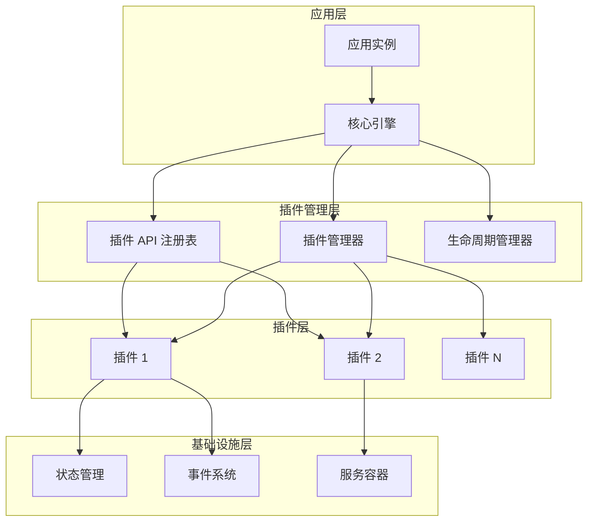

**图表来源**
- [core-engine.ts](file://packages/core/src/engine/core-engine.ts#L75-L135)
- [plugin-manager.ts](file://packages/core/src/plugin/plugin-manager.ts#L42-L65)

**章节来源**
- [core-engine.ts](file://packages/core/src/engine/core-engine.ts#L30-L60)
- [plugin-manager.ts](file://packages/core/src/plugin/plugin-manager.ts#L12-L30)

## 插件定义与注册

### definePlugin 辅助函数

`definePlugin` 是插件定义的核心辅助函数，提供类型安全的插件创建体验：

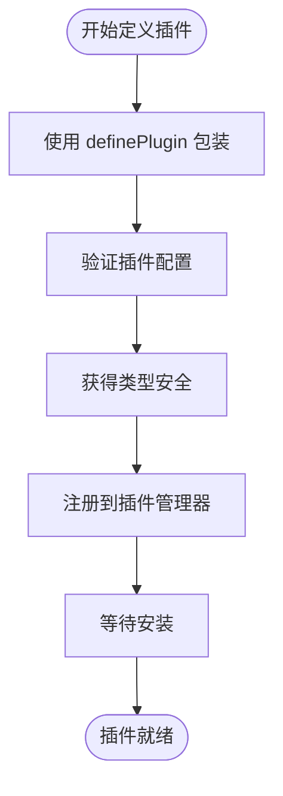

**图表来源**
- [define-plugin.ts](file://packages/core/src/plugin/define-plugin.ts#L25-L27)

### 插件接口规范

每个插件都必须实现标准的插件接口：

| 属性 | 类型 | 必需 | 描述 |
|------|------|------|------|
| name | string | 是 | 插件唯一标识符 |
| version | string | 否 | 插件版本号 |
| dependencies | string[] | 否 | 插件依赖列表 |
| install | Function | 是 | 插件安装函数 |
| uninstall | Function | 否 | 插件卸载函数 |

### 插件上下文

插件安装时接收的上下文包含引擎实例和配置信息：

| 属性 | 类型 | 描述 |
|------|------|------|
| engine | CoreEngine | 引擎实例，提供核心功能访问 |
| config | Record<string, any> | 插件配置选项 |
| framework | FrameworkInfo | 框架相关信息（可选） |
| container | ServiceContainer | 服务容器（可选） |

**章节来源**
- [define-plugin.ts](file://packages/core/src/plugin/define-plugin.ts#L1-L29)
- [plugin.ts](file://packages/core/src/types/plugin.ts#L38-L51)

## 插件管理器详解

### 核心功能架构

插件管理器是插件系统的大脑，负责插件的全生命周期管理：

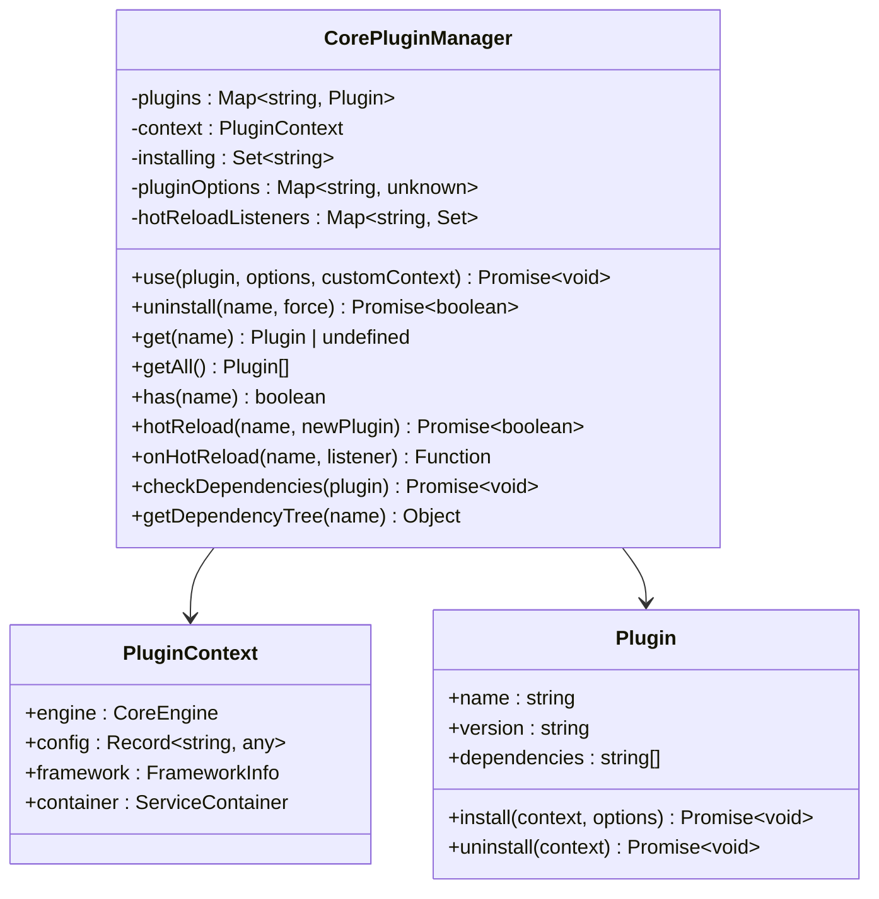

**图表来源**
- [plugin-manager.ts](file://packages/core/src/plugin/plugin-manager.ts#L42-L65)
- [plugin.ts](file://packages/core/src/types/plugin.ts#L22-L35)

### 插件安装流程

插件安装是一个精心设计的流程，确保系统的稳定性和一致性：

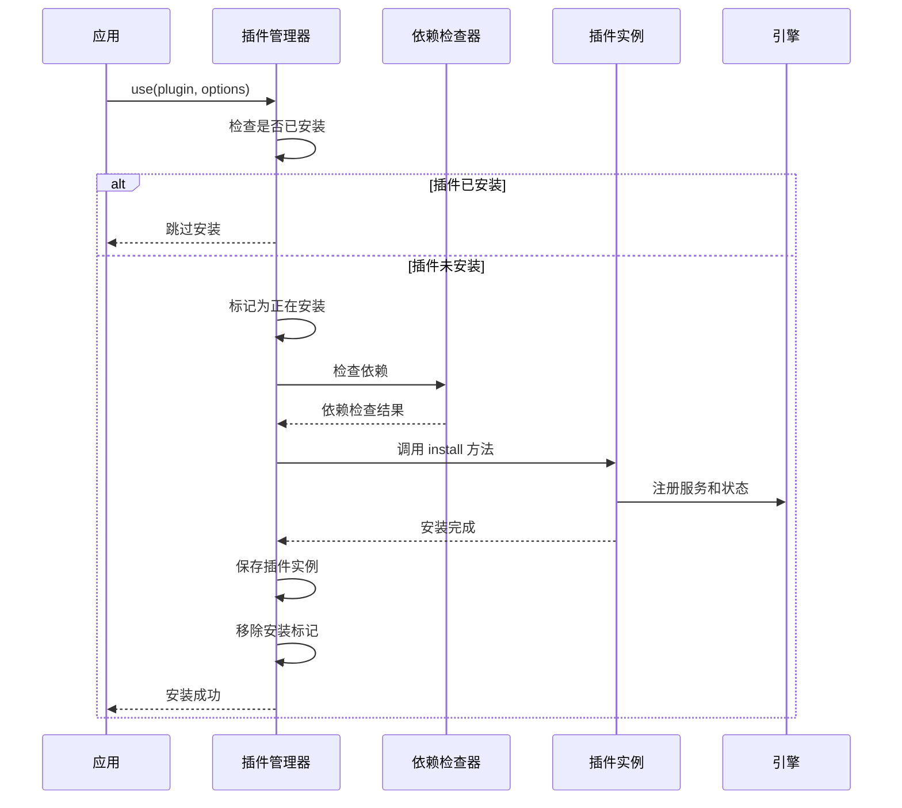

**图表来源**
- [plugin-manager.ts](file://packages/core/src/plugin/plugin-manager.ts#L92-L144)

### 依赖解析机制

插件管理器实现了智能的依赖解析算法：

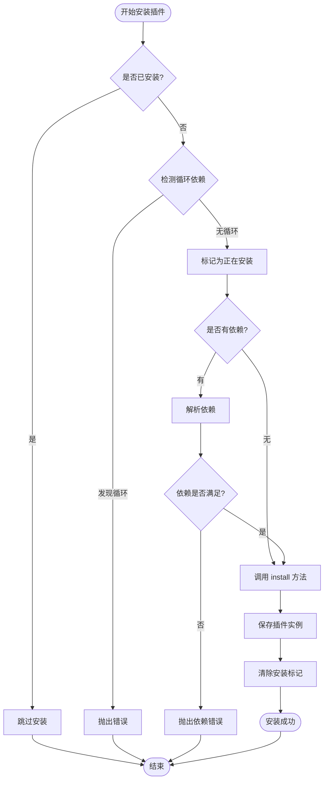

**图表来源**
- [plugin-manager.ts](file://packages/core/src/plugin/plugin-manager.ts#L112-L144)

**章节来源**
- [plugin-manager.ts](file://packages/core/src/plugin/plugin-manager.ts#L67-L144)

## 插件生命周期

### 生命周期钩子系统

插件系统与引擎的生命周期紧密集成，提供多个关键时机：

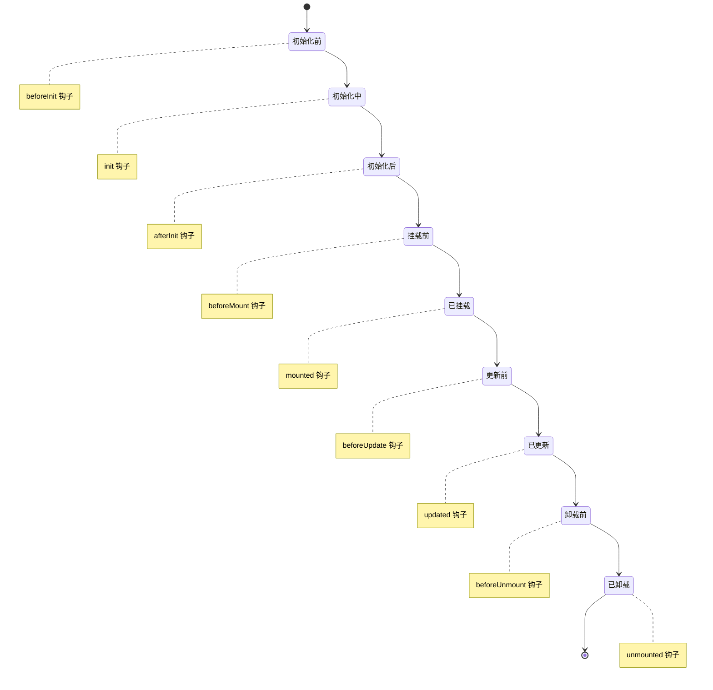

**图表来源**
- [lifecycle-manager.ts](file://packages/core/src/lifecycle/lifecycle-manager.ts#L37-L46)

### 插件生命周期事件

插件可以通过以下方式参与生命周期：

| 钩子名称 | 触发时机 | 用途 |
|----------|----------|------|
| beforeInit | 引擎初始化前 | 准备工作、资源分配 |
| init | 引擎初始化中 | 插件初始化逻辑 |
| afterInit | 引擎初始化后 | 后续设置、事件绑定 |
| beforeMount | 应用挂载前 | 数据预加载、状态准备 |
| mounted | 应用已挂载 | 插件激活、功能启用 |
| beforeUpdate | 组件更新前 | 状态同步、清理工作 |
| updated | 组件已更新 | 插件响应、状态更新 |
| beforeUnmount | 应用卸载前 | 资源清理、状态保存 |
| unmounted | 应用已卸载 | 最终清理、断开连接 |

**章节来源**
- [lifecycle-manager.ts](file://packages/core/src/lifecycle/lifecycle-manager.ts#L37-L46)
- [lifecycle-manager.ts](file://packages/core/src/lifecycle/lifecycle-manager.ts#L173-L209)

## 插件间通信机制

### 插件 API 注册表

插件 API 注册表提供了类型安全的插件间通信机制：

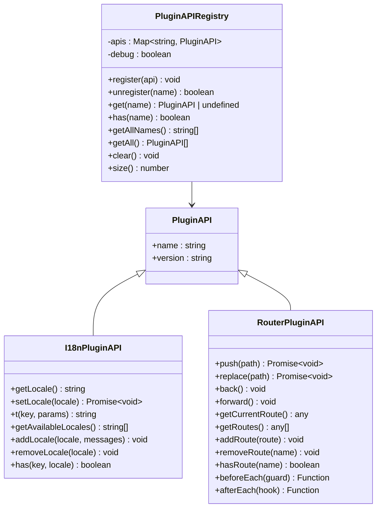

**图表来源**
- [plugin-api-registry.ts](file://packages/core/src/plugin/plugin-api-registry.ts#L63-L76)
- [plugin-api.ts](file://packages/core/src/types/plugin-api.ts#L12-L18)

### API 注册与调用流程

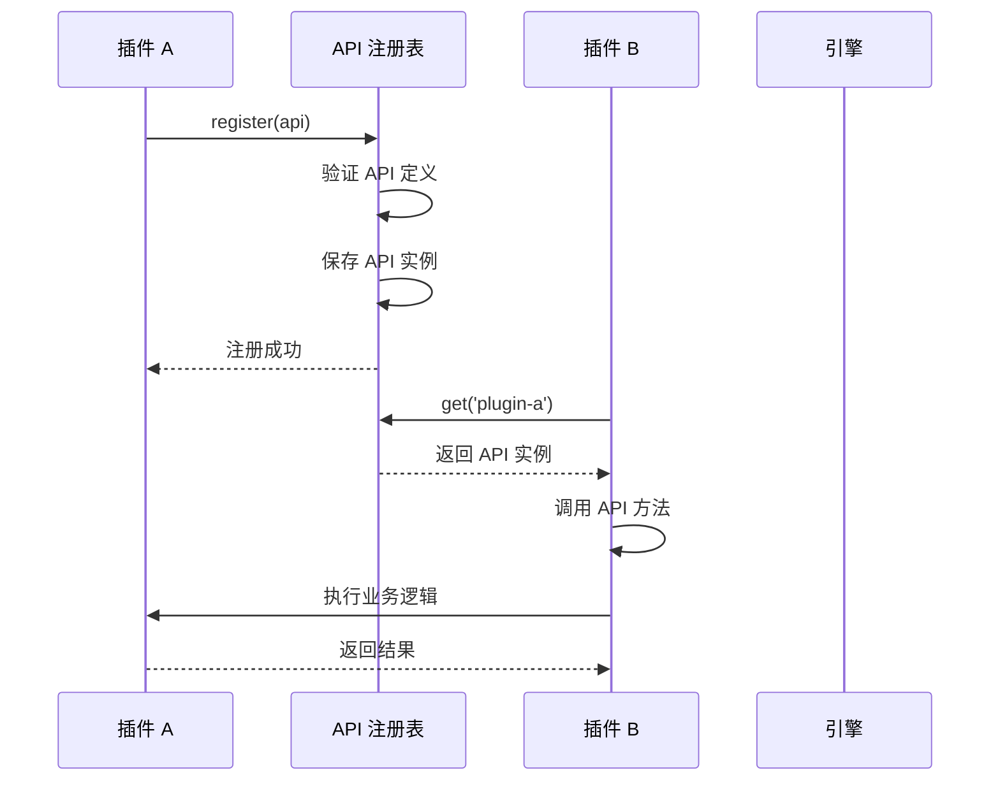

**图表来源**
- [plugin-api-registry.ts](file://packages/core/src/plugin/plugin-api-registry.ts#L81-L110)

**章节来源**
- [plugin-api-registry.ts](file://packages/core/src/plugin/plugin-api-registry.ts#L15-L58)
- [plugin-api.ts](file://packages/core/src/types/plugin-api.ts#L12-L275)

## 插件热重载

### 热重载机制原理

插件热重载是开发过程中的重要功能，允许在不停止应用的情况下更新插件：

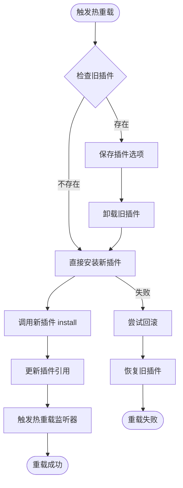

**图表来源**
- [plugin-manager.ts](file://packages/core/src/plugin/plugin-manager.ts#L388-L447)

### 热重载监听器

开发者可以注册热重载监听器来响应插件更新：

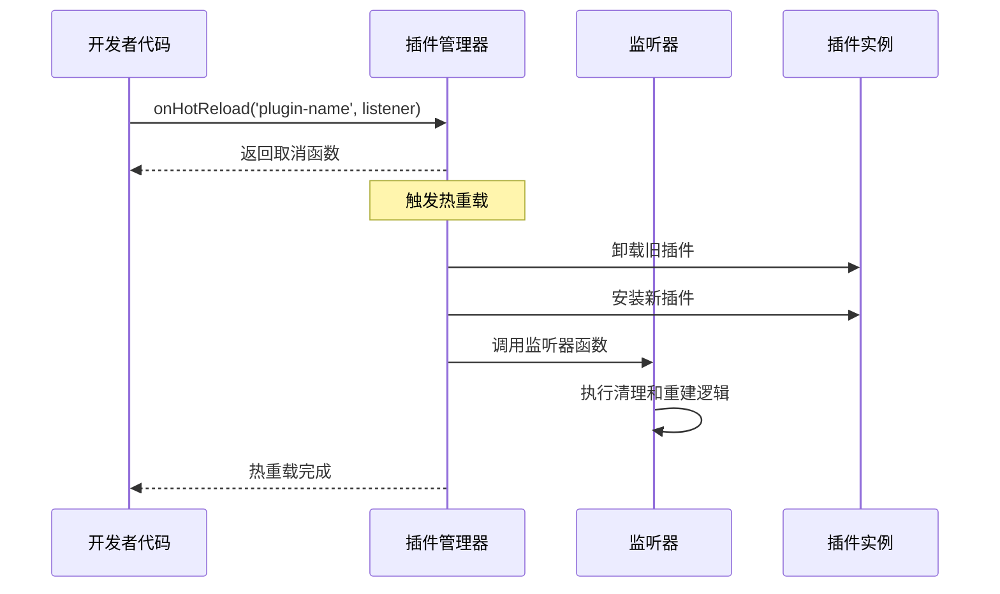

**图表来源**
- [plugin-manager.ts](file://packages/core/src/plugin/plugin-manager.ts#L469-L483)

**章节来源**
- [plugin-manager.ts](file://packages/core/src/plugin/plugin-manager.ts#L388-L483)

## 实际开发示例

### I18n 插件开发示例

以下展示了如何开发一个完整的国际化插件：

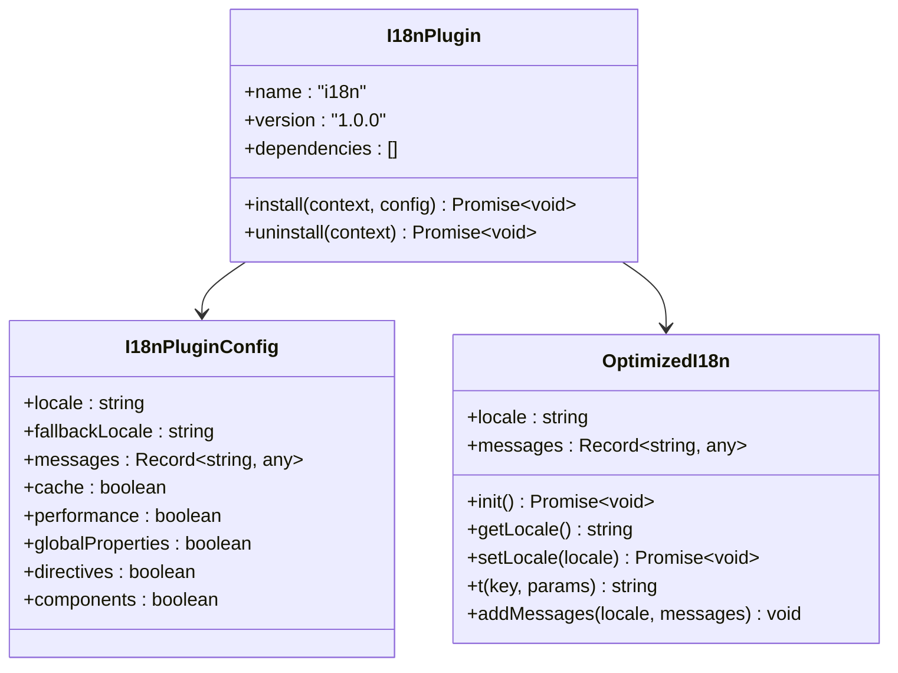

**图表来源**
- [i18n-plugin.ts](file://packages/vue3/src/plugins/i18n-plugin.ts#L38-L42)
- [i18n-plugin.ts](file://packages/vue3/src/plugins/i18n-plugin.ts#L11-L31)

### 插件集成流程

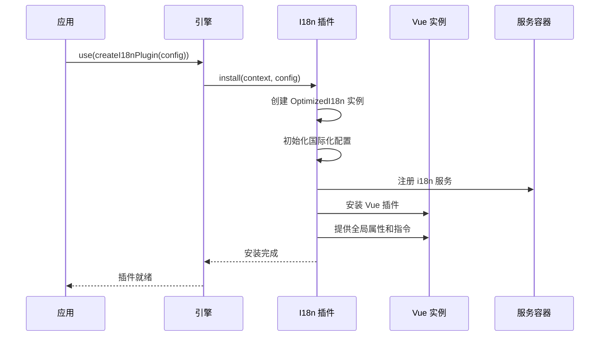

**图表来源**
- [i18n-plugin.ts](file://packages/vue3/src/plugins/i18n-plugin.ts#L44-L163)

**章节来源**
- [i18n-plugin.ts](file://packages/vue3/src/plugins/i18n-plugin.ts#L38-L164)
- [i18n-integration.ts](file://packages/vue3/examples/i18n-integration.ts#L13-L56)

## 最佳实践与陷阱

### 开发最佳实践

1. **插件命名规范**
   - 使用描述性的插件名称
   - 遵循语义化版本控制
   - 避免与现有插件名称冲突

2. **依赖管理**
   - 明确声明插件依赖
   - 避免循环依赖
   - 提供合理的默认配置

3. **错误处理**
   - 实现优雅的错误处理
   - 提供详细的错误信息
   - 支持插件卸载时的清理

4. **性能考虑**
   - 避免阻塞主线程
   - 合理使用缓存机制
   - 监控插件性能指标

### 常见陷阱

1. **循环依赖问题**
   ```typescript
   // ❌ 错误：循环依赖
   const pluginA = definePlugin({
     name: 'plugin-a',
     dependencies: ['plugin-b'],
     install() {}
   })
   
   const pluginB = definePlugin({
     name: 'plugin-b',
     dependencies: ['plugin-a'], // 循环依赖
     install() {}
   })
   ```

2. **插件卸载问题**
   ```typescript
   // ❌ 错误：忘记实现 uninstall 方法
   const plugin = definePlugin({
     name: 'my-plugin',
     install(context) {
       // 安装逻辑
     }
     // 缺少 uninstall 方法
   })
   ```

3. **状态污染**
   ```typescript
   // ❌ 错误：直接操作全局状态
   const plugin = definePlugin({
     name: 'my-plugin',
     install(context) {
       context.engine.state.set('globalKey', 'value') // 可能污染其他插件
     }
   })
   ```

4. **内存泄漏**
   ```typescript
   // ❌ 错误：忘记清理事件监听器
   const plugin = definePlugin({
     name: 'my-plugin',
     install(context) {
       context.engine.events.on('some-event', handler) // 没有清理
     }
   })
   ```

### 版本兼容性

插件系统提供了多种版本兼容性策略：

| 策略 | 适用场景 | 实现方式 |
|------|----------|----------|
| 严格版本匹配 | 关键插件 | 精确版本号匹配 |
| 主版本兼容 | 稳定插件 | 主版本号相同 |
| 语义化版本 | 通用插件 | 按语义化规则匹配 |
| 降级支持 | 向后兼容 | 提供兼容性层 |

## 故障排除指南

### 常见错误诊断

1. **插件安装失败**
   - 检查插件是否已安装
   - 验证依赖关系
   - 查看控制台错误信息

2. **循环依赖错误**
   ```bash
   Error: Circular dependency detected: Plugin "plugin-a" is already being installed
   ```
   **解决方案**：重新设计插件依赖结构

3. **插件卸载失败**
   ```bash
   Error: Cannot uninstall plugin "plugin-name": It is required by: dependent-plugin
   ```
   **解决方案**：先卸载依赖插件，或使用 force 参数

4. **API 调用失败**
   - 检查 API 是否已注册
   - 验证插件是否已安装
   - 确认 API 版本兼容性

### 调试技巧

1. **启用调试模式**
   ```typescript
   const engine = createCoreEngine({
     debug: true
   })
   ```

2. **查看插件状态**
   ```typescript
   // 检查插件安装状态
   console.log('插件数量:', engine.plugins.size())
   console.log('已安装插件:', engine.plugins.getAll().map(p => p.name))
   
   // 查看依赖关系
   console.log('依赖树:', engine.plugins.getDependencyTree('plugin-name'))
   ```

3. **监控热重载**
   ```typescript
   const unsubscribe = engine.plugins.onHotReload('plugin-name', () => {
     console.log('插件已重载')
   })
   ```

**章节来源**
- [plugin-manager.ts](file://packages/core/src/plugin/plugin-manager.ts#L93-L144)
- [plugin-manager.ts](file://packages/core/src/plugin/plugin-manager.ts#L178-L208)

## 总结

LDesign Engine 的插件系统是一个设计精良、功能完备的架构，为开发者提供了强大的扩展能力。通过本文档的详细介绍，我们了解了：

1. **插件系统的核心架构**：分层设计确保了系统的可维护性和扩展性
2. **插件定义与注册**：类型安全的 API 设计简化了插件开发
3. **插件管理器**：完善的生命周期管理和依赖解析机制
4. **插件间通信**：基于 API 注册表的安全通信机制
5. **热重载支持**：开发时的实时更新能力
6. **最佳实践**：避免常见陷阱，提高插件质量

插件系统的设计充分体现了现代软件架构的原则：
- **单一职责**：每个组件专注于特定功能
- **开放封闭**：对扩展开放，对修改封闭
- **依赖倒置**：高层模块不依赖低层模块的具体实现
- **接口隔离**：提供细粒度的接口定义

通过合理使用插件系统，开发者可以构建出模块化、可维护、可扩展的应用程序，为用户提供更好的开发体验和产品价值。