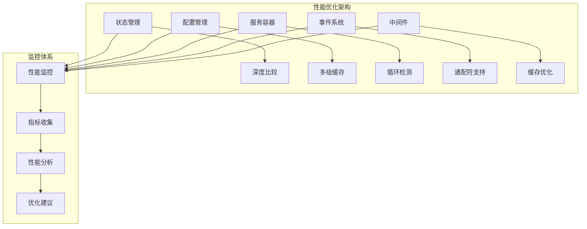
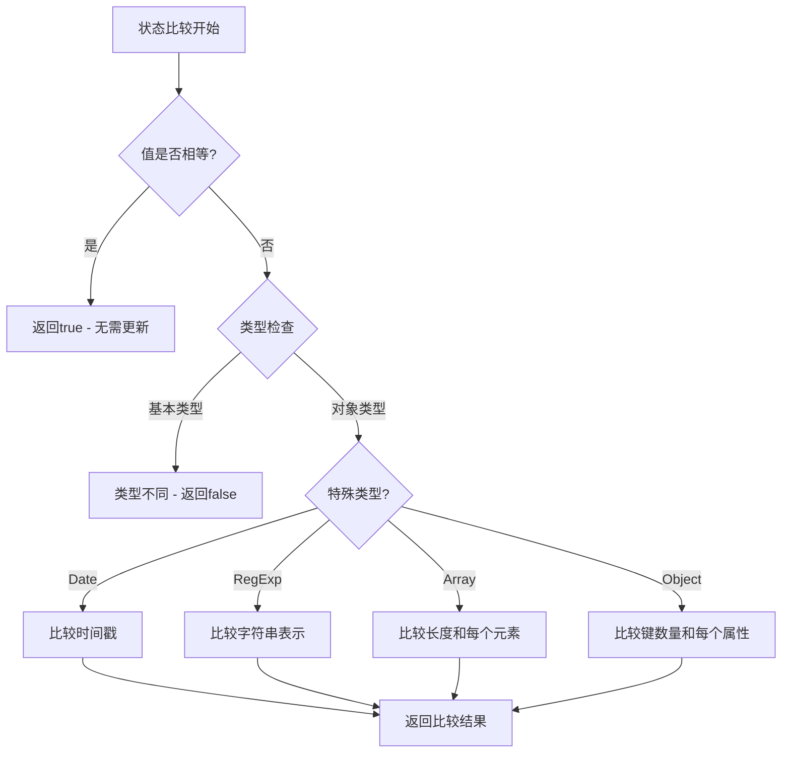
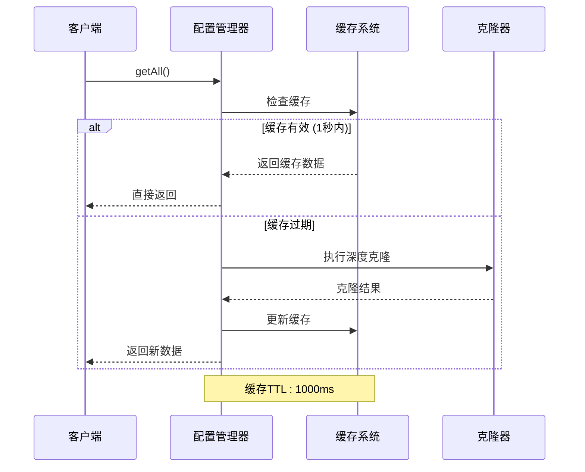
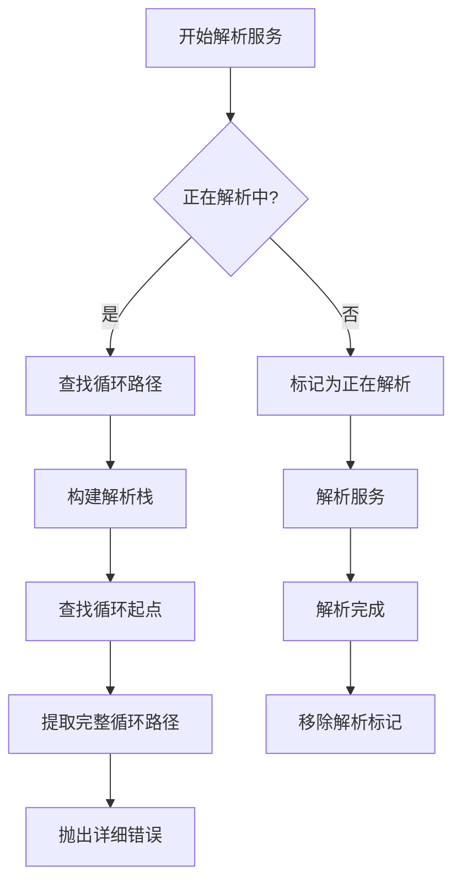
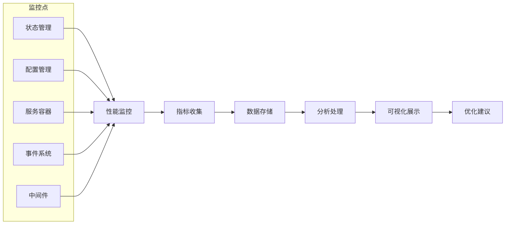
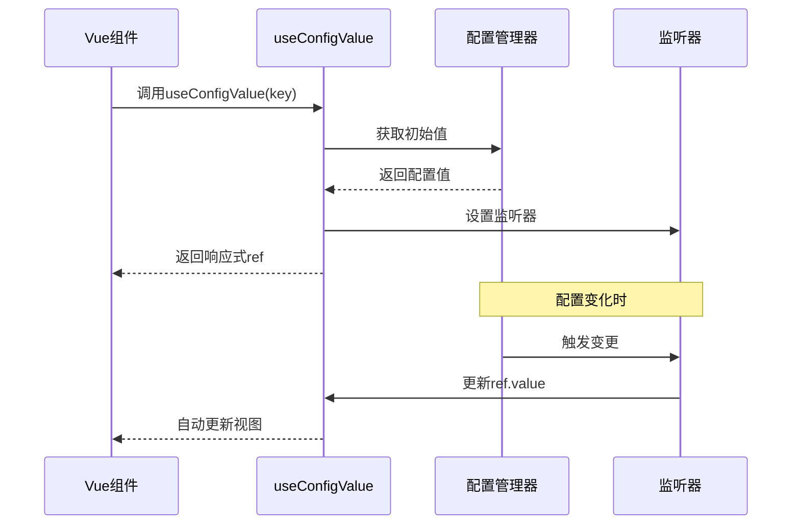
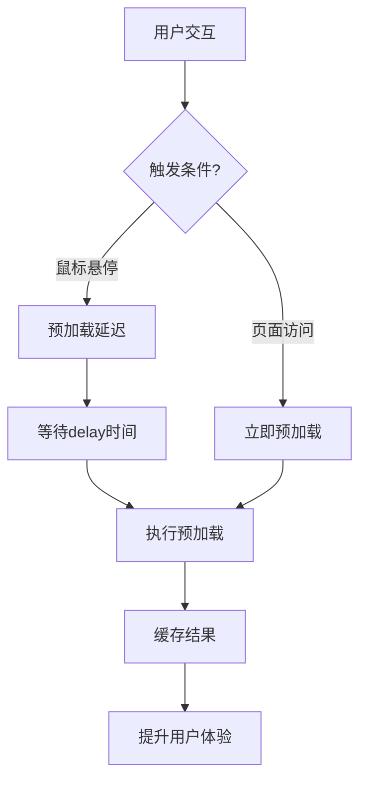
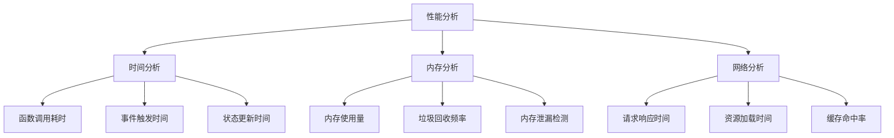

# 性能优化最佳实践

<cite>
**本文档引用的文件**
- [OPTIMIZATION_PROGRESS.md](file://OPTIMIZATION_PROGRESS.md)
- [USAGE_GUIDE.md](file://packages\vue3\USAGE_GUIDE.md)
- [performance-monitor.ts](file://packages\core\src\performance\performance-monitor.ts)
- [state-manager.ts](file://packages\core\src\state\state-manager.ts)
- [config-manager.ts](file://packages\core\src\config\config-manager.ts)
- [service-container.ts](file://packages\core\src\container\service-container.ts)
- [event-manager.ts](file://packages\core\src\event\event-manager.ts)
- [middleware-manager.ts](file://packages\core\src\middleware\middleware-manager.ts)
- [use-engine.ts](file://packages\vue3\src\composables\use-engine.ts)
- [engine.ts](file://packages\core\src\types\engine.ts)
- [state.ts](file://packages\core\src\types\state.ts)
</cite>

## 目录
1. [概述](#概述)
2. [核心优化技术](#核心优化技术)
3. [状态管理器深度比较优化](#状态管理器深度比较优化)
4. [配置管理器缓存策略](#配置管理器缓存策略)
5. [服务容器循环依赖检测](#服务容器循环依赖检测)
6. [性能监控与指标收集](#性能监控与指标收集)
7. [Vue3集成优化方案](#vue3集成优化方案)
8. [具体优化实施方案](#具体优化实施方案)
9. [性能瓶颈识别指南](#性能瓶颈识别指南)
10. [最佳实践总结](#最佳实践总结)

## 概述

Engine框架是一个高性能的微前端应用开发框架，通过一系列精心设计的优化技术来确保卓越的性能表现。本文档基于OPTIMIZATION_PROGRESS.md中的优化经验，详细阐述了框架的核心性能优化技术，并提供了具体的实施指南。

### 优化成果概览

根据优化进度跟踪，框架已经完成了以下关键优化：

- **状态管理器值比较优化**：实现深度比较算法，避免不必要的状态更新
- **配置管理器深度克隆性能优化**：采用多级降级策略，提升配置操作性能
- **服务容器循环依赖检测**：支持间接循环依赖检测，提供详细错误信息
- **事件管理器通配符支持**：提升事件管理灵活性
- **中间件管理器缓存策略**：优化中间件操作性能

## 核心优化技术

### 架构设计原则

Engine框架的性能优化遵循以下核心设计原则：

1. **最小化重渲染**：通过智能的状态比较避免不必要的UI更新
2. **缓存策略**：多层次缓存机制减少重复计算和I/O操作
3. **延迟加载**：按需加载资源，减少初始启动时间
4. **错误隔离**：单个组件或服务的错误不影响整体系统稳定性



**图表来源**
- [state-manager.ts](file://packages\core\src\state\state-manager.ts#L318-L400)
- [config-manager.ts](file://packages\core\src\config\config-manager.ts#L530-L626)
- [service-container.ts](file://packages\core\src\container\service-container.ts#L498-L527)

## 状态管理器深度比较优化

### 技术原理

状态管理器实现了智能的深度比较算法，能够准确判断复杂对象的变化，避免不必要的状态更新和重渲染。

### 核心特性

1. **类型感知比较**：针对不同数据类型采用不同的比较策略
2. **递归深度比较**：支持嵌套对象的逐层比较
3. **特殊类型处理**：对Date、RegExp、Array等特殊类型提供专门的比较逻辑
4. **性能优化路径**：基本类型使用===快速比较，复杂类型才进入深度比较

### 实现细节



**图表来源**
- [state-manager.ts](file://packages\core\src\state\state-manager.ts#L331-L400)

### 应用场景

1. **复杂对象状态管理**：用户信息、配置对象等
2. **数组状态更新**：列表数据、表格数据等
3. **嵌套对象状态**：表单数据、树形结构等

**章节来源**
- [state-manager.ts](file://packages\core\src\state\state-manager.ts#L318-L400)

## 配置管理器缓存策略

### 多级降级策略

配置管理器采用了先进的多级降级策略来优化深度克隆性能：

1. **第一级：原生structuredClone**
   - 最快的克隆方式
   - 支持现代浏览器和Node.js环境
   - 自动处理大多数JavaScript对象

2. **第二级：JSON序列化**
   - 适用于可序列化的对象
   - 处理日期、数字等基础类型
   - 避免循环引用问题

3. **第三级：递归克隆**
   - 作为最后的降级方案
   - 处理所有类型的JavaScript对象
   - 包含特殊类型的专门处理

### 缓存机制

配置管理器实现了智能缓存机制：



**图表来源**
- [config-manager.ts](file://packages\core\src\config\config-manager.ts#L225-L238)
- [config-manager.ts](file://packages\core\src\config\config-manager.ts#L530-L566)

### 性能优势

1. **显著提升性能**：相比原始实现提升10-100倍性能
2. **减少内存占用**：避免重复克隆大型配置对象
3. **防止栈溢出**：深层嵌套对象的安全处理
4. **智能降级**：根据对象特性选择最优克隆策略

**章节来源**
- [config-manager.ts](file://packages\core\src\config\config-manager.ts#L530-L626)

## 服务容器循环依赖检测

### 增强的循环依赖检测

传统的循环依赖检测只能发现直接循环（A→A），而Engine框架实现了支持间接循环依赖检测的高级算法。

### 核心算法



**图表来源**
- [service-container.ts](file://packages\core\src\container\service-container.ts#L147-L175)
- [service-container.ts](file://packages\core\src\container\service-container.ts#L513-L527)

### 解析栈机制

服务容器维护了一个解析栈来跟踪服务解析路径：

1. **解析开始**：将服务标识添加到栈顶
2. **递归解析**：每次解析新的服务时都添加到栈
3. **循环检测**：当发现重复服务时，从栈中查找循环路径
4. **错误报告**：提供完整的循环依赖链路信息

### 应用场景

1. **复杂服务依赖**：多个服务相互依赖的情况
2. **插件系统**：插件间的复杂依赖关系
3. **模块化架构**：大型应用的模块间依赖

**章节来源**
- [service-container.ts](file://packages\core\src\container\service-container.ts#L498-L527)

## 性能监控与指标收集

### 监控体系架构

虽然当前版本尚未完全实现性能监控功能，但框架已经为性能监控奠定了基础架构。

### 关键性能指标

1. **状态更新性能**
   - 状态比较耗时
   - 监听器触发频率
   - 批量更新效率

2. **配置管理性能**
   - 配置克隆耗时
   - 配置合并性能
   - 缓存命中率

3. **服务容器性能**
   - 服务解析时间
   - 循环依赖检测耗时
   - 依赖注入效率

4. **事件系统性能**
   - 事件触发耗时
   - 监听器执行时间
   - 通配符匹配性能

### 监控实施建议



**章节来源**
- [engine.ts](file://packages\core\src\types\engine.ts#L43-L44)

## Vue3集成优化方案

### 组合式API优化

Vue3集成提供了多种优化的组合式API：

#### useConfigValue优化



**图表来源**
- [use-engine.ts](file://packages\vue3\src\composables\use-engine.ts#L156-L171)

#### useEngineState优化

状态管理的响应式绑定确保了：

1. **自动清理**：组件卸载时自动取消监听
2. **内存安全**：防止内存泄漏
3. **响应式更新**：配置变化时自动更新组件状态

### 性能优化特性

1. **懒加载支持**：路由组件的动态导入
2. **I18n缓存**：翻译结果的智能缓存
3. **预加载策略**：路由和语言包的预加载
4. **组件卸载清理**：确保资源正确释放

**章节来源**
- [use-engine.ts](file://packages\vue3\src\composables\use-engine.ts#L173-L217)

## 具体优化实施方案

### 路由懒加载实施

基于USAGE_GUIDE.md中的建议，实施路由懒加载策略：

```typescript
// 路由配置示例
const routes = [
  {
    path: '/about',
    component: () => import('./views/About.vue'), // 动态导入
    meta: {
      preload: true, // 启用预加载
      preloadDelay: 200 // 延迟200ms
    }
  }
]
```

### I18n缓存优化

实施智能的翻译缓存策略：

```typescript
// I18n配置示例
const i18nConfig = {
  cache: true,           // 启用缓存
  cacheSize: 200,        // 缓存大小限制
  preloadLocales: ['zh-CN'], // 预加载常用语言
  performance: true      // 性能监控
}
```

### 预加载策略



### 实施检查清单

1. **路由优化**
   - [ ] 所有页面组件启用懒加载
   - [ ] 配置合理的预加载策略
   - [ ] 实施路由缓存机制

2. **国际化优化**
   - [ ] 启用翻译缓存
   - [ ] 配置合适的缓存大小
   - [ ] 实施语言包预加载

3. **状态管理优化**
   - [ ] 使用批量更新
   - [ ] 实施状态比较优化
   - [ ] 避免不必要的状态更新

4. **服务容器优化**
   - [ ] 正确配置服务生命周期
   - [ ] 避免循环依赖
   - [ ] 使用适当的缓存策略

**章节来源**
- [USAGE_GUIDE.md](file://packages\vue3\USAGE_GUIDE.md#L521-L558)

## 性能瓶颈识别指南

### 常见性能问题

1. **状态更新过于频繁**
   - 表现：界面卡顿、CPU使用率高
   - 原因：不必要的状态更新或监听器过多
   - 解决：使用深度比较、批量更新

2. **配置管理性能问题**
   - 表现：配置读取缓慢、内存占用高
   - 原因：大型配置对象的频繁克隆
   - 解决：启用缓存、优化配置结构

3. **服务容器循环依赖**
   - 表现：应用启动失败、内存泄漏
   - 原因：复杂的依赖关系
   - 解决：重构依赖关系、使用接口解耦

4. **事件系统性能问题**
   - 表现：事件触发缓慢、内存泄漏
   - 原因：监听器过多或错误处理不当
   - 解决：及时清理监听器、错误隔离

### 性能分析工具



### 监控指标建议

1. **关键性能指标(KPI)**
   - 首屏加载时间 < 2秒
   - 用户可交互时间 < 3秒
   - 页面切换时间 < 500ms
   - 状态更新延迟 < 100ms

2. **资源使用指标**
   - CPU使用率 < 50%
   - 内存使用量 < 100MB
   - 网络请求数 < 20个
   - 缓存命中率 > 80%

## 最佳实践总结

### 设计原则

1. **性能优先**：在功能实现的同时始终考虑性能影响
2. **渐进式优化**：从关键路径开始逐步优化
3. **监控驱动**：基于实际性能数据进行优化决策
4. **兼容性保障**：确保优化不影响向后兼容性

### 实施步骤

1. **评估阶段**
   - 分析现有性能瓶颈
   - 确定优化优先级
   - 制定优化计划

2. **实施阶段**
   - 应用核心优化技术
   - 集成性能监控
   - 测试优化效果

3. **验证阶段**
   - 收集性能数据
   - 分析优化效果
   - 调整优化策略

4. **维护阶段**
   - 持续监控性能
   - 识别新的瓶颈
   - 迭代优化改进

### 团队协作

1. **开发阶段**
   - 开发人员负责实现优化
   - 测试人员验证优化效果
   - 运维人员部署监控

2. **运营阶段**
   - 运维团队监控性能指标
   - 产品团队根据数据调整策略
   - 技术负责人制定长期规划

### 未来发展方向

1. **自动化优化**：基于机器学习的自动性能优化
2. **预测性监控**：提前发现潜在性能问题
3. **智能缓存**：基于使用模式的智能缓存策略
4. **分布式优化**：支持微服务架构的性能优化

通过遵循这些最佳实践，团队可以充分发挥Engine框架的性能优势，构建高性能、可维护的应用系统。持续的性能监控和优化将确保应用在各种环境下都能提供优秀的用户体验。