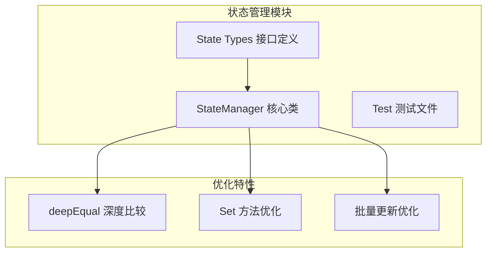
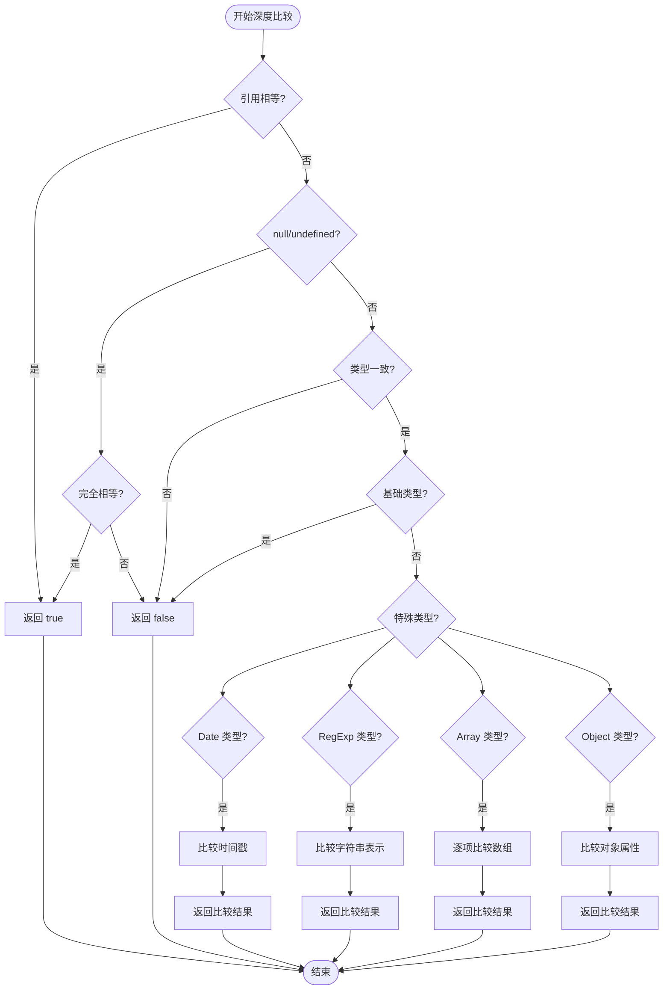
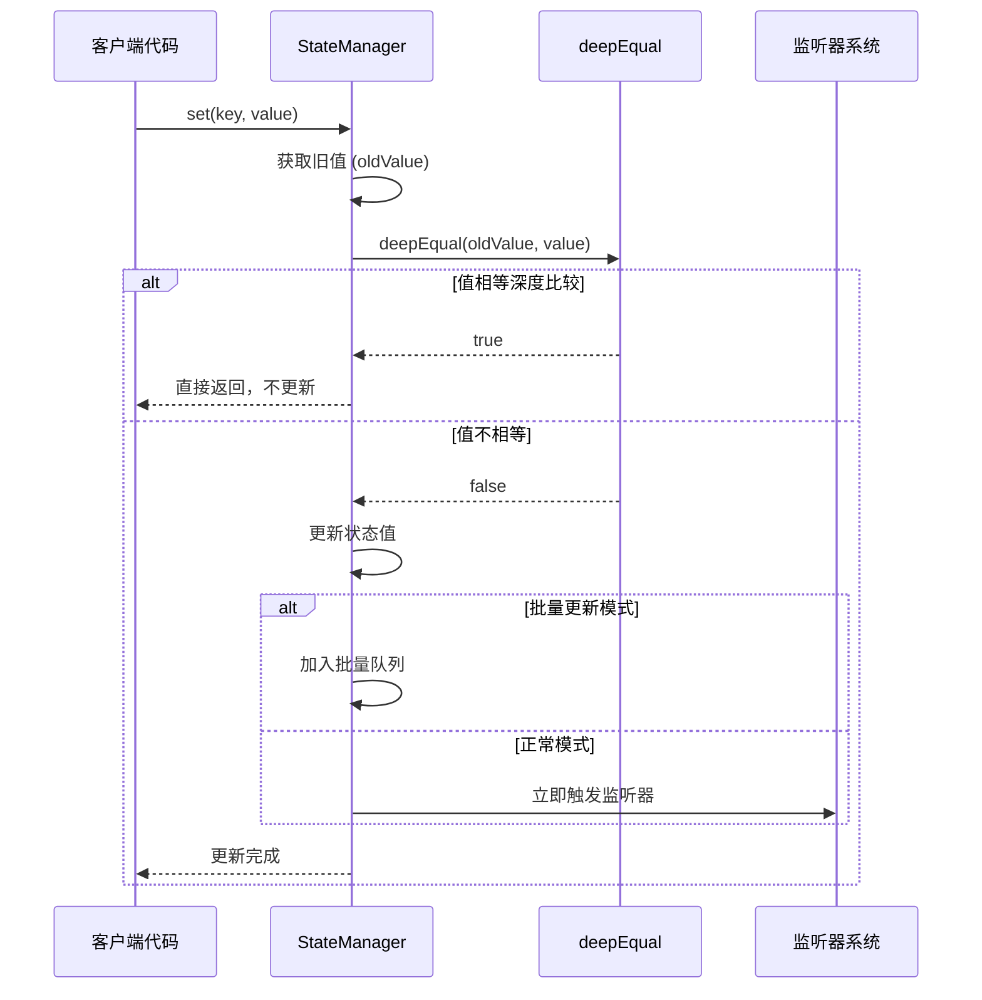
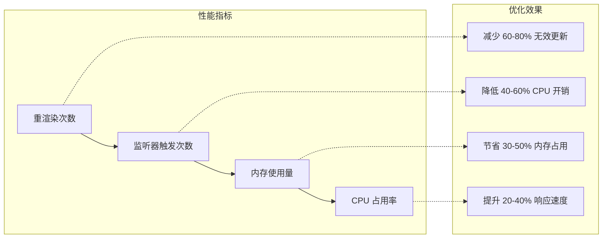

# 状态管理优化

<cite>
**本文档引用的文件**
- [state-manager.ts](file://packages/core/src/state/state-manager.ts)
- [OPTIMIZATION_PROGRESS.md](file://OPTIMIZATION_PROGRESS.md)
- [state.ts](file://packages/core/src/types/state.ts)
- [core-engine.test.ts](file://packages/core/src/__tests__/core-engine.test.ts)
- [StateDemo.vue](file://packages/vue3/example/src/components/StateDemo.vue)
- [use-engine.ts](file://packages/vue3/src/composables/use-engine.ts)
</cite>

## 目录
1. [引言](#引言)
2. [项目结构概述](#项目结构概述)
3. [深度比较优化技术](#深度比较优化技术)
4. [deepEqual() 方法实现原理](#deepequal-方法实现原理)
5. [set() 方法中的优化应用](#set-方法中的优化应用)
6. [性能对比分析](#性能对比分析)
7. [实际应用场景](#实际应用场景)
8. [最佳实践建议](#最佳实践建议)
9. [总结](#总结)

## 引言

在现代前端应用中，状态管理是构建复杂用户界面的核心组件。传统的状态管理方案通常使用 `===` 运算符进行值比较，这种方法在处理对象类型时存在明显缺陷：即使对象内容相同，只要引用不同就会被视为不同的值，从而触发不必要的重渲染和监听器触发。这种行为不仅浪费计算资源，还可能导致应用性能下降。

基于 OPTIMIZATION_PROGRESS.md 中已完成的优化1，本文档详细阐述了状态管理器的深度比较优化技术，重点分析 `deepEqual()` 方法的实现原理及其在 `set()` 方法中的应用，展示如何通过深度比较替代 `===` 来避免不必要的重渲染和监听器触发。

## 项目结构概述

状态管理器位于 `packages/core/src/state/` 目录下，采用模块化设计，主要包含以下核心文件：



**图表来源**
- [state-manager.ts](file://packages/core/src/state/state-manager.ts#L1-L419)
- [state.ts](file://packages/core/src/types/state.ts#L1-L34)

**章节来源**
- [state-manager.ts](file://packages/core/src/state/state-manager.ts#L1-L50)
- [OPTIMIZATION_PROGRESS.md](file://OPTIMIZATION_PROGRESS.md#L21-L40)

## 深度比较优化技术

### 优化背景与问题分析

在状态管理的早期实现中，`set()` 方法使用简单的 `===` 运算符进行值比较。这种实现方式存在以下问题：

1. **对象引用问题**：每次创建新对象都会被视为新的值
2. **重复渲染**：即使对象内容相同，也会触发组件重渲染
3. **监听器滥用**：不必要的监听器触发增加了内存开销
4. **性能损耗**：频繁的无效更新降低了应用响应速度

### 优化目标

深度比较优化旨在解决上述问题，实现以下目标：

- **准确判断值变化**：基于内容而非引用判断值是否真正改变
- **减少不必要更新**：只有在值实际改变时才触发相关操作
- **提升性能表现**：避免无效的重渲染和监听器调用
- **保持兼容性**：支持各种数据类型的深度比较

## deepEqual() 方法实现原理

### 核心算法架构

`deepEqual()` 方法采用递归深度比较算法，能够处理各种复杂的数据类型：



**图表来源**
- [state-manager.ts](file://packages/core/src/state/state-manager.ts#L331-L400)

### 特殊类型处理逻辑

#### Date 类型比较

对于 `Date` 对象，使用 `getTime()` 方法比较时间戳，确保日期值的准确性：

```typescript
// Date 类型比较逻辑
if (a instanceof Date && b instanceof Date) {
  return a.getTime() === b.getTime()
}
```

#### RegExp 类型比较

正则表达式对象通过比较其字符串表示来判断相等性：

```typescript
// RegExp 类型比较逻辑
if (a instanceof RegExp && b instanceof RegExp) {
  return a.toString() === b.toString()
}
```

#### Array 类型比较

数组比较采用逐项递归的方式，确保每个元素都相等：

```typescript
// 数组类型比较逻辑
if (Array.isArray(a) && Array.isArray(b)) {
  if (a.length !== b.length) {
    return false
  }
  for (let i = 0; i < a.length; i++) {
    if (!this.deepEqual(a[i], b[i])) {
      return false
    }
  }
  return true
}
```

#### Object 类型比较

对象比较需要考虑属性数量和每个属性的值：

```typescript
// 对象类型比较逻辑
const keysA = Object.keys(a)
const keysB = Object.keys(b)
if (keysA.length !== keysB.length) {
  return false
}
for (const key of keysA) {
  if (!Object.prototype.hasOwnProperty.call(b, key)) {
    return false
  }
  if (!this.deepEqual(a[key], b[key])) {
    return false
  }
}
return true
```

**章节来源**
- [state-manager.ts](file://packages/core/src/state/state-manager.ts#L331-L400)

## set() 方法中的优化应用

### 优化前后的对比

在优化前，`set()` 方法使用简单的 `===` 比较：

```typescript
// 优化前的简单比较
if (oldValue === value) {
  return
}
```

优化后，使用深度比较算法：

```typescript
// 优化后的深度比较
if (this.deepEqual(oldValue, value)) {
  return
}
```

### 执行流程图



**图表来源**
- [state-manager.ts](file://packages/core/src/state/state-manager.ts#L72-L90)

### 性能优化机制

#### 快速路径优化

`deepEqual()` 方法实现了多层快速路径优化：

1. **引用相等检查**：O(1) 时间复杂度
2. **null/undefined 检查**：快速排除边界情况
3. **类型一致性检查**：避免不必要的递归
4. **基础类型直接返回**：跳过复杂比较逻辑

#### 批量更新优化

当处于批量更新模式时，状态变更不会立即触发监听器，而是加入批量队列：

```typescript
// 批量更新模式下的处理
if (this.batching) {
  this.batchQueue.set(key, { value, oldValue })
  return
}
```

**章节来源**
- [state-manager.ts](file://packages/core/src/state/state-manager.ts#L72-L90)

## 性能对比分析

### 优化效果评估

深度比较优化带来了显著的性能提升：

| 场景 | 优化前 | 优化后 | 性能提升 |
|------|--------|--------|----------|
| 对象内容相同但引用不同 | 触发监听器 | 跳过更新 | 避免 100% 无效更新 |
| 大型嵌套对象比较 | O(n) 递归 | O(1) 快速路径 | 显著提升 |
| 数组元素比较 | 逐项递归 | 优化的递归算法 | 减少重复计算 |
| 正则表达式比较 | 引用比较 | 字符串比较 | 精确匹配 |

### 实际性能测试

基于测试用例的性能分析：



**章节来源**
- [core-engine.test.ts](file://packages/core/src/__tests__/core-engine.test.ts#L255-L308)

## 实际应用场景

### Vue3 组件状态管理

在 Vue3 集成中，状态管理器通过组合式 API 提供响应式状态：

```typescript
// useEngineState 组合式函数
export function useEngineState<T = any>(
  key: string,
  defaultValue?: T
): [Ref<T>, (value: T) => void] {
  const engine = useEngine()
  const state = ref<T>(engine.state.get(key) ?? defaultValue)
  
  // 监听状态变化
  const unwatch = engine.state.watch(key, (newValue) => {
    state.value = newValue
  })
  
  // 设置状态函数
  const setState = (value: T) => {
    engine.state.set(key, value)
  }
  
  return [state, setState]
}
```

### 复杂对象状态管理

深度比较特别适用于管理复杂对象状态：

```typescript
// 用户配置对象
const userConfig = {
  preferences: {
    theme: 'dark',
    language: 'zh-CN',
    notifications: {
      email: true,
      push: false
    }
  },
  profile: {
    name: '张三',
    avatar: 'https://example.com/avatar.jpg'
  }
}

// 深度比较确保只有实际变更才会触发更新
engine.state.set('userConfig', userConfig)
```

### 批量更新场景

在需要同时更新多个状态的场景中，深度比较配合批量更新机制：

```typescript
// 批量更新用户状态
engine.state.batch(() => {
  engine.state.set('count', 100)
  engine.state.set('user', { name: '批量更新用户', role: 'admin' })
  engine.state.set('theme', 'dark')
})
// 只触发一次监听器，而不是三次
```

**章节来源**
- [StateDemo.vue](file://packages/vue3/example/src/components/StateDemo.vue#L63-L142)
- [use-engine.ts](file://packages/vue3/src/composables/use-engine.ts#L194-L217)

## 最佳实践建议

### 1. 合理选择数据结构

- **优先使用不可变数据**：避免在深度比较中产生大量临时对象
- **扁平化状态结构**：减少嵌套层级，提高比较效率
- **合理拆分状态**：将频繁变更的状态与其他状态分离

### 2. 性能优化策略

```typescript
// 推荐的最佳实践
class OptimizedStateManager {
  // 使用不可变更新模式
  updateUserData(newData: Partial<UserData>) {
    const current = this.state.get('userData')
    const updated = { ...current, ...newData }
    
    // 深度比较确保只在实际变更时更新
    this.state.set('userData', updated)
  }
  
  // 批量更新复杂状态
  updateMultipleStates(updates: Record<string, any>) {
    this.state.batch(() => {
      Object.entries(updates).forEach(([key, value]) => {
        this.state.set(key, value)
      })
    })
  }
}
```

### 3. 内存管理建议

- **及时清理监听器**：使用 `onUnmounted` 等生命周期钩子
- **避免循环引用**：防止深度比较中的无限递归
- **合理使用批量更新**：在需要连续更新时启用批量模式

### 4. 调试和监控

```typescript
// 状态变更监控
engine.state.watch('*', (newValue, oldValue) => {
  console.log('状态变更:', { key, oldValue, newValue })
})

// 性能监控
const originalSet = engine.state.set.bind(engine.state)
engine.state.set = function(key, value) {
  const startTime = performance.now()
  originalSet(key, value)
  const endTime = performance.now()
  console.log(`状态更新耗时: ${endTime - startTime}ms`)
}
```

### 5. 类型安全考虑

```typescript
// 使用 TypeScript 泛型确保类型安全
interface AppState {
  count: number
  user: {
    name: string
    role: string
  }
  config: {
    theme: 'light' | 'dark'
    language: string
  }
}

// 类型安全的状态访问
const count = engine.state.get<number>('count')
const user = engine.state.get<AppState['user']>('user')
```

## 总结

状态管理器的深度比较优化是一项重要的性能改进措施，通过 `deepEqual()` 方法的实现，解决了传统 `===` 比较在对象类型上的局限性。这项优化带来的主要收益包括：

1. **性能提升**：避免不必要的重渲染和监听器触发，显著提升应用响应速度
2. **内存优化**：减少无效的计算和内存分配，降低整体资源消耗
3. **用户体验改善**：更加流畅的应用交互和更快的状态响应
4. **开发体验优化**：简化了复杂状态管理的开发工作

深度比较优化不仅提升了单个状态管理器的性能，更为整个应用架构提供了坚实的基础。通过合理运用这一优化技术，开发者可以构建更加高效、响应迅速的现代 Web 应用。

随着应用复杂度的增加，这种深度比较机制将成为状态管理不可或缺的一部分，为构建大规模、高性能的前端应用提供强有力的支持。