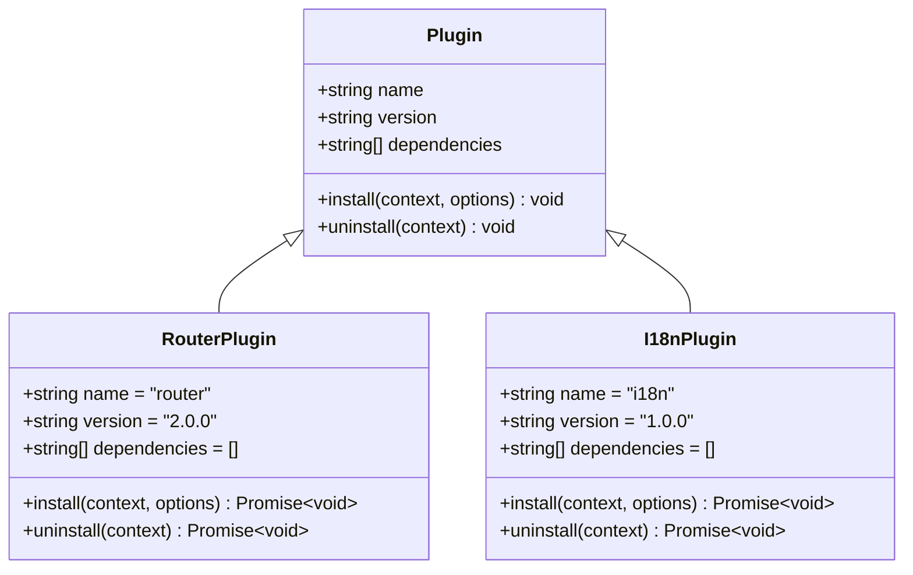
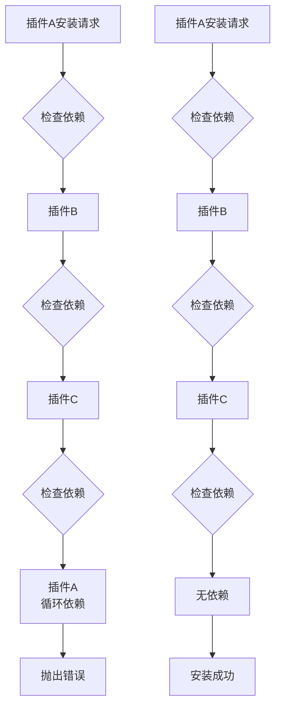
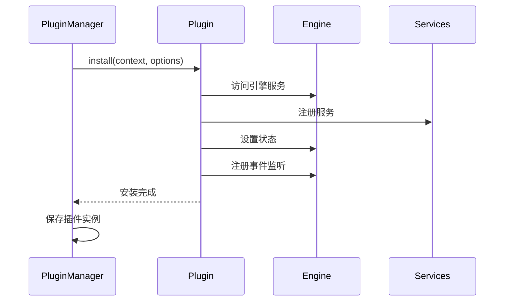
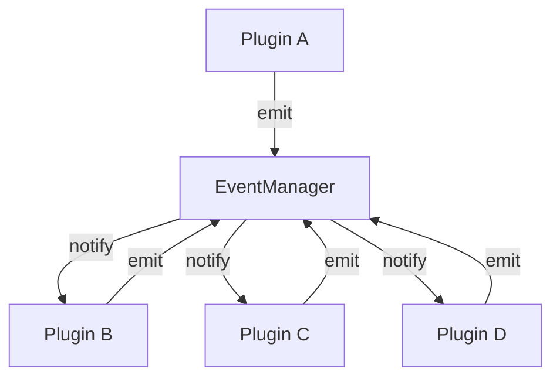

# 插件开发最佳实践

<cite>
**本文档中引用的文件**
- [define-plugin.ts](file://packages/core/src/plugin/define-plugin.ts)
- [plugin-manager.ts](file://packages/core/src/plugin/plugin-manager.ts)
- [plugin-api-registry.ts](file://packages/core/src/plugin/plugin-api-registry.ts)
- [plugin.ts](file://packages/core/src/types/plugin.ts)
- [plugin-api.ts](file://packages/core/src/types/plugin-api.ts)
- [engine.ts](file://packages/core/src/types/engine.ts)
- [router-plugin.ts](file://packages/vue3/src/plugins/router-plugin.ts)
- [i18n-plugin.ts](file://packages/vue3/src/plugins/i18n-plugin.ts)
- [event-manager.ts](file://packages/core/src/event/event-manager.ts)
- [state-manager.ts](file://packages/core/src/state/state-manager.ts)
- [core-engine.test.ts](file://packages/core/src/__tests__/core-engine.test.ts)
- [PluginDemo.vue](file://packages/vue3/example/src/components/PluginDemo.vue)
</cite>

## 目录
1. [概述](#概述)
2. [插件设计原则](#插件设计原则)
3. [API设计规范](#api设计规范)
4. [依赖管理](#依赖管理)
5. [生命周期集成](#生命周期集成)
6. [插件选项设计](#插件选项设计)
7. [服务注册最佳实践](#服务注册最佳实践)
8. [事件监听合理使用](#事件监听合理使用)
9. [插件间通信模式](#插件间通信模式)
10. [类型安全插件开发](#类型安全插件开发)
11. [可测试性设计](#可测试性设计)
12. [文档化要求](#文档化要求)
13. [性能考虑](#性能考虑)
14. [故障排除指南](#故障排除指南)

## 概述

engine框架提供了一套完整的插件系统，支持模块化扩展、依赖管理和生命周期控制。本最佳实践文档旨在帮助开发者设计高质量、可维护的插件，确保插件间的良好协作和系统的稳定性。

### 核心特性

- **类型安全**：完整的TypeScript类型定义
- **依赖管理**：自动检测和解决插件依赖关系
- **生命周期控制**：完整的插件安装、卸载和热重载支持
- **事件系统**：基于发布-订阅模式的插件间通信
- **状态管理**：统一的状态访问和监听机制
- **API注册**：插件间API调用的安全接口

## 插件设计原则

### 1. 单一职责原则

每个插件应该专注于一个明确的功能领域，避免功能过于复杂或职责过多。



**图表来源**
- [plugin.ts](file://packages/core/src/types/plugin.ts#L40-L51)
- [router-plugin.ts](file://packages/vue3/src/plugins/router-plugin.ts#L60-L65)
- [i18n-plugin.ts](file://packages/vue3/src/plugins/i18n-plugin.ts#L38-L43)

### 2. 开放封闭原则

插件应该对扩展开放，对修改封闭。通过配置和事件系统实现功能扩展，而不是修改现有代码。

### 3. 依赖倒置原则

高层插件不应该依赖低层插件的具体实现，而是依赖抽象接口。通过插件API注册表实现松耦合通信。

### 4. 接口隔离原则

提供最小化的插件接口，只暴露必要的方法和属性。避免过度设计和不必要的复杂性。

**章节来源**
- [plugin.ts](file://packages/core/src/types/plugin.ts#L40-L51)
- [plugin-api.ts](file://packages/core/src/types/plugin-api.ts#L12-L275)

## API设计规范

### 1. 插件接口定义

使用`definePlugin`辅助函数创建插件，确保类型安全和一致性。

```typescript
// 推荐的插件定义方式
export const myPlugin = definePlugin({
  name: 'my-plugin',
  version: '1.0.0',
  dependencies: ['dependency-plugin'],
  install(context, options) {
    // 插件安装逻辑
  },
  uninstall(context) {
    // 插件卸载逻辑
  }
})
```

### 2. 配置选项设计

插件配置应该具有良好的默认值，并提供清晰的类型定义。

```typescript
// 插件配置接口
export interface MyPluginConfig {
  enabled?: boolean
  timeout?: number
  retryCount?: number
  debug?: boolean
  [key: string]: any
}

// 使用配置的插件
export function createMyPlugin(config: MyPluginConfig = {}) {
  return definePlugin({
    name: 'my-plugin',
    version: '1.0.0',
    install(ctx, options) {
      const finalConfig = {
        enabled: true,
        timeout: 5000,
        retryCount: 3,
        debug: false,
        ...config,
        ...options
      }
      
      // 使用配置
    }
  })
}
```

### 3. 错误处理规范

插件应该提供适当的错误处理和用户友好的错误信息。

```typescript
async install(ctx: PluginContext, options?: any) {
  try {
    // 插件安装逻辑
    await this.initializePlugin(ctx, options)
  } catch (error) {
    console.error(`[${this.name}] 安装失败:`, error)
    throw new Error(`插件 ${this.name} 安装失败: ${error.message}`)
  }
}
```

**章节来源**
- [define-plugin.ts](file://packages/core/src/plugin/define-plugin.ts#L15-L28)
- [router-plugin.ts](file://packages/vue3/src/plugins/router-plugin.ts#L17-L47)
- [i18n-plugin.ts](file://packages/vue3/src/plugins/i18n-plugin.ts#L11-L31)

## 依赖管理

### 1. 依赖声明

在插件定义中明确声明所需的依赖项，系统会自动检测和安装依赖。

```typescript
export const myPlugin = definePlugin({
  name: 'my-plugin',
  version: '1.0.0',
  dependencies: [
    'core-plugin',      // 必需的基础插件
    'utility-plugin@^2.0' // 版本约束的插件
  ],
  install(context, options) {
    // 依赖已自动安装
    const corePlugin = context.engine.plugins.get('core-plugin')
    // 使用依赖插件的功能
  }
})
```

### 2. 循环依赖检测

系统会自动检测循环依赖并阻止插件安装，避免无限递归问题。



**图表来源**
- [plugin-manager.ts](file://packages/core/src/plugin/plugin-manager.ts#L101-L106)

### 3. 版本兼容性

支持语义化版本控制，允许插件声明版本兼容性要求。

```typescript
export const myPlugin = definePlugin({
  name: 'my-plugin',
  version: '2.1.0',
  dependencies: [
    'core-plugin@^1.0',     // 兼容1.x版本
    'utility-plugin@>=2.0'  // 至少2.0版本
  ]
})
```

**章节来源**
- [plugin-manager.ts](file://packages/core/src/plugin/plugin-manager.ts#L112-L143)

## 生命周期集成

### 1. 安装阶段

插件安装是插件生命周期的第一个阶段，负责初始化和资源分配。



**图表来源**
- [plugin-manager.ts](file://packages/core/src/plugin/plugin-manager.ts#L122-L124)

### 2. 卸载阶段

插件卸载应该清理所有资源，包括事件监听器、定时器和服务注册。

```typescript
export const myPlugin = definePlugin({
  name: 'my-plugin',
  version: '1.0.0',
  install(context, options) {
    this.cleanupListeners = []
    
    // 注册事件监听器
    const cleanup = context.engine.events.on('app:destroy', () => {
      this.cleanup(context)
    })
    this.cleanupListeners.push(cleanup)
  },
  
  uninstall(context) {
    this.cleanup(context)
  },
  
  cleanup(context) {
    // 清理所有资源
    this.cleanupListeners.forEach(unsubscribe => unsubscribe())
    this.cleanupListeners = []
    
    // 清理状态
    context.engine.state.delete('my-plugin-state')
    
    // 移除服务注册
    context.container?.unregister('my-service')
  }
})
```

### 3. 热重载支持

支持插件的热重载，无需重启整个应用即可更新插件代码。

```typescript
export const myPlugin = definePlugin({
  name: 'my-plugin',
  version: '1.0.0',
  install(context, options) {
    // 安装逻辑
  },
  
  uninstall(context) {
    // 清理逻辑
  }
})

// 热重载支持
const pluginManager = createPluginManager({ engine: coreEngine })
await pluginManager.hotReload('my-plugin', newMyPlugin)
```

**章节来源**
- [plugin-manager.ts](file://packages/core/src/plugin/plugin-manager.ts#L168-L208)
- [plugin-manager.ts](file://packages/core/src/plugin/plugin-manager.ts#L370-L448)

## 插件选项设计

### 1. 类型安全的配置

使用TypeScript接口定义插件配置，提供完整的类型提示和验证。

```typescript
// 定义插件配置接口
export interface MyPluginConfig {
  /** 是否启用插件 */
  enabled?: boolean
  
  /** 超时时间（毫秒） */
  timeout?: number
  
  /** 重试次数 */
  retryCount?: number
  
  /** 调试模式 */
  debug?: boolean
  
  /** 自定义配置 */
  [key: string]: any
}

// 使用配置的插件
export function createMyPlugin(config: MyPluginConfig = {}) {
  return definePlugin({
    name: 'my-plugin',
    version: '1.0.0',
    install(ctx, options) {
      // 合并配置，提供默认值
      const finalConfig = {
        enabled: true,
        timeout: 5000,
        retryCount: 3,
        debug: false,
        ...config,
        ...options
      }
      
      // 类型安全地使用配置
      if (finalConfig.enabled) {
        this.setupService(finalConfig.timeout)
      }
    }
  })
}
```

### 2. 配置验证

实现配置验证逻辑，确保插件接收到有效的配置参数。

```typescript
function validateConfig(config: MyPluginConfig): MyPluginConfig {
  if (config.timeout && config.timeout < 100) {
    console.warn('timeout太小，建议至少100ms')
  }
  
  if (config.retryCount && config.retryCount > 10) {
    console.warn('retryCount过大，建议不超过10次')
  }
  
  return config
}

export function createMyPlugin(config: MyPluginConfig = {}) {
  return definePlugin({
    name: 'my-plugin',
    version: '1.0.0',
    install(ctx, options) {
      const validatedConfig = validateConfig({
        enabled: true,
        timeout: 5000,
        retryCount: 3,
        debug: false,
        ...config,
        ...options
      })
      
      // 使用验证后的配置
    }
  })
}
```

### 3. 配置继承和覆盖

支持配置的继承和覆盖机制，允许用户灵活定制插件行为。

```typescript
export function createMyPlugin(defaultConfig: MyPluginConfig = {}) {
  return function(config: MyPluginConfig = {}) {
    // 配置继承：默认配置 -> 用户配置 -> 选项参数
    return definePlugin({
      name: 'my-plugin',
      version: '1.0.0',
      install(ctx, options) {
        const finalConfig = {
          ...defaultConfig,
          ...config,
          ...options
        }
        
        // 使用最终配置
      }
    })
  }
}

// 使用示例
const myPlugin = createMyPlugin({ debug: true })
await engine.use(myPlugin({ timeout: 10000 }))
```

**章节来源**
- [router-plugin.ts](file://packages/vue3/src/plugins/router-plugin.ts#L17-L47)
- [i18n-plugin.ts](file://packages/vue3/src/plugins/i18n-plugin.ts#L11-L31)

## 服务注册最佳实践

### 1. 服务容器集成

利用服务容器实现依赖注入和服务管理。

```typescript
export const myPlugin = definePlugin({
  name: 'my-plugin',
  version: '1.0.0',
  install(context, options) {
    const { container } = context
    
    // 注册单例服务
    container.singleton('my-service', new MyService())
    
    // 注册工厂服务
    container.singleton('my-factory', () => new MyService())
    
    // 解析服务
    const myService = container.resolve<MyService>('my-service')
  }
})
```

### 2. 服务生命周期管理

确保服务的正确创建和销毁，避免内存泄漏。

```typescript
export const myPlugin = definePlugin({
  name: 'my-plugin',
  version: '1.0.0',
  install(context, options) {
    this.services = new Map()
    
    // 注册服务
    const service = new MyService()
    this.services.set('my-service', service)
    
    // 注册到容器
    context.container?.singleton('my-service', service)
  },
  
  uninstall(context) {
    // 清理所有服务
    this.services.forEach(service => {
      if (service.cleanup) {
        service.cleanup()
      }
    })
    this.services.clear()
    
    // 从容器中移除
    context.container?.unregister('my-service')
  }
})
```

### 3. 服务发现和依赖解析

实现服务发现机制，支持动态依赖解析。

```typescript
export const myPlugin = definePlugin({
  name: 'my-plugin',
  version: '1.0.0',
  install(context, options) {
    // 注册服务提供者
    context.container?.singleton('service-provider', {
      provide: (id: string) => {
        switch (id) {
          case 'database':
            return this.createDatabaseService()
          case 'cache':
            return this.createCacheService()
          default:
            return null
        }
      }
    })
  }
})
```

**章节来源**
- [i18n-plugin.ts](file://packages/vue3/src/plugins/i18n-plugin.ts#L89-L98)

## 事件监听合理使用

### 1. 事件监听器管理

正确管理事件监听器的生命周期，避免内存泄漏。

```typescript
export const myPlugin = definePlugin({
  name: 'my-plugin',
  version: '1.0.0',
  install(context, options) {
    this.listeners = new Map()
    
    // 监听应用事件
    const appCreatedListener = context.engine.events.on('app:created', () => {
      this.handleAppCreated()
    })
    this.listeners.set('app:created', appCreatedListener)
    
    // 监听插件事件
    const pluginEventListener = context.engine.events.on(
      'my-plugin:event', 
      (payload) => this.handlePluginEvent(payload)
    )
    this.listeners.set('my-plugin:event', pluginEventListener)
  },
  
  uninstall(context) {
    // 清理所有监听器
    this.listeners.forEach(listener => listener())
    this.listeners.clear()
  }
})
```

### 2. 事件命名规范

使用命名空间前缀避免事件名称冲突。

```typescript
// 推荐的事件命名规范
const EventKeys = {
  // 应用级别事件
  APP_CREATED: 'app:created',
  APP_DESTROYED: 'app:destroyed',
  
  // 插件级别事件
  MY_PLUGIN_READY: 'my-plugin:ready',
  MY_PLUGIN_ERROR: 'my-plugin:error',
  
  // 通用业务事件
  DATA_UPDATED: 'data:updated',
  USER_ACTION: 'user:action'
} as const
```

### 3. 事件负载类型安全

为每个事件定义明确的负载类型，提供完整的类型提示。

```typescript
// 事件负载类型映射
export interface EventPayloadMap {
  [EventKeys.MY_PLUGIN_READY]: { 
    pluginName: string 
    timestamp: number 
  }
  
  [EventKeys.MY_PLUGIN_ERROR]: { 
    error: Error 
    context: string 
  }
  
  [EventKeys.DATA_UPDATED]: { 
    dataType: string 
    data: any 
    timestamp: number 
  }
}

// 类型安全的事件监听
context.engine.events.on(
  EventKeys.MY_PLUGIN_READY, 
  (payload: EventPayloadMap[EventKeys.MY_PLUGIN_READY]) => {
    console.log(`插件就绪: ${payload.pluginName}`)
  }
)
```

### 4. 一次性事件监听

对于只需要触发一次的事件，使用`once`方法避免手动清理。

```typescript
export const myPlugin = definePlugin({
  name: 'my-plugin',
  version: '1.0.0',
  install(context, options) {
    // 使用一次性监听器
    context.engine.events.once('app:ready', () => {
      this.initializeOnAppReady()
    })
    
    // 使用模式匹配监听
    context.engine.events.on('data:*', (payload) => {
      this.handleDataEvent(payload)
    })
  }
})
```

**章节来源**
- [event-manager.ts](file://packages/core/src/event/event-manager.ts#L100-L169)
- [plugin.ts](file://packages/core/src/types/plugin.ts#L127-L216)

## 插件间通信模式

### 1. 事件系统通信

使用事件系统实现插件间的松耦合通信。



**图表来源**
- [event-manager.ts](file://packages/core/src/event/event-manager.ts#L100-L169)

### 2. 插件API注册表通信

通过插件API注册表实现类型安全的插件间调用。

```typescript
// 定义插件API接口
export interface MyPluginAPI extends PluginAPI {
  name: 'my-plugin'
  
  // API方法
  doSomething(data: any): Promise<void>
  getData(): Promise<any>
  getStatus(): string
}

// 注册插件API
export const myPlugin = definePlugin({
  name: 'my-plugin',
  version: '1.0.0',
  install(context, options) {
    const api: MyPluginAPI = {
      name: 'my-plugin',
      version: '1.0.0',
      
      async doSomething(data) {
        // 执行操作
        await this.processData(data)
      },
      
      async getData() {
        return this.currentData
      },
      
      getStatus() {
        return this.status
      }
    }
    
    // 注册API
    context.engine.api.register(api)
  }
})

// 其他插件调用API
export const anotherPlugin = definePlugin({
  name: 'another-plugin',
  version: '1.0.0',
  dependencies: ['my-plugin'],
  install(context, options) {
    // 获取API
    const myPluginApi = context.engine.api.get('my-plugin') as MyPluginAPI
    
    if (myPluginApi) {
      // 调用API
      await myPluginApi.doSomething({ data: 'test' })
    }
  }
})
```

### 3. 共享状态通信

使用状态管理系统实现插件间的数据共享。

```typescript
// 插件A设置共享状态
export const pluginA = definePlugin({
  name: 'plugin-a',
  version: '1.0.0',
  install(context, options) {
    // 设置共享状态
    context.engine.state.set('shared-data', { 
      source: 'plugin-a', 
      timestamp: Date.now() 
    })
  }
})

// 插件B监听共享状态
export const pluginB = definePlugin({
  name: 'plugin-b',
  version: '1.0.0',
  install(context, options) {
    // 监听状态变化
    const unsubscribe = context.engine.state.watch('shared-data', (newValue, oldValue) => {
      if (newValue.source === 'plugin-a') {
        this.handleSharedData(newValue)
      }
    })
    
    // 清理监听器
    return () => unsubscribe()
  }
})
```

### 4. 通信模式选择指南

| 场景 | 推荐模式 | 原因 |
|------|----------|------|
| 简单通知 | 事件系统 | 松耦合，易于维护 |
| 数据共享 | 共享状态 | 类型安全，集中管理 |
| 功能调用 | 插件API | 类型安全，接口明确 |
| 复杂交互 | 组合模式 | 结合多种模式的优势 |

**章节来源**
- [plugin-api-registry.ts](file://packages/core/src/plugin/plugin-api-registry.ts#L15-L191)
- [plugin-api.ts](file://packages/core/src/types/plugin-api.ts#L12-L275)
- [state-manager.ts](file://packages/core/src/state/state-manager.ts#L187-L204)

## 类型安全插件开发

### 1. 完整的类型定义

为插件提供完整的TypeScript类型定义。

```typescript
// 插件上下文类型
export interface MyPluginContext extends PluginContext {
  /** 类型化的状态访问 */
  typedState?: TypedStateAccess
  
  /** 类型化的事件访问 */
  typedEvents?: TypedEventAccess
  
  /** 插件特定的服务 */
  services: {
    myService: MyService
    logger: LoggerService
  }
}

// 插件配置类型
export interface MyPluginConfig {
  enabled: boolean
  timeout: number
  retryCount: number
  debug: boolean
}

// 插件API类型
export interface MyPluginAPI extends PluginAPI {
  name: 'my-plugin'
  version: '1.0.0'
  
  doWork(data: any): Promise<void>
  getStatus(): string
  getConfig(): MyPluginConfig
}

// 插件类型
export interface MyPlugin extends Plugin<MyPluginConfig> {
  name: 'my-plugin'
  version: '1.0.0'
  install: (context: MyPluginContext, options?: MyPluginConfig) => Promise<void>
  uninstall?: (context: MyPluginContext) => Promise<void>
}
```

### 2. 类型推断和智能提示

利用TypeScript的类型推断功能提供智能提示。

```typescript
// 使用类型推断
export function createMyPlugin(config: MyPluginConfig = {}) {
  return definePlugin({
    name: 'my-plugin',
    version: '1.0.0',
    install(context, options) {
      // options自动推断为MyPluginConfig类型
      const finalConfig = {
        enabled: true,
        timeout: 5000,
        retryCount: 3,
        debug: false,
        ...config,
        ...options
      }
      
      // context自动推断为MyPluginContext类型
      if (context.typedState) {
        context.typedState.set('my-key', 'value')
        const value = context.typedState.get('my-key')
      }
    }
  })
}
```

### 3. 类型安全的事件处理

为事件处理器提供类型安全的参数和返回值。

```typescript
// 事件负载类型
export interface MyEventPayload {
  type: 'success' | 'error' | 'warning'
  message: string
  data?: any
  timestamp: number
}

// 类型安全的事件监听
context.engine.events.on('my-event', (payload: MyEventPayload) => {
  switch (payload.type) {
    case 'success':
      console.log('成功:', payload.message)
      break
    case 'error':
      console.error('错误:', payload.message)
      break
    case 'warning':
      console.warn('警告:', payload.message)
      break
  }
})
```

### 4. 泛型插件设计

使用泛型提高插件的灵活性和可重用性。

```typescript
// 泛型插件接口
export interface GenericPlugin<T = any> extends Plugin {
  name: string
  version: string
  install(context: PluginContext, options?: T): Promise<void>
  uninstall?(context: PluginContext): Promise<void>
}

// 泛型插件工厂
export function createGenericPlugin<T>(config: {
  name: string
  version: string
  install: (context: PluginContext, options?: T) => Promise<void>
  uninstall?: (context: PluginContext) => Promise<void>
}): GenericPlugin<T> {
  return definePlugin(config)
}

// 使用泛型插件
const numberPlugin = createGenericPlugin<number>({
  name: 'number-plugin',
  version: '1.0.0',
  install(context, options) {
    // options自动推断为number类型
    console.log('数字插件安装，配置:', options)
  }
})
```

**章节来源**
- [plugin.ts](file://packages/core/src/types/plugin.ts#L336-L344)
- [plugin-api.ts](file://packages/core/src/types/plugin-api.ts#L12-L275)

## 可测试性设计

### 1. 测试友好的插件结构

设计易于测试的插件结构，支持依赖注入和模拟。

```typescript
// 测试友好的插件设计
export class MyPlugin {
  private services: Map<string, any> = new Map()
  
  constructor(private config: MyPluginConfig = {}) {}
  
  async install(context: PluginContext): Promise<void> {
    // 注入服务（便于测试）
    this.services.set('logger', context.logger || console)
    this.services.set('httpClient', new HttpClient())
    
    // 安装逻辑
    await this.setupServices(context)
  }
  
  async uninstall(context: PluginContext): Promise<void> {
    // 清理逻辑
    await this.cleanupServices()
    this.services.clear()
  }
  
  // 测试辅助方法
  getService<T>(key: string): T | undefined {
    return this.services.get(key) as T | undefined
  }
}

// 测试适配器
export function createTestPlugin(config: MyPluginConfig = {}) {
  return new MyPlugin(config)
}
```

### 2. 单元测试示例

提供完整的单元测试示例。

```typescript
import { describe, it, expect, vi } from 'vitest'
import { createTestPlugin } from './my-plugin'

describe('MyPlugin', () => {
  it('应该正确安装', async () => {
    const plugin = createTestPlugin({ enabled: true })
    const context = {
      logger: { log: vi.fn(), error: vi.fn() },
      httpClient: { get: vi.fn() }
    }
    
    await plugin.install(context)
    
    expect(plugin.getService('logger')).toBeDefined()
    expect(plugin.getService('httpClient')).toBeDefined()
  })
  
  it('应该正确卸载', async () => {
    const plugin = createTestPlugin()
    const context = {
      logger: { log: vi.fn(), error: vi.fn() }
    }
    
    await plugin.install(context)
    await plugin.uninstall(context)
    
    expect(plugin.getService('logger')).toBeUndefined()
  })
  
  it('应该正确处理配置', async () => {
    const plugin = createTestPlugin({ timeout: 1000 })
    const context = { logger: { log: vi.fn() } }
    
    await plugin.install(context)
    
    // 验证配置被正确应用
    expect(plugin.getService('httpClient')).toBeDefined()
  })
})
```

### 3. 集成测试策略

实现插件间的集成测试。

```typescript
describe('插件集成测试', () => {
  it('插件A应该能够触发插件B的事件', async () => {
    const engine = createCoreEngine({ debug: false })
    
    // 安装插件
    await engine.use(createPluginA())
    await engine.use(createPluginB())
    
    // 触发事件
    await engine.events.emitAsync('plugin-a:event')
    
    // 验证结果
    expect(pluginBHandlerCalled).toBe(true)
  })
})
```

### 4. 模拟和存根

使用模拟库创建测试替身。

```typescript
import { vi } from 'vitest'

// 模拟HTTP客户端
const mockHttpClient = {
  get: vi.fn(),
  post: vi.fn(),
  put: vi.fn(),
  delete: vi.fn()
}

// 模拟日志服务
const mockLogger = {
  log: vi.fn(),
  error: vi.fn(),
  warn: vi.fn(),
  info: vi.fn()
}

// 使用模拟服务的测试
it('应该使用模拟服务', async () => {
  const plugin = createTestPlugin()
  
  // 注入模拟服务
  plugin.services.set('httpClient', mockHttpClient)
  plugin.services.set('logger', mockLogger)
  
  await plugin.install(mockContext)
  
  // 验证模拟调用
  expect(mockHttpClient.get).toHaveBeenCalledWith('/api/data')
  expect(mockLogger.log).toHaveBeenCalledWith('插件已安装')
})
```

**章节来源**
- [core-engine.test.ts](file://packages/core/src/__tests__/core-engine.test.ts#L1-334)

## 文档化要求

### 1. API文档规范

为插件提供完整的API文档。

```typescript
/**
 * 我的插件
 * 
 * 提供XXX功能的插件，支持YYY配置选项。
 * 
 * @module my-plugin
 * 
 * @example
 * ```typescript
 * import { createMyPlugin } from '@my-org/my-plugin'
 * 
 * const plugin = createMyPlugin({
 *   enabled: true,
 *   timeout: 5000,
 *   debug: false
 * })
 * 
 * await engine.use(plugin)
 * ```
 * 
 * @category 插件
 * @since 1.0.0
 */
export function createMyPlugin(config: MyPluginConfig = {}): Plugin<MyPluginConfig> {
  /**
   * 插件配置接口
   * 
   * @property {boolean} enabled - 是否启用插件
   * @property {number} timeout - 超时时间（毫秒）
   * @property {number} retryCount - 重试次数
   * @property {boolean} debug - 调试模式
   */
  interface MyPluginConfig {
    enabled?: boolean
    timeout?: number
    retryCount?: number
    debug?: boolean
  }
  
  return definePlugin({
    name: 'my-plugin',
    version: '1.0.0',
    install(context, options) {
      // 插件实现
    }
  })
}
```

### 2. 使用示例

提供清晰的使用示例和最佳实践。

```typescript
/**
 * 基本使用示例
 * 
 * ```typescript
 * import { createMyPlugin } from '@my-org/my-plugin'
 * 
 * // 基本配置
 * const basicPlugin = createMyPlugin()
 * await engine.use(basicPlugin)
 * 
 * // 完整配置
 * const advancedPlugin = createMyPlugin({
 *   enabled: true,
 *   timeout: 10000,
 *   retryCount: 5,
 *   debug: true
 * })
 * await engine.use(advancedPlugin)
 * ```
 * 
 * @example
 * ```typescript
 * // 错误处理示例
 * try {
 *   await engine.use(plugin)
 * } catch (error) {
 *   console.error('插件安装失败:', error)
 * }
 * ```
 */
```

### 3. 配置参考

提供详细的配置选项参考。

| 配置项 | 类型 | 默认值 | 描述 |
|--------|------|--------|------|
| `enabled` | `boolean` | `true` | 是否启用插件 |
| `timeout` | `number` | `5000` | 超时时间（毫秒） |
| `retryCount` | `number` | `3` | 重试次数 |
| `debug` | `boolean` | `false` | 调试模式 |

### 4. 故障排除指南

提供常见问题的解决方案。

```markdown
## 故障排除

### 插件安装失败

**问题**: 插件安装时抛出错误

**可能原因**:
1. 依赖插件未安装
2. 配置参数无效
3. 权限不足

**解决方案**:
1. 检查依赖关系：`engine.plugins.getDependencyTree('plugin-name')`
2. 验证配置参数
3. 检查运行环境权限

### 插件功能异常

**问题**: 插件功能无法正常工作

**诊断步骤**:
1. 启用调试模式：`debug: true`
2. 检查插件状态：`engine.state.keys()`
3. 查看错误日志
```

## 性能考虑

### 1. 延迟加载

实现插件的延迟加载，减少启动时间。

```typescript
export const myPlugin = definePlugin({
  name: 'my-plugin',
  version: '1.0.0',
  install(context, options) {
    // 延迟加载重型资源
    setTimeout(() => {
      this.loadHeavyResources()
    }, 0)
  }
})
```

### 2. 内存管理

注意内存使用，避免内存泄漏。

```typescript
export const myPlugin = definePlugin({
  name: 'my-plugin',
  version: '1.0.0',
  install(context, options) {
    this.resources = new WeakMap()
    
    // 使用WeakMap避免内存泄漏
    const resource = new HeavyResource()
    this.resources.set(this, resource)
  },
  
  uninstall(context) {
    // 清理资源
    this.resources.clear()
  }
})
```

### 3. 批量操作优化

使用批量操作减少频繁的状态更新。

```typescript
export const myPlugin = definePlugin({
  name: 'my-plugin',
  version: '1.0.0',
  install(context, options) {
    // 批量更新优化
    context.engine.state.batch(() => {
      context.engine.state.set('batch-key-1', value1)
      context.engine.state.set('batch-key-2', value2)
      context.engine.state.set('batch-key-3', value3)
    })
  }
})
```

### 4. 事件监听优化

合理使用事件监听，避免过度监听。

```typescript
export const myPlugin = definePlugin({
  name: 'my-plugin',
  version: '1.0.0',
  install(context, options) {
    // 使用once避免重复监听
    context.engine.events.once('app:ready', () => {
      this.initialize()
    })
    
    // 使用模式匹配减少监听器数量
    context.engine.events.on('data:*', (payload) => {
      this.handleDataEvent(payload)
    })
  }
})
```

**章节来源**
- [state-manager.ts](file://packages/core/src/state/state-manager.ts#L229-L250)
- [event-manager.ts](file://packages/core/src/event/event-manager.ts#L100-L169)

## 故障排除指南

### 1. 常见问题及解决方案

| 问题 | 症状 | 解决方案 |
|------|------|----------|
| 插件依赖冲突 | 插件安装失败，提示依赖错误 | 检查依赖声明，确保版本兼容性 |
| 内存泄漏 | 应用内存持续增长 | 检查事件监听器清理，使用WeakMap |
| 性能问题 | 应用响应缓慢 | 优化批量操作，减少频繁状态更新 |
| 类型错误 | TypeScript编译失败 | 检查类型定义，确保类型安全 |

### 2. 调试技巧

```typescript
// 启用调试模式
const engine = createCoreEngine({ debug: true })

// 检查插件状态
console.log('已安装插件:', engine.plugins.getAll().map(p => p.name))
console.log('插件依赖树:', engine.plugins.getDependencyTree('my-plugin'))

// 监控事件
engine.events.on('*', (event, payload) => {
  console.log('事件:', event, payload)
})

// 监控状态变化
engine.state.watch('*', (newValue, oldValue) => {
  console.log('状态变化:', newValue, oldValue)
})
```

### 3. 性能监控

```typescript
export const myPlugin = definePlugin({
  name: 'my-plugin',
  version: '1.0.0',
  install(context, options) {
    // 性能监控
    const startTime = performance.now()
    
    // 插件逻辑
    await this.performOperation()
    
    const endTime = performance.now()
    console.log(`插件执行时间: ${endTime - startTime}ms`)
  }
})
```

### 4. 错误处理最佳实践

```typescript
export const myPlugin = definePlugin({
  name: 'my-plugin',
  version: '1.0.0',
  install(context, options) {
    try {
      // 主要逻辑
      await this.initialize(context, options)
    } catch (error) {
      // 错误处理
      console.error(`[${this.name}] 初始化失败:`, error)
      
      // 发送错误事件
      context.engine.events.emit('plugin:error', {
        plugin: this.name,
        error: error.message,
        stack: error.stack
      })
      
      // 抛出错误以便上层处理
      throw error
    }
  }
})
```

**章节来源**
- [plugin-manager.ts](file://packages/core/src/plugin/plugin-manager.ts#L136-L140)
- [core-engine.test.ts](file://packages/core/src/__tests__/core-engine.test.ts#L80-L91)

## 结论

engine框架的插件系统提供了强大而灵活的扩展能力。遵循本最佳实践文档中的指导原则，可以帮助开发者创建高质量、可维护和可扩展的插件。关键要点包括：

1. **设计原则**: 遵循SOLID原则，确保插件的单一职责和高内聚低耦合
2. **类型安全**: 充分利用TypeScript类型系统，提供完整的类型定义和智能提示
3. **生命周期管理**: 正确处理插件的安装、卸载和热重载
4. **依赖管理**: 明确声明依赖关系，避免循环依赖
5. **事件通信**: 使用事件系统实现插件间的松耦合通信
6. **性能优化**: 注意内存管理和性能优化
7. **测试驱动**: 编写全面的单元测试和集成测试
8. **文档完善**: 提供清晰的API文档和使用示例

通过遵循这些最佳实践，可以构建出稳定、高效且易于维护的插件系统，为应用提供强大的扩展能力。