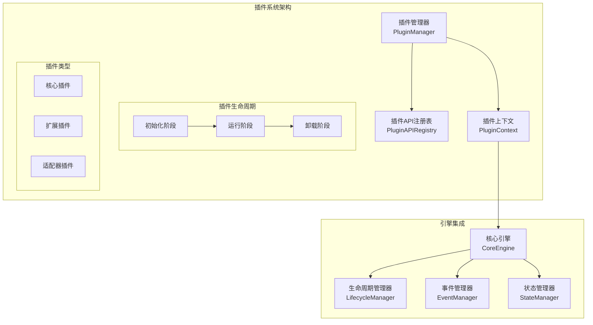
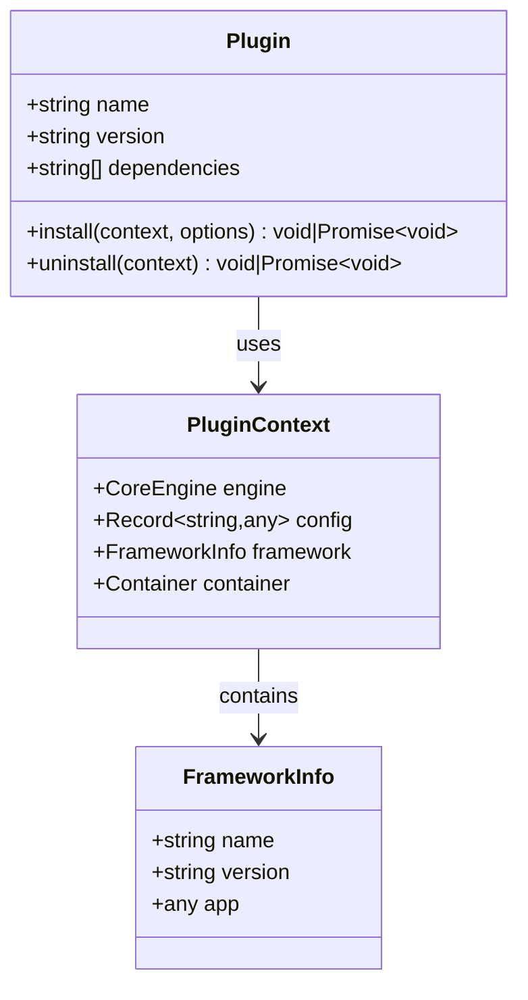
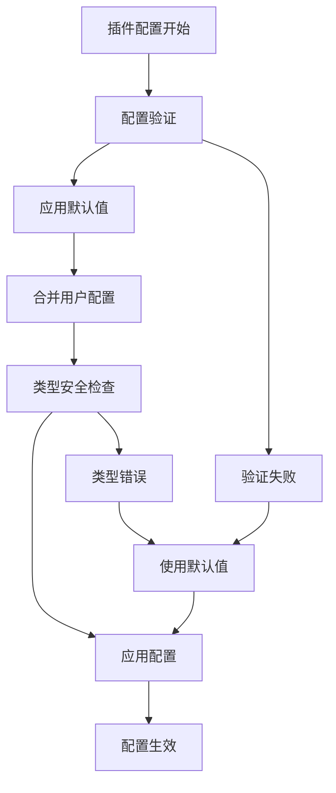
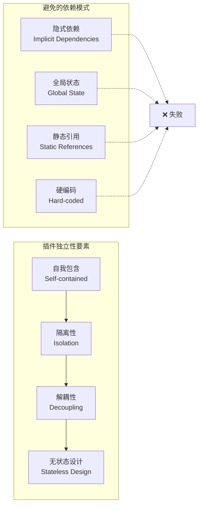
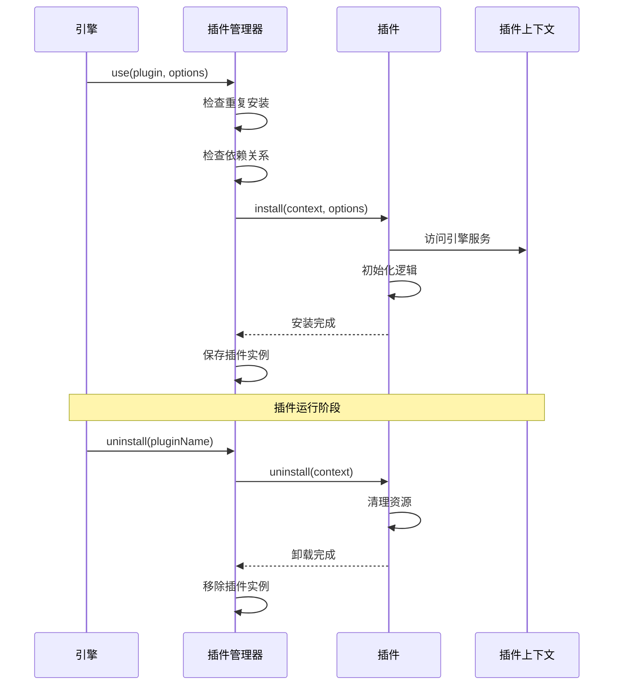
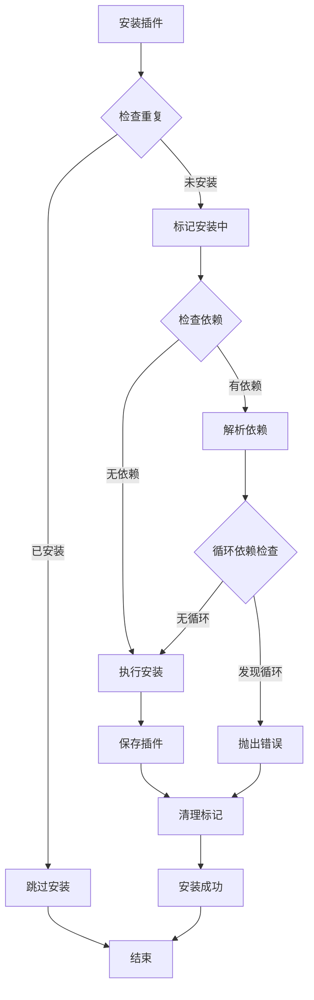
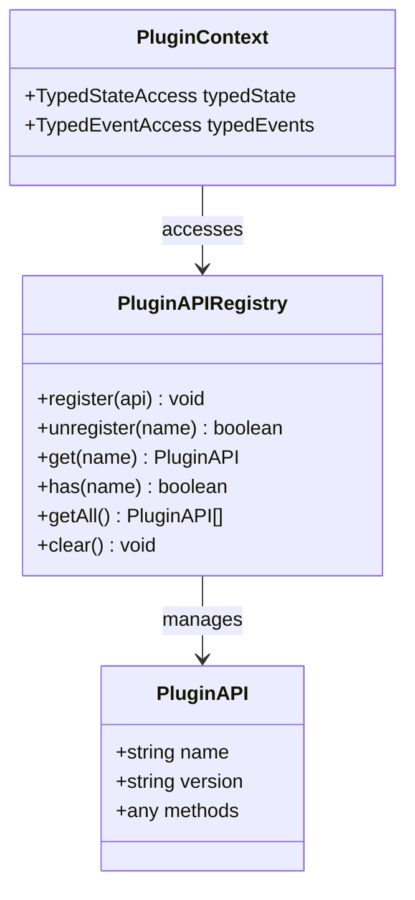

# 插件设计原则

<cite>
**本文档中引用的文件**
- [define-plugin.ts](file://packages/core/src/plugin/define-plugin.ts)
- [plugin.ts](file://packages/core/src/types/plugin.ts)
- [plugin-manager.ts](file://packages/core/src/plugin/plugin-manager.ts)
- [plugin-api-registry.ts](file://packages/core/src/plugin/plugin-api-registry.ts)
- [i18n-plugin.ts](file://packages/vue3/src/plugins/i18n-plugin.ts)
- [router-plugin.ts](file://packages/vue3/src/plugins/router-plugin.ts)
- [lifecycle-manager.ts](file://packages/core/src/lifecycle/lifecycle-manager.ts)
- [core-engine.ts](file://packages/core/src/engine/core-engine.ts)
</cite>

## 目录
1. [引言](#引言)
2. [插件架构概览](#插件架构概览)
3. [插件元信息设计](#插件元信息设计)
4. [插件可配置性设计](#插件可配置性设计)
5. [插件独立性与可复用性](#插件独立性与可复用性)
6. [插件生命周期管理](#插件生命周期管理)
7. [插件依赖管理](#插件依赖管理)
8. [插件间通信机制](#插件间通信机制)
9. [最佳实践指南](#最佳实践指南)
10. [总结](#总结)

## 引言

engine框架采用高度模块化的插件架构，通过精心设计的插件系统实现功能的解耦和扩展。本文档深入阐述了插件的设计原则，重点说明如何构建高内聚、低耦合的插件模块，并提供完整的最佳实践指导。

插件系统的核心设计理念包括：
- **高内聚**：插件内部功能紧密关联，职责单一明确
- **低耦合**：插件之间松散耦合，避免隐式依赖
- **类型安全**：通过TypeScript提供完整的类型安全保障
- **生命周期管理**：完整的插件生命周期控制和资源管理
- **可配置性**：灵活的配置选项和默认值处理

## 插件架构概览

engine框架的插件系统采用分层架构设计，包含以下核心组件：

**图表来源**
- [plugin-manager.ts](file://packages/core/src/plugin/plugin-manager.ts#L42-L530)
- [plugin-api-registry.ts](file://packages/core/src/plugin/plugin-api-registry.ts#L60-L191)
- [core-engine.ts](file://packages/core/src/engine/core-engine.ts#L75-L200)

**章节来源**
- [plugin-manager.ts](file://packages/core/src/plugin/plugin-manager.ts#L1-L50)
- [plugin-api-registry.ts](file://packages/core/src/plugin/plugin-api-registry.ts#L1-L50)

## 插件元信息设计

### 核心元信息结构

插件的元信息设计遵循清晰的结构化原则，确保插件的可识别性和可管理性：

**图表来源**
- [plugin.ts](file://packages/core/src/types/plugin.ts#L37-L51)
- [plugin.ts](file://packages/core/src/types/plugin.ts#L21-L35)

### 元信息最佳实践

#### 1. 插件名称规范
- 使用清晰、描述性的名称
- 避免使用特殊字符和空格
- 推荐使用kebab-case命名法
- 包含功能领域标识符

#### 2. 版本管理策略
- 遵循语义化版本控制（SemVer）
- 明确版本号格式（主版本.次版本.修订版本）
- 提供详细的变更日志
- 支持向后兼容性检查

#### 3. 依赖声明规范
- 明确声明直接依赖
- 避免循环依赖
- 使用精确的版本范围
- 提供依赖版本兼容性说明

**章节来源**
- [plugin.ts](file://packages/core/src/types/plugin.ts#L37-L51)
- [define-plugin.ts](file://packages/core/src/plugin/define-plugin.ts#L15-L28)

## 插件可配置性设计

### 结构化配置定义

插件的可配置性设计通过严格的类型定义和默认值处理实现：

**图表来源**
- [i18n-plugin.ts](file://packages/vue3/src/plugins/i18n-plugin.ts#L47-L61)
- [router-plugin.ts](file://packages/vue3/src/plugins/router-plugin.ts#L74-L77)

### 配置选项设计原则

#### 1. 类型安全的配置接口
- 使用TypeScript接口定义配置结构
- 提供完整的类型推导
- 支持配置的自动补全
- 包含配置项的详细文档

#### 2. 默认值处理策略
- 提供合理的默认值
- 支持配置的渐进式覆盖
- 避免硬编码的默认值
- 支持环境变量配置

#### 3. 配置验证机制
- 运行时配置验证
- 类型安全的配置检查
- 提供清晰的错误信息
- 支持配置的热更新

**章节来源**
- [i18n-plugin.ts](file://packages/vue3/src/plugins/i18n-plugin.ts#L11-L31)
- [router-plugin.ts](file://packages/vue3/src/plugins/router-plugin.ts#L15-L47)

## 插件独立性与可复用性

### 独立性设计原则

插件的独立性是确保系统稳定性和可维护性的关键：

**图表来源**
- [i18n-plugin.ts](file://packages/vue3/src/plugins/i18n-plugin.ts#L44-L163)
- [router-plugin.ts](file://packages/vue3/src/plugins/router-plugin.ts#L60-L129)

### 可复用性实现策略

#### 1. 无状态设计
- 避免在插件中保存全局状态
- 使用上下文传递必要的状态
- 支持多实例运行
- 提供状态的外部管理

#### 2. 依赖注入模式
- 通过插件上下文获取依赖
- 避免直接依赖外部模块
- 支持服务容器集成
- 提供依赖的可替换性

#### 3. 接口抽象
- 定义清晰的插件接口
- 支持多种实现方式
- 提供插件间的标准化通信
- 支持插件的组合使用

**章节来源**
- [i18n-plugin.ts](file://packages/vue3/src/plugins/i18n-plugin.ts#L44-L98)
- [router-plugin.ts](file://packages/vue3/src/plugins/router-plugin.ts#L66-L95)

## 插件生命周期管理

### 生命周期钩子设计

插件的生命周期管理通过精心设计的钩子系统实现：

**图表来源**
- [plugin-manager.ts](file://packages/core/src/plugin/plugin-manager.ts#L92-L143)
- [plugin-manager.ts](file://packages/core/src/plugin/plugin-manager.ts#L168-L207)

### 生命周期管理最佳实践

#### 1. 初始化顺序控制
- 确保依赖插件先于被依赖插件安装
- 提供初始化优先级控制
- 支持异步初始化流程
- 处理初始化失败的情况

#### 2. 资源清理策略
- 实现完整的资源清理机制
- 支持优雅的卸载过程
- 避免资源泄漏
- 提供清理状态的反馈

#### 3. 错误处理机制
- 实现错误隔离和恢复
- 提供详细的错误信息
- 支持插件的故障转移
- 维护系统的稳定性

**章节来源**
- [plugin-manager.ts](file://packages/core/src/plugin/plugin-manager.ts#L92-L143)
- [plugin-manager.ts](file://packages/core/src/plugin/plugin-manager.ts#L168-L207)
- [lifecycle-manager.ts](file://packages/core/src/lifecycle/lifecycle-manager.ts#L173-L209)

## 插件依赖管理

### 依赖解析机制

插件管理器实现了复杂的依赖解析和管理机制：

**图表来源**
- [plugin-manager.ts](file://packages/core/src/plugin/plugin-manager.ts#L92-L143)
- [plugin-manager.ts](file://packages/core/src/plugin/plugin-manager.ts#L297-L315)

### 依赖管理最佳实践

#### 1. 依赖声明规范
- 明确声明所有直接依赖
- 使用精确的版本要求
- 避免不必要的依赖
- 提供依赖的用途说明

#### 2. 循环依赖检测
- 实现循环依赖检测算法
- 提供清晰的错误信息
- 支持依赖图的可视化
- 提供解决建议

#### 3. 版本兼容性管理
- 支持版本范围声明
- 实现兼容性检查
- 提供版本升级指导
- 支持向后兼容性测试

**章节来源**
- [plugin-manager.ts](file://packages/core/src/plugin/plugin-manager.ts#L297-L315)
- [plugin-manager.ts](file://packages/core/src/plugin/plugin-manager.ts#L318-L335)

## 插件间通信机制

### API注册表设计

插件间通信通过API注册表实现类型安全的跨插件调用：

**图表来源**
- [plugin-api-registry.ts](file://packages/core/src/plugin/plugin-api-registry.ts#L14-L48)
- [plugin.ts](file://packages/core/src/types/plugin.ts#L336-L342)

### 通信机制最佳实践

#### 1. 类型安全的API设计
- 使用TypeScript接口定义API
- 提供完整的类型推导
- 支持API的版本管理
- 实现API的向后兼容性

#### 2. 状态共享机制
- 使用状态管理器共享数据
- 提供类型安全的状态访问
- 支持状态的变化监听
- 实现状态的命名空间隔离

#### 3. 事件驱动通信
- 使用事件系统进行异步通信
- 提供类型安全的事件定义
- 支持事件的命名空间
- 实现事件的过滤和路由

**章节来源**
- [plugin-api-registry.ts](file://packages/core/src/plugin/plugin-api-registry.ts#L60-L191)
- [plugin.ts](file://packages/core/src/types/plugin.ts#L336-L342)

## 最佳实践指南

### 插件开发最佳实践

#### 1. 设计原则
- **单一职责**：每个插件专注于单一功能领域
- **最小依赖**：只依赖必要的外部库和插件
- **可测试性**：设计易于单元测试的插件结构
- **文档完善**：提供完整的使用文档和示例

#### 2. 实现规范
- 使用`definePlugin`函数创建插件
- 实现完整的类型定义
- 提供合理的默认配置
- 实现优雅的错误处理

#### 3. 测试策略
- 编写单元测试覆盖核心功能
- 实现集成测试验证插件交互
- 提供端到端测试场景
- 使用模拟和存根进行测试隔离

### 插件部署和维护

#### 1. 版本管理
- 遵循语义化版本控制
- 维护详细的变更日志
- 提供迁移指南
- 支持向后兼容性

#### 2. 性能优化
- 实现懒加载机制
- 优化初始化时间
- 减少内存占用
- 提供性能监控

#### 3. 社区贡献
- 提供清晰的贡献指南
- 维护活跃的Issue跟踪
- 支持Pull Request流程
- 建立社区交流渠道

**章节来源**
- [define-plugin.ts](file://packages/core/src/plugin/define-plugin.ts#L15-L28)
- [i18n-plugin.ts](file://packages/vue3/src/plugins/i18n-plugin.ts#L38-L164)
- [router-plugin.ts](file://packages/vue3/src/plugins/router-plugin.ts#L60-L129)

## 总结

engine框架的插件设计体现了现代软件架构的最佳实践，通过以下核心原则实现了高质量的插件系统：

### 关键设计优势

1. **类型安全**：完整的TypeScript类型定义确保编译时和运行时的安全性
2. **生命周期管理**：完善的插件生命周期控制和资源管理机制
3. **依赖管理**：智能的依赖解析和循环依赖检测
4. **可配置性**：灵活的配置系统和默认值处理
5. **可复用性**：独立的插件设计和标准化的接口

### 设计原则总结

- **高内聚**：插件内部功能紧密关联，职责单一明确
- **低耦合**：插件之间松散耦合，避免隐式依赖
- **模块化**：清晰的模块边界和接口定义
- **可扩展**：支持插件的动态加载和卸载
- **可维护**：良好的代码组织和文档支持

### 未来发展方向

插件系统将继续演进，重点关注：
- 更好的热重载支持
- 更丰富的插件生态
- 更强的性能优化
- 更完善的开发工具

通过遵循本文档的设计原则和最佳实践，开发者可以创建高质量、可维护的插件，为engine框架构建强大的生态系统。