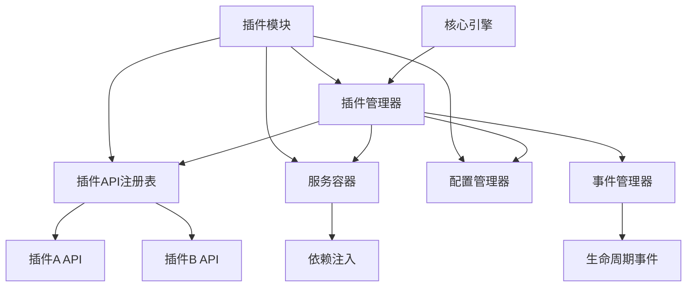
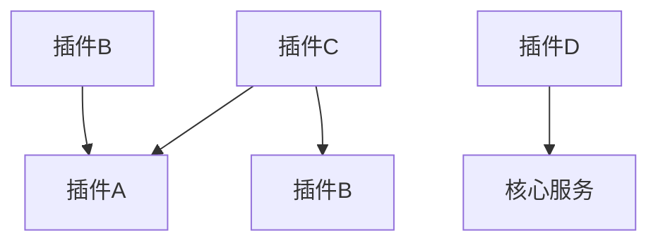
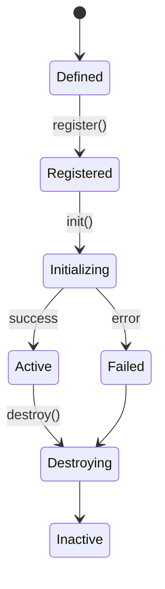
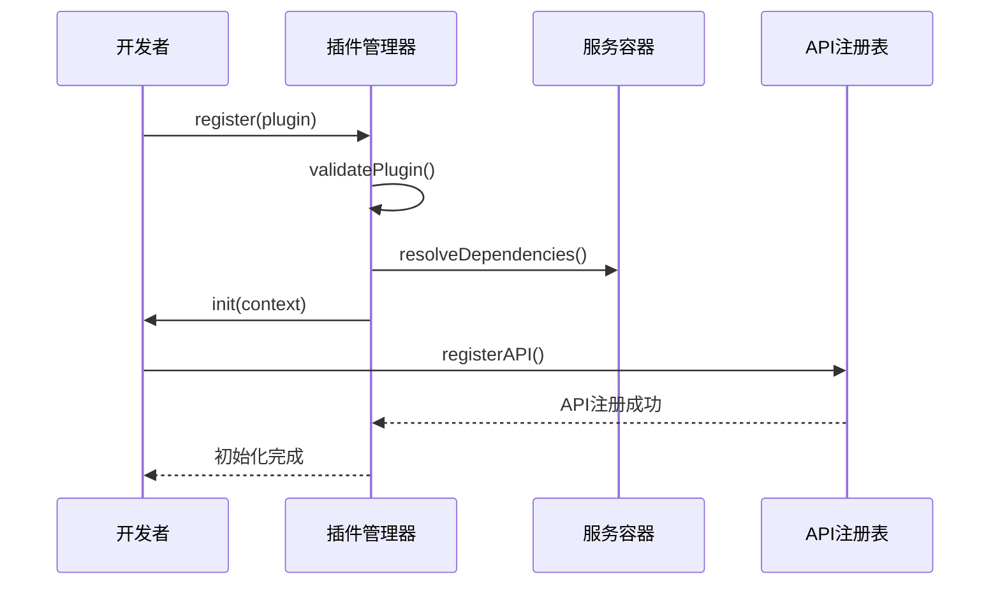

# 插件系统设计原则

<cite>
**本文档引用的文件**  
- [define-plugin.ts](file://packages/core/src/plugin/define-plugin.ts)
- [plugin-manager.ts](file://packages/core/src/plugin/plugin-manager.ts)
- [plugin-api-registry.ts](file://packages/core/src/plugin/plugin-api-registry.ts)
- [types/plugin.ts](file://packages/core/src/types/plugin.ts)
- [types/plugin-api.ts](file://packages/core/src/types/plugin-api.ts)
- [core-engine.ts](file://packages/core/src/engine/core-engine.ts)
- [service-container.ts](file://packages/core/src/container/service-container.ts)
- [config-manager.ts](file://packages/core/src/config/config-manager.ts)
</cite>

## 目录
1. [引言](#引言)
2. [插件系统架构概览](#插件系统架构概览)
3. [插件接口的可扩展性设计](#插件接口的可扩展性设计)
4. [插件依赖解析机制](#插件依赖解析机制)
5. [插件生命周期与核心引擎协同管理](#插件生命周期与核心引擎协同管理)
6. [插件注册、初始化与销毁的关键设计决策](#插件注册初始化与销毁的关键设计决策)
7. [高内聚低耦合的插件模块定义](#高内聚低耦合的插件模块定义)
8. [避免插件间强耦合的实践建议](#避免插件间强耦合的实践建议)
9. [插件热重载支持的技术实现路径与限制条件](#插件热重载支持的技术实现路径与限制条件)
10. [结论](#结论)

## 引言

插件系统是engine框架实现功能扩展和架构解耦的核心机制。通过插件化设计，框架能够在不修改核心代码的前提下，动态集成新功能、适配不同业务场景，并支持第三方开发者安全地扩展系统能力。本文将深入分析插件系统的各项设计原则，涵盖接口设计、依赖管理、生命周期控制、API暴露机制等关键方面，旨在为开发者提供清晰的插件开发指导和架构理解。

## 插件系统架构概览

**图示来源**  
- [plugin-manager.ts](file://packages/core/src/plugin/plugin-manager.ts#L1-L50)
- [plugin-api-registry.ts](file://packages/core/src/plugin/plugin-api-registry.ts#L1-L30)
- [core-engine.ts](file://packages/core/src/engine/core-engine.ts#L10-L40)

**本节来源**  
- [plugin-manager.ts](file://packages/core/src/plugin/plugin-manager.ts#L1-L100)
- [core-engine.ts](file://packages/core/src/engine/core-engine.ts#L5-L60)

## 插件接口的可扩展性设计

插件接口的设计遵循开放封闭原则，允许在不修改现有代码的情况下扩展功能。通过`PluginAPI`类型定义，每个插件可以声明其对外暴露的方法、属性和事件，同时支持版本化API以确保向后兼容性。接口采用模块化设计，允许插件按需注册特定功能模块，而非一次性暴露全部能力。

**本节来源**  
- [types/plugin-api.ts](file://packages/core/src/types/plugin-api.ts#L5-L40)
- [plugin-api-registry.ts](file://packages/core/src/plugin/plugin-api-registry.ts#L15-L60)

## 插件依赖解析机制

插件系统采用声明式依赖管理，插件在定义时通过`dependencies`字段声明其依赖的其他插件或核心服务。插件管理器在加载时构建依赖图，并使用拓扑排序确保插件按正确的顺序初始化。依赖解析支持版本约束和可选依赖，增强了系统的灵活性和容错能力。

**图示来源**  
- [plugin-manager.ts](file://packages/core/src/plugin/plugin-manager.ts#L80-L120)
- [types/plugin.ts](file://packages/core/src/types/plugin.ts#L20-L35)

**本节来源**  
- [plugin-manager.ts](file://packages/core/src/plugin/plugin-manager.ts#L50-L150)
- [types/plugin.ts](file://packages/core/src/types/plugin.ts#L10-L50)

## 插件生命周期与核心引擎协同管理

插件生命周期与核心引擎紧密协同，包含定义、注册、初始化、运行和销毁五个阶段。核心引擎通过事件机制通知插件关键生命周期节点，如`ENGINE_INIT`、`APP_BOOTSTRAP`等。插件管理器确保生命周期钩子按依赖顺序执行，并提供异常处理机制防止单个插件故障影响整体系统。

**图示来源**  
- [plugin-manager.ts](file://packages/core/src/plugin/plugin-manager.ts#L150-L200)
- [core-engine.ts](file://packages/core/src/engine/core-engine.ts#L100-L150)

**本节来源**  
- [plugin-manager.ts](file://packages/core/src/plugin/plugin-manager.ts#L100-L250)
- [core-engine.ts](file://packages/core/src/engine/core-engine.ts#L80-L200)

## 插件注册、初始化与销毁的关键设计决策

插件注册采用`definePlugin`工厂函数实现，该函数返回标准化的插件对象。初始化过程中使用依赖注入容器解析服务依赖，配置管理器注入环境配置，确保插件获取所需资源。API暴露通过注册表机制实现，插件在初始化完成后将其API注册到全局注册表，供其他插件安全调用。

**图示来源**  
- [define-plugin.ts](file://packages/core/src/plugin/define-plugin.ts#L1-L40)
- [plugin-manager.ts](file://packages/core/src/plugin/plugin-manager.ts#L200-L300)
- [plugin-api-registry.ts](file://packages/core/src/plugin/plugin-api-registry.ts#L40-L80)

**本节来源**  
- [define-plugin.ts](file://packages/core/src/plugin/define-plugin.ts#L1-L50)
- [plugin-manager.ts](file://packages/core/src/plugin/plugin-manager.ts#L150-L350)
- [service-container.ts](file://packages/core/src/container/service-container.ts#L20-L60)

## 高内聚低耦合的插件模块定义

通过`definePlugin`函数，开发者可以定义高内聚、低耦合的插件模块。插件应专注于单一职责，通过明确的API边界与其他组件交互。配置注入采用不可变对象传递，避免共享状态。建议使用接口而非具体实现进行依赖声明，增强可测试性和可替换性。

**本节来源**  
- [define-plugin.ts](file://packages/core/src/plugin/define-plugin.ts#L1-L60)
- [types/plugin.ts](file://packages/core/src/types/plugin.ts#L1-L70)

## 避免插件间强耦合的实践建议

为避免插件间强耦合，建议遵循以下实践：使用事件总线进行松耦合通信，通过API注册表进行服务发现，避免直接导入其他插件的实现文件，依赖核心服务而非具体插件，使用版本化API接口。同时，插件应尽量减少全局状态修改，通过上下文对象传递数据。

**本节来源**  
- [event-manager.ts](file://packages/core/src/event/event-manager.ts#L10-L50)
- [plugin-api-registry.ts](file://packages/core/src/plugin/plugin-api-registry.ts#L10-L40)
- [define-plugin.ts](file://packages/core/src/plugin/define-plugin.ts#L30-L60)

## 插件热重载支持的技术实现路径与限制条件

热重载通过动态卸载旧插件实例、清理其注册的API和事件监听器、释放依赖资源，然后加载新版本插件来实现。技术路径包括：维护插件实例引用、跟踪资源分配、实现优雅销毁钩子。限制条件包括：无法热重载修改了依赖关系的插件、状态持久化需插件自行处理、可能存在的内存泄漏风险需严格管理事件监听器。

**本节来源**  
- [plugin-manager.ts](file://packages/core/src/plugin/plugin-manager.ts#L300-L500)
- [lifecycle-manager.ts](file://packages/core/src/lifecycle/lifecycle-manager.ts#L15-L60)

## 结论

engine框架的插件系统通过精心设计的接口规范、依赖管理、生命周期控制和API暴露机制，实现了高度的可扩展性和松耦合性。`definePlugin`模式为开发者提供了清晰的插件定义方式，而插件管理器和相关基础设施确保了系统的稳定性和可维护性。遵循本文所述的设计原则和实践建议，开发者可以创建安全、可靠且易于维护的插件模块，充分发挥框架的扩展能力。