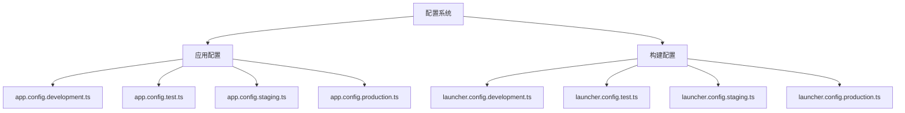
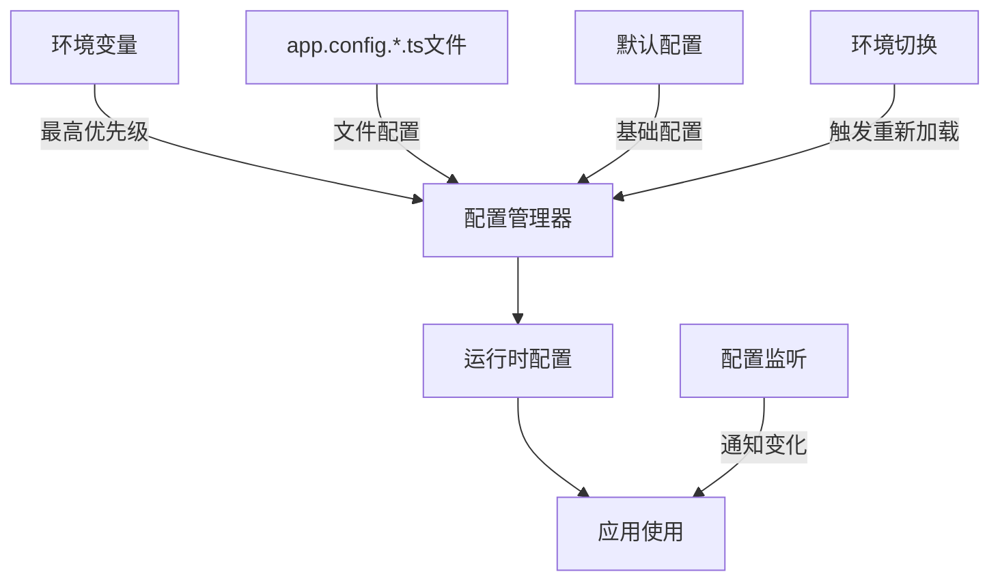
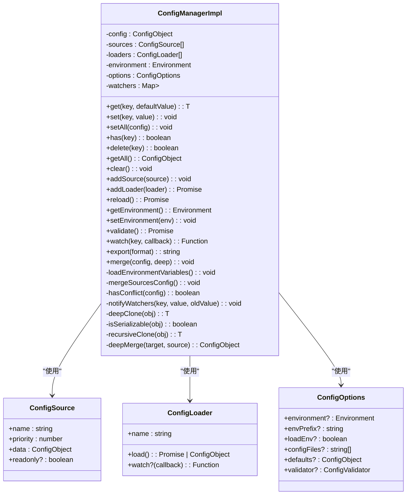
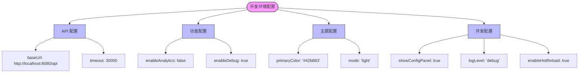
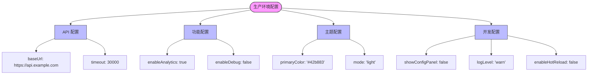
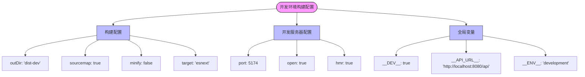
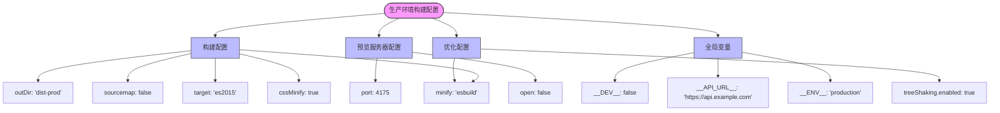
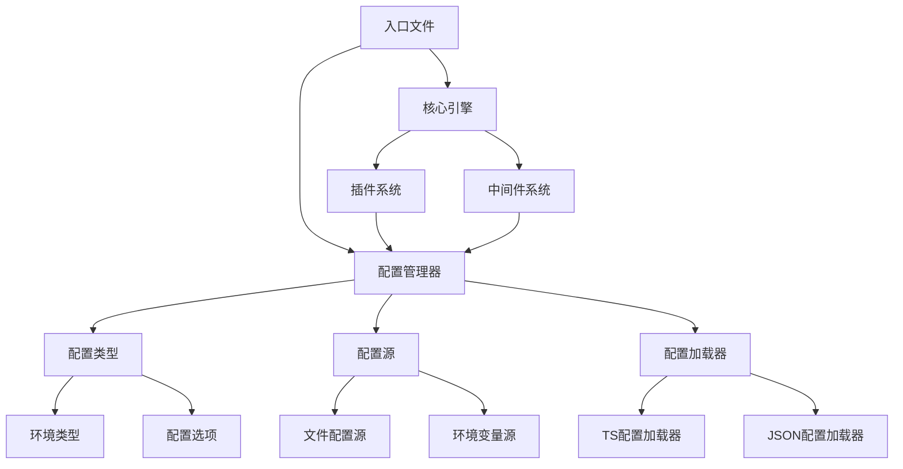

# 多环境配置策略

<cite>
**本文档引用的文件**
- [app.config.development.ts](file://packages\vue3\example\.ldesign\app.config.development.ts)
- [app.config.production.ts](file://packages\vue3\example\.ldesign\app.config.production.ts)
- [app.config.staging.ts](file://packages\vue3\example\.ldesign\app.config.staging.ts)
- [app.config.test.ts](file://packages\vue3\example\.ldesign\app.config.test.ts)
- [config-manager.ts](file://packages\core\src\config\config-manager.ts)
- [types.ts](file://packages\core\src\config\types.ts)
- [launcher.config.development.ts](file://packages\vue3\example\.ldesign\launcher.config.development.ts)
- [launcher.config.production.ts](file://packages\vue3\example\.ldesign\launcher.config.production.ts)
- [main.ts](file://packages\vue3\example\src\main.ts)
</cite>

## 目录
1. [简介](#简介)
2. [项目结构](#项目结构)
3. [核心组件](#核心组件)
4. [架构概述](#架构概述)
5. [详细组件分析](#详细组件分析)
6. [依赖分析](#依赖分析)
7. [性能考虑](#性能考虑)
8. [故障排除指南](#故障排除指南)
9. [结论](#结论)

## 简介
engine框架提供了一套完整的多环境配置管理策略，支持开发、测试、预发布和生产等不同环境的配置隔离。通过`app.config.*.ts`文件实现环境特定配置，配置管理器根据当前环境自动加载对应的配置文件。系统支持配置优先级机制，环境变量可以覆盖文件配置，并支持条件性配置加载。本文档详细说明了该配置系统的实现机制、使用方法和最佳实践。

## 项目结构
engine框架的多环境配置系统采用基于文件的配置策略，通过命名约定实现环境隔离。配置文件位于`.ldesign`目录下，使用`app.config.{environment}.ts`命名模式。

**图示来源**
- [app.config.development.ts](file://packages\vue3\example\.ldesign\app.config.development.ts)
- [app.config.production.ts](file://packages\vue3\example\.ldesign\app.config.production.ts)
- [launcher.config.development.ts](file://packages\vue3\example\.ldesign\launcher.config.development.ts)
- [launcher.config.production.ts](file://packages\vue3\example\.ldesign\launcher.config.production.ts)

**本节来源**
- [app.config.development.ts](file://packages\vue3\example\.ldesign\app.config.development.ts)
- [app.config.production.ts](file://packages\vue3\example\.ldesign\app.config.production.ts)

## 核心组件
多环境配置系统的核心是`ConfigManagerImpl`类，它负责管理配置的加载、合并、监听和环境切换。系统通过`Environment`类型定义支持多种环境，并提供灵活的配置源和加载器机制。

**本节来源**
- [config-manager.ts](file://packages\core\src\config\config-manager.ts)
- [types.ts](file://packages\core\src\config\types.ts)

## 架构概述
engine框架的多环境配置架构采用分层设计，从配置文件到运行时配置的完整流程。

**图示来源**
- [config-manager.ts](file://packages\core\src\config\config-manager.ts)
- [types.ts](file://packages\core\src\config\types.ts)

## 详细组件分析

### 配置管理器分析
`ConfigManagerImpl`是多环境配置系统的核心实现，提供完整的配置管理功能。

#### 类结构分析

**图示来源**
- [config-manager.ts](file://packages\core\src\config\config-manager.ts)
- [types.ts](file://packages\core\src\config\types.ts)

### 应用配置分析
不同环境的应用配置文件定义了环境特定的配置项，如API地址、调试功能和分析统计等。

#### 开发环境配置

**图示来源**
- [app.config.development.ts](file://packages\vue3\example\.ldesign\app.config.development.ts)

#### 生产环境配置

**图示来源**
- [app.config.production.ts](file://packages\vue3\example\.ldesign\app.config.production.ts)

### 构建配置分析
构建配置文件定义了不同环境的构建参数，如输出目录、代码压缩和sourcemap等。

#### 开发环境构建配置

**图示来源**
- [launcher.config.development.ts](file://packages\vue3\example\.ldesign\launcher.config.development.ts)

#### 生产环境构建配置

**图示来源**
- [launcher.config.production.ts](file://packages\vue3\example\.ldesign\launcher.config.production.ts)

**本节来源**
- [app.config.development.ts](file://packages\vue3\example\.ldesign\app.config.development.ts)
- [app.config.production.ts](file://packages\vue3\example\.ldesign\app.config.production.ts)
- [launcher.config.development.ts](file://packages\vue3\example\.ldesign\launcher.config.development.ts)
- [launcher.config.production.ts](file://packages\vue3\example\.ldesign\launcher.config.production.ts)

## 依赖分析
多环境配置系统依赖于多个核心组件，形成完整的配置管理链。

**图示来源**
- [config-manager.ts](file://packages\core\src\config\config-manager.ts)
- [types.ts](file://packages\core\src\config\types.ts)
- [main.ts](file://packages\vue3\example\src\main.ts)

**本节来源**
- [config-manager.ts](file://packages\core\src\config\config-manager.ts)
- [types.ts](file://packages\core\src\config\types.ts)
- [main.ts](file://packages\vue3\example\src\main.ts)

## 性能考虑
配置管理系统在设计时考虑了性能优化，特别是在配置读取和缓存方面。

- **配置缓存**：`getAll()`方法使用1秒的TTL缓存，避免频繁的深克隆操作
- **高效克隆**：优先使用`structuredClone`，降级到JSON序列化，最后使用递归克隆
- **事件通知**：使用Map存储监听器，确保O(1)的查找性能
- **配置合并**：按优先级排序配置源，确保高优先级配置覆盖低优先级配置

## 故障排除指南
在使用多环境配置系统时，可能会遇到一些常见问题：

- **环境变量不生效**：确保环境变量以`APP_`前缀开头
- **配置未更新**：调用`reload()`方法重新加载配置
- **类型错误**：检查配置文件的导出是否为默认导出
- **路径问题**：确保配置文件路径正确，特别是相对路径

**本节来源**
- [config-manager.ts](file://packages\core\src\config\config-manager.ts)
- [types.ts](file://packages\core\src\config\types.ts)

## 结论
engine框架的多环境配置策略提供了一套完整、灵活且高性能的配置管理解决方案。通过`app.config.*.ts`文件实现环境隔离，配置管理器根据当前环境自动加载对应的配置文件。系统支持配置优先级机制，环境变量可以覆盖文件配置，并支持条件性配置加载。配置重载机制确保环境切换时配置的正确性，环境变量命名规范（APP_*前缀）和环境感知的构建流程进一步增强了系统的可靠性和可维护性。