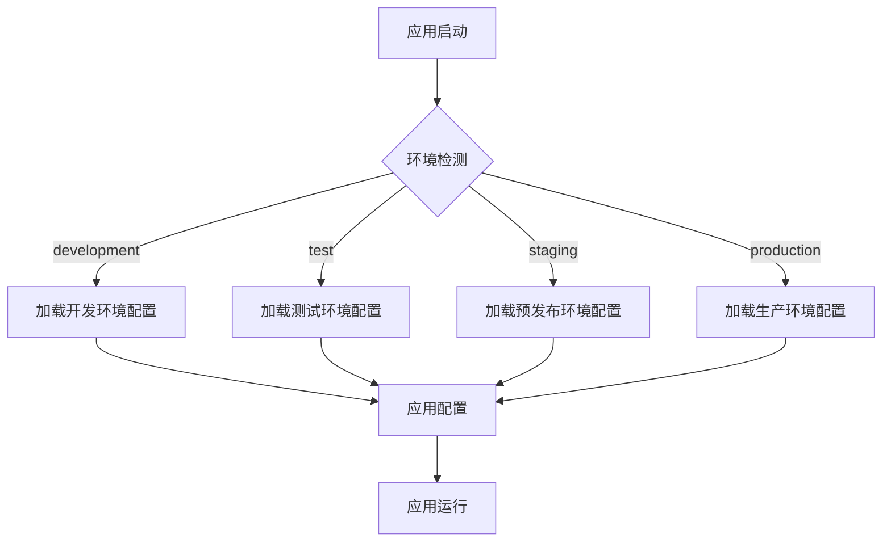
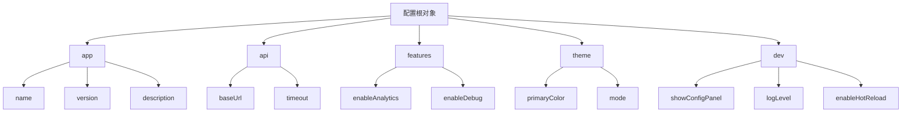
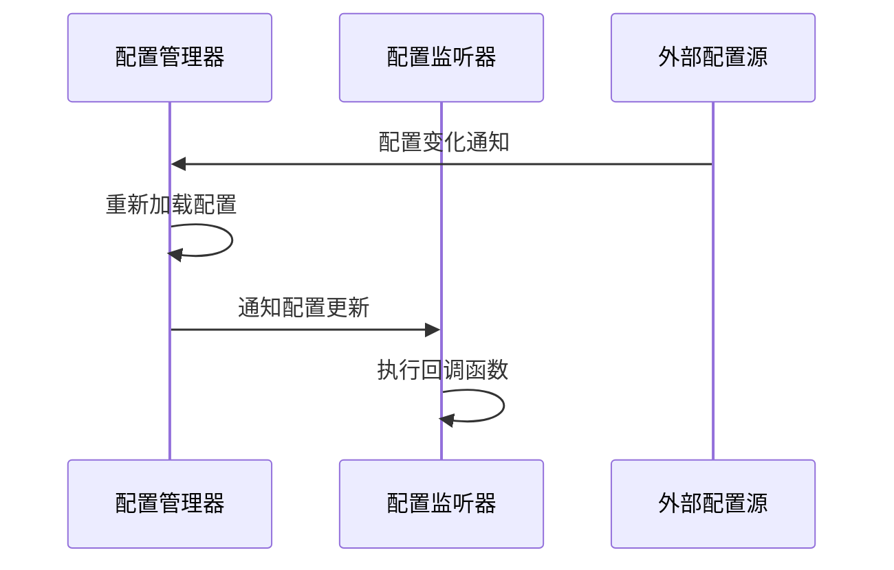
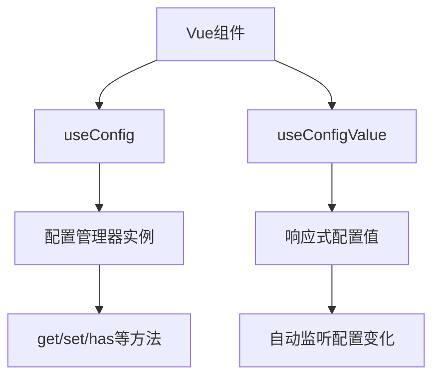

# 配置管理最佳实践

<cite>
**本文档引用的文件**  
- [config-manager.ts](file://packages/core/src/config/config-manager.ts)
- [types.ts](file://packages/core/src/config/types.ts)
- [index.ts](file://packages/core/src/config/index.ts)
- [app.config.development.ts](file://packages/vue3/example/.ldesign/app.config.development.ts)
- [app.config.production.ts](file://packages/vue3/example/.ldesign/app.config.production.ts)
- [app.config.test.ts](file://packages/vue3/example/.ldesign/app.config.test.ts)
- [app.config.staging.ts](file://packages/vue3/example/.ldesign/app.config.staging.ts)
- [use-engine.ts](file://packages/vue3/src/composables/use-engine.ts)
</cite>

## 目录
1. [多环境配置策略](#多环境配置策略)
2. [配置项组织规范](#配置项组织规范)
3. [敏感信息管理](#敏感信息管理)
4. [配置热更新机制](#配置热更新机制)
5. [配置项命名与类型安全](#配置项命名与类型安全)
6. [插件与中间件中的配置使用](#插件与中间件中的配置使用)
7. [配置管理的安全性与可维护性](#配置管理的安全性与可维护性)

## 多环境配置策略

engine框架通过`.ldesign`目录下的环境特定配置文件实现多环境配置管理。框架支持开发、测试、预发布和生产等多种环境，每种环境都有独立的配置文件，如`app.config.development.ts`、`app.config.test.ts`、`app.config.staging.ts`和`app.config.production.ts`。这些配置文件遵循统一的结构，但根据环境需求设置不同的参数值。

配置管理器会根据当前运行环境自动加载相应的配置文件，确保应用在不同环境中使用正确的配置。例如，开发环境配置`app.config.development.ts`中启用了调试功能和热重载，而生产环境配置`app.config.production.ts`则禁用了这些功能以提高性能和安全性。

**图示来源**
- [app.config.development.ts](file://packages/vue3/example/.ldesign/app.config.development.ts)
- [app.config.production.ts](file://packages/vue3/example/.ldesign/app.config.production.ts)
- [app.config.test.ts](file://packages/vue3/example/.ldesign/app.config.test.ts)
- [app.config.staging.ts](file://packages/vue3/example/.ldesign/app.config.staging.ts)

**本节来源**
- [app.config.development.ts](file://packages/vue3/example/.ldesign/app.config.development.ts#L1-L52)
- [app.config.production.ts](file://packages/vue3/example/.ldesign/app.config.production.ts#L1-L52)

## 配置项组织规范

engine框架的配置项采用分层组织结构，将相关配置项归类到不同的命名空间中，如`app`、`api`、`features`、`theme`和`dev`等。这种组织方式提高了配置的可读性和可维护性，使开发者能够快速定位和修改特定功能的配置。

配置项的组织遵循以下原则：
- **功能分组**：将相关功能的配置项归类到同一命名空间下
- **环境特定**：环境相关的配置项（如API地址、调试开关）根据环境需求设置不同值
- **默认值设置**：为重要配置项提供合理的默认值，确保应用在缺少配置时仍能正常运行
- **类型安全**：通过TypeScript接口定义配置项的类型，确保配置的类型安全

**图示来源**
- [app.config.development.ts](file://packages/vue3/example/.ldesign/app.config.development.ts)
- [types.ts](file://packages/core/src/config/types.ts)

**本节来源**
- [app.config.development.ts](file://packages/vue3/example/.ldesign/app.config.development.ts#L9-L36)
- [types.ts](file://packages/core/src/config/types.ts#L7-L187)

## 敏感信息管理

engine框架通过多种机制确保敏感信息的安全管理。首先，敏感信息（如API密钥、数据库密码等）不应直接存储在配置文件中，而应通过环境变量注入。配置管理器支持从环境变量中读取配置，前缀为`APP_`的环境变量会被自动转换为配置项。

其次，框架提供了配置验证功能，可以在应用启动时验证配置的完整性和正确性，防止因配置错误导致的安全问题。配置验证器可以检查必填字段是否存在，以及字段值是否符合预期格式。

最后，生产环境配置应禁用调试功能和详细日志输出，以减少敏感信息泄露的风险。例如，生产环境配置`app.config.production.ts`中`enableDebug`设置为`false`，`logLevel`设置为`warn`。

**本节来源**
- [config-manager.ts](file://packages/core/src/config/config-manager.ts#L100-L103)
- [app.config.production.ts](file://packages/vue3/example/.ldesign/app.config.production.ts#L23-L24)

## 配置热更新机制

engine框架支持配置的热更新，允许在应用运行时动态修改配置并立即生效。配置管理器提供了`watch`方法，可以监听特定配置项的变化，并在配置更新时执行回调函数。

配置热更新的实现基于发布-订阅模式，当配置项被修改时，配置管理器会通知所有监听该配置项的订阅者。这种机制使得插件、中间件和其他组件能够响应配置变化，动态调整其行为。

此外，配置加载器支持监听外部配置源的变化。当外部配置源（如远程配置服务器）发生变化时，加载器会通知配置管理器重新加载配置，实现真正的热更新。

**图示来源**
- [config-manager.ts](file://packages/core/src/config/config-manager.ts)
- [types.ts](file://packages/core/src/config/types.ts)

**本节来源**
- [config-manager.ts](file://packages/core/src/config/config-manager.ts#L366-L386)
- [types.ts](file://packages/core/src/config/types.ts#L168-L174)

## 配置项命名与类型安全

engine框架强调配置项的命名规范和类型安全。配置项命名应采用小写字母和连字符分隔的格式，如`api-base-url`，避免使用驼峰命名法。对于嵌套配置项，使用点号分隔路径，如`api.baseUrl`。

框架通过TypeScript接口定义了配置项的类型，确保配置的类型安全。`ConfigObject`接口定义了配置对象的基本结构，`ConfigValue`类型定义了配置值的可能类型。这些类型定义不仅提供了编译时的类型检查，还为开发者提供了清晰的配置结构文档。

配置管理器的`get`方法支持泛型参数，允许开发者指定期望的返回类型，进一步增强了类型安全。例如，`config.get<string>('api.baseUrl')`明确指定了返回值类型为字符串。

**本节来源**
- [types.ts](file://packages/core/src/config/types.ts#L7-L25)
- [config-manager.ts](file://packages/core/src/config/config-manager.ts#L113-L126)

## 插件与中间件中的配置使用

在engine框架中，插件和中间件可以通过依赖注入的方式访问配置管理器。`useConfig`组合式函数提供了在Vue组件中访问配置管理器的便捷方式，返回一个响应式的配置管理器实例。

插件和中间件可以使用`useConfigValue`函数获取响应式的配置值。该函数不仅返回当前配置值，还会监听配置变化，在配置更新时自动更新返回值。这对于需要根据配置动态调整行为的组件非常有用。

**图示来源**
- [use-engine.ts](file://packages/vue3/src/composables/use-engine.ts)

**本节来源**
- [use-engine.ts](file://packages/vue3/src/composables/use-engine.ts#L124-L171)

## 配置管理的安全性与可维护性

engine框架通过多种机制确保配置管理的安全性和可维护性。首先，配置管理器支持配置源的优先级管理，允许不同来源的配置按优先级合并，避免配置冲突。只读配置源在存在冲突时不会被覆盖，确保关键配置的安全性。

其次，框架提供了配置导出功能，可以将当前配置导出为JSON或环境变量格式，便于调试和审计。`export`方法支持多种导出格式，满足不同场景的需求。

为避免配置爆炸，框架建议将配置项按功能分组，并使用合理的默认值。对于复杂的配置结构，建议使用TypeScript接口定义配置类型，提供清晰的文档和类型检查。

最后，配置管理器的`validate`方法可以在应用启动时验证配置的完整性和正确性，防止因配置错误导致的应用故障。结合CI/CD流程，可以在部署前自动验证配置，提高部署的可靠性。

**本节来源**
- [config-manager.ts](file://packages/core/src/config/config-manager.ts#L351-L357)
- [config-manager.ts](file://packages/core/src/config/config-manager.ts#L394-L420)