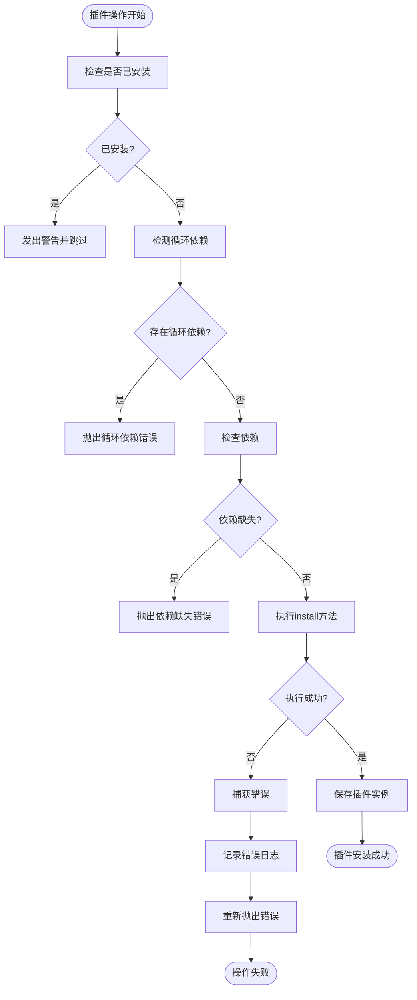
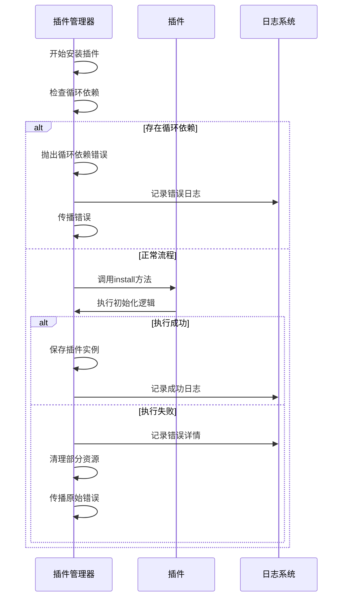
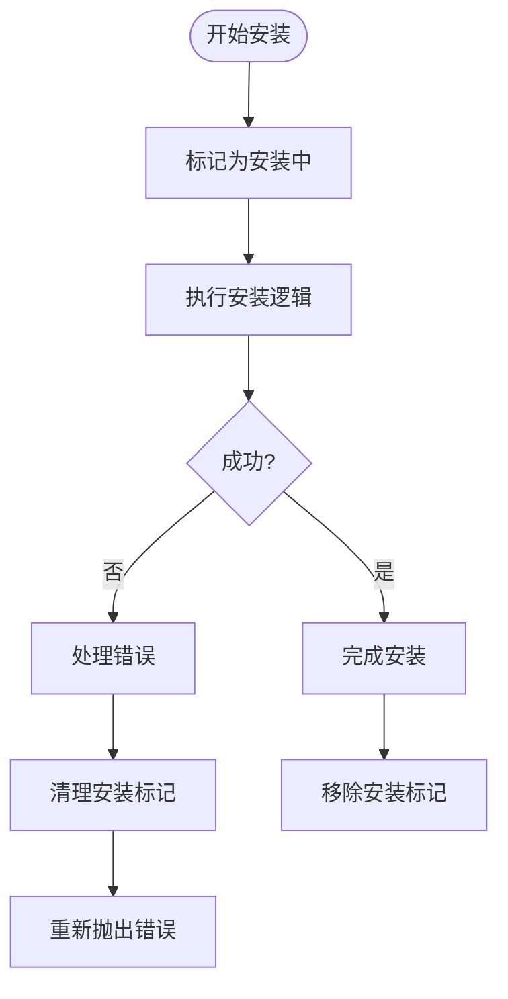

# 插件错误处理

<cite>
**本文档中引用的文件**   
- [plugin-manager.ts](file://packages/core/src/plugin/plugin-manager.ts)
- [define-plugin.ts](file://packages/core/src/plugin/define-plugin.ts)
- [plugin-api-registry.ts](file://packages/core/src/plugin/plugin-api-registry.ts)
- [plugin.ts](file://packages/core/src/types/plugin.ts)
- [i18n-plugin.ts](file://packages/vue3/src/plugins/i18n-plugin.ts)
- [router-plugin.ts](file://packages/vue3/src/plugins/router-plugin.ts)
</cite>

## 目录
1. [引言](#引言)
2. [插件错误处理机制](#插件错误处理机制)
3. [插件管理器的错误捕获与传播](#插件管理器的错误捕获与传播)
4. [资源清理与状态回滚](#资源清理与状态回滚)
5. [插件开发者的错误处理规范](#插件开发者的错误处理规范)
6. [definePlugin中的错误处理实现](#defineplugin中的错误处理实现)
7. [日志系统集成](#日志系统集成)
8. [结论](#结论)

## 引言
在engine框架中，插件系统是核心架构的重要组成部分，负责扩展框架功能和实现模块化设计。插件的稳定性直接影响整个应用的可靠性。因此，建立完善的插件错误处理机制至关重要。本文档详细说明了engine框架如何处理插件相关的各种错误，包括插件安装失败、依赖解析异常、初始化错误以及插件热重载过程中的异常处理。

**Section sources**
- [plugin-manager.ts](file://packages/core/src/plugin/plugin-manager.ts#L1-L530)
- [plugin.ts](file://packages/core/src/types/plugin.ts#L1-L344)

## 插件错误处理机制
engine框架的插件错误处理机制设计严谨，覆盖了插件生命周期的各个阶段。框架通过插件管理器（PluginManager）统一处理插件相关的错误，确保系统在遇到插件问题时能够优雅地降级或恢复。

插件错误主要分为以下几类：
- **安装失败**：插件在注册和安装过程中发生的错误
- **依赖解析异常**：插件依赖关系不满足或存在循环依赖
- **初始化错误**：插件install方法执行时抛出的异常
- **热重载异常**：插件热更新过程中发生的错误

框架通过try-catch机制捕获这些错误，并根据错误类型采取相应的处理策略，如记录日志、清理资源、状态回滚等。

**Diagram sources**
- [plugin-manager.ts](file://packages/core/src/plugin/plugin-manager.ts#L92-L143)

**Section sources**
- [plugin-manager.ts](file://packages/core/src/plugin/plugin-manager.ts#L1-L530)

## 插件管理器的错误捕获与传播
插件管理器是插件错误处理的核心组件，负责捕获、处理和传播插件相关的错误。`CorePluginManager`类实现了`PluginManager`接口，提供了完整的错误处理机制。

### 安装过程中的错误处理
在`use`方法中，插件管理器通过try-catch块捕获安装过程中的所有异常。安装流程包括检查是否已安装、检测循环依赖、验证依赖关系和执行插件的install方法。任何步骤失败都会被捕获并适当处理。

当检测到循环依赖时，框架会抛出明确的错误信息，帮助开发者快速定位问题。依赖检查失败时，会提供缺失的依赖列表，指导开发者安装必要的前置插件。

### 卸载过程中的错误处理
卸载插件时，管理器会检查是否有其他插件依赖当前插件。如果存在依赖关系且未启用强制卸载模式，会抛出详细的错误信息，防止系统进入不一致状态。卸载过程中的异常也会被捕获和记录。

### 热重载过程中的错误处理
热重载是开发环境中的重要功能，允许在不重启应用的情况下更新插件。`hotReload`方法实现了安全的热重载机制，包括错误恢复功能。如果新插件安装失败，框架会尝试恢复到旧版本，确保系统稳定性。

**Diagram sources**
- [plugin-manager.ts](file://packages/core/src/plugin/plugin-manager.ts#L92-L143)
- [plugin-manager.ts](file://packages/core/src/plugin/plugin-manager.ts#L209-L208)

**Section sources**
- [plugin-manager.ts](file://packages/core/src/plugin/plugin-manager.ts#L92-L143)
- [plugin-manager.ts](file://packages/core/src/plugin/plugin-manager.ts#L168-L208)

## 资源清理与状态回滚
engine框架在错误处理中特别注重资源清理和状态一致性，防止内存泄漏和系统状态不一致。

### 安装失败时的清理
当插件安装失败时，框架确保不会留下部分安装的状态。`installing`集合用于跟踪正在安装的插件，在finally块中总是会被清理，即使安装过程失败。

**Diagram sources**
- [plugin-manager.ts](file://packages/core/src/plugin/plugin-manager.ts#L101-L143)

### 热重载失败时的状态回滚
热重载机制包含完整的状态回滚功能。当新插件安装失败时，框架会尝试调用旧插件的install方法恢复到之前的状态。这种双重保护机制确保了系统的高可用性。

回滚过程本身也包含错误处理，如果回滚失败，会记录额外的错误信息，帮助诊断问题。这种设计体现了框架对稳定性的高度重视。

**Section sources**
- [plugin-manager.ts](file://packages/core/src/plugin/plugin-manager.ts#L389-L447)

## 插件开发者的错误处理规范
为了确保插件系统的整体稳定性，插件开发者应遵循以下错误处理规范：

### 异步初始化的错误处理
插件的install方法可能包含异步操作，应使用try-catch包裹关键逻辑，合理处理可能的异常。对于可恢复的错误，应提供重试机制或降级方案。

### 上下文信息丰富的错误对象
抛出错误时，应提供足够的上下文信息，包括错误类型、发生位置、相关参数等。这有助于快速定位和解决问题。

### 避免阻塞主流程
插件初始化不应阻塞主应用流程。对于耗时操作，应使用异步处理或提供加载状态反馈。错误处理也应是非阻塞的，确保不影响其他插件的正常加载。

### 实现uninstall方法
为了支持热重载和优雅卸载，插件应实现uninstall方法，清理所有分配的资源，如事件监听器、定时器、DOM元素等。

**Section sources**
- [plugin.ts](file://packages/core/src/types/plugin.ts#L48-L50)
- [i18n-plugin.ts](file://packages/vue3/src/plugins/i18n-plugin.ts#L1-L50)
- [router-plugin.ts](file://packages/vue3/src/plugins/router-plugin.ts#L1-L50)

## definePlugin中的错误处理实现
`definePlugin`函数是插件定义的辅助函数，虽然本身不直接处理错误，但它为插件提供了类型安全的定义方式，间接支持了错误预防。

通过类型系统，`definePlugin`确保插件对象符合`Plugin`接口定义，减少了运行时类型错误的可能性。类型检查可以在开发阶段捕获许多潜在问题，提高插件的可靠性。

插件开发者应充分利用TypeScript的类型系统，在install方法中定义清晰的参数类型和返回类型，这有助于静态分析工具发现潜在的错误。

**Section sources**
- [define-plugin.ts](file://packages/core/src/plugin/define-plugin.ts#L1-L29)
- [plugin.ts](file://packages/core/src/types/plugin.ts#L40-L51)

## 日志系统集成
engine框架的错误处理与日志系统深度集成，确保所有插件相关的错误都能被记录和追踪。

在调试模式下，插件管理器会输出详细的日志信息，包括：
- 插件安装/卸载的成功和失败状态
- 循环依赖和缺失依赖的警告
- 热重载操作的结果
- 错误堆栈信息

这些日志信息对于诊断问题和监控系统健康状况至关重要。开发者可以通过配置`debug`选项来控制日志的详细程度。

**Section sources**
- [plugin-manager.ts](file://packages/core/src/plugin/plugin-manager.ts#L138-L139)
- [plugin-manager.ts](file://packages/core/src/plugin/plugin-manager.ts#L435-L436)

## 结论
engine框架的插件错误处理机制设计全面，覆盖了插件生命周期的各个阶段。通过严格的错误捕获、资源清理、状态回滚和日志记录，框架确保了插件系统的稳定性和可维护性。

插件开发者应遵循文档中的规范，实现健壮的错误处理逻辑，充分利用框架提供的类型安全和日志功能。这种协作模式有助于构建可靠、可扩展的应用系统。