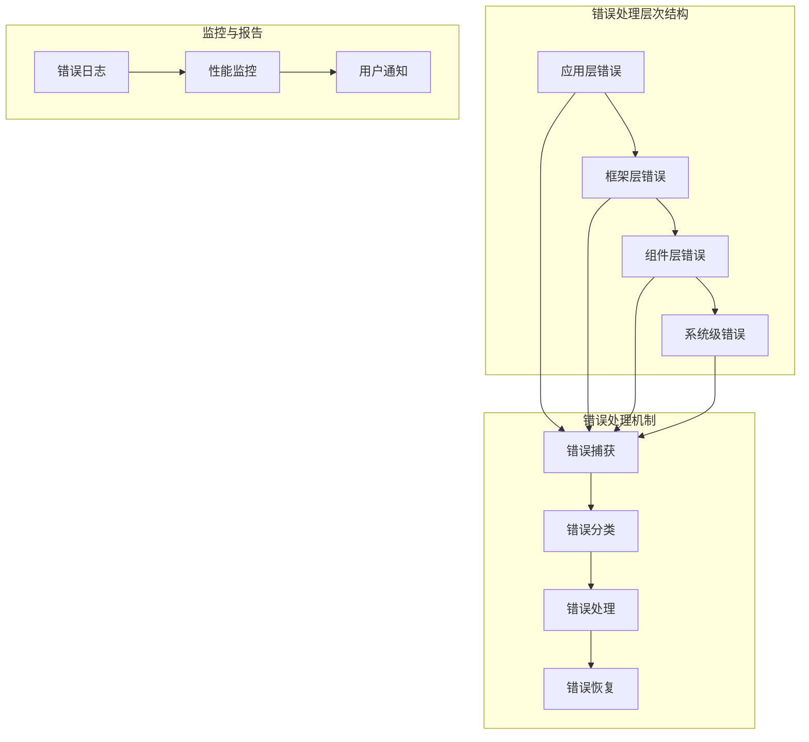
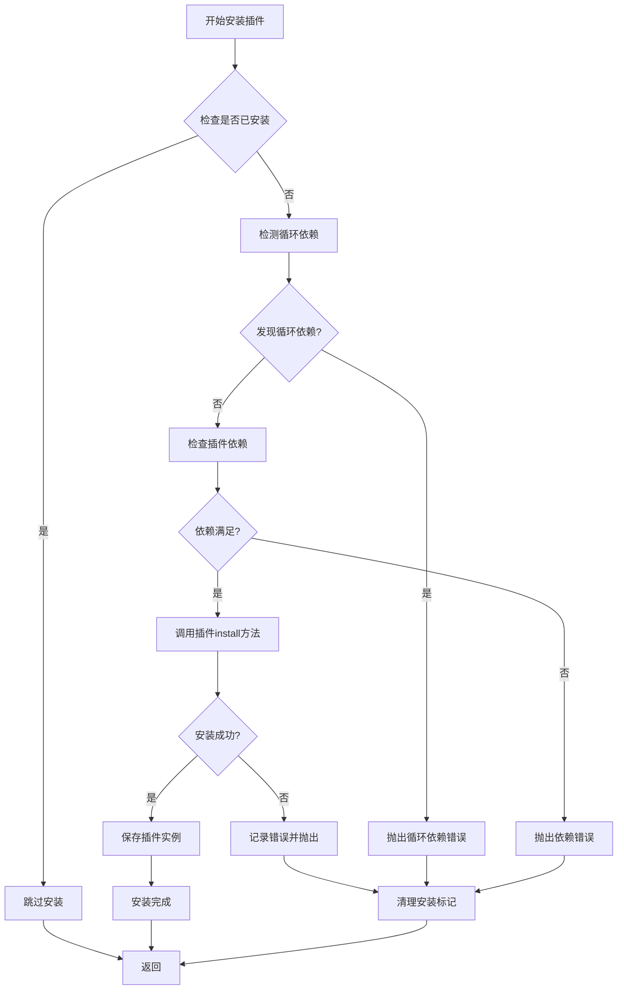
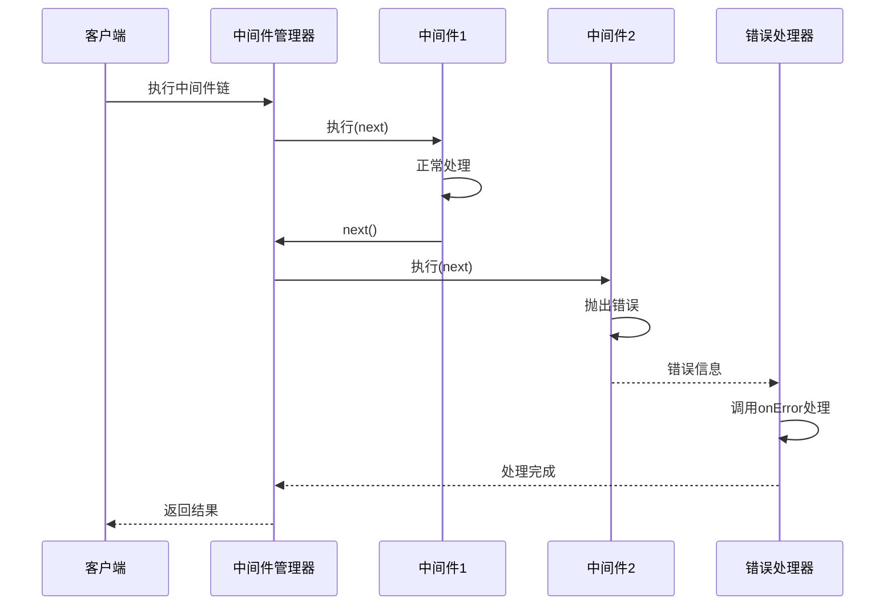
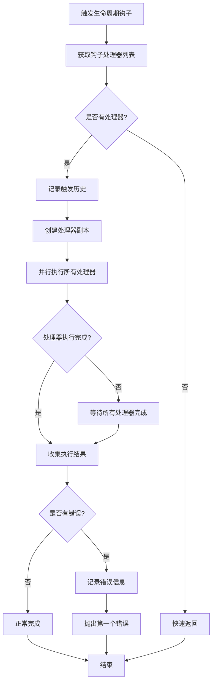
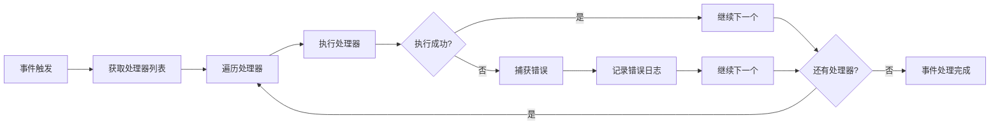
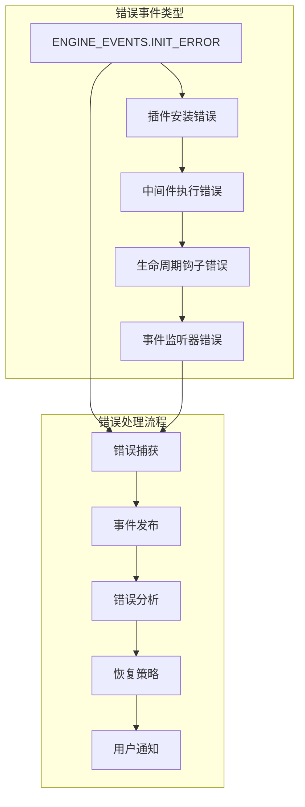

# 错误处理最佳实践

<cite>
**本文档引用的文件**
- [core-engine.ts](file://packages/core/src/engine/core-engine.ts)
- [event-manager.ts](file://packages/core/src/event/event-manager.ts)
- [middleware-manager.ts](file://packages/core/src/middleware/middleware-manager.ts)
- [plugin-manager.ts](file://packages/core/src/plugin/plugin-manager.ts)
- [lifecycle-manager.ts](file://packages/core/src/lifecycle/lifecycle-manager.ts)
- [events.ts](file://packages/core/src/constants/events.ts)
- [i18n-plugin.ts](file://packages/vue3/src/plugins/i18n-plugin.ts)
- [router-plugin.ts](file://packages/vue3/src/plugins/router-plugin.ts)
- [core-engine.test.ts](file://packages/core/src/__tests__/core-engine.test.ts)
- [engine.ts](file://packages/core/src/types/engine.ts)
- [middleware.ts](file://packages/core/src/types/middleware.ts)
</cite>

## 目录
1. [概述](#概述)
2. [框架错误处理架构](#框架错误处理架构)
3. [插件安装失败处理](#插件安装失败处理)
4. [中间件执行异常处理](#中间件执行异常处理)
5. [生命周期钩子错误处理](#生命周期钩子错误处理)
6. [事件监听器异常处理](#事件监听器异常处理)
7. [全局错误监控与处理](#全局错误监控与处理)
8. [插件和中间件开发规范](#插件和中间件开发规范)
9. [错误日志记录最佳实践](#错误日志记录最佳实践)
10. [故障排除指南](#故障排除指南)

## 概述

engine框架提供了一套完整的错误处理机制，涵盖了插件安装、中间件执行、生命周期钩子和事件监听器等各个层面。框架采用分层错误处理策略，确保单个组件的错误不会影响整个系统的稳定性。

### 核心错误处理原则

1. **错误隔离**：每个组件的错误处理独立进行，避免相互影响
2. **优雅降级**：当某个功能失败时，系统能够继续运行其他功能
3. **完整日志**：详细的错误信息便于问题诊断和调试
4. **用户友好**：向最终用户提供清晰的错误提示
5. **可恢复性**：支持错误状态的恢复和重试机制

## 框架错误处理架构



**图表来源**
- [core-engine.ts](file://packages/core/src/engine/core-engine.ts#L166-L268)
- [middleware-manager.ts](file://packages/core/src/middleware/middleware-manager.ts#L233-L252)

### 错误处理层次

1. **应用层错误**：业务逻辑错误，通常由开发者处理
2. **框架层错误**：引擎核心功能错误，框架自动处理
3. **组件层错误**：插件、中间件等组件错误，组件自行处理
4. **系统级错误**：底层系统错误，框架提供基础防护

**章节来源**
- [core-engine.ts](file://packages/core/src/engine/core-engine.ts#L1-L364)
- [middleware-manager.ts](file://packages/core/src/middleware/middleware-manager.ts#L1-L343)

## 插件安装失败处理

### 插件安装流程中的错误处理

插件管理器实现了完善的错误处理机制，确保插件安装失败不会影响其他插件的正常工作。



**图表来源**
- [plugin-manager.ts](file://packages/core/src/plugin/plugin-manager.ts#L92-L143)

### 插件安装错误类型

| 错误类型 | 描述 | 处理策略 |
|---------|------|----------|
| 循环依赖 | 插件A依赖插件B，插件B又依赖插件A | 立即终止安装，抛出明确错误信息 |
| 依赖缺失 | 插件依赖的其他插件未安装 | 显示缺失的依赖列表，建议安装顺序 |
| 安装失败 | 插件install方法执行出错 | 记录错误详情，尝试卸载部分安装内容 |
| 版本冲突 | 插件版本与其他插件不兼容 | 提供版本兼容性检查和升级建议 |

### 插件安装错误处理示例

```typescript
// 插件安装错误处理的最佳实践
async function safePluginInstall(engine: CoreEngine, plugin: Plugin) {
  try {
    await engine.use(plugin);
    console.log(`插件 ${plugin.name} 安装成功`);
    
    // 发送成功事件
    engine.events.emit('plugin:installed', { 
      plugin: plugin.name, 
      version: plugin.version 
    });
  } catch (error) {
    console.error(`插件 ${plugin.name} 安装失败:`, error);
    
    // 发送错误事件
    engine.events.emit('plugin:install-error', { 
      plugin: plugin.name, 
      error: error.message,
      stack: error.stack 
    });
    
    // 尝试回滚
    await handlePluginInstallFailure(engine, plugin, error);
  }
}
```

**章节来源**
- [plugin-manager.ts](file://packages/core/src/plugin/plugin-manager.ts#L92-L143)
- [plugin-manager.ts](file://packages/core/src/plugin/plugin-manager.ts#L181-L207)

## 中间件执行异常处理

### 中间件错误处理机制

中间件系统提供了强大的错误处理能力，支持中间件级别的错误捕获和处理。



**图表来源**
- [middleware-manager.ts](file://packages/core/src/middleware/middleware-manager.ts#L233-L252)

### 中间件错误处理策略

1. **洋葱模型错误隔离**：每个中间件的错误只影响当前中间件链
2. **自定义错误处理器**：中间件可以定义专门的错误处理逻辑
3. **错误传播控制**：可以选择是否将错误向上层传播

### 中间件错误处理最佳实践

```typescript
// 定义具有错误处理的中间件
const errorHandlingMiddleware: Middleware = {
  name: 'error-handler',
  priority: 1000,
  
  async execute(context, next) {
    try {
      await next();
    } catch (error) {
      // 记录错误
      console.error('中间件执行错误:', {
        middleware: this.name,
        error: error.message,
        context: context
      });
      
      // 发送错误事件
      context.engine?.events.emit('middleware:error', {
        middleware: this.name,
        error: error,
        context: context
      });
      
      // 根据错误类型决定处理策略
      if (error.isRecoverable) {
        // 可恢复错误，尝试修复
        await this.handleRecoverableError(error, context);
      } else {
        // 不可恢复错误，终止执行
        context.cancelled = true;
        throw error;
      }
    }
  },
  
  async onError(error, context) {
    // 中间件自身的错误处理
    console.warn('中间件错误处理器:', error.message);
    
    // 发送错误通知
    context.engine?.events.emit('middleware:on-error', {
      middleware: this.name,
      error: error,
      context: context
    });
  }
};
```

**章节来源**
- [middleware-manager.ts](file://packages/core/src/middleware/middleware-manager.ts#L233-L252)
- [middleware.ts](file://packages/core/src/types/middleware.ts#L32-L33)

## 生命周期钩子错误处理

### 生命周期错误处理机制

生命周期管理器提供了异步钩子处理和错误隔离功能，确保钩子执行过程中的错误不会影响其他钩子的执行。



**图表来源**
- [lifecycle-manager.ts](file://packages/core/src/lifecycle/lifecycle-manager.ts#L173-L211)

### 生命周期错误处理特性

1. **并行执行**：所有钩子处理器并行执行，提高性能
2. **错误隔离**：单个处理器的错误不影响其他处理器
3. **错误聚合**：收集所有错误，在所有处理器完成后统一处理
4. **历史记录**：记录钩子的触发次数和执行情况

### 生命周期错误处理示例

```typescript
// 安全的生命周期钩子注册
function registerSafeLifecycleHook(lifecycleManager: LifecycleManager, hookName: LifecycleHook, handler: LifecycleHandler) {
  // 包装处理器以添加错误处理
  const wrappedHandler = async (...args: any[]) => {
    try {
      await handler(...args);
    } catch (error) {
      console.error(`生命周期钩子 ${hookName} 执行失败:`, error);
      
      // 发送错误事件
      lifecycleManager.engine?.events.emit('lifecycle:error', {
        hook: hookName,
        error: error,
        args: args
      });
      
      // 记录错误统计
      const errorCount = lifecycleManager.getTriggerCount(hookName);
      if (errorCount > 3) {
        console.warn(`钩子 ${hookName} 失败次数过多，可能需要检查`);
      }
    }
  };
  
  lifecycleManager.on(hookName, wrappedHandler);
}

// 使用示例
registerSafeLifecycleHook(engine.lifecycle, 'beforeInit', async () => {
  // 可能失败的初始化逻辑
  await riskyInitialization();
});
```

**章节来源**
- [lifecycle-manager.ts](file://packages/core/src/lifecycle/lifecycle-manager.ts#L173-L211)

## 事件监听器异常处理

### 事件系统错误处理

事件管理器实现了完善的错误隔离机制，确保单个事件处理器的错误不会影响其他处理器的执行。



**图表来源**
- [event-manager.ts](file://packages/core/src/event/event-manager.ts#L100-L132)

### 事件监听器错误处理策略

1. **处理器级别隔离**：每个事件处理器独立执行，错误互不影响
2. **异步错误处理**：支持异步事件处理器的错误捕获
3. **模式匹配错误处理**：通配符事件监听器的错误同样被隔离
4. **内存泄漏防护**：确保错误处理器不会导致内存泄漏

### 事件监听器错误处理最佳实践

```typescript
// 安全的事件监听器注册
function registerSafeEventListener(eventManager: EventManager, eventName: string, handler: EventHandler) {
  // 包装处理器以添加错误处理
  const wrappedHandler = (payload: any) => {
    try {
      return handler(payload);
    } catch (error) {
      console.error(`事件监听器 ${eventName} 执行失败:`, error);
      
      // 发送错误事件
      eventManager.engine?.events.emit('event:error', {
        event: eventName,
        error: error,
        payload: payload
      });
      
      // 对于关键事件，考虑发送错误通知
      if (isCriticalEvent(eventName)) {
        sendErrorNotification({
          message: `事件 ${eventName} 处理失败`,
          error: error,
          context: payload
        });
      }
    }
  };
  
  return eventManager.on(eventName, wrappedHandler);
}

// 异步事件处理器的安全包装
async function safeAsyncEventHandler(eventManager: EventManager, eventName: string, handler: EventHandler) {
  const wrappedHandler = async (payload: any) => {
    try {
      await handler(payload);
    } catch (error) {
      console.error(`异步事件 ${eventName} 处理失败:`, error);
      
      // 使用异步错误处理
      await handleAsyncEventError(eventName, error, payload);
    }
  };
  
  return eventManager.on(eventName, wrappedHandler);
}
```

**章节来源**
- [event-manager.ts](file://packages/core/src/event/event-manager.ts#L100-L132)
- [event-manager.ts](file://packages/core/src/event/event-manager.ts#L150-L168)

## 全局错误监控与处理

### 框架内置错误事件系统

engine框架提供了完整的错误事件系统，支持全局错误监控和处理。



**图表来源**
- [events.ts](file://packages/core/src/constants/events.ts#L166-L168)
- [events.ts](file://packages/core/src/constants/events.ts#L178-L180)

### 全局错误监控实现

```typescript
// 全局错误监控器
class GlobalErrorHandler {
  constructor(private engine: CoreEngine) {
    this.setupGlobalMonitoring();
  }
  
  private setupGlobalMonitoring() {
    // 监控引擎初始化错误
    this.engine.events.on(ENGINE_EVENTS.INIT_ERROR, ({ error }) => {
      this.handleEngineInitError(error);
    });
    
    // 监控插件错误
    this.engine.events.on('plugin:install-error', ({ plugin, error }) => {
      this.handlePluginError(plugin, error);
    });
    
    // 监控中间件错误
    this.engine.events.on('middleware:error', ({ middleware, error, context }) => {
      this.handleMiddlewareError(middleware, error, context);
    });
    
    // 监控生命周期错误
    this.engine.events.on('lifecycle:error', ({ hook, error, args }) => {
      this.handleLifecycleError(hook, error, args);
    });
    
    // 监控事件错误
    this.engine.events.on('event:error', ({ event, error, payload }) => {
      this.handleEventError(event, error, payload);
    });
  }
  
  private handleEngineInitError(error: Error) {
    console.error('引擎初始化全局错误:', error);
    
    // 发送错误报告
    this.sendErrorReport({
      type: 'engine_init_error',
      error: error,
      timestamp: new Date()
    });
    
    // 尝试优雅关闭
    this.attemptGracefulShutdown();
  }
  
  private handlePluginError(plugin: string, error: Error) {
    console.error(`插件 ${plugin} 全局错误:`, error);
    
    // 记录错误统计
    this.recordPluginError(plugin, error);
    
    // 根据错误严重程度决定处理策略
    if (this.isCriticalPluginError(error)) {
      this.disablePlugin(plugin);
    }
  }
  
  private handleMiddlewareError(middleware: string, error: Error, context: any) {
    console.error(`中间件 ${middleware} 全局错误:`, error);
    
    // 发送错误通知
    this.notifyMiddlewareError(middleware, error, context);
    
    // 记录错误上下文
    this.logMiddlewareContext(middleware, context);
  }
  
  private async attemptGracefulShutdown() {
    try {
      await this.engine.destroy();
      console.log('引擎已优雅关闭');
    } catch (shutdownError) {
      console.error('优雅关闭失败，强制退出:', shutdownError);
      process.exit(1);
    }
  }
}
```

### 错误事件类型定义

| 事件类型 | 描述 | 载荷类型 |
|---------|------|----------|
| `engine:core:init:error` | 引擎初始化错误 | `{ error: Error }` |
| `plugin:install-error` | 插件安装错误 | `{ plugin: string, error: Error }` |
| `middleware:error` | 中间件执行错误 | `{ middleware: string, error: Error, context: any }` |
| `lifecycle:error` | 生命周期钩子错误 | `{ hook: string, error: Error, args: any[] }` |
| `event:error` | 事件监听器错误 | `{ event: string, error: Error, payload: any }` |

**章节来源**
- [events.ts](file://packages/core/src/constants/events.ts#L166-L168)
- [events.ts](file://packages/core/src/constants/events.ts#L178-L180)

## 插件和中间件开发规范

### 插件开发错误处理规范

```typescript
// 插件开发最佳实践模板
interface SafePlugin<T = any> extends Plugin<T> {
  // 必须实现的错误处理方法
  handleError?(error: Error, context: PluginContext, options?: T): Promise<void>;
  // 错误恢复策略
  recover?(error: Error, context: PluginContext, options?: T): Promise<boolean>;
}

// 安全插件实现示例
const safePlugin: SafePlugin<PluginOptions> = {
  name: 'safe-plugin',
  version: '1.0.0',
  
  async install(ctx: PluginContext, options?: PluginOptions) {
    try {
      // 插件安装逻辑
      await this.performInstallation(ctx, options);
      
      // 注册错误处理监听器
      this.setupErrorHandling(ctx.engine);
      
    } catch (error) {
      // 记录安装错误
      console.error('插件安装失败:', error);
      
      // 尝试回滚
      await this.rollbackInstallation(ctx, error);
      
      // 抛出错误以便上层处理
      throw error;
    }
  },
  
  async uninstall(ctx: PluginContext) {
    try {
      // 插件卸载逻辑
      await this.performUninstallation(ctx);
      
    } catch (error) {
      console.error('插件卸载失败:', error);
      
      // 记录卸载错误
      await this.handleError(error, ctx);
      
      // 重新抛出错误
      throw error;
    }
  },
  
  async handleError(error: Error, ctx: PluginContext, options?: PluginOptions) {
    // 错误处理逻辑
    console.warn('插件错误处理:', {
      plugin: this.name,
      error: error.message,
      options: options
    });
    
    // 发送错误事件
    ctx.engine.events.emit('plugin:error', {
      plugin: this.name,
      error: error,
      options: options
    });
  },
  
  async recover(error: Error, ctx: PluginContext, options?: PluginOptions): Promise<boolean> {
    // 尝试错误恢复
    try {
      // 实现恢复逻辑
      await this.attemptRecovery(error, ctx, options);
      return true;
    } catch (recoveryError) {
      console.error('错误恢复失败:', recoveryError);
      return false;
    }
  }
};
```

### 中间件开发错误处理规范

```typescript
// 安全中间件开发模板
interface SafeMiddleware<T = any> extends Middleware<T> {
  // 错误处理策略
  errorStrategy?: 'abort' | 'continue' | 'retry';
  // 重试配置
  retryConfig?: {
    maxRetries: number;
    delay: number;
    backoff?: number;
  };
}

// 安全中间件实现示例
const safeMiddleware: SafeMiddleware<MiddlewareContext> = {
  name: 'safe-middleware',
  priority: 100,
  
  async execute(context: MiddlewareContext, next: MiddlewareNext) {
    let retries = 0;
    
    while (retries <= (this.retryConfig?.maxRetries || 0)) {
      try {
        // 执行中间件逻辑
        await this.performMiddlewareLogic(context);
        
        // 调用下一个中间件
        await next();
        
        // 成功完成
        return;
        
      } catch (error) {
        console.error(`中间件执行失败 (尝试 ${retries + 1}):`, error);
        
        // 错误处理
        const handled = await this.handleError(error, context, retries);
        
        if (!handled) {
          // 无法处理的错误，终止执行
          throw error;
        }
        
        // 根据策略决定是否重试
        if (this.shouldRetry(error, retries)) {
          retries++;
          await this.delayRetry(retries);
        } else {
          // 达到最大重试次数
          throw error;
        }
      }
    }
  },
  
  async handleError(error: Error, context: MiddlewareContext, attempt: number): Promise<boolean> {
    // 错误处理逻辑
    console.warn('中间件错误处理:', {
      middleware: this.name,
      error: error.message,
      attempt: attempt,
      context: context
    });
    
    // 发送错误事件
    context.engine?.events.emit('middleware:handle-error', {
      middleware: this.name,
      error: error,
      attempt: attempt,
      context: context
    });
    
    // 根据错误类型决定是否继续
    return !this.isFatalError(error);
  },
  
  shouldRetry(error: Error, attempt: number): boolean {
    if (!this.retryConfig) return false;
    
    return attempt < this.retryConfig.maxRetries && 
           this.isRetryableError(error);
  }
};
```

**章节来源**
- [middleware.ts](file://packages/core/src/types/middleware.ts#L25-L33)
- [i18n-plugin.ts](file://packages/vue3/src/plugins/i18n-plugin.ts#L44-L163)
- [router-plugin.ts](file://packages/vue3/src/plugins/router-plugin.ts#L66-L128)

## 错误日志记录最佳实践

### 结构化错误日志

```typescript
// 错误日志记录器
class StructuredLogger {
  private static instance: StructuredLogger;
  
  private constructor() {}
  
  static getInstance(): StructuredLogger {
    if (!StructuredLogger.instance) {
      StructuredLogger.instance = new StructuredLogger();
    }
    return StructuredLogger.instance;
  }
  
  // 记录结构化错误日志
  logError(error: Error, context: LogContext = {}) {
    const logEntry: ErrorLogEntry = {
      timestamp: new Date().toISOString(),
      level: this.determineLogLevel(error),
      message: error.message,
      stack: error.stack,
      errorType: this.extractErrorType(error),
      context: this.sanitizeContext(context),
      metadata: {
        userAgent: navigator.userAgent,
        timestamp: Date.now(),
        sessionId: this.getSessionId(),
        userId: this.getUserId()
      }
    };
    
    // 发送到错误监控服务
    this.sendToErrorMonitoring(logEntry);
    
    // 记录到本地控制台（仅在调试模式）
    if (context.debug || process.env.NODE_ENV === 'development') {
      console.error('ERROR LOG:', logEntry);
    }
  }
  
  private determineLogLevel(error: Error): LogLevel {
    const errorMessage = error.message.toLowerCase();
    
    if (errorMessage.includes('fatal') || errorMessage.includes('critical')) {
      return 'FATAL';
    } else if (errorMessage.includes('error') || errorMessage.includes('failed')) {
      return 'ERROR';
    } else if (errorMessage.includes('warn') || errorMessage.includes('warning')) {
      return 'WARN';
    } else {
      return 'INFO';
    }
  }
  
  private extractErrorType(error: Error): string {
    // 从错误构造函数名提取类型
    return error.constructor.name;
  }
  
  private sanitizeContext(context: LogContext): LogContext {
    // 移除敏感信息
    const sanitized = { ...context };
    delete sanitized.password;
    delete sanitized.token;
    delete sanitized.apiKey;
    return sanitized;
  }
}

// 日志条目类型定义
interface ErrorLogEntry {
  timestamp: string;
  level: LogLevel;
  message: string;
  stack?: string;
  errorType: string;
  context: LogContext;
  metadata: {
    userAgent: string;
    timestamp: number;
    sessionId: string;
    userId?: string;
  };
}

type LogLevel = 'DEBUG' | 'INFO' | 'WARN' | 'ERROR' | 'FATAL';

interface LogContext {
  [key: string]: any;
  component?: string;
  operation?: string;
  userId?: string;
  requestId?: string;
  debug?: boolean;
}
```

### 错误监控集成

```typescript
// 错误监控集成示例
class ErrorMonitoringIntegration {
  private logger = StructuredLogger.getInstance();
  
  constructor(private monitoringService: ErrorMonitoringService) {}
  
  // 监控JavaScript错误
  monitorJavaScriptErrors() {
    window.addEventListener('error', (event) => {
      this.logger.logError(event.error, {
        component: 'window',
        operation: 'javascript_error',
        filename: event.filename,
        lineno: event.lineno,
        colno: event.colno
      });
    });
    
    // 监控未处理的Promise拒绝
    window.addEventListener('unhandledrejection', (event) => {
      this.logger.logError(event.reason, {
        component: 'promise',
        operation: 'unhandled_rejection',
        reason: event.reason
      });
    });
  }
  
  // 监控网络错误
  monitorNetworkErrors() {
    const originalFetch = window.fetch;
    window.fetch = (...args) => {
      return originalFetch(...args)
        .then(response => {
          if (!response.ok) {
            throw new Error(`HTTP ${response.status}: ${response.statusText}`);
          }
          return response;
        })
        .catch(error => {
          this.logger.logError(error, {
            component: 'network',
            operation: 'fetch_request',
            url: args[0],
            method: args[1]?.method || 'GET'
          });
          throw error;
        });
    };
  }
  
  // 监控应用错误
  monitorApplicationErrors() {
    // 监控Vue错误（如果使用Vue）
    if (typeof Vue !== 'undefined') {
      Vue.config.errorHandler = (err, vm, info) => {
        this.logger.logError(err, {
          component: 'vue',
          operation: 'vue_error',
          vm: vm ? vm.$options.name : 'unknown',
          info: info
        });
      };
    }
    
    // 监控React错误（如果使用React）
    if (typeof React !== 'undefined') {
      React.__SECRET_INTERNALS_DO_NOT_USE_OR_YOU_WILL_BE_FIRED.ErrorBoundary = {
        componentDidCatch(error, errorInfo) {
          this.logger.logError(error, {
            component: 'react',
            operation: 'react_error_boundary',
            errorInfo: errorInfo
          });
        }
      };
    }
  }
}
```

**章节来源**
- [core-engine.ts](file://packages/core/src/engine/core-engine.ts#L196-L198)
- [middleware-manager.ts](file://packages/core/src/middleware/middleware-manager.ts#L236-L252)

## 故障排除指南

### 常见错误场景及解决方案

#### 1. 插件安装超时

**症状**：插件安装长时间无响应或超时

**排查步骤**：
```typescript
// 插件安装超时检测
async function installPluginWithTimeout(engine: CoreEngine, plugin: Plugin, timeoutMs: number = 30000) {
  return Promise.race([
    engine.use(plugin),
    new Promise((_, reject) => {
      setTimeout(() => {
        reject(new Error(`插件 ${plugin.name} 安装超时 (${timeoutMs}ms)`));
      }, timeoutMs);
    })
  ]);
}
```

#### 2. 中间件循环执行

**症状**：中间件无限循环执行

**排查步骤**：
```typescript
// 中间件执行监控
const monitoredMiddleware: Middleware = {
  name: 'monitored-middleware',
  priority: 100,
  
  async execute(context, next) {
    const startTime = performance.now();
    
    try {
      await next();
      
      const endTime = performance.now();
      const executionTime = endTime - startTime;
      
      if (executionTime > 1000) { // 超过1秒
        console.warn(`中间件 ${this.name} 执行时间过长: ${executionTime}ms`);
      }
      
    } catch (error) {
      console.error(`中间件 ${this.name} 执行异常:`, error);
      throw error;
    }
  }
};
```

#### 3. 事件监听器内存泄漏

**症状**：应用内存持续增长

**排查步骤**：
```typescript
// 事件监听器泄漏检测
class EventListenerMonitor {
  private listeners = new Map<string, Set<Function>>();
  
  trackListener(event: string, handler: Function) {
    if (!this.listeners.has(event)) {
      this.listeners.set(event, new Set());
    }
    this.listeners.get(event)!.add(handler);
    
    // 每10分钟检查一次
    setInterval(() => {
      this.checkForLeaks(event);
    }, 600000);
  }
  
  private checkForLeaks(event: string) {
    const handlers = this.listeners.get(event);
    if (handlers && handlers.size > 100) {
      console.warn(`事件 ${event} 的监听器数量过多: ${handlers.size}`);
    }
  }
}
```

#### 4. 生命周期钩子执行失败

**症状**：应用启动或停止时某些钩子未执行

**排查步骤**：
```typescript
// 生命周期钩子执行监控
function monitorLifecycleHooks(lifecycleManager: LifecycleManager) {
  const originalTrigger = lifecycleManager.trigger.bind(lifecycleManager);
  
  lifecycleManager.trigger = async (hook, ...args) => {
    try {
      console.log(`触发生命周期钩子: ${hook}`);
      const result = await originalTrigger(hook, ...args);
      console.log(`生命周期钩子 ${hook} 执行完成`);
      return result;
    } catch (error) {
      console.error(`生命周期钩子 ${hook} 执行失败:`, error);
      throw error;
    }
  };
}
```

### 错误诊断工具

```typescript
// 错误诊断工具
class EngineDiagnosticTool {
  constructor(private engine: CoreEngine) {}
  
  // 运行全面的健康检查
  async runHealthCheck(): Promise<HealthCheckResult> {
    const results: HealthCheckResult = {
      timestamp: new Date(),
      status: 'healthy',
      checks: {}
    };
    
    // 检查引擎状态
    results.checks.engineStatus = await this.checkEngineStatus();
    
    // 检查插件状态
    results.checks.pluginStatus = this.checkPluginStatus();
    
    // 检查中间件状态
    results.checks.middlewareStatus = this.checkMiddlewareStatus();
    
    // 检查事件系统状态
    results.checks.eventStatus = this.checkEventStatus();
    
    // 检查生命周期状态
    results.checks.lifecycleStatus = this.checkLifecycleStatus();
    
    // 检查状态管理状态
    results.checks.stateStatus = this.checkStateStatus();
    
    // 评估整体健康状况
    results.status = this.evaluateHealth(results);
    
    return results;
  }
  
  private checkEngineStatus(): CheckResult {
    const isInitialized = this.engine.isInitialized();
    return {
      passed: isInitialized,
      message: isInitialized ? '引擎已初始化' : '引擎未初始化',
      details: {
        initialized: isInitialized,
        pluginsCount: this.engine.plugins.size(),
        middlewareCount: this.engine.middleware.size(),
        eventCount: this.engine.events.eventNames().length
      }
    };
  }
  
  private checkPluginStatus(): CheckResult {
    const plugins = this.engine.plugins.getAll();
    const failedPlugins = plugins.filter(p => !p.install);
    
    return {
      passed: failedPlugins.length === 0,
      message: `发现 ${failedPlugins.length} 个失败的插件`,
      details: {
        total: plugins.length,
        failed: failedPlugins.length,
        failedPlugins: failedPlugins.map(p => p.name)
      }
    };
  }
  
  private evaluateHealth(result: HealthCheckResult): HealthStatus {
    const checkResults = Object.values(result.checks);
    const failedChecks = checkResults.filter(r => !r.passed);
    
    if (failedChecks.length > 0) {
      return 'unhealthy';
    }
    
    const warningChecks = checkResults.filter(r => r.warnings && r.warnings.length > 0);
    return warningChecks.length > 0 ? 'warning' : 'healthy';
  }
}

// 健康检查结果类型
interface HealthCheckResult {
  timestamp: Date;
  status: HealthStatus;
  checks: Record<string, CheckResult>;
}

type HealthStatus = 'healthy' | 'warning' | 'unhealthy';

interface CheckResult {
  passed: boolean;
  message: string;
  details?: Record<string, any>;
  warnings?: string[];
}
```

**章节来源**
- [core-engine.test.ts](file://packages/core/src/__tests__/core-engine.test.ts#L138-L157)
- [plugin-manager.ts](file://packages/core/src/plugin/plugin-manager.ts#L102-L143)

## 总结

engine框架的错误处理机制提供了全面而强大的错误管理能力，通过以下关键特性确保应用的稳定性和可靠性：

### 核心优势

1. **分层错误处理**：从应用层到系统层的完整错误处理覆盖
2. **错误隔离**：各组件的错误处理相互独立，避免连锁反应
3. **优雅降级**：支持功能降级和错误恢复机制
4. **完整监控**：内置错误事件系统和监控能力
5. **开发友好**：提供丰富的错误处理工具和最佳实践

### 最佳实践要点

- 始终使用try-catch块包裹可能出错的代码
- 为关键操作提供错误处理和恢复策略
- 使用框架提供的错误事件系统进行全局监控
- 实施结构化的错误日志记录
- 定期进行健康检查和错误诊断

通过遵循这些最佳实践，开发者可以构建出更加健壮和可靠的基于engine框架的应用程序。