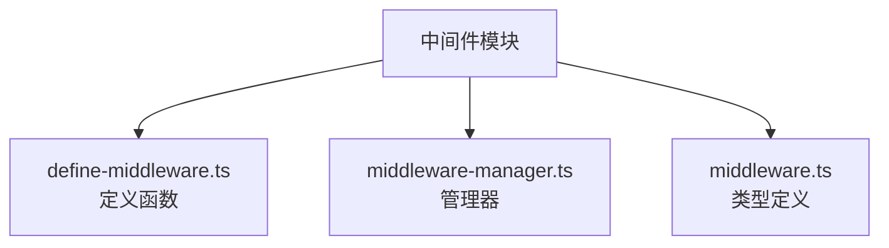
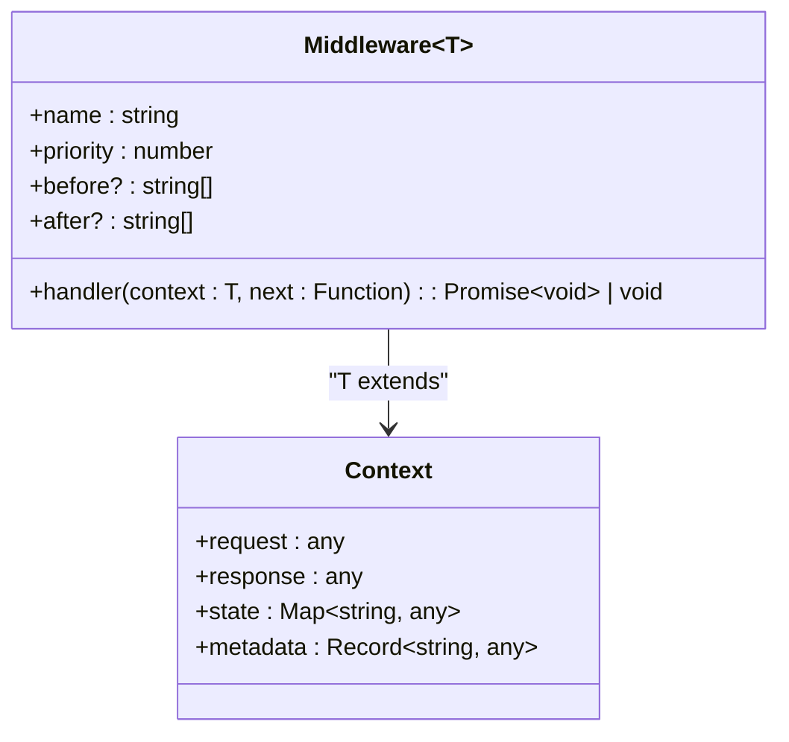
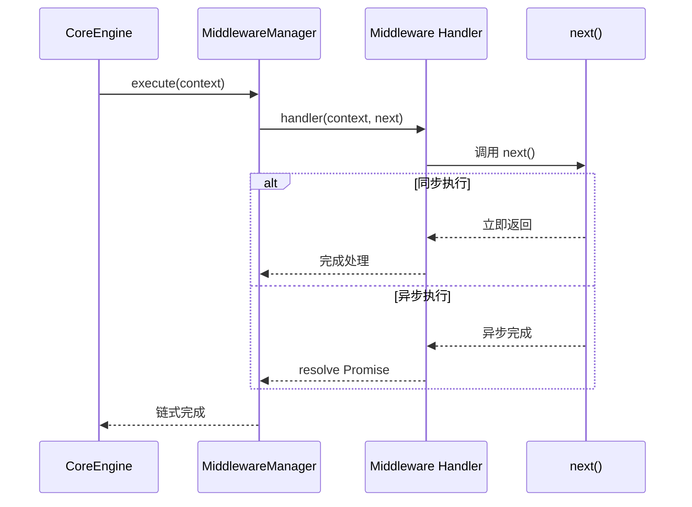
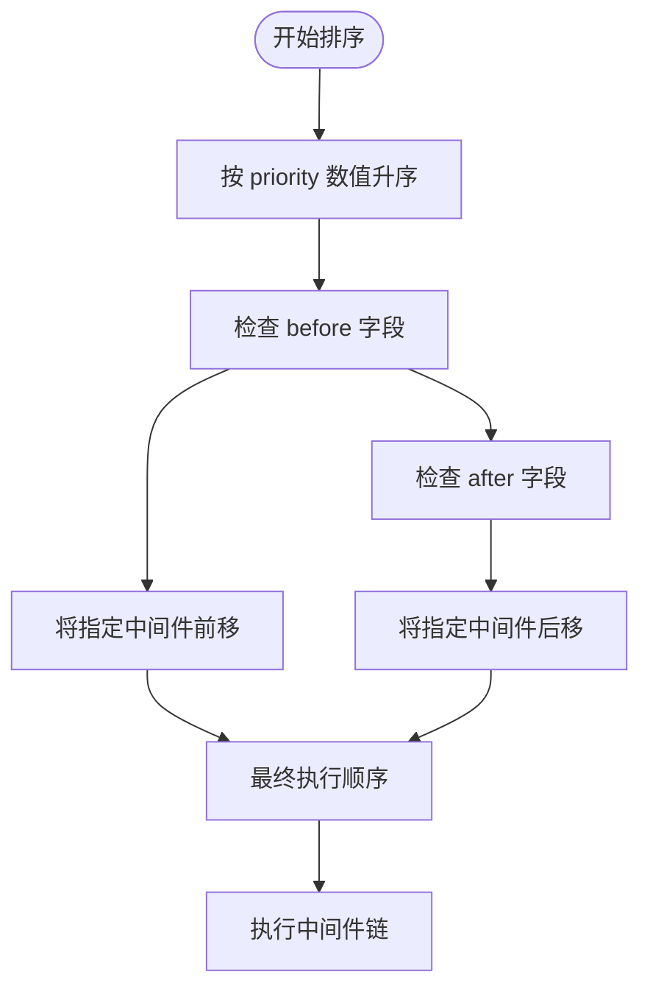
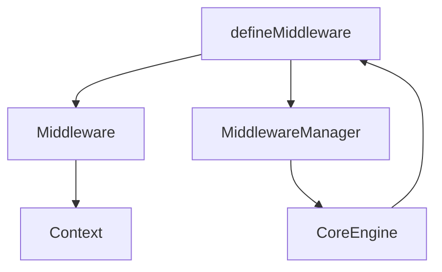

# 中间件定义

<cite>
**本文档中引用的文件**  
- [define-middleware.ts](file://packages/core/src/middleware/define-middleware.ts)
- [middleware-manager.ts](file://packages/core/src/middleware/middleware-manager.ts)
- [middleware.ts](file://packages/core/src/types/middleware.ts)
- [core-engine.ts](file://packages/core/src/engine/core-engine.ts)
- [index.ts](file://packages/core/src/index.ts)
</cite>

## 目录
1. [引言](#引言)
2. [项目结构](#项目结构)
3. [核心组件](#核心组件)
4. [架构概述](#架构概述)
5. [详细组件分析](#详细组件分析)
6. [依赖分析](#依赖分析)
7. [性能考虑](#性能考虑)
8. [故障排除指南](#故障排除指南)
9. [结论](#结论)

## 引言
本文档深入解析中间件的定义机制，重点讲解 `defineMiddleware` 函数的设计原理与使用方式。通过泛型参数 `T` 定义上下文类型，确保类型安全的中间件开发。结合代码示例展示如何创建具有初始化逻辑、请求拦截、响应处理能力的中间件，包括同步与异步中间件的编写差异。解释中间件对象中 `name`、`priority`、`before`、`after` 等元数据字段的作用及其对执行顺序的影响。阐述中间件与核心类型系统 `Middleware` 接口的契约关系，并提供自定义中间件的最佳实践，如错误边界处理、性能监控注入和日志追踪。

## 项目结构
中间件相关功能位于 `packages/core/src/middleware` 目录下，主要包括定义、管理与类型系统三大部分。该模块独立封装，便于扩展和维护。

**图示来源**  
- [define-middleware.ts](file://packages/core/src/middleware/define-middleware.ts#L1-L10)
- [middleware-manager.ts](file://packages/core/src/middleware/middleware-manager.ts#L1-L10)
- [middleware.ts](file://packages/core/src/types/middleware.ts#L1-L10)

**本节来源**  
- [packages/core/src/middleware](file://packages/core/src/middleware)

## 核心组件
中间件系统的核心是 `defineMiddleware<T>` 函数，它接受泛型上下文类型 `T`，返回符合 `Middleware<T>` 接口的对象。该设计确保了上下文数据在中间件链中的类型一致性与安全性。

此外，`MiddlewareManager` 负责注册、排序与执行中间件链，依据 `priority`、`before` 和 `after` 元数据动态调整执行顺序。

**本节来源**  
- [define-middleware.ts](file://packages/core/src/middleware/define-middleware.ts#L15-L50)
- [middleware-manager.ts](file://packages/core/src/middleware/middleware-manager.ts#L20-L60)
- [middleware.ts](file://packages/core/src/types/middleware.ts#L5-L30)

## 架构概述
整个中间件系统基于类型安全的函数式设计，通过泛型约束上下文结构，利用元数据控制执行顺序，并由核心引擎统一调度。

**图示来源**  
- [core-engine.ts](file://packages/core/src/engine/core-engine.ts#L45-L90)
- [middleware-manager.ts](file://packages/core/src/middleware/middleware-manager.ts#L10-L80)

## 详细组件分析

### defineMiddleware 函数分析
`defineMiddleware<T>` 是一个泛型工厂函数，用于创建类型安全的中间件。其参数为一个配置对象，包含 `name`、`priority`、`before`、`after` 及核心处理函数 `handler`。

#### 类型契约关系

**图示来源**  
- [middleware.ts](file://packages/core/src/types/middleware.ts#L10-L40)
- [define-middleware.ts](file://packages/core/src/middleware/define-middleware.ts#L5-L25)

#### 执行流程（同步与异步）

**图示来源**  
- [define-middleware.ts](file://packages/core/src/middleware/define-middleware.ts#L30-L70)
- [middleware-manager.ts](file://packages/core/src/middleware/middleware-manager.ts#L50-L100)

### 元数据字段作用分析
中间件的执行顺序不仅依赖 `priority` 数值，还受 `before` 和 `after` 字段影响，形成灵活的调度策略。

**图示来源**  
- [middleware-manager.ts](file://packages/core/src/middleware/middleware-manager.ts#L60-L120)

**本节来源**  
- [define-middleware.ts](file://packages/core/src/middleware/define-middleware.ts#L1-L100)
- [middleware-manager.ts](file://packages/core/src/middleware/middleware-manager.ts#L1-L150)
- [middleware.ts](file://packages/core/src/types/middleware.ts#L1-L50)

## 依赖分析
中间件系统依赖于核心类型定义与上下文结构，同时被核心引擎调用执行。

**图示来源**  
- [index.ts](file://packages/core/src/index.ts#L1-L20)
- [core-engine.ts](file://packages/core/src/engine/core-engine.ts#L1-L40)

**本节来源**  
- [go.mod](file://packages/core/package.json#L1-L30)

## 性能考虑
中间件链的性能关键在于减少不必要的上下文拷贝、避免阻塞式同步操作，并推荐使用异步非阻塞模式处理 I/O 操作。高 `priority` 值的中间件应尽量轻量，用于日志、监控等前置操作。

建议对耗时中间件添加性能埋点，利用 `performance-monitor` 模块进行统计。

## 故障排除指南
常见问题包括：
- 类型不匹配导致编译错误：确保泛型 `T` 正确继承 `Context`
- 执行顺序异常：检查 `priority`、`before`、`after` 配置是否冲突
- `next()` 未调用导致流程中断：确保同步中间件显式调用，异步中间件 `await next()`
- 异常未被捕获：建议在关键中间件中添加 try-catch 并触发错误事件

**本节来源**  
- [errors.ts](file://packages/core/src/event/event-manager.ts#L20-L60)
- [debug.ts](file://packages/core/src/performance/performance-monitor.ts#L15-L40)

## 结论
`defineMiddleware` 提供了一套类型安全、结构清晰的中间件定义机制，结合元数据控制实现灵活的执行调度。开发者可基于此构建可复用、易维护的中间件组件，适用于日志记录、权限校验、性能监控等多种场景。建议遵循最小职责原则，保持中间件单一功能，并合理利用异步机制提升系统吞吐能力。