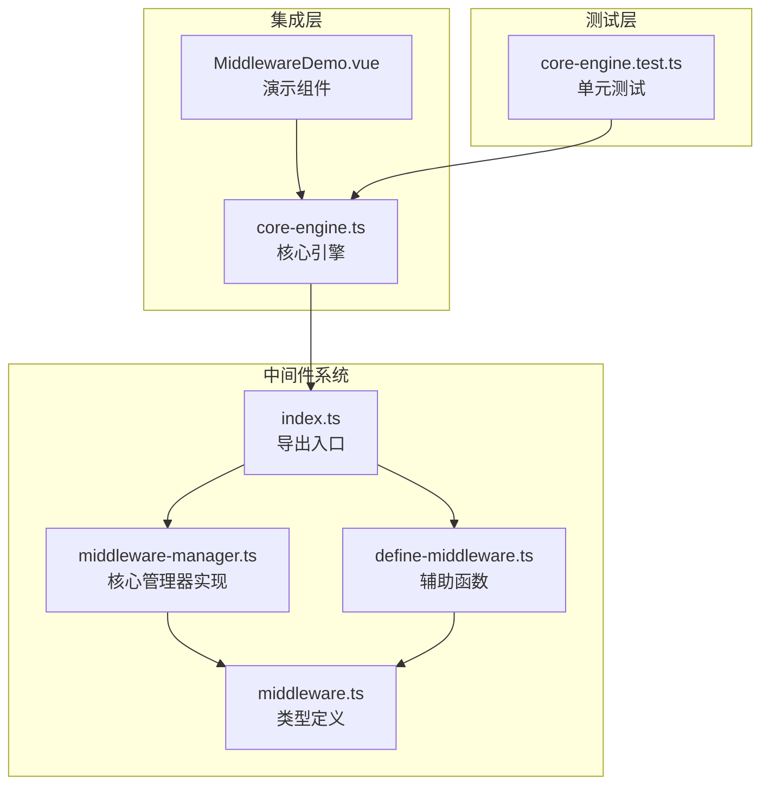
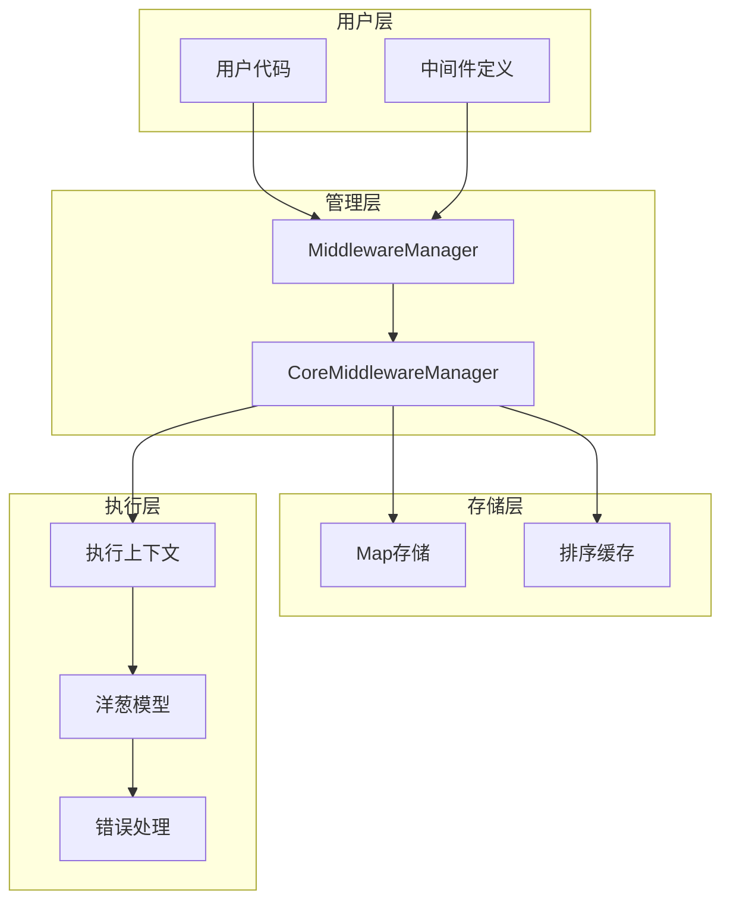
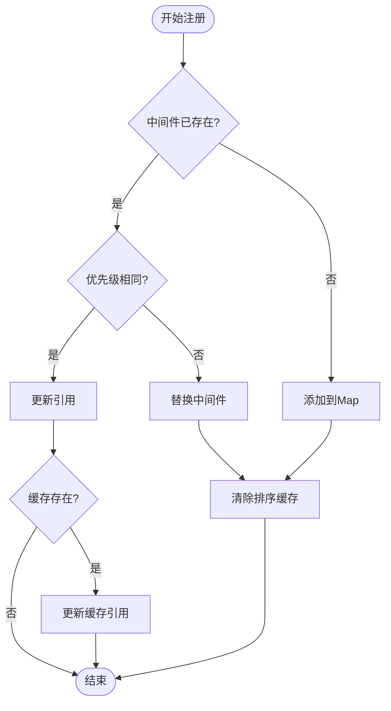
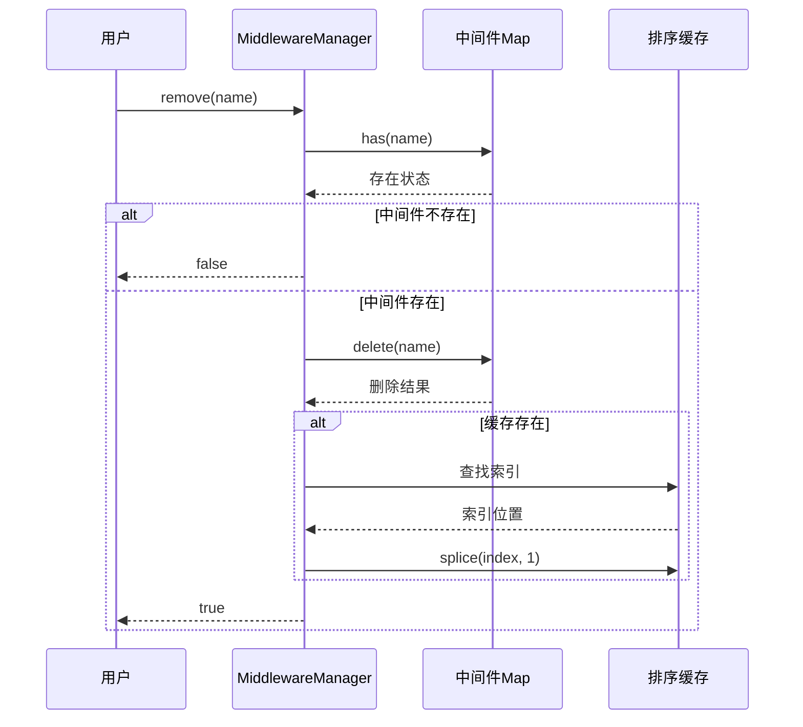
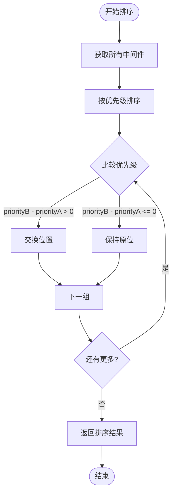
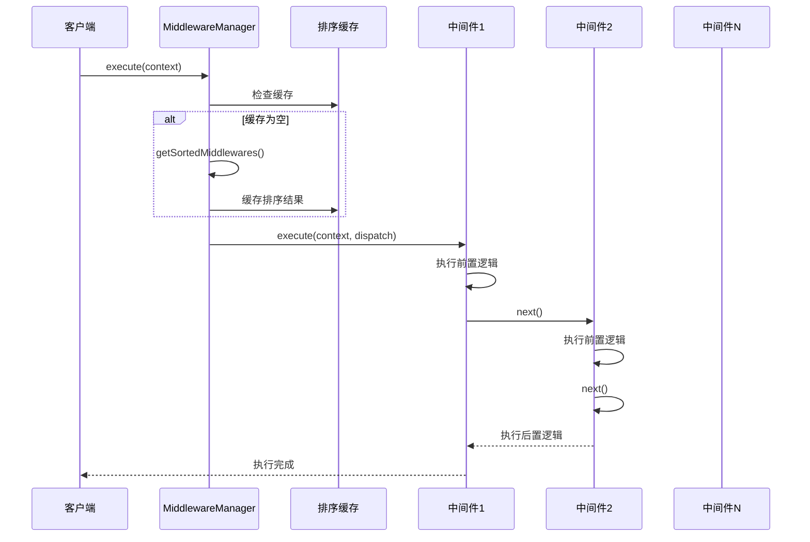
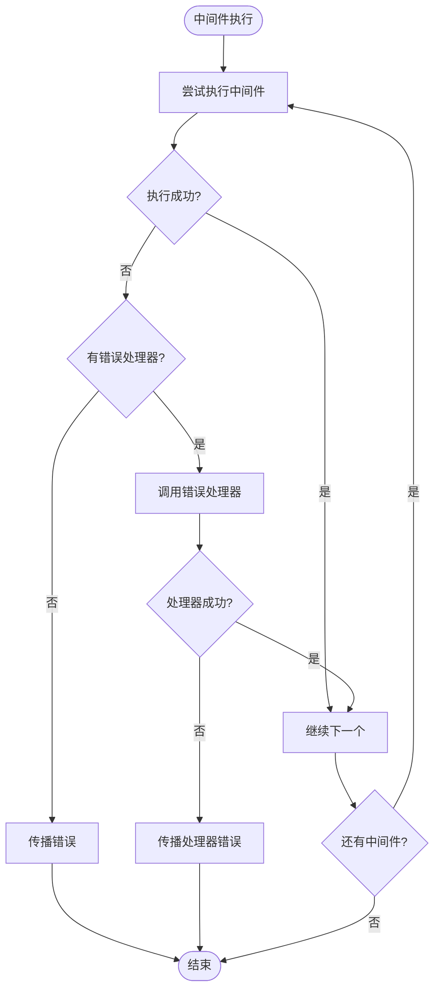
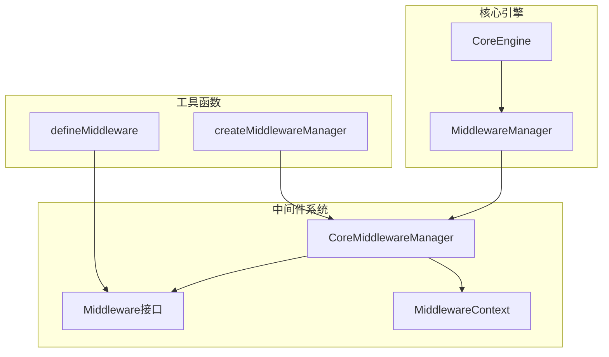

# 中间件管理器

<cite>
**本文档中引用的文件**
- [middleware-manager.ts](file://packages/core/src/middleware/middleware-manager.ts)
- [middleware.ts](file://packages/core/src/types/middleware.ts)
- [index.ts](file://packages/core/src/middleware/index.ts)
- [define-middleware.ts](file://packages/core/src/middleware/define-middleware.ts)
- [core-engine.ts](file://packages/core/src/engine/core-engine.ts)
- [MiddlewareDemo.vue](file://packages/vue3/example/src/components/MiddlewareDemo.vue)
- [core-engine.test.ts](file://packages/core/src/__tests__/core-engine.test.ts)
</cite>

## 目录
1. [简介](#简介)
2. [项目结构](#项目结构)
3. [核心组件](#核心组件)
4. [架构概览](#架构概览)
5. [详细组件分析](#详细组件分析)
6. [依赖关系分析](#依赖关系分析)
7. [性能考虑](#性能考虑)
8. [故障排除指南](#故障排除指南)
9. [结论](#结论)

## 简介

MiddlewareManager是一个强大的中间件管理系统，提供了类似Koa/Express的中间件架构，支持洋葱模型的中间件链式执行。该系统具有以下核心特性：

- **洋葱模型执行**：支持中间件的嵌套执行模式
- **优先级排序**：基于优先级（priority）的自动排序机制
- **性能优化**：智能缓存策略减少重复计算
- **生命周期管理**：完整的中间件注册、移除、查询和清空功能
- **错误处理**：内置的错误捕获和处理机制

## 项目结构

中间件系统的文件组织结构清晰，主要包含以下核心文件：



**图表来源**
- [middleware-manager.ts](file://packages/core/src/middleware/middleware-manager.ts#L1-L343)
- [middleware.ts](file://packages/core/src/types/middleware.ts#L1-L56)
- [core-engine.ts](file://packages/core/src/engine/core-engine.ts#L1-L364)

**章节来源**
- [middleware-manager.ts](file://packages/core/src/middleware/middleware-manager.ts#L1-L50)
- [middleware.ts](file://packages/core/src/types/middleware.ts#L1-L56)

## 核心组件

### MiddlewareManager接口

MiddlewareManager接口定义了中间件管理器的标准契约，包含以下核心方法：

| 方法名 | 参数 | 返回值 | 功能描述 |
|--------|------|--------|----------|
| `use` | `middleware: Middleware` | `void` | 注册中间件 |
| `remove` | `name: string` | `boolean` | 移除指定名称的中间件 |
| `get` | `name: string` | `Middleware \| undefined` | 获取指定名称的中间件 |
| `getAll` | 无 | `Middleware[]` | 获取所有中间件 |
| `execute` | `context: MiddlewareContext<T>` | `Promise<void>` | 执行中间件链 |
| `clear` | 无 | `void` | 清空所有中间件 |
| `size` | 无 | `number` | 获取中间件数量 |
| `has` | `name: string` | `boolean` | 检查中间件是否存在 |

### CoreMiddlewareManager实现类

CoreMiddlewareManager是MiddlewareManager接口的具体实现，采用Map存储中间件并维护排序缓存：

- **中间件存储**：使用`Map<string, Middleware>`确保插入顺序和唯一性
- **排序缓存**：维护`sortedCache: Middleware[] \| null`以优化性能
- **优先级处理**：支持基于priority属性的自动排序
- **性能优化**：智能缓存失效策略

**章节来源**
- [middleware-manager.ts](file://packages/core/src/middleware/middleware-manager.ts#L47-L343)
- [middleware.ts](file://packages/core/src/types/middleware.ts#L39-L55)

## 架构概览

中间件管理器采用分层架构设计，支持复杂的中间件链式执行：



**图表来源**
- [middleware-manager.ts](file://packages/core/src/middleware/middleware-manager.ts#L47-L105)
- [middleware.ts](file://packages/core/src/types/middleware.ts#L8-L34)

## 详细组件分析

### 中间件注册机制（use）

中间件注册是系统的核心功能，实现了智能的优先级管理和缓存优化：



**图表来源**
- [middleware-manager.ts](file://packages/core/src/middleware/middleware-manager.ts#L78-L105)

#### 性能优化策略

1. **优先级相同优化**：当新旧中间件优先级相同时，仅更新引用而不清除缓存
2. **条件缓存清除**：只有在优先级变化或新增中间件时才清除缓存
3. **引用更新机制**：当缓存存在时同步更新缓存中的中间件引用

### 中间件移除机制（remove）

移除操作采用性能友好的策略，避免不必要的缓存重建：



**图表来源**
- [middleware-manager.ts](file://packages/core/src/middleware/middleware-manager.ts#L120-L136)

#### 性能优化特点

- **直接移除**：不重建整个缓存，而是直接从缓存中移除对应元素
- **索引查找**：使用`findIndex`定位要移除的中间件
- **条件更新**：只有在缓存存在且找到匹配项时才进行更新

### 中间件查询机制（get/getAll）

查询功能提供灵活的数据访问能力：

| 查询方法 | 实现方式 | 时间复杂度 | 用途 |
|----------|----------|------------|------|
| `get(name)` | `Map.get()` | O(1) | 获取单个中间件 |
| `getAll()` | `Array.from(Map.values())` | O(n) | 获取所有中间件 |
| `size()` | `Map.size` | O(1) | 获取数量 |
| `has(name)` | `Map.has()` | O(1) | 检查存在性 |

### 中间件排序算法

排序算法是系统的核心逻辑，确保中间件按优先级正确执行：



**图表来源**
- [middleware-manager.ts](file://packages/core/src/middleware/middleware-manager.ts#L315-L324)

#### 排序规则详解

1. **优先级降序**：数值越大优先级越高
2. **默认值处理**：未指定priority的中间件视为0
3. **稳定性保证**：相同优先级的中间件保持注册顺序

### 中间件执行引擎（execute）

执行引擎实现了经典的洋葱模型，支持异步链式调用：



**图表来源**
- [middleware-manager.ts](file://packages/core/src/middleware/middleware-manager.ts#L197-L258)

#### 洋葱模型实现要点

1. **调度函数**：`dispatch`函数负责递归执行下一个中间件
2. **上下文传递**：所有中间件共享同一个执行上下文
3. **取消机制**：通过`context.cancelled`支持中间件链提前终止
4. **错误处理**：每个中间件都有独立的错误处理能力

### 错误处理机制

系统提供了多层次的错误处理策略：



**图表来源**
- [middleware-manager.ts](file://packages/core/src/middleware/middleware-manager.ts#L233-L254)

**章节来源**
- [middleware-manager.ts](file://packages/core/src/middleware/middleware-manager.ts#L78-L270)

## 依赖关系分析

中间件管理器与其他系统组件的依赖关系：



**图表来源**
- [core-engine.ts](file://packages/core/src/engine/core-engine.ts#L75-L135)
- [middleware-manager.ts](file://packages/core/src/middleware/middleware-manager.ts#L339-L343)

### 外部依赖

1. **类型定义**：依赖`@ldesign/engine-core/types`中的Middleware和MiddlewareContext类型
2. **工具函数**：使用`defineMiddleware`辅助函数简化中间件定义
3. **工厂函数**：通过`createMiddlewareManager`创建管理器实例

### 内部耦合

- **低耦合设计**：MiddlewareManager接口与具体实现分离
- **依赖注入**：通过构造函数注入中间件管理器
- **接口隔离**：每个组件只依赖必要的接口

**章节来源**
- [core-engine.ts](file://packages/core/src/engine/core-engine.ts#L119-L135)
- [middleware-manager.ts](file://packages/core/src/middleware/middleware-manager.ts#L339-L343)

## 性能考虑

### 存储结构选择

系统采用Map+数组的混合存储结构：

| 存储方式 | 优势 | 劣势 | 适用场景 |
|----------|------|------|----------|
| Map | O(1)查找，保持插入顺序 | 不支持随机访问 | 中间件注册/查询 |
| 数组 | 支持排序，便于执行 | 查找O(n)，插入慢 | 排序缓存 |

### 缓存策略

1. **智能缓存失效**：
   - 优先级不变时不重建缓存
   - 优先级变化时清除缓存
   - 新增/移除中间件时清除缓存

2. **延迟计算**：
   - 只在首次执行时计算排序
   - 后续执行直接使用缓存结果

3. **内存优化**：
   - 缓存可选，null表示未计算
   - 移除时同步清理缓存

### 频繁增删场景下的性能表现

- **注册性能**：平均O(1)，最坏O(n)（需要重建缓存）
- **移除性能**：平均O(1)，最坏O(n)（需要重建缓存）
- **执行性能**：O(n)，但得益于缓存，实际开销较小
- **内存占用**：O(m*n)，m为中间件数量，n为执行深度

### 性能优化建议

1. **批量操作**：尽量减少频繁的小规模增删操作
2. **优先级规划**：合理设置优先级，减少缓存重建频率
3. **监控指标**：使用`size()`和`getAll()`方法监控中间件状态

## 故障排除指南

### 常见问题及解决方案

#### 1. 中间件执行顺序异常

**症状**：中间件按预期顺序执行
**原因**：优先级设置错误或缓存未及时更新
**解决**：
```typescript
// 检查中间件优先级
const middlewares = engine.middleware.getAll();
middlewares.forEach(mw => {
  console.log(`${mw.name}: priority=${mw.priority}`);
});

// 强制刷新缓存
engine.middleware.clear(); // 清空缓存
```

#### 2. 中间件链执行中断

**症状**：部分中间件未执行
**原因**：某个中间件设置了`context.cancelled = true`
**解决**：
```typescript
// 检查执行上下文状态
await engine.middleware.execute({
  data: {},
  cancelled: false // 确保初始状态为false
});
```

#### 3. 内存泄漏问题

**症状**：中间件移除后仍占用内存
**原因**：缓存未正确清理或循环引用
**解决**：
```typescript
// 完全清理中间件系统
engine.middleware.clear();
// 或者重启引擎
await engine.destroy();
await engine.init();
```

### 调试技巧

#### 1. 中间件状态监控

```typescript
// 监控中间件数量
console.log(`当前中间件数量: ${engine.middleware.size()}`);

// 获取所有中间件信息
const allMiddlewares = engine.middleware.getAll();
allMiddlewares.forEach(mw => {
  console.log(`${mw.name} (优先级: ${mw.priority})`);
});
```

#### 2. 执行过程跟踪

```typescript
// 包装中间件以添加日志
const loggingMiddleware = defineMiddleware({
  name: 'logging',
  priority: 1000,
  execute: async (context, next) => {
    console.log(`进入中间件: ${context.data.action}`);
    await next();
    console.log(`离开中间件: ${context.data.action}`);
  }
});
```

**章节来源**
- [middleware-manager.ts](file://packages/core/src/middleware/middleware-manager.ts#L164-L166)
- [core-engine.test.ts](file://packages/core/src/__tests__/core-engine.test.ts#L95-L157)

## 实战案例

### 案例1：按环境启用调试中间件

```typescript
// 环境配置
const isDevelopment = process.env.NODE_ENV === 'development';

// 条件注册调试中间件
if (isDevelopment) {
  const debugMiddleware = defineMiddleware({
    name: 'debugger',
    priority: 9999,
    execute: async (context, next) => {
      console.log(`[DEBUG] 前置处理:`, context);
      await next();
      console.log(`[DEBUG] 后置处理:`, context);
    }
  });
  
  engine.middleware.use(debugMiddleware);
}
```

### 案例2：运行时热插拔权限校验模块

```typescript
class PermissionMiddleware {
  private permissions = new Map<string, boolean>();
  
  async execute(context: MiddlewareContext<any>, next: MiddlewareNext) {
    const { userId, action } = context.data;
    
    if (!this.checkPermission(userId, action)) {
      context.cancelled = true;
      return;
    }
    
    await next();
  }
  
  setPermission(action: string, allowed: boolean) {
    this.permissions.set(action, allowed);
    // 重新排序以确保权限检查在其他中间件之前
    engine.middleware.use({
      name: 'permission-check',
      priority: 1000,
      execute: this.execute.bind(this)
    });
  }
  
  checkPermission(userId: string, action: string): boolean {
    return this.permissions.get(action) ?? false;
  }
}

// 动态权限管理
const permissionMiddleware = new PermissionMiddleware();
engine.middleware.use(permissionMiddleware);
```

### 案例3：中间件生命周期管理

```typescript
class MiddlewareManager {
  private middlewares = new Map<string, Middleware>();
  
  register(name: string, middleware: Middleware) {
    this.middlewares.set(name, middleware);
    engine.middleware.use(middleware);
  }
  
  unregister(name: string) {
    if (this.middlewares.delete(name)) {
      engine.middleware.remove(name);
    }
  }
  
  getRegisteredNames(): string[] {
    return Array.from(this.middlewares.keys());
  }
  
  // 环境特定的中间件管理
  configureForEnvironment(env: 'dev' | 'prod' | 'test') {
    // 清空现有中间件
    engine.middleware.clear();
    
    // 根据环境加载不同中间件
    switch (env) {
      case 'dev':
        this.register('dev-logger', devLoggerMiddleware);
        break;
      case 'prod':
        this.register('prod-logger', prodLoggerMiddleware);
        break;
      case 'test':
        this.register('test-logger', testLoggerMiddleware);
        break;
    }
  }
}
```

**章节来源**
- [MiddlewareDemo.vue](file://packages/vue3/example/src/components/MiddlewareDemo.vue#L46-L90)
- [core-engine.test.ts](file://packages/core/src/__tests__/core-engine.test.ts#L95-L157)

## 结论

MiddlewareManager是一个设计精良的中间件管理系统，具有以下突出特点：

### 技术优势

1. **高性能设计**：通过智能缓存策略和Map存储实现O(1)查找和O(n)排序
2. **灵活的优先级系统**：支持基于priority的精确控制和默认值处理
3. **完善的错误处理**：提供中间件级别的错误隔离和恢复机制
4. **优雅的洋葱模型**：完美实现Koa/Express风格的中间件链式执行

### 应用价值

1. **开发效率**：简化中间件开发和管理流程
2. **系统扩展性**：支持动态注册和移除中间件
3. **调试友好**：提供丰富的监控和调试工具
4. **生产就绪**：经过充分测试，适合各种应用场景

### 最佳实践建议

1. **合理规划优先级**：为不同类型的中间件设置合适的优先级范围
2. **及时清理资源**：在不需要时及时移除中间件，避免内存泄漏
3. **错误处理策略**：为关键中间件提供适当的错误处理逻辑
4. **性能监控**：定期检查中间件数量和执行性能

通过深入理解和正确使用MiddlewareManager，开发者可以构建出高效、可维护的中间件驱动应用程序。