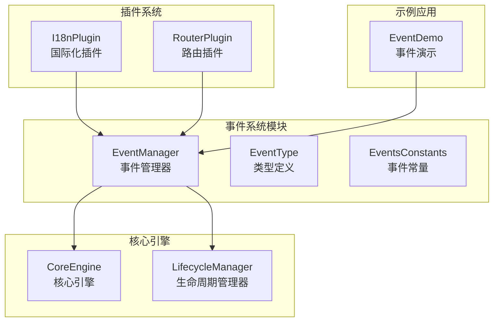
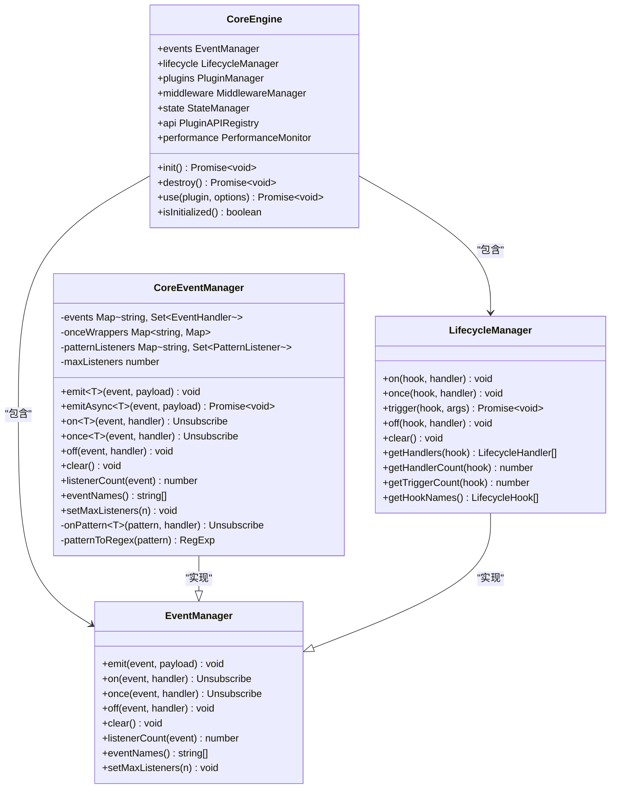
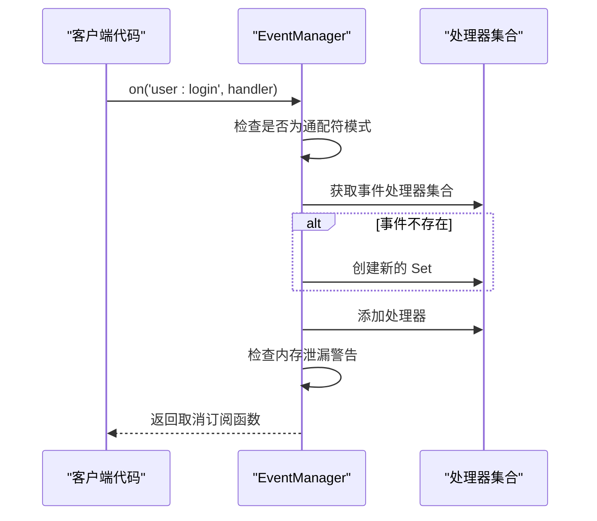
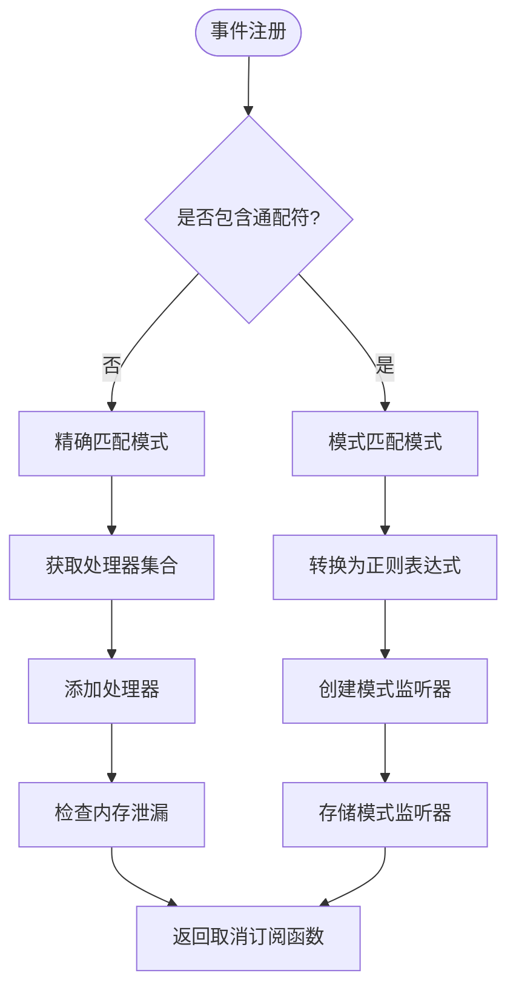
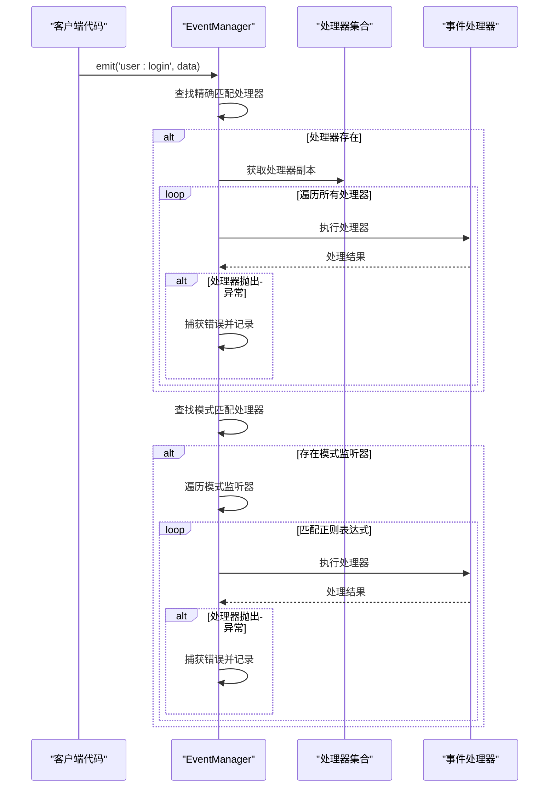
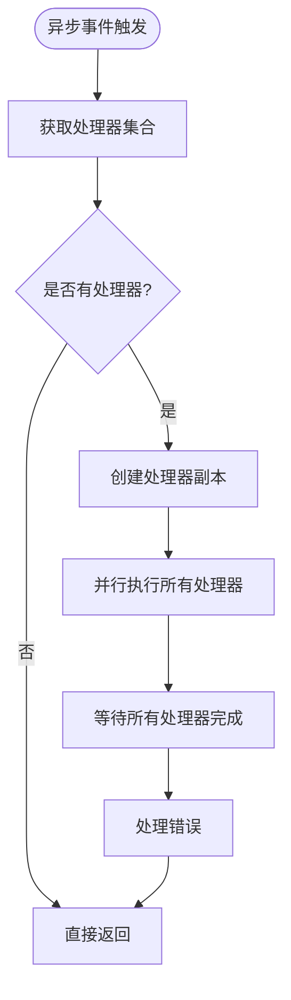
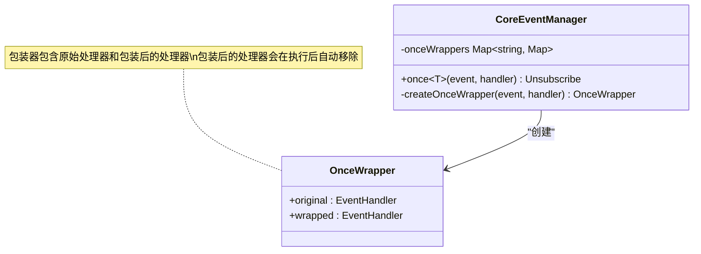
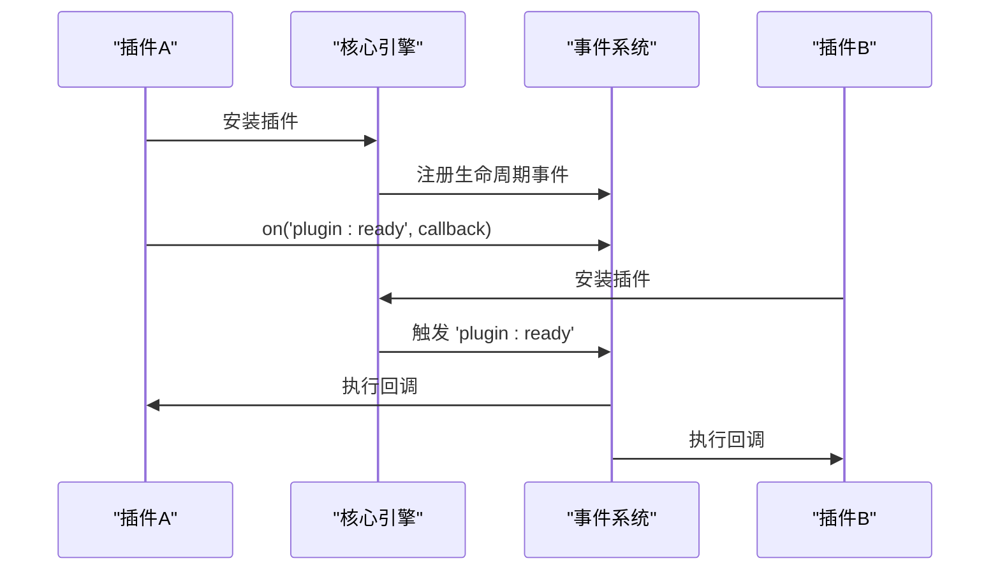
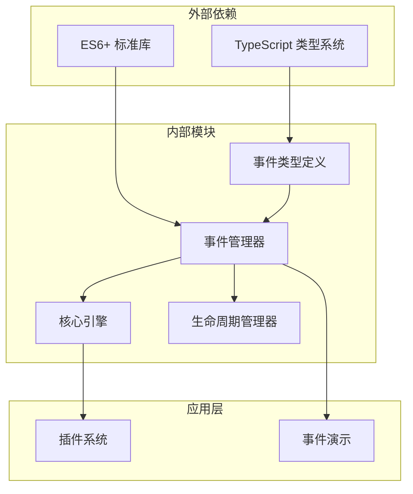

# 事件系统

<cite>
**本文档中引用的文件**
- [event-manager.ts](file://packages/core/src/event/event-manager.ts)
- [events.ts](file://packages/core/src/constants/events.ts)
- [event.ts](file://packages/core/src/types/event.ts)
- [core-engine.ts](file://packages/core/src/engine/core-engine.ts)
- [lifecycle-manager.ts](file://packages/core/src/lifecycle/lifecycle-manager.ts)
- [EventDemo.vue](file://packages/vue3/example/src/components/EventDemo.vue)
- [i18n-plugin.ts](file://packages/vue3/src/plugins/i18n-plugin.ts)
- [router-plugin.ts](file://packages/vue3/src/plugins/router-plugin.ts)
- [core-engine.test.ts](file://packages/core/src/__tests__/core-engine.test.ts)
</cite>

## 目录
1. [简介](#简介)
2. [项目结构](#项目结构)
3. [核心组件](#核心组件)
4. [架构概览](#架构概览)
5. [详细组件分析](#详细组件分析)
6. [依赖关系分析](#依赖关系分析)
7. [性能考虑](#性能考虑)
8. [故障排除指南](#故障排除指南)
9. [结论](#结论)

## 简介

事件系统是 LDesign Engine 核心架构中的关键组件，采用高性能的发布-订阅模式实现。该系统提供了完整的事件管理功能，包括事件注册、触发、一次性监听和通配符匹配，同时保证了事件处理的顺序性和可靠性。

事件系统的设计目标是：
- 提供高性能的事件分发机制
- 支持复杂的事件模式匹配
- 确保内存安全和防止内存泄漏
- 实现错误隔离和可靠性保障
- 与其他核心模块无缝集成

## 项目结构

事件系统的文件组织结构清晰，遵循模块化设计原则：

**图表来源**
- [event-manager.ts](file://packages/core/src/event/event-manager.ts#L1-L50)
- [core-engine.ts](file://packages/core/src/engine/core-engine.ts#L75-L100)

**章节来源**
- [event-manager.ts](file://packages/core/src/event/event-manager.ts#L1-L494)
- [core-engine.ts](file://packages/core/src/engine/core-engine.ts#L1-L364)

## 核心组件

### 事件管理器（CoreEventManager）

事件管理器是事件系统的核心实现，提供了完整的发布-订阅功能：

#### 主要特性
- **高性能事件分发**：基于 Map 和 Set 数据结构，确保 O(1) 的查找和操作复杂度
- **通配符事件支持**：支持 `user:*` 和 `*` 等模式匹配
- **异步事件处理**：提供同步和异步两种事件触发方式
- **内存安全管理**：内置内存泄漏检测和防范机制
- **错误隔离**：单个处理器错误不影响其他处理器执行

#### 核心数据结构
- `events`: 存储精确匹配事件的处理器集合
- `onceWrappers`: 管理一次性事件的包装器映射
- `patternListeners`: 存储模式匹配监听器

### 事件类型定义

事件系统定义了完整的类型体系，确保类型安全：

#### 接口定义
- `EventManager`: 事件管理器接口
- `EventHandler`: 事件处理器类型
- `Unsubscribe`: 取消订阅函数类型

**章节来源**
- [event-manager.ts](file://packages/core/src/event/event-manager.ts#L65-L494)
- [event.ts](file://packages/core/src/types/event.ts#L1-L33)

## 架构概览

事件系统采用模块化架构，与核心引擎的其他组件紧密集成：

**图表来源**
- [event-manager.ts](file://packages/core/src/event/event-manager.ts#L65-L494)
- [core-engine.ts](file://packages/core/src/engine/core-engine.ts#L75-L100)
- [lifecycle-manager.ts](file://packages/core/src/lifecycle/lifecycle-manager.ts#L66-L337)

## 详细组件分析

### 事件注册机制（on）

事件注册支持精确匹配和通配符模式：

#### 精确匹配注册

**图表来源**
- [event-manager.ts](file://packages/core/src/event/event-manager.ts#L203-L227)

#### 通配符模式匹配
通配符模式支持以下格式：
- `user:*`：匹配所有 user 相关事件
- `*`：匹配所有事件
- `user:**`：匹配 user 下的所有嵌套事件

**图表来源**
- [event-manager.ts](file://packages/core/src/event/event-manager.ts#L205-L207)
- [event-manager.ts](file://packages/core/src/event/event-manager.ts#L411-L441)

**章节来源**
- [event-manager.ts](file://packages/core/src/event/event-manager.ts#L203-L227)
- [event-manager.ts](file://packages/core/src/event/event-manager.ts#L411-L441)

### 事件触发机制（emit）

事件触发机制确保高性能和可靠性：

#### 同步事件触发

**图表来源**
- [event-manager.ts](file://packages/core/src/event/event-manager.ts#L100-L133)

#### 异步事件触发
异步触发支持并行处理多个处理器：

**图表来源**
- [event-manager.ts](file://packages/core/src/event/event-manager.ts#L150-L169)

**章节来源**
- [event-manager.ts](file://packages/core/src/event/event-manager.ts#L100-L169)

### 一次性监听机制（once）

一次性监听器确保事件只触发一次后自动清理：

#### 包装器机制

**图表来源**
- [event-manager.ts](file://packages/core/src/event/event-manager.ts#L16-L21)
- [event-manager.ts](file://packages/core/src/event/event-manager.ts#L248-L270)

**章节来源**
- [event-manager.ts](file://packages/core/src/event/event-manager.ts#L247-L271)

### 事件队列管理

事件系统实现了高效的队列管理机制：

#### 内存泄漏防护
- **监听器数量监控**：当某个事件的监听器数量超过阈值时发出警告
- **自动清理机制**：移除监听器时自动清理空的事件集合
- **包装器管理**：正确管理一次性监听器的包装器

#### 错误隔离机制
- **处理器错误捕获**：单个处理器抛出的异常不会影响其他处理器
- **异步错误处理**：异步处理器的错误会被单独捕获和记录
- **错误日志记录**：详细的错误信息便于调试

**章节来源**
- [event-manager.ts](file://packages/core/src/event/event-manager.ts#L217-L223)
- [event-manager.ts](file://packages/core/src/event/event-manager.ts#L110-L115)

### 与核心引擎的集成

事件系统与核心引擎的其他模块深度集成：

#### 与插件系统的集成
插件可以通过事件系统与其他插件通信：

**图表来源**
- [i18n-plugin.ts](file://packages/vue3/src/plugins/i18n-plugin.ts#L152-L155)
- [router-plugin.ts](file://packages/vue3/src/plugins/router-plugin.ts#L70-L85)

#### 与生命周期系统的集成
事件系统与生命周期管理器共享相似的架构模式，都支持一次性监听和错误隔离。

**章节来源**
- [core-engine.ts](file://packages/core/src/engine/core-engine.ts#L75-L100)
- [i18n-plugin.ts](file://packages/vue3/src/plugins/i18n-plugin.ts#L152-L155)

## 依赖关系分析

事件系统的依赖关系清晰，遵循单一职责原则：

**图表来源**
- [event-manager.ts](file://packages/core/src/event/event-manager.ts#L1-L10)
- [core-engine.ts](file://packages/core/src/engine/core-engine.ts#L9-L28)

**章节来源**
- [event-manager.ts](file://packages/core/src/event/event-manager.ts#L1-L10)
- [core-engine.ts](file://packages/core/src/engine/core-engine.ts#L9-L28)

## 性能考虑

### 事件处理性能优化

1. **数据结构选择**：使用 Map 和 Set 确保 O(1) 的查找和插入复杂度
2. **批量操作**：事件触发时创建处理器副本，避免遍历时修改集合
3. **异步并行处理**：支持异步事件的并行执行
4. **内存复用**：合理管理内存分配和回收

### 性能监控指标

- **事件触发频率**：监控事件的触发频率和性能瓶颈
- **监听器数量**：跟踪每个事件的监听器数量
- **内存使用情况**：监控内存泄漏风险
- **错误率统计**：统计事件处理过程中的错误率

### 性能优化建议

1. **合理使用一次性监听器**：对于只需要触发一次的事件使用 `once`
2. **及时清理监听器**：在组件销毁时及时移除事件监听器
3. **避免过度监听**：谨慎使用通配符监听器，避免不必要的性能开销
4. **批量事件处理**：对于大量相似事件，考虑合并处理逻辑

## 故障排除指南

### 常见问题及解决方案

#### 内存泄漏问题
**症状**：监听器数量持续增长，内存使用不断增加
**原因**：未正确移除事件监听器
**解决方案**：
- 确保在组件销毁时调用取消订阅函数
- 使用 `engine.events.clear()` 进行批量清理
- 监控 `maxListeners` 警告信息

#### 事件未触发问题
**症状**：事件监听器未被执行
**原因**：
- 事件名称拼写错误
- 监听器注册时机不当
- 事件已被移除

**解决方案**：
- 检查事件名称的拼写和格式
- 确保在事件触发前注册监听器
- 使用 `engine.events.listenerCount()` 检查监听器数量

#### 异步事件处理问题
**症状**：异步事件处理逻辑未按预期执行
**原因**：
- 异步处理器中抛出未捕获的异常
- 事件触发顺序不符合预期

**解决方案**：
- 确保异步处理器正确处理 Promise 错误
- 使用 `await engine.events.emitAsync()` 等待所有处理器完成

**章节来源**
- [event-manager.ts](file://packages/core/src/event/event-manager.ts#L217-L223)
- [core-engine.test.ts](file://packages/core/src/__tests__/core-engine.test.ts#L208-L253)

## 结论

LDesign Engine 的事件系统是一个设计精良、功能完备的发布-订阅模式实现。它不仅提供了基本的事件注册和触发功能，还支持复杂的通配符匹配、异步处理和错误隔离等高级特性。

### 主要优势

1. **高性能**：基于原生数据结构，确保 O(1) 的操作复杂度
2. **类型安全**：完整的 TypeScript 类型定义，提供编译时类型检查
3. **内存安全**：内置内存泄漏检测和防范机制
4. **错误隔离**：单个处理器错误不影响整体系统稳定性
5. **易于使用**：简洁的 API 设计，支持链式调用和类型推导

### 应用场景

- **插件间通信**：插件系统中的事件驱动通信
- **组件解耦**：减少组件间的直接依赖关系
- **生命周期管理**：与生命周期钩子系统协同工作
- **状态同步**：状态变化时的通知机制

### 最佳实践

1. **合理使用事件**：避免过度使用事件系统，保持架构的简洁性
2. **及时清理资源**：确保事件监听器的正确清理
3. **类型安全编程**：充分利用 TypeScript 的类型系统
4. **性能监控**：定期检查事件系统的性能表现

事件系统作为 LDesign Engine 的核心基础设施，为整个框架的可扩展性和可维护性奠定了坚实的基础。通过合理的使用和配置，可以构建出高效、稳定的应用程序架构。