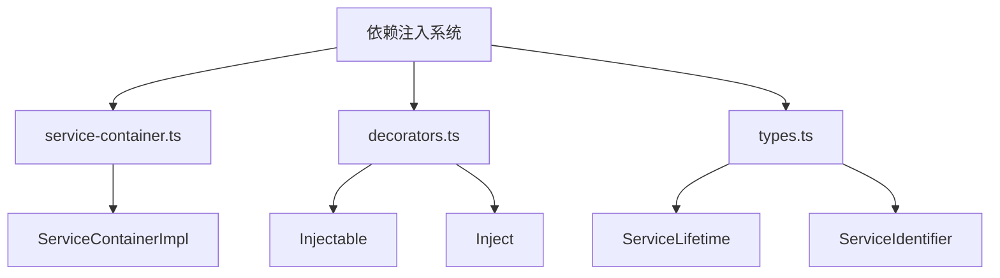
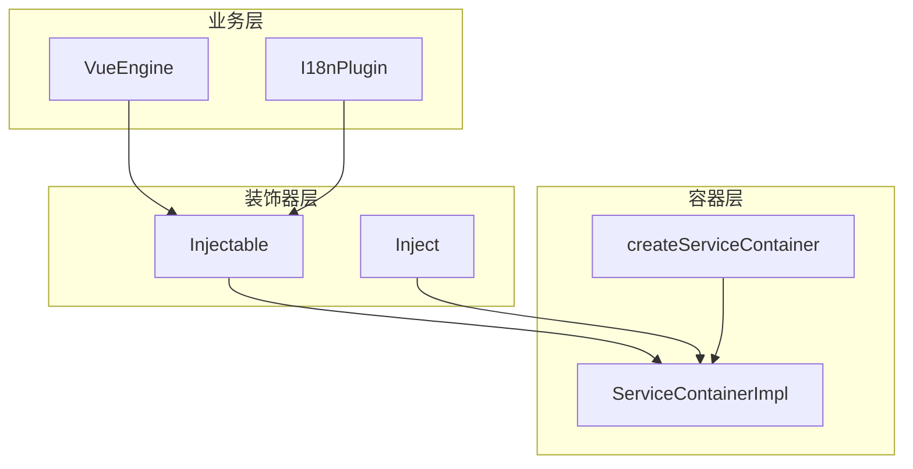
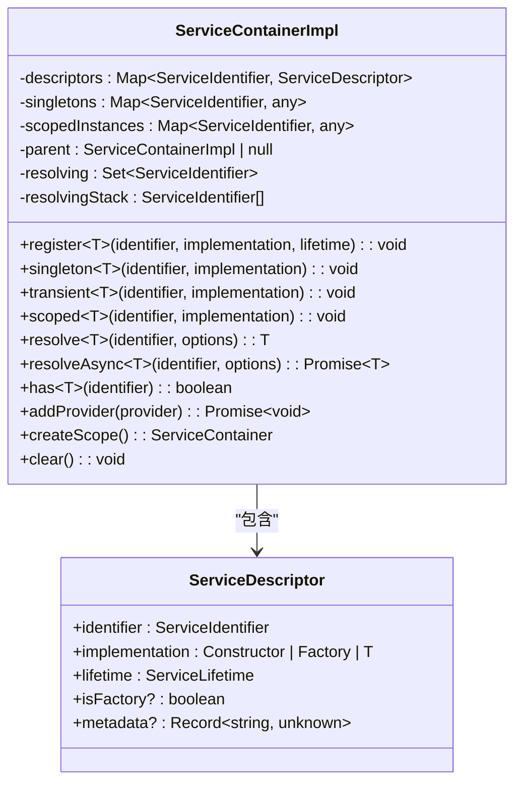
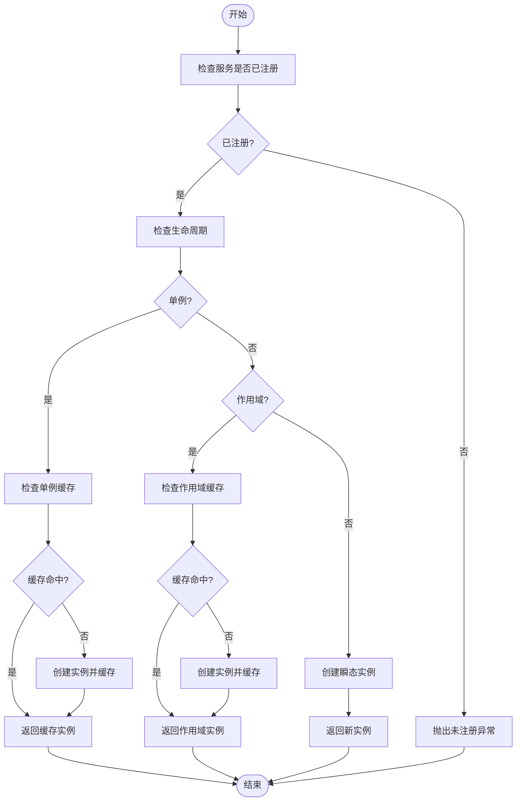
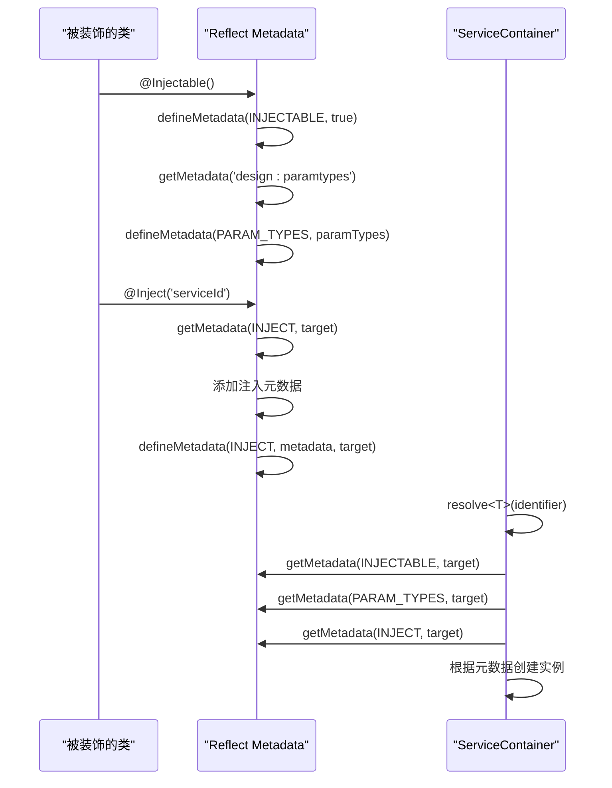
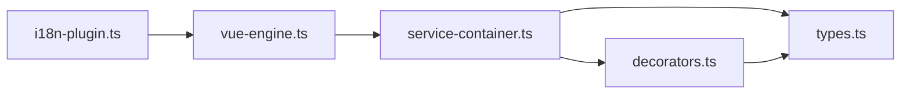

# 依赖注入

<cite>
**本文档引用的文件**
- [service-container.ts](file://packages/core/src/container/service-container.ts)
- [decorators.ts](file://packages/core/src/container/decorators.ts)
- [types.ts](file://packages/core/src/container/types.ts)
- [vue-engine.ts](file://packages/vue3/src/engine/vue-engine.ts)
- [i18n-plugin.ts](file://packages/vue3/src/plugins/i18n-plugin.ts)
</cite>

## 目录
1. [简介](#简介)
2. [项目结构](#项目结构)
3. [核心组件](#核心组件)
4. [架构概述](#架构概述)
5. [详细组件分析](#详细组件分析)
6. [依赖分析](#依赖分析)
7. [性能考虑](#性能考虑)
8. [故障排除指南](#故障排除指南)
9. [结论](#结论)

## 简介
依赖注入（Dependency Injection）是LDesign引擎的核心机制之一，它通过ServiceContainer实现服务的注册、解析和生命周期管理。该机制支持基于装饰器的依赖声明方式，能够自动构建依赖图并解决循环依赖问题。依赖注入提高了代码的可测试性、可维护性和模块化程度，使得各个组件之间的耦合度降低。

## 项目结构
LDesign引擎的依赖注入系统主要位于`packages/core/src/container`目录下，包含服务容器实现、装饰器定义和类型声明等核心文件。该系统被上层模块如Vue3集成包所使用，实现了跨框架的服务管理和注入功能。

**图示来源**
- [service-container.ts](file://packages/core/src/container/service-container.ts#L47-L548)
- [decorators.ts](file://packages/core/src/container/decorators.ts#L26-L107)
- [types.ts](file://packages/core/src/container/types.ts#L47-L14)

## 核心组件
依赖注入系统的核心组件包括服务容器实现类`ServiceContainerImpl`、装饰器函数`@Injectable`和`@Inject`，以及相关的类型定义。这些组件共同构成了一个完整的依赖注入解决方案，支持单例、瞬态和作用域三种生命周期模式。

**本节来源**
- [service-container.ts](file://packages/core/src/container/service-container.ts#L47-L548)
- [decorators.ts](file://packages/core/src/container/decorators.ts#L26-L156)
- [types.ts](file://packages/core/src/container/types.ts#L1-L205)

## 架构概述
LDesign的依赖注入架构采用分层设计，底层是服务容器实现，中间层是装饰器系统，上层是实际的业务组件。这种设计使得依赖注入既可以在编译时通过装饰器静态分析，也可以在运行时动态解析。

**图示来源**
- [vue-engine.ts](file://packages/vue3/src/engine/vue-engine.ts#L278-L288)
- [i18n-plugin.ts](file://packages/vue3/src/plugins/i18n-plugin.ts#L91-L94)
- [service-container.ts](file://packages/core/src/container/service-container.ts#L47-L548)

## 详细组件分析

### 服务容器分析
服务容器是依赖注入系统的核心，负责管理所有服务的注册和解析。它通过Map数据结构存储服务描述符和实例缓存，支持三种不同的生命周期模式。

#### 服务容器类图

**图示来源**
- [service-container.ts](file://packages/core/src/container/service-container.ts#L47-L548)

#### 服务注册与解析流程

**图示来源**
- [service-container.ts](file://packages/core/src/container/service-container.ts#L143-L176)

### 装饰器系统分析
装饰器系统提供了声明式的依赖注入方式，通过`@Injectable`和`@Inject`装饰器简化了服务的定义和使用。

#### 装饰器工作原理

**图示来源**
- [decorators.ts](file://packages/core/src/container/decorators.ts#L26-L156)
- [service-container.ts](file://packages/core/src/container/service-container.ts#L305-L346)

## 依赖分析
依赖注入系统的内部组件之间存在紧密的协作关系。服务容器依赖于类型定义文件中的接口和枚举，装饰器系统则依赖于元数据键的定义。这些依赖关系确保了系统的类型安全和功能完整性。

**图示来源**
- [service-container.ts](file://packages/core/src/container/service-container.ts#L9-L18)
- [decorators.ts](file://packages/core/src/container/decorators.ts#L9-L10)
- [types.ts](file://packages/core/src/container/types.ts#L1-L205)

## 性能考虑
依赖注入系统在设计时充分考虑了性能因素。对于单例服务，实例被缓存在顶层容器中，避免了重复创建的开销。循环依赖检测机制虽然增加了少量运行时开销，但有效防止了潜在的无限递归问题。作用域服务的缓存机制也优化了在同一作用域内的多次解析性能。

## 故障排除指南
在使用依赖注入系统时，可能会遇到一些常见问题。以下是这些问题的排查方法：

**本节来源**
- [service-container.ts](file://packages/core/src/container/service-container.ts#L158-L163)
- [service-container.ts](file://packages/core/src/container/service-container.ts#L148-L153)

### 服务未注册
当尝试解析一个未注册的服务时，系统会抛出明确的错误信息。检查服务是否已通过`singleton`、`transient`或`scoped`方法正确注册。

### 循环依赖
系统能够检测到直接和间接的循环依赖，并提供完整的依赖路径信息。解决方法是重构代码，打破循环依赖链，或使用延迟加载等技术。

### 解析失败
解析失败可能由多种原因引起，包括服务标识符错误、工厂函数异常等。检查相关代码和配置，确保所有依赖都已正确定义和注册。

## 结论
LDesign的依赖注入系统是一个功能完整、设计精良的解决方案。它不仅提供了基本的服务注册和解析功能，还支持复杂的生命周期管理和作用域控制。通过装饰器系统，开发者可以以声明式的方式使用依赖注入，大大提高了开发效率和代码质量。该系统在实际应用中表现出良好的性能和稳定性，是LDesign引擎的重要基石之一。