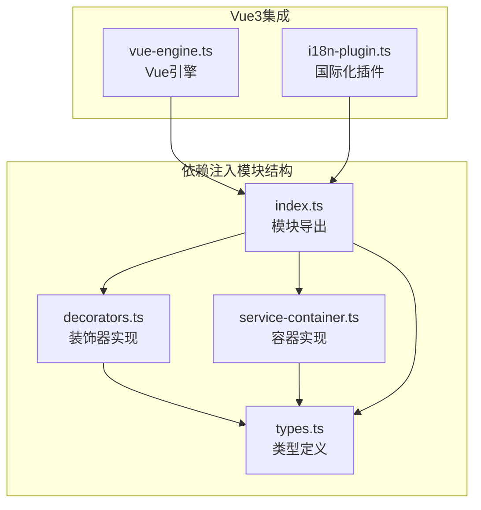
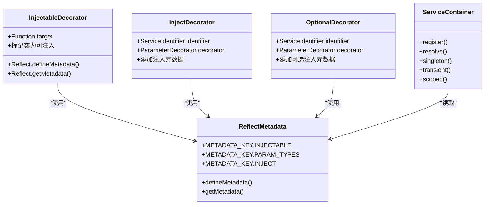
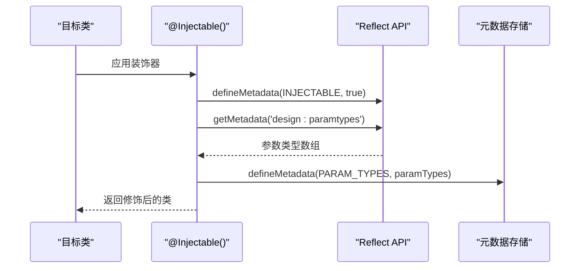
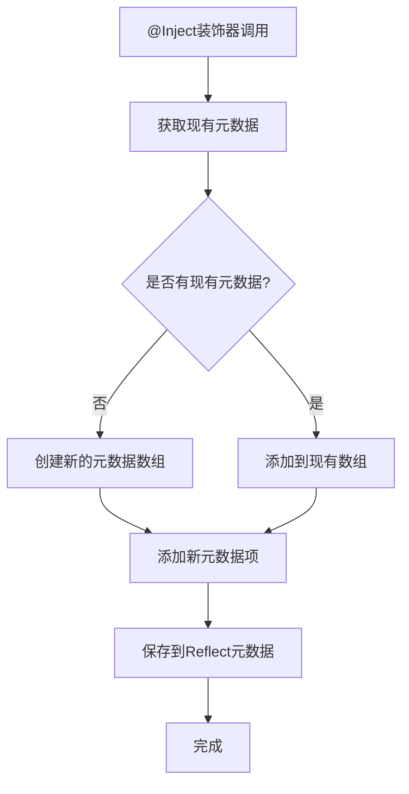
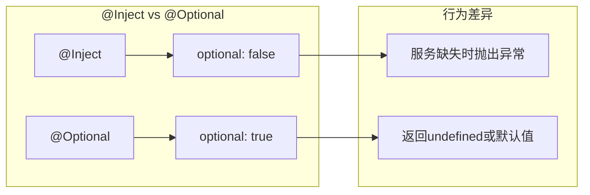
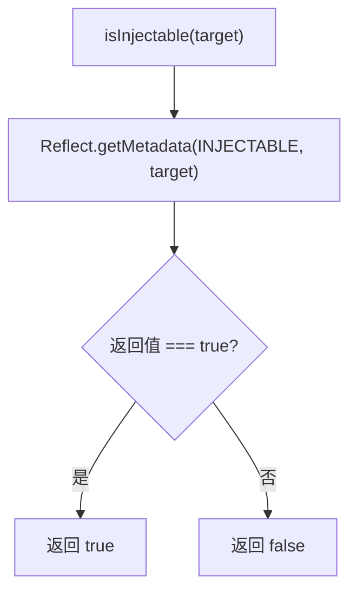
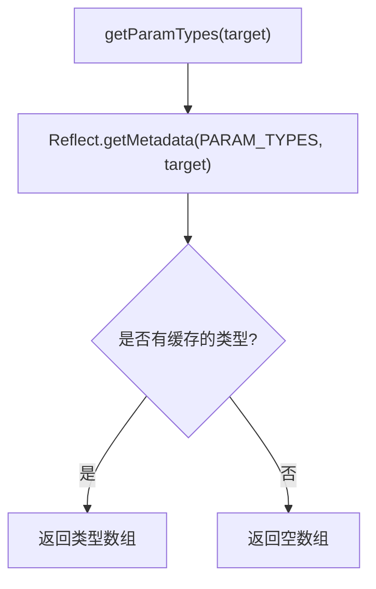
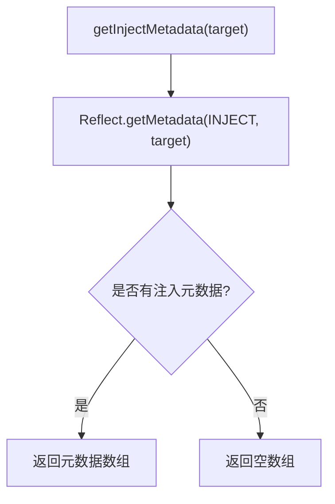
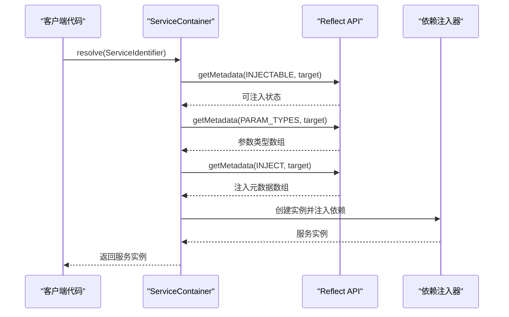
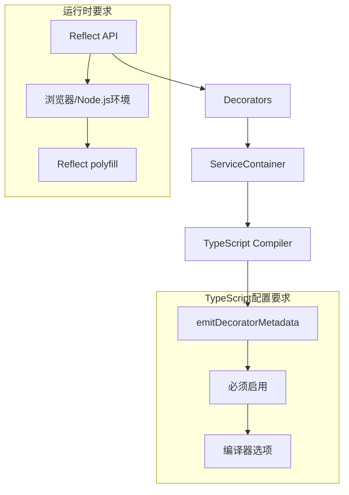

# 依赖注入装饰器系统

<cite>
**本文档引用的文件**
- [packages/core/src/container/decorators.ts](file://packages/core/src/container/decorators.ts)
- [packages/core/src/container/types.ts](file://packages/core/src/container/types.ts)
- [packages/core/src/container/service-container.ts](file://packages/core/src/container/service-container.ts)
- [packages/core/src/container/index.ts](file://packages/core/src/container/index.ts)
- [packages/vue3/src/engine/vue-engine.ts](file://packages/vue3/src/engine/vue-engine.ts)
- [packages/vue3/src/plugins/i18n-plugin.ts](file://packages/vue3/src/plugins/i18n-plugin.ts)
- [tsconfig.json](file://tsconfig.json)
</cite>

## 目录
1. [简介](#简介)
2. [项目结构](#项目结构)
3. [核心组件](#核心组件)
4. [架构概览](#架构概览)
5. [详细组件分析](#详细组件分析)
6. [依赖关系分析](#依赖关系分析)
7. [性能考虑](#性能考虑)
8. [故障排除指南](#故障排除指南)
9. [结论](#结论)

## 简介

LDesign依赖注入装饰器系统是一个基于TypeScript反射机制的现代化依赖注入解决方案。该系统通过装饰器语法简化了依赖注入的使用，利用`Reflect.defineMetadata` API将类标记为可注入，并通过'design:paramtypes'反射获取构造函数参数类型来构建依赖图谱。

系统的核心设计理念是：
- **声明式配置**：通过装饰器语法简化依赖声明
- **反射驱动**：利用TypeScript编译器的元数据发射功能
- **类型安全**：保持完整的TypeScript类型检查能力
- **灵活配置**：支持多种生命周期和服务标识符类型

## 项目结构

依赖注入装饰器系统位于`packages/core/src/container/`目录下，包含以下关键文件：

**图表来源**
- [packages/core/src/container/decorators.ts](file://packages/core/src/container/decorators.ts#L1-L156)
- [packages/core/src/container/types.ts](file://packages/core/src/container/types.ts#L1-L205)
- [packages/core/src/container/service-container.ts](file://packages/core/src/container/service-container.ts#L1-L548)

**章节来源**
- [packages/core/src/container/index.ts](file://packages/core/src/container/index.ts#L1-L7)

## 核心组件

### 装饰器系统核心

依赖注入装饰器系统包含三个主要装饰器和一组辅助函数：

1. **@Injectable** - 标记类为可注入
2. **@Inject** - 注入特定服务标识符
3. **@Optional** - 注入可选依赖
4. **辅助函数** - 运行时类型检查和元数据读取

### 类型系统

系统定义了完整的类型体系，支持：
- **ServiceIdentifier** - 服务标识符类型
- **ServiceLifetime** - 服务生命周期
- **InjectMetadata** - 注入元数据结构
- **ServiceContainer** - 容器接口

**章节来源**
- [packages/core/src/container/decorators.ts](file://packages/core/src/container/decorators.ts#L1-L156)
- [packages/core/src/container/types.ts](file://packages/core/src/container/types.ts#L1-L205)

## 架构概览

**图表来源**
- [packages/core/src/container/decorators.ts](file://packages/core/src/container/decorators.ts#L26-L156)
- [packages/core/src/container/service-container.ts](file://packages/core/src/container/service-container.ts#L47-L548)

## 详细组件分析

### @Injectable装饰器实现

@Injectable装饰器是整个依赖注入系统的核心入口点，负责将类标记为可注入并建立依赖关系。

#### 核心功能

1. **可注入标记**：使用`Reflect.defineMetadata`标记类为可注入
2. **参数类型收集**：通过`design:paramtypes`反射获取构造函数参数类型
3. **元数据存储**：将参数类型信息存储在类的元数据中

#### 实现原理

**图表来源**
- [packages/core/src/container/decorators.ts](file://packages/core/src/container/decorators.ts#L26-L35)

#### 关键特性

- **类型安全**：保持原始类的类型信息不变
- **元数据持久化**：通过Symbol键确保元数据不会被意外覆盖
- **延迟初始化**：仅在需要时才进行反射操作

**章节来源**
- [packages/core/src/container/decorators.ts](file://packages/core/src/container/decorators.ts#L26-L35)

### @Inject装饰器实现

@Inject装饰器为特定构造函数参数指定服务标识符，建立参数与服务之间的映射关系。

#### 元数据管理

**图表来源**
- [packages/core/src/container/decorators.ts](file://packages/core/src/container/decorators.ts#L56-L71)

#### 元数据结构

每个@Inject装饰器调用都会创建一个`InjectMetadata`对象：

| 属性 | 类型 | 描述 |
|------|------|------|
| index | number | 参数在构造函数中的索引位置 |
| identifier | ServiceIdentifier | 服务标识符（字符串、Symbol或构造函数） |
| optional | boolean | 是否为可选依赖（始终为false） |

**章节来源**
- [packages/core/src/container/decorators.ts](file://packages/core/src/container/decorators.ts#L56-L71)

### @Optional装饰器实现

@Optional装饰器与@Inject类似，但专门用于处理可选依赖场景。

#### 设计差异

1. **可选标志**：将`optional`属性设置为true
2. **错误处理**：在服务未注册时提供默认行为
3. **应用场景**：适用于可选功能或条件依赖

#### 实现对比

**图表来源**
- [packages/core/src/container/decorators.ts](file://packages/core/src/container/decorators.ts#L91-L106)

**章节来源**
- [packages/core/src/container/decorators.ts](file://packages/core/src/container/decorators.ts#L91-L106)

### 辅助函数系统

#### isInjectable函数

用于运行时检查类是否被标记为可注入：

**图表来源**
- [packages/core/src/container/decorators.ts](file://packages/core/src/container/decorators.ts#L122-L124)

#### getParamTypes函数

获取类构造函数的参数类型信息：

**图表来源**
- [packages/core/src/container/decorators.ts](file://packages/core/src/container/decorators.ts#L138-L140)

#### getInjectMetadata函数

获取类的所有注入元数据：

**图表来源**
- [packages/core/src/container/decorators.ts](file://packages/core/src/container/decorators.ts#L154-L156)

**章节来源**
- [packages/core/src/container/decorators.ts](file://packages/core/src/container/decorators.ts#L122-L156)

### ServiceContainer集成

依赖注入装饰器系统与ServiceContainer紧密集成，通过反射机制获取元数据并进行依赖解析。

#### 容器解析流程

**图表来源**
- [packages/core/src/container/service-container.ts](file://packages/core/src/container/service-container.ts#L143-L176)

**章节来源**
- [packages/core/src/container/service-container.ts](file://packages/core/src/container/service-container.ts#L143-L176)

## 依赖关系分析

### 装饰器依赖图

**图表来源**
- [packages/core/src/container/decorators.ts](file://packages/core/src/container/decorators.ts#L1-L10)
- [tsconfig.json](file://tsconfig.json#L1-L40)

### 类型系统依赖

| 组件 | 依赖项 | 用途 |
|------|--------|------|
| Decorators | ServiceIdentifier, InjectMetadata | 类型定义和验证 |
| ServiceContainer | ServiceDescriptor, ServiceLifetime | 容器功能实现 |
| Types | Constructor, Factory | 服务类型支持 |

**章节来源**
- [packages/core/src/container/types.ts](file://packages/core/src/container/types.ts#L1-L205)

## 性能考虑

### 反射性能优化

1. **元数据缓存**：反射结果在类加载时缓存
2. **延迟计算**：仅在需要时进行反射操作
3. **Symbol键使用**：避免元数据键冲突

### 内存管理

1. **弱引用**：容器不持有服务实例的强引用
2. **生命周期管理**：支持单例、瞬态、作用域生命周期
3. **垃圾回收友好**：及时清理不再需要的元数据

### 编译时优化

1. **类型擦除**：装饰器不影响运行时性能
2. **静态分析**：编译器可以进行类型检查
3. **Tree Shaking**：未使用的装饰器代码可被移除

## 故障排除指南

### 常见问题及解决方案

#### 问题1：装饰器功能不生效

**症状**：@Injectable类无法被容器识别

**原因**：TypeScript编译配置问题

**解决方案**：
- 确保`tsconfig.json`中启用了`emitDecoratorMetadata`
- 确保`experimentalDecorators`已启用
- 重新编译项目

#### 问题2：循环依赖错误

**症状**：运行时抛出循环依赖异常

**解决方案**：
- 使用@Optional装饰器处理可选依赖
- 重构代码消除循环依赖
- 使用工厂函数延迟依赖创建

#### 问题3：元数据丢失

**症状**：@Inject装饰器的参数类型信息丢失

**原因**：编译器配置或运行时环境问题

**解决方案**：
- 检查TypeScript版本兼容性
- 确保运行时环境支持Reflect API
- 验证polyfill配置

**章节来源**
- [tsconfig.json](file://tsconfig.json#L1-L40)

## 结论

LDesign依赖注入装饰器系统提供了一个完整、类型安全且高性能的依赖注入解决方案。通过巧妙地利用TypeScript的装饰器语法和反射机制，系统实现了声明式的依赖配置，同时保持了良好的开发体验和运行时性能。

### 主要优势

1. **简洁的语法**：装饰器语法大大简化了依赖声明
2. **类型安全**：完整的TypeScript类型检查支持
3. **灵活配置**：支持多种生命周期和服务标识符类型
4. **性能优化**：反射缓存和延迟计算策略
5. **易于集成**：与现有TypeScript项目无缝集成

### 最佳实践建议

1. **合理使用生命周期**：根据服务特性选择合适的生命周期
2. **避免循环依赖**：设计清晰的服务边界和依赖层次
3. **充分利用可选依赖**：使用@Optional处理可选功能
4. **保持装饰器简洁**：避免在装饰器中进行复杂逻辑处理
5. **关注性能影响**：在大型项目中注意反射操作的性能开销

该系统为现代JavaScript/TypeScript应用程序提供了一个强大而优雅的依赖注入解决方案，是构建可维护、可测试应用程序的重要基础设施。