# 服务容器

<cite>
**本文档引用的文件**
- [service-container.ts](file://packages/core/src/container/service-container.ts)
- [types.ts](file://packages/core/src/container/types.ts)
- [decorators.ts](file://packages/core/src/container/decorators.ts)
- [index.ts](file://packages/core/src/container/index.ts)
- [core-engine.ts](file://packages/core/src/engine/core-engine.ts)
- [i18n-plugin.ts](file://packages/vue3/src/plugins/i18n-plugin.ts)
- [core-engine.test.ts](file://packages/core/src/__tests__/core-engine.test.ts)
</cite>

## 目录
1. [简介](#简介)
2. [项目结构](#项目结构)
3. [核心组件](#核心组件)
4. [架构概览](#架构概览)
5. [详细组件分析](#详细组件分析)
6. [生命周期管理](#生命周期管理)
7. [循环依赖检测](#循环依赖检测)
8. [作用域隔离机制](#作用域隔离机制)
9. [服务提供者模式](#服务提供者模式)
10. [装饰器支持](#装饰器支持)
11. [异步解析机制](#异步解析机制)
12. [性能考虑](#性能考虑)
13. [故障排除指南](#故障排除指南)
14. [结论](#结论)

## 简介

服务容器（ServiceContainerImpl）是LDesign引擎框架中的核心依赖注入（Dependency Injection）容器实现。它提供了一个完整的依赖注入解决方案，支持多种生命周期管理策略、循环依赖检测、作用域隔离以及服务提供者模式。该容器采用TypeScript实现，具有强类型支持和丰富的功能特性。

服务容器的主要特性包括：
- 支持三种生命周期：单例（Singleton）、瞬态（Transient）、作用域（Scoped）
- 提供循环依赖检测和错误提示
- 支持父子容器层级结构和作用域隔离
- 实现服务提供者模式，支持延迟注册和启动
- 提供装饰器语法糖，简化依赖注入使用
- 支持同步和异步两种解析方式

## 项目结构

服务容器模块位于`packages/core/src/container/`目录下，包含以下核心文件：

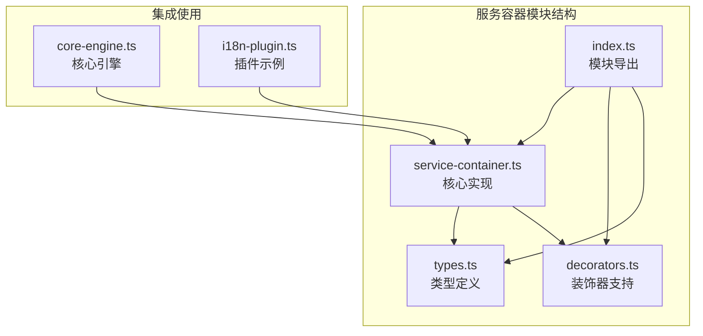

**图表来源**
- [service-container.ts](file://packages/core/src/container/service-container.ts#L1-L50)
- [types.ts](file://packages/core/src/container/types.ts#L1-L30)
- [decorators.ts](file://packages/core/src/container/decorators.ts#L1-L20)

**章节来源**
- [service-container.ts](file://packages/core/src/container/service-container.ts#L1-L50)
- [types.ts](file://packages/core/src/container/types.ts#L1-L205)
- [decorators.ts](file://packages/core/src/container/decorators.ts#L1-L156)

## 核心组件

服务容器的核心组件包括：

### 主要数据结构

服务容器内部维护三个关键的Map结构：

1. **descriptors** (`Map<ServiceIdentifier, ServiceDescriptor>`)
   - 存储服务描述符，包含服务的注册信息
   - 包含服务标识、实现方式、生命周期和工厂函数标识

2. **singletons** (`Map<ServiceIdentifier, any>`)
   - 缓存单例服务实例
   - 单例实例始终存储在最顶层容器中

3. **scopedInstances** (`Map<ServiceIdentifier, any>`)
   - 缓存作用域内的服务实例
   - 作用域实例仅在当前作用域内共享

### 关键属性

- **parent**: 父容器引用，支持层级结构
- **resolving**: 正在解析的服务集合，用于检测循环依赖
- **resolvingStack**: 解析路径栈，记录解析过程中的服务依赖关系

**章节来源**
- [service-container.ts](file://packages/core/src/container/service-container.ts#L47-L75)

## 架构概览

服务容器采用分层架构设计，支持依赖注入的完整生命周期管理：

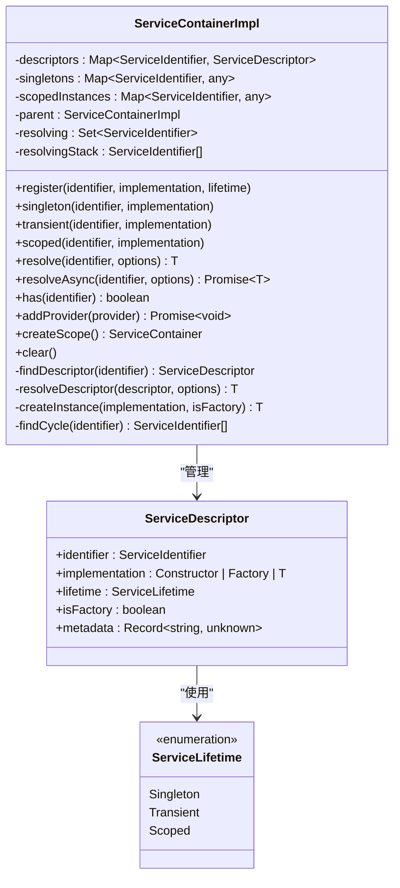

**图表来源**
- [service-container.ts](file://packages/core/src/container/service-container.ts#L47-L108)
- [types.ts](file://packages/core/src/container/types.ts#L57-L74)

## 详细组件分析

### 服务注册机制

服务容器提供四种主要的注册方法，每种对应不同的生命周期策略：

#### register方法
通用注册方法，允许指定任意生命周期：

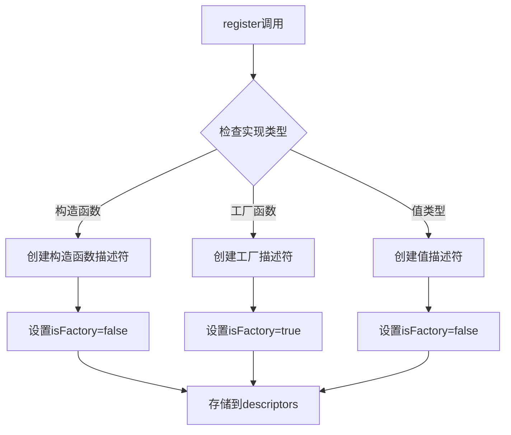

**图表来源**
- [service-container.ts](file://packages/core/src/container/service-container.ts#L75-L95)

#### 生命周期专用方法

1. **singleton方法** - 注册单例服务
   - 整个应用生命周期内只创建一次实例
   - 实例被缓存在singletons中
   - 支持父容器继承

2. **transient方法** - 注册瞬态服务  
   - 每次解析都创建新实例
   - 不进行任何缓存
   - 适用于无状态服务

3. **scoped方法** - 注册作用域服务
   - 在同一作用域内共享实例
   - 实例存储在scopedInstances中
   - 支持作用域隔离

**章节来源**
- [service-container.ts](file://packages/core/src/container/service-container.ts#L75-L134)

### 服务解析流程

服务解析是容器的核心功能，涉及复杂的依赖查找和实例化过程：

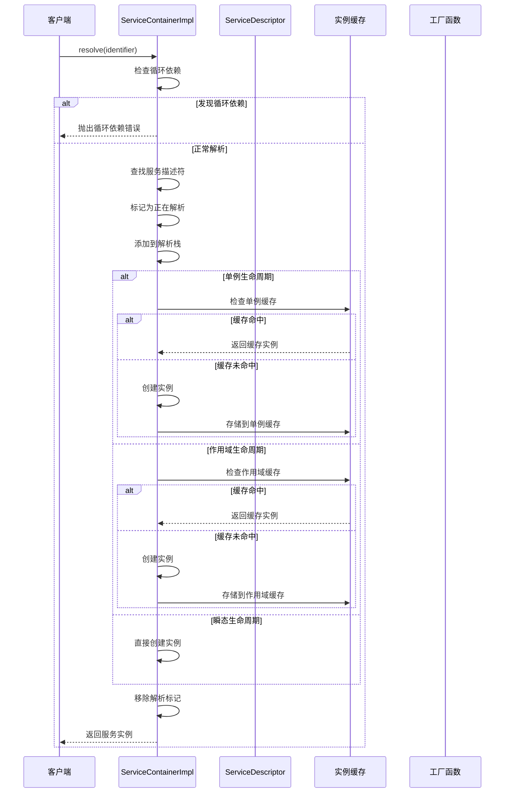

**图表来源**
- [service-container.ts](file://packages/core/src/container/service-container.ts#L143-L175)
- [service-container.ts](file://packages/core/src/container/service-container.ts#L305-L346)

**章节来源**
- [service-container.ts](file://packages/core/src/container/service-container.ts#L143-L175)
- [service-container.ts](file://packages/core/src/container/service-container.ts#L305-L346)

## 生命周期管理

服务容器支持三种生命周期策略，每种都有特定的使用场景和行为特征：

### 单例生命周期（Singleton）

单例生命周期确保服务在整个应用生命周期内只有一个实例：

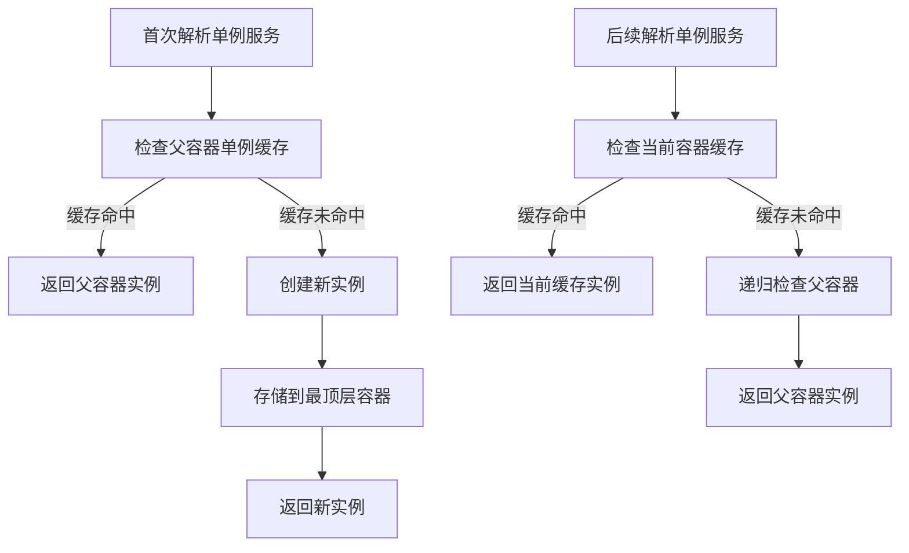

**图表来源**
- [service-container.ts](file://packages/core/src/container/service-container.ts#L311-L326)
- [service-container.ts](file://packages/core/src/container/service-container.ts#L452-L464)

### 瞬态生命周期（Transient）

瞬态生命周期每次解析都创建新实例：

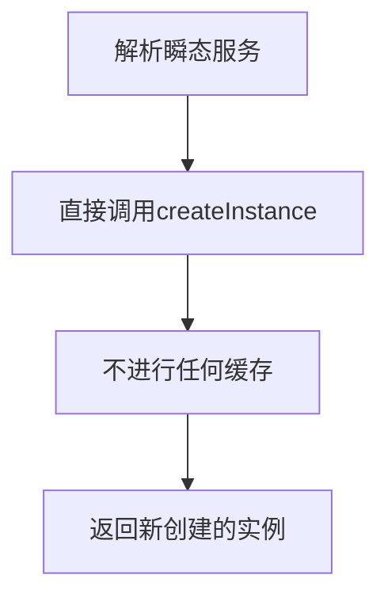

**图表来源**
- [service-container.ts](file://packages/core/src/container/service-container.ts#L344-L346)

### 作用域生命周期（Scoped）

作用域生命周期在当前作用域内共享实例：

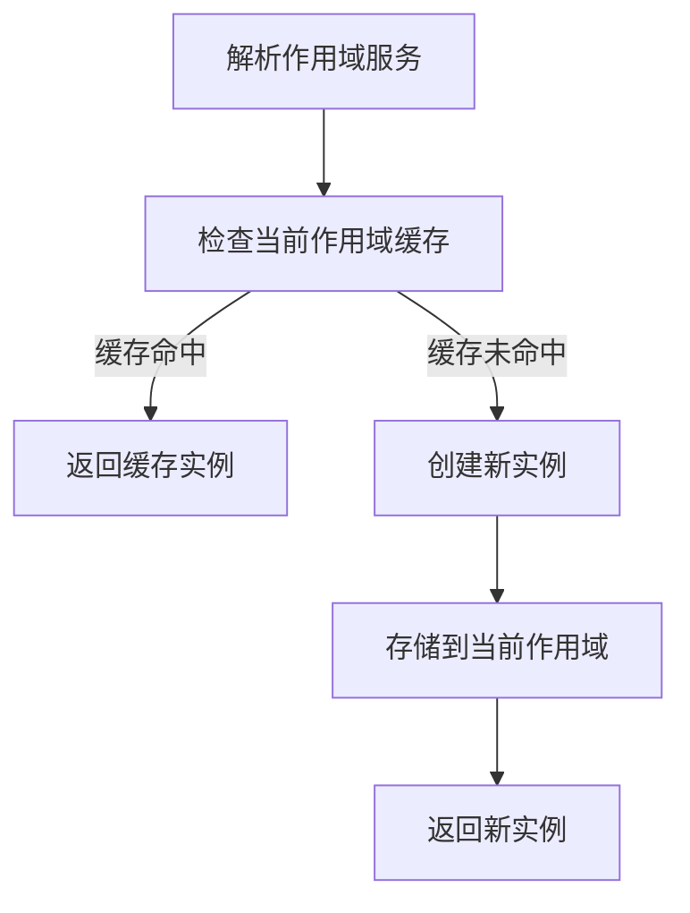

**图表来源**
- [service-container.ts](file://packages/core/src/container/service-container.ts#L329-L342)

**章节来源**
- [service-container.ts](file://packages/core/src/container/service-container.ts#L305-L346)

## 循环依赖检测

服务容器实现了强大的循环依赖检测机制，能够识别直接和间接的循环依赖关系：

### 检测机制

循环依赖检测通过两个关键数据结构协同工作：

1. **resolving集合** - 记录正在解析的服务标识
2. **resolvingStack栈** - 记录完整的解析路径

### 检测算法

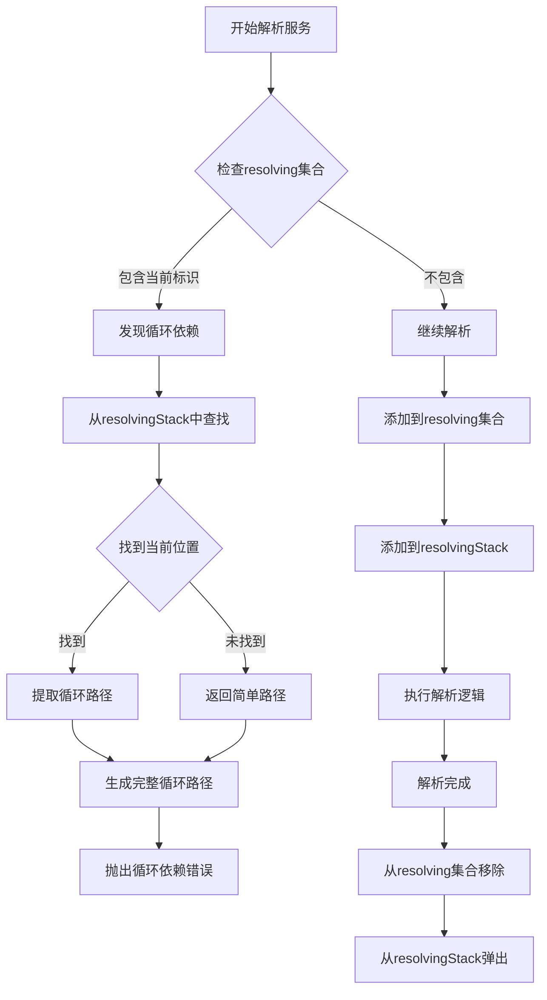

**图表来源**
- [service-container.ts](file://packages/core/src/container/service-container.ts#L147-L153)
- [service-container.ts](file://packages/core/src/container/service-container.ts#L513-L527)

### 错误信息生成

findCycle方法生成详细的循环依赖路径，帮助开发者快速定位问题：

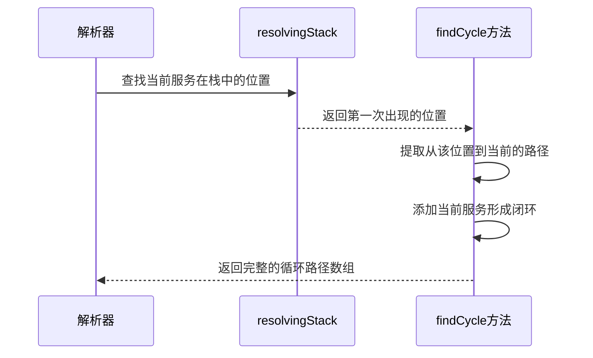

**图表来源**
- [service-container.ts](file://packages/core/src/container/service-container.ts#L513-L527)

**章节来源**
- [service-container.ts](file://packages/core/src/container/service-container.ts#L147-L153)
- [service-container.ts](file://packages/core/src/container/service-container.ts#L513-L527)

## 作用域隔离机制

服务容器支持父子容器层级结构，实现作用域隔离和继承：

### 层级结构

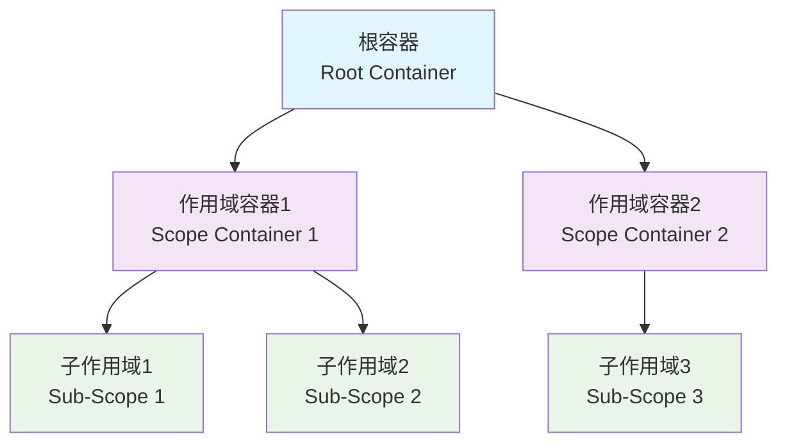

**图表来源**
- [service-container.ts](file://packages/core/src/container/service-container.ts#L67-L73)

### 作用域继承规则

1. **服务查找顺序**：当前容器 → 父容器 → 更高层父容器
2. **单例缓存**：单例实例始终存储在最顶层容器
3. **作用域实例**：作用域实例仅在当前作用域内可见

### createScope方法

createScope方法创建新的子容器，实现作用域隔离：

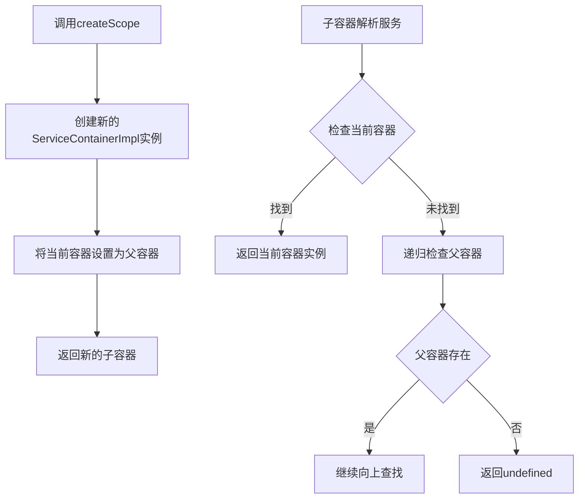

**图表来源**
- [service-container.ts](file://packages/core/src/container/service-container.ts#L259-L261)

**章节来源**
- [service-container.ts](file://packages/core/src/container/service-container.ts#L67-L73)
- [service-container.ts](file://packages/core/src/container/service-container.ts#L259-L261)

## 服务提供者模式

服务容器支持服务提供者（ServiceProvider）模式，实现服务的延迟注册和启动：

### ServiceProvider接口

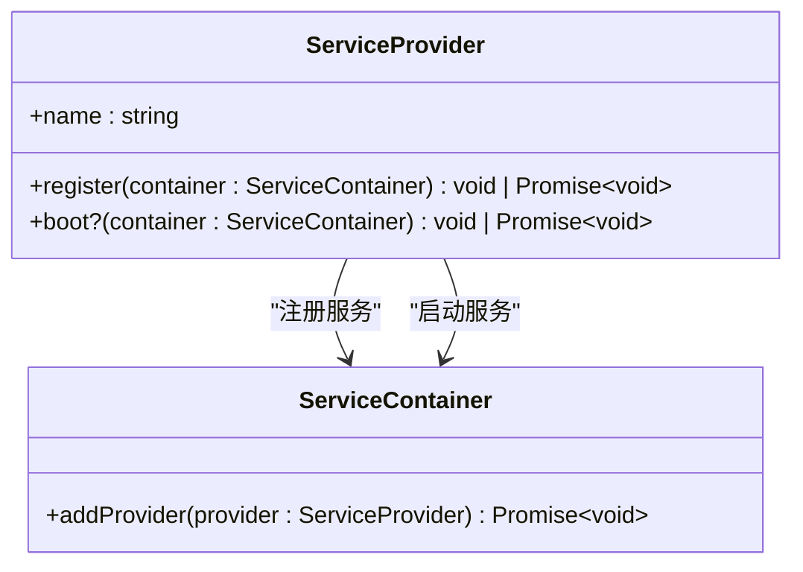

**图表来源**
- [types.ts](file://packages/core/src/container/types.ts#L35-L42)

### 提供者执行流程

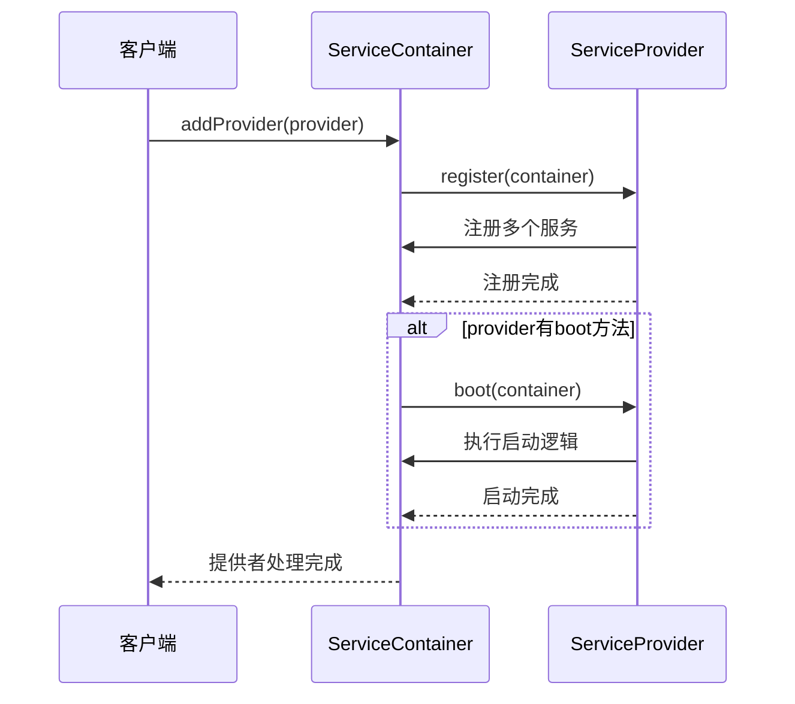

**图表来源**
- [service-container.ts](file://packages/core/src/container/service-container.ts#L240-L252)

### 使用示例

服务提供者模式在插件系统中得到广泛应用，如i18n插件所示：

**章节来源**
- [service-container.ts](file://packages/core/src/container/service-container.ts#L240-L252)
- [i18n-plugin.ts](file://packages/vue3/src/plugins/i18n-plugin.ts#L90-L96)

## 装饰器支持

服务容器提供了完整的装饰器语法支持，简化依赖注入的使用：

### 可注入装饰器

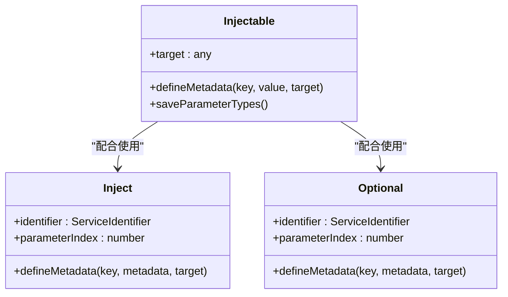

**图表来源**
- [decorators.ts](file://packages/core/src/container/decorators.ts#L26-L36)
- [decorators.ts](file://packages/core/src/container/decorators.ts#L56-L71)
- [decorators.ts](file://packages/core/src/container/decorators.ts#L91-L107)

### 装饰器使用示例

装饰器提供了简洁的依赖注入语法：

```typescript
// 类级别标记
@Injectable()
class UserService {
  constructor(
    @Inject('database') private db: Database,
    @Optional('logger') private logger?: Logger
  ) {}
}
```

### 元数据管理

装饰器系统维护以下元数据：

- **INJECTABLE**: 标记类是否可注入
- **PARAM_TYPES**: 构造函数参数类型
- **INJECT**: 注入元数据数组

**章节来源**
- [decorators.ts](file://packages/core/src/container/decorators.ts#L26-L156)

## 异步解析机制

服务容器同时支持同步和异步两种解析方式，满足不同场景的需求：

### 同步解析 vs 异步解析

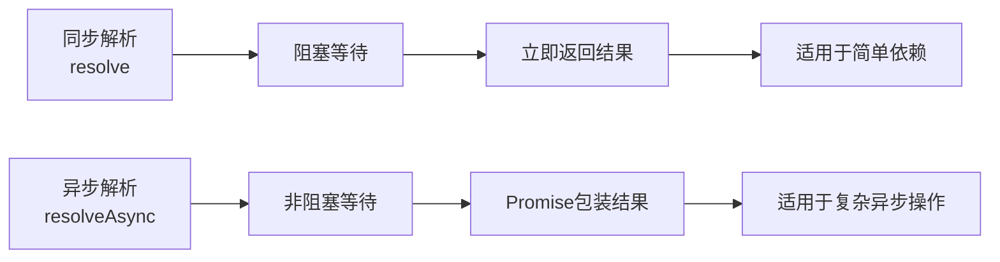

**图表来源**
- [service-container.ts](file://packages/core/src/container/service-container.ts#L143-L175)
- [service-container.ts](file://packages/core/src/container/service-container.ts#L179-L218)

### 异步实例创建

异步解析使用专门的createInstanceAsync方法：

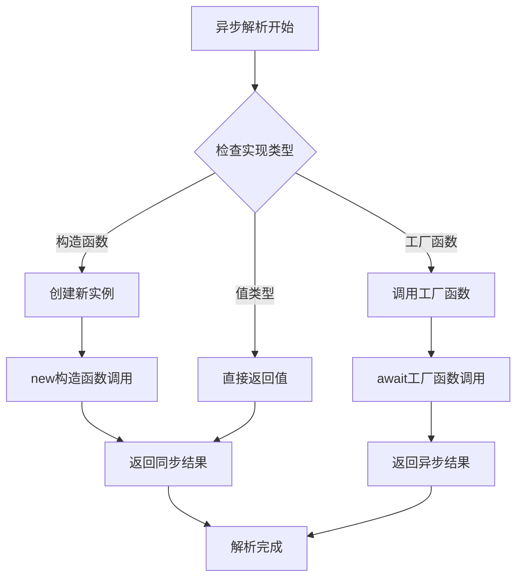

**图表来源**
- [service-container.ts](file://packages/core/src/container/service-container.ts#L426-L443)

### 使用场景对比

| 特性 | 同步解析 | 异步解析 |
|------|----------|----------|
| 性能 | 更快 | 稍慢（Promise开销） |
| 场景 | 简单依赖注入 | 需要异步初始化的服务 |
| 错误处理 | 同步异常 | Promise rejection |
| 并发支持 | 不支持 | 支持并发解析 |

**章节来源**
- [service-container.ts](file://packages/core/src/container/service-container.ts#L143-L175)
- [service-container.ts](file://packages/core/src/container/service-container.ts#L179-L218)

## 性能考虑

服务容器在设计时充分考虑了性能优化：

### 缓存策略

1. **单例缓存**：避免重复创建昂贵的单例服务
2. **作用域缓存**：在作用域内共享实例，减少创建开销
3. **描述符缓存**：避免重复解析服务描述符

### 内存管理

1. **clear方法**：提供资源清理功能，防止内存泄漏
2. **弱引用模式**：避免循环引用导致的内存泄漏
3. **及时释放**：解析完成后立即清理临时状态

### 性能优化技巧

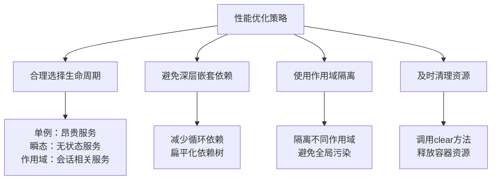

## 故障排除指南

### 常见问题及解决方案

#### 循环依赖错误

**问题**：`Circular dependency detected: A → B → C → A`

**原因**：服务A依赖B，B依赖C，C又依赖A

**解决方案**：
1. 重构代码，消除循环依赖
2. 使用Optional装饰器声明可选依赖
3. 重新设计服务架构

#### 服务未注册错误

**问题**：`Service "serviceName" not registered`

**原因**：尝试解析未注册的服务

**解决方案**：
1. 检查服务是否正确注册
2. 使用has方法检查服务是否存在
3. 确保服务提供者已正确加载

#### 内存泄漏问题

**问题**：容器占用内存持续增长

**原因**：未正确清理容器或存在循环引用

**解决方案**：
1. 调用clear方法清理容器
2. 检查是否有未释放的引用
3. 使用WeakMap替代普通Map

**章节来源**
- [service-container.ts](file://packages/core/src/container/service-container.ts#L147-L153)
- [service-container.ts](file://packages/core/src/container/service-container.ts#L268-L273)

## 结论

服务容器（ServiceContainerImpl）是LDesign引擎框架中的核心基础设施，提供了完整而强大的依赖注入解决方案。通过其精心设计的架构和丰富的功能特性，服务容器能够有效管理复杂的依赖关系，支持多种生命周期策略，并提供完善的错误检测和性能优化机制。

### 主要优势

1. **类型安全**：基于TypeScript的强类型系统
2. **灵活配置**：支持多种生命周期和注册方式
3. **智能检测**：完善的循环依赖检测机制
4. **性能优化**：多层次缓存和资源管理
5. **易于使用**：简洁的API和装饰器支持

### 最佳实践建议

1. **合理选择生命周期**：根据服务特性选择合适的生命周期策略
2. **避免循环依赖**：遵循依赖倒置原则，重构可能导致循环依赖的代码
3. **及时清理资源**：在适当的时候调用clear方法释放资源
4. **使用装饰器**：利用装饰器语法简化依赖注入代码
5. **分层设计**：合理使用作用域隔离，避免全局污染

服务容器的设计体现了现代软件架构的最佳实践，为构建可维护、可扩展的应用程序提供了坚实的基础。通过深入理解和正确使用服务容器，开发者可以构建出高质量、高性能的软件系统。