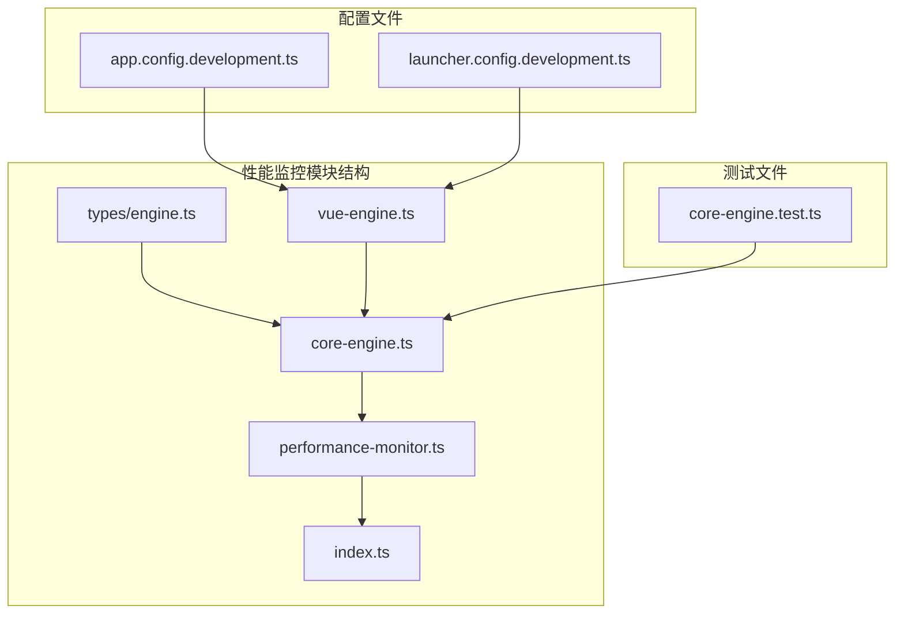
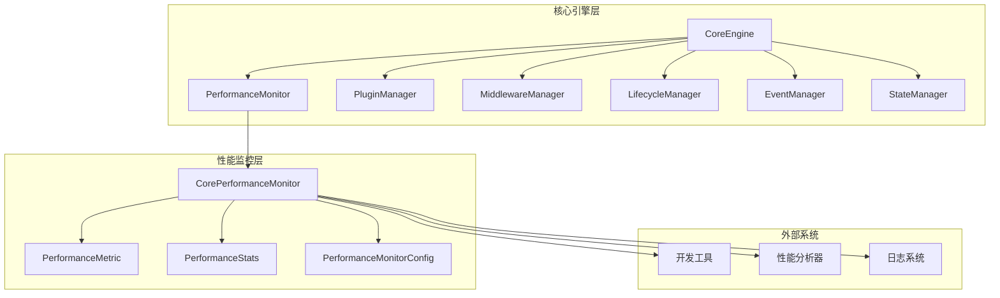
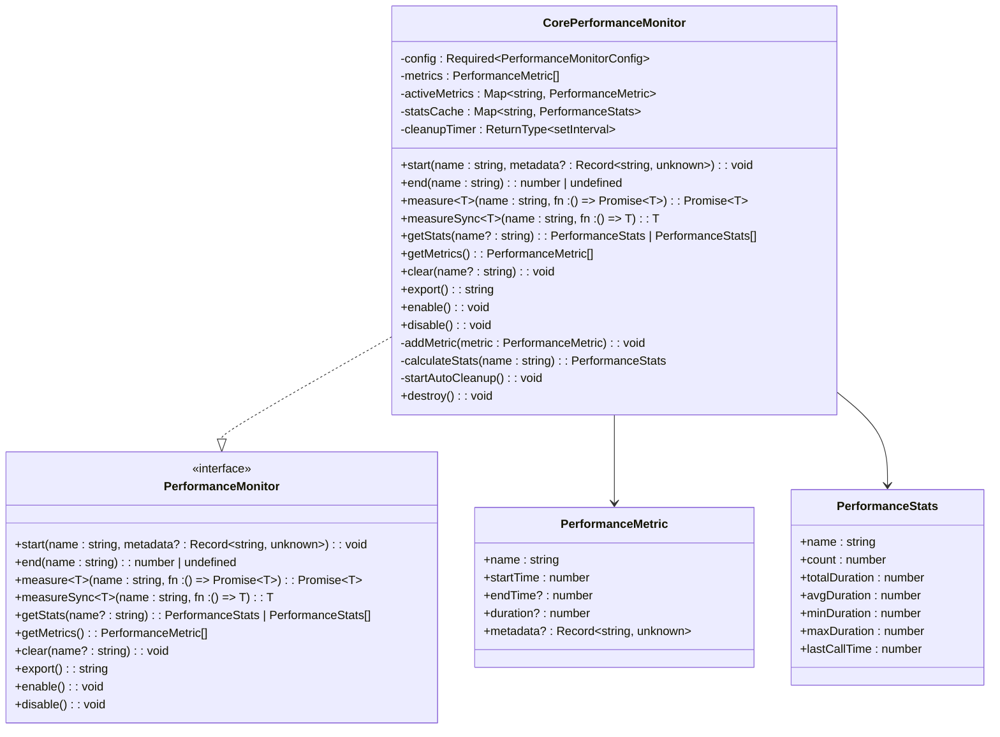
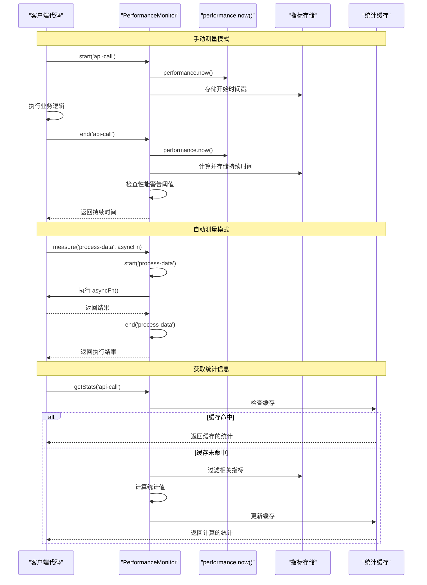
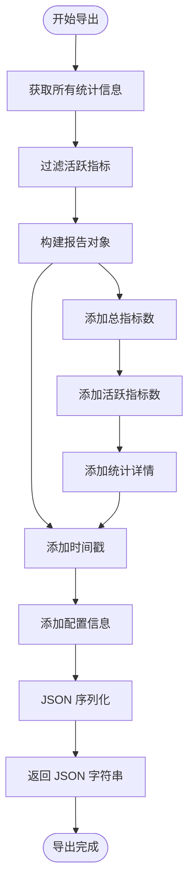
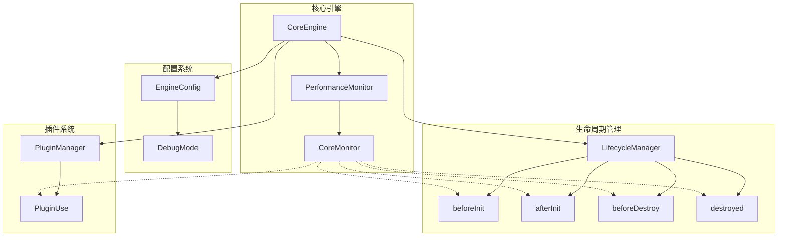

# 性能监控

<cite>
**本文档中引用的文件**
- [packages/core/src/engine/performance/performance-monitor.ts](file://packages/core/src/engine/performance/performance-monitor.ts)
- [packages/core/src/engine/performance/index.ts](file://packages/core/src/engine/performance/index.ts)
- [packages/core/src/engine/core-engine.ts](file://packages/core/src/engine/core-engine.ts)
- [packages/core/src/types/engine.ts](file://packages/core/src/types/engine.ts)
- [packages/vue3/src/engine/vue-engine.ts](file://packages/vue3/src/engine/vue-engine.ts)
- [packages/core/src/__tests__/core-engine.test.ts](file://packages/core/src/__tests__/core-engine.test.ts)
- [packages/vue3/example/.ldesign/app.config.development.ts](file://packages/vue3/example/.ldesign/app.config.development.ts)
- [packages/vue3/example/.ldesign/launcher.config.development.ts](file://packages/vue3/example/.ldesign/launcher.config.development.ts)
</cite>

## 目录
1. [简介](#简介)
2. [项目结构](#项目结构)
3. [核心组件](#核心组件)
4. [架构概览](#架构概览)
5. [详细组件分析](#详细组件分析)
6. [依赖关系分析](#依赖关系分析)
7. [性能考虑](#性能考虑)
8. [故障排除指南](#故障排除指南)
9. [结论](#结论)

## 简介

性能监控模块是 LDesign Engine 核心引擎的重要组成部分，提供了全面的运行时性能指标收集、统计分析和调试支持功能。该模块能够实时监控引擎各子系统的运行状态，包括初始化耗时、插件加载时间、事件触发频率等关键指标，为开发者提供深入的性能洞察和问题诊断能力。

性能监控模块采用高精度时间测量技术，支持手动和自动两种测量模式，具备内存优化的 LRU 缓存策略，并提供丰富的统计信息输出功能。在调试模式下，它能够生成详细的性能报告，帮助开发者识别性能瓶颈并进行针对性优化。

## 项目结构

性能监控模块位于核心引擎的专门目录中，采用清晰的模块化设计：

**图表来源**
- [packages/core/src/engine/performance/performance-monitor.ts](file://packages/core/src/engine/performance/performance-monitor.ts#L1-L561)
- [packages/core/src/engine/core-engine.ts](file://packages/core/src/engine/core-engine.ts#L1-L364)

**章节来源**
- [packages/core/src/engine/performance/performance-monitor.ts](file://packages/core/src/engine/performance/performance-monitor.ts#L1-L561)
- [packages/core/src/engine/performance/index.ts](file://packages/core/src/engine/performance/index.ts#L1-L9)

## 核心组件

性能监控模块包含以下核心组件：

### 性能监控管理器 (CorePerformanceMonitor)
这是性能监控模块的核心实现类，提供完整的性能测量和统计功能。它支持高精度时间测量、自动统计计算、内存优化的 LRU 缓存策略，以及性能警告机制。

### 性能指标数据结构
定义了性能指标的基本数据结构，包括指标名称、开始时间戳、结束时间戳、持续时间和额外元数据。

### 性能统计数据结构
提供了详细的统计信息，包括调用次数、总耗时、平均耗时、最小耗时、最大耗时和最后一次调用时间。

### 性能监控配置
支持灵活的配置选项，包括启用状态、调试模式、最大保存指标数量、性能警告阈值和自动清理策略。

**章节来源**
- [packages/core/src/engine/performance/performance-monitor.ts](file://packages/core/src/engine/performance/performance-monitor.ts#L118-L561)

## 架构概览

性能监控模块采用分层架构设计，与核心引擎紧密集成：

**图表来源**
- [packages/core/src/engine/core-engine.ts](file://packages/core/src/engine/core-engine.ts#L75-L135)
- [packages/core/src/engine/performance/performance-monitor.ts](file://packages/core/src/engine/performance/performance-monitor.ts#L118-L153)

## 详细组件分析

### 性能监控管理器实现

CorePerformanceMonitor 类是性能监控模块的核心实现，提供了完整的性能测量和统计功能：

**图表来源**
- [packages/core/src/engine/performance/performance-monitor.ts](file://packages/core/src/engine/performance/performance-monitor.ts#L66-L87)
- [packages/core/src/engine/performance/performance-monitor.ts](file://packages/core/src/engine/performance/performance-monitor.ts#L118-L561)

### 性能测量流程

性能监控模块支持多种测量模式，每种都有其特定的使用场景：

**图表来源**
- [packages/core/src/engine/performance/performance-monitor.ts](file://packages/core/src/engine/performance/performance-monitor.ts#L155-L233)
- [packages/core/src/engine/performance/performance-monitor.ts](file://packages/core/src/engine/performance/performance-monitor.ts#L235-L295)

### 数据采集粒度和存储方式

性能监控模块采用多层次的数据采集和存储策略：

| 数据类型 | 存储方式 | 内存策略 | 清理机制 |
|---------|---------|---------|---------|
| 活跃指标 | Map\<string, PerformanceMetric\> | 实时存储 | 手动清理 |
| 已完成指标 | PerformanceMetric[] | LRU 缓存 | 自动清理 |
| 统计缓存 | Map\<string, PerformanceStats\> | 按需计算 | 手动清理 |
| 配置参数 | Required\<PerformanceMonitorConfig\> | 静态配置 | 进程生命周期 |

**章节来源**
- [packages/core/src/engine/performance/performance-monitor.ts](file://packages/core/src/engine/performance/performance-monitor.ts#L122-L130)
- [packages/core/src/engine/performance/performance-monitor.ts](file://packages/core/src/engine/performance/performance-monitor.ts#L441-L455)

### 报告机制和导出功能

性能监控模块提供了完整的报告生成功能：

**图表来源**
- [packages/core/src/engine/performance/performance-monitor.ts](file://packages/core/src/engine/performance/performance-monitor.ts#L378-L402)

**章节来源**
- [packages/core/src/engine/performance/performance-monitor.ts](file://packages/core/src/engine/performance/performance-monitor.ts#L378-L402)

### 调试模式下的性能分析

在调试模式下，性能监控模块提供了丰富的调试信息输出：

| 功能 | 输出内容 | 触发条件 |
|------|---------|---------|
| 开始测量日志 | "Started measuring: {name}" | 调用 start() 方法 |
| 结束测量日志 | "Finished measuring: {name} ({duration}ms)" | 调用 end() 方法 |
| 性能警告 | "Slow operation detected: {name} took {duration}ms" | 持续时间超过阈值 |
| 统计信息 | 各管理器状态快照 | 调用 logStats() 方法 |
| 清理通知 | "Auto cleanup removed {count} old metrics" | 自动清理完成 |

**章节来源**
- [packages/core/src/engine/core-engine.ts](file://packages/core/src/engine/core-engine.ts#L319-L327)
- [packages/core/src/engine/performance/performance-monitor.ts](file://packages/core/src/engine/performance/performance-monitor.ts#L179-L230)

## 依赖关系分析

性能监控模块与核心引擎的其他组件存在密切的依赖关系：

**图表来源**
- [packages/core/src/engine/core-engine.ts](file://packages/core/src/engine/core-engine.ts#L118-L135)
- [packages/core/src/engine/performance/performance-monitor.ts](file://packages/core/src/engine/performance/performance-monitor.ts#L139-L153)

**章节来源**
- [packages/core/src/engine/core-engine.ts](file://packages/core/src/engine/core-engine.ts#L118-L135)
- [packages/core/src/engine/performance/performance-monitor.ts](file://packages/core/src/engine/performance/performance-monitor.ts#L139-L153)

## 性能考虑

性能监控模块在设计时充分考虑了性能影响，采用了多种优化策略：

### 内存优化策略
- **LRU 缓存**：使用循环队列策略限制指标存储数量，避免内存无限增长
- **及时清理**：支持手动和自动清理机制，定期移除过期指标
- **统计缓存**：按需计算统计信息，减少重复计算开销

### 时间测量精度
- **高精度计时**：使用 `performance.now()` 提供毫秒级精度的时间测量
- **微优化**：最小化测量过程中的额外开销，确保测量结果的准确性

### 自动清理机制
- **定时清理**：默认每分钟检查并清理过期指标
- **阈值控制**：默认保留最近 5 分钟内的指标数据
- **配置灵活**：支持自定义清理间隔和阈值

## 故障排除指南

### 常见问题及解决方案

| 问题类型 | 症状 | 可能原因 | 解决方案 |
|---------|------|---------|---------|
| 性能监控未启动 | 没有性能指标记录 | enabled: false | 检查配置，确保 enabled: true |
| 内存使用过高 | 内存持续增长 | 指标积累过多 | 调整 maxMetrics 配置或启用自动清理 |
| 统计信息不准确 | 平均耗时异常 | 指标被意外修改 | 检查指标存储状态，必要时调用 clear() |
| 性能警告频繁 | 控制台大量警告 | 操作耗时超过阈值 | 调整 warningThreshold 或优化相关操作 |

### 调试技巧

1. **启用调试模式**：设置 `debug: true` 查看详细日志输出
2. **检查配置**：验证性能监控配置是否正确
3. **监控指标数量**：使用 `getMetrics().length` 检查当前指标数量
4. **分析统计信息**：使用 `getStats()` 分析性能趋势

**章节来源**
- [packages/core/src/engine/performance/performance-monitor.ts](file://packages/core/src/engine/performance/performance-monitor.ts#L140-L153)
- [packages/core/src/engine/performance/performance-monitor.ts](file://packages/core/src/engine/performance/performance-monitor.ts#L495-L515)

## 结论

LDesign Engine 的性能监控模块是一个功能完善、设计精良的性能分析工具。它不仅提供了基础的性能测量功能，还包含了丰富的统计分析能力和灵活的配置选项。通过与核心引擎的深度集成，它能够在不影响应用正常运行的前提下，为开发者提供宝贵的性能洞察。

该模块的主要优势包括：
- **高精度测量**：基于 `performance.now()` 的毫秒级精度时间测量
- **智能缓存**：LRU 缓存策略确保内存使用的合理性
- **灵活配置**：支持多种配置选项满足不同场景需求
- **自动清理**：智能的自动清理机制避免内存泄漏
- **丰富统计**：提供全面的性能统计信息
- **调试友好**：详细的调试日志和错误提示

在生产环境中，性能监控模块能够帮助开发者快速定位性能瓶颈，优化应用性能，提升用户体验。通过合理的配置和使用，它将成为现代 Web 应用开发中不可或缺的性能分析工具。