# 插件定义

<cite>
**本文档引用的文件**
- [define-plugin.ts](file://packages\core\src\plugin\define-plugin.ts)
- [plugin.ts](file://packages\core\src\types\plugin.ts)
- [plugin-manager.ts](file://packages\core\src\plugin\plugin-manager.ts)
- [i18n-plugin.ts](file://packages\vue3\src\plugins\i18n-plugin.ts)
- [router-plugin.ts](file://packages\vue3\src\plugins\router-plugin.ts)
- [vue-engine.ts](file://packages\vue3\src\engine\vue-engine.ts)
- [plugin-api.ts](file://packages\core\src\types\plugin-api.ts)
- [plugin-api-registry.ts](file://packages\core\src\plugin\plugin-api-registry.ts)
</cite>

## 目录
1. [引言](#引言)
2. [插件定义机制](#插件定义机制)
3. [核心组件分析](#核心组件分析)
4. [插件生命周期](#插件生命周期)
5. [依赖管理](#依赖管理)
6. [插件间通信](#插件间通信)
7. [最佳实践](#最佳实践)
8. [常见错误与解决方案](#常见错误与解决方案)
9. [结论](#结论)

## 引言
本文档深入解析 LDesign 引擎中的插件定义机制（definePlugin）的实现原理与使用方式。通过分析核心源码，详细说明如何创建类型安全的插件实例，包括插件元信息、依赖声明、安装与卸载生命周期钩子的定义。同时探讨插件配置传递、引擎上下文访问以及泛型参数在类型推导中的作用。

**Section sources**
- [define-plugin.ts](file://packages\core\src\plugin\define-plugin.ts)

## 插件定义机制

插件定义机制的核心是 `definePlugin` 函数，它提供了一种类型安全的方式来创建插件实例。该函数本质上是一个类型守卫，确保插件对象符合 `Plugin` 接口的定义。

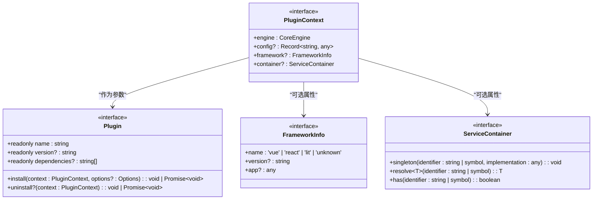

**Diagram sources**
- [plugin.ts](file://packages\core\src\types\plugin.ts)

**Section sources**
- [define-plugin.ts](file://packages\core\src\plugin\define-plugin.ts)
- [plugin.ts](file://packages\core\src\types\plugin.ts)

## 核心组件分析

### definePlugin 函数实现
`definePlugin` 函数是一个简单的类型守卫函数，其主要作用是确保传入的插件对象符合 `Plugin` 接口的类型定义。该函数不进行任何运行时转换或处理，只是原样返回传入的插件对象。

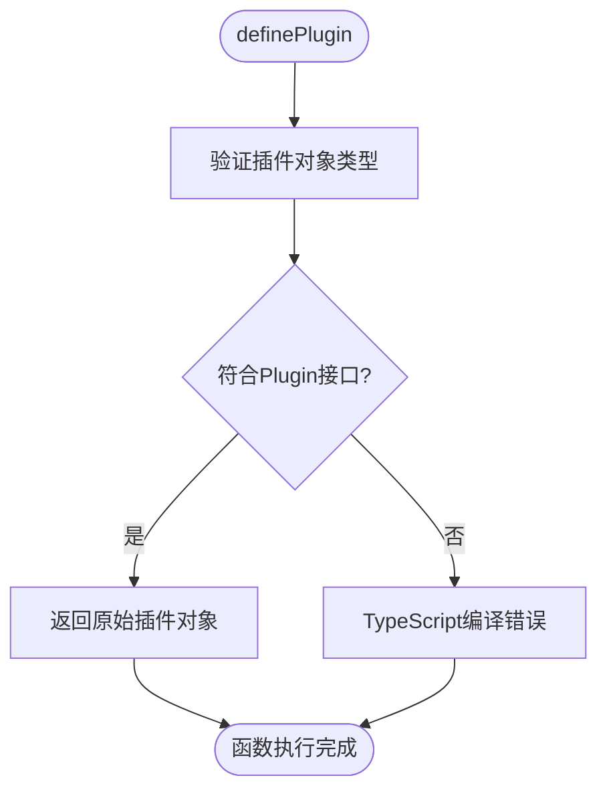

**Diagram sources**
- [define-plugin.ts](file://packages\core\src\plugin\define-plugin.ts)

### Plugin 接口定义
`Plugin` 接口定义了插件的基本结构，包括名称、版本、依赖声明以及安装和卸载生命周期钩子。

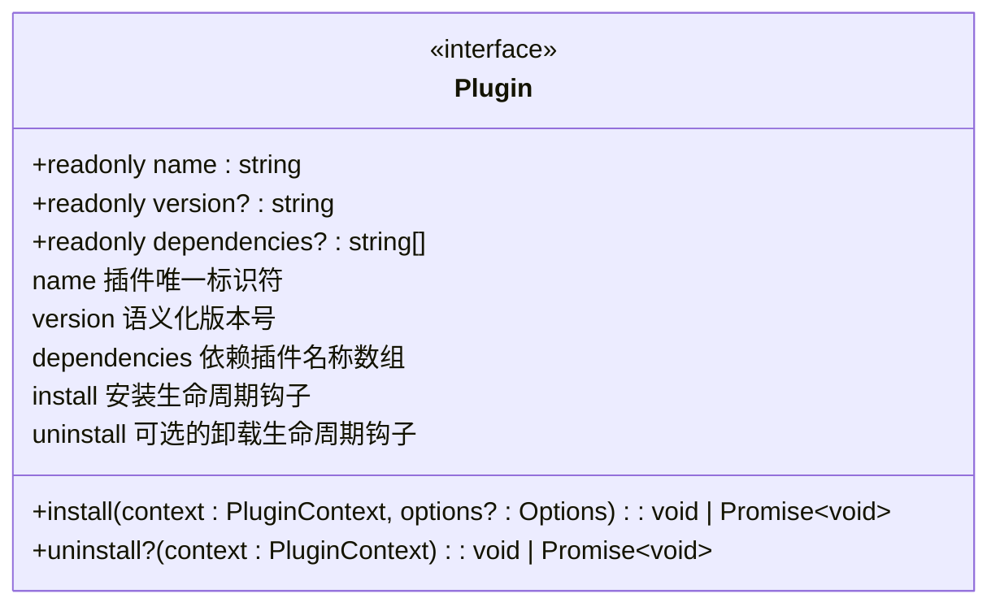

**Diagram sources**
- [plugin.ts](file://packages\core\src\types\plugin.ts)

**Section sources**
- [plugin.ts](file://packages\core\src\types\plugin.ts)

## 插件生命周期

### 安装流程
插件的安装流程由 `PluginManager` 控制，遵循严格的顺序和依赖检查。

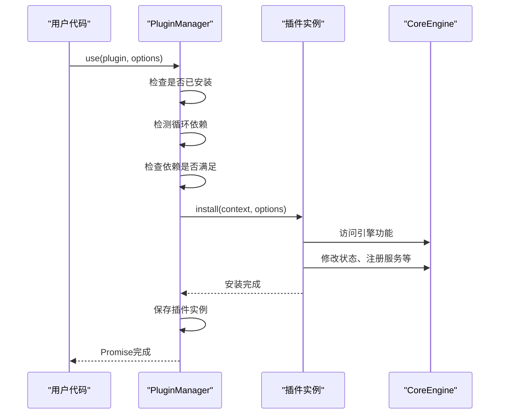

**Diagram sources**
- [plugin-manager.ts](file://packages\core\src\plugin\plugin-manager.ts)

### 卸载流程
插件的卸载流程同样由 `PluginManager` 管理，确保不会破坏依赖它的其他插件。

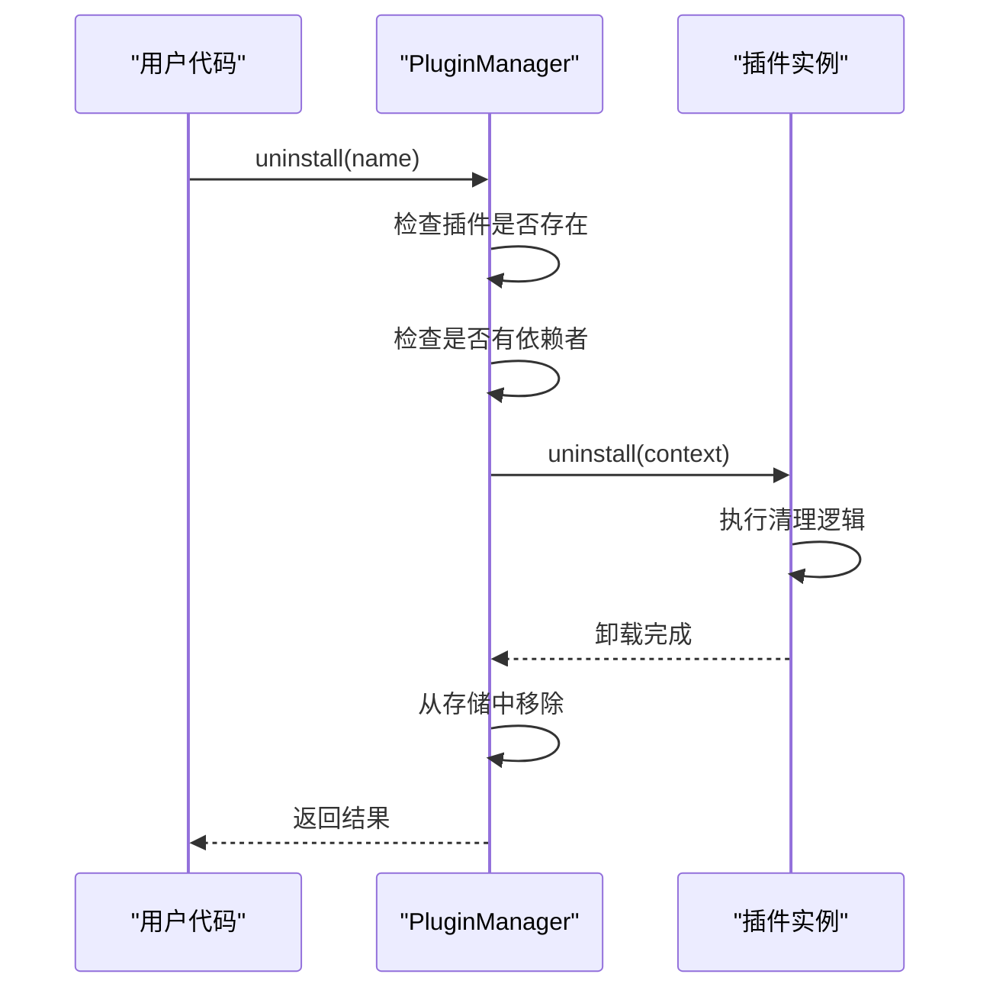

**Diagram sources**
- [plugin-manager.ts](file://packages\core\src\plugin\plugin-manager.ts)

**Section sources**
- [plugin-manager.ts](file://packages\core\src\plugin\plugin-manager.ts)

## 依赖管理

### 依赖声明与解析
插件系统支持声明式依赖管理，确保插件按正确的顺序安装。

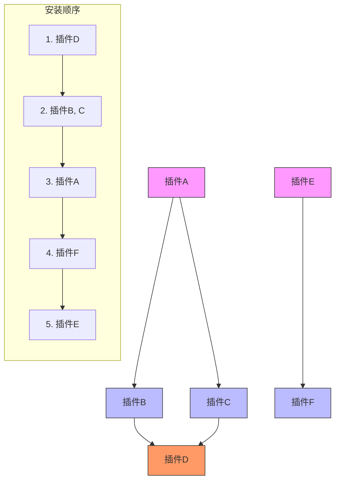

**Diagram sources**
- [plugin-manager.ts](file://packages\core\src\plugin\plugin-manager.ts)

### 循环依赖检测
系统内置了循环依赖检测机制，防止插件安装陷入无限循环。

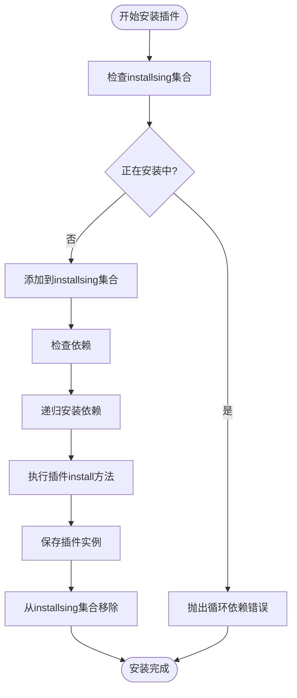

**Diagram sources**
- [plugin-manager.ts](file://packages\core\src\plugin\plugin-manager.ts)

**Section sources**
- [plugin-manager.ts](file://packages\core\src\plugin\plugin-manager.ts)

## 插件间通信

### 插件API注册表
通过 `PluginAPIRegistry` 实现类型安全的插件间通信。

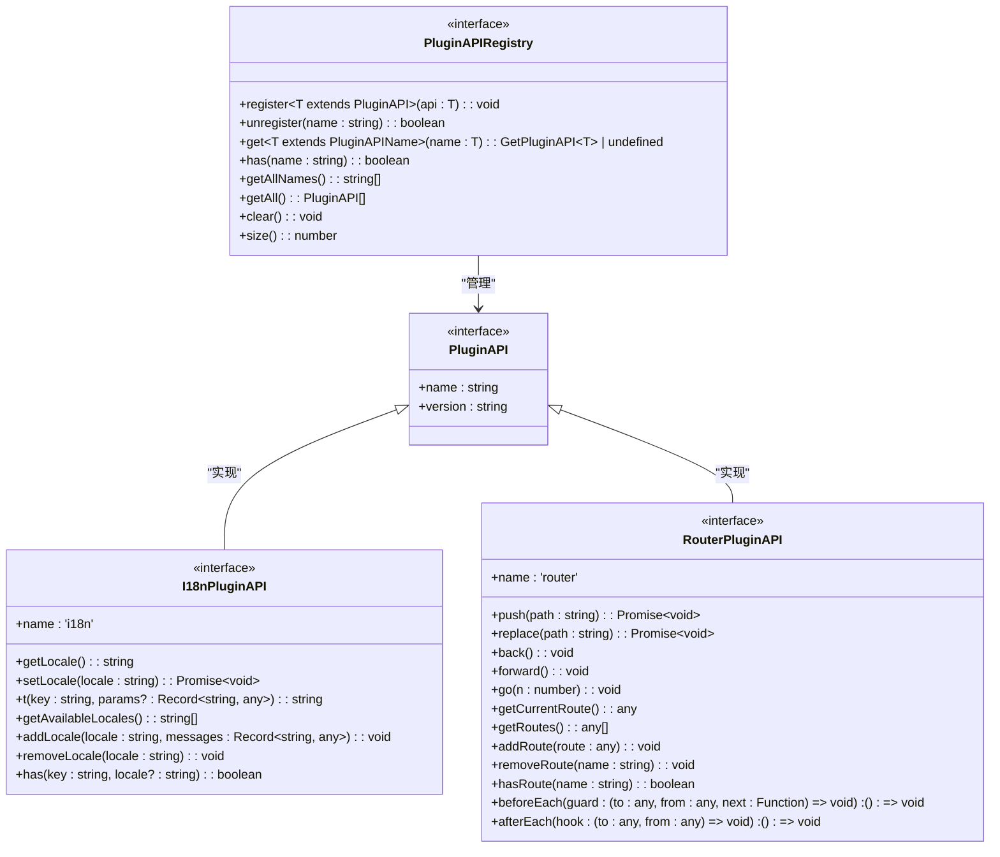

**Diagram sources**
- [plugin-api-registry.ts](file://packages\core\src\plugin\plugin-api-registry.ts)
- [plugin-api.ts](file://packages\core\src\types\plugin-api.ts)

**Section sources**
- [plugin-api-registry.ts](file://packages\core\src\plugin\plugin-api-registry.ts)
- [plugin-api.ts](file://packages\core\src\types\plugin-api.ts)

## 最佳实践

### 命名规范
遵循统一的命名规范有助于避免冲突和提高可维护性。

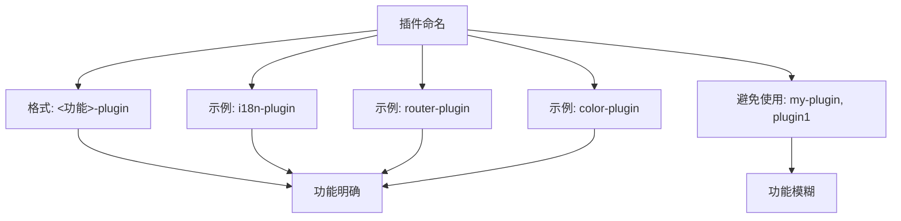

**Diagram sources**
- [i18n-plugin.ts](file://packages\vue3\src\plugins\i18n-plugin.ts)
- [router-plugin.ts](file://packages\vue3\src\plugins\router-plugin.ts)

### 版本管理
采用语义化版本控制，明确版本变更的影响。

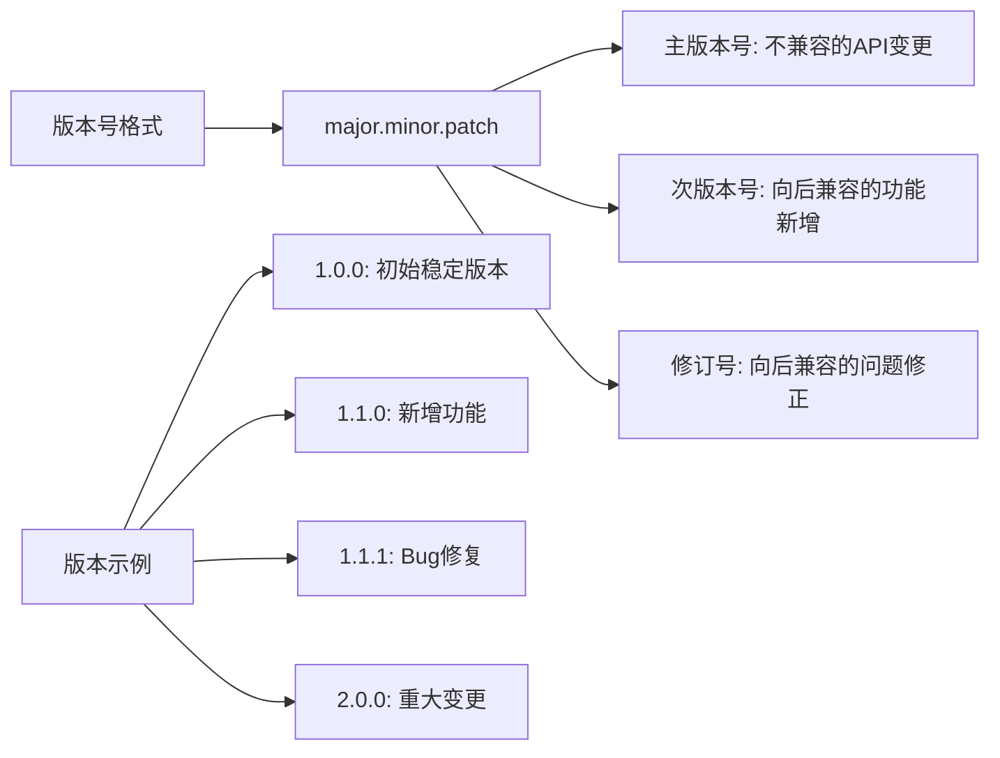

**Diagram sources**
- [i18n-plugin.ts](file://packages\vue3\src\plugins\i18n-plugin.ts)
- [router-plugin.ts](file://packages\vue3\src\plugins\router-plugin.ts)

### 依赖声明策略
合理声明依赖关系，确保插件正常工作。

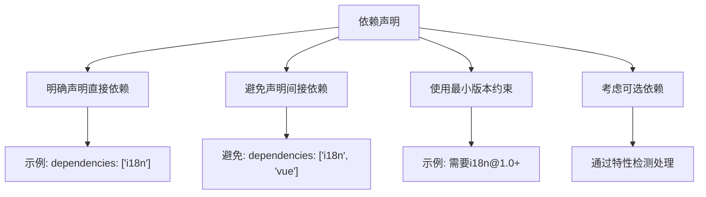

**Section sources**
- [i18n-plugin.ts](file://packages\vue3\src\plugins\i18n-plugin.ts)
- [router-plugin.ts](file://packages\vue3\src\plugins\router-plugin.ts)

## 常见错误与解决方案

### 插件名称冲突
当两个插件使用相同名称时会导致安装失败。

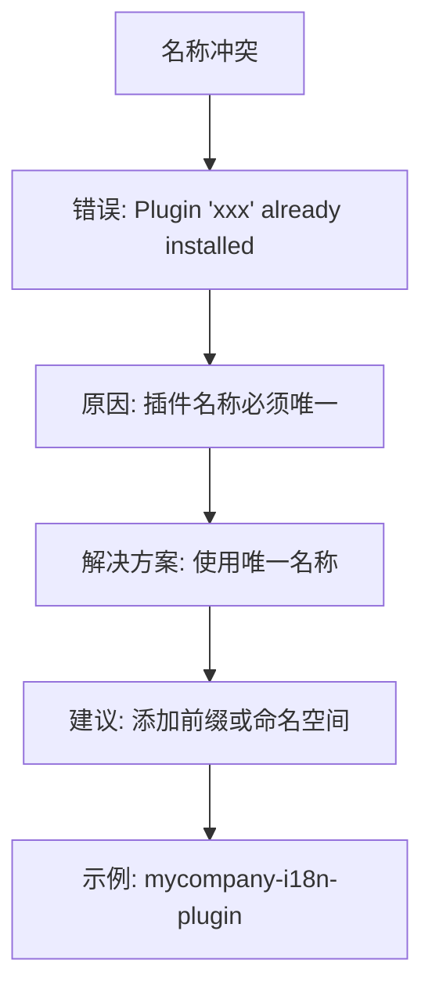

**Diagram sources**
- [plugin-manager.ts](file://packages\core\src\plugin\plugin-manager.ts)

### 依赖循环
插件间形成循环依赖会导致安装失败。

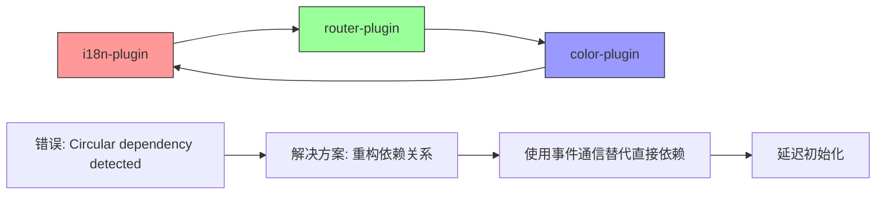

**Diagram sources**
- [plugin-manager.ts](file://packages\core\src\plugin\plugin-manager.ts)

### 上下文访问失败
在不恰当的时机访问引擎上下文会导致错误。

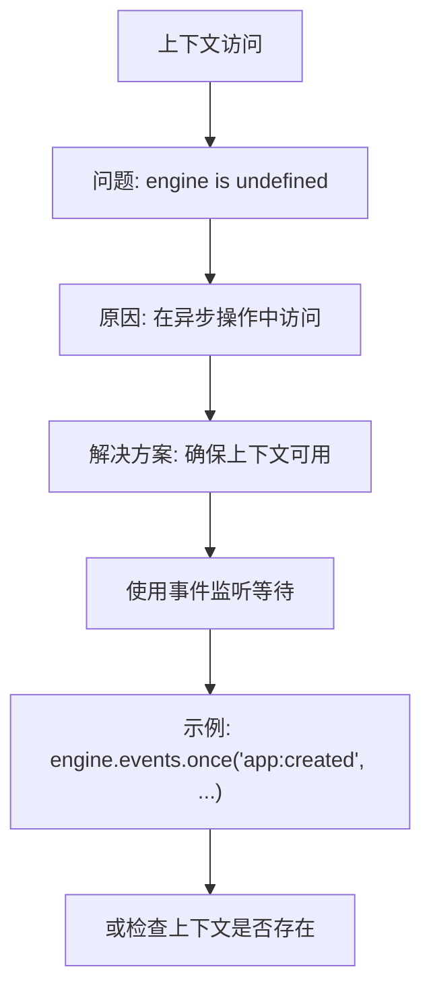

**Diagram sources**
- [i18n-plugin.ts](file://packages\vue3\src\plugins\i18n-plugin.ts)

**Section sources**
- [plugin-manager.ts](file://packages\core\src\plugin\plugin-manager.ts)
- [i18n-plugin.ts](file://packages\vue3\src\plugins\i18n-plugin.ts)
- [router-plugin.ts](file://packages\vue3\src\plugins\router-plugin.ts)

## 结论
LDesign 引擎的插件系统提供了一套完整、类型安全的插件定义和管理机制。通过 `definePlugin` 函数，开发者可以创建符合规范的插件实例，利用丰富的上下文访问引擎功能。系统内置的依赖管理和生命周期控制确保了插件的稳定运行，而类型安全的 API 注册表则促进了插件间的良好通信。遵循命名规范、版本管理和依赖声明的最佳实践，可以构建出可维护、可扩展的插件生态系统。