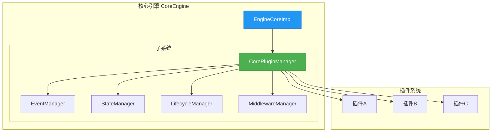
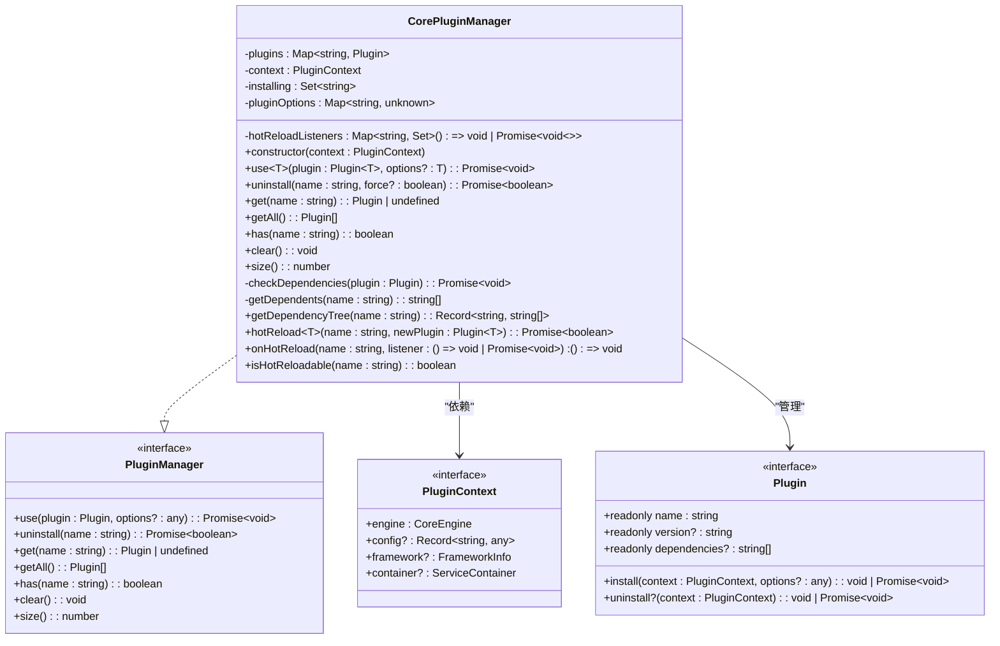
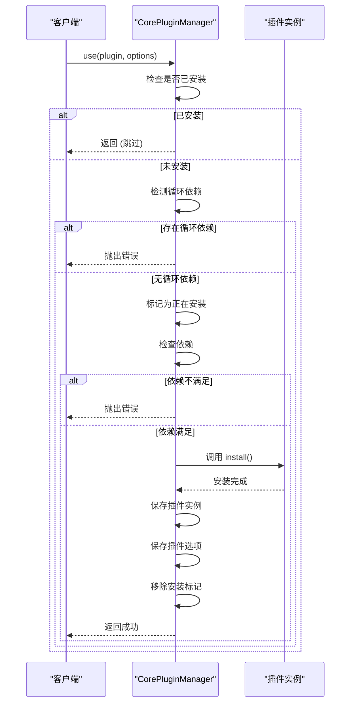
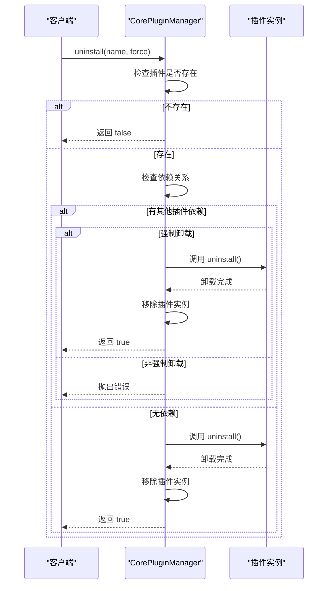
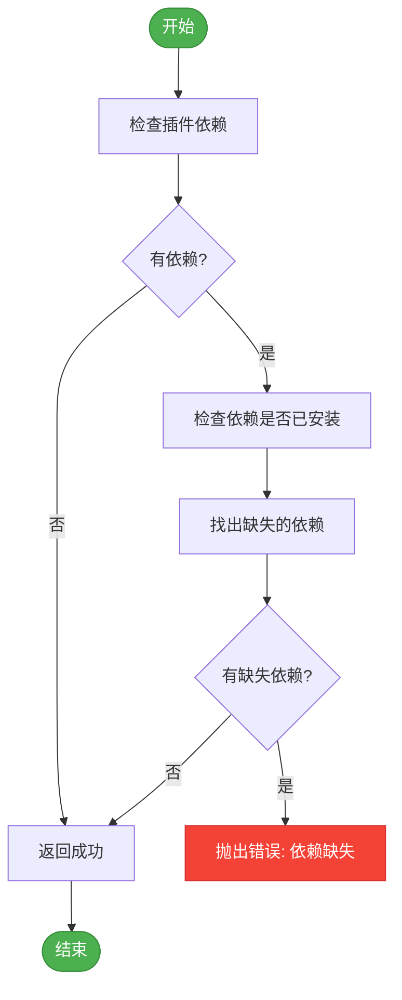
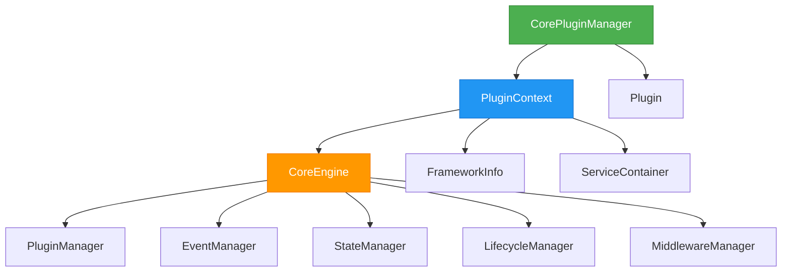

# 插件管理器

<cite>
**本文档引用的文件**
- [plugin-manager.ts](file://packages\core\src\plugin\plugin-manager.ts)
- [types.ts](file://packages\core\src\types\plugin.ts)
- [core-engine.ts](file://packages\core\src\engine\core-engine.ts)
- [i18n-plugin.ts](file://packages\vue3\src\plugins\i18n-plugin.ts)
- [router-plugin.ts](file://packages\vue3\src\plugins\router-plugin.ts)
- [core-engine.test.ts](file://packages\core\src\__tests__\core-engine.test.ts)
</cite>

## 目录
1. [简介](#简介)
2. [核心组件分析](#核心组件分析)
3. [架构概览](#架构概览)
4. [详细组件分析](#详细组件分析)
5. [依赖分析](#依赖分析)
6. [性能考虑](#性能考虑)
7. [故障排除指南](#故障排除指南)
8. [结论](#结论)

## 简介
CorePluginManager 类是 LDesign Engine 插件系统的核心调度中心，负责管理所有插件的生命周期，包括注册、卸载、查询和依赖管理。该类实现了完整的插件管理系统，支持依赖检查、循环依赖检测、热重载等高级功能。作为引擎系统的关键组件，它确保了插件能够按正确的顺序安装和卸载，维护了系统的稳定性和可扩展性。

## 核心组件分析
CorePluginManager 类是插件系统的核心实现，提供了插件注册（use）、卸载（uninstall）、查询（get、getAll）和依赖管理等关键功能。该类通过 Map 和 Set 数据结构高效地管理已安装的插件和正在安装的插件集合，确保了操作的原子性和一致性。

**核心组件**
- **plugins**: 使用 Map 存储已安装的插件，以插件名称为键，插件实例为值，提供 O(1) 时间复杂度的查找性能
- **installing**: 使用 Set 存储正在安装的插件名称，用于检测循环依赖，防止系统陷入无限递归
- **pluginOptions**: 使用 Map 存储插件的配置选项，支持热重载时恢复原始配置
- **hotReloadListeners**: 使用 Map 存储热重载监听器，允许其他组件在插件热重载时执行特定逻辑

**Section sources**
- [plugin-manager.ts](file://packages\core\src\plugin\plugin-manager.ts#L41-L507)

## 架构概览
CorePluginManager 作为插件系统的核心，与其他引擎组件紧密协作，形成了一个完整的应用架构。它通过插件上下文与核心引擎通信，管理插件的生命周期，并与其他系统如事件管理器、状态管理器进行交互。

**Diagram sources**
- [core-engine.ts](file://packages\core\src\engine\core-engine.ts#L75-L364)
- [plugin-manager.ts](file://packages\core\src\plugin\plugin-manager.ts#L41-L507)

## 详细组件分析
### CorePluginManager 类分析
CorePluginManager 类实现了 PluginManager 接口，提供了完整的插件管理功能。其设计遵循单一职责原则，专注于插件的生命周期管理。

#### 类结构与关系

**Diagram sources**
- [plugin-manager.ts](file://packages\core\src\plugin\plugin-manager.ts#L41-L507)
- [types.ts](file://packages\core\src\types\plugin.ts#L37-L77)

#### 插件安装流程

**Diagram sources**
- [plugin-manager.ts](file://packages\core\src\plugin\plugin-manager.ts#L100-L200)

#### 插件卸载流程

**Diagram sources**
- [plugin-manager.ts](file://packages\core\src\plugin\plugin-manager.ts#L201-L300)

#### 依赖管理流程

**Diagram sources**
- [plugin-manager.ts](file://packages\core\src\plugin\plugin-manager.ts#L400-L430)

## 依赖分析
CorePluginManager 类与其他组件存在明确的依赖关系，形成了一个层次化的架构。它依赖于 PluginContext 获取引擎实例和配置信息，同时管理着各种插件实例。

**Diagram sources**
- [plugin-manager.ts](file://packages\core\src\plugin\plugin-manager.ts#L41-L507)
- [types.ts](file://packages\core\src\types\plugin.ts#L22-L344)

## 性能考虑
CorePluginManager 在设计时考虑了性能优化，采用了高效的数据结构和算法。使用 Map 和 Set 数据结构确保了插件查找和状态检查的 O(1) 时间复杂度。对于依赖树的构建，虽然采用了递归算法，但由于插件依赖层级通常较浅，实际性能影响较小。

建议在生产环境中采用批量安装策略，将多个插件的安装操作合并，减少上下文切换和状态检查的开销。对于大型应用，可以考虑实现异步加载控制，按需加载非关键插件，优化启动性能。

## 故障排除指南
### 常见问题及解决方案
- **插件未注册**: 确保插件名称唯一，检查是否已在其他地方注册同名插件
- **依赖缺失**: 检查插件的 dependencies 数组，确保所有依赖插件已提前安装
- **卸载阻塞**: 检查是否有其他插件依赖待卸载的插件，使用 force 参数强制卸载或先卸载依赖插件
- **循环依赖**: 检查插件依赖关系，避免形成 A→B→A 这样的循环依赖链
- **热重载失败**: 确保插件实现了 uninstall 方法，以便在热重载时能够正确清理资源

**Section sources**
- [plugin-manager.ts](file://packages\core\src\plugin\plugin-manager.ts#L41-L507)
- [core-engine.test.ts](file://packages\core\src\__tests__\core-engine.test.ts#L44-L92)

## 结论
CorePluginManager 类作为插件系统的核心调度中心，提供了完整、健壮的插件管理功能。其设计充分考虑了依赖管理、循环检测和热重载等复杂场景，确保了系统的稳定性和可维护性。通过清晰的接口定义和高效的内部实现，该类为 LDesign Engine 的插件生态系统提供了坚实的基础。建议在实际使用中遵循最佳实践，合理规划插件依赖关系，充分利用其提供的各种功能，构建可扩展、易维护的应用系统。