# 核心引擎

<cite>
**本文档中引用的文件**
- [core-engine.ts](file://packages/core/src/engine/core-engine.ts)
- [index.ts](file://packages/core/src/engine/index.ts)
- [engine.ts](file://packages/core/src/types/engine.ts)
- [lifecycle-manager.ts](file://packages/core/src/lifecycle/lifecycle-manager.ts)
- [event-manager.ts](file://packages/core/src/event/event-manager.ts)
- [state-manager.ts](file://packages/core/src/state/state-manager.ts)
- [middleware-manager.ts](file://packages/core/src/middleware/middleware-manager.ts)
- [plugin-manager.ts](file://packages/core/src/plugin/plugin-manager.ts)
- [performance-monitor.ts](file://packages/core/src/performance/performance-monitor.ts)
- [core-engine.test.ts](file://packages/core/src/__tests__/core-engine.test.ts)
- [vue-engine.ts](file://packages/vue3/src/engine/vue-engine.ts)
- [use-engine.ts](file://packages/vue3/src/composables/use-engine.ts)
</cite>

## 目录
1. [简介](#简介)
2. [项目结构](#项目结构)
3. [核心组件](#核心组件)
4. [架构概览](#架构概览)
5. [详细组件分析](#详细组件分析)
6. [初始化流程](#初始化流程)
7. [生命周期管理](#生命周期管理)
8. [依赖关系分析](#依赖关系分析)
9. [性能优化](#性能优化)
10. [故障排除指南](#故障排除指南)
11. [总结](#总结)

## 简介

核心引擎（CoreEngine）是整个框架的中枢组件，作为应用运行时环境的核心控制器。它整合了插件管理器、事件管理器、生命周期管理器、状态管理器、中间件管理器和性能监控器等多个子系统，为应用程序提供统一的管理和协调能力。

核心引擎采用模块化设计，每个子系统都有明确的职责分工，通过统一的接口进行交互。这种设计使得引擎既具有高度的灵活性和可扩展性，又能保证系统的稳定性和性能。

## 项目结构

核心引擎的项目结构遵循清晰的模块化原则，主要分为以下几个层次：

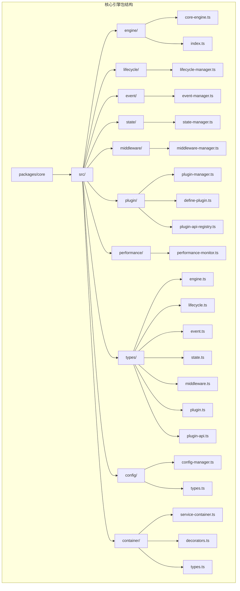

**图表来源**
- [core-engine.ts](file://packages/core/src/engine/core-engine.ts#L1-L50)
- [lifecycle-manager.ts](file://packages/core/src/lifecycle/lifecycle-manager.ts#L1-L50)
- [event-manager.ts](file://packages/core/src/event/event-manager.ts#L1-L50)

**章节来源**
- [core-engine.ts](file://packages/core/src/engine/core-engine.ts#L1-L364)
- [index.ts](file://packages/core/src/engine/index.ts#L1-L7)

## 核心组件

核心引擎由以下主要组件构成：

### 1. 引擎核心（EngineCore）
引擎的核心实现类，负责协调所有子系统的工作。它维护着引擎的配置、状态和生命周期。

### 2. 插件管理器（PluginManager）
负责插件的安装、卸载、依赖管理和生命周期控制。支持插件间的依赖关系和版本兼容性检查。

### 3. 中间件管理器（MiddlewareManager）
实现洋葱模型的中间件系统，支持优先级排序、错误处理和中间件链的执行。

### 4. 生命周期管理器（LifecycleManager）
提供统一的生命周期钩子管理，支持异步处理、错误隔离和一次性钩子。

### 5. 事件管理器（EventManager）
基于发布-订阅模式的事件系统，支持通配符事件、异步事件和错误隔离。

### 6. 状态管理器（StateManager）
高性能的状态管理系统，支持状态监听、批量更新和内存优化。

### 7. 性能监控器（PerformanceMonitor）
内置的性能监控和统计功能，提供高精度的时间测量和性能分析。

**章节来源**
- [core-engine.ts](file://packages/core/src/engine/core-engine.ts#L75-L100)
- [engine.ts](file://packages/core/src/types/engine.ts#L28-L51)

## 架构概览

核心引擎采用分层架构设计，各层之间通过明确定义的接口进行通信：

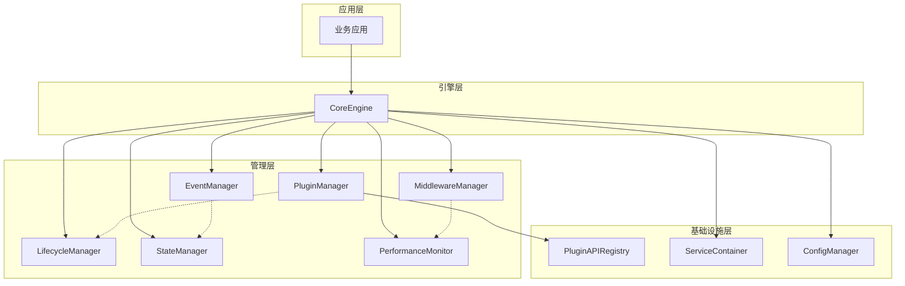

**图表来源**
- [core-engine.ts](file://packages/core/src/engine/core-engine.ts#L29-L47)
- [vue-engine.ts](file://packages/vue3/src/engine/vue-engine.ts#L74-L120)

## 详细组件分析

### 核心引擎实现

核心引擎实现了 `CoreEngine` 接口，提供了完整的应用运行时环境：

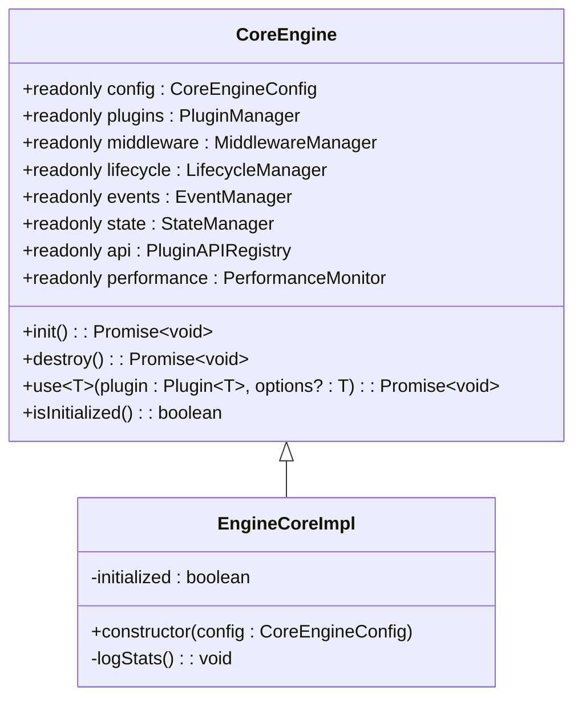

**图表来源**
- [core-engine.ts](file://packages/core/src/engine/core-engine.ts#L75-L100)
- [engine.ts](file://packages/core/src/types/engine.ts#L28-L51)

#### 初始化流程

核心引擎的初始化过程遵循严格的顺序，确保所有子系统都能正确初始化：

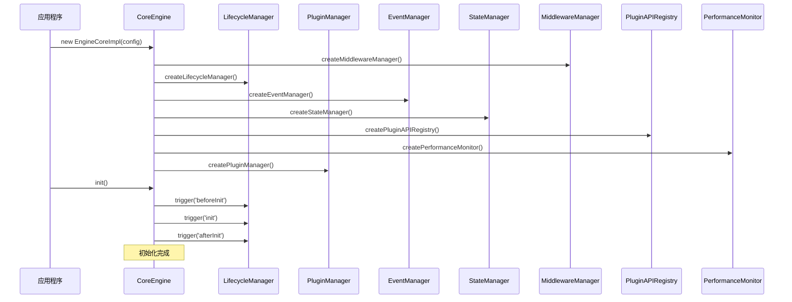

**图表来源**
- [core-engine.ts](file://packages/core/src/engine/core-engine.ts#L110-L135)
- [core-engine.ts](file://packages/core/src/engine/core-engine.ts#L166-L200)

#### 销毁机制

引擎的销毁过程同样遵循严格的顺序，确保资源得到正确清理：

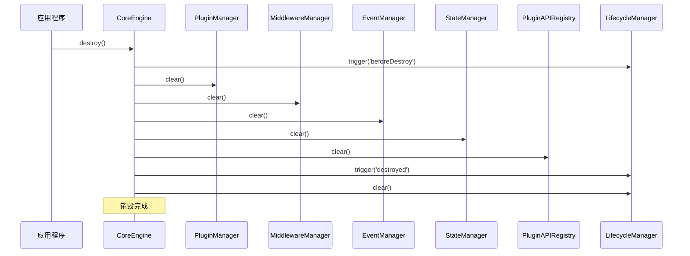

**图表来源**
- [core-engine.ts](file://packages/core/src/engine/core-engine.ts#L225-L269)

**章节来源**
- [core-engine.ts](file://packages/core/src/engine/core-engine.ts#L141-L364)

### 插件管理器

插件管理器负责插件的全生命周期管理，包括安装、卸载、依赖检查和热重载：

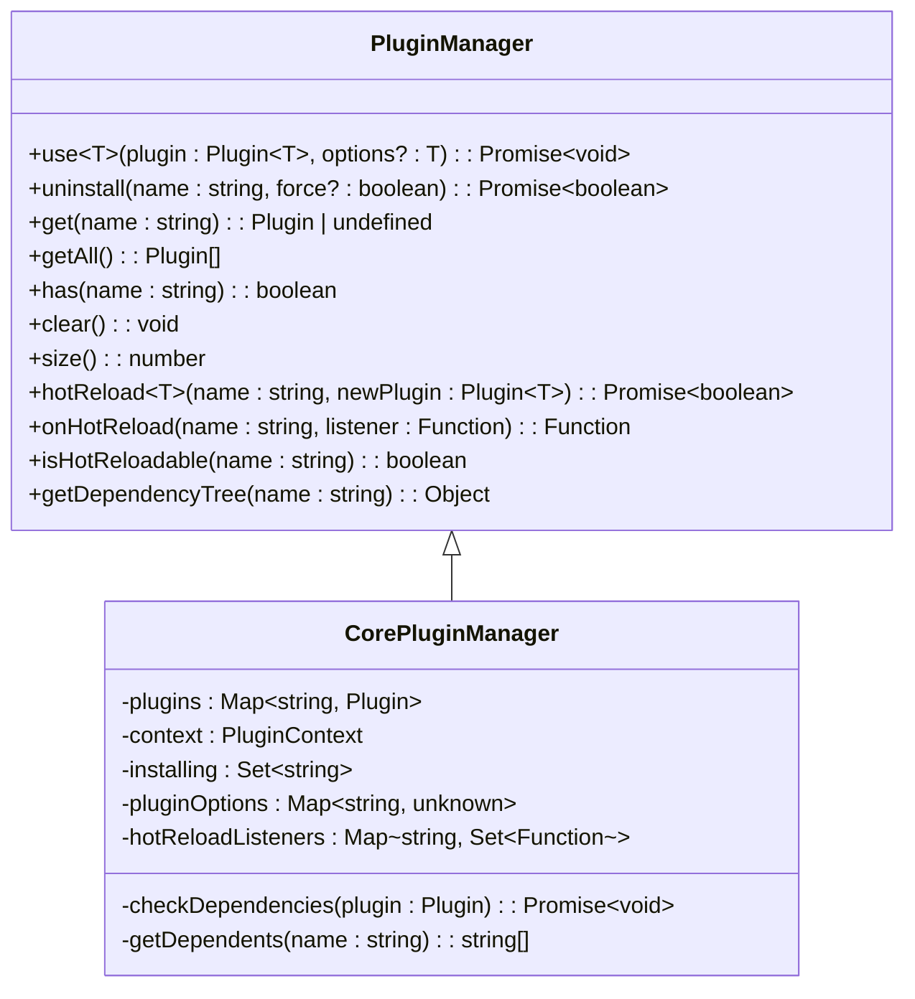

**图表来源**
- [plugin-manager.ts](file://packages/core/src/plugin/plugin-manager.ts#L42-L100)
- [plugin-manager.ts](file://packages/core/src/plugin/plugin-manager.ts#L108-L140)

**章节来源**
- [plugin-manager.ts](file://packages/core/src/plugin/plugin-manager.ts#L1-L530)

### 生命周期管理器

生命周期管理器提供了强大的钩子系统，支持异步处理和错误隔离：

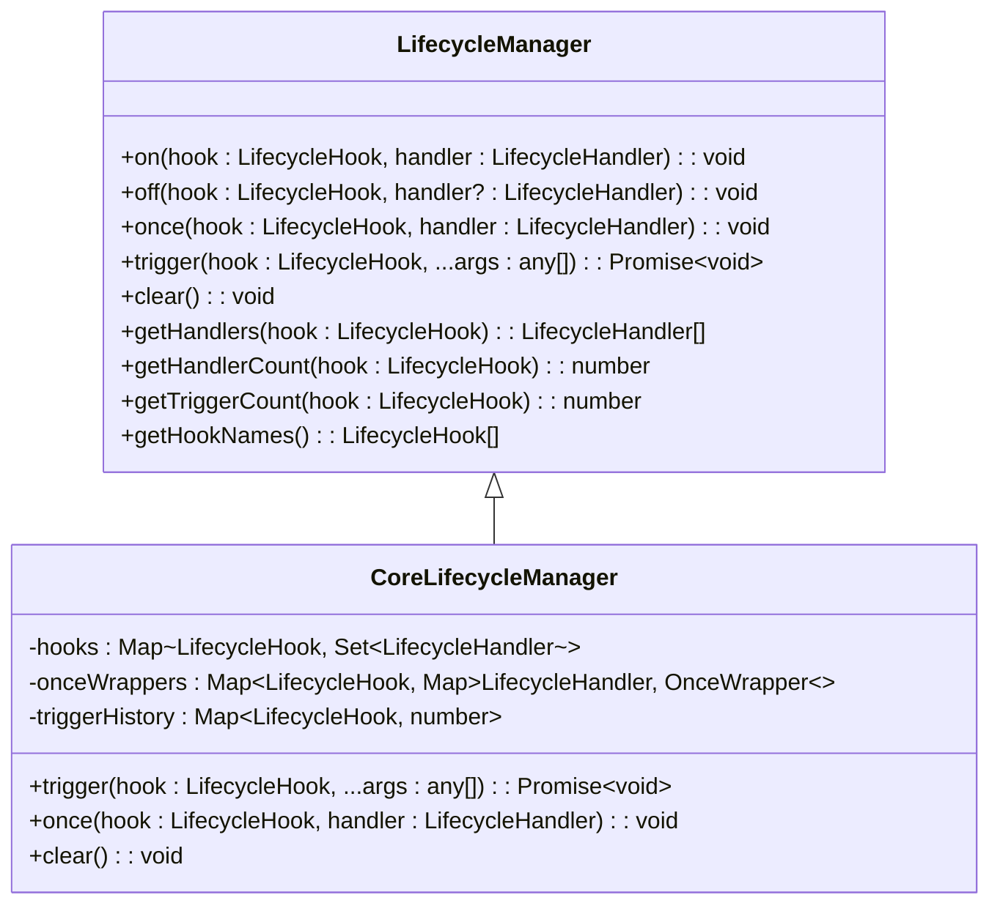

**图表来源**
- [lifecycle-manager.ts](file://packages/core/src/lifecycle/lifecycle-manager.ts#L66-L100)
- [lifecycle-manager.ts](file://packages/core/src/lifecycle/lifecycle-manager.ts#L173-L210)

**章节来源**
- [lifecycle-manager.ts](file://packages/core/src/lifecycle/lifecycle-manager.ts#L1-L355)

### 事件管理器

事件管理器实现了高性能的发布-订阅模式，支持通配符事件和异步处理：

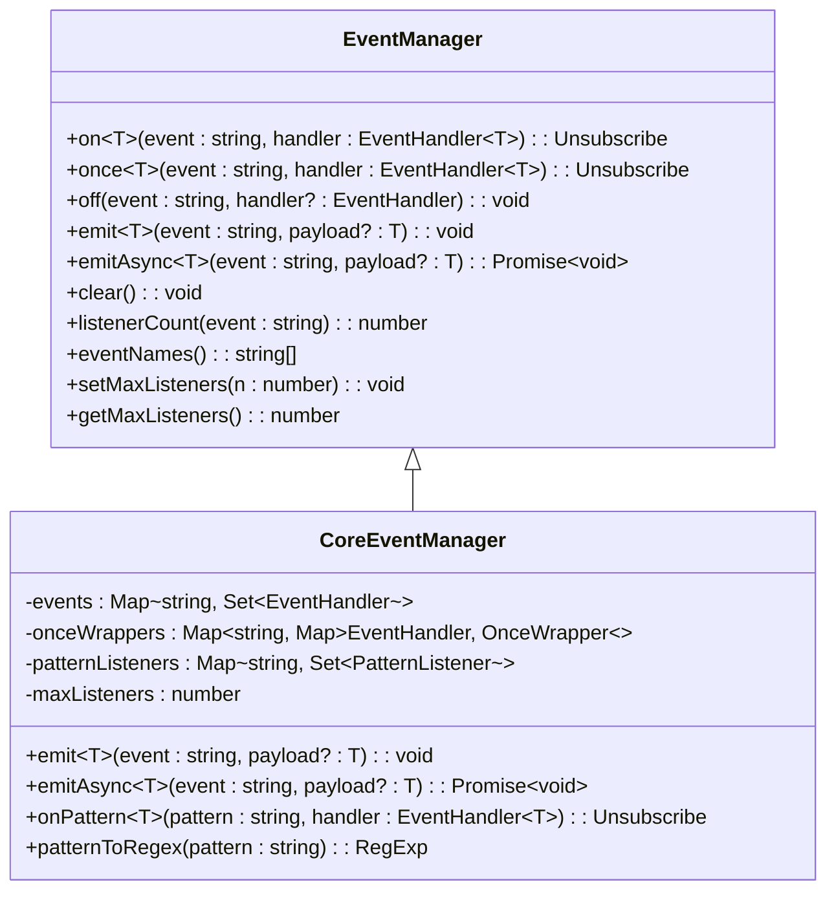

**图表来源**
- [event-manager.ts](file://packages/core/src/event/event-manager.ts#L65-L100)
- [event-manager.ts](file://packages/core/src/event/event-manager.ts#L100-L140)

**章节来源**
- [event-manager.ts](file://packages/core/src/event/event-manager.ts#L1-L494)

### 状态管理器

状态管理器提供了高性能的状态管理功能，支持批量更新和内存优化：

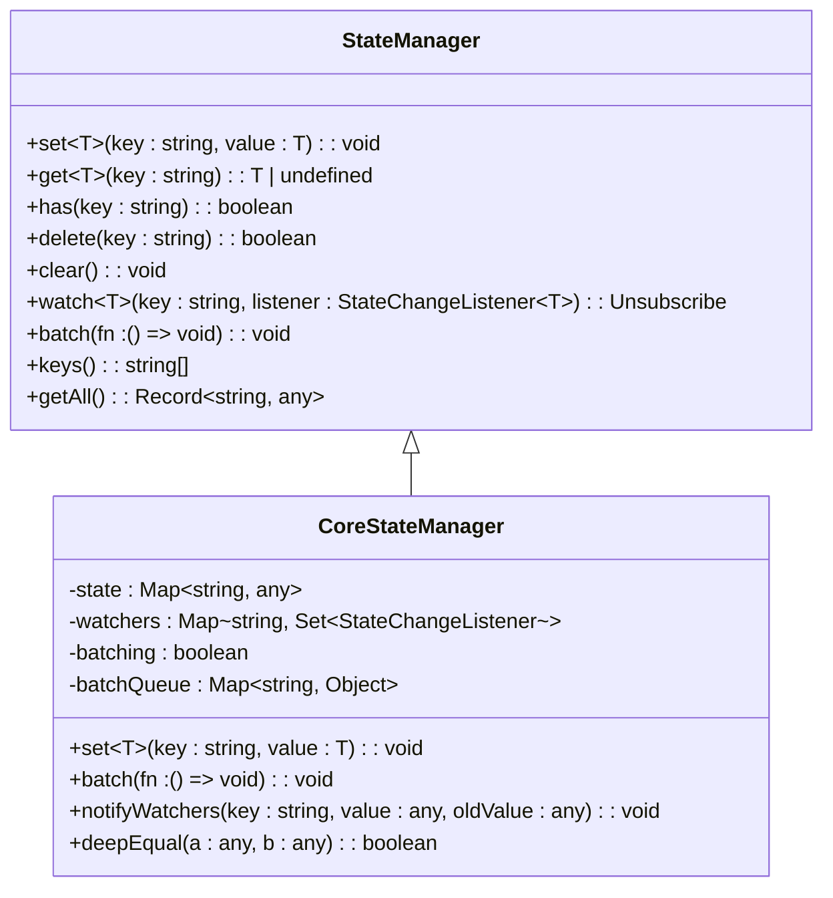

**图表来源**
- [state-manager.ts](file://packages/core/src/state/state-manager.ts#L43-L80)
- [state-manager.ts](file://packages/core/src/state/state-manager.ts#L72-L110)

**章节来源**
- [state-manager.ts](file://packages/core/src/state/state-manager.ts#L1-L419)

### 中间件管理器

中间件管理器实现了洋葱模型的中间件系统，支持优先级排序和错误处理：

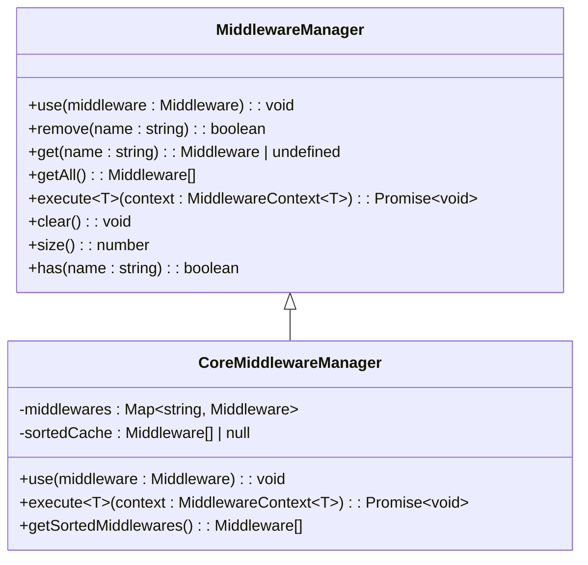

**图表来源**
- [middleware-manager.ts](file://packages/core/src/middleware/middleware-manager.ts#L47-L80)
- [middleware-manager.ts](file://packages/core/src/middleware/middleware-manager.ts#L197-L250)

**章节来源**
- [middleware-manager.ts](file://packages/core/src/middleware/middleware-manager.ts#L1-L343)

### 性能监控器

性能监控器提供了内置的性能监控和统计功能：

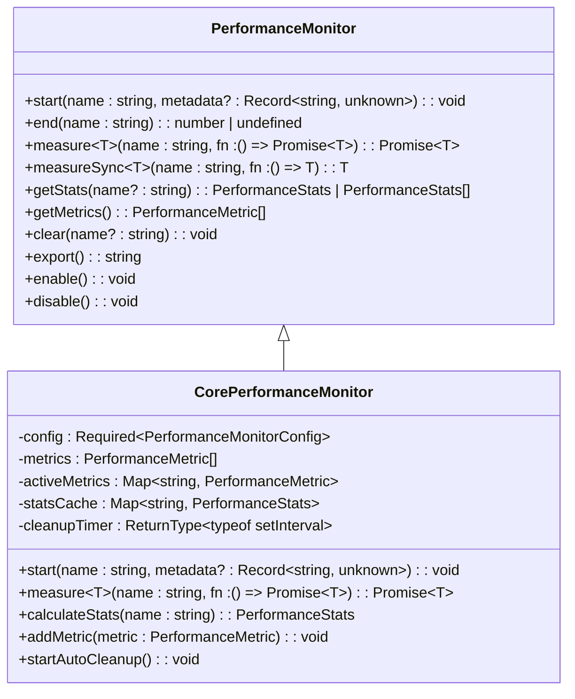

**图表来源**
- [performance-monitor.ts](file://packages/core/src/performance/performance-monitor.ts#L66-L87)
- [performance-monitor.ts](file://packages/core/src/performance/performance-monitor.ts#L118-L150)

**章节来源**
- [performance-monitor.ts](file://packages/core/src/performance/performance-monitor.ts#L1-L561)

## 初始化流程

核心引擎的初始化是一个精心设计的过程，确保所有子系统能够按照正确的顺序启动：

### 初始化阶段详解

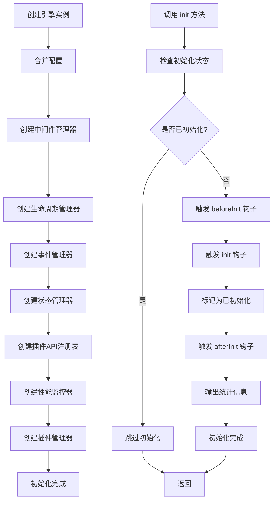

**图表来源**
- [core-engine.ts](file://packages/core/src/engine/core-engine.ts#L110-L135)
- [core-engine.ts](file://packages/core/src/engine/core-engine.ts#L166-L200)

### 销毁阶段详解

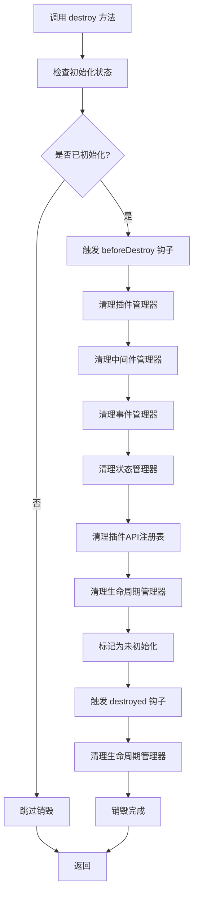

**图表来源**
- [core-engine.ts](file://packages/core/src/engine/core-engine.ts#L225-L269)

**章节来源**
- [core-engine.ts](file://packages/core/src/engine/core-engine.ts#L141-L269)

## 生命周期管理

核心引擎的生命周期管理是其最重要的特性之一，提供了完整的应用生命周期控制：

### 生命周期钩子类型

引擎支持以下生命周期钩子：

| 钩子名称 | 触发时机 | 用途 |
|---------|---------|------|
| beforeInit | 初始化前 | 执行初始化前的准备工作 |
| init | 初始化时 | 执行核心初始化逻辑 |
| afterInit | 初始化后 | 执行初始化后的收尾工作 |
| beforeMount | 挂载前 | 执行挂载前的准备工作 |
| mounted | 已挂载 | 应用已成功挂载到 DOM |
| beforeUpdate | 更新前 | 执行更新前的准备工作 |
| updated | 已更新 | 应用已完成更新 |
| beforeUnmount | 卸载前 | 执行卸载前的清理工作 |
| unmounted | 已卸载 | 应用已完全卸载 |
| beforeDestroy | 销毁前 | 执行销毁前的清理工作 |
| destroyed | 已销毁 | 应用已完全销毁 |

### 生命周期执行流程

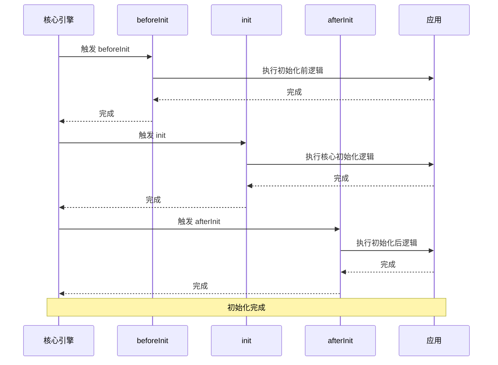

**图表来源**
- [lifecycle-manager.ts](file://packages/core/src/lifecycle/lifecycle-manager.ts#L173-L210)

**章节来源**
- [lifecycle-manager.ts](file://packages/core/src/lifecycle/lifecycle-manager.ts#L36-L65)

## 依赖关系分析

核心引擎的各个子系统之间存在复杂的依赖关系，这些关系决定了它们的创建和销毁顺序：

### 依赖关系图

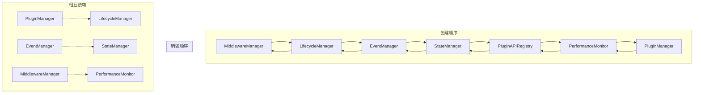

**图表来源**
- [core-engine.ts](file://packages/core/src/engine/core-engine.ts#L119-L135)
- [core-engine.ts](file://packages/core/src/engine/core-engine.ts#L241-L260)

### 关键依赖说明

1. **插件管理器依赖引擎上下文**：插件管理器需要访问引擎的其他子系统，因此必须在最后创建。

2. **生命周期管理器的中心地位**：生命周期管理器被多个子系统依赖，是整个系统的核心协调者。

3. **事件与状态的紧密耦合**：事件管理器和状态管理器经常配合使用，共同实现状态变更的通知机制。

4. **中间件与性能监控的协作**：中间件系统可以利用性能监控器来测量中间件的执行时间。

**章节来源**
- [core-engine.ts](file://packages/core/src/engine/core-engine.ts#L119-L135)

## 性能优化

核心引擎在设计时充分考虑了性能优化，采用了多种策略来提升系统性能：

### 内存优化策略

1. **LRU 缓存策略**：性能监控器使用 LRU（最近最少使用）策略来限制指标数量，防止内存泄漏。

2. **批量更新优化**：状态管理器支持批量更新，减少不必要的监听器调用。

3. **延迟清理**：中间件管理器在移除中间件时只从缓存中移除，而不是清空整个缓存。

4. **弱引用模式**：事件管理器和状态管理器都采用了弱引用模式，避免循环引用导致的内存泄漏。

### 性能监控指标

核心引擎提供了详细的性能监控功能：

| 监控指标 | 描述 | 用途 |
|---------|------|------|
| 初始化时间 | 引擎初始化所需的时间 | 评估启动性能 |
| 插件加载时间 | 插件安装和卸载的时间 | 优化插件管理 |
| 事件触发时间 | 事件监听器的执行时间 | 优化事件系统 |
| 状态更新时间 | 状态变更和通知的时间 | 优化状态管理 |
| 中间件执行时间 | 中间件链的执行时间 | 优化中间件系统 |

### 性能最佳实践

1. **合理使用批量更新**：在需要频繁更新状态时，使用 `state.batch()` 方法。

2. **及时清理监听器**：在组件卸载时，确保取消所有事件监听器和状态监听器。

3. **避免过度使用通配符**：事件管理器的通配符匹配会增加性能开销。

4. **合理设置性能阈值**：根据应用需求调整性能监控的警告阈值。

**章节来源**
- [performance-monitor.ts](file://packages/core/src/performance/performance-monitor.ts#L441-L455)
- [state-manager.ts](file://packages/core/src/state/state-manager.ts#L206-L250)

## 故障排除指南

### 常见问题及解决方案

#### 1. 初始化失败

**症状**：调用 `engine.init()` 时抛出异常

**可能原因**：
- 配置参数错误
- 依赖的子系统未正确初始化
- 生命周期钩子中抛出异常

**解决方案**：
```typescript
// 启用调试模式查看详细信息
const engine = createCoreEngine({ debug: true });

try {
  await engine.init();
} catch (error) {
  console.error('初始化失败:', error);
}
```

#### 2. 插件安装失败

**症状**：插件无法正常安装或卸载

**可能原因**：
- 插件依赖未满足
- 循环依赖
- 插件安装函数抛出异常

**解决方案**：
```typescript
// 检查插件依赖关系
const dependencyTree = engine.plugins.getDependencyTree('plugin-name');
console.log('依赖树:', dependencyTree);

// 查看插件安装历史
engine.lifecycle.on('init', () => {
  console.log('已安装的插件:', engine.plugins.getAll().map(p => p.name));
});
```

#### 3. 内存泄漏

**症状**：应用运行一段时间后内存占用持续增长

**可能原因**：
- 未正确清理事件监听器
- 未正确卸载插件
- 状态监听器未取消

**解决方案**：
```typescript
// 使用组合式 API 时确保正确清理
import { onUnmounted } from 'vue';

onUnmounted(() => {
  // 取消事件监听
  unsubscribe();
  
  // 取消状态监听
  unwatch();
});
```

#### 4. 性能问题

**症状**：应用响应缓慢或卡顿

**诊断步骤**：
1. 启用性能监控
2. 分析性能报告
3. 识别瓶颈

```typescript
// 启用性能监控
const monitor = engine.performance;

// 测量关键操作的性能
await monitor.measure('api-call', async () => {
  return await fetchData();
});

// 获取性能统计
const stats = monitor.getStats('api-call');
console.log('平均耗时:', stats.avgDuration, 'ms');
```

### 调试技巧

1. **启用调试模式**：设置 `debug: true` 可以看到详细的日志信息。

2. **使用性能监控**：定期检查性能指标，及时发现性能问题。

3. **监控内存使用**：关注内存使用情况，及时发现内存泄漏。

4. **检查生命周期钩子**：确保所有必要的生命周期钩子都被正确触发。

**章节来源**
- [core-engine.ts](file://packages/core/src/engine/core-engine.ts#L136-L140)
- [performance-monitor.ts](file://packages/core/src/performance/performance-monitor.ts#L166-L232)

## 总结

核心引擎作为整个框架的中枢组件，展现了优秀的软件架构设计：

### 设计优势

1. **模块化设计**：每个子系统都有明确的职责，便于维护和扩展。

2. **统一接口**：所有子系统都通过统一的接口与引擎交互，降低了复杂性。

3. **生命周期管理**：完善的生命周期钩子系统，确保应用状态的一致性。

4. **性能优化**：多种性能优化策略，保证系统的高效运行。

5. **错误处理**：完善的错误处理机制，提高系统的稳定性。

### 最佳实践建议

1. **合理使用插件系统**：充分利用插件的依赖管理和生命周期控制。

2. **优化状态管理**：使用批量更新和适当的监听策略。

3. **监控性能指标**：定期检查性能监控数据，及时优化。

4. **注意内存管理**：确保正确清理各种监听器和资源。

5. **遵循生命周期**：在合适的生命周期钩子中执行相应的操作。

核心引擎的设计体现了现代软件架构的最佳实践，为构建高质量的应用程序提供了坚实的基础。通过深入理解其设计原理和使用方法，开发者可以更好地利用这个强大的框架来构建复杂的应用系统。