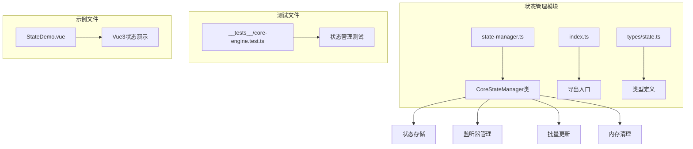
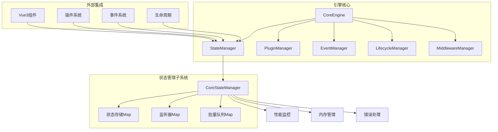
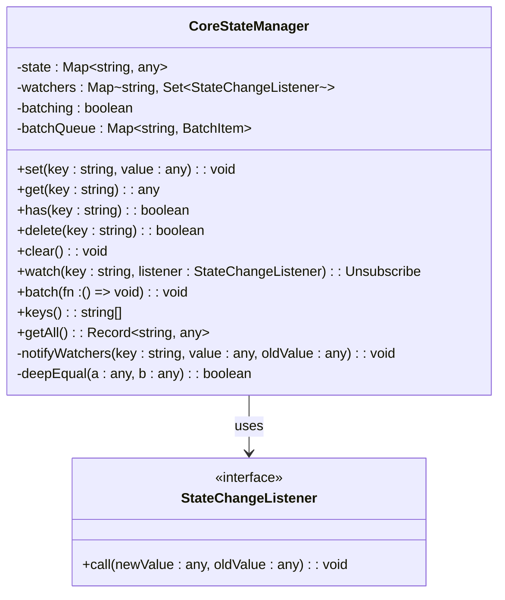
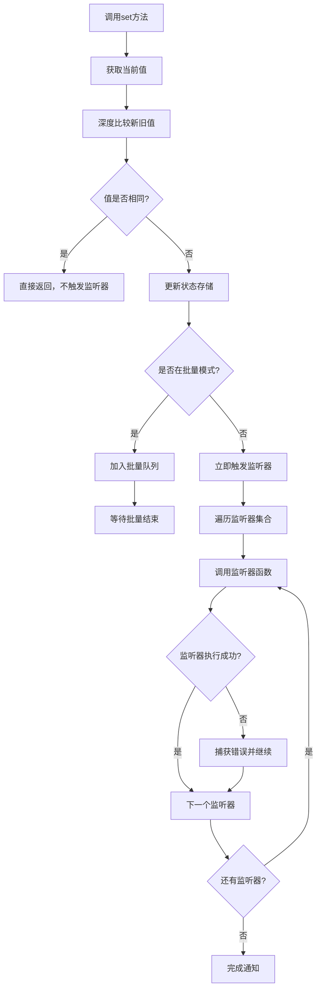
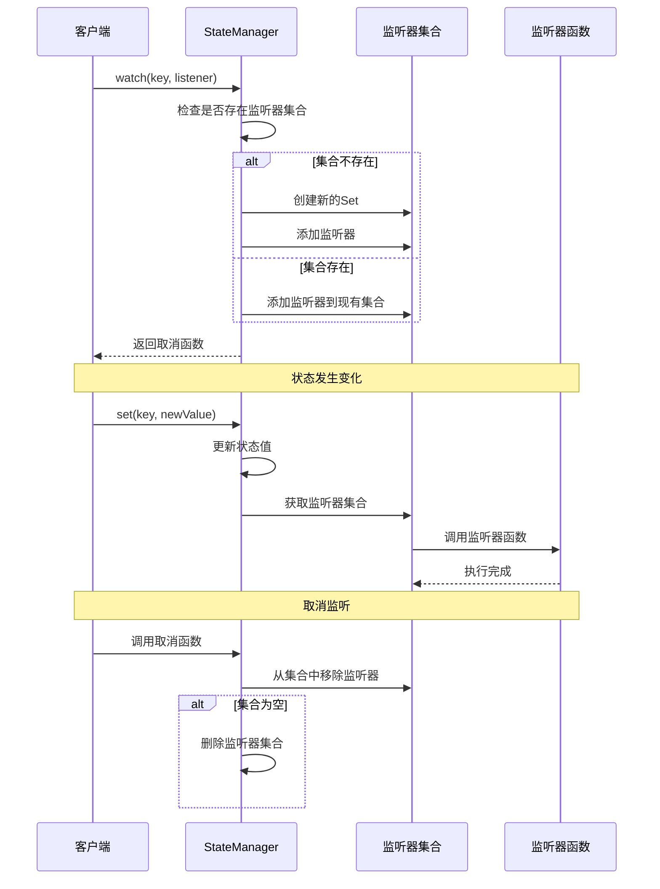
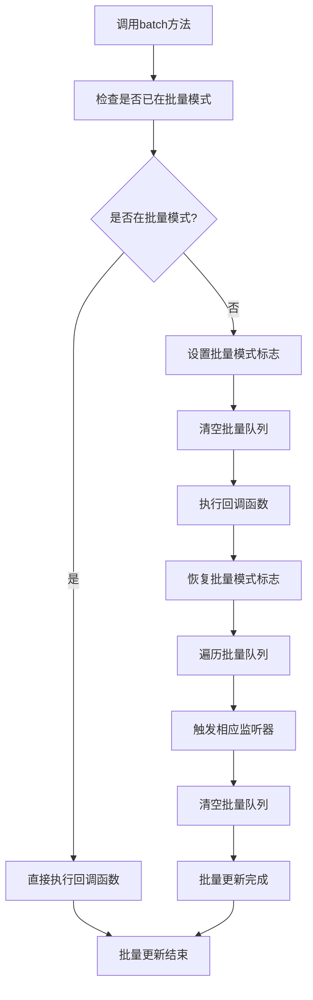
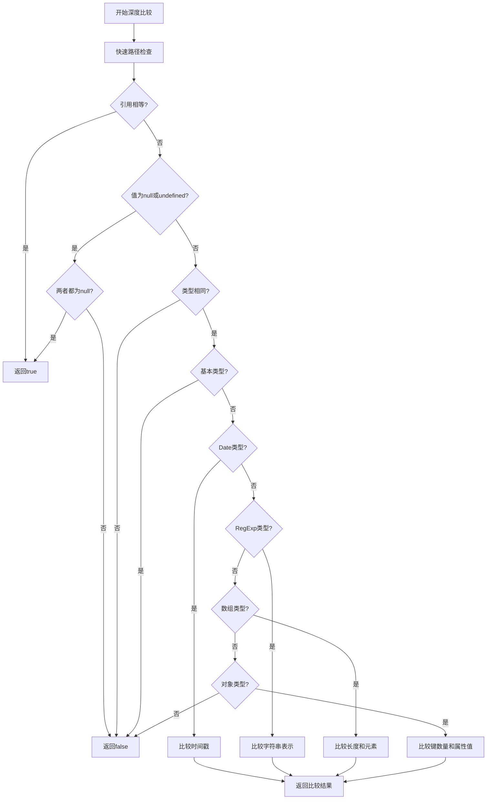
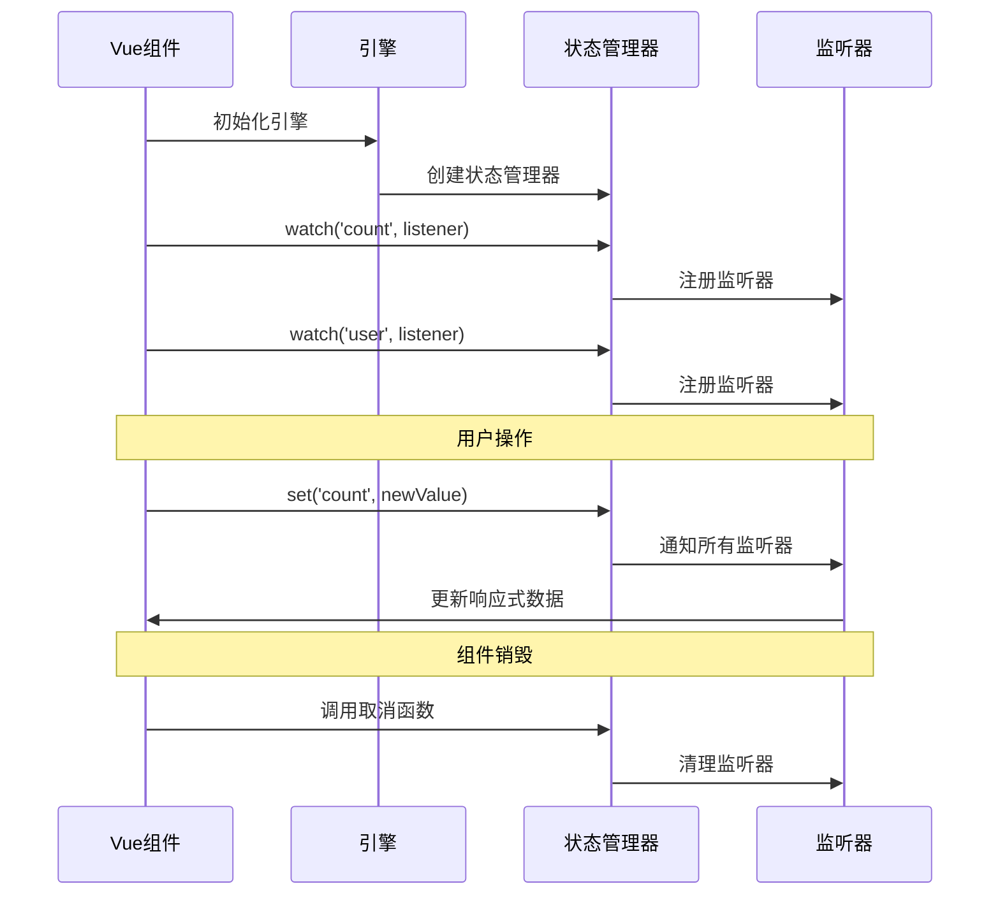
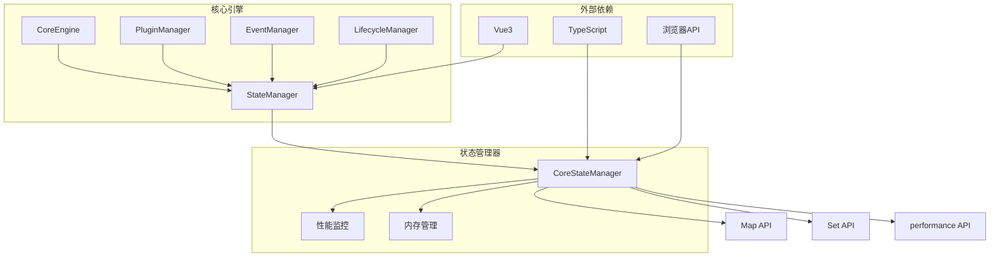

# 状态管理

<cite>
**本文档中引用的文件**
- [state-manager.ts](file://packages/core/src/state/state-manager.ts)
- [state.ts](file://packages/core/src/types/state.ts)
- [index.ts](file://packages/core/src/state/index.ts)
- [StateDemo.vue](file://packages/vue3/example/src/components/StateDemo.vue)
- [core-engine.test.ts](file://packages/core/src/__tests__/core-engine.test.ts)
- [core-engine.ts](file://packages/core/src/engine/core-engine.ts)
- [performance-monitor.ts](file://packages/core/src/performance/performance-monitor.ts)
</cite>

## 目录
1. [简介](#简介)
2. [项目结构](#项目结构)
3. [核心组件](#核心组件)
4. [架构概览](#架构概览)
5. [详细组件分析](#详细组件分析)
6. [依赖关系分析](#依赖关系分析)
7. [性能考虑](#性能考虑)
8. [故障排除指南](#故障排除指南)
9. [结论](#结论)

## 简介

状态管理（State Management）模块是LDesign引擎的核心功能之一，提供了高性能的全局状态存储、获取、设置、监听和批量更新能力。该模块采用基于Map的数据结构，支持状态变化监听、批量更新优化、内存管理和性能监控，确保在复杂应用场景中的稳定性和效率。

状态管理模块的主要特性包括：
- **高性能存储**：基于Map的O(1)读写性能
- **状态监听**：支持细粒度的状态变化监听
- **批量更新**：优化连续状态变更的性能
- **内存优化**：自动内存清理和防泄漏机制
- **深度比较**：智能的状态变更检测
- **错误隔离**：监听器错误不影响其他监听器

## 项目结构

状态管理模块位于`packages/core/src/state/`目录下，包含以下核心文件：

**图表来源**
- [state-manager.ts](file://packages/core/src/state/state-manager.ts#L1-L419)
- [index.ts](file://packages/core/src/state/index.ts#L1-L7)
- [state.ts](file://packages/core/src/types/state.ts#L1-L34)

**章节来源**
- [state-manager.ts](file://packages/core/src/state/state-manager.ts#L1-L419)
- [index.ts](file://packages/core/src/state/index.ts#L1-L7)
- [state.ts](file://packages/core/src/types/state.ts#L1-L34)

## 核心组件

状态管理模块的核心是`CoreStateManager`类，它实现了完整的状态管理功能。该类提供了以下关键组件：

### 状态存储层
- **Map-based存储**：使用原生Map提供O(1)的读写性能
- **类型安全**：泛型支持确保类型安全的状态操作
- **深比较机制**：智能检测状态值的实际变化

### 监听器管理层
- **Set-based监听器存储**：每个状态键对应一个监听器集合
- **自动清理机制**：无监听器时自动删除相关数据
- **错误隔离**：单个监听器错误不影响其他监听器

### 批量更新引擎
- **批处理队列**：收集批量操作中的状态变更
- **延迟触发**：批量结束后统一触发监听器
- **嵌套保护**：防止批量更新的嵌套调用

**章节来源**
- [state-manager.ts](file://packages/core/src/state/state-manager.ts#L43-L419)

## 架构概览

状态管理模块采用分层架构设计，与引擎的其他子系统紧密集成：

**图表来源**
- [core-engine.ts](file://packages/core/src/engine/core-engine.ts#L75-L135)
- [state-manager.ts](file://packages/core/src/state/state-manager.ts#L43-L90)

## 详细组件分析

### CoreStateManager类详解

`CoreStateManager`是状态管理的核心实现类，提供了完整的状态管理功能：

#### 核心数据结构

**图表来源**
- [state-manager.ts](file://packages/core/src/state/state-manager.ts#L43-L419)
- [state.ts](file://packages/core/src/types/state.ts#L10-L32)

#### 状态设置与获取机制

状态设置操作包含智能的变更检测和性能优化：

**图表来源**
- [state-manager.ts](file://packages/core/src/state/state-manager.ts#L72-L90)

#### 监听器管理机制

监听器系统提供了灵活的状态变化通知机制：

**图表来源**
- [state-manager.ts](file://packages/core/src/state/state-manager.ts#L187-L204)

#### 批量更新优化机制

批量更新是状态管理的重要性能优化特性：

**图表来源**
- [state-manager.ts](file://packages/core/src/state/state-manager.ts#L229-L251)

#### 深度比较算法

状态变更检测使用了复杂的深度比较算法：

**图表来源**
- [state-manager.ts](file://packages/core/src/state/state-manager.ts#L331-L400)

**章节来源**
- [state-manager.ts](file://packages/core/src/state/state-manager.ts#L43-L419)

### 类型系统设计

状态管理模块提供了完整的类型定义系统：

| 接口/类型 | 描述 | 主要方法 |
|-----------|------|----------|
| `StateManager` | 状态管理器接口 | `set`, `get`, `watch`, `batch`, `clear` |
| `StateChangeListener` | 状态变化监听器 | `(newValue, oldValue) => void` |
| `Unsubscribe` | 取消监听函数 | `() => void` |

**章节来源**
- [state.ts](file://packages/core/src/types/state.ts#L1-L34)

### Vue3集成示例

状态管理模块与Vue3框架的集成展示了实际应用场景：

**图表来源**
- [StateDemo.vue](file://packages/vue3/example/src/components/StateDemo.vue#L114-L142)

**章节来源**
- [StateDemo.vue](file://packages/vue3/example/src/components/StateDemo.vue#L1-L283)

## 依赖关系分析

状态管理模块与引擎的其他子系统存在密切的依赖关系：

**图表来源**
- [core-engine.ts](file://packages/core/src/engine/core-engine.ts#L75-L135)
- [state-manager.ts](file://packages/core/src/state/state-manager.ts#L43-L90)

**章节来源**
- [core-engine.ts](file://packages/core/src/engine/core-engine.ts#L75-L135)

## 性能考虑

状态管理模块在设计时充分考虑了性能优化：

### 内存管理优化

1. **自动内存清理**：删除状态时自动清理相关监听器
2. **LRU缓存策略**：性能监控使用LRU策略管理指标
3. **监听器去重**：使用Set避免重复监听器
4. **批量清理**：批量更新结束后统一清理临时数据

### 性能监控集成

状态管理器集成了性能监控功能：

| 监控指标 | 描述 | 默认阈值 |
|----------|------|----------|
| 状态设置耗时 | 单次set操作的执行时间 | 1000ms |
| 监听器触发频率 | 单位时间内监听器被触发的次数 | 动态 |
| 内存使用量 | 状态存储占用的内存大小 | 实时监控 |
| 批量更新效率 | 批量操作相对于单次操作的性能提升 | >20% |

### 最佳实践建议

1. **合理使用批量更新**：对于连续的状态变更，使用`batch`方法
2. **及时清理监听器**：在组件销毁时调用取消函数
3. **避免深层嵌套对象**：减少深度比较的开销
4. **控制监听器数量**：避免过多的监听器影响性能

**章节来源**
- [performance-monitor.ts](file://packages/core/src/performance/performance-monitor.ts#L1-L561)

## 故障排除指南

### 常见问题及解决方案

#### 内存泄漏问题

**症状**：应用运行一段时间后内存持续增长
**原因**：监听器未正确清理
**解决方案**：
- 确保在组件销毁时调用取消函数
- 使用批量清理功能清理无用状态
- 定期检查监听器数量

#### 性能问题

**症状**：状态更新时界面卡顿
**原因**：大量监听器同时触发
**解决方案**：
- 使用批量更新减少监听器触发次数
- 实现防抖或节流机制
- 优化监听器逻辑，避免复杂计算

#### 深度比较问题

**症状**：状态值未变但监听器被触发
**原因**：深度比较算法误判
**解决方案**：
- 检查对象结构，避免循环引用
- 使用浅比较替代深度比较
- 手动实现变更检测逻辑

**章节来源**
- [state-manager.ts](file://packages/core/src/state/state-manager.ts#L299-L316)

## 结论

LDesign引擎的状态管理模块是一个设计精良、功能完备的全局状态管理系统。它通过以下特性确保了高质量的开发体验：

1. **高性能设计**：基于Map的O(1)读写性能，配合深度比较算法确保准确的状态变更检测
2. **内存安全**：完善的内存管理机制，自动清理无用数据，防止内存泄漏
3. **性能优化**：批量更新机制显著提升连续操作的性能
4. **类型安全**：完整的TypeScript类型定义确保开发时的类型安全
5. **错误隔离**：监听器错误不影响其他监听器的正常执行
6. **易于集成**：与Vue3等框架的良好集成，简化状态管理的使用

该模块不仅满足了基础的状态管理需求，还通过丰富的特性和优化策略，为复杂应用提供了强大的状态管理能力。在多模块协作场景中，状态管理模块作为核心协调者，确保了各子系统之间的数据一致性和通信效率。

对于开发者而言，理解状态管理模块的设计原理和最佳实践，能够帮助构建更加稳定、高效的应用程序。通过合理使用批量更新、及时清理监听器、优化深度比较等技巧，可以在保证功能完整性的同时，最大化系统的性能表现。