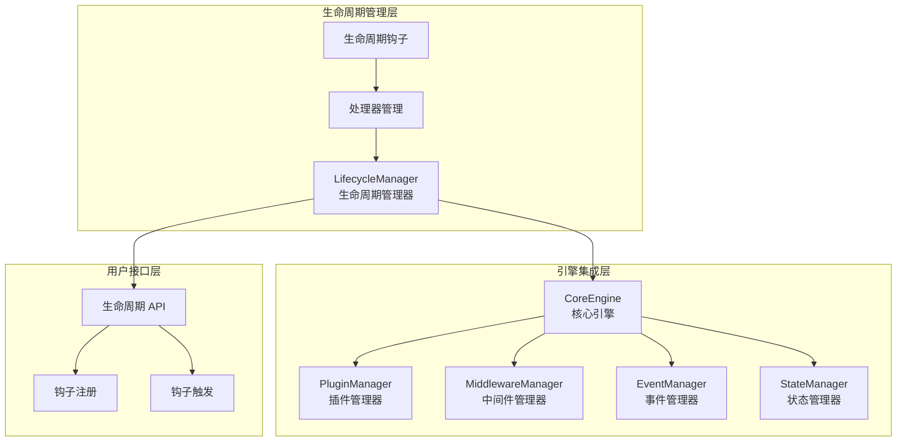
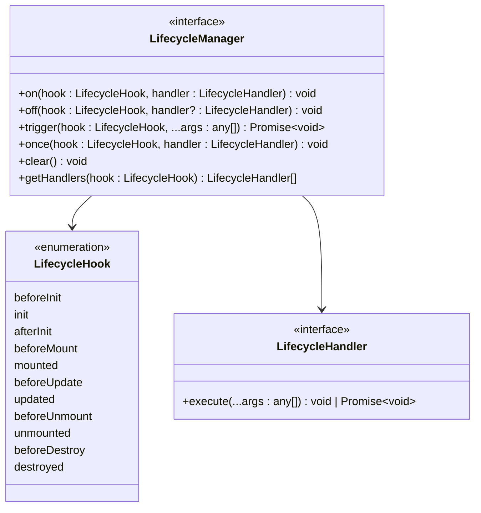
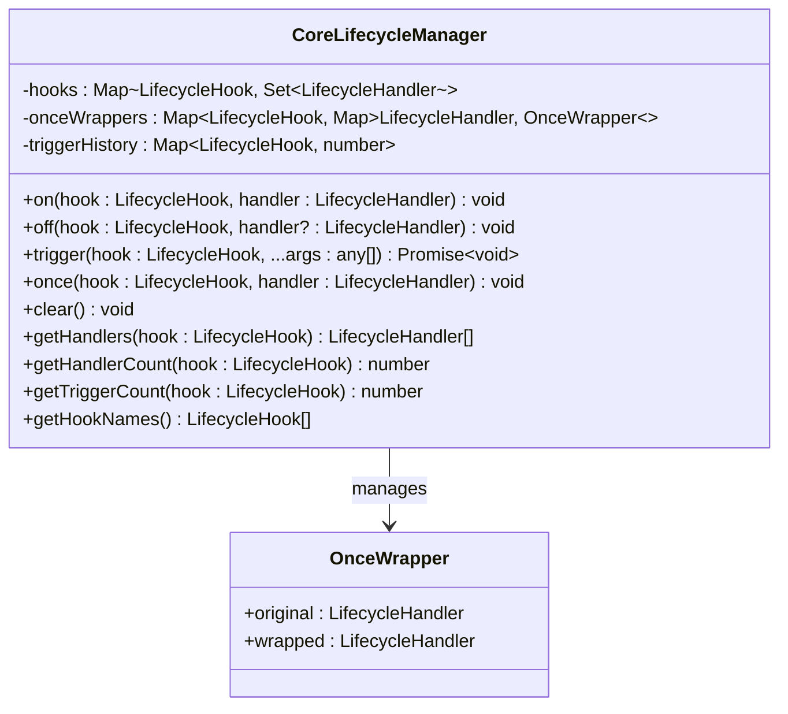
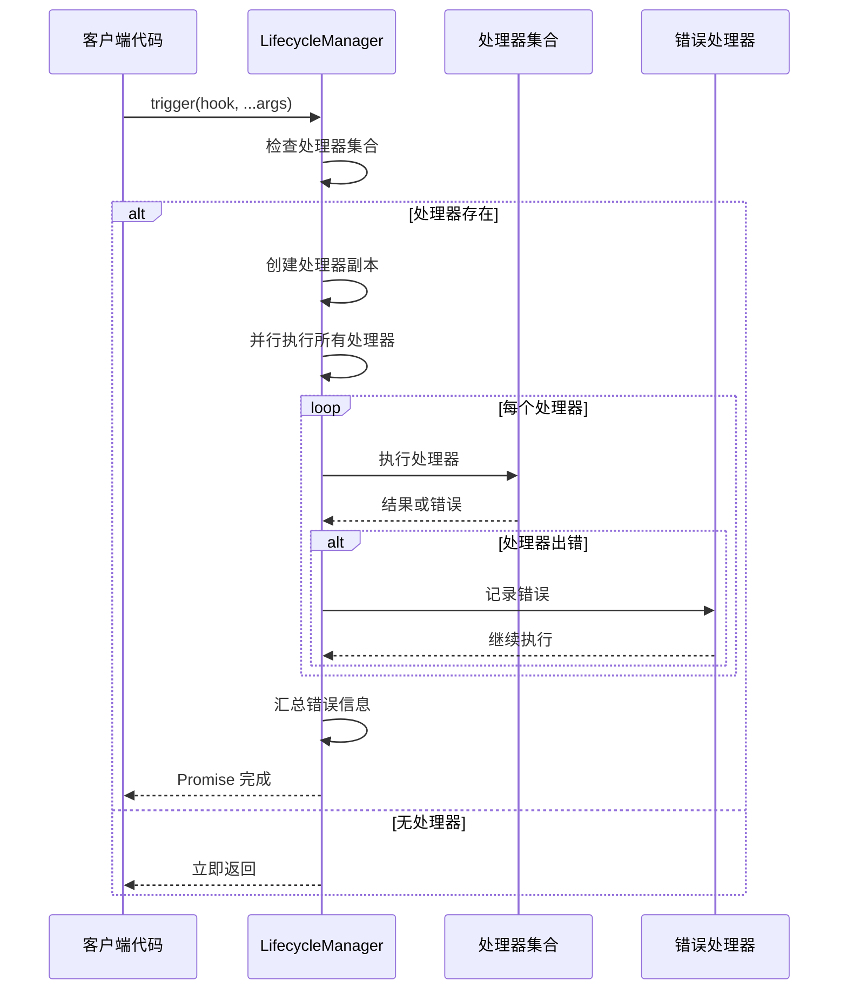
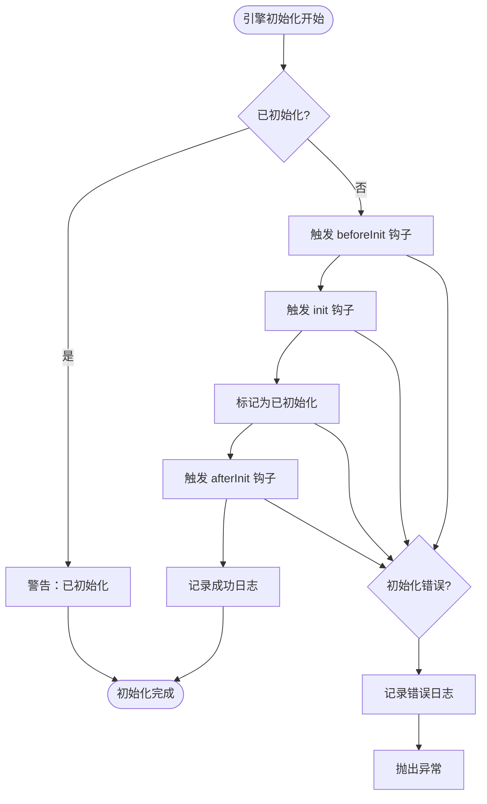
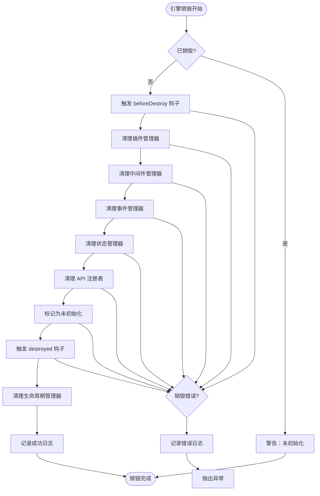
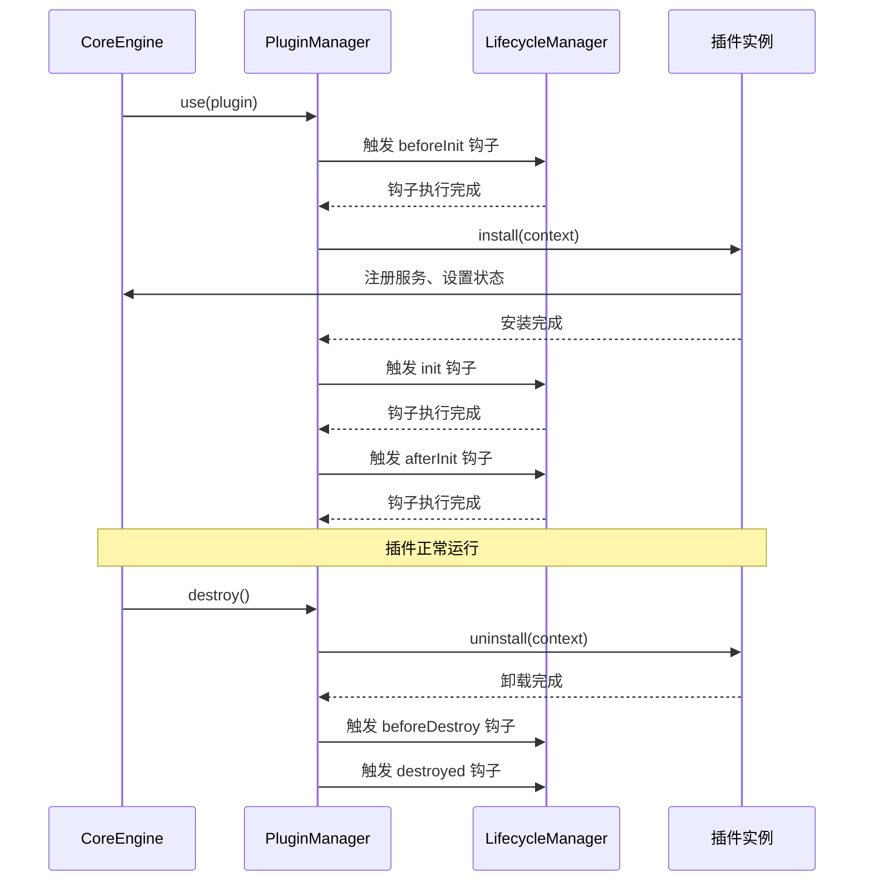
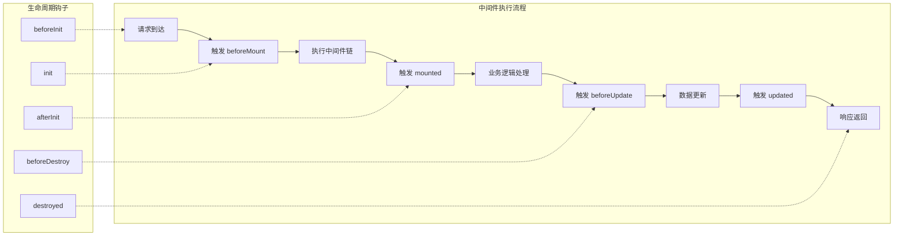
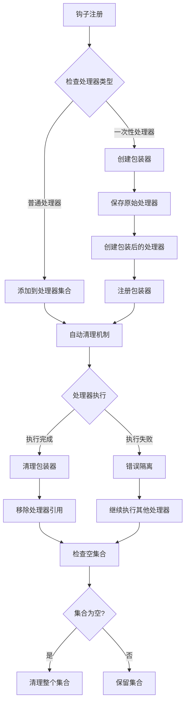

# 生命周期管理

<cite>
**本文档中引用的文件**
- [lifecycle-manager.ts](file://packages/core/src/lifecycle/lifecycle-manager.ts)
- [lifecycle.ts](file://packages/core/src/types/lifecycle.ts)
- [core-engine.ts](file://packages/core/src/engine/core-engine.ts)
- [plugin-manager.ts](file://packages/core/src/plugin/plugin-manager.ts)
- [middleware-manager.ts](file://packages/core/src/middleware/middleware-manager.ts)
- [event-manager.ts](file://packages/core/src/event/event-manager.ts)
- [state-manager.ts](file://packages/core/src/state/state-manager.ts)
- [core-engine.test.ts](file://packages/core/src/__tests__/core-engine.test.ts)
- [i18n-plugin.ts](file://packages/vue3/src/plugins/i18n-plugin.ts)
- [router-plugin.ts](file://packages/vue3/src/plugins/router-plugin.ts)
</cite>

## 目录
1. [简介](#简介)
2. [核心架构](#核心架构)
3. [生命周期钩子详解](#生命周期钩子详解)
4. [LifecycleManager 实现机制](#lifecyclemanager-实现机制)
5. [引擎初始化与销毁流程](#引擎初始化与销毁流程)
6. [插件与中间件的生命周期集成](#插件与中间件的生命周期集成)
7. [使用示例与最佳实践](#使用示例与最佳实践)
8. [性能优化与内存管理](#性能优化与内存管理)
9. [常见陷阱与解决方案](#常见陷阱与解决方案)
10. [总结](#总结)

## 简介

生命周期管理是 LDesign Engine 核心架构的重要组成部分，提供了一套完整且灵活的钩子系统，用于协调应用各个子系统的初始化、运行和销毁过程。该系统确保了资源的有序分配和释放，支持同步与异步处理，并提供了强大的错误隔离机制。

生命周期管理机制的核心价值在于：
- **统一的生命周期控制**：为插件、中间件、事件系统等提供标准化的生命周期钩子
- **资源管理**：确保资源的正确分配和优雅释放
- **错误隔离**：单个钩子的错误不会影响其他钩子的执行
- **可扩展性**：支持自定义生命周期钩子和处理器

## 核心架构

生命周期管理系统采用分层架构设计，核心组件包括：



**图表来源**
- [lifecycle-manager.ts](file://packages/core/src/lifecycle/lifecycle-manager.ts#L66-L355)
- [core-engine.ts](file://packages/core/src/engine/core-engine.ts#L75-L364)

**章节来源**
- [lifecycle-manager.ts](file://packages/core/src/lifecycle/lifecycle-manager.ts#L1-L355)
- [core-engine.ts](file://packages/core/src/engine/core-engine.ts#L1-L364)

## 生命周期钩子详解

### 标准生命周期钩子

系统定义了完整的生命周期钩子序列，覆盖应用的整个生命周期：

| 钩子名称 | 触发时机 | 执行顺序 | 用途 |
|---------|---------|---------|------|
| `beforeInit` | 引擎初始化前 | 1 | 资源准备、环境检查 |
| `init` | 引擎初始化中 | 2 | 核心功能初始化 |
| `afterInit` | 引擎初始化后 | 3 | 插件安装、状态设置 |
| `beforeMount` | 组件挂载前 | 4 | DOM 准备、渲染预处理 |
| `mounted` | 组件挂载后 | 5 | 渲染完成、交互初始化 |
| `beforeUpdate` | 数据更新前 | 6 | 更新前的准备工作 |
| `updated` | 数据更新后 | 7 | 更新完成后的处理 |
| `beforeUnmount` | 组件卸载前 | 8 | 清理工作、资源回收 |
| `unmounted` | 组件卸载后 | 9 | 最终清理 |
| `beforeDestroy` | 引擎销毁前 | 10 | 全局资源清理 |
| `destroyed` | 引擎销毁后 | 11 | 销毁完成确认 |

### 钩子类型定义



**图表来源**
- [lifecycle.ts](file://packages/core/src/types/lifecycle.ts#L8-L44)

**章节来源**
- [lifecycle.ts](file://packages/core/src/types/lifecycle.ts#L1-L45)

## LifecycleManager 实现机制

### 核心特性

CoreLifecycleManager 实现了以下关键特性：

1. **异步钩子处理**：支持同步和异步处理器
2. **错误隔离**：单个处理器错误不影响其他处理器
3. **一次性钩子**：自动移除的临时钩子
4. **优先级管理**：支持钩子的优先级排序
5. **内存优化**：自动清理无用的钩子和包装器

### 核心实现结构



**图表来源**
- [lifecycle-manager.ts](file://packages/core/src/lifecycle/lifecycle-manager.ts#L19-L24)
- [lifecycle-manager.ts](file://packages/core/src/lifecycle/lifecycle-manager.ts#L66-L355)

### 钩子触发机制



**图表来源**
- [lifecycle-manager.ts](file://packages/core/src/lifecycle/lifecycle-manager.ts#L173-L211)

**章节来源**
- [lifecycle-manager.ts](file://packages/core/src/lifecycle/lifecycle-manager.ts#L1-L355)

## 引擎初始化与销毁流程

### 初始化流程

CoreEngine 的初始化过程严格遵循生命周期钩子的执行顺序：



**图表来源**
- [core-engine.ts](file://packages/core/src/engine/core-engine.ts#L166-L199)

### 销毁流程

引擎销毁过程同样严格遵循生命周期钩子顺序，确保资源的正确释放：



**图表来源**
- [core-engine.ts](file://packages/core/src/engine/core-engine.ts#L225-L269)

**章节来源**
- [core-engine.ts](file://packages/core/src/engine/core-engine.ts#L166-L269)

## 插件与中间件的生命周期集成

### 插件生命周期管理

插件系统通过生命周期管理器实现完整的生命周期控制：



**图表来源**
- [plugin-manager.ts](file://packages/core/src/plugin/plugin-manager.ts#L92-L143)
- [core-engine.ts](file://packages/core/src/engine/core-engine.ts#L180-L190)

### 中间件生命周期集成

中间件系统同样受益于生命周期管理：



**图表来源**
- [middleware-manager.ts](file://packages/core/src/middleware/middleware-manager.ts#L197-L257)

**章节来源**
- [plugin-manager.ts](file://packages/core/src/plugin/plugin-manager.ts#L1-L530)
- [middleware-manager.ts](file://packages/core/src/middleware/middleware-manager.ts#L1-L343)

## 使用示例与最佳实践

### 基本钩子使用

```typescript
// 注册生命周期钩子
engine.lifecycle.on('beforeInit', () => {
  console.log('开始初始化...');
});

engine.lifecycle.on('init', async () => {
  await loadConfiguration();
  console.log('配置加载完成');
});

engine.lifecycle.on('afterInit', () => {
  console.log('初始化完成');
});
```

### 异步钩子处理

```typescript
engine.lifecycle.on('init', async () => {
  try {
    // 异步资源加载
    await Promise.all([
      loadDatabase(),
      loadCache(),
      loadConfiguration()
    ]);
    
    // 初始化第三方服务
    await initializeServices();
  } catch (error) {
    console.error('初始化失败:', error);
    throw error;
  }
});
```

### 一次性钩子使用

```typescript
// 一次性钩子，只执行一次
engine.lifecycle.once('mounted', () => {
  console.log('应用首次挂载');
  
  // 执行初始化任务
  initializeAnalytics();
});

// 多次触发，但处理器只执行一次
await engine.lifecycle.trigger('mounted'); // 执行
await engine.lifecycle.trigger('mounted'); // 不执行
```

### 错误处理最佳实践

```typescript
engine.lifecycle.on('init', async () => {
  try {
    // 敏感操作
    await criticalInitialization();
  } catch (error) {
    // 记录错误但不中断流程
    console.error('Critical initialization failed:', error);
    
    // 提供降级方案
    await fallbackInitialization();
  }
});
```

### 资源清理模式

```typescript
engine.lifecycle.on('beforeDestroy', async () => {
  // 清理定时器
  timers.forEach(timer => clearInterval(timer));
  
  // 关闭数据库连接
  await db.close();
  
  // 清理事件监听器
  eventListeners.forEach(unsubscribe => unsubscribe());
  
  // 释放内存资源
  resources.clear();
});
```

**章节来源**
- [core-engine.test.ts](file://packages/core/src/__tests__/core-engine.test.ts#L31-L41)
- [core-engine.test.ts](file://packages/core/src/__tests__/core-engine.test.ts#L161-L205)

## 性能优化与内存管理

### 内存泄漏防护

LifecycleManager 实现了完善的内存泄漏防护机制：



**图表来源**
- [lifecycle-manager.ts](file://packages/core/src/lifecycle/lifecycle-manager.ts#L130-L151)

### 性能优化策略

1. **处理器副本机制**：避免在执行过程中修改处理器集合
2. **并行执行**：使用 `Promise.allSettled` 并行执行所有处理器
3. **缓存优化**：缓存排序后的中间件列表
4. **延迟清理**：及时清理空的处理器集合

### 监控与调试

```typescript
// 获取钩子执行统计
const triggerCount = engine.lifecycle.getTriggerCount('init');
console.log(`Init 钩子被触发 ${triggerCount} 次`);

// 获取所有注册的钩子
const hooks = engine.lifecycle.getHookNames();
console.log('已注册的钩子:', hooks);

// 获取特定钩子的处理器数量
const handlerCount = engine.lifecycle.getHandlerCount('mounted');
console.log(`Mounted 钩子有 ${handlerCount} 个处理器`);
```

**章节来源**
- [lifecycle-manager.ts](file://packages/core/src/lifecycle/lifecycle-manager.ts#L275-L336)

## 常见陷阱与解决方案

### 异步钩子未等待

**问题**：忘记使用 `await` 导致异步操作未完成

```typescript
// ❌ 错误：异步操作未等待
engine.lifecycle.on('init', async () => {
  setTimeout(() => {
    console.log('这会在初始化完成后才执行');
  }, 1000);
});

// ✅ 正确：使用 await 等待异步操作
engine.lifecycle.on('init', async () => {
  await new Promise(resolve => setTimeout(resolve, 1000));
  console.log('这会在初始化过程中执行');
});
```

### 内存泄漏风险

**问题**：未正确清理事件监听器和定时器

```typescript
// ❌ 错误：忘记清理资源
engine.lifecycle.on('init', () => {
  const timer = setInterval(() => {}, 1000);
  const unsubscribe = engine.events.on('some-event', () => {});
});

// ✅ 正确：在销毁时清理资源
engine.lifecycle.on('beforeDestroy', () => {
  timers.forEach(timer => clearInterval(timer));
  subscriptions.forEach(unsub => unsub());
});
```

### 钩子执行顺序问题

**问题**：依赖关系不明确导致执行顺序错误

```typescript
// ❌ 错误：依赖关系不清晰
engine.lifecycle.on('init', () => {
  // 需要数据库初始化完成
  saveUserData();
});

// ✅ 正确：明确依赖关系
engine.lifecycle.on('init', async () => {
  await initializeDatabase(); // 明确前置条件
  saveUserData();
});
```

### 错误传播问题

**问题**：错误处理不当导致整个流程中断

```typescript
// ❌ 错误：错误传播
engine.lifecycle.on('init', async () => {
  await criticalOperation(); // 如果失败，后续钩子都不会执行
  await anotherOperation();
});

// ✅ 正确：错误隔离
engine.lifecycle.on('init', async () => {
  try {
    await criticalOperation();
  } catch (error) {
    console.error('Critical operation failed:', error);
    // 继续执行其他操作
  }
  
  await anotherOperation();
});
```

### 一次性钩子滥用

**问题**：过度使用一次性钩子导致难以调试

```typescript
// ❌ 错误：过度使用一次性钩子
engine.lifecycle.once('init', () => {
  // 复杂的初始化逻辑
  // ...
});

// ✅ 正确：合理使用一次性钩子
engine.lifecycle.once('first-mount', () => {
  // 只执行一次的初始化
  initializeAnalytics();
});
```

## 总结

LDesign Engine 的生命周期管理机制提供了一个强大而灵活的框架，用于协调应用各个子系统的生命周期。其核心优势包括：

### 主要特性

1. **完整的生命周期覆盖**：从初始化到销毁的全过程管理
2. **异步支持**：完全支持同步和异步处理器
3. **错误隔离**：单个处理器的错误不会影响其他处理器
4. **内存优化**：自动清理机制防止内存泄漏
5. **可扩展性**：支持自定义钩子和处理器

### 设计原则

- **单一职责**：每个钩子专注于特定的生命周期阶段
- **松耦合**：各子系统通过钩子解耦，提高可维护性
- **一致性**：统一的 API 设计和错误处理机制
- **性能优先**：并行执行和智能缓存优化

### 应用场景

生命周期管理机制特别适用于：
- 复杂应用的初始化和销毁流程
- 插件系统的生命周期管理
- 中间件的执行顺序控制
- 资源的有序分配和释放
- 系统状态的一致性保障

通过合理使用生命周期管理机制，开发者可以构建更加健壮、可维护和高性能的应用系统。该机制不仅简化了复杂的生命周期管理逻辑，还为未来的功能扩展提供了坚实的基础。