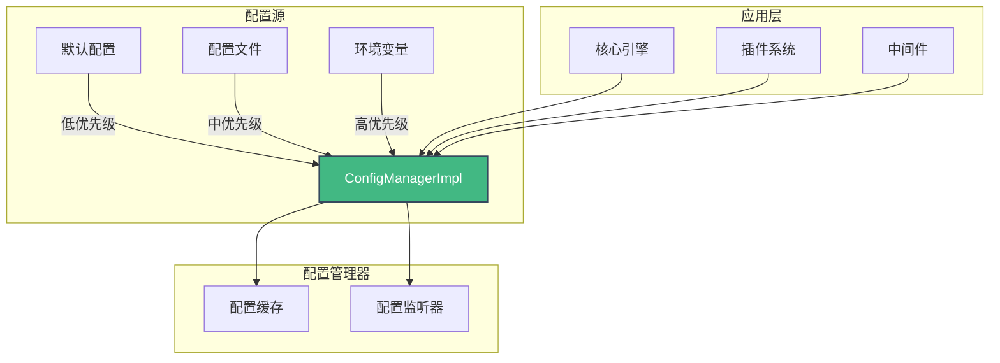
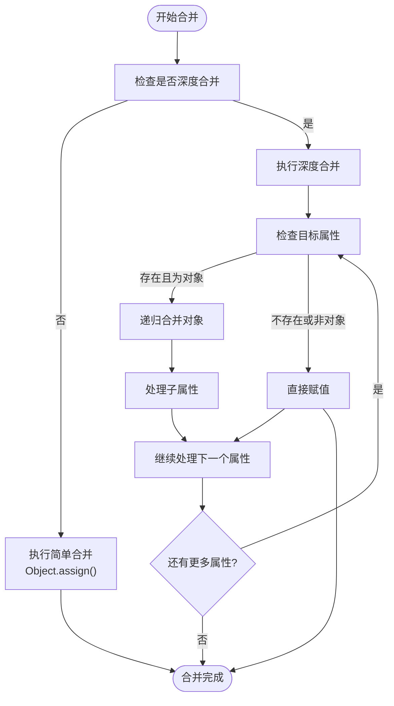
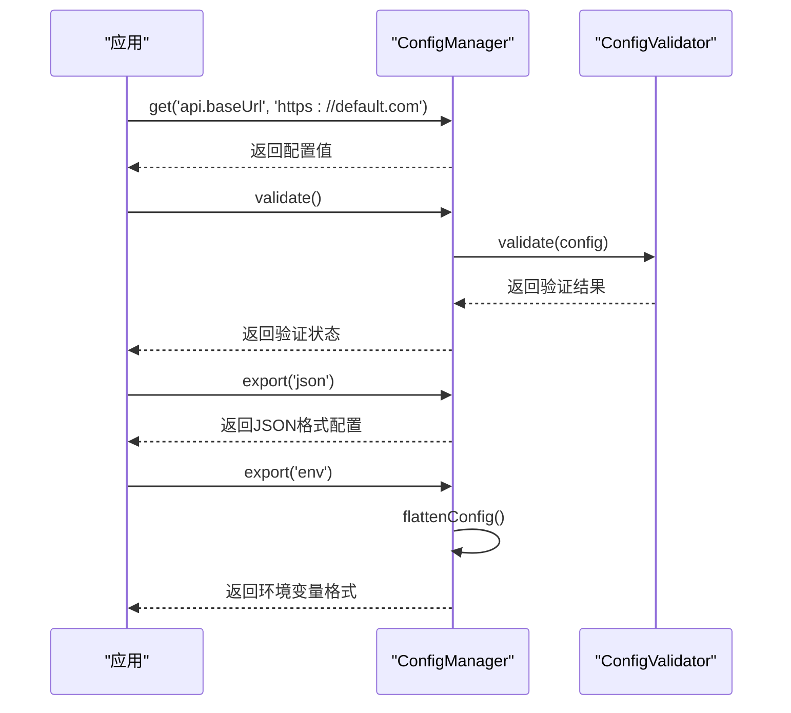
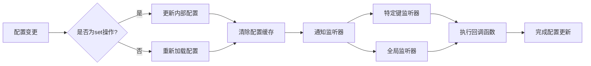
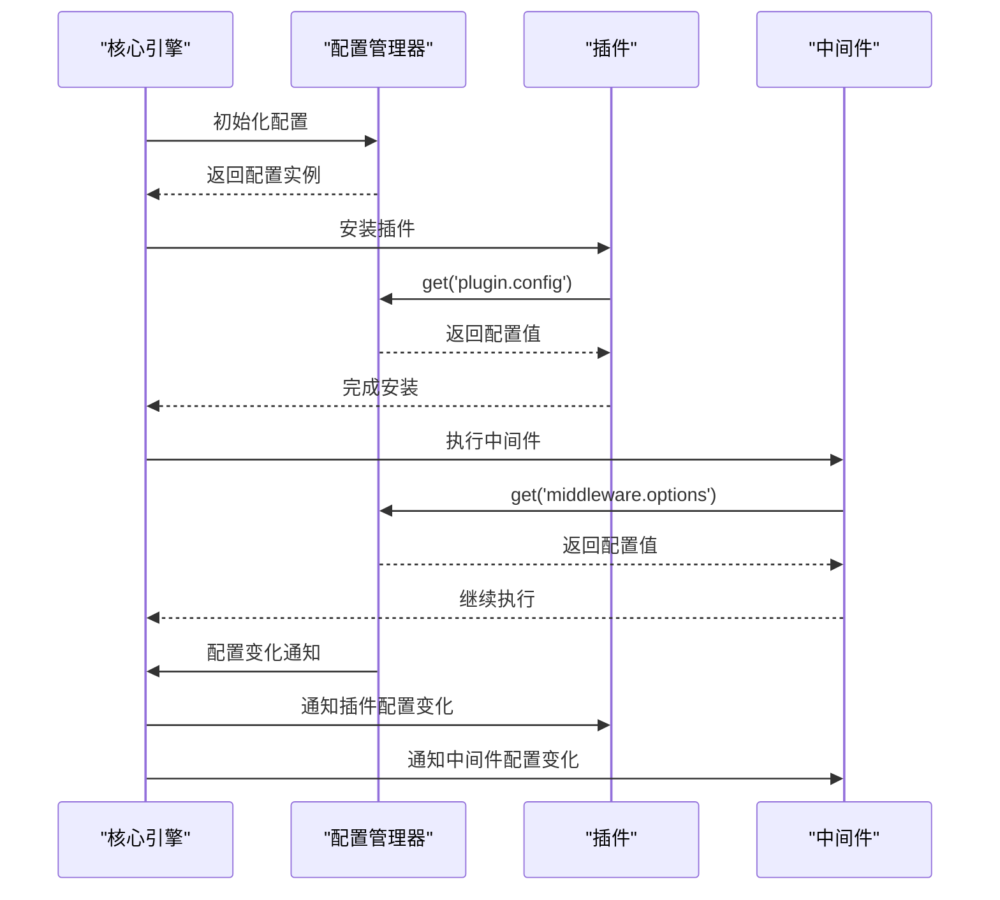
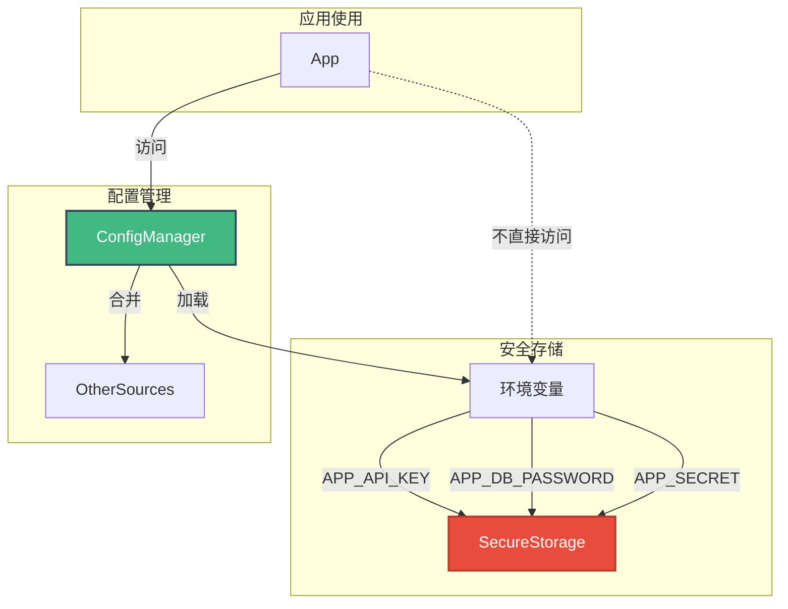
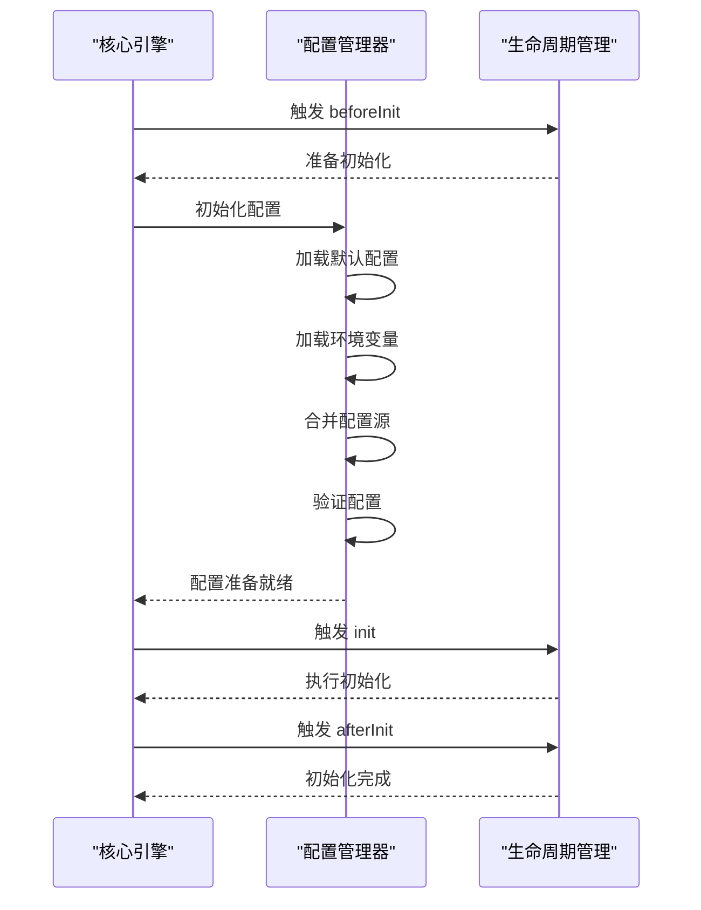

# 配置管理

<cite>
**本文档引用的文件**  
- [config-manager.ts](file://packages/core/src/config/config-manager.ts)
- [types.ts](file://packages/core/src/config/types.ts)
- [app.config.development.ts](file://packages/vue3/example/.ldesign/app.config.development.ts)
- [app.config.production.ts](file://packages/vue3/example/.ldesign/app.config.production.ts)
- [app.config.staging.ts](file://packages/vue3/example/.ldesign/app.config.staging.ts)
- [app.config.test.ts](file://packages/vue3/example/.ldesign/app.config.test.ts)
- [launcher.config.development.ts](file://packages/vue3/example/.ldesign/launcher.config.development.ts)
- [launcher.config.production.ts](file://packages/vue3/example/.ldesign/launcher.config.production.ts)
- [core-engine.ts](file://packages/core/src/engine/core-engine.ts)
- [main.ts](file://packages/vue3/example/src/main.ts)
- [i18n-plugin.ts](file://packages/vue3/src/plugins/i18n-plugin.ts)
- [router-plugin.ts](file://packages/vue3/src/plugins/router-plugin.ts)
</cite>

## 目录
1. [引言](#引言)
2. [配置管理架构](#配置管理架构)
3. [核心组件分析](#核心组件分析)
4. [多环境配置实现](#多环境配置实现)
5. [配置分层与合并策略](#配置分层与合并策略)
6. [类型安全与验证机制](#类型安全与验证机制)
7. [动态更新与监听机制](#动态更新与监听机制)
8. [插件与核心模块中的配置访问](#插件与核心模块中的配置访问)
9. [敏感配置安全存储](#敏感配置安全存储)
10. [配置管理与引擎初始化集成](#配置管理与引擎初始化集成)
11. [最佳实践与总结](#最佳实践与总结)

## 引言
配置管理是现代应用架构中的核心机制，它决定了应用在不同环境下的行为特征和适应能力。本系统通过`ConfigManager`实现了完整的配置管理解决方案，支持多环境配置、默认值合并、类型安全校验和动态更新等关键功能。配置管理不仅提升了应用的可移植性，还为开发、测试、预发布和生产等不同环境提供了灵活的适应机制。

## 配置管理架构
系统配置管理采用分层架构设计，通过配置源优先级机制实现灵活的配置覆盖策略。核心组件`ConfigManagerImpl`实现了配置的存储、检索、合并和监听功能，支持点号分隔的路径访问语法，便于访问嵌套配置项。



**图示来源**  
- [config-manager.ts](file://packages/core/src/config/config-manager.ts#L52-L682)
- [types.ts](file://packages/core/src/config/types.ts#L7-L187)

## 核心组件分析

### ConfigManagerImpl 实现
`ConfigManagerImpl`是配置管理的核心实现类，提供了完整的配置管理功能集。它通过内部存储`config`对象保存当前配置状态，并通过`sources`数组管理多个配置源，按优先级进行合并。

```mermaid
classDiagram
class ConfigManagerImpl {
-config : ConfigObject
-sources : ConfigSource[]
-loaders : ConfigLoader[]
-environment : Environment
-options : ConfigOptions
-watchers : Map<string, Set<(value : ConfigValue) => void>>
-globalWatchers : Set<(value : ConfigValue) => void>
+get(key : string, defaultValue? : T) : T
+set(key : string, value : ConfigValue) : void
+setAll(config : ConfigObject) : void
+has(key : string) : boolean
+delete(key : string) : boolean
+getAll() : ConfigObject
+clear() : void
+addSource(source : ConfigSource) : void
+addLoader(loader : ConfigLoader) : Promise<void>
+reload() : Promise<void>
+getEnvironment() : Environment
+setEnvironment(env : Environment) : void
+validate() : Promise<boolean>
+watch(key : string | ((value : any) => void), callback? : (value : any) => void) : () => void
+export(format? : 'json' | 'env') : string
+merge(config : ConfigObject, deep? : boolean) : void
}
class ConfigSource {
+name : string
+priority : number
+data : ConfigObject
+readonly? : boolean
}
class ConfigLoader {
+name : string
+load() : Promise<ConfigObject> | ConfigObject
+watch?(callback : (config : ConfigObject) => void) : () => void
}
class ConfigValidator {
+validate(config : ConfigObject) : boolean | Promise<boolean>
+getErrors?() : string[]
}
ConfigManagerImpl --> ConfigSource : "管理"
ConfigManagerImpl --> ConfigLoader : "使用"
ConfigManagerImpl --> ConfigValidator : "可选依赖"
```

**图示来源**  
- [config-manager.ts](file://packages/core/src/config/config-manager.ts#L52-L682)
- [types.ts](file://packages/core/src/config/types.ts#L36-L87)

**本节来源**  
- [config-manager.ts](file://packages/core/src/config/config-manager.ts#L52-L682)
- [types.ts](file://packages/core/src/config/types.ts#L7-L187)

## 多环境配置实现
系统支持多种环境配置，包括开发、测试、预发布和生产环境。通过`setEnvironment`方法可以动态切换当前环境，触发配置重新加载。环境变量前缀机制（默认为`APP_`）确保了环境变量的安全隔离。

```mermaid
stateDiagram-v2
[*] --> development
development --> test : setEnvironment('test')
test --> staging : setEnvironment('staging')
staging --> production : setEnvironment('production')
production --> development : setEnvironment('development')
state development {
[*] --> app.name : "Vue 3 Engine Example"
--> api.baseUrl : "http : //localhost : 8080/api"
--> features.enableDebug : true
--> dev.showConfigPanel : true
}
state test {
[*] --> app.name : "Vue 3 Engine Example"
--> api.baseUrl : "http : //localhost : 3001/api"
--> features.enableDebug : true
--> dev.showConfigPanel : true
}
state staging {
[*] --> app.name : "Vue 3 Engine Example"
--> api.baseUrl : "https : //staging-api.example.com"
--> features.enableDebug : false
--> dev.showConfigPanel : true
}
state production {
[*] --> app.name : "Vue 3 Engine Example"
--> api.baseUrl : "https : //api.example.com"
--> features.enableDebug : false
--> dev.showConfigPanel : false
}
```

**图示来源**  
- [app.config.development.ts](file://packages/vue3/example/.ldesign/app.config.development.ts#L1-L52)
- [app.config.test.ts](file://packages/vue3/example/.ldesign/app.config.test.ts#L1-L52)
- [app.config.staging.ts](file://packages/vue3/example/.ldesign/app.config.staging.ts#L1-L52)
- [app.config.production.ts](file://packages/vue3/example/.ldesign/app.config.production.ts#L1-L52)

**本节来源**  
- [config-manager.ts](file://packages/core/src/config/config-manager.ts#L331-L344)
- [app.config.development.ts](file://packages/vue3/example/.ldesign/app.config.development.ts#L1-L52)
- [app.config.production.ts](file://packages/vue3/example/.ldesign/app.config.production.ts#L1-L52)
- [app.config.staging.ts](file://packages/vue3/example/.ldesign/app.config.staging.ts#L1-L52)
- [app.config.test.ts](file://packages/vue3/example/.ldesign/app.config.test.ts#L1-L52)

## 配置分层与合并策略
配置系统采用分层合并策略，通过优先级机制解决配置冲突。配置源按优先级排序，高优先级配置源可以覆盖低优先级配置源的相同配置项。深度合并算法确保嵌套对象的正确合并，而不是简单替换。



**图示来源**  
- [config-manager.ts](file://packages/core/src/config/config-manager.ts#L636-L660)
- [config-manager.ts](file://packages/core/src/config/config-manager.ts#L428-L439)

**本节来源**  
- [config-manager.ts](file://packages/core/src/config/config-manager.ts#L428-L439)
- [config-manager.ts](file://packages/core/src/config/config-manager.ts#L636-L660)

## 类型安全与验证机制
系统通过泛型类型定义确保配置访问的类型安全。`get<T>`方法允许指定返回值类型，提供编译时类型检查。可选的`ConfigValidator`接口支持运行时配置验证，确保配置数据的完整性和正确性。



**图示来源**  
- [config-manager.ts](file://packages/core/src/config/config-manager.ts#L113-L126)
- [config-manager.ts](file://packages/core/src/config/config-manager.ts#L351-L357)
- [config-manager.ts](file://packages/core/src/config/config-manager.ts#L394-L420)

**本节来源**  
- [types.ts](file://packages/core/src/config/types.ts#L9-L187)
- [config-manager.ts](file://packages/core/src/config/config-manager.ts#L113-L126)
- [config-manager.ts](file://packages/core/src/config/config-manager.ts#L351-L357)

## 动态更新与监听机制
配置系统支持动态更新和变化监听。通过`watch`方法可以订阅特定配置项或全局配置的变化，当配置发生变化时，所有注册的监听器都会被调用。这种机制使得应用组件可以响应配置变化，实现动态行为调整。



**图示来源**  
- [config-manager.ts](file://packages/core/src/config/config-manager.ts#L366-L386)
- [config-manager.ts](file://packages/core/src/config/config-manager.ts#L515-L526)

**本节来源**  
- [config-manager.ts](file://packages/core/src/config/config-manager.ts#L134-L156)
- [config-manager.ts](file://packages/core/src/config/config-manager.ts#L366-L386)
- [config-manager.ts](file://packages/core/src/config/config-manager.ts#L515-L526)

## 插件与核心模块中的配置访问
插件系统和核心模块通过统一的接口安全访问配置项。插件在安装时可以访问配置，根据配置决定其行为。核心引擎在初始化时集成配置管理，确保所有子系统都能正确获取所需配置。



**图示来源**  
- [core-engine.ts](file://packages/core/src/engine/core-engine.ts#L75-L364)
- [main.ts](file://packages/vue3/example/src/main.ts#L63-L130)
- [i18n-plugin.ts](file://packages/vue3/src/plugins/i18n-plugin.ts#L38-L164)
- [router-plugin.ts](file://packages/vue3/src/plugins/router-plugin.ts#L60-L129)

**本节来源**  
- [core-engine.ts](file://packages/core/src/engine/core-engine.ts#L75-L364)
- [main.ts](file://packages/vue3/example/src/main.ts#L63-L130)
- [i18n-plugin.ts](file://packages/vue3/src/plugins/i18n-plugin.ts#L38-L164)
- [router-plugin.ts](file://packages/vue3/src/plugins/router-plugin.ts#L60-L129)

## 敏感配置安全存储
系统通过环境变量机制安全存储敏感配置。环境变量前缀（如`APP_`）确保了配置的命名空间隔离，防止意外暴露。配置导出功能支持将配置转换为环境变量格式，便于在不同部署环境中使用。



**图示来源**  
- [config-manager.ts](file://packages/core/src/config/config-manager.ts#L446-L471)
- [launcher.config.development.ts](file://packages/vue3/example/.ldesign/launcher.config.development.ts#L75-L79)
- [launcher.config.production.ts](file://packages/vue3/example/.ldesign/launcher.config.production.ts#L77-L80)

**本节来源**  
- [config-manager.ts](file://packages/core/src/config/config-manager.ts#L446-L471)
- [launcher.config.development.ts](file://packages/vue3/example/.ldesign/launcher.config.development.ts#L75-L79)
- [launcher.config.production.ts](file://packages/vue3/example/.ldesign/launcher.config.production.ts#L77-L80)

## 配置管理与引擎初始化集成
配置管理与核心引擎的初始化流程深度集成。在引擎初始化过程中，配置管理器首先加载默认配置，然后按优先级合并各个配置源，最后验证配置的正确性。这种集成确保了引擎在启动时拥有完整且正确的配置。



**图示来源**  
- [core-engine.ts](file://packages/core/src/engine/core-engine.ts#L166-L196)
- [config-manager.ts](file://packages/core/src/config/config-manager.ts#L85-L104)
- [config-manager.ts](file://packages/core/src/config/config-manager.ts#L298-L320)

**本节来源**  
- [core-engine.ts](file://packages/core/src/engine/core-engine.ts#L166-L196)
- [config-manager.ts](file://packages/core/src/config/config-manager.ts#L85-L104)
- [main.ts](file://packages/vue3/example/src/main.ts#L63-L130)

## 最佳实践与总结
配置管理在应用可移植性和环境适应性中扮演着关键角色。通过分层配置、优先级合并和环境隔离，系统实现了灵活的配置管理。最佳实践包括：使用环境变量存储敏感信息、为不同环境提供专用配置文件、实施配置验证确保数据完整性、利用监听机制实现动态行为调整。

配置管理的设计充分考虑了性能优化，通过缓存机制减少重复的配置克隆操作，确保在频繁访问配置时仍能保持良好的性能表现。同时，类型安全的设计减少了运行时错误，提高了开发效率和应用稳定性。

**本节来源**  
- [config-manager.ts](file://packages/core/src/config/config-manager.ts#L74-L78)
- [config-manager.ts](file://packages/core/src/config/config-manager.ts#L540-L566)
- [config-manager.ts](file://packages/core/src/config/config-manager.ts#L225-L238)