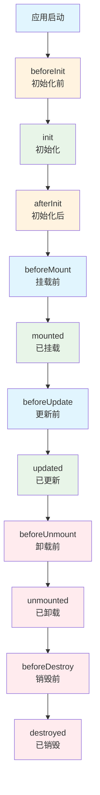
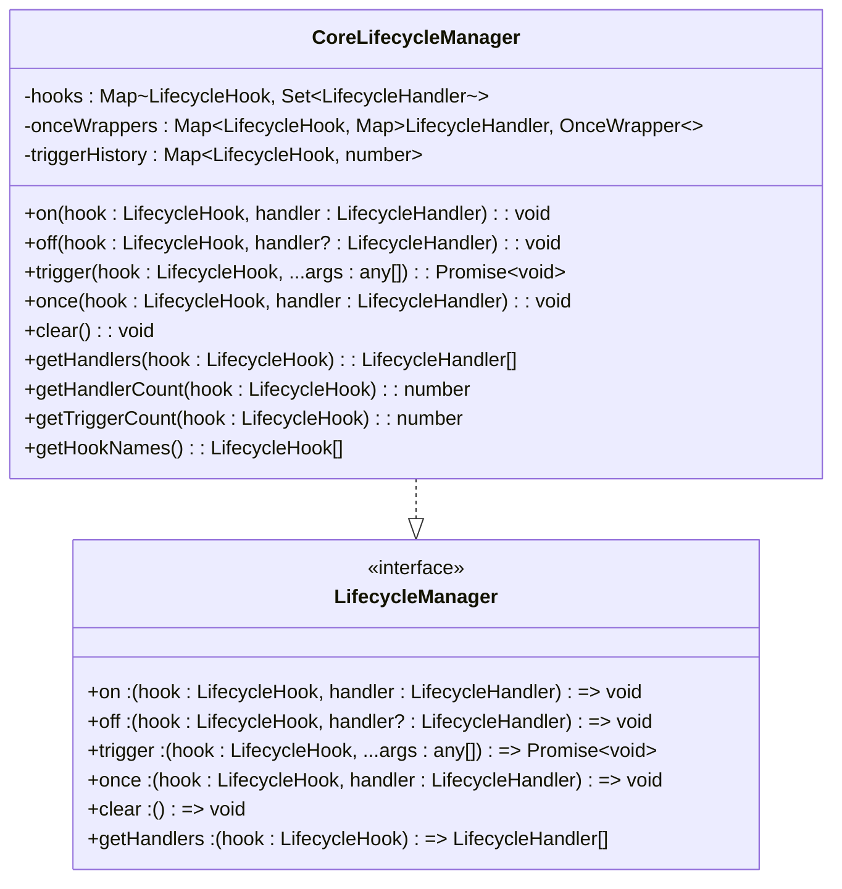
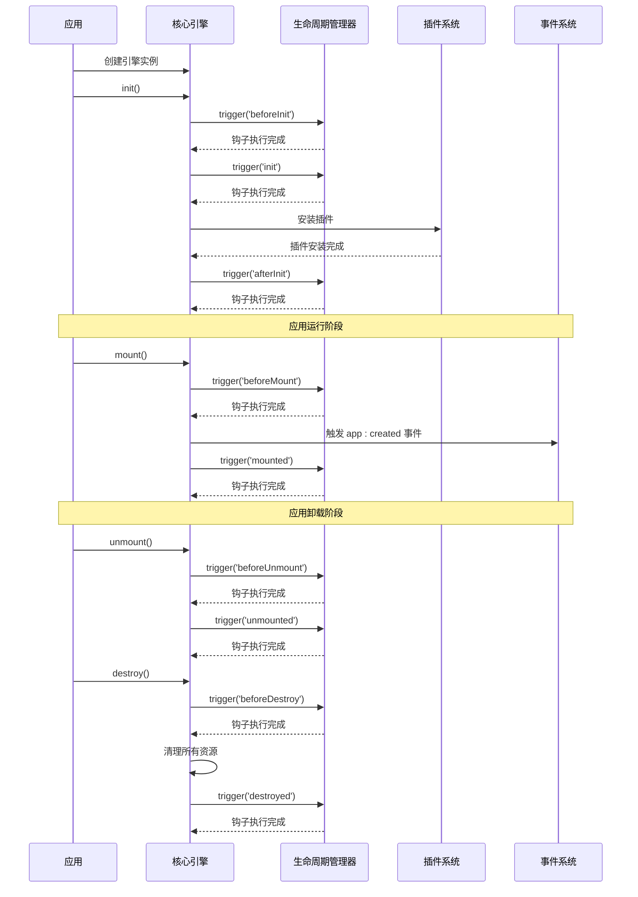
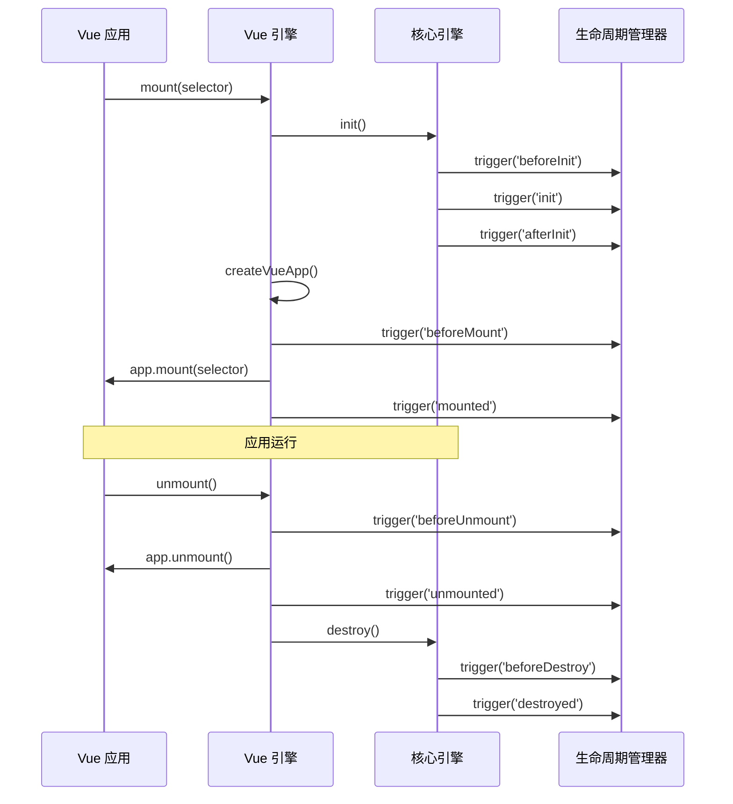
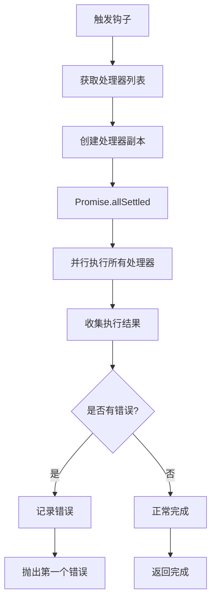
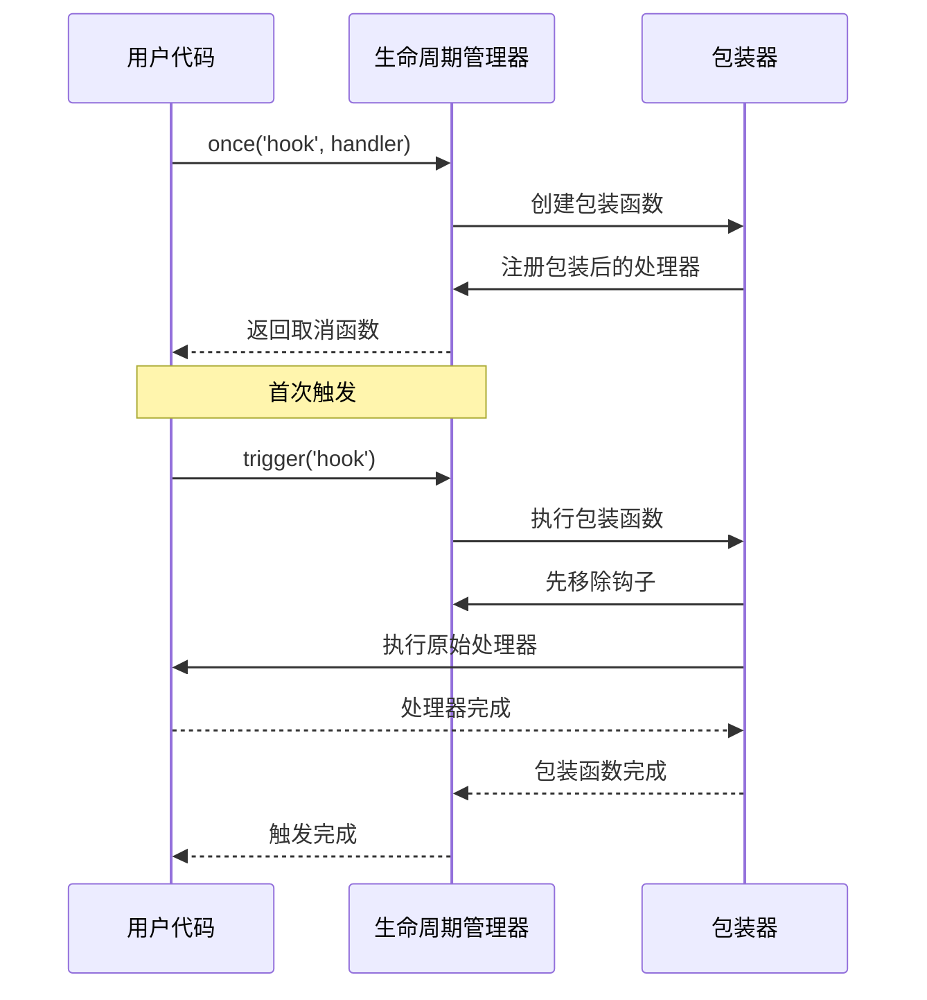
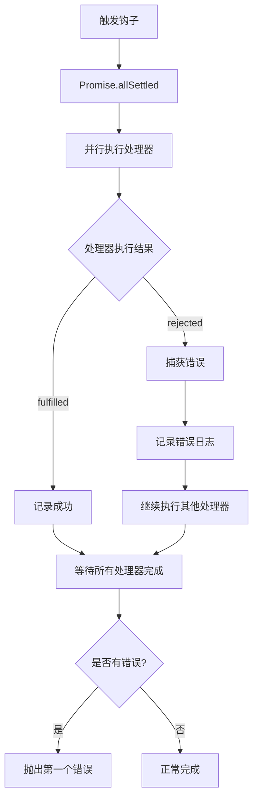

# 生命周期管理

<cite>
**本文档中引用的文件**
- [lifecycle-manager.ts](file://packages/core/src/lifecycle/lifecycle-manager.ts)
- [lifecycle.ts](file://packages/core/src/types/lifecycle.ts)
- [core-engine.ts](file://packages/core/src/engine/core-engine.ts)
- [vue-engine.ts](file://packages/vue3/src/engine/vue-engine.ts)
- [engine.ts](file://packages/core/src/types/engine.ts)
- [plugin-manager.ts](file://packages/core/src/plugin/plugin-manager.ts)
- [event-manager.ts](file://packages/core/src/event/event-manager.ts)
- [events.ts](file://packages/core/src/constants/events.ts)
- [LifecycleDemo.vue](file://packages/vue3/example/src/components/LifecycleDemo.vue)
- [core-engine.test.ts](file://packages/core/src/__tests__/core-engine.test.ts)
</cite>

## 目录
1. [简介](#简介)
2. [生命周期钩子概述](#生命周期钩子概述)
3. [核心生命周期管理器](#核心生命周期管理器)
4. [应用生命周期流程](#应用生命周期流程)
5. [生命周期钩子详解](#生命周期钩子详解)
6. [钩子注册与管理](#钩子注册与管理)
7. [异步执行机制](#异步执行机制)
8. [错误处理与隔离](#错误处理与隔离)
9. [实际应用场景](#实际应用场景)
10. [最佳实践与注意事项](#最佳实践与注意事项)
11. [总结](#总结)

## 简介

生命周期管理系统是 LDesign 引擎的核心组件之一，提供了统一的应用生命周期钩子管理机制。通过生命周期钩子，开发者可以在应用的不同阶段执行特定的操作，实现资源初始化、状态管理、插件安装等关键功能。

生命周期管理器支持同步和异步处理，具备错误隔离、内存优化和一次性钩子等功能特性，确保应用在复杂场景下的稳定性和可靠性。

## 生命周期钩子概述

生命周期钩子是应用在特定时间点触发的回调函数，按照执行顺序分为以下主要阶段：



**图表来源**
- [lifecycle-manager.ts](file://packages/core/src/lifecycle/lifecycle-manager.ts#L36-L46)

**章节来源**
- [lifecycle.ts](file://packages/core/src/types/lifecycle.ts#L8-L20)

## 核心生命周期管理器

### 类架构设计

生命周期管理器采用单例模式设计，提供完整的钩子管理功能：



**图表来源**
- [lifecycle-manager.ts](file://packages/core/src/lifecycle/lifecycle-manager.ts#L66-L355)
- [lifecycle.ts](file://packages/core/src/types/lifecycle.ts#L30-L44)

### 核心特性

1. **异步钩子处理**：支持 Promise-based 的异步钩子函数
2. **错误隔离**：单个钩子错误不影响其他钩子的执行
3. **一次性钩子**：钩子触发后自动移除
4. **内存优化**：自动清理空的钩子集合
5. **钩子优先级**：按注册顺序执行钩子

**章节来源**
- [lifecycle-manager.ts](file://packages/core/src/lifecycle/lifecycle-manager.ts#L26-L46)

## 应用生命周期流程

### 核心引擎生命周期

核心引擎遵循严格的生命周期管理流程：



**图表来源**
- [core-engine.ts](file://packages/core/src/engine/core-engine.ts#L166-L269)
- [vue-engine.ts](file://packages/vue3/src/engine/vue-engine.ts#L208-L242)

### Vue 引擎生命周期

Vue 引擎在核心引擎基础上增加了框架特定的生命周期管理：



**图表来源**
- [vue-engine.ts](file://packages/vue3/src/engine/vue-engine.ts#L186-L242)

**章节来源**
- [core-engine.ts](file://packages/core/src/engine/core-engine.ts#L141-L269)
- [vue-engine.ts](file://packages/vue3/src/engine/vue-engine.ts#L74-L242)

## 生命周期钩子详解

### 初始化阶段钩子

#### beforeInit - 初始化前
- **触发时机**：引擎初始化开始前
- **用途**：准备初始化环境、验证前置条件
- **典型操作**：
  - 检查系统环境
  - 验证配置参数
  - 准备必要的资源

#### init - 初始化
- **触发时机**：引擎核心功能初始化
- **用途**：执行核心初始化逻辑
- **典型操作**：
  - 创建核心管理器实例
  - 加载基础配置
  - 初始化核心服务

#### afterInit - 初始化后
- **触发时机**：引擎初始化完成后
- **用途**：执行初始化后的后续操作
- **典型操作**：
  - 安装插件
  - 注册事件监听器
  - 启动后台任务

### 挂载阶段钩子

#### beforeMount - 挂载前
- **触发时机**：应用挂载前
- **用途**：准备挂载前的最后工作
- **典型操作**：
  - 创建 Vue 应用实例
  - 注册全局服务
  - 安装插件

#### mounted - 已挂载
- **触发时机**：应用挂载完成后
- **用途**：挂载后的初始化操作
- **典型操作**：
  - 触发 app:created 事件
  - 注册 DOM 事件监听器
  - 启动定时任务

### 更新阶段钩子

#### beforeUpdate - 更新前
- **触发时机**：应用状态更新前
- **用途**：更新前的准备工作
- **典型操作**：
  - 保存当前状态
  - 预处理更新数据

#### updated - 已更新
- **触发时机**：应用状态更新完成后
- **用途**：更新后的处理工作
- **典型操作**：
  - 更新视图
  - 触发相关事件
  - 执行副作用

### 卸载阶段钩子

#### beforeUnmount - 卸载前
- **触发时机**：应用卸载前
- **用途**：清理卸载前的工作
- **典型操作**：
  - 停止定时器
  - 取消网络请求
  - 清理事件监听器

#### unmounted - 已卸载
- **触发时机**：应用卸载完成后
- **用途**：卸载后的清理工作
- **典型操作**：
  - 清理 DOM 元素
  - 释放内存资源
  - 触发卸载事件

### 销毁阶段钩子

#### beforeDestroy - 销毁前
- **触发时机**：引擎销毁前
- **用途**：销毁前的准备工作
- **典型操作**：
  - 停止所有活动
  - 保存重要数据
  - 清理临时资源

#### destroyed - 已销毁
- **触发时机**：引擎销毁完成后
- **用途**：销毁后的最终清理
- **典型操作**：
  - 清理所有管理器
  - 释放全局资源
  - 触发销毁完成事件

**章节来源**
- [lifecycle-manager.ts](file://packages/core/src/lifecycle/lifecycle-manager.ts#L36-L46)
- [events.ts](file://packages/core/src/constants/events.ts#L40-L58)

## 钩子注册与管理

### 基本注册方法

#### on() - 注册钩子
```typescript
// 注册同步钩子
engine.lifecycle.on('mounted', () => {
  console.log('应用已挂载');
});

// 注册异步钩子
engine.lifecycle.on('beforeInit', async () => {
  await loadConfiguration();
  await initializeServices();
});
```

#### once() - 一次性钩子
```typescript
// 注册一次性钩子，在首次触发后自动移除
engine.lifecycle.once('init', () => {
  console.log('这是唯一的一次执行');
});
```

#### off() - 移除钩子
```typescript
// 移除特定钩子处理器
const handler = () => {};
engine.lifecycle.on('mounted', handler);
engine.lifecycle.off('mounted', handler);

// 移除所有钩子处理器
engine.lifecycle.off('mounted');
```

### 高级管理功能

#### 获取钩子信息
```typescript
// 获取所有钩子处理器
const handlers = engine.lifecycle.getHandlers('mounted');

// 获取钩子处理器数量
const count = engine.lifecycle.getHandlerCount('mounted');

// 获取钩子触发次数
const triggerCount = engine.lifecycle.getTriggerCount('mounted');

// 获取所有钩子名称
const hooks = engine.lifecycle.getHookNames();
```

#### 清理管理器
```typescript
// 清空所有钩子
engine.lifecycle.clear();
```

**章节来源**
- [lifecycle-manager.ts](file://packages/core/src/lifecycle/lifecycle-manager.ts#L76-L337)

## 异步执行机制

### 并行执行策略

生命周期管理器采用并行执行策略，提高性能：



**图表来源**
- [lifecycle-manager.ts](file://packages/core/src/lifecycle/lifecycle-manager.ts#L189-L211)

### 异步钩子示例

```typescript
// 异步钩子处理多个任务
engine.lifecycle.on('init', async () => {
  await Promise.all([
    loadDatabase(),
    loadConfiguration(),
    initializeCache(),
    connectToServices()
  ]);
  
  console.log('所有初始化任务完成');
});
```

### 一次性钩子包装机制



**图表来源**
- [lifecycle-manager.ts](file://packages/core/src/lifecycle/lifecycle-manager.ts#L230-L249)

**章节来源**
- [lifecycle-manager.ts](file://packages/core/src/lifecycle/lifecycle-manager.ts#L173-L211)

## 错误处理与隔离

### 错误隔离机制

生命周期管理器实现了完善的错误隔离机制：



**图表来源**
- [lifecycle-manager.ts](file://packages/core/src/lifecycle/lifecycle-manager.ts#L189-L211)

### 错误处理示例

```typescript
// 单个钩子错误不会影响其他钩子
engine.lifecycle.on('init', async () => {
  await initializeFirstService();
});

engine.lifecycle.on('init', async () => {
  try {
    await initializeSecondService();
  } catch (error) {
    // 处理特定错误
    console.error('服务初始化失败:', error);
  }
});

// 触发时即使有错误也会执行所有钩子
await engine.lifecycle.trigger('init'); // 所有钩子都会执行
```

### 错误恢复策略

```typescript
// 实现错误恢复机制
engine.lifecycle.on('init', async () => {
  try {
    await criticalInitialization();
  } catch (error) {
    console.error('关键初始化失败，尝试降级方案');
    await fallbackInitialization();
  }
});
```

**章节来源**
- [lifecycle-manager.ts](file://packages/core/src/lifecycle/lifecycle-manager.ts#L190-L206)

## 实际应用场景

### 插件安装场景

```typescript
// 在初始化阶段安装插件
engine.lifecycle.on('init', async () => {
  // 安装必需插件
  await engine.use({
    name: 'router',
    version: '1.0.0',
    install(ctx) {
      // 路由插件安装逻辑
      ctx.engine.state.set('routerReady', true);
    }
  });
  
  // 安装可选插件
  await engine.use({
    name: 'analytics',
    version: '1.0.0',
    install(ctx) {
      // 分析插件安装逻辑
      ctx.engine.events.on('page:view', trackPageView);
    }
  });
});
```

### 资源初始化场景

```typescript
// 资源初始化钩子
engine.lifecycle.on('beforeInit', async () => {
  // 加载配置文件
  const config = await loadConfig();
  engine.state.set('config', config);
  
  // 初始化数据库连接
  const db = await createDatabaseConnection(config.database);
  engine.state.set('db', db);
});

engine.lifecycle.on('afterInit', async () => {
  // 启动后台任务
  const tasks = [
    startBackgroundSync(),
    startHealthCheck(),
    startMetricsCollection()
  ];
  
  await Promise.all(tasks);
});
```

### Vue 应用生命周期管理

```typescript
// Vue 引擎生命周期钩子
engine.lifecycle.on('beforeMount', async () => {
  // 在挂载前安装插件
  await engine.use(i18nPlugin);
  await engine.use(routerPlugin);
});

engine.lifecycle.on('mounted', () => {
  // 应用挂载后启动应用
  console.log('应用已启动');
  
  // 触发应用就绪事件
  engine.events.emit('app:ready', {
    timestamp: Date.now(),
    version: '1.0.0'
  });
});
```

### 清理和销毁场景

```typescript
// 销毁前清理资源
engine.lifecycle.on('beforeDestroy', async () => {
  // 停止所有定时器
  timers.forEach(timer => timer.stop());
  
  // 关闭数据库连接
  await engine.state.get('db')?.close();
  
  // 清理缓存
  await cache.clear();
});

engine.lifecycle.on('destroyed', () => {
  console.log('应用已完全销毁');
  
  // 记录销毁统计信息
  logDestructionStats();
});
```

**章节来源**
- [plugin-manager.ts](file://packages/core/src/plugin/plugin-manager.ts#L67-L143)
- [vue-engine.ts](file://packages/vue3/src/engine/vue-engine.ts#L113-L119)

## 最佳实践与注意事项

### 避免阻塞操作

```typescript
// ❌ 避免在生命周期钩子中执行阻塞操作
engine.lifecycle.on('init', () => {
  // 阻塞主线程
  for (let i = 0; i < 1000000000; i++) {
    // 复杂计算
  }
});

// ✅ 使用异步操作
engine.lifecycle.on('init', async () => {
  // 使用异步操作
  await heavyCalculation();
});
```

### 合理使用一次性钩子

```typescript
// ✅ 适合使用一次性钩子的场景
engine.lifecycle.once('init', async () => {
  // 只需要执行一次的初始化操作
  await setupGlobalErrorHandler();
});

// ❌ 不适合使用一次性钩子的场景
engine.lifecycle.once('mounted', () => {
  // 每次挂载都需要执行的操作
  updateUI();
});
```

### 错误处理最佳实践

```typescript
// ✅ 实现完善的错误处理
engine.lifecycle.on('init', async () => {
  try {
    await initializeCriticalServices();
  } catch (error) {
    console.error('关键服务初始化失败:', error);
    
    // 提供降级方案
    await initializeFallbackServices();
    
    // 抛出自定义错误以便上层处理
    throw new Error('初始化失败', { cause: error });
  }
});
```

### 内存泄漏防护

```typescript
// ✅ 正确清理资源
let cleanupTasks: (() => void)[] = [];

engine.lifecycle.on('init', () => {
  const unsubscribe = engine.events.on('some:event', handler);
  cleanupTasks.push(unsubscribe);
});

engine.lifecycle.on('beforeDestroy', () => {
  // 清理所有资源
  cleanupTasks.forEach(task => task());
  cleanupTasks = [];
});
```

### 性能优化建议

```typescript
// ✅ 使用批量操作提高性能
engine.lifecycle.on('init', async () => {
  // 批量初始化多个服务
  const [service1, service2, service3] = await Promise.all([
    initializeService1(),
    initializeService2(),
    initializeService3()
  ]);
  
  // 设置初始状态
  engine.state.setMany({
    service1,
    service2,
    service3,
    initialized: true
  });
});
```

### 调试和监控

```typescript
// ✅ 添加调试信息
engine.lifecycle.on('init', async () => {
  console.time('初始化耗时');
  
  try {
    await initializeServices();
    console.log('初始化完成');
  } catch (error) {
    console.error('初始化失败:', error);
    throw error;
  } finally {
    console.timeEnd('初始化耗时');
  }
});
```

### 生命周期钩子命名约定

```typescript
// 推荐的钩子命名格式
engine.lifecycle.on('plugin:myPlugin:installed', () => {
  // 插件安装完成
});

engine.lifecycle.on('app:configuration:loaded', () => {
  // 配置加载完成
});

engine.lifecycle.on('user:authenticated', () => {
  // 用户认证完成
});
```

## 总结

LDesign 引擎的生命周期管理系统提供了强大而灵活的应用生命周期管理能力。通过统一的钩子接口，开发者可以在应用的各个关键阶段执行自定义逻辑，实现资源管理、插件安装、状态初始化等核心功能。

### 主要优势

1. **统一管理**：提供一致的生命周期钩子接口
2. **异步支持**：全面支持异步钩子处理
3. **错误隔离**：完善的错误处理和隔离机制
4. **内存优化**：自动清理机制防止内存泄漏
5. **扩展性强**：支持插件和第三方扩展

### 核心概念回顾

- **生命周期钩子**：应用在特定时间点触发的回调函数
- **钩子注册**：通过 `on()`、`once()` 方法注册钩子
- **异步执行**：并行执行多个钩子，提高性能
- **错误处理**：单个钩子错误不影响整体流程
- **资源管理**：在合适的生命周期阶段进行资源初始化和清理

### 开发建议

1. **合理规划钩子使用**：根据业务需求选择合适的生命周期阶段
2. **避免阻塞操作**：始终使用异步方式处理耗时任务
3. **完善错误处理**：为关键钩子添加错误处理和恢复机制
4. **注意内存管理**：及时清理不需要的资源和监听器
5. **充分利用异步特性**：使用并行执行提高应用性能

通过掌握生命周期管理系统的这些核心概念和最佳实践，开发者可以构建更加健壮、高效和可维护的应用程序。