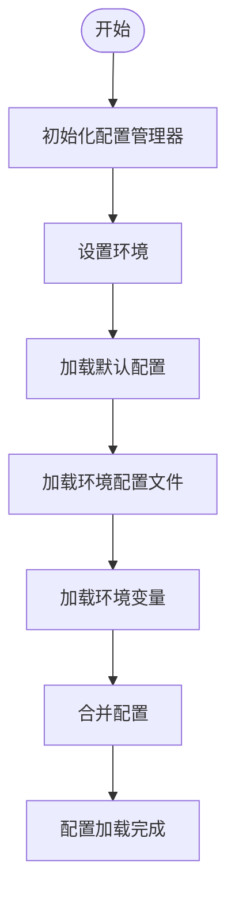
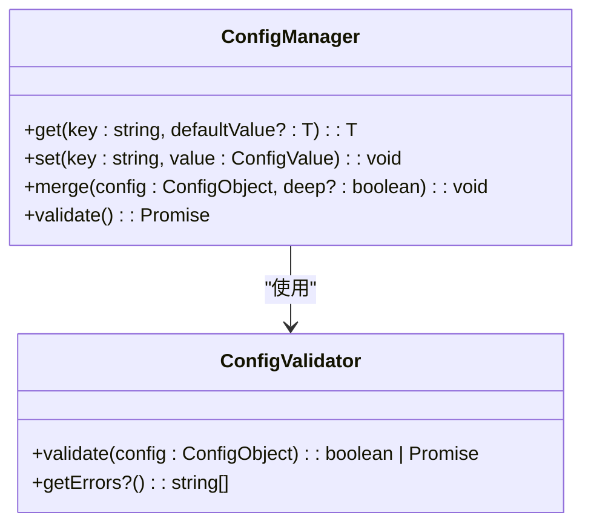
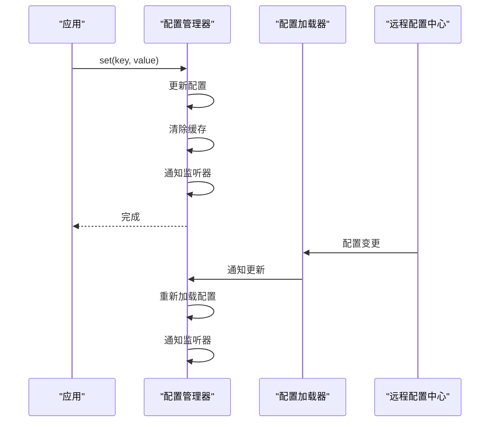
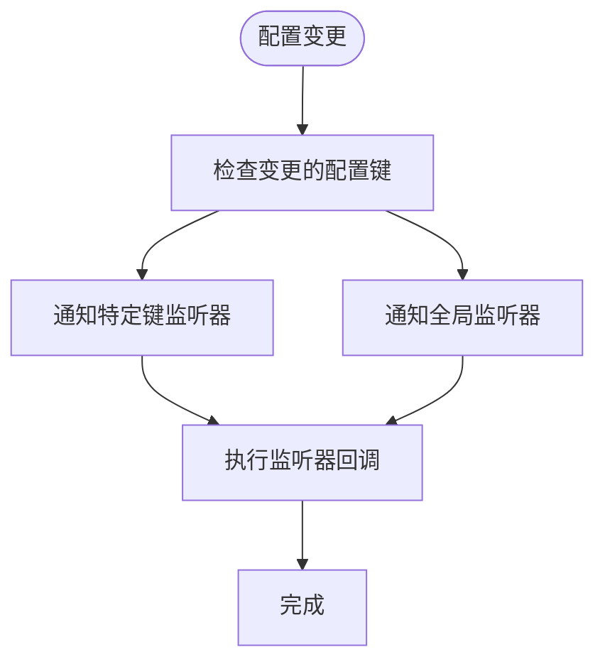

# 配置管理

<cite>
**本文档引用的文件**   
- [config-manager.ts](file://packages\core\src\config\config-manager.ts)
- [types.ts](file://packages\core\src\config\types.ts)
- [builder.config.ts](file://packages\core\builder.config.ts)
- [app.config.development.ts](file://packages\vue3\example\.ldesign\app.config.development.ts)
- [app.config.production.ts](file://packages\vue3\example\.ldesign\app.config.production.ts)
- [app.config.staging.ts](file://packages\vue3\example\.ldesign\app.config.staging.ts)
- [app.config.test.ts](file://packages\vue3\example\.ldesign\app.config.test.ts)
- [launcher.config.development.ts](file://packages\vue3\example\.ldesign\launcher.config.development.ts)
- [launcher.config.production.ts](file://packages\vue3\example\.ldesign\launcher.config.production.ts)
- [vue-engine.ts](file://packages\vue3\src\engine\vue-engine.ts)
- [use-engine.ts](file://packages\vue3\src\composables\use-engine.ts)
- [core-engine.ts](file://packages\core\src\engine\core-engine.ts)
</cite>

## 目录
1. [配置管理概述](#配置管理概述)
2. [环境感知的配置加载](#环境感知的配置加载)
3. [默认值合并与类型安全校验](#默认值合并与类型安全校验)
4. [动态更新机制](#动态更新机制)
5. [配置管理与其他模块的协作](#配置管理与其他模块的协作)
6. [配置变更的监听与响应](#配置变更的监听与响应)
7. [多环境配置组织方式](#多环境配置组织方式)
8. [敏感信息处理建议](#敏感信息处理建议)

## 配置管理概述

配置管理系统是整个应用架构的核心组件，负责管理应用的配置数据。系统通过 `config-manager` 模块提供完整的配置管理功能，支持多源配置管理、环境切换、配置验证和动态更新等特性。配置管理器实现了 `ConfigManager` 接口，提供了统一的配置操作API，包括获取、设置、监听和验证配置等功能。

配置管理器采用分层架构设计，支持从多个配置源加载配置，并根据优先级进行合并。系统支持开发、测试、预发布和生产等多种环境，能够根据当前环境自动加载相应的配置。配置管理器还提供了性能优化机制，如配置缓存和深度克隆优化，确保在高并发场景下的性能表现。

**本节来源**
- [config-manager.ts](file://packages\core\src\config\config-manager.ts#L1-L683)
- [types.ts](file://packages\core\src\config\types.ts#L1-L187)

## 环境感知的配置加载

配置管理系统支持环境感知的配置加载机制，能够根据当前运行环境自动加载相应的配置文件。系统通过 `environment` 参数识别当前环境，支持 'development'、'test'、'staging' 和 'production' 等标准环境，同时也支持自定义环境名称。

环境配置的加载流程如下：
1. 初始化配置管理器时指定当前环境
2. 根据环境名称加载对应的配置文件（如 `app.config.development.ts`）
3. 合并环境特定配置与默认配置
4. 加载环境变量并进行合并

系统通过 `setEnvironment` 方法支持运行时环境切换，当环境发生变化时，会触发配置重新加载，确保应用能够动态适应环境变化。配置管理器还支持环境变量前缀配置，通过 `envPrefix` 选项指定环境变量的前缀，避免命名冲突。



**本节来源**
- [config-manager.ts](file://packages\core\src\config\config-manager.ts#L63-L344)
- [app.config.development.ts](file://packages\vue3\example\.ldesign\app.config.development.ts#L1-L52)
- [app.config.production.ts](file://packages\vue3\example\.ldesign\app.config.production.ts#L1-L52)

## 默认值合并与类型安全校验

配置管理系统提供了强大的默认值合并和类型安全校验功能。系统支持深度合并（deep merge）和浅合并（shallow merge）两种模式，确保配置数据的完整性和一致性。

默认值合并机制通过 `defaults` 选项实现，允许在初始化配置管理器时指定默认配置。当获取配置值时，如果指定的配置项不存在，系统会返回默认值。对于嵌套对象，系统采用深度合并策略，确保子属性也能正确合并。

类型安全校验通过 `ConfigValidator` 接口实现，允许自定义配置验证逻辑。验证器可以同步或异步执行，返回布尔值表示配置是否有效。系统还提供了获取验证错误信息的方法，便于调试和错误处理。



**本节来源**
- [config-manager.ts](file://packages\core\src\config\config-manager.ts#L95-L98)
- [types.ts](file://packages\core\src\config\types.ts#L64-L69)
- [config-manager.ts](file://packages\core\src\config\config-manager.ts#L428-L439)

## 动态更新机制

配置管理系统提供了灵活的动态更新机制，支持运行时配置修改和自动更新。系统通过 `set`、`setAll` 和 `merge` 方法提供配置更新功能，支持单个配置项更新和批量更新。

动态更新机制的关键特性包括：
- **实时更新**：配置更新后立即生效，无需重启应用
- **缓存管理**：更新配置时自动清除相关缓存，确保数据一致性
- **事件通知**：配置更新后触发监听器，通知相关组件
- **事务性操作**：支持批量更新，确保配置的一致性

系统还支持配置加载器（ConfigLoader）机制，允许从外部源（如远程配置中心）动态加载配置。当外部配置发生变化时，加载器会通知配置管理器进行更新，实现配置的自动同步。



**本节来源**
- [config-manager.ts](file://packages\core\src\config\config-manager.ts#L134-L156)
- [config-manager.ts](file://packages\core\src\config\config-manager.ts#L278-L293)
- [config-manager.ts](file://packages\core\src\config\config-manager.ts#L515-L526)

## 配置管理与其他模块的协作

配置管理系统与引擎的其他核心模块紧密协作，形成完整的应用架构。配置管理器作为核心服务被注入到各个模块中，为它们提供配置支持。

在 Vue3 引擎中，配置管理器通过依赖注入机制提供给所有组件使用。VueEngine 在初始化时创建配置管理器实例，并通过 provide/inject 机制将其注入到 Vue 应用上下文中。这样，所有组件都可以通过组合式 API 访问配置管理器。

与其他模块的协作关系包括：
- **插件系统**：插件可以通过配置管理器获取配置，也可以注册自己的配置
- **中间件系统**：中间件可以根据配置调整行为
- **状态管理系统**：配置可以作为初始状态的一部分
- **事件系统**：配置变更可以触发事件

```mermaid
graph TB
subgraph "核心引擎"
Config[配置管理器]
Plugin[插件管理器]
Middleware[中间件管理器]
State[状态管理器]
Event[事件管理器]
end
Config --> Plugin : "提供配置"
Config --> Middleware : "提供配置"
Config --> State : "提供初始状态"
Config --> Event : "触发变更事件"
Plugin --> Config : "注册配置"
Middleware --> Config : "读取配置"
```

**本节来源**
- [vue-engine.ts](file://packages\vue3\src\engine\vue-engine.ts#L82-L109)
- [use-engine.ts](file://packages\vue3\src\composables\use-engine.ts#L26-L132)
- [core-engine.ts](file://packages\core\src\engine\core-engine.ts#L77-L98)

## 配置变更的监听与响应

配置管理系统提供了完善的配置变更监听与响应机制。系统支持两种监听模式：特定键监听和全局监听。通过 `watch` 方法，可以订阅配置项的变化，当配置更新时执行回调函数。

监听机制的关键特性包括：
- **精确监听**：可以监听特定配置键的变化
- **全局监听**：可以监听所有配置的变化
- **自动清理**：返回取消监听函数，便于资源管理
- **异步安全**：监听器在事件循环中执行，避免阻塞

在 Vue3 组合式 API 中，系统提供了 `useConfigValue` 函数，将配置值转换为响应式引用（Ref），当配置变化时自动更新组件状态。这使得配置管理与 Vue 的响应式系统无缝集成。



**本节来源**
- [config-manager.ts](file://packages\core\src\config\config-manager.ts#L366-L386)
- [use-engine.ts](file://packages\vue3\src\composables\use-engine.ts#L156-L171)
- [config-manager.ts](file://packages\core\src\config\config-manager.ts#L515-L526)

## 多环境配置组织方式

配置管理系统采用模块化的多环境配置组织方式，通过独立的配置文件管理不同环境的配置。每个环境都有对应的配置文件，如 `app.config.development.ts`、`app.config.production.ts` 等，文件命名遵循统一的模式。

多环境配置的组织结构如下：
- **基础配置**：包含所有环境共享的配置
- **环境特定配置**：包含特定环境的配置，如 API 地址、调试选项等
- **默认配置**：在配置管理器中定义的默认值
- **环境变量**：运行时通过环境变量覆盖配置

系统通过配置优先级机制确保配置的正确合并，优先级顺序为：环境变量 > 环境特定配置 > 基础配置 > 默认配置。这种分层结构使得配置管理既灵活又安全。

```mermaid
erDiagram
CONFIG ||--o{ ENVIRONMENT : "包含"
ENVIRONMENT ||--o{ CONFIG_FILE : "使用"
CONFIG_FILE ||--o{ CONFIG_ITEM : "包含"
class CONFIG {
string name
string description
}
class ENVIRONMENT {
string name
string description
}
class CONFIG_FILE {
string filename
string path
}
class CONFIG_ITEM {
string key
string value
string type
}
```

**本节来源**
- [app.config.development.ts](file://packages\vue3\example\.ldesign\app.config.development.ts#L1-L52)
- [app.config.production.ts](file://packages\vue3\example\.ldesign\app.config.production.ts#L1-L52)
- [app.config.staging.ts](file://packages\vue3\example\.ldesign\app.config.staging.ts#L1-L52)
- [app.config.test.ts](file://packages\vue3\example\.ldesign\app.config.test.ts#L1-L52)

## 敏感信息处理建议

在处理敏感信息时，配置管理系统提供了多种安全机制和最佳实践建议。系统不建议在配置文件中直接存储敏感信息，而是推荐使用环境变量或安全的配置中心。

敏感信息处理的最佳实践包括：
- **使用环境变量**：将敏感信息（如 API 密钥、数据库密码）通过环境变量注入
- **配置文件忽略**：将包含敏感信息的配置文件添加到 .gitignore，避免提交到版本控制
- **加密存储**：在配置中心存储敏感信息时使用加密
- **权限控制**：限制敏感配置的访问权限
- **运行时注入**：在应用启动时从安全源加载敏感配置

系统支持通过 `envPrefix` 选项指定环境变量前缀，如 `APP_`，这样可以方便地从环境变量加载配置，同时避免与其他环境变量冲突。对于需要在客户端使用的配置，建议只暴露必要的非敏感信息。

**本节来源**
- [config-manager.ts](file://packages\core\src\config\config-manager.ts#L87-L90)
- [config-manager.ts](file://packages\core\src\config\config-manager.ts#L446-L471)
- [launcher.config.development.ts](file://packages\vue3\example\.ldesign\launcher.config.development.ts#L75-L79)
- [launcher.config.production.ts](file://packages\vue3\example\.ldesign\launcher.config.production.ts#L77-L81)