# 项目概述

<cite>
**本文档中引用的文件**
- [README.md](file://README.md)
- [packages/core/README.md](file://packages/core/README.md)
- [packages/vue3/README.md](file://packages/vue3/README.md)
- [packages/core/src/index.ts](file://packages/core/src/index.ts)
- [packages/vue3/src/index.ts](file://packages/vue3/src/index.ts)
- [packages/core/src/engine/core-engine.ts](file://packages/core/src/engine/core-engine.ts)
- [packages/core/src/plugin/plugin-manager.ts](file://packages/core/src/plugin/plugin-manager.ts)
- [packages/core/src/middleware/middleware-manager.ts](file://packages/core/src/middleware/middleware-manager.ts)
- [packages/core/src/lifecycle/lifecycle-manager.ts](file://packages/core/src/lifecycle/lifecycle-manager.ts)
- [packages/core/src/event/event-manager.ts](file://packages/core/src/event/event-manager.ts)
- [packages/core/src/state/state-manager.ts](file://packages/core/src/state/state-manager.ts)
- [packages/vue3/src/engine/vue-engine.ts](file://packages/vue3/src/engine/vue-engine.ts)
- [packages/core/src/types/index.ts](file://packages/core/src/types/index.ts)
- [package.json](file://package.json)
</cite>

## 目录
1. [项目简介](#项目简介)
2. [核心设计理念](#核心设计理念)
3. [架构概览](#架构概览)
4. [核心功能模块](#核心功能模块)
5. [分层架构设计](#分层架构设计)
6. [框架适配器系统](#框架适配器系统)
7. [插件化生态系统](#插件化生态系统)
8. [中间件系统](#中间件系统)
9. [生命周期管理](#生命周期管理)
10. [事件系统](#事件系统)
11. [状态管理](#状态管理)
12. [性能优化特性](#性能优化特性)
13. [开发指南](#开发指南)
14. [最佳实践](#最佳实践)

## 项目简介

LDesign Engine 是一个通用的前端应用引擎框架，专为现代Web应用开发而设计。它提供了一套完整的解决方案，支持多种前端框架（Vue 3、React、Svelte等），并通过插件化架构实现了高度的可扩展性和灵活性。

### 核心价值主张

- **框架无关性**：核心引擎不依赖任何特定前端框架，确保代码的可移植性和长期维护性
- **统一API**：所有框架适配器提供完全一致的API接口，降低学习成本和迁移难度
- **插件化架构**：通过插件系统实现功能的模块化和可复用性
- **中间件支持**：提供类似Koa/Express的中间件系统，支持洋葱模型的请求处理
- **生命周期管理**：统一的应用生命周期钩子，便于控制应用的各个阶段
- **事件驱动**：基于发布-订阅模式的事件系统，支持组件间的解耦通信
- **状态管理**：全局状态管理，支持状态监听和批量更新优化

**章节来源**
- [README.md](file://README.md#L1-L50)
- [packages/core/README.md](file://packages/core/README.md#L1-L20)

## 核心设计理念

### 框架无关性原则

LDesign Engine 的核心设计哲学是"框架无关"。这意味着核心引擎功能完全独立于任何特定的前端框架，确保：

- **代码复用性**：核心功能可以在不同的框架环境中重用
- **技术栈灵活性**：团队可以根据项目需求选择最适合的前端框架
- **长期维护性**：避免框架锁定，降低技术债务风险

### 统一抽象层

通过建立统一的抽象层，LDesign Engine 为不同框架提供了相同的编程模型：

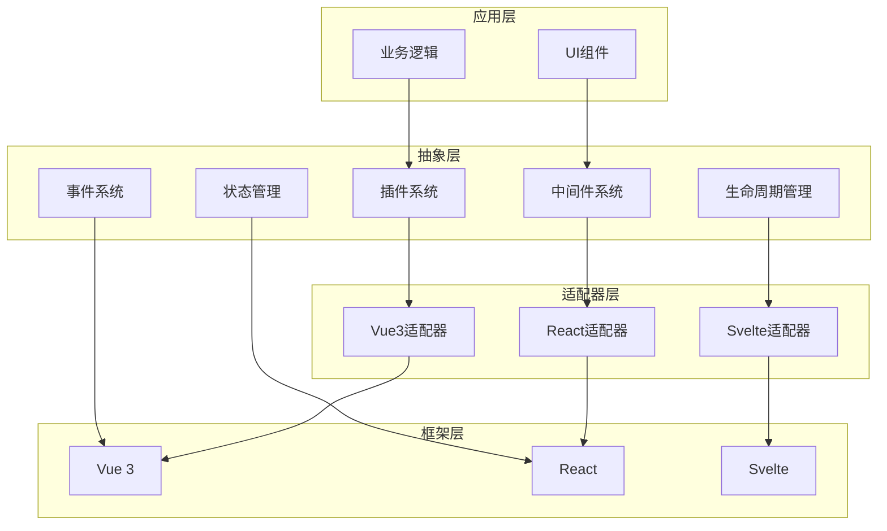

**图表来源**
- [packages/core/src/index.ts](file://packages/core/src/index.ts#L1-L40)
- [packages/vue3/src/index.ts](file://packages/vue3/src/index.ts#L1-L19)

### 可扩展性设计

系统采用高度模块化的设计，每个功能模块都可以独立扩展和替换：

- **插件系统**：支持第三方功能的无缝集成
- **中间件链**：支持多个中间件的组合使用
- **事件监听**：支持灵活的事件处理机制
- **状态管理**：支持全局状态的统一管理

**章节来源**
- [README.md](file://README.md#L110-L128)

## 架构概览

LDesign Engine 采用了两层架构设计，这种设计既保证了框架无关性，又提供了针对特定框架的优化支持。

### 整体架构图

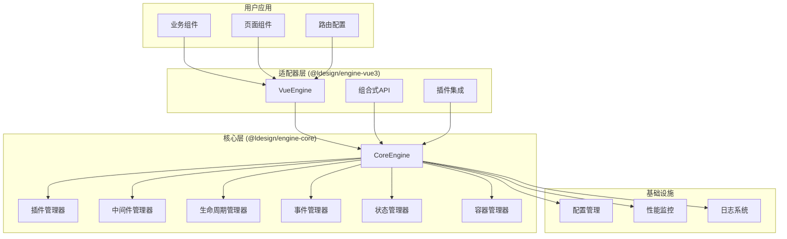

**图表来源**
- [packages/core/src/engine/core-engine.ts](file://packages/core/src/engine/core-engine.ts#L30-L60)
- [packages/vue3/src/engine/vue-engine.ts](file://packages/vue3/src/engine/vue-engine.ts#L74-L120)

### 核心引擎组件

核心引擎包含了系统的所有基础功能模块：

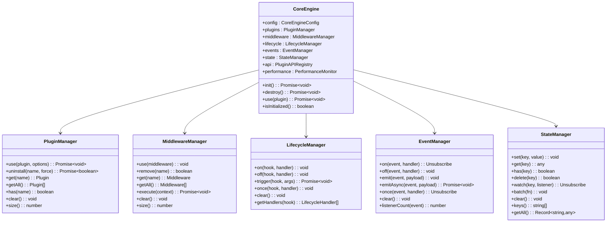

**图表来源**
- [packages/core/src/engine/core-engine.ts](file://packages/core/src/engine/core-engine.ts#L75-L100)
- [packages/core/src/plugin/plugin-manager.ts](file://packages/core/src/plugin/plugin-manager.ts#L42-L65)
- [packages/core/src/middleware/middleware-manager.ts](file://packages/core/src/middleware/middleware-manager.ts#L47-L70)

**章节来源**
- [packages/core/src/engine/core-engine.ts](file://packages/core/src/engine/core-engine.ts#L1-L100)

## 核心功能模块

### 插件系统

插件系统是 LDesign Engine 的核心特性之一，提供了强大的功能扩展能力。

#### 插件管理器功能

- **依赖管理**：自动处理插件间的依赖关系，支持循环依赖检测
- **版本控制**：支持插件版本管理和兼容性检查
- **生命周期**：完整的插件安装、卸载和热重载支持
- **热重载**：开发环境下的实时更新功能

#### 插件开发模式

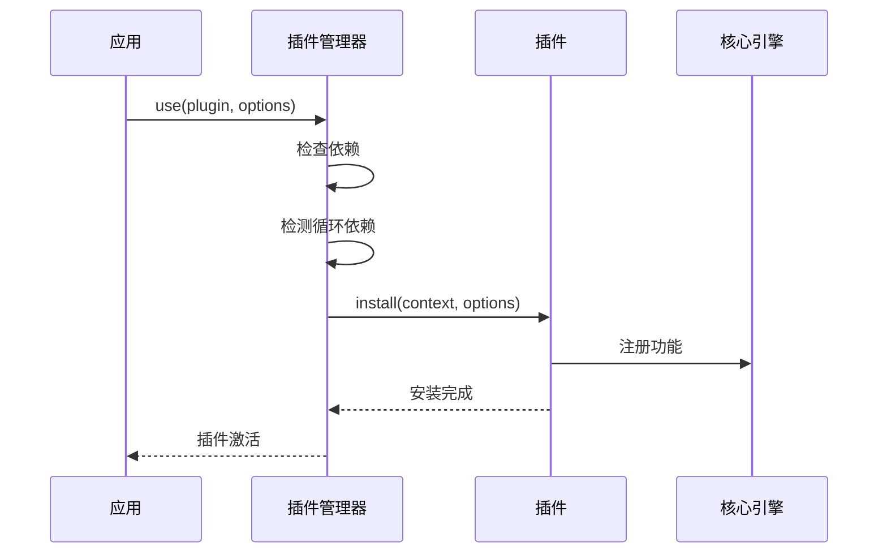

**图表来源**
- [packages/core/src/plugin/plugin-manager.ts](file://packages/core/src/plugin/plugin-manager.ts#L67-L140)

**章节来源**
- [packages/core/src/plugin/plugin-manager.ts](file://packages/core/src/plugin/plugin-manager.ts#L1-L100)

### 中间件系统

中间件系统提供了类似Koa/Express的中间件链处理机制，支持洋葱模型的请求处理流程。

#### 中间件特性

- **洋葱模型**：支持中间件的嵌套执行，每个中间件都可以决定是否继续执行下一个
- **优先级管理**：支持中间件的优先级排序，确保执行顺序
- **错误处理**：完善的错误处理机制，支持中间件级别的错误捕获
- **性能优化**：智能缓存和批量处理优化

#### 中间件执行流程

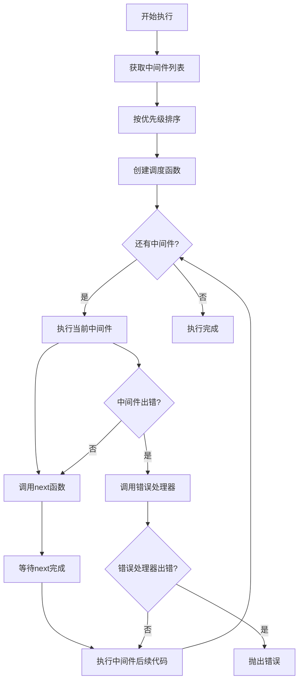

**图表来源**
- [packages/core/src/middleware/middleware-manager.ts](file://packages/core/src/middleware/middleware-manager.ts#L197-L258)

**章节来源**
- [packages/core/src/middleware/middleware-manager.ts](file://packages/core/src/middleware/middleware-manager.ts#L1-L100)

### 生命周期管理

生命周期管理器提供了统一的应用生命周期钩子管理，支持异步处理和错误隔离。

#### 核心生命周期钩子

- **beforeInit**：初始化前的准备工作
- **init**：核心初始化逻辑
- **afterInit**：初始化后的清理工作
- **beforeMount**：挂载前的准备
- **mounted**：应用已挂载
- **beforeUpdate**：更新前的处理
- **updated**：更新完成
- **beforeUnmount**：卸载前的清理
- **unmounted**：应用已卸载

#### 生命周期处理机制

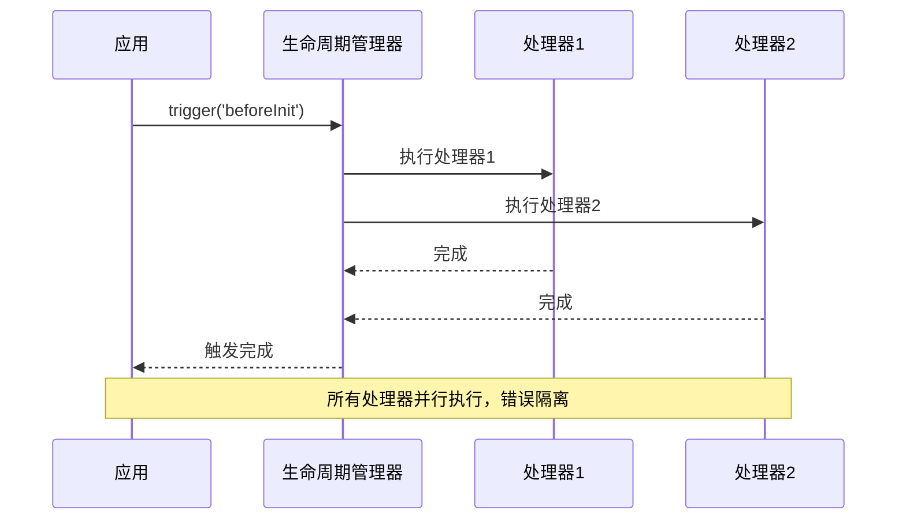

**图表来源**
- [packages/core/src/lifecycle/lifecycle-manager.ts](file://packages/core/src/lifecycle/lifecycle-manager.ts#L173-L208)

**章节来源**
- [packages/core/src/lifecycle/lifecycle-manager.ts](file://packages/core/src/lifecycle/lifecycle-manager.ts#L1-L100)

### 事件系统

事件系统基于发布-订阅模式，提供了高性能的事件处理机制。

#### 事件系统特性

- **通配符支持**：支持事件名称的通配符匹配
- **异步处理**：支持同步和异步事件处理
- **优先级管理**：支持事件处理器的优先级设置
- **内存优化**：智能的内存管理和泄漏防护

#### 事件处理流程

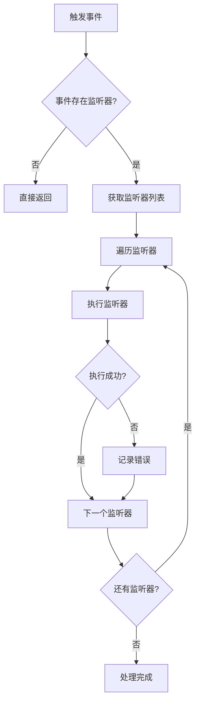

**图表来源**
- [packages/core/src/event/event-manager.ts](file://packages/core/src/event/event-manager.ts#L100-L133)

**章节来源**
- [packages/core/src/event/event-manager.ts](file://packages/core/src/event/event-manager.ts#L1-L100)

### 状态管理

状态管理系统提供了高性能的全局状态管理功能，支持状态监听和批量更新优化。

#### 状态管理特性

- **高性能存储**：基于Map的数据结构，提供O(1)的读写性能
- **状态监听**：支持状态变化的实时监听
- **批量更新**：支持批量状态更新，优化性能
- **内存优化**：自动清理无用的状态和监听器

#### 状态更新优化

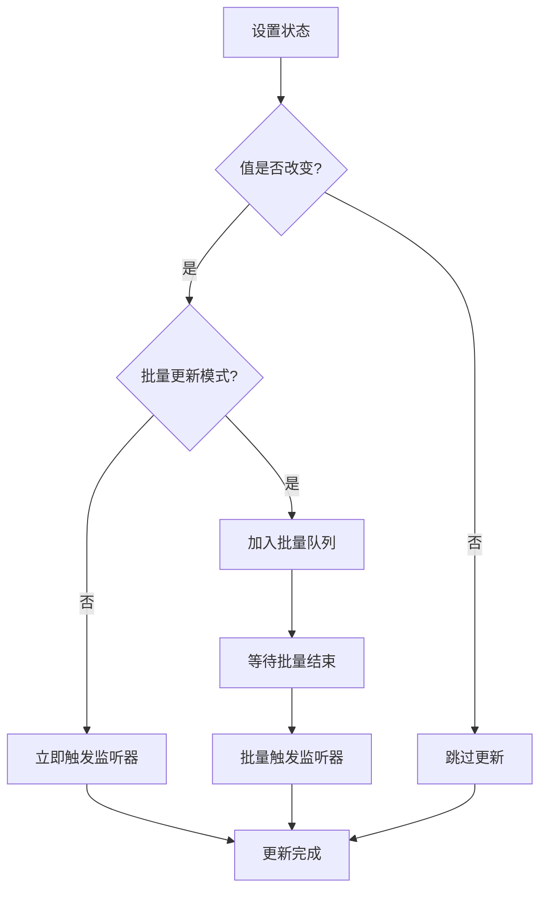

**图表来源**
- [packages/core/src/state/state-manager.ts](file://packages/core/src/state/state-manager.ts#L72-L90)

**章节来源**
- [packages/core/src/state/state-manager.ts](file://packages/core/src/state/state-manager.ts#L1-L100)

## 分层架构设计

LDesign Engine 采用了清晰的分层架构设计，每一层都有明确的职责和边界。

### 核心层（Core Layer）

核心层是整个系统的基石，包含了所有框架无关的核心功能。

#### 核心层职责

- **插件管理**：插件的安装、卸载、依赖管理和生命周期控制
- **中间件管理**：中间件链的执行和优先级管理
- **生命周期管理**：应用生命周期的统一管理
- **事件管理**：发布-订阅模式的事件系统
- **状态管理**：全局状态的统一管理
- **容器管理**：依赖注入和服务注册
- **配置管理**：应用配置的统一管理
- **性能监控**：系统性能的监控和统计

#### 核心层架构

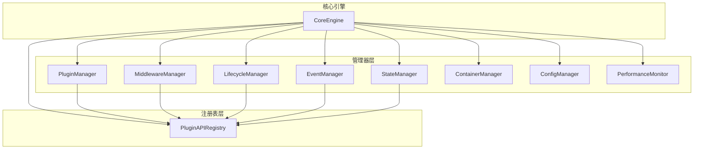

**图表来源**
- [packages/core/src/engine/core-engine.ts](file://packages/core/src/engine/core-engine.ts#L118-L138)

### 适配器层（Adapter Layer）

适配器层负责将核心引擎的功能桥接到具体的前端框架。

#### 适配器层特点

- **框架特定优化**：针对特定框架的性能优化
- **API封装**：提供框架友好的API接口
- **组合式函数**：提供Vue 3风格的组合式API
- **插件集成**：与框架原生插件系统的集成

#### 适配器层架构

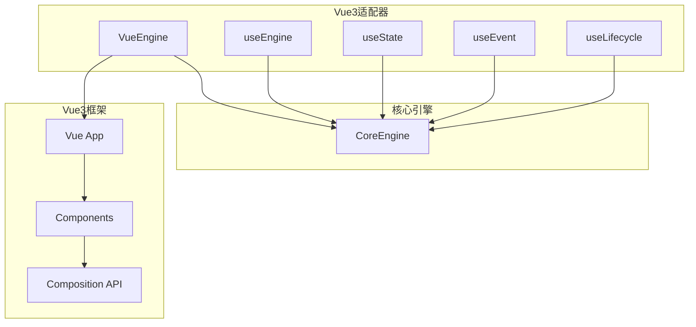

**图表来源**
- [packages/vue3/src/engine/vue-engine.ts](file://packages/vue3/src/engine/vue-engine.ts#L74-L120)

**章节来源**
- [packages/core/src/engine/core-engine.ts](file://packages/core/src/engine/core-engine.ts#L1-L100)
- [packages/vue3/src/engine/vue-engine.ts](file://packages/vue3/src/engine/vue-engine.ts#L1-L100)

## 框架适配器系统

LDesign Engine 支持多种前端框架，每种框架都有对应的适配器。

### 支持的框架

- **Vue 3**：完整的Vue 3适配器，提供组合式API
- **React**：React适配器，支持Hooks模式
- **Svelte**：Svelte适配器，支持Svelte Store
- **Solid**：Solid适配器，支持Solid Signal
- **Angular**：Angular适配器，支持Angular DI

### 适配器设计原则

#### 统一API设计

所有适配器都提供相同的API接口，确保开发者在不同框架间切换时无需学习新的概念：

```typescript
// 所有框架的统一API
import { createEngineApp } from '@ldesign/engine-vue3' // 或 react, svelte 等
import { definePlugin } from '@ldesign/engine-core'

const engine = await createEngineApp({
  rootComponent: App,
  mountElement: '#app',
  plugins: [myPlugin],
  middleware: [myMiddleware],
})
```

#### 框架特定优化

每个适配器都会针对特定框架进行优化：

- **Vue 3**：提供组合式API，支持响应式数据绑定
- **React**：提供Hooks模式，支持函数组件
- **Svelte**：集成Svelte Store，支持声明式状态管理

### Vue 3适配器详解

Vue 3适配器是最成熟的实现，提供了最丰富的功能。

#### Vue 3适配器特性

- **组合式API**：提供useEngine、useState、useEvent等组合式函数
- **依赖注入**：集成Vue的依赖注入系统
- **插件集成**：与Vue插件生态系统的无缝集成
- **路由支持**：内置路由功能支持

#### Vue 3适配器架构

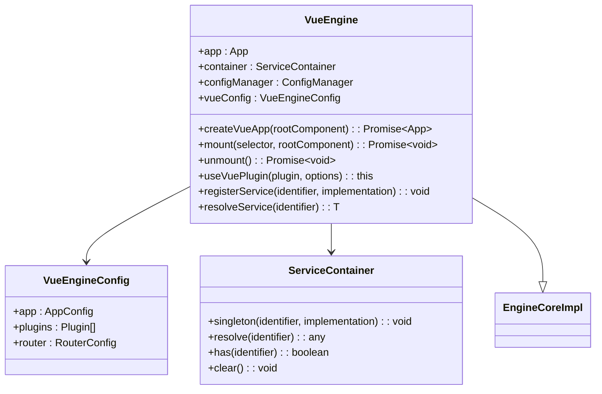

**图表来源**
- [packages/vue3/src/engine/vue-engine.ts](file://packages/vue3/src/engine/vue-engine.ts#L74-L120)

**章节来源**
- [packages/vue3/src/engine/vue-engine.ts](file://packages/vue3/src/engine/vue-engine.ts#L1-L100)

## 插件化生态系统

插件系统是 LDesign Engine 的核心特色，提供了强大的功能扩展能力。

### 插件开发模式

#### 插件定义

```typescript
import { definePlugin } from '@ldesign/engine-core'

const myPlugin = definePlugin({
  name: 'my-plugin',
  version: '1.0.0',
  dependencies: ['i18n'],
  
  install(context, options) {
    const { engine } = context
    
    // 注册状态
    engine.state.set('myPlugin:config', options)
    
    // 注册事件监听
    engine.events.on('app:ready', () => {
      console.log('Plugin activated')
    })
  },
  
  uninstall(context) {
    // 清理资源
    context.engine.state.delete('myPlugin:config')
  }
})
```

#### 插件管理器功能

插件管理器提供了完整的插件生命周期管理：

- **依赖解析**：自动解析和安装插件依赖
- **循环检测**：检测和防止循环依赖
- **版本兼容**：检查插件版本兼容性
- **热重载**：开发环境下的实时更新
- **卸载保护**：防止误卸载被依赖的插件

### 插件通信机制

#### 状态管理通信

插件间可以通过状态管理进行数据共享：

```typescript
// 插件A
engine.state.set('shared:data', { count: 0 })

// 插件B
engine.state.watch('shared:data', (newValue, oldValue) => {
  console.log('Data changed:', newValue)
})
```

#### 事件系统通信

插件间可以通过事件系统进行松耦合通信：

```typescript
// 插件A
engine.events.emit('myPlugin:dataUpdated', { count: 10 })

// 插件B
engine.events.on('myPlugin:dataUpdated', (data) => {
  console.log('Received update:', data)
})
```

### 插件最佳实践

#### 1. 使用命名空间

避免插件间的状态键和事件名冲突：

```typescript
// ✅ 推荐：使用命名空间
engine.state.set('myPlugin:config', options)
engine.events.emit('myPlugin:initialized')

// ❌ 不推荐：使用通用键名
engine.state.set('config', options)
engine.events.emit('initialized')
```

#### 2. 声明可选依赖

优雅地处理插件依赖关系：

```typescript
const myPlugin = definePlugin({
  name: 'my-plugin',
  dependencies: [], // 不强制依赖其他插件
  
  install(context) {
    // 尝试获取可选依赖
    let i18nInstance = null
    if (context.container?.has('i18n')) {
      i18nInstance = context.container.resolve('i18n')
    }
    
    // 使用默认值或可选功能
    const locale = i18nInstance?.getLocale() || 'en-US'
  }
})
```

**章节来源**
- [packages/core/src/plugin/plugin-manager.ts](file://packages/core/src/plugin/plugin-manager.ts#L1-L100)

## 中间件系统

中间件系统提供了强大的请求处理能力，支持洋葱模型的中间件链。

### 中间件特性

#### 洋葱模型

中间件采用洋葱模型，每个中间件都可以决定是否继续执行下一个：

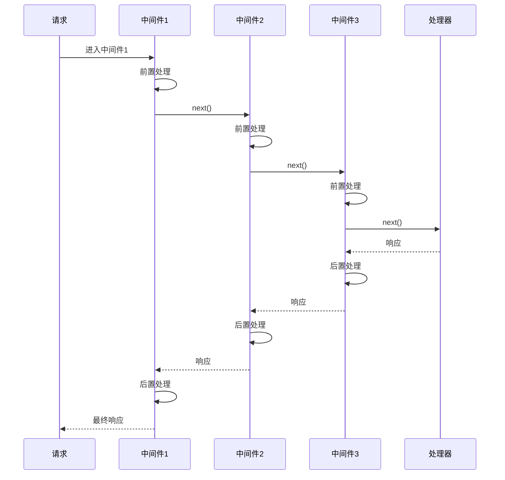

#### 优先级管理

中间件支持优先级设置，确保执行顺序：

```typescript
const middlewareManager = createMiddlewareManager()

middlewareManager.use({
  name: 'auth',
  priority: 100, // 高优先级
  execute(ctx, next) {
    // 认证逻辑
    await next()
  }
})

middlewareManager.use({
  name: 'logging',
  priority: 10, // 低优先级
  execute(ctx, next) {
    console.log('Request:', ctx)
    await next()
    console.log('Response:', ctx)
  }
})
```

### 中间件应用场景

#### 1. 请求认证

```typescript
const authMiddleware = defineMiddleware({
  name: 'auth',
  priority: 90,
  
  async execute(context, next) {
    const token = context.headers['authorization']
    
    if (!token) {
      context.cancelled = true
      context.response = { error: 'Unauthorized' }
      return
    }
    
    try {
      const user = await verifyToken(token)
      context.user = user
      await next()
    } catch (error) {
      context.cancelled = true
      context.response = { error: 'Invalid token' }
    }
  }
})
```

#### 2. 请求日志

```typescript
const loggingMiddleware = defineMiddleware({
  name: 'logging',
  priority: 10,
  
  execute(context, next) {
    const startTime = Date.now()
    
    console.log(`[${new Date().toISOString()}] ${context.method} ${context.url}`)
    
    return next().then(() => {
      const duration = Date.now() - startTime
      console.log(`[${new Date().toISOString()}] ${context.method} ${context.url} - ${duration}ms`)
    })
  }
})
```

**章节来源**
- [packages/core/src/middleware/middleware-manager.ts](file://packages/core/src/middleware/middleware-manager.ts#L1-L100)

## 生命周期管理

生命周期管理器提供了统一的应用生命周期钩子管理，支持异步处理和错误隔离。

### 核心生命周期阶段

#### 初始化阶段

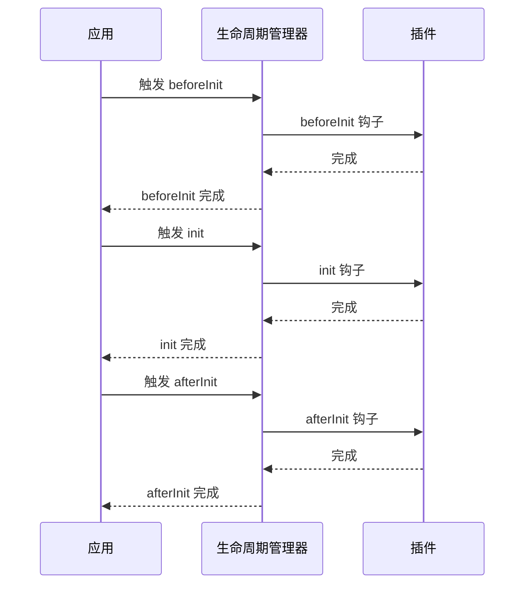

#### 应用运行阶段

- **beforeMount**：挂载前的准备工作
- **mounted**：应用已挂载，可以开始正常运行
- **beforeUpdate**：更新前的处理
- **updated**：更新完成
- **beforeUnmount**：卸载前的清理
- **unmounted**：应用已卸载

### 生命周期钩子使用

#### 注册生命周期钩子

```typescript
// 注册钩子
engine.lifecycle.on('mounted', async () => {
  console.log('Application mounted')
  await loadInitialData()
})

// 一次性钩子
engine.lifecycle.once('init', () => {
  console.log('Initialization completed')
})

// 移除钩子
const unsubscribe = engine.lifecycle.on('beforeUpdate', handler)
unsubscribe() // 取消监听
```

#### 异步处理

生命周期钩子支持异步处理，可以执行异步操作：

```typescript
engine.lifecycle.on('beforeMount', async () => {
  try {
    // 加载配置
    await loadConfiguration()
    
    // 初始化服务
    await initializeServices()
    
    // 验证权限
    await verifyPermissions()
  } catch (error) {
    console.error('Initialization failed:', error)
    // 可以在这里处理初始化失败的情况
  }
})
```

### 错误处理机制

生命周期管理器提供了完善的错误处理机制：

```typescript
// 单个钩子错误不影响其他钩子
engine.lifecycle.on('mounted', async () => {
  // 这个错误不会影响其他钩子
  await someAsyncOperation()
})

// 错误隔离：即使某个钩子出错，其他钩子仍然会执行
engine.lifecycle.on('mounted', async () => {
  // 这个钩子会正常执行
  console.log('Other mounted handler')
})
```

**章节来源**
- [packages/core/src/lifecycle/lifecycle-manager.ts](file://packages/core/src/lifecycle/lifecycle-manager.ts#L1-L100)

## 事件系统

事件系统基于发布-订阅模式，提供了高性能的事件处理机制。

### 事件系统特性

#### 通配符支持

支持事件名称的通配符匹配：

```typescript
// 精确匹配
engine.events.on('user:login', (user) => {
  console.log('User logged in:', user)
})

// 通配符匹配
engine.events.on('user:*', (userData) => {
  console.log('User event:', userData)
})

// 匹配所有事件
engine.events.on('*', (eventName, eventData) => {
  console.log('Any event:', eventName, eventData)
})
```

#### 异步事件处理

支持同步和异步事件处理：

```typescript
// 同步事件
engine.events.emit('data:updated', { count: 100 })

// 异步事件
await engine.events.emitAsync('data:save', data)
console.log('All async handlers completed')
```

### 事件系统架构

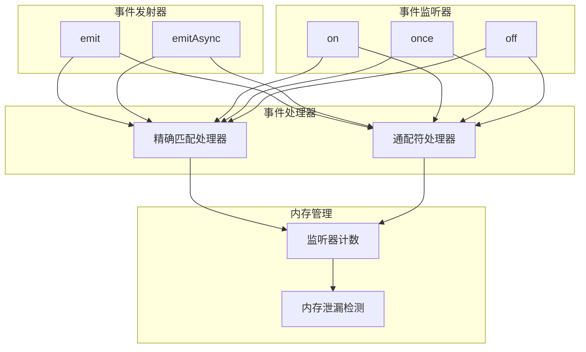

**图表来源**
- [packages/core/src/event/event-manager.ts](file://packages/core/src/event/event-manager.ts#L65-L100)

### 事件系统最佳实践

#### 1. 使用命名空间

避免事件名称冲突：

```typescript
// ✅ 推荐：使用命名空间
engine.events.emit('auth:userLoggedIn', user)
engine.events.on('auth:*', (data) => {
  console.log('Auth event:', data)
})

// ❌ 不推荐：使用通用名称
engine.events.emit('loggedIn', user)
engine.events.on('*', (eventName, data) => {
  console.log('Event:', eventName, data)
})
```

#### 2. 及时清理监听器

防止内存泄漏：

```typescript
// ✅ 推荐：及时清理
const unsubscribe = engine.events.on('data:updated', handler)
// 使用完毕后清理
unsubscribe()

// 或者使用一次性监听器
engine.events.once('app:ready', () => {
  console.log('App is ready!')
})
```

#### 3. 错误处理

事件处理器中的错误不会影响其他处理器：

```typescript
engine.events.on('process:data', (data) => {
  try {
    processData(data)
  } catch (error) {
    console.error('Error processing data:', error)
    // 错误被捕获，不会影响其他处理器
  }
})
```

**章节来源**
- [packages/core/src/event/event-manager.ts](file://packages/core/src/event/event-manager.ts#L1-L100)

## 状态管理

状态管理系统提供了高性能的全局状态管理功能，支持状态监听和批量更新优化。

### 状态管理特性

#### 高性能存储

基于Map的数据结构，提供O(1)的读写性能：

```typescript
// 设置状态
engine.state.set('user', { name: 'Alice', age: 25 })

// 获取状态
const user = engine.state.get('user')

// 检查状态是否存在
if (engine.state.has('user')) {
  console.log('User exists')
}
```

#### 状态监听

支持状态变化的实时监听：

```typescript
// 监听状态变化
const unwatch = engine.state.watch('user', (newValue, oldValue) => {
  console.log('User changed:', { oldValue, newValue })
})

// 取消监听
unwatch()
```

#### 批量更新优化

支持批量状态更新，优化性能：

```typescript
// 不使用批量更新：触发多次监听器
engine.state.set('count', 1)
engine.state.set('total', 100)
engine.state.set('status', 'ready')

// 使用批量更新：只触发一次监听器
engine.state.batch(() => {
  engine.state.set('count', 1)
  engine.state.set('total', 100)
  engine.state.set('status', 'ready')
})
```

### 状态管理架构

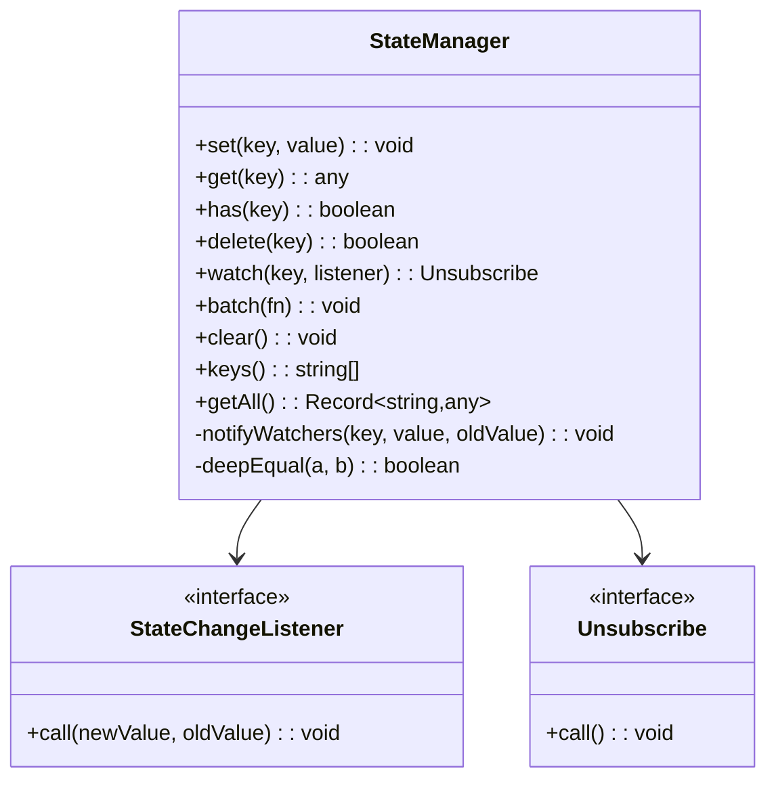

**图表来源**
- [packages/core/src/state/state-manager.ts](file://packages/core/src/state/state-manager.ts#L43-L80)

### 状态管理最佳实践

#### 1. 使用命名空间

避免状态键冲突：

```typescript
// ✅ 推荐：使用命名空间
engine.state.set('auth:currentUser', user)
engine.state.set('ui:theme', 'dark')

// ❌ 不推荐：使用通用键名
engine.state.set('currentUser', user)
engine.state.set('theme', 'dark')
```

#### 2. 批量更新

在需要频繁更新状态时使用批量更新：

```typescript
// ✅ 推荐：批量更新
engine.state.batch(() => {
  engine.state.set('loading', true)
  engine.state.set('data', null)
  engine.state.set('error', null)
})

// ❌ 不推荐：逐个更新
engine.state.set('loading', true)
engine.state.set('data', null)
engine.state.set('error', null)
```

#### 3. 状态清理

及时清理不再需要的状态：

```typescript
// ✅ 推荐：清理临时状态
engine.state.set('temp:processing', true)
// 处理完成后清理
engine.state.delete('temp:processing')

// 或者使用一次性状态
engine.state.once('data:loaded', (data) => {
  // 处理数据
  processLoadedData(data)
})
```

**章节来源**
- [packages/core/src/state/state-manager.ts](file://packages/core/src/state/state-manager.ts#L1-L100)

## 性能优化特性

LDesign Engine 在设计时充分考虑了性能优化，提供了多项性能提升特性。

### 核心性能优化

#### 1. 智能缓存机制

中间件管理器使用智能缓存来优化性能：

```typescript
// 中间件管理器的缓存优化
private sortedCache: Middleware[] | null = null

async execute<T = any>(context: MiddlewareContext<T>): Promise<void> {
  // 使用缓存的排序结果
  if (!this.sortedCache) {
    this.sortedCache = this.getSortedMiddlewares()
  }
  
  const sortedMiddlewares = this.sortedCache
  // 执行中间件链...
}
```

#### 2. 批量更新优化

状态管理系统支持批量更新，减少监听器触发次数：

```typescript
// 批量更新优化
engine.state.batch(() => {
  // 这里所有的状态更新只会触发一次监听器
  engine.state.set('a', 1)
  engine.state.set('b', 2)
  engine.state.set('c', 3)
})
```

#### 3. 内存泄漏防护

系统提供了完善的内存泄漏防护机制：

```typescript
// 监听器计数和内存泄漏检测
setMaxListeners(n: number): void {
  this.maxListeners = n
}

// 每个事件类型的监听器数量警告
if (handlers.size > this.maxListeners) {
  console.warn(`Possible memory leak detected: ${handlers.size} listeners`)
}
```

### 性能监控

#### 性能监控器

```typescript
// 性能监控器提供详细的性能指标
const performanceMonitor = createPerformanceMonitor({
  enabled: true,
  debug: true
})

// 监控指标包括：
// - 插件安装时间
// - 中间件执行时间
// - 事件触发频率
// - 内存使用情况
```

### 性能优化最佳实践

#### 1. 合理使用批量更新

```typescript
// ✅ 推荐：在大量状态更新时使用批量更新
engine.state.batch(() => {
  for (let i = 0; i < 1000; i++) {
    engine.state.set(`item-${i}`, { value: i })
  }
})

// ❌ 不推荐：逐个更新
for (let i = 0; i < 1000; i++) {
  engine.state.set(`item-${i}`, { value: i })
}
```

#### 2. 及时清理监听器

```typescript
// ✅ 推荐：及时清理监听器
const unsubscribe = engine.state.watch('user', handler)
// 使用完毕后清理
unsubscribe()

// 或者使用一次性监听器
engine.state.once('data:loaded', () => {
  console.log('Data loaded')
})
```

#### 3. 避免过度监听

```typescript
// ✅ 推荐：合理使用监听器
engine.state.watch('important:data', handler)

// ❌ 不推荐：监听过多不必要的状态
engine.state.watch('*', (key, value) => {
  console.log('State changed:', key, value)
})
```

**章节来源**
- [packages/core/src/middleware/middleware-manager.ts](file://packages/core/src/middleware/middleware-manager.ts#L197-L258)
- [packages/core/src/state/state-manager.ts](file://packages/core/src/state/state-manager.ts#L229-L250)

## 开发指南

### 环境搭建

#### 安装依赖

```bash
# Vue 3 项目
pnpm add @ldesign/engine-vue3

# Vue 2 项目
pnpm add @ldesign/engine-vue2

# React 项目
pnpm add @ldesign/engine-react
```

#### 基础使用

```typescript
import { createEngineApp } from '@ldesign/engine-vue3'
import App from './App.vue'

// 创建引擎应用
const engine = await createEngineApp({
  rootComponent: App,
  mountElement: '#app',
  config: {
    name: 'My App',
    debug: true
  }
})
```

### 插件开发

#### 创建插件

```typescript
import { definePlugin } from '@ldesign/engine-core'

const myPlugin = definePlugin({
  name: 'my-plugin',
  version: '1.0.0',
  dependencies: ['i18n'],
  
  install(context, options) {
    const { engine } = context
    
    // 注册状态
    engine.state.set('myPlugin:config', options)
    
    // 注册事件监听
    engine.events.on('app:ready', () => {
      console.log('Plugin activated')
    })
  }
})
```

#### 使用插件

```typescript
const engine = await createEngineApp({
  rootComponent: App,
  mountElement: '#app',
  plugins: [myPlugin]
})
```

### 中间件开发

#### 创建中间件

```typescript
import { defineMiddleware } from '@ldesign/engine-core'

const authMiddleware = defineMiddleware({
  name: 'auth',
  priority: 90,
  
  async execute(context, next) {
    const token = context.headers['authorization']
    
    if (!token) {
      context.cancelled = true
      context.response = { error: 'Unauthorized' }
      return
    }
    
    try {
      const user = await verifyToken(token)
      context.user = user
      await next()
    } catch (error) {
      context.cancelled = true
      context.response = { error: 'Invalid token' }
    }
  }
})
```

#### 使用中间件

```typescript
const engine = await createEngineApp({
  rootComponent: App,
  mountElement: '#app',
  middleware: [authMiddleware]
})
```

### 组合式API使用

#### Vue 3 组合式API

```vue
<script setup>
import { useEngine, useState, useEvent, useLifecycle } from '@ldesign/engine-vue3'

const engine = useEngine()
const count = useState('count', 0)

useEvent('count:updated', (newCount) => {
  count.value = newCount
})

useLifecycle('mounted', () => {
  engine.state.set('appName', 'My App')
})
</script>
```

**章节来源**
- [README.md](file://README.md#L45-L100)
- [packages/vue3/README.md](file://packages/vue3/README.md#L1-L50)

## 最佳实践

### 插件开发最佳实践

#### 1. 使用命名空间

```typescript
// ✅ 推荐：使用命名空间
engine.state.set('myPlugin:config', options)
engine.events.emit('myPlugin:initialized')

// ❌ 不推荐：使用通用键名
engine.state.set('config', options)
engine.events.emit('initialized')
```

#### 2. 声明可选依赖

```typescript
const myPlugin = definePlugin({
  name: 'my-plugin',
  dependencies: [],
  
  install(context) {
    // 尝试获取可选依赖
    let i18nInstance = null
    if (context.container?.has('i18n')) {
      i18nInstance = context.container.resolve('i18n')
    }
    
    const locale = i18nInstance?.getLocale() || 'en-US'
  }
})
```

#### 3. 错误处理

```typescript
const myPlugin = definePlugin({
  name: 'my-plugin',
  
  install(context) {
    try {
      // 可能出错的操作
      initializeFeature()
    } catch (error) {
      console.error('Plugin initialization failed:', error)
      // 不要抛出错误，避免影响其他插件
    }
  }
})
```

### 状态管理最佳实践

#### 1. 批量更新

```typescript
// ✅ 推荐：批量更新
engine.state.batch(() => {
  engine.state.set('loading', true)
  engine.state.set('data', null)
  engine.state.set('error', null)
})

// ❌ 不推荐：逐个更新
engine.state.set('loading', true)
engine.state.set('data', null)
engine.state.set('error', null)
```

#### 2. 状态清理

```typescript
// ✅ 推荐：清理临时状态
engine.state.set('temp:processing', true)
// 处理完成后清理
engine.state.delete('temp:processing')

// 或者使用一次性状态
engine.state.once('data:loaded', (data) => {
  processLoadedData(data)
})
```

### 事件系统最佳实践

#### 1. 及时清理监听器

```typescript
// ✅ 推荐：及时清理
const unsubscribe = engine.events.on('data:updated', handler)
// 使用完毕后清理
unsubscribe()

// 或者使用一次性监听器
engine.events.once('app:ready', () => {
  console.log('App is ready!')
})
```

#### 2. 错误隔离

```typescript
engine.events.on('process:data', (data) => {
  try {
    processData(data)
  } catch (error) {
    console.error('Error processing data:', error)
    // 错误被捕获，不会影响其他处理器
  }
})
```

### 中间件最佳实践

#### 1. 合理设置优先级

```typescript
// ✅ 推荐：合理的优先级设置
const authMiddleware = defineMiddleware({
  name: 'auth',
  priority: 90, // 高优先级
  execute: authHandler
})

const loggingMiddleware = defineMiddleware({
  name: 'logging',
  priority: 10, // 低优先级
  execute: loggingHandler
})
```

#### 2. 错误处理

```typescript
const errorHandlingMiddleware = defineMiddleware({
  name: 'error-handler',
  priority: 1000, // 最高优先级
  
  execute(context, next) {
    try {
      return next()
    } catch (error) {
      console.error('Global error:', error)
      context.response = { error: 'Internal server error' }
      context.cancelled = true
    }
  }
})
```

### 性能优化最佳实践

#### 1. 合理使用缓存

```typescript
// ✅ 推荐：利用中间件缓存
const middlewareManager = createMiddlewareManager()
middlewareManager.use(middleware1)
middlewareManager.use(middleware2)
// 中间件列表会被缓存，提高执行效率
```

#### 2. 避免过度监听

```typescript
// ✅ 推荐：合理使用监听器
engine.state.watch('important:data', handler)

// ❌ 不推荐：监听过多不必要的状态
engine.state.watch('*', (key, value) => {
  console.log('State changed:', key, value)
})
```

这些最佳实践有助于构建高性能、可维护的LDesign Engine应用程序。

**章节来源**
- [README.md](file://README.md#L129-L408)